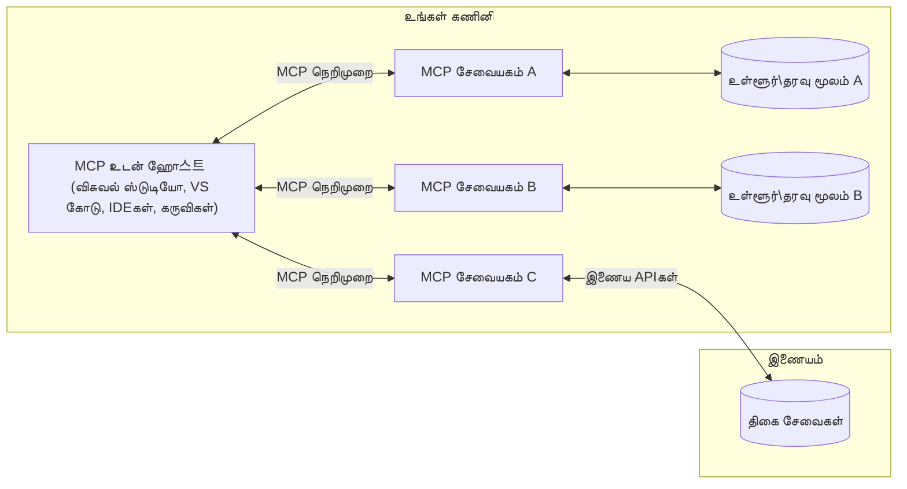

# MCP கோர் கருத்துக்கள்: AI ஒருங்கிணைக்க Model Context Protocolயை தேர்ச்சி பெறுதல்

[](https://youtu.be/earDzWGtE84)

_(இந்த பாடத்தின் வீடியோவை பார்க்க மேலே உள்ள படத்தை கிளிக் செய்க)_

[Model Context Protocol (MCP)](https://github.com/modelcontextprotocol) என்பது பெரும் மொழி மாதிரிகளும் (LLMs) மற்றும் வெளியே உள்ள கருவிகள், செயலிகள் மற்றும் தரவு மூலகங்களுக்குமான தொடர்பை மேம்படுத்தும் சக்திவாய்ந்த, நிலையான கட்டமைப்பாகும்.  
இந்த வழிகாட்டியில் MCPயின் கோர் கருத்துக்களை பற்றி அறிந்துகொள்ளலாம். இதன்மூலம் தீராம்படைக்கப்பட்ட கோரிக்கை-செவிலியர் கட்டமைப்பு, அத்தியாவசிய கூறுகள், தொடர்பு முறைகள் மற்றும் செயல்படுத்தும் சிறந்த நடைமுறைகள் குறித்து வரலாறு பெறலாம்.

- **தெளிவான பயனர் ஒப்புதல்**: அனைத்து தரவு அணுகல் மற்றும் செயல்பாடுகள் செயல்படுத்துவதற்கு முன் தெளிவான பயனர் ஒப்புதல் தேவை. பயனர்கள் எந்த தரவை அணுகப்போகிறார்கள் மற்றும் செயல்படுத்தபோகும் நடவடிக்கைகள் என்ன என்பதை தெளிவாக அறிந்து இருக்க வேண்டும், அனுமதிகள் மற்றும் அதிகாரங்கள் மீது விரிவான கட்டுப்பாடுடன்.

- **தரவு தனியுரிமை காப்பு**: பயனர் தரவு தெளிவான ஒப்புதலுடன் மட்டுமே வெளிப்படுத்தப்படுகிறது மற்றும் முழு தொடர்பு வாழ்க்கை சுழற்சியில் பாதுகாப்பான அணுகல் கட்டுப்பாடுகளால் பாதுகாக்கப்பட வேண்டும். செயல்படுத்தல்கள் அனுமதியில்லாத தரவு பரிமாற்றத்தை தடுப்பது மற்றும் கடுமையான தனியுரிமை எல்லைகளை பின்பற்ற வேண்டும்.

- **கருவி செயல்படுத்தல் பாதுகாப்பு**: ஒவ்வொரு கருவி அழைப்பும் தெளிவான பயனர் ஒப்புதலைக் கொண்டிருக்க வேண்டும், அதனால் கருவியின் செயல்பாடு, அளவுருக்கள் மற்றும் சாத்திய பாதிப்புகள் புரிந்திருக்க வேண்டும். வலுவான பாதுகாப்பு எல்லைகள் தவறான, பாதுகாப்பற்ற அல்லது தீங்கு விளைவிக்கும் கருவி செயல்பாட்டை தடுக்கும்.

- **பரிமாற்ற அடுக்கு பாதுகாப்பு**: அனைத்து தொடர்பு நெட்வொர்க் வழிகளும் பொருத்தமான குறியாக்கம் மற்றும் அங்கீகார முறைகள் மூலம் செயல்படுத்தப்பட வேண்டும். தொலைநிலை இணைப்புகள் பாதுகாப்பான பரிமாற்ற புரொடோகால்கள் மற்றும் சரியான அடையாள நிர்வாகத்துடன் செயல்படுத்தப்பட வேண்டும்.

#### செயல்படுத்தும் வழிகாட்டுதல்கள்:

- **அனுமதி நிர்வாகம்**: பயனர்களுக்கு எந்த சர்வர்கள், கருவிகள் மற்றும் வளங்களை அணுக அனுமதிக்கும் என்பதைப் பராமரிக்கும் நுட்பமான அனுமதி அமைப்புகளை செயல்படுத்தவும்  
- **அங்கீகாரம் & அதிகாரம்**: பாதுகாப்பான அங்கீகார முறைகள் (OAuth, API விசைகள்) மற்றும் சரியான டோக்கன் நிர்வாகம் மற்றும் காலாவதியாக்வு கொண்டபடி பயன்படுத்தவும்  
- **உள்ளீட்டு சரிபார்ப்பு**: வரையறுக்கப்பட்ட திட்டங்களின்படி அனைத்து அளவுருக்கள் மற்றும் தரவு உள்ளீடுகளை சரிபார்க்கவும், சுருள் தாக்குதல்களை தடுக்கும் வகையில்  
- **ஆடிட் பதிவேட்டுகள்**: பாதுகாப்பு கண்காணிப்பு மற்றும் ஒத்துழைவுக்கு அனைத்துச் செயல்பாடுகளின் விரிவான பதிவுகளை பராமரிக்கவும்

## பார்வை

இந்த பாடம் Model Context Protocol (MCP) சுற்றுச்சூழல் அடிப்படையிலான கட்டமைப்பு மற்றும் கூறுகளை ஆராய்கிறது. நீங்கள் கிளையாண்ட்-சேவையகம் கட்டமைப்பு, முக்கிய கூறுகள் மற்றும் MCP தொடர்பு முறைகள் பற்றிய அறிவை பெறுவீர்கள்.

## முக்கிய கற்றல் இலக்குகள்

இந்த பாடத்தின் முடிவில், நீங்கள்:

- MCP கிளையாண்ட்-சேவையகம் கட்டமைப்பை புரிந்துகொள்வீர்கள்.  
- ஹோஸ்ட்கள், கிளையாண்ட் மற்றும் சர்வர்கள் என்ற பாத்திரங்கள் மற்றும் பொறுப்புகளை அடையாளம் காண்பீர்கள்.  
- MCPஐ லிரந்த ஒருங்கிணைப்பு அடுக்கு ஆக்கும் முக்கிய அம்சங்களை பகுப்பாய்வு செய்யலாம்.  
- MCP சுற்றுச்சூழலில் தகவல் ஓட்டத்தை புரிந்துகொள்வீர்கள்.  
- .NET, ஜாவா, பைதான் மற்றும் ஜாவாஸ்கிரிப்ட் நிறைவான குறியீடு உதாரணங்களின் மூலமாக நடைமுறை அறிவைப் பெறுவீர்கள்.

## MCP கட்டமைப்பு: ஆழமான பார்வை

MCP சுற்றுச்சூழல் ஒரு கிளையாண்ட்-சேவையகம் மாதிரியில் கட்டமைக்கப்பட்டுள்ளது. இந்த மிகைப்படுத்தப்பட்ட கட்டமைப்பு AI செயலிகள் கருவிகள், தரவுத்தளங்கள், APIகள் மற்றும் சூழலியல் வளங்களுடன் எளிதாக தொடர்பு கொள்ள உதவுகிறது. இந்த கட்டமைப்பின் கோர் கூறுகளை நாமே பிரிப்போம்.

அதன் அடிப்படையில் MCP ஒரு கிளையாண்ட்-சேவையகம் கட்டமைப்பைக் பின்பற்றுகிறது, அங்கு ஒரு ஹோஸ்ட் செயலி பல சர்வர்களுடன் இணைக்கலாம்:  


- **MCP ஹோஸ்ட்கள்**: VSCode, Claude Desktop, IDEகள், MCP மூலம் தரவை அணுக விரும்பும் AI கருவிகள் போன்ற செயலிகள்  
- **MCP கிளையாண்ட்**: சர்வர்களுடன் 1:1 இணைப்புகளை பராமரிக்கும் புரொடோகால் கிளையாண்ட்  
- **MCP சர்வர்கள்**: ஒவ்வொரு கருவும் Model Context Protocol வழியாக குறிப்பிட்ட திறன்களை வெளிப்படுத்தும் ஒளி எடைநிலையான செயலிகள்  
- **உள்ளூர் தரவு மூலங்கள்**: உங்கள் கணினி கோப்புகள், தரவுத்தளங்கள் மற்றும் MCP சர்வர்கள் பாதுகாப்பாக அணுகக்கூடிய சேவைகள்  
- **தொலை சேவைகள்**: இணையத்தில் கிடைக்கும் வெளிப்புற அமைப்புகள், MCP சர்வர்கள் APIகளின் மூலம் இணைக்கக்கூடியவை.

MCP புரொடோகால் நாள்காணி அடிப்படைகளில் மேம்படும் நிலையானது (YYYY-MM-DD வடிவத்தில்). தற்போதைய புரொடோகால் பதிப்பு **2025-11-25**. [புரொடோகால் குறிப்புரு](https://modelcontextprotocol.io/specification/2025-11-25/)யின் புதிய அப்டேட்களை நீங்கள் காணலாம்.

### 1. ஹோஸ்ட்கள்

Model Context Protocol (MCP)யில், **ஹோஸ்ட்கள்** என்பது பயனர்கள் புரொடோகாலுடன் தொடர்பு கொள்ளும் முதன்மை இடைமுகமாக செயல்படும் AI செயலிகள் ஆகும். ஹோஸ்ட்கள் ஒருங்கிணைத்துப் பல MCP சர்வருக்கு இடையேயான இணைப்புகளை பராமரிக்க, ஒவ்வொரு சர்வர் இணைப்புக்கும் தனி MCP கிளையாண்ட் உருவாக்குகின்றன. ஹோஸ்ட் எடுத்துக்காட்டுக்களில்:

- **AI செயலிகள்**: Claude Desktop, Visual Studio Code, Claude Code  
- **முன்னேற்ற சூழல்கள்**: MCP ஒருங்கிணைப்புடன் கூடிய IDEகள் மற்றும் குறியீட்டாளர்கள்  
- **சுயவிவர செயலிகள்**: குறிப்பிட்ட நோக்கத்துக்காக உருவாக்கப்பட்ட AI முகவர்கள் மற்றும் கருவிகள்  

**ஹோஸ்ட்கள்** AI மாதிரி தொடர்பை ஒருங்கிணைக்கின்றன. அவை:

- **AI மாதிரிகளை ஒழுங்குபடுத்துதல்**: பதில்களை உருவாக்க LLMகளை இயக்குதல் அல்லது தொடர்பு கொள்வது மற்றும் AI வேலைமுறைகளை ஒருங்கிணைத்தல்  
- **கிளையாண்ட் இணைப்புகளை நிர்வகித்தல்**: ஒவ்வொரு MCP சர்வர் இணைப்புக்குமான தனி MCP கிளையாண்ட்டை உருவாக்கி பராமரித்தல்  
- **பயனர் இடைமுகத்தைக் கட்டுப்படுத்தல்**: உரையாடல் ஓட்டம், பயனர் தொடர்புகள் மற்றும் பதில்களை முன்னிறுத்துதல்  
- **பாதுகாப்பை அமல்படுத்தல்**: அனுமதிகள், பாதுகாப்பு கட்டுப்பாடுகள் மற்றும் அங்கீகாரத்தைக் கட்டுப்படுத்தல்  
- **பயனர் ஒப்புதலை பராமரித்தல்**: தரவு பகிர்வு மற்றும் கருவி செயல்பாட்டிற்கு பயனர் ஒப்புதலை நிர்வகித்தல்

### 2. கிளையாண்ட்

**கிளையாண்ட்** என்பது ஹோஸ்ட் மற்றும் MCP சர்வர்கள் இடையேயான ஒரு-ஒன்று இணைப்புகளை பராமரிக்கும் அத்தியாவசிய கூறுகள் ஆகும். ஒவ்வொரு MCP கிளையாண்டும் குறிப்பிட்ட MCP சர்வருக்கு இணைப்பதற்காக ஹோஸ்ட் மூலம் உருவாக்கப்படுகிறது, இது ஒழுங்கான மற்றும் பாதுகாப்பான தொடர்பு வாயில்களை உறுதி செய்கிறது. பல கிளையாண்டுகள் ஹோஸ்ட்களுக்கு பல சர்வர்களுடன் ஒரே நேரத்தில் இணைக்க உதவுகின்றன.

**கிளையாண்டுகள்** என்பது ஹோஸ்ட் செயலியின் இணைப்பு கூறுகள். அவை:

- **புரொடோகால் தொடர்பு**:  JSON-RPC 2.0 கோரிக்கைகளை சர்வர்களுக்கு அனுப்புகின்றன, இதில் வழிகாட்டல்கள் மற்றும் அறிவுறுத்தல்கள் உள்ளன  
- **திறன் பேச்சுவார்த்தை**: துவக்கத்தில் சர்வர்களுடன் ஆதரவு உள்ள அம்சங்கள் மற்றும் புரொடோகால் பதிப்புகளை பேச்சுவார்த்தை நடத்துதல்  
- **கருவி செயல்படுத்தல்**: மாதிரிகளிடமிருந்து கருவி செயல்படுத்தல் கோரிக்கைகளை நிர்வகித்து பதில்களை செயலாக்குதல்  
- **நேரடி புதுப்பிப்புகள்**: சர்வர் அறிவிப்புகள் மற்றும் நேரடி புதுப்பிப்புகளை நிர்வகித்தல்  
- **பதில் செயலாக்கம்**: பயனர்களுக்கு காட்ட சர்வர் பதில்களை செயலாக்கி வடிவமைத்தல்

### 3. சர்வர்கள்

**சர்வர்கள்** MCP கிளையாண்டுகள் பயன்படுத்தக் கூடிய சூழல், கருவிகள் மற்றும் திறன்களை வழங்கும் செயலிகள். அவை ஹோஸ்ட் கம்ப்யூட்டர் அல்லது தொலைவிலுள்ள வெளியே நெடுவரிசை மேடையில் இயக்கப்படலாம், மேலும் கிளையண்ட் கோரிக்கைகளை கையாள்ந்து கட்டமைக்கப்பட்ட பதில்களை வழங்க பொறுப்பாக இருக்கும். சர்வர்கள் Model Context Protocol வழியாக குறிப்பிட்ட செயல்பாடுகளை வெளிப்படுத்துகின்றன.

**சர்வர்கள்** என்பது சூழல் மற்றும் திறன்களை வழங்கும் சேவைகள். அவை:

- **அம்ச பதிவு**: கிடைக்கும் அடிப்படைகளை (வளங்கள், வழிகாட்டல்கள், கருவிகள்) கிளையண்டு முன் பதிவு செய்து வெளிப்படுத்துதல்  
- **கோரிக்கை செயலாக்கம்**: கருவிகள் அழைப்பு, வள கோரிக்கை மற்றும் வழிகாட்டல் கோரிக்கைகளைப் பெறுதல் மற்றும் செயல்படுத்துதல்  
- **சூழல் வழங்கல்**: மாதிரி பதில்களை மேம்படுத்த சூழல் தகவல் மற்றும் தரவை வழங்குதல்  
- **நிலை நிர்வாகம்**: அவசியமாயின் அமர்வு நிலையை பராமரித்து நிலையான தொடர்புகளை கையாளுதல்  
- **நேரடி அறிவிப்புகள்**: திறன் மாற்றங்கள் மற்றும் புதுப்பிப்புகள் குறித்த அறிவிப்புகளை இணைக்கப்பட்ட கிளையண்டுக்களுக்கு அனுப்புதல்

சர்வர்கள் யாரும் உருவாக்கி மாதிரி திறன்களை விசேஷ செயல்பாடுகளுடன் விரிவாக்கலாம்; மேலும் உள்ளூர் மற்றும் தொலைநிலை இயங்குதளம் சூழல்களை ஆதரிக்கின்றன.

### 4. சர்வர் அடிப்படைகள்

Model Context Protocol (MCP)இல் சர்வர்கள் கிளையண்டுகள் மற்றும் ஹோஸ்ட்கள் மற்றும் மொழி மாதிரிகளுக்கு இடையேயான செறிந்த தொடர்புகளுக்கான அடிப்படையான கட்டுமானங்களை விவரிக்கும் மூன்று முக்கிய **அடிப்படைகளை** வழங்குகின்றன. இந்த அடிப்படைகள் புரொடோகால் வழியாக கிடைக்கும் சூழல் தகவல் மற்றும் செயல்களை குறிக்கும்.

MCP சர்வர்கள் கீழ்க்கண்ட மூன்று முக்கிய அடிப்படைகளில் ஏதேனும் ஒன்றை அல்லது பலவற்றை வெளிப்படுத்தலாம்:

#### வளங்கள்

**வளங்கள்** என்பது AI செயலிகளுக்கு சூழல் தகவலை வழங்கும் தரவு மூலங்கள் ஆகும். அவை மாதிரி புரிதல் மற்றும் முடிவு எடுப்பதற்கான நிலையான அல்லது மாறும் உள்ளடக்கங்களை குறிக்கின்றன:

- **சூழல் தரவு**: AI மாதிரிக்கும் கட்டமைக்கப்பட்ட தகவல் மற்றும் சூழல்  
- **அறிவு களஞ்சியங்கள்**: ஆவணக் களஞ்சியங்கள், கட்டுரைகள், கையேடுகள் மற்றும் ஆய்வுப் பேப்பர்கள்  
- **உள்ளூர் தரவு மூலங்கள்**: கோப்புகள், தரவுத்தளங்கள் மற்றும் உள்ளூர் கணினி தகவல்  
- **வெளிப்புற தரவு**: API பதில்கள், வலை சேவைகள் மற்றும் தொலை அமைப்பு தரவு  
- **நிகழ்நேர உள்ளடக்கம்**: வெளிப்புற சூழல் அடிப்படையில் புதுப்பிக்கும் தரவு

வளங்கள் URIகளால் அடையாளம் காணப்படுகின்றன மற்றும் `resources/list` மூலம் கண்டுபிடிக்கப்படவும், `resources/read` மூலம் பெறப்படவும் செய்யப்படுகின்றன:

```text
file://documents/project-spec.md
database://production/users/schema
api://weather/current
```
  
#### வழிகாட்டல்கள்

**வழிகாட்டல்கள்** என்பது மொழி மாதிரிகளுடனான தொடர்பை கட்டமைக்க உதவும் மீண்டும் பயன்படுத்தக்கூடிய வார்ப்புருக்கள் ஆகும். அவை நிலையான தொடர்புடைய மாதிரிகள் மற்றும் வாரியம் பணி ஓட்டங்களை வழங்குகின்றன:

- **வார்ப்புரு அடிப்படையிலான தொடர்புகள்**: முன் கட்டமைக்கப்பட்ட செய்திகள் மற்றும் உரையாடல் தொடக்கிகள்  
- **வேலை ஓட்ட வார்ப்புருக்கள்**: பொதுவான பணிகள் மற்றும் தொடர்புகளுக்கான நிலையான தொடரிகள்  
- **சிறு-மாதிரி எடுத்துக்காட்டுகள்**: மாதிரி அறிவுறுத்தலுக்கு எடுத்துக்காட்டு அடிப்படையிலான வார்ப்புருக்கள்  
- **கணினி வழிகாட்டல்கள்**: மாதிரி நடத்தை மற்றும் சூழலை வரையறுக்கும் அடிப்படை வழிகாட்டல்கள்  
- **மாறும் வார்ப்புருக்கள்**: குறிப்பிட்ட சூழல்களுக்கு ஏற்ப அமைக்கும் அளவுரு வழிகாட்டல்கள்

வழிகாட்டல்கள் மாறிலிகள் மாற்றத்துடன் கையாளப்படுகின்றன மற்றும் `prompts/list` மூலம் கண்டுபிடிக்கப்டவும், `prompts/get` மூலம் பெறப்படவும் செய்யப்படுகின்றன:

```markdown
Generate a {{task_type}} for {{product}} targeting {{audience}} with the following requirements: {{requirements}}
```
  
#### கருவிகள்

**கருவிகள்** என்பது AI மாதிரிகள் குறிப்பிட்ட செயல்களை செய்ய அழைக்கக்கூடிய இயங்கக்கூடிய செயல்பாடுகள் ஆகும். அவை MCP சுற்றுச்சூழலின் "வினையுணர்வுகள்", அது மாதிரிகளை வெளிப்புற அமைப்புகளுடன் தொடர்பு கொள்ள வைக்கின்றன:

- **இயங்கக்கூடிய செயல்பாடுகள்**: மாதிரிகள் குறிப்பிட்ட அளவுருக்களுடன் அழைக்கக்கூடிய தனித்துவ செயல்பாடுகள்  
- **வெளிப்புற அமைப்பு ஒருங்கிணைப்பு**: API அழைப்புகள், தரவுத்தள விசாரணைகள், கோப்பு செயல்பாடுகள், கணக்கீடுகள்  
- **தனித்துவ அடையாளம்**: ஒவ்வொரு கருவிக்கும் தனித் பெயர், விவரம் மற்றும் அளவுரு திட்டம் உள்ளன  
- **கட்டமைக்கப்பட்ட உள்ளீடு/வெளியீடு**: கருவிகள் சரிபார்த்த அளவுருக்களை ஏற்றுக்கொண்டு கட்டமைக்கப்பட்ட, வகைப்படுத்தப்பட்ட பதில்களை வழங்குகின்றன  
- **நடவடிக்கை திறன்கள்**: மாதிரிகள் உலக பணிகளைக் செய்ய மற்றும் நேரடி தரவைப் பெற உதவுகிறது

கருவிகள் அளவுரு சரிபார்ப்பிற்கு JSON திட்டத்துடன் வரையறுக்கப்பட்டு `tools/list` மூலம் கண்டுபிடிக்கப்பட்டு `tools/call` மூலம் செயல்படுத்தப்படுகின்றன. UI முன்னிறுத்தலுக்கு சிறந்த வண்ணவமைப்பை வழங்கச் சிறப்பு மதிப்பீடு போல **ஐகான்கள்** சேர்க்கப்படலாம்.

**கருவி குறிப்பு**: கருவிகள் நடைமுறைக் குறிப்பு (e.g., `readOnlyHint`, `destructiveHint`)களை ஆதரிக்கின்றன, இது கருவி சரிபார்த்துக் கொண்ட செயல்பாடா அல்லது அழிப்பதா என்று விளக்கி கிளையண்டுகள் மேற்கொள்ளும் செயல்பாட்டிற்கு உதவுகின்றன.

கருவி வரையறை எடுத்துக்காட்டு:

```typescript
server.tool(
  "search_products", 
  {
    query: z.string().describe("Search query for products"),
    category: z.string().optional().describe("Product category filter"),
    max_results: z.number().default(10).describe("Maximum results to return")
  }, 
  async (params) => {
    // தேடல் செய்க மற்றும் கட்டமைக்கப்பட்ட முடிவுகளை வழங்குக
    return await productService.search(params);
  }
);
```
  
## கிளையண்ட் அடிப்படைகள்

Model Context Protocol (MCP)யில், **க்ளையண்டுகள்** ஹோஸ்ட் செயலிக்கு கூடுதல் திறன்களை கோர MCP சர்வர்களுக்கு வாயிலாக அடிப்படைகள் வெளிப்படுத்தக்கூடியவை. இந்த கிளையண்ட் பக்கம் அடிப்படைகள் செறிந்ததாக, மேலும் தொடர்புடைய சர்வர் செயல்பாடுக்களை AI மாதிரி திறன்களும் பயனர் தொடர்புகளும் சேர்க்கும் வகையில் செயல்படுத்த உதவுகின்றன.

### மாதிரித்தல்

**மாதிரித்தல்** மூலம் சர்வர்கள் கிளையண்டின் AI செயலியிலிருந்து மொழி மாதிரி நிறைவுகளை கோரக்கூடியதாக இருக்கும். இந்த அடிப்படை சர்வர்களுக்கு தங்கள் சொந்த மாதிரி சார்புகளை உள்ளிடாமல் LLM திறன்களை அணுக உதவுகிறது:

- **மாதிரி சார்பின்றி அணுகல்**: சர்வர்கள் LLM SDKகளை ஏற்றவோ மாதிரி அணுகலை நிர்வகிக்கவோ வேண்டாமென நிறைவு கோர முடியும்  
- **சர்வர் துவக்க AI**: சர்வர்களுக்கு கிளையண்டின் AI மாதிரியை அணுகி சுயமாக உள்ளடக்கம் உருவாக்க வசதி  
- **மீளாய்வு LLM தொடர்புகள்**: சிக்கலான சூழல்கள், சிக்கன செயல்களுக்கு சர்வர்கள் AI உதவிகளை எதிர்பார்க்கும் முயற்சி  
- **நடவடிக்கை உள்ளடக்கம் உருவாக்கல்**: ஹோஸ்ட் மாதிரியின் மூலம் சூழல் தொடர்புடைய பதில்கள் உருவாக்க சர்வர்கள் உதவி  
- **கருவி அழைப்பு ஆதரவு**: மாதிரித்தலின் போது கருவிகள் மற்றும் கருவி தேர்வு அளவுருக்களுடன் சர்வர்கள் கிளையண்டின் மாதிரியை கருவிகள் அழைப்பதற்கு இயலும்

மாதிரித்தல் `sampling/complete` முறை மூலம் துவங்கப்படும, இதில் சர்வர்கள் நிறைவு கோரிக்கைகளை கிளையண்டுகள் அனுப்புகின்றன.

### ரூட்கள்

**ரூட்கள்** சர்வர்களுக்கு கோப்பு அமைப்பின் எல்லைகளை வெளிப்படுத்த கிளையண்டுகளை தரும் நிலையான வழி ஆகும், இது சர்வர்கள் எந்த அடைவுகள் மற்றும் கோப்புகளை அணுகக்கூடியவை என புரிந்துகொள்ள உதவுகிறது:

- **கோப்பு அமைப்பு எல்லைகள்**: சர்வர்கள் கோப்பு அமைப்பில் செயல்பட அவசியமான எல்லைகளைக் குறிக்கிறது  
- **அணுகல் கட்டுப்பாடு**: சர்வர்கள் எந்த அடைவுகள் மற்றும் கோப்புகளுக்கு அனுமதி உள்ளன என்பதைக் உதவுகிறது  
- **நிகழ்நேர புதுப்பிப்புகள்**: ரூட்கள் பட்டியலுக்கு மாற்றம் ஏற்பட்டால் கிளையண்டுகள் சர்வர்களுக்கு அறிவிக்க முடியும்  
- **URI அடிப்படையிலான அடையாளம்**: ரூட்கள் `file://` URI களை பயன்படுத்தி அணுகக்கூடிய அடைவுகள் மற்றும் கோப்புகளை அடையாளம் காண்கின்றன

ரூட்கள் `roots/list` முறை மூலம் கண்டுபிடிக்கப்படுகின்றன, கிளையண்டுகள் ரூட்கள் மாறியபோது `notifications/roots/list_changed` அனுப்புகின்றன.

### தகவல் சேகரித்தல்

**தகவல் சேகரித்தல்** சர்வர்களுக்கு கிளையண்ட் இடைமுகத்தினூடாக பயனரிடமிருந்து கூடுதல் தகவல் அல்லது உறுதிப்பாடு கேட்க அனுமதிக்கிறது:

- **பயனர் உள்ளீட்டு கோரிக்கைகள்**: கருவி செயல்பாட்டுக்கு தேவையான கூடுதல் தகவல்களைக் கேட்க சர்வர்களுக்கு அனுமதி  
- **உறுதிப்படுத்தல் பெட்டிகள்**: ரொம்ப முக்கியமான அல்லது பாதிப்புடைய நடவடிக்கைகளுக்கு பயனர் ஒப்புதல் கேட்டல்  
- **இணைவான வேலைமுறைகள்**: படி படியாக பயனர் தொடர்புகளை உருவாக்க சர்வர்களுக்கு வசதி  
- **நடவடிக்கை அளவுரு சேகரித்தல்**: கருவி இயக்கத்தின்போது மிஸ்ஸிங் அல்லது விருப்ப அளவுருக்களைப் பெறுதல்

தகவல் சேகரித்தல் கோரிக்கைகள் `elicitation/request` வழியாக கிளையண்டின் இடைமுகத்தில் பயனர் உள்ளீட்டை சேகரிப்பதற்கு அனுப்பப்படுகின்றன.

**URL முறை தகவல் சேகரித்தல்**: சர்வர்கள் URL அடிப்படையிலான பயனர் தொடர்புக்களை கோரலாம், இதனால் பயனர்கள் வெளிப்புற வலைப்பக்கங்களுக்கு செல்லக் கட்டாயம், அங்கீகாரம், உறுதிப்படுத்தல் அல்லது தரவு நுழைவு பெறலாம்.

### பதிவு செய்தல்

**பதிவு செய்தல்** சர்வர்களுக்கு கிளையண்டுகளுக்கு கட்டமைக்கப்பட்ட பதிவு செய்திகளை அனுப்ப அனுமதிக்கிறது, இது பிழைச்சீடு, கண்காணிப்பு மற்றும் செயல்பாட்டு தெளிவுக்கு உதவும்:

- **பிழைச்சீடு ஆதரவு**: பிழைகளை கண்டறிதல் மற்றும் சரிசெய்தல் முன்னேற்ற பதிவுகளை வழங்கும் வசதி  
- **செயல்பாட்டு கண்காணிப்பு**: நிலை புதுப்பிப்புகள் மற்றும் செயல்திறன் அளவைகள் கிளையண்டுகளுக்கு அனுப்புதல்  
- **ப் பிழை தகவல் அறிவிப்பு**: விரிவான பிழை சூழல் மற்றும் மூலம் தகவல்களை வழங்குதல்  
- **ஆடிட் தடங்கள்**: சர்வர் செயல்பாடுகள் மற்றும் முடிவுகளின் விரிவான பதிவுகளை உருவாக்குதல்

பதிவு செய்தல் செய்திகள் சர்வர் செயல்பாடுகளுக்கு வெளிப்படைத்தன்மை வழங்க மற்றும் பிழைதிருத்த உதவியாக கிளையண்ட்களுக்கு அனுப்பப்படுகின்றன.

## MCPயில் தகவல் ஓட்டம்

Model Context Protocol (MCP) ஹோஸ்ட்கள், கிளையண்டுகள், சர்வர்கள் மற்றும் மாதிரிகள் இடையேயான கட்டமைக்கப்பட்ட தகவல் ஓட்டத்தைக் குறிக்கிறது. இந்த ஓட்டத்தை புரிந்துகொள்ளுவதால் பயனர் கோரிக்கைகள் எவ்வாறு செயலாக்கப்படுகின்றன மற்றும் வெளிப்புற கருவிகள் மற்றும் தரவுகள் மாதிரி பதில்களில் எவ்வாறு ஒருங்கிணைக்கப்படுகின்றன என்பது தெளிவாகிறது.
- **ஹோஸ்ட் இணைப்பு ஆரம்பிக்கிறது**  
  ஹோஸ்ட் செயலி (IDE அல்லது சேட்ன்காட்சிப்பலகை போன்றது) ஒரு MCP சேவையகத்துடன் இணைப்பு ஏற்படுத்துகிறது, பொதுவாக STDIO, WebSocket, அல்லது மற்ற ஆதரிக்கப்பட்ட போக்குவரத்து வழியாக.

- **சாதன திறன் பேச்சுவார்த்தை**  
  கிளையன்ட் (ஹோஸ்டில் உள்ளடக்கப்பட்டது) மற்றும் சேவையகம் தங்களின் ஆதரிக்கப்பட்ட பண்புகள், கருவிகள், வளங்கள் மற்றும் வழிமுறை பதிப்புகள் குறித்த தகவலை பரிமாறிக்கொள்ளும். இது இரு பக்கங்களும் கூட்டமைவின் திறன்களை புரிந்துகொள்ள உதவும்.

- **பயனர் கோரிக்கை**  
  பயனர் ஹோஸ்டில் தொடர்பு கொள்கிறார் (உதா., ஒரு சுட்டுரை அல்லது கட்டளை உள்ளிடுதல்). ஹோஸ்ட் இந்த உள்ளீட்டை சேகரித்து கிளையன்டுக்குத் செயலாக்கத்திற்குத் அனுப்புகிறது.

- **வளம் அல்லது கருவி பயன்பாடு**  
  - கிளையன்ட் மாதிரியின் புரிதலை மேம்படுத்தசெய்ய சேவையகத்திலிருந்து கூடுதல் குறியுறைகள் அல்லது வளங்களை (கோப்புகள், தரவுத்தளம் பதிவுகள், அறிவுக் கேள்விக்குறிகள் போன்றவை) கேட்டு கொள்ளலாம்.  
  - மாதிரி ஒரு கருவி தேவைப்படுவதாக கண்டறிந்தால் (உதா., தரவை பெற்றுக்கொள்ள, கணக்கீடு செய்ய, அல்லது API அழைக்க), கிளையன்ட் கருவி அழைப்பு கோரிக்கையை சேவையகத்திற்கு அனுப்பும், கருவியின் பெயர் மற்றும் அளவுருக்களை குறிப்பிடும்.

- **சேவையகம் செயல்பாடு**  
  சேவையகம் வளம் அல்லது கருவி கோரிக்கையை பெற்று, தேவையான செயல்பாடுகளை (ஒரு செயல்பாடு இயக்குதல், தரவுத்தளக் கேள்வி, அல்லது கோப்பு எடுப்பது) செய்கிறது மற்றும் முடிவுகளை அமைப்புக்குரிய வடிவத்தில் கிளையன்டுக்கு திருப்பி அனுப்புகிறது.

- **பதில் உருவாக்கல்**  
  கிளையன்ட் சேவையக பதில்களை (வளங்கள் தரவு, கருவி வெளியீடுகள் போன்றவை) தொடர்ச்சியான மாதிரி தொடர்பில் இணைக்கிறது. மாதிரி இந்தத் தகவலைப் பயன்படுத்தி விரிவான மற்றும் சூழலுக்கு பொருத்தமான பதிலை உருவாக்குகிறது.

- **முடிவளவு அமைத்தல்**  
  ஹோஸ்ட் கிளையன்ட் இலிருந்து இறுதி வெளியீட்டை பெற்று பயனருக்கு வழங்குகிறது, பொதுவாக மாதிரியின் உருவாக்கிய உரையும் கருவி இயக்கங்களோ அல்லது வள முனையங்களோ வழங்கிய முடிவுகளையும் சேர்த்து.

இந்த வழிசெலுத்தல் MCP-ஐ மேம்பட்ட, தொடர்புடைய மற்றும் சூழல் அறிந்த AI செயலிகளுக்கு சீரானமாக மாதிரிகள் மற்றும் வெளி கருவிகள் மற்றும் தரவுத்தளங்களுடன் இணைக்க உதவுகிறது.

## வழிமுறை கட்டமைப்பு மற்றும் படிகள்

MCP இரண்டு தனித்துவமான கட்டமைப்பு படிகள் கொண்டது, அவை ஒன்றிணைந்து முழுமையான தொடர்பு வளமை வழங்கும்:

### தரவு படி

**தரவு படி** MCP-யின் முக்கிய வழிமுறை கருவியாக **JSON-RPC 2.0** ஐ அடிப்படையாக கொண்டு செயல்படுகிறது. இது செய்தி அமைப்பு, பொருள் மற்றும் தொடர்பு முறைகளை வரையறுக்கிறது:

#### முக்கிய கூறுகள்:

- **JSON-RPC 2.0 வழிமுறை**: அனைத்து தொடர்புகளும் முறையான JSON-RPC 2.0 செய்தி வடிவத்தைப் பயன்படுத்துகிறது (முறை அழைப்புகள், பதில்கள் மற்றும் அறிவிப்புகள்)  
- **வாழ்க்கைச்சுற்று மேலாண்மை**: கிளையன்ட்கள் மற்றும் சேவையகங்களுக்கு இடையேயான இணைப்பு தொடக்கம், திறன் பேச்சுவார்த்தை மற்றும் அமர்வு நிறுத்தலை கையாள்கிறது  
- **சேவையகம் அடிப்படைகள்**: கருவிகள், வளங்கள் மற்றும் விருப்ப கேள்விகளின் மூலம் சேவையகங்கள் முக்கிய செயல்வெற்களை வழங்குகிறார்கள்  
- **கிளையன்ட் அடிப்படைகள்**: LLM-களிடமிருந்து மாதிரிகளை எடுத்துக்கொள்ள, பயனர் உள்ளீட்டை கேட்க, மற்றும் பதிவு செய்திகளை அனுப்ப சேவையகங்கள் கோரலாம்  
- **நேரடி அறிவிப்புகள்**: முப்பரிமாண புதுப்பிப்புகளுக்கான அசிங்கமாக அறிவிப்புகளை ஆதரிக்கிறது.

#### முக்கிய அம்சங்கள்:

- **வழிமுறை பதிப்பு பேச்சுவார்த்தை**: YYYY-MM-DD என்ற திகதாக்கள் அடிப்படையில் பதிப்புகள் இணக்கத்தன்மையை உறுதி செய்யும்  
- **சாதன திறன் கண்டுபிடிப்பு**: தொடக்கத்தில் கிளையன்ட்கள் மற்றும் சேவையகங்கள் ஆதரிக்கப்பட்ட பண்புகளை பரிமாறிக்கொள்ளும்  
- **நிலைமையான அமர்வுகள்**: பல தொடர்புகளுக்கு இடையில் இணைப்பு நிலையை பராமரிக்கும்

### போக்குவரத்து படி

**போக்குவரத்து படி** MCP பங்கேற்பாளர்களுக்கு இடையேயான குழப்பங்கள், செய்தி வடிவமைப்பு மற்றும் அங்கீகாரம் ஆகியவற்றை நிர்வகிக்கிறது:

#### ஆதரிக்கப்பட்ட போக்குவரத்து முறைகள்:

1. **STDIO போக்குவரத்து**:  
   - இடைக்கால செயல்முறையுடன் நேரடி செயல்பாட்டு பொருளாதார உறுப்பு  
   - அதே இயந்திரத்தில் உள்ள உள்ளமைவுகளுக்கான சிறந்த தேர்வு  
   - பொதுவாக உள்ளூர் MCP சேவை உருவாக்கங்களுக்குப் பயன்படுத்தப்படுகிறது

2. **போக்குவரத்து HTTP ஸ்ட்ரீமிங்**:  
   - கிளையன்டு-சேவையகம் செய்திகள் HTTP POSTஐ பயன்படுத்துகிறது  
   - விருப்பத்திட்ட Server-Sent Events (SSE) மூலம் சேவையகம்-கிளையன்ட் ஸ்ட்ரீமிங்  
   - வலையமைப்புகள் கடந்து தொலை சேவையகம் தொடர்புக்கு உதவும்  
   - ப_standard HTTP அங்கீகாரம் (Bearer டோக்கன்கள், API விசைகள், தனிப்பட்ட தலைப்புகள்)  
   - MCP பாதுகாப்பான டோக்கன் அடிப்படையிலான அங்கீகாரத்திற்கு OAuth பரிந்துரைக்கிறது

#### போக்குவரத்து ஒற்றுமை:

போக்குவரத்து படி தொடர்பு விவரங்களை தரவு படியில் இருந்து வெவ்வேறு சேவை வகைகளை ஒரே JSON-RPC 2.0 செய்தி வடிவத்தில் பயன்படுத்த அனுமதிக்கும். இது உள்ளூர் மற்றும் தொலை சேவையகங்களுக்கு இடையேயான மாற்றத்தை எளிதாக்குகிறது.

### பாதுகாப்பு பரிசீலனைகள்

MCP அமல்படுத்தல்கள் பாதுகாப்பான, நம்பகமான மற்றும் பாதுகாப்பு தொடர்புகளை உறுதி செய்ய சில முக்கியக் கொள்கைகளை பின்பற்றவேண்டும்:

- **பயனர் ஒப்புதல் மற்றும் கட்டுப்பாடு**: எந்த தரவுகளும் அணுகப்படுவதற்கு அல்லது இயங்குகளும் செய்யப்படுவதற்கு முன் பயனர்கள் தெளிவான ஒப்புதலை வழங்க வேண்டும். பகிரப்படும் தரவு மற்றும் அங்கீகரிக்கப்பட்ட செயல்களை முழுமையாக பயனர்கள் கட்டுப்படுத்த வேண்டும்; மேலும் அதற்கான பயனர் இடைமுகங்கள் புரிதல் மற்றும் அனுமதி அளிப்பில் எளிதாக இருக்க வேண்டும்.

- **தரவு தனியுரிமை**: பயனர் தரவு தெளிவான ஒப்புதலுடன் மட்டுமே வெளிப்படுத்தப்பட வேண்டும் மற்றும் பொருத்தமான அணுகல் கட்டுப்பாடுகளால் பாதுகாக்கப்பட வேண்டும். MCP அமல்படுத்தல்கள் அனுமதி இல்லாமல் தரவு பரிமாற்றத்தை தடுக்கும் மற்றும் தனியுரிமை குறைவில்லாமல் உறுதி செய்ய வேண்டும்.

- **கருவி பாதுகாப்பு**: எந்த கருவியையும் இயக்கும் முன் தெளிவான பயனர் ஒப்புதல் அவசியம். பயனர்களுக்கு ஒவ்வொரு கருவியின் செயல்பாடு தெளிவாக புரிய வேண்டும்; தவறான அல்லது தப்பான கருவி இயக்கத்தைத் தடுக்கும் வலுவான பாதுகாப்பு எல்லைகள் செயல்படுத்தப்பட வேண்டும்.

இந்த பாதுகாப்பு கொள்கைகளை பின்பற்றுவதன் மூலம் MCP பயனர் நம்பிக்கை, தனியுரிமை மற்றும் பாதுகாப்பை அனைத்து தொடர்புகளிலும் உறுதி செய்துகொள்கிறது மற்றும் சக்திவாய்ந்த AI ஒருங்கிணைப்புகளை இயல்பாக்குகிறது.

## குறியீடு எடுத்துக்காட்டுகள்: முக்கிய கூறுகள்

கீழே சில பிரபலமான நிரல் மொழிகளில் முக்கிய MCP சேவையக கூறுகள் மற்றும் கருவிகளை செயல்படுத்தும் எடுத்துக்காட்டுகள் உள்ளன.

### .NET எடுத்துக்காட்டு: கருவிகளுடன் எளிய MCP சேவையகம் உருவாக்கல்

இதோ .NET செயல்முறை எடுத்துக்காட்டு, தனிப்பயன் கருவிகளுடன் எளிய MCP சேவையகத்தை உருவாக்கும். கருவிகளை வரையறுக்கவும் பதிவு செய்யவும், கோரிக்கைகள் கையாளவும், Model Context Protocol உடன் சேவையகத்தை இணைப்பதைக் காட்டுகிறது.

```csharp
using System;
using System.Threading.Tasks;
using ModelContextProtocol.Server;
using ModelContextProtocol.Server.Transport;
using ModelContextProtocol.Server.Tools;

public class WeatherServer
{
    public static async Task Main(string[] args)
    {
        // Create an MCP server
        var server = new McpServer(
            name: "Weather MCP Server",
            version: "1.0.0"
        );
        
        // Register our custom weather tool
        server.AddTool<string, WeatherData>("weatherTool", 
            description: "Gets current weather for a location",
            execute: async (location) => {
                // Call weather API (simplified)
                var weatherData = await GetWeatherDataAsync(location);
                return weatherData;
            });
        
        // Connect the server using stdio transport
        var transport = new StdioServerTransport();
        await server.ConnectAsync(transport);
        
        Console.WriteLine("Weather MCP Server started");
        
        // Keep the server running until process is terminated
        await Task.Delay(-1);
    }
    
    private static async Task<WeatherData> GetWeatherDataAsync(string location)
    {
        // This would normally call a weather API
        // Simplified for demonstration
        await Task.Delay(100); // Simulate API call
        return new WeatherData { 
            Temperature = 72.5,
            Conditions = "Sunny",
            Location = location
        };
    }
}

public class WeatherData
{
    public double Temperature { get; set; }
    public string Conditions { get; set; }
    public string Location { get; set; }
}
```

### ஜாவா எடுத்துக்காட்டு: MCP சேவை கூறுகள்

.NET எடுத்துக்காட்டிலே போலிய MCP சேவை மற்றும் கருவி பதிவு ஜாவாவில் செயல்படுத்தப்பட்டுள்ளது.

```java
import io.modelcontextprotocol.server.McpServer;
import io.modelcontextprotocol.server.McpToolDefinition;
import io.modelcontextprotocol.server.transport.StdioServerTransport;
import io.modelcontextprotocol.server.tool.ToolExecutionContext;
import io.modelcontextprotocol.server.tool.ToolResponse;

public class WeatherMcpServer {
    public static void main(String[] args) throws Exception {
        // ஒரு MCP சேவையகம் உருவாக்கவும்
        McpServer server = McpServer.builder()
            .name("Weather MCP Server")
            .version("1.0.0")
            .build();
            
        // ஒரு வானிலை கருவியை பதிவு செய்யவும்
        server.registerTool(McpToolDefinition.builder("weatherTool")
            .description("Gets current weather for a location")
            .parameter("location", String.class)
            .execute((ToolExecutionContext ctx) -> {
                String location = ctx.getParameter("location", String.class);
                
                // வானிலை தரவுகளை பெறவும் (எளிமைப்படுத்தப்பட்டது)
                WeatherData data = getWeatherData(location);
                
                // வடிவமைக்கப்பட்ட பதிலை திருப்பி அளிக்கவும்
                return ToolResponse.content(
                    String.format("Temperature: %.1f°F, Conditions: %s, Location: %s", 
                    data.getTemperature(), 
                    data.getConditions(), 
                    data.getLocation())
                );
            })
            .build());
        
        // stdio போக்குவரத்தைக் கொண்டு சேவையகத்துடன் தொடர்பு கொள்ளவும்
        try (StdioServerTransport transport = new StdioServerTransport()) {
            server.connect(transport);
            System.out.println("Weather MCP Server started");
            // செயல்முறை நிறுத்தப்படும்வரை சேவையகத்தை இயங்க வைக்கவும்
            Thread.currentThread().join();
        }
    }
    
    private static WeatherData getWeatherData(String location) {
        // அமல்படுத்தல் ஒரு வானிலை API-ஐ அழைக்கும்
        // உதாரண நோக்கங்களுக்காக எளிமைப்படுத்தப்பட்டது
        return new WeatherData(72.5, "Sunny", location);
    }
}

class WeatherData {
    private double temperature;
    private String conditions;
    private String location;
    
    public WeatherData(double temperature, String conditions, String location) {
        this.temperature = temperature;
        this.conditions = conditions;
        this.location = location;
    }
    
    public double getTemperature() {
        return temperature;
    }
    
    public String getConditions() {
        return conditions;
    }
    
    public String getLocation() {
        return location;
    }
}
```

### பைதான் எடுத்துக்காட்டு: MCP சேவையகம் உருவாக்கல்

இது fastmcp பயன்படுத்துகிறது, முதலில் அதை நிறுவ வேண்டும்:

```python
pip install fastmcp
```
Code Sample:

```python
#!/usr/bin/env python3
import asyncio
from fastmcp import FastMCP
from fastmcp.transports.stdio import serve_stdio

# ஒரு FastMCP சேவையகம் உருவாக்கவும்
mcp = FastMCP(
    name="Weather MCP Server",
    version="1.0.0"
)

@mcp.tool()
def get_weather(location: str) -> dict:
    """Gets current weather for a location."""
    return {
        "temperature": 72.5,
        "conditions": "Sunny",
        "location": location
    }

# ஒரு வகுப்பு பயன்படுத்தி மாற்று அணுகுமுறை
class WeatherTools:
    @mcp.tool()
    def forecast(self, location: str, days: int = 1) -> dict:
        """Gets weather forecast for a location for the specified number of days."""
        return {
            "location": location,
            "forecast": [
                {"day": i+1, "temperature": 70 + i, "conditions": "Partly Cloudy"}
                for i in range(days)
            ]
        }

# வகுப்பு கருவிகளை பதிவு செய்க
weather_tools = WeatherTools()

# சேவையகத்தை தொடக்கு
if __name__ == "__main__":
    asyncio.run(serve_stdio(mcp))
```

### ஜாவாஸ்கிரிப்ட் எடுத்துக்காட்டு: MCP சேவையகம் உருவாக்கல்

இங்கு இரண்டு வானிலை சார்ந்த கருவிகளை பதிவு செய்த MCP சேவையகம் ஜாவாஸ்கிரிப்டில் காண்பிக்கப்பட்டுள்ளது.

```javascript
// அதிகாரபூர்வ மodel் கட்டமைப்புப் புரடோகோல் SDK ஐ பயன்படுத்துவது
import { McpServer } from "@modelcontextprotocol/sdk/server/mcp.js";
import { StdioServerTransport } from "@modelcontextprotocol/sdk/server/stdio.js";
import { z } from "zod"; // அளவுரு ஒப்பீட்டிற்காக

// ஒரு MCP சேவையகம் உருவாக்கவும்
const server = new McpServer({
  name: "Weather MCP Server",
  version: "1.0.0"
});

// ஒரு காலநிலை கருவியை வரையறுக்கவும்
server.tool(
  "weatherTool",
  {
    location: z.string().describe("The location to get weather for")
  },
  async ({ location }) => {
    // இது வழக்கமாக ஒரு காலநிலை API ஐ அழைக்கும்
    // காட்சிப்படுத்த எளிமைப்படுத்தப்பட்டது
    const weatherData = await getWeatherData(location);
    
    return {
      content: [
        { 
          type: "text", 
          text: `Temperature: ${weatherData.temperature}°F, Conditions: ${weatherData.conditions}, Location: ${weatherData.location}` 
        }
      ]
    };
  }
);

// ஒரு முன்னறிவிப்பு கருவியை வரையறுக்கவும்
server.tool(
  "forecastTool",
  {
    location: z.string(),
    days: z.number().default(3).describe("Number of days for forecast")
  },
  async ({ location, days }) => {
    // இது வழக்கமாக ஒரு காலநிலை API ஐ அழைக்கும்
    // காட்சிப்படுத்த எளிமைப்படுத்தப்பட்டது
    const forecast = await getForecastData(location, days);
    
    return {
      content: [
        { 
          type: "text", 
          text: `${days}-day forecast for ${location}: ${JSON.stringify(forecast)}` 
        }
      ]
    };
  }
);

// உதவி செயல்பாடுகள்
async function getWeatherData(location) {
  // API அழைப்பை சிக்கலான முறையில் ஒப்புமை செய்கிறது
  return {
    temperature: 72.5,
    conditions: "Sunny",
    location: location
  };
}

async function getForecastData(location, days) {
  // API அழைப்பை சிக்கலான முறையில் ஒப்புமை செய்கிறது
  return Array.from({ length: days }, (_, i) => ({
    day: i + 1,
    temperature: 70 + Math.floor(Math.random() * 10),
    conditions: i % 2 === 0 ? "Sunny" : "Partly Cloudy"
  }));
}

// stdio பரிமாற்றத்தை பயன்படுத்தி சேவையகத்தை இணைக்கும்
const transport = new StdioServerTransport();
server.connect(transport).catch(console.error);

console.log("Weather MCP Server started");
```

இந்த ஜாவாஸ்கிரிப்ட் எடுத்துக்காட்டு Model Context Protocol SDK பயன்படுத்தி MCP சேவையகம் உருவாக்கம் விவரிக்கின்றது. இரண்டு கருவிகள் `weatherTool` மற்றும் `forecastTool` என பெயரிடப்பட்டவை `StdioServerTransport` மூலம் MCP கிளையன்ட்களுக்கு கிடைக்கவைக்கப்படுகின்றன.

## பாதுகாப்பு மற்றும் அங்கீகாரம்

MCP வழிமுறைகள் முழுவதும் பாதுகாப்பு மற்றும் அங்கீகாரத்தை நிர்வகிக்க பல உள்ளமைவு கருத்துக்கள் மற்றும் முறைகள் கொண்டுள்ளது:

1. **கருவி அனுமதி கட்டுப்பாடு**:  
   அமர்வு பொழுதெல்லாம் மாதிரி எந்த கருவிகளைப் பயன்படுத்த அனுமதிக்கப்படும் என்பது கிளையன்ட் அமைக்க முடியும். இதனால் தெளிவான அங்கீகாரமில்லாத கருவிகள் அணுகப்படாமல் தடுக்கும். அனுமதிகள் பயனர் விருப்பங்கள், நிறுவன நெறிமுறைகள், தொடர்பின் சூழல் போன்றவற்றின் அடிப்படையில் மாற்றப்படலாம்.

2. **அங்கீகாரம்**:  
   கருவிகள், வளங்கள் அல்லது முக்கிய செயலுக்கான அணுகலை concess செய்ய முன் சேவையகம் அங்கீகாரதை கோரலாம். API விசைகள், OAuth டோக்கன்கள் அல்லது பிற அங்கீகார திட்டங்கள் பயன்படுத்தலாம். சரியான அங்கீகாரம் நம்பிக்கைக்குரிய கிளையன்ட்கள் மற்றும் பயனர்களுக்கு மட்டுமே சேவையக திறன்களை அனுமதிக்கச் செய்கிறது.

3. **சரிபார்ப்பு**:  
   அனைத்து கருவி அழைப்புகளுக்கும் அளவுரு சரிபார்ப்பு கடுமையாக அமல் படுத்தப்படுகிறது. ஒவ்வொரு கருவியும் அதன் அளவுருக்களின் எதிர்பாராத வகைகள், வடிவம் மற்றும் கட்டுப்பாடுகளை வரையறுக்கிறது; சேவையகம் அவற்றை கொண்டு வரும் கோரிக்கைகளை சரிபார்க்கும். இதனால் தவறான அல்லது தீங்கு விளைவிக்கும் உள்ளீடுகள் கருவி செயல்பாடுகளைத் தொறுக்கும் மற்றும் செயல்முறை ஒழுங்கை பாதுகாக்க உதவும்.

4. **அளவு வரம்பிடல்**:  
   சேவையக வளங்களின் கையாளும் உரிமையையும் பயனுள்ளவையும் உறுதி செய்வதற்காக MCP சேவையகங்கள் கருவி அழைப்புகள் மற்றும் வள அணுகல்களுக்கு அளவுரு வரம்பை நடைமுறைப்படுத்தலாம். பயனர், அமர்வு அல்லது உலகளாவிய அளவுரு வரம்புகள் சேர்க்கப்பட்டு சேவையக சேவையை நிரந்தரமல்லாது அதிகப்படியான பயன்பாட்டை தடுக்கும்.

இந்த முறைகளின் ஒருங்கிணைப்பால் MCP வெளி கருவிகள் மற்றும் தரவு மூலங்களுடன் மொழி மாதிரிகளைக் கூடி பாதுகாப்பான அடிப்படையை அளிக்கிறது, பயனர்களுக்கும் பரிணாமிகளுக்கும் அணுகல் மற்றும் பயன்பாட்டில் நுணுக்கமான கட்டுப்பாடுகளைக் கைகூப்பதோடு.

## வழிமுறை செய்திகள் மற்றும் தொடர்பு ஓட்டம்

MCP தொடர்பு கட்டமைத்து உள்ள **JSON-RPC 2.0** செய்திகளைப் பயன்படுத்தி ஹோஸ்ட், கிளையன்ட் மற்றும் சேவையகங்கள் இடையேயான தெளிவான மற்றும் நம்பகமான தொடர்பை ஏற்படுத்துகிறது. வழிமுறை வெவ்வேறு செயலிழுக்கான தனிப்பட்ட செய்தி மாதிரிகளை வரையறுக்கிறது:

### முக்கிய செய்தி வகைகள்:

#### **துவக்கம் தொடர்பான செய்திகள்**  
- **`initialize` கோரிக்கை**: இணைப்பு தொடங்கி வழிமுறை பதிப்பு மற்றும் திறன்களை பேச்சுவார்த்தை செய்கிறது  
- **`initialize` பதில்**: ஆதரிக்கப்பட்ட பண்புகள் மற்றும் சேவையகத் தகவலை உறுதிப்படுத்துகிறது  
- **`notifications/initialized`**: துவக்கம் நிறைவடைந்தது மற்றும் அமர்வு தயாராக இருப்பதைக் குறிக்கிறது

#### **கண்டறிதல் செய்திகள்**  
- **`tools/list` கோரிக்கை**: சேவையகத்திலிருந்து கிடைக்கக்கூடிய கருவிகள் கண்டறிதல்  
- **`resources/list` கோரிக்கை**: வளங்களின் பட்டியலை பெற்றல்  
- **`prompts/list` கோரிக்கை**: கிடைக்கும் முனைப்பு மாதிரிகளை பெறுதல்

#### **நிறைவு செய்திகள்**  
- **`tools/call` கோரிக்கை**: வழங்கிய அளவுருக்களுடன் குறிப்பிட்ட கருவியை இயக்குதல்  
- **`resources/read` கோரிக்கை**: குறிப்பிட்ட வளத்தின் உள்ளடக்கத்தைப் பெறுதல்  
- **`prompts/get` கோரிக்கை**: விருப்ப அளவுருக்களுடன் முனைப்பு மாதிரி பெறுதல்

#### **கிளையன்ட் பக்க செய்திகள்**  
- **`sampling/complete` கோரிக்கை**: சேவையகம் LLM முடிப்பை கிளையன்ட்-இல் கேட்கிறது  
- **`elicitation/request`**: கிளையன்ட் இடைமுகத்தினூடாக பயனர் உள்ளீட்டை கேட்டல்  
- **பதிவு செய்திகள்**: சேவையகம் கட்டமைக்கப்பட்ட பதிவு செய்திகளைக் கிளையன்டுக்கு அனுப்புகிறது

#### **அறிவிப்பு செய்திகள்**  
- **`notifications/tools/list_changed`**: கருவி மாற்றம் குறித்து கிளையன்டுக்கு அறிவிப்பு  
- **`notifications/resources/list_changed`**: வள மாற்றம் குறித்து அறிவிப்பு  
- **`notifications/prompts/list_changed`**: முனைப்பு மாற்றம் குறித்த அறிவிப்பு

### செய்தி அமைப்பு:

அனைத்து MCP செய்திகள் JSON-RPC 2.0 வடிவத் தொகுப்பில் பின்வருமாறு:

- **கோரிக்கை செய்திகள்**: `id`, `method`, மற்றும் விருப்ப `params` றுடன்  
- **பதில் செய்திகள்**: `id` மற்றும் `result` அல்லது `error` ஆகியவற்றுடன்  
- **அறிவிப்பு செய்திகள்**: `method` மற்றும் விருப்ப `params` (கோரிக்கை ஐடியின்றி பதில் எதிர்பார்க்கப்படாது)

இந்த கட்டமைக்கப்பட்ட தொடர்பு நம்பகமானது, தடயமிடக்கூடியது மற்றும் விரிவாக்கக்கூடியதாகும்; நேரடி புதுப்பிப்புகள், கருவி இணையமைப்பு, மற்றும் வலுவான பிழை கையாளுதலை ஆதரிக்கிறது.

### பணி (சோதனை)

**பணிகள்** என்பது ஒரு சோதனை அம்சமாகும், அது நீண்டகால செயல்பாடுகளுக்கான முடிவுகளை வாசிக்கும் மற்றும் நிலையை கண்காணிக்கும் இயல்புகளை வழங்கும்:

- **நீண்டகால செயல்பாடுகள்**: செலவு மிகுந்த கணக்கீடுகள், வேலைநெறி தானியங்கி மற்றும் தொகுப்பு செயலாக்கம்  
- **தள்ளிய முடிவுகள்**: பணி நிலையை புல்லிங் செய்து முடிவுகளை பெற்றல்  
- **நிலை கண்காணிப்பு**: வரையறுக்கப்பட்ட வாழ்க்கைச்சுற்று நிலைகளின் மூலம் முன்னேற்றம் கண்காணிப்பு  
- **பல கட்ட செயல்பாடுகள்**: பல தொடர்புகள் வரை விரிவடையும் சிக்கலான வேலைநெறிகளுக்கு ஆதரவு

பணிகள் பொதுவான MCP கோரிக்கைகளை மடக்கி உடனடியல்லாத செயல்பாடுகளை ஆற்றும் பாணி கொண்டவை.

## முக்கியக் கருத்துக்கள்

- **கட்டமைப்பு**: MCP ஒரு கிளையன்ட்-சேவையகம் கட்டமைப்பைக் கொண்டது, ஹோஸ்ட்கள் பல கிளையன்ட் இணைப்புகளை நிர்வகிக்கின்றன  
- **பங்கேற்பாளர்கள்**: சூழலில் ஹோஸ்ட்கள் (AI செயலிகள்), கிளையன்ட்கள் (பரிமாற்ற இணைப்பாளர்கள்), சேவையகங்கள் (சாதன திறன்கள் வழங்குனர்கள்) உள்ளனர்  
- **போக்குவரத்து முறைகள்**: STDIO (உள்ளூர்) மற்றும் ஸ்ட்ரீமிங் HTTP விருப்ப SSE (தொலை) ஆகியவை ஆதரிக்கப்படுகின்றன  
- **முக்கிய அடிப்படைகள்**: சேவையகங்கள் கருவிகள் (செயல்படும் செயல்பாடுகள்), வளங்கள் (தரவு మూలங்கள்), முனைப்புகள் (வார்ப்புருக்கள்) வழங்குகின்றன  
- **கிளையன்ட் அடிப்படைகள்**: சேவையகங்களுக்காக மாதிரித்தொகுப்பை கோருதல், பயனர் உள்ளீட்டை பெறுதல் (URL முறை உட்பட), கோப்பு அமைப்பை கட்டுப்படுத்துதல் மற்றும் பதிவு செய்திகளை அனுப்புதல்  
- **சோதனை அம்சங்கள்**: நீண்டகால செயல்பாடுகளுக்கான பணிகள் வழங்கப்படுகின்றன  
- **வழிமுறை அடித்தளம்**: JSON-RPC 2.0 மற்றும் தேதி அடிப்படையிலான பதிப்புகளுடன் (தற்போதையது: 2025-11-25)  
- **நேரடி திறன்கள்**: முப்பரிமாண புதுப்பிப்புகள் மற்றும் நேரடி ஒத்திசைவை ஆதரிக்கும்  
- **பாதுகாப்பு முதன்மை**: தெளிவான பயனர் ஒப்புதல், தரவு தனியுரிமை காப்பு, மற்றும் பாதுகாப்பான போக்குவரத்து அடிப்படையான தேவைகள்  

## பயிற்சி

உங்கள் துறையில் பயனுள்ள எளிய MCP கருவி ஒன்றை வடிவமைக்கவும். வரையறுக்கவும்:  
1. கருவியின் பெயர் என்னவாக இருக்கும்  
2. அது எந்த அளவுருக்களை ஏற்கும்  
3. அது எந்த வகையான வெளியீட்டை வழங்கும்  
4. மாதிரி இதைப் பயன்படுத்தி பயனர் பிரச்சனைகளைக் எப்படி தீர்க்க முடியும்

---

## அடுத்து என்ன

அடுத்து: [அதிபாதுகாப்பு அதிகாரம்](../02-Security/README.md)

---

<!-- CO-OP TRANSLATOR DISCLAIMER START -->
**விமுனிப்பு**:  
இந்த ஆவணம் AI மொழிபெயர்ப்பு சேவையான [Co-op Translator](https://github.com/Azure/co-op-translator) பயன்படுத்தி மொழிபெயர்க்கப்பட்டுள்ளது. நாங்கள் துல்லியத்திற்கு முயற்சிப்பினாலும், தானியங்கி மொழிபெயர்ப்புகளில் பிழைகள் அல்லது தவறுகள் இருக்கக்கூடும் என்பதை தயவுசெய்து கவனிக்கவும். அசல் ஆவணம் அதன் முதன்மை மொழியில் அதிகாரப்பூர்வ ஆதாரமாக கருதப்பட வேண்டும். முக்கியமான தகவல்களுக்கு, தொழில்முறை மனித மொழிபெயர்ப்பு பரிந்துரைக்கப்படுகிறது. இந்த மொழிபெயர்ப்பைப் பயன்படுத்திய காரணமாக ஏற்பட்ட எந்த தவறான புரிந்துகொள்ளல்களுக்கு அல்லது தவறான விளக்கங்களுக்கு நாங்கள் பொறுப்பில்லை.
<!-- CO-OP TRANSLATOR DISCLAIMER END -->