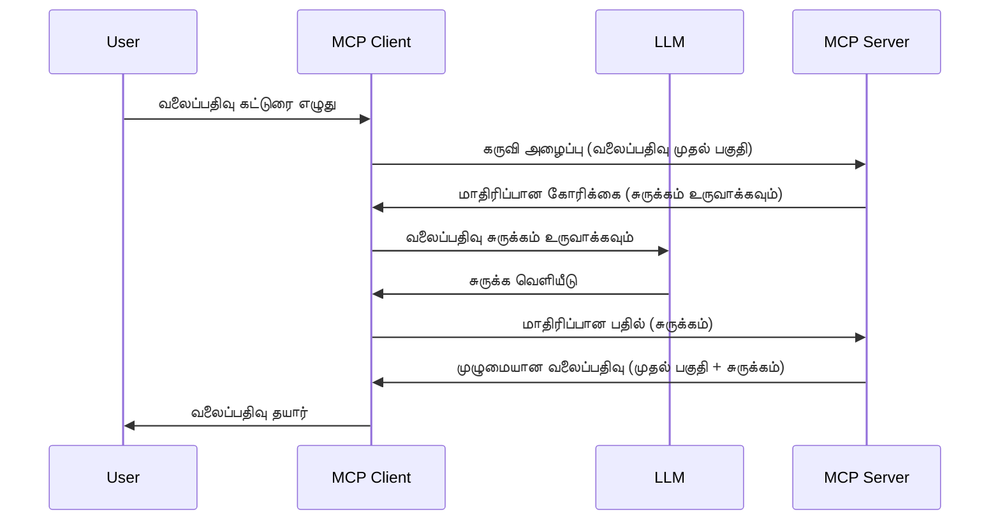

# சாம்பிளிங் - கிளையண்டுக்கு பணியாளர்களை ஒதுக்குவது

சில சமயங்களில், பொதுவான இலக்கைக் அடைவதற்காக MCP Client மற்றும் MCP Server ஒருங்கிணைந்து வேலை செய்ய வேண்டும். சர்வருக்கு கிளையண்டில் இருக்கும் LLM உதவி தேவைப்படும் நிலை உண்டாகலாம். இந்த நிலைக்கு, சாம்பிளிங் பயன்படுத்த வேண்டும்.

சாம்பிளிங்கை அடிப்படையாகக் கொண்டு சில பயன்பாட்டு வழக்குகளையும், தீர்வுகளை எவ்வாறு உருவாக்குவது என்பதையும் ஆராய்வோம்.

## கண்ணோட்டம்

இந்த பாடத்தில், சாம்பிளிங்கை எப்போது மற்றும் எங்கு பயன்படுத்துவது மற்றும் அதை எவ்வாறு கட்டமைப்பது என்பதைக் குறிப்பிடுகிறோம்.

## கற்றல் நோக்கங்கள்

இந்த அத்தியாயத்தில், நாம்:

- சாம்பிளிங் என்பதன் குறியீட்டு விளக்கமும், எப்போது பயன்படுத்த வேண்டும் என்பதையும் விளக்குவோம்.
- MCP இல் சாம்பிளிங்கை எவ்வாறு அமைக்க வேண்டும் என்பதைக் காண்பிப்போம்.
- செயல்பாட்டில் சாம்பிளிங் எடுத்துக்காட்டுகளை வழங்குவோம்.

## சாம்பிளிங் என்பதன் பொருள் மற்றும் அதனை ஏன் பயன்படுத்த வேண்டும்?

சாம்பிளிங் என்பது கீழ்க்கண்டவாறு செயல்படும் ஒரு முன்னேற்றமடைந்த அம்சமாகும்:



### சாம்பிளிங் கோரிக்கை

சரி, இப்போது நம்பத்தகுந்த நிலைமையின் உயர் கண்ணோட்டம் உள்ளது, சர்வர் கிளையண்டுக்கு அனுப்பும் சாம்பிளிங் கோரிக்கையைப் பற்றி பேசுகிறோம். JSON-RPC வடிவில் அத்தகைய கோரிக்கை இப்படி இருக்கலாம்:

```json
{
  "jsonrpc": "2.0",
  "id": 1,
  "method": "sampling/createMessage",
  "params": {
    "messages": [
      {
        "role": "user",
        "content": {
          "type": "text",
          "text": "Create a blog post summary of the following blog post: <BLOG POST>"
        }
      }
    ],
    "modelPreferences": {
      "hints": [
        {
          "name": "claude-3-sonnet"
        }
      ],
      "intelligencePriority": 0.8,
      "speedPriority": 0.5
    },
    "systemPrompt": "You are a helpful assistant.",
    "maxTokens": 100
  }
}
```

இங்கே குறிப்பிட வேண்டிய சில முக்கிய விஷயங்கள் உள்ளன:

- Prompt, content -> text கீழ் உள்ளது, இது LLM க்கு ஒரு வழிகாட்டலாக இருக்கிறது, வலைப்பதிவு உள்ளடக்கத்தை சுருக்க சிறந்த வழிகாட்டல் ஆகும்.

- **modelPreferences**. இந்த பகுதி ஒருவேளைக் கொள்கைகளைப் பிரதிபலிக்கும், LLM உடன் எவ்வாறு செயல்படுவது என்பதற்கான பரிந்துரைகள். பயனர் இந்த பரிந்துரைகளை ஏற்க அல்லது மாற்ற முடியும். இங்கு பயன்படுத்த வேண்டிய மாதிரி, வேகம் மற்றும் நுண்ணறிவு முன்னுரிமைகள் பற்றிய பரிந்துரைகள் உள்ளன.
- **systemPrompt**, இது உங்கள் வழக்கமான முறைமை வழிகாட்டல் ஆகும், இது உங்கள் LLM க்கு ஒரு தன்மையையும் வழிகாட்டலையும் வழங்குகிறது.
- **maxTokens**, இங்கு குறிக்கப்பட்டது இந்த பணிக்கான பரிந்துரைக்கப்பட்ட குறியீடுகள் எண்ணிக்கையை அப்படியே குறிப்பிடுகிறது.

### சாம்பிளிங் பதில்

இது MCP Client கை கொண்டு MCP Server க்கு அனுப்பப்படும் பதில் ஆகும், இது கிளையண்ட் LLM க்கு அழைப்பு விடுத்து எதிர்பார்த்து அந்த பதிலை பெற்று, மேலும் இதை உருவாக்கிய செய்தி ஆகும். JSON-RPC இல் இதுவாவது இந்த மாதிரி இருக்கும்:

```json
{
  "jsonrpc": "2.0",
  "id": 1,
  "result": {
    "role": "assistant",
    "content": {
      "type": "text",
      "text": "Here's your abstract <ABSTRACT>"
    },
    "model": "gpt-5",
    "stopReason": "endTurn"
  }
}
```

எப்படி பதில் வலைப்பதிவு பகுதியின் சுருக்கம் போல இருக்கிறது என்பதை கவனியுங்கள். மேலும் பயன்படுத்திய `model` என்றால் நாம் கேட்டதைப் பயன்படுத்தவில்லை; ஆனாலும் "gpt-5" ஐ "claude-3-sonnet"க்கு மேல் எடுத்துள்ளோம். இது பயனர் விருப்பத்தை மாற்ற முடியுமென்ற திருப்பத்தை விளக்குகிறது, உங்கள் சாம்பிளிங் கோரிக்கை ஒரு பரிந்துரையாகும்.

சரி, நம்மால் பிரதான தழுவலில் மற்றும் பயன்பட்ட பதிலில் "வலைப்பதிவு உருவாக்கம் + சுருக்கம்" என்ற பணியைப் பயன்படுத்துவதாக புரிந்து கொண்டோம். இதை இயக்க எம்மை காக்க என்ன செய்ய வேண்டும் என்று பார்க்கவோம்.

### செய்தி வகைகள்

சாம்பிளிங் செய்திகள் வெறும் உரையில் மட்டுமே இல்லை, நீங்கள் படங்கள் மற்றும் ஒலியையும் அனுப்பலாம். JSON-RPC இவ்வாறு வேறுபடும்:

**உரை**

```json
{
  "type": "text",
  "text": "The message content"
}
```

**பட உள்ளடக்கம்**

```json
{
  "type": "image",
  "data": "base64-encoded-image-data",
  "mimeType": "image/jpeg"
}
```

**ஒலி உள்ளடக்கம்**

```json
{
  "type": "audio",
  "data": "base64-encoded-audio-data",
  "mimeType": "audio/wav"
}
```

> NOTE: சாம்பிளிங் குறித்து மேலும் விவரங்களுக்கு, [அதிகாரப்பூர்வ ஆவணங்கள்](https://modelcontextprotocol.io/specification/2025-11-25/client/sampling) பார்த்து அறியவும்

## கிளையண்டில் சாம்பிளிங்கை அமைக்கும் முறைகள்

> குறிப்பு: நீங்கள் ஒரு சர்வர் மட்டுமே உருவாக்கினால், இதற்குக் குறைவான தேவைகள் இருப்பதால், பெரிதும் கவலைப்பட வேண்டாம்.

ஒரு கிளையண்டில், கீழ்காணும் அம்சத்தை இதுபோல் குறிப்பிட வேண்டும்:

```json
{
  "capabilities": {
    "sampling": {}
  }
}
```

படிக்கு, உங்கள் தேர்ந்தெடுத்த கிளையண்ட் சர்வருடன் ஆரம்பிக்கும்போது இதன் மூலம் தகவல் பெறப்படும்.

## சாம்பிளிங் செயல்பாட்டில் எடுத்துக்காட்டு - ஒரு வலைப்பதிவு உருவாக்கம்

ஒரு சாம்பிளிங் சர்வரை ஒரு சேர உருவாக்குவோம், இதற்கு:

1. சர்வரில் ஒரு கருவி உருவாக்கவும்.
2. அந்த கருவி சாம்பிளிங் கோரிக்கை உருவாக்க வேண்டும்.
3. கருவி கிளையண்டின் சாம்பிளிங் கோரிக்கைக்கு பதிலாக காத்திருக்க வேண்டும்.
4. பின்னர் கருவியால் முடிவை வழங்க வேண்டும்.

குறியீட்டைக் கட்டுக்கட்டாகப் பார்க்கலாம்:

### -1- கருவி உருவாக்கு

**python**

```python
@mcp.tool()
async def create_blog(title: str, content: str, ctx: Context[ServerSession, None]) -> str:
    """Create a blog post and generate a summary"""

```

### -2- சாம்பிளிங் கோரிக்கையை உருவாக்கு

உங்கள் கருவியை கீழ்காணும் குறியீட்டுடன் விரிவாக்குங்கள்:

**python**

```python
post = BlogPost(
        id=len(posts) + 1,
        title=title,
        content=content,
        abstract=""
    )

prompt = f"Create an abstract of the following blog post: title: {title} and draft: {content} "

result = await ctx.session.create_message(
        messages=[
            SamplingMessage(
                role="user",
                content=TextContent(type="text", text=prompt),
            )
        ],
        max_tokens=100,
)

```

### -3- பதிலை காத்திருந்து பதிலை திருப்பவும்

**python**

```python
post.abstract = result.content.text

posts.append(post)

# முழுமையான தயாரிப்பை திருப்பி விடு
return json.dumps({
    "id": post.title,
    "abstract": post.abstract
})
```

### -4- முழு குறியீடு

**python**

```python
from starlette.applications import Starlette
from starlette.routing import Mount, Host

from mcp.server.fastmcp import Context, FastMCP

from mcp.server.session import ServerSession
from mcp.types import SamplingMessage, TextContent

import json


from uuid import uuid4
from typing import List
from pydantic import BaseModel


mcp = FastMCP("Blog post generator")

# app = FastAPI()

posts = []

class BlogPost(BaseModel):
    id: int
    title: str
    content: str
    abstract: str

posts: List[BlogPost] = []

@mcp.tool()
async def create_blog(title: str, content: str, ctx: Context[ServerSession, None]) -> str:
    """Create a blog post and generate a summary"""

    post = BlogPost(
        id=len(posts) + 1,
        title=title,
        content=content,
        abstract=""
    )

    prompt = f"Create an abstract of the following blog post: title: {title} and draft: {content} "

    result = await ctx.session.create_message(
        messages=[
            SamplingMessage(
                role="user",
                content=TextContent(type="text", text=prompt),
            )
        ],
        max_tokens=100,
    )

    post.abstract = result.content.text

    posts.append(post)

    # முழு பிளாக்கின் பதிவை திருப்பி அளிக்கவும்
    return json.dumps({
        "id": post.title,
        "abstract": post.abstract
    })

if __name__ == "__main__":
    print("Starting server...")
    # mcp.run()
    mcp.run(transport="streamable-http")

# பின்வருமாறு செயல்படுத்தவும்: python server.py
```

### -5- Visual Studio Code இல் சோதனை செய்ய

Visual Studio Code இல் இதை சோதிக்க, பின்வரும் படிகளை மேற்கொள்ளவும்:

1. டெர்மினலில் சர்வரை தொடங்கு
1. *mcp.json* இல் சேர்க்கவும் (மற்றும் அது செயல்படுவதை உறுதிசெய்யவும்), உதாரணமாக:

   ```json
   "servers": {
      "blog-server": {
        "type": "http",
        "url": "http://localhost:8000/mcp"
      }
   }
   ```

1. ஒரு prompt தட்டவும்:

   ```text
   create a blog post named "Where Python comes from", the content is "Python is actually named after Monty Python Flying Circus"
   ```

1. சாம்பிளிங் நிகழ்வை அனுமதிக்கவும். முதன் முறையாக சோதனை செய்யும்போது, நீங்கள் கூடுதல் உரையாடலை ஏற்றுக்கொள்ள வேண்டும், அதன் பின் கருவி இயக்க அங்கீகாரம் கேட்கும் பொதுவான உரையாடல் வரும்.

1. முடிவுகளை பரிசீலனை செய்யவும். முடிவுகள் GitHub Copilot Chat இல் அழகாக காட்டப்படும், மேலும் நீங்கள் மூல JSON பதிலையும் ஆய்வு செய்யலாம்.

**போனஸ்**. Visual Studio Code கருவிகள் சாம்பிளிங் க்குப் சிறந்த ஆதரவுக்காக அமைந்துள்ளன. உங்கள் நிறுவிய சர்வரில் சாம்பிளிங் அணுகலை பின்வருமாறு கட்டமைக்கலாம்:

1. விரிவாக்க பிரிவுக்கு செல்லவும்.
1. "MCP SERVERS - INSTALLED" பகுதியில் உங்கள் நிறுவிய சர்வருக்கான கட்டளை சின்னத்தைத் தேர்ந்தெடுக்கவும்.
1. "Configure Model Access" ஐத் தேர்ந்தெடுக்கவும், இங்கு GitHub Copilot எப்படி மாதிரிகளை பயன்படுத்தி சாம்பிளிங் செய்கிறது என்பது தெரிவு செய்யலாம். அண்மையில் நடந்த சாம்பிளிங் கோரிக்கைகளையும் "Show Sampling requests" கிளிக் செய்யும் மூலம் பார்க்கலாம்.

## பணியிடு

இந்த பணியிடில், நீங்கள் சாம்பிளிங் முறையைப் பயன்படுத்தி ஒரு வேறுபட்ட சாம்பிளிங் ஒருங்கிணைப்பை உருவாக்க வேண்டும், இது ஒரு வர்த்தக பொருள் விளக்கத்தை உருவாக்க உதவும். உங்கள் நிலைமை இதுவரை:

**நிலைமை**: ஒரு இ-காமர்ஸ் பின்னணி அலுவலர் உதவி தேவைப்படுகிறது, பொருள் விளக்கங்களை உருவாக்க அதிக நேரம் செலவிடப்படுகிறது. அதனால், "create_product" என்ற கருவியை "title" மற்றும் "keywords" ஆகிய அளவுருக்களுடன் அழைக்க, மற்றும் "description" என்ற புலம் உட்பட முழுமையான பொருள் உருவாக்கப்பட வேண்டும், அது கிளையண்டின் LLM மூலம் நிரப்பப்படும்.

TIP: முன்பு கற்றுக்கொண்டதை பயன்படுத்தி இந்த சர்வர் மற்றும் அதன் கருவியை சாம்பிளிங் கோரிக்கையின் மூலம் கட்டமைக்கவும்.

## தீர்வு

[தீர்வு](./solution/README.md)

## முக்கியக் கருத்துக்கள்

சாம்பிளிங் என்பது ஒரு சக்திவாய்ந்த அம்சமாகும், இது சர்வருக்கு LLM உதவி தேவைப்படும் போது பணிகளை கிளையண்டுக்கு ஒதுக்க முடியும்.

## அடுத்தது என்ன

- [அத்தியாயம் 4 - நடைமுறை அம்ப்பு](../../04-PracticalImplementation/README.md)

---

<!-- CO-OP TRANSLATOR DISCLAIMER START -->
**மறுப்பு**:
இந்த ஆவணம் AI மொழிபெயர்ப்பு சேவை [Co-op Translator](https://github.com/Azure/co-op-translator) பயன்படுத்தி மொழிபெயர்க்கப்பட்டுள்ளது. நாங்கள் துல்லியத்திற்காக முயற்சி செய்துள்ளோம், ஆனால் தானாக செய்யப்படும் மொழிபெயர்ப்புகளில் பிழைகள் அல்லது தவறுகள் இருக்கலாம் என்பதை கவனத்தில் கொள்ளவும். அசல் ஆவணம் அதன் தாய்மொழியில் அதிகாரப்பூர்வ ஆதாரமாக கருதப்பட வேண்டும். முக்கியமான தகவல்களுக்கு, தொழில்நுட்பமான மனித மொழிபெயர்ப்பு பரிந்துரைக்கப்படுகிறது. இந்த மொழிபெயர்ப்பைப் பயன்படுத்துவதால் ஏற்படும் எந்த தவறான புரிதல்கள் அல்லது தவறான விளக்கத்திற்கும் நாங்கள் பொறுப்பில்வில்லை.
<!-- CO-OP TRANSLATOR DISCLAIMER END -->