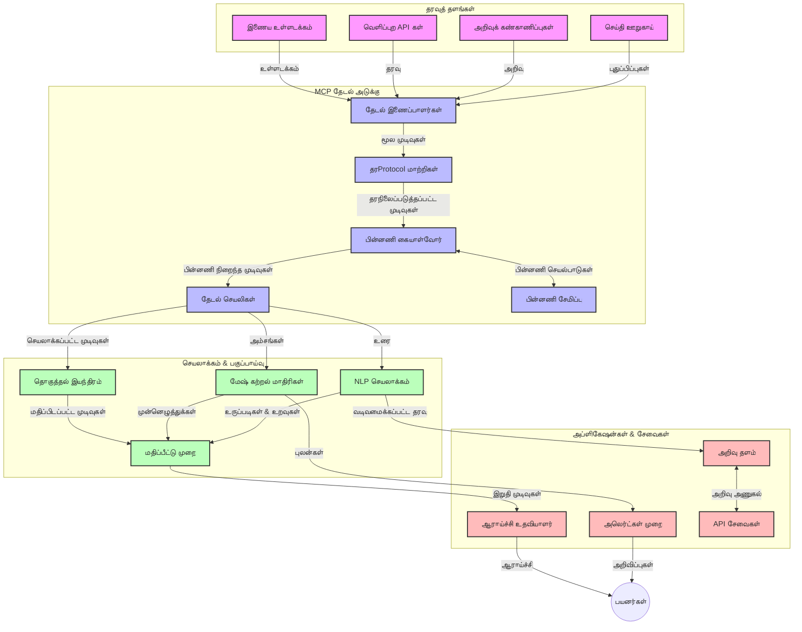
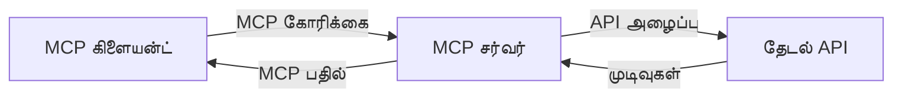
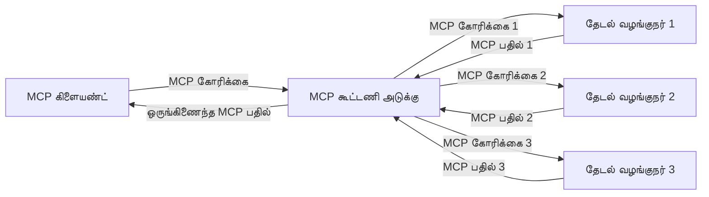
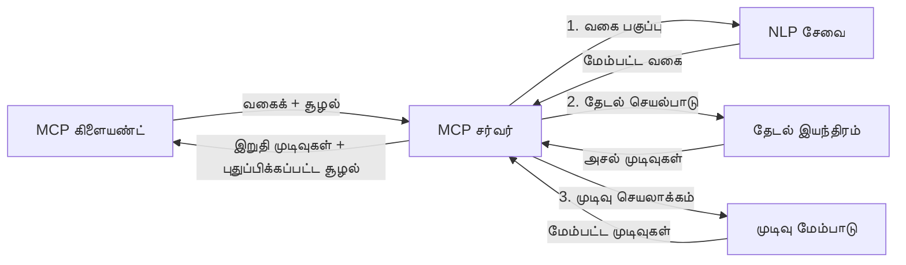

# நேரடி இணையத் தேடலுக்கான மாதிரி சூழல் நெறிமுறை

## கண்ணோட்டம்

நேற்றைய தகவல் இயக்கப்பட்ட சூழலில், பயன்பாடுகள் இணையத்தில் இருந்து உடனடி, புதுப்பிக்கப்பட்ட தகவல்களை விரைவாக அணுக வேண்டும் என்பதால் நேரடி இணையத் தேடல் அவசியமாகியுள்ளது. மாதிரி சூழல் நெறிமுறை (MCP) இந்த நேரடி தேடல் செயல்முறைகளை மேம்படுத்துவதில் முக்கிய முன்னேற்றமாகும், தேடல் செயல்திறனை வளர்க்க, சூழல் ஒருங்கிணைப்பை பராமரிக்கவும், மொத்த அமைப்பின் செயல்திறனை மேம்படுத்தவும் உதவுகிறது.

இந்த மிகப்பெரிய பயிற்சி மத்தியிலும் MCP AI மாதிரிகள், தேடல் இயந்திரங்கள் மற்றும் பயன்பாடுகளுக்கிடையில் சூழலின் ஒழுங்கமைப்பை வழங்கி நேரடி இணையத் தேடலை எவ்வாறு மாற்றுகிறது என்பதை ஆராய்கிறது.

### நீங்கள் என்ன கற்பீர்கள்

இந்த விரிவான கையேட்டில், நீங்கள் அறிந்துகொள்வீர்கள்:

- MCP எப்படி AI மாதிரிகளுக்கும் நேரடி இணையத் தேடலுக்குமான இடையே ஒரு எளிய பாலம் உருவாக்குகிறது என்பதை
- MCP உடன் திறமையான மற்றும் விரிவாக்கக் கூடிய தேடல் தீர்வுகளை வடிவமைக்கும் கட்டமைப்பு மாதிரிகள்
- பல запрос்கள் மற்றும் தொடர்புகளுக்கு மேலாக தேடல் சூழலை எவ்வாறு காக்குவது என்பதை
- பைத்தான் மற்றும் ஜாவாச்கிரிப்டில் விருப்பமான தேடல் சூழல்களுக்கு நடைமுறைக் குறியீட்டு அமலாக்கங்கள்
- MCP ஆதாரமுள்ள தேடல் அமைப்புகளில் பொருத்தம், சமீபத்தன்மை மற்றும் செயல்திறனை சமநிலைப்படுத்தும் முறைகள்

## நேரடி இணையத் தேடலின் அறிமுகம்

நேரடி இணையத் தேடல் என்பது இணையதளத்தில் பதிக்கப்பட்டோ அல்லது புதுப்பிக்கப்பட்டோ இருக்கும் தகவல்களை தொடர்ச்சியாக கேள்வி கேட்டு, செயலாக்கி, பகுப்பாய்வு செய்து, குறைந்த தாமதத்துடன் புதிய மற்றும் பொருத்தமான தகவல்களை வழங்கும் தொழில்நுட்ப அணுகுமுறையாகும். பாரம்பரிய தேடல் அமைப்புகள் குறிப்பிட்ட நேரத்தில் சேர்க்கப்பட்ட தரவுகளின் அடிக்குறிப்புகளை பயன்படுத்தும்போது, நேரடி தேடல் இணையத்தில் நேரடியாக முற்றிலும் இன்றைய தகவல்களைப் பெறுகிறது.

### நேரடி இணையத் தேடலின் அடிப்படை கருத்துக்கள்:

- **தொடர்ச்சியான கேள்வி செயலாக்கம்**: தேடல் கேள்விகள் தொடர்ச்சியாக புதுப்பிக்கப்படும் தரவு மூலங்களுடன் செயலாக்கப்படுகின்றன
- **சமீபத்தன்மைக்கு முன்னுரிமை**: அமைப்புகள் புதிதாக உருவான தகவலை முன்னுரிமை அளிக்க வடிவமைக்கப்பட்டுள்ளன
- **பொருத்தத்தை சமநிலைப்படுத்தல்**: பொருத்தம் மற்றும் சமீபதன்மை ஆகியவற்றுக்கு இடையே சமநிலை நிலைநிறுத்தல்
- **விரிவாக்கக்கூடிய கட்டமைப்பு**: மாறும் கேள்வி சுமைகள் மற்றும் தரவளவற்றை கையாளும் திறன்
- **சூழல் புரிதல்**: தேடல் முறைகளுக்கு இடையே பயனர் சூழலை பராமரிப்பது முக்கியம்
- **கேள்வி மீள்பெயர்ப்பு**: தொடர்பு மற்றும் முந்தைய முடிவுகளின் அடிப்படையில் கேள்விகளை தன்னிச்சையாக மாற்றல்
- **பல மூலங்களை ஒருங்கிணைத்தல்**: பல தேடல் வழங்குநர்கள் மற்றும் இணையத் மூலங்கள் மூலம் முடிவுகள் இணைக்கப்படுகின்றன
- **அர்த்த வேறுபாடு புரிதல்**: திறன் மட்டும் அல்லாமல் உள்ளடக்கத்தின் அர்த்தத்தை அடிப்படையாகக் கொண்ட பார்சிங்
- **நேரடி தரவரிசை**: புதுப்பிக்கப்படும் புதிய தகவலுக்கு ஏற்ப முடிவுகளின் தரவரிசையை தொடர்ச்சியாக சரிசெய்தல்

### மாதிரி சூழல் நெறிமுறை மற்றும் நேரடி இணையத் தேடல்

மாதிரி சூழல் நெறிமுறை (MCP) நேரடி இணையத் தேடல் சூழ்நிலைகளில் கீழ்க்கண்ட முக்கிய சவால்களை சமாளிக்கிறது:

1. **தேடல் சூழல் பராமரிப்பு**: MCP பகிரங்க தேடல் கூறுகளுக்கு இடையே சூழலை ஒருங்கிணைத்து AI மாதிரிகள் மற்றும் செயலாக்கக் கிளைகள் தொடர்பான கேள்வி வரலாறு மற்றும் பயனர் விருப்பங்களை அணுகப்படுவதை உறுதி செய்கிறது.

2. **திறமையான கேள்வி மேலாண்மை**: சூழல் பரிமாற்றத்திற்கான ஒருங்கிணைக்கப்பட்ட முறைகளை வழங்குவதன் மூலம், MCP ஒவ்வொரு தேடல் ஆவணத்திலும் சூழலை மீண்டும் கூறும் தேவையை குறைக்கிறது.

3. **இணைப்புத்தன்மை**: பல்வேறு தேடல் தொழில்நுட்பங்கள் மற்றும் AI மாதிரிகளுக்கு இடையில் சூழல் பகிர்வுக்கான ஒரே வழிமொழியைக் காட்டி, அதிக நெகிழ்வுத் தன்மை மற்றும் விரிவமைப்புகளுக்கு வழியமைக்கிறது.

4. **தேடல்-பேற்றிய சூழல்**: MCP நடைமுறைகள் எந்த சூழல் பகுதிகள் சிறந்த தேடலுக்கு முக்கியமானவை என்பதை முன்னுரிமை அளிக்க முடியும், செயல்திறன் மற்றும் துல்லியத்தை மேம்படுத்துகிறது.

5. **உள்ளடக்க தேடல் செயலாக்கம்**: MCP மூலம் சரியான சூழல் நிர்வாகத்தால் தேடல் அமைப்புகள் பயனர் தேவைகள் மற்றும் தகவல் நிலைகளின் மாறுபாட்டின் அடிப்படையில் செயலாக்கத்தை தானாக மாற்றிக் கொள்ள முடியும்.

சமீபத்திய செயலிகளிலிருந்து செய்திகள் சேகரிப்பு முதல் ஆராய்ச்சி உதவியாளர்கள் வரை, MCP இணைப்பு இணையத் தேடல் தொழில்நுட்பங்களுடன் ஒன்றிணைந்து அதிக அர்த்தமுள்ள, சூழல் உணர்ந்த தேடலை வழங்குகிறது, பயனர் தொடர்புகள் வளர்ந்துவரும் முன்னேற்றம்களுக்கு ஏற்ப தெளிவான முடிவுகளை வழங்குகிறது.

## கற்றல் நோக்கங்கள்

இந்த பாடம் முடியும் வரை, நீங்கள் இவற்றை செய்ய முடியும்:

- நேரடி இணையத் தேடலின் அடிப்படைகளையும் அதன் சவால்களையும் புதிய பயன்பாடுகளில் புரிந்துகொள்ள
- மாதிரி சூழல் நெறிமுறை (MCP) நேரடி இணையத் தேடலை எவ்வாறு மேம்படுத்துகிறது என்பதை விளக்க
- MCP-ஆல் இயங்கும் தேடல் தீர்வுகளை பிரபல கட்டமைப்புகள் மற்றும் API-களை பயன்படுத்தி செயல்படுத்த
- MCP உடன் விரிவாக்கக்கூடிய மற்றும் உயர் செயல்திறன் தேடல் கட்டமைப்புகளை வடிவமைத்து செயல்படுத்த
- MCP கருத்துக்களை பொருத்தகரமான தேடல், ஆராய்ச்சி உதவியாளர்கள் மற்றும் AI தொடர்ந்து உலாவுதலிற்குப் பயன்படுத்த
- MCP ஆகும் தேடல் தொழில்நுட்பங்களில் உருவாகும் புதிய போக்குகளையும் எதிர்கால புதுமைகளையும் மதிப்பாய்வு செய்ய
- பயனர் தொடர்புகளை ஆய்வு செய்து கற்றுக்கொள்ளும் சூழல் உணர்ந்த தேடல் அமைப்புகளை உருவாக்க
- MCP நெறிமுறைகளை பயன்படுத்தி AI உதவியாளர்களுக்கு இணையத் தேடல் திறன்களை ஒருங்கிணைக்க
- சூழலின் அடிப்படையில் முடிவுகளை முறைப்படி சீரமைக்கும் பல படி தேடல் செயலியை உருவாக்க
- முழுமையான சூழல் விழிப்புணர்வுடன் தேடல் செயல்திறனை மேலோங்கச் செய்ய

### வரைவும் முக்கியத்துவமும்

நேரடி இணையத் தேடல் என்பது குறைந்த தாமதத்துடன் இணைய பின்னணியிலிருந்து தொடர்ச்சியான கேள்வி, மீட்பு மற்றும் தகவல் வழங்கலை உள்ளடக்கியது. பாரம்பரிய தேடல் இயந்திரங்கள் இணையத்தை காலடியாகச் சரிபார்த்து மற்றும் குறியிடும் முறையைப் பயன்படுத்தும் போது, நேரடி தேடல் கிடைக்கும் தரவை உடனே வெளிக்காட்டி, புதிய இணையத் தகவல்களை உடனே அணுகுதல் ஆகும்.

நேரடி இணையத் தேடலின் முக்கிய பண்புகள்:

- **புதியதன்மை**: சமீபத்திய உள்ளடக்கங்கள் மற்றும் புதுப்பிப்புகளை முன்னுரிமை இடுதல்
- **தொடர்ச்சியான செயலாக்கம்**: புதிய தகவல்களை இடையறாது கண்காணித்தல்
- **கேள்வி மாற்றுதல்**: சூழல் மற்றும் கருத்துக்கணிப்பின் அடிப்படையில் தேடல் கேள்விகளை மேம்படுத்துதல்
- **உடனடி வழங்கல்**: குறைந்த தாமதத்தில் தேடல் முடிவுகளை வழங்குதல்
- **சூழல் பராமரிப்பு**: முன்னணி கேள்விகளுக்கு அடிப்படையாகிப் பொருத்தத்தை மேம்படுத்துதல்

### பாரம்பரிய இணையத் தேடலின் சவால்கள்

பாரம்பரிய தேடல் முறைகள் நேரடி சூழலில் பயன்படுத்தும்போது பல வரம்புகள்:

1. **சூழல் துண்டிப்பாடு**: பல கேள்விகளுக்கு இடையே தேடல் சூழலை பராமரிப்பதில் கடினம்
2. **தரவின் புதுமை**: சமீபத்திய தகவல் அணுகல் மற்றும் முக்கியத்துவம் கொடுப்பதில் சவால்கள்
3. **இணைப்பு சிக்கல்கள்**: தேடல் அமைப்புகள் மற்றும் பயன்பாடுகளுக்கிடையில் உறவினை சரி செய்வதில் பிரச்சினைகள்
4. **தாமத பிரச்சினைகள்**: முழுமையான தேடலின் போது பதிலளிக்கும் வேகத்தை சமநிலைப்படுத்தல்
5. **பொருத்தம் கண்காணிப்பு**: சமீபத்தன்மை முன்னுரிமையின் போது துல்லியம் மற்றும் பொருத்தத்தை உறுதி செய்தல்

## தேடலுக்கு மாதிரி சூழல் நெறிமுறை (MCP) புரிதல்

### தேடல் சூழலில் MCP என்றால் என்ன?

மாதிரி சூழல் நெறிமுறை (MCP) என்பது AI மாதிரிகள் மற்றும் பயன்பாடுகளுக்கு இடையேயான திறமையான தொடர்புக்காக வடிவமைக்கப்பட்ட ஒருங்கிணைந்த தொடர்பு நெறிமுறையாகும். நேரடி இணையத் தேடலில் MCP வழங்குவது:

- கேள்வி தொடர்களில் தேடல் சூழலை பாதுகாப்பது
- தேடல் கேள்விகள் மற்றும் முடிவுகளுக்கான ஒருங்கிணைந்த வடிவங்களை உருவாக்குவது
- தேடல் அளவுருக்கள் மற்றும் முடிவுகளை சிறப்பாக பரிமாறும் முறைகள்
- மாதிரி முதல் தேடல் இயந்திரம் தொடர்புக்களை மேம்படுத்துதல்

### முக்கிய கூறுகள் மற்றும் கட்டமைப்பு

நேரடி இணையத் தேடலுக்கான MCP கட்டமைப்பில் இவை அடக்கம்:

1. **கேள்வி சூழல் கைப்போராளர்கள்**: பல கேள்விகளுக்கு இடையில் தேடல் சூழலை பராமரிக்க மற்றும் நிர்வகிக்க
2. **தேடல் செயலியாளர்கள்**: சூழல் உணர்ந்த முறைகளை பயன்படுத்தி வரும் தேடல் கோரிக்கைகளை செயலாக்க
3. **நெறிமுறை இணைப்பிகள்**: வேறு வேறு தேடல் API-க்களில் MCP கோரிக்கைகளை மாற்றி, சூழலை பாதுகாக்க
4. **சூழல் கையடைப்பு**: தேடல் வரலாறு மற்றும் விருப்பங்களை திறமையாக சேமிக்க மற்றும் மீட்டெடுக்க
5. **தேடல் இணைப்பிகள்**: பல தேடல் இயந்திரங்கள் மற்றும் இணைய API-களை இணைக்க



### MCP எப்படி நேரடி இணையத் தேடலை மேம்படுத்துகிறது

MCP பாரம்பரிய இணையத் தேடல் சவால்களை பின்வருமாறு சமாளிக்கிறது:

- **சூழல் தொடர்ச்சி**: முழு தேடல் அமர்வின் போது கேள்விகளுக்கு இடையேயான உறவுகளை பராமரிக்கிறது
- **சிறந்த பரிமாற்றம்**: புத்திசாலித்தனமான சூழல் நிர்வாகம் மூலம் தேடல் அளவுருக்களில் மீண்டும் சோதனை குறைக்கும்
- **ஒருங்கிணைக்கப்பட்ட இடைமுகங்கள்**: தேடல் கூறுகளுக்கு ஒரே மாதிரியில் APIs வழங்குகிறது
- **தாமதம் குறைவு**: சரியான சூழல் கையாள்வினால் செயலாக்க சுமையை குறைக்கும்
- **பொருத்தமான மேம்பாடு**: பல கேள்விகள் முழுவதும் பயனர் நோக்கங்களை காக்கும் விதமாக தேடல் பொருத்தத்தை மேம்படுத்துகிறது

## ஒருங்கிணைப்பு மற்றும் அமலாக்கம்

நேரடி இணையத் தேடல் அமைப்புகள் செயல்திறன் மற்றும் சூழல் ஒருங்கிணைப்பை காக்கிய கட்டமைப்பில் கவனமாக வடிவமைக்கப்பட்டு அமல்படுத்தப்பட வேண்டும். மாதிரி சூழல் நெறிமுறை AI மாதிரிகள் மற்றும் தேடல் தொழில்நுட்பங்களுடன் ஒருங்கிணைக்க ஒரு ஒருங்கிணைந்த அணுகுமுறையாக உள்ளது, சிறந்த மற்றும் ஒருங்கிணைந்த தேடல் காச்கேட்களை உருவாக்க உதவுகிறது.

### தேடல் கட்டமைப்புகளில் MCP ஒருங்கிணைப்பு கண்ணோட்டம்

நேரடி இணையத் தேடல் சூழலில் MCP அமல்படுத்துவதற்கு முக்கியக் கவனிப்புகள்:

1. **தேடல் சூழல் தொடரியல் செயல்**: MCP தேடல் கோரிக்கைகளில் உள்ள சூழல் தகவலை குறும்படங்களாக்கம் செய்ய திறமையான முறைகளை வழங்குகிறது, முக்கிய சூழல் கேள்வியுடன் செயலாக்க முறைமையில் தொடர்கிறது. இதில் தேடலுக்கு உட்பட்ட மெட்டாடேட்டாவிற்கு சிறப்பு தொடர் வடிவமைப்புகள் உள்ளன.

2. **நிலைமையான தேடல் செயலாக்கம்**: MCP தேடல் மீண்டும் செயல்முறைகளில் ஒரே மாதிரியான சூழல் பிரதிநிதித்துவம் பேணுவதால் அறிவுசார் நிலைமையான செயலாக்கத்துக்கு மேம்பாடு தருகிறது. இது குறிப்பாக பல படி தேடல் குழாய்களில் சூழல் மேம்பாடு மூலம் முடிவுகளை மேம்படுத்துகிறது.

3. **கேள்வி விரிவாக்கம் மற்றும் சீரமைப்பு**: தேடல் அமைப்புகளில் MCP நடைமுறைகள் சேர்க்கப்பட்ட சூழலை அடிப்படையாக கொண்டு நுணுக்கமான கேள்வியை விரிவாக்கம் செய்து சீரமைக்க உதவுகிறது, தேடல் அமர்வு முன்னேறு முறையே பொருத்தமான முடிவுகளை உருவாக்குகிறது.

4. **முடிவுகளின் கேஷிங் மற்றும் முன்னுரிமை அளித்தல்**: MCP மூலம் சூழல் கையாள்வை ஒருங்கிணைக்கும் போது, முடிவுகளின் கேஷிங் மற்றும் முன்னுரிமை அளிப்பதற்கான கட்டுப்பாட்டை பாதுகாக்கிறது, தளங்கள் வளர்ந்து வரும் தேடல் சூழலைப் பொருத்து தகுதியான முறையில் தக்கவைத்துக் கொள்ள உதவுகிறது.

5. **தேடல் கூட்டிணைவு மற்றும் ஒருங்கிணைப்பு**: MCP அமைப்புகள் பல பின்னணி சேவைகள் மூலம் தேடல்களை ஒருங்கிணைத்து மேம்பட்ட தேடலை சாத்தியமாக்குகிறது, பல்வேறு மூலங்களிலிருந்து கிடைக்கும் முடிவுகளை பொருத்தமான முறையில் ஒட்டிச் சேர்க்க உதவுகிறது.

MCP பல்வேறு தேடல் தொழில்நுட்பங்களில் செயல்படுத்தப்படுவதால், தனிப்பயன் இணைப்புக் குறியீட் தேவையை குறைத்து, தேடல் கேள்விகள் வளர்ந்தால்கூட பொருத்தமான சூழலைப் பாதுகாக்க அதிக திறன்தரும் ஒருங்கிணைந்த அணுகுமுறையை உருவாக்குகிறது.

### பல்வேறு இணையத் தேடல் செயல்பாடுகளில் MCP

இந்த எடுத்துக்காட்டுகள் தற்போதைய MCP வகுத்திருப்பினை பின்பற்றி, தனித்துவமான பரிமாற்றங்களுடன் JSON-RPC அடிப்படையிலான நெறிமுறையை பயன்படுத்துகின்றன. குறியீட்டில் தனிப்பயன் தேடல் ஒருங்கிணைப்புகளை MCP நெறிமுறைக்குடன் முழுமையாக இணைக்கும் முறைகள் காட்டப்படுகின்றன.


<details>
<summary>பைத்தான் உடன் பொதுவான தேடல் API மூலம் செயலாக்கம்</summary>

```python
import asyncio
import json
import aiohttp
from typing import Dict, Any, Optional, List
from contextlib import asynccontextmanager
from collections.abc import AsyncIterator

# நிலையான MCP நூலகங்களை இறக்குமதி செய்க
from mcp.client.session import ClientSession
from mcp.client.streamable_http import streamablehttp_client
from mcp.types import TextContent, CreateMessageRequestParams, CreateMessageResult
from mcp.server.fastmcp import FastMCP

# வலை தேடலுக்கான FastMCP சேவையகத்தை உருவாக்குக
search_server = FastMCP("WebSearch")

# வலை தேடல் செயல்பாடுகளை கையாளும் வகுப்பு
class WebSearchHandler:
    def __init__(self, api_endpoint: str, api_key: str):
        self.api_endpoint = api_endpoint
        self.api_key = api_key
        self.session = None
        
    async def initialize(self):
        """Initialize the HTTP session"""
        self.session = aiohttp.ClientSession(
            headers={"Authorization": f"Bearer {self.api_key}"}
        )
    
    async def close(self):
        """Close the HTTP session"""
        if self.session:
            await self.session.close()
            
    async def perform_search(self, query: str, max_results: int = 5, 
                           include_domains: List[str] = None, 
                           exclude_domains: List[str] = None,
                           time_period: str = "any") -> Dict[str, Any]:
        """Perform web search using the search API"""
        # தேடல் காரணிகளை உருவாக்குக
        search_params = {
            "q": query,
            "limit": max_results,
            "time": time_period
        }
        
        if include_domains:
            search_params["site"] = ",".join(include_domains)
            
        if exclude_domains:
            search_params["exclude_site"] = ",".join(exclude_domains)
        
        # தேடல் கோரிக்கையை செய்க
        try:
            async with self.session.get(
                self.api_endpoint,
                params=search_params
            ) as response:
                if response.status != 200:
                    error_text = await response.text()
                    raise Exception(f"Search API error: {response.status} - {error_text}")
                
                search_data = await response.json()
                
                # API-குறிப்பிட்ட பதிலை ஒரு நிலையான வடிவமைப்புக்கு மாற்றுக
                results = []
                for item in search_data.get("results", []):
                    results.append({
                        "title": item.get("title", ""),
                        "url": item.get("url", ""),
                        "snippet": item.get("snippet", ""),
                        "date": item.get("published_date", ""),
                        "source": item.get("source", "")
                    })
                
                return {
                    "query": query,
                    "totalResults": len(results),
                    "results": results
                }
        except Exception as e:
            print(f"Search API request error: {e}")
            raise

# தேடல் ஹேண்ட்லரை துவக்குக
search_handler = WebSearchHandler(
    api_endpoint="https://api.search-service.example/search",
    api_key="your-api-key-here"
)

# தேடல் ஹேண்ட்லரை நிர்வகிக்க ஆயுள் காலத்தை அமைக்கவும்
@asyncio.asynccontextmanager
async def app_lifespan(server: FastMCP):
    """Manage application lifecycle"""
    await search_handler.initialize()
    try:
        yield {"search_handler": search_handler}
    finally:
        await search_handler.close()

# சேவையகத்திற்கு ஆயுள் காலத்தை அமைக்கவும்
search_server = FastMCP("WebSearch", lifespan=app_lifespan)

# ஒரு வலை தேடல் கருவியை பதிவு செய்க
@search_server.tool()
async def web_search(query: str, max_results: int = 5, 
                   include_domains: List[str] = None,
                   exclude_domains: List[str] = None,
                   time_period: str = "any") -> Dict[str, Any]:
    """
    Search the web for information
    
    Args:
        query: The search query
        max_results: Maximum number of results to return (default: 5)
        include_domains: List of domains to include in search results
        exclude_domains: List of domains to exclude from search results
        time_period: Time period for results ("day", "week", "month", "any")
        
    Returns:
        Dictionary containing search results
    """
    ctx = search_server.get_context()
    search_handler = ctx.request_context.lifespan_context["search_handler"]
    
    results = await search_handler.perform_search(
        query=query,
        max_results=max_results,
        include_domains=include_domains,
        exclude_domains=exclude_domains,
        time_period=time_period
    )
    
    return results

# எடுத்துக்காட்டு கிளையன்ட் பயன்பாடு
async def client_example():
    # Streamable HTTP மாற்று பயன்படுத்தி தேடல் சேவையகத்தை இணைக்கவும்
    async with streamablehttp_client("http://localhost:8000/mcp") as (read, write, _):
        async with ClientSession(read, write) as session:
            # இணைப்பை துவக்கவும்
            await session.initialize()
            
            # web_search கருவியை அழைக்கவும்
            search_results = await session.call_tool(
                "web_search", 
                {
                    "query": "latest developments in AI and Model Context Protocol",
                    "max_results": 5,
                    "time_period": "day",
                    "include_domains": ["github.com", "microsoft.com"]
                }
            )
            
            print(f"Search results: {search_results}")

# சேவையக செயற்பாடு எடுத்துக்காட்டு
if __name__ == "__main__":
    # Streamable HTTP மாற்று கொண்டு சேவையகத்தை இயக்கவும்
    search_server.run(transport="streamable-http")
```
</details> 

<details>
<summary>ஜாவாச்கிரிப்ட் உலாவி அடிப்படையிலான தேடல் செயலாக்கம்</summary>

```javascript
// இணையத் தேடலுக்கான MCP சர்வர் செயலாக்கம்
import { McpServer, ResourceTemplate } from '@modelcontextprotocol/sdk/server/mcp.js';
import { StreamableHTTPServerTransport } from '@modelcontextprotocol/sdk/server/streamableHttp.js';
import { z } from 'zod';

// இணையத் தேடலுக்கான MCP சர்வரை உருவாக்கு
const searchServer = new McpServer({
    name: "BrowserSearch",
    description: "A server that provides web search capabilities"
});

// தேடல் சேவை வகுப்பு
class SearchService {
    constructor(searchApiUrl, apiKey) {
        this.searchApiUrl = searchApiUrl;
        this.apiKey = apiKey;
    }

    async performSearch(parameters) {
        const {
            query = '',
            maxResults = 5,
            includeDomains = [],
            excludeDomains = [],
            timePeriod = 'any'
        } = parameters;
        
        // அளவுருக்களுடன் தேடல் URL உருவாக்கு
        const url = new URL(this.searchApiUrl);
        url.searchParams.append('q', query);
        url.searchParams.append('limit', maxResults);
        url.searchParams.append('time', timePeriod);
        
        if (includeDomains.length > 0) {
            url.searchParams.append('site', includeDomains.join(','));
        }
        
        if (excludeDomains.length > 0) {
            url.searchParams.append('exclude_site', excludeDomains.join(','));
        }
        
        try {
            const response = await fetch(url.toString(), {
                method: 'GET',
                headers: {
                    'Authorization': `Bearer ${this.apiKey}`,
                    'Content-Type': 'application/json'
                }
            });
            
            if (!response.ok) {
                const errorText = await response.text();
                throw new Error(`Search API error: ${response.status} - ${errorText}`);
            }
            
            const searchData = await response.json();
            
            // API-செயல்பாட்டிற்கு உட்பட்ட பதிலை ஒரு நிலையான வடிவமாக மாற்று
            const results = searchData.results?.map(item => ({
                title: item.title || '',
                url: item.url || '',
                snippet: item.snippet || '',
                date: item.published_date || '',
                source: item.source || ''
            })) || [];
            
            return {
                query,
                totalResults: results.length,
                results
            };
        } catch (error) {
            console.error('Search API request error:', error);
            throw error;
        }
    }
}

// தேடல் சேவையை தொடக்கம் செய்
const searchService = new SearchService(
    'https://api.search-service.example/search',
    'your-api-key-here'
);

// சர்வருக்கான பொருளாதார வழங்கியலை அமைத்து
searchServer.setContextProvider(() => {
    return {
        searchService
    };
});

// இணையத் தேடல் கருவியை பதிவு செய்
searchServer.tool({
    name: 'web_search',
    description: 'Search the web for information',
    parameters: {
        type: 'object',
        properties: {
            query: {
                type: 'string',
                description: 'The search query'
            },
            maxResults: {
                type: 'integer',
                description: 'Maximum number of results to return',
                default: 5
            },
            includeDomains: {
                type: 'array',
                items: { type: 'string' },
                description: 'List of domains to include in search results'
            },
            excludeDomains: {
                type: 'array',
                items: { type: 'string' },
                description: 'List of domains to exclude from search results'
            },
            timePeriod: {
                type: 'string',
                description: 'Time period for results',
                enum: ['day', 'week', 'month', 'any'],
                default: 'any'
            }
        },
        required: ['query']
    },
    handler: async (params, context) => {
        const { searchService } = context;
        return await searchService.performSearch(params);
    }
});

// தேடல் சர்வருடன் இணைக்க உதாரண கிளையண்ட் குறியீடு
import { Client } from '@modelcontextprotocol/sdk/client/index.js';
import { StreamableHTTPClientTransport } from '@modelcontextprotocol/sdk/client/streamableHttp.js';

async function connectToSearchServer() {
    // தேடல் சர்வருடன் இணை
    const transport = new StreamableHTTPClientTransport(
        new URL('http://localhost:8000/mcp')
    );
    
    const client = new Client({
        name: 'search-client',
        version: '1.0.0'
    });
    
    await client.connect(transport);
    
    // தேடல் கருவியை இயக்கு
    const searchResults = await client.callTool({
        name: 'web_search',
        arguments: {
            query: 'Model Context Protocol implementation examples',
            maxResults: 10,
            timePeriod: 'week',
            includeDomains: ['github.com', 'docs.microsoft.com']
        }
    });
    
    console.log('Search results:', searchResults);
    
    // சுத்தம் செய்
    await client.disconnect();
}

// சர்வரை தொடங்கு
const transport = new StreamableHTTPServerTransport();
await searchServer.connect(transport);
console.log('Search server running at http://localhost:8000/mcp');

// தனி செயலியில் அல்லது சர்வர் துவங்கிய பிறகு
// connectToSearchServer().catch(console.error);
```
</details> 


## குறியீட்டு எடுத்துக்காட்டுகள் அறிக்கை

> **முக்கிய குறிப்பு**: கீழ்காணும் குறியீட்டு எடுத்துக்காட்டுகள் மாதிரி சூழல் நெறிமுறை (MCP) மற்றும் இணையத் தேடல் செயல்திறனை ஒருங்கிணைக்கும் முறையை காட்டுகின்றன. அவை அதிகாரப்பூர்வ MCP SDK களின் வடிவமைப்புகளைப் பின்பற்றினாலும், கல்விப் பரிபாட்டில் எளிமைப்படுத்தப்பட்டுள்ளன.
> 
> இந்த எடுத்துக்காட்டுகள்:
> 
> 1. **பைத்தான் செயலாக்கம்**: FastMCP சர்வர் செயலாக்கமானது இணையத் தேடல் கருவியை வழங்கி வெளிப்புற தேடல் API-யுடன் இணைக்கிறது. இந்த எடுத்துக்காட்டு வாழ்நாள் நிர்வாகம், சூழல் கையாளுதல் மற்றும் கருவி செயல்பாட்டு பேட்டர்ன்களை அதிகாரப்பூர்வ MCP Python SDK-ஐ பின்பற்றி காட்டுகிறது. சர்வர் பரிந்துரைக்கப்பட்ட Streamable HTTP பரிமாற்றத்தை பயன்படுத்துகிறது, இது பழைய SSE பரிமாற்றத்தைக் கழேற்றியுள்ளது.
> 
> 2. **ஜாவாச்கிரிப்ட் செயலாக்கம்**: FastMCP சார்ந்த TypeScript/JavaScript செயலாக்கமானது அதிகாரப்பூர்வ MCP TypeScript SDK என்பதில் இருந்து ஆகும், சரியான கருவி வரையறைகள் மற்றும் கிளையண்ட் இணைப்புகளை கொண்ட தேடல் சர்வரை உருவாக்குகிறது. இது அமர்வு மேலாண்மை மற்றும் சூழல் பராமரிப்புக்கு சமீபத்திய பரிந்துரைகளை பின்பற்றுகிறது.
> 
> இந்த எடுத்துக்காட்டுகள் உற்பத்தியிற்கான கூடுதல் பிழை கையாளுதல், அங்கீகார விதிகள், மற்றும் குறிப்பிட்ட API ஒருங்கிணைப்பு குறியீடு தேவைப்படும். காணப்படும் தேடல் API முகவரிகள் (`https://api.search-service.example/search`) சுருக்க மாதிரிகள்; அவை அமல்படுத்தி மாற்றப்பட வேண்டும்.
> 
> முழுமையான அமல்படுத்தல் விவரங்கள் மற்றும் தற்போதைய முன்னேற்றங்களுக்கான பரிந்துரைகள் [அதிகாரப்பூர்வ MCP வகுத்திருப்பு](https://spec.modelcontextprotocol.io/) மற்றும் SDK ஆவணங்களை பார்.

## அடிப்படை கருத்துகள்

### மாதிரி சூழல் நெறிமுறை (MCP) கட்டமைப்பு

அதன் அடித்தளத்தில், மாதிரி சூழல் நெறிமுறை AI மாதிரிகள், செயலிகள் மற்றும் சேவைகள் இடையேயான சூழலின் நியமிக்கப்பட்ட பரிமாற்றத்தை வழங்குகிறது. நேரடி இணையத் தேடலில், இந்த கட்டமைப்பு தொடர்புடைய, பல சுற்றங்கள் கொண்ட தேடல் அனுபவங்களை உருவாக்க அவசியமாகும். முக்கிய கூறுகள்:

1. **கிளையண்ட்-சர்வர் கட்டமைப்பு**: MCP தேடல் கிளையண்டுகள் (கோரிக்கையாளர்கள்) மற்றும் தேடல் சர்வர்கள் (வழங்குநர்கள்) இடையே தெளிவான பிரிப்பை நிறுவுகின்றது, பல்வேறு செயலாக்க மாதிரிகளுக்கு வழிவகுக்கிறது.

2. **JSON-RPC தொடர்பு**: இந்த நெறிமுறை JSON-RPC என்பதைக் கையாள்வதன் மூலம் இணைய தொழில்நுட்பங்களுக்கு உடன்படுகிறது மற்றும் வெவ்வேறு தளங்களில் எளிதில் அமல்படுத்தத் தகுந்தது.

3. **சூழல் நிர்வாகம்**: MCP பல இடையிடைகளுக்கு கடந்து தேடல் சூழலை பராமரிக்க, புதுப்பிக்க மற்றும் பயன்படுத்த அமைந்த சீரிய நிர்வாக முறைகளை வரையறுக்கிறது.

4. **கருவி வரையறைகள்**: தேடல் செயல்பாடு நியமிக்கப்பட்ட அளவுருக்கள் மற்றும் பெறுமதிகளுடன் ஒருங்கிணைந்த கருவிகள் வடிவில் வெளிக்காட்டப்படுகின்றது.

5. **ஓட்டுநீர் ஆதரவு**: இந்த நெறிமுறை தொடர்ச்சியாக முடிவுகளை வழங்கும் சிறப்பைக் கொண்டுள்ளது, இது நேரடி தேடலில் முடிவுகள் முன்னேற்றமடைந்தபடி வர அனுமதிப்பதை சாத்தியப்படுத்துகிறது.

### இணையத் தேடலுடன் ஒருங்கிணைப்பு மாதிரிகள்

MCP இணையத் தேடலுடன் ஒருங்கிணைக்கும் போது பல வகை வடிவங்கள் தோன்றுகின்றன:

#### 1. நேரடி தேடல் வழங்குநர் ஒருங்கிணைப்பு



இந்த வடிவத்தில் MCP சர்வர் நேரடியாக ஒன்றோ அல்லது அதற்கு மேற்பட்ட தேடல் API-களை பயன்படுத்தி MCP கோரிக்கைகளை API-களுக்கான அழைப்புகளாக மாற்றி முடிவுகளை MCP பதிலாக வடிவமைக்கிறது.

#### 2. சூழல் பராமரிப்புடன் கூடிய கூட்டமைக்கப்பட்ட தேடல்



இந்த வடிவம் பல MCP-பொருந்தும் தேடல் வழங்குநர்களுக்கு கேள்விகளை பகிர்ந்து விடுகிறது, இவை பல்வேறு வகையான உள்ளடக்கம் அல்லது தேடல் திறன்களில் சிறப்பு பெற்றிருக்கும், ஒரே சூழலில் ஒருங்கிணைக்கப்பட்ட தேடலை பாதுகாக்கிறது.

#### 3. சூழல் மேம்படுத்தப்பட்ட தேடல் சங்கிலி



இந்த வடிவத்தில் தேடல் செயல்முறை பல கட்டங்களாக பிரிக்கப்பட்டு, ஒவ்வொரு படியிலும் சூழல் வளமாக்கப்பட்டு முடிவுகள் அதிக பொருத்தக்கூடியவையாக மாறுகின்றன.

### தேடல் சூழல் கூறுகள்

MCP அடிப்படையிலான இணையத் தேடலில், சூழல் பொதுவாக:

- **கேள்வி வரலாறு**: அமர்வில் முந்தைய தேடல் கேள்விகள்
- **பயனர் விருப்பங்கள்**: மொழி, பிரதேசம், பாதுகாப்பு தேடல் அமைப்புகள்
- **தொடர்பு வரலாறு**: எந்த முடிவுகள் கிளிக் செய்யப்பட்டன, முடிவில் செலவிடப்பட்ட நேரம்
- **தேடல் அளவுருக்கள்**: வடிகட்டிகள், வரிசைப்படுத்தல்கள் மற்றும் பிற தேடல் மாற்றிகள்
- **கள அறிவு**: தேடலுக்கு பொருந்தும் தலைப்புச் சார்ந்த சூழல்
- **கால சூழல்**: நேரத்தைப் பொறுத்து பொருத்தத்தைக் கருத்தில் கொள்ளுதல்
- **மூல விருப்பங்கள்**: நம்பிக்கையான அல்லது முன்னுரிமை உள்ள தகவல் மூலங்கள்

## பயன்பாடுகள் மற்றும் செயலிகள்

### ஆராய்ச்சி மற்றும் தகவல் சேகரித்தல்

MCP ஆராய்ச்சி வேலைப்பாடுக்களை மேம்படுத்துகிறது:

- ஆராய்ச்சி சூழலை பல தேடல் அமர்வுகளுக்கு இடையூறு இல்லாமல் பராமரிப்பது
- அதிக நுண்ணிய மற்றும் சூழல் பொருத்தமான கேள்விகளுக்கான உதவி
- பல மூல தேடல் கூட்டிணைவு
- தேடல் முடிவுகளில் இருந்து அறிவு பிடித்து எடுக்க உதவி

### நேரடி செய்தி மற்றும் போக்கு கண்காணிப்பு

MCP அடிப்படையிலான தேடல் செய்தி கண்காணிப்பில் பயன்கள்:

- முன்னேறித் வரும் செய்தி கதைகள் உடனடியாக கண்டுபிடிப்பு
- அர்த்தமுள்ள தகவல்களை சூழல் அடிப்படையில் வடிகட்டி வழங்கல்
- பல்வேறு மூலங்களில் இருந்து பாடங்கள் மற்றும் சுட்டிகளைக் கண்காணித்தல்
- பயனர் சூழலை நம்பி தனிப்பட்ட செய்தி அறிவிப்புகள்

### AI-ஆக மாற்றிய உலாவல் மற்றும் ஆராய்ச்சி

MCP AI ஆரம்பங்களை அதிகப்படுத்தும் புதிய வாய்ப்புகளை உருவாக்குகிறது:

- தற்போது உலாவலில் நடக்கும் செயல்பாடுகள் அடிப்படையிலான சூழல் சார்ந்த தேடல் பரிந்துரைகள்
- LLM ஆதாரப்பட்ட உதவியாளர்களுடன் இணையத் தேடலின் இணைப்பு
- பராமரிக்கப்பட்ட சூழலை கொண்டு பல சுற்றங்கள் தேடலை மேம்படுத்தல்
- உண்மை சரிபார்ப்பு மற்றும் தகவல் உறுதிப்படுத்தல் மேம்பாடு

## எதிர்கால போக்குகள் மற்றும் புதுமைகள்

### இணையத் தேடலில் MCP முன்னேற்றம்

எதிர்காலத்தில், MCP பின்வருமாறு மேம்படுத்தப்படும் என்று எதிர்பார்க்கப்படுகின்றது:
- **பல்வழி தேடல்**: உரை, படம், ஆடியோ மற்றும் வீடியோ தேடலை ஒருங்கிணைத்து, சூழலை பாதுகாக்குதல்
- **பங்கீட்டுத் தேடல்**: விநியோகிக்கப்பட்ட மற்றும் கூட்டிணைந்த தேடல் சூழலை ஆதரித்தல்
- **தேடல் தனியுரிமை**: சூழல் புரிந்து தனியுரிமை காக்கும் தேடல் செயல்முறைகள்
- **வினா புரிதல்**: இயற்கை மொழி தேடல் வினாக்களின் ஆழ்ந்த பொருள் பகுப்பு

### தொழில்நுட்பத்தில் சாத்தியமான முன்னேற்றங்கள்

MCP தேடலின் எதிர்காலத்தை வடிவமைக்கும் உருவாகும் தொழில்நுட்பங்கள்:

1. **நியூரல் தேடல் கட்டமைப்புகள்**: MCPக்கு 최ம்புவிடப்பட்ட நுழைவுத்தளத் தேடல் அமைப்புகள்
2. **தனிப்பயன் தேடல் சூழல்**: தனிப்பட்ட பயனர் தேடல் பழக்கங்களை காலத்துடன் கற்றல்
3. **அறிவு பிரதி ஒருங்கிணைப்பு**: துறை-சார்ந்த அறிவு பிரதிகளால் வளரும் சூழல் தேடல்
4. **தடங்காத முறையின் சூழல்**: மாற்றுப்பிடிப்புத் தேடல் முறைகளுக்கு இடையில் சூழலை பராமரித்தல்

## நடைமுறை பயிற்சிகள்

### பயிற்சி 1: அடிப்படை MCP தேடல் குழாயை அமைத்தல்

இந்த பயிற்சியில், நீங்கள் கற்பீர்கள்:
- அடிப்படை MCP தேடல் சூழலை அமைத்தல்
- இணைய தேடலுக்கான சூழல் கையாளுநர்களை அமுல்படுத்தல்
- தேடல் சுற்றுக்களில் சூழல் பாதுகாப்பை சோதனை செய்து உறுதிசெய்தல்

### பயிற்சி 2: MCP தேடல் கொண்டு ஆராய்ச்சி உதவியாளரை உருவாக்குதல்

முழு செயலியை உருவாக்கு, அது:
- இயற்கை மொழி ஆராய்ச்சி கேள்விகளை செயலாக்கும்
- சூழல் உணர்வுடன் இணைய தேடல்களை செயற்படுத்தும்
- பல மூலங்களிலிருந்து தகவலை பொருத்தி தொகுக்கும்
- ஒழுங்குபடுத்தப்பட்ட ஆராய்ச்சி கண்டுபிடிப்புகளை வழங்கும்

### பயிற்சி 3: MCPயுடன் பல மூல தேடல் கூட்டிணைவை செயல்படுத்துதல்

மேம்பட்ட பயிற்சி:
- பல தேடு இயந்திரங்களுக்கு சூழல் உணர்வுடன் வினா அனுப்பல்
- முடிவுகளை வரிசைப்படுத்தல் மற்றும் தொகுத்தல்
- தேடல் முடிவுகளின் சூழல்-மீது ஒப்புகையறுத்தல்
- மூல-சார்ந்த மெட்டாடேட்டாவை கையாள்தல்

## கூடுதல் வளங்கள்

- [Model Context Protocol Specification](https://spec.modelcontextprotocol.io/) - அதிகாரப்பூர்வ MCP குறிப்புகள் மற்றும் விரிவான நடைமுறை ஆவணங்கள்
- [Model Context Protocol Documentation](https://modelcontextprotocol.io/) - விரிவான பயில்தாள் மற்றும் நடைமுறை வழிகாட்டிகள்
- [MCP Python SDK](https://github.com/modelcontextprotocol/python-sdk) - MCP நடைமுறை Python நடைமுறை செயலிக்கு
- [MCP TypeScript SDK](https://github.com/modelcontextprotocol/typescript-sdk) - MCP அடிப்படையிலான TypeScript செயலிக்கு
- [MCP Reference Servers](https://github.com/modelcontextprotocol/servers) - MCP சேவையகத்திற்கான குறிப்புகள்
- [Bing Web Search API Documentation](https://learn.microsoft.com/en-us/bing/search-apis/bing-web-search/overview) - Microsoft இணைய தேடல் API
- [Google Custom Search JSON API](https://developers.google.com/custom-search/v1/overview) - Google உமது தேடல் இயந்திரம்
- [SerpAPI Documentation](https://serpapi.com/search-api) - தேடல் இயந்திர முடிவுப் பக்கம் API
- [Meilisearch Documentation](https://www.meilisearch.com/docs) - திறந்த மூல தேடல் இயந்திரம்
- [Elasticsearch Documentation](https://www.elastic.co/guide/index.html) - விநியோகிக்கப்பட்ட தேடல் மற்றும் பகுப்பாய்வுத் தளம்
- [LangChain Documentation](https://python.langchain.com/docs/get_started/introduction) - LLMகளை கொண்டு பயன்பாடுகளை கட்டமைத்தல்

## கற்கைக் கடைகாட்டிகள்

இந்த தொகுப்பை முடித்தவுடன், நீங்கள்:

- நேரடி இணைய தேடல் அடிப்படைகள் மற்றும் சவால்களை அறிந்து கொள்வீர்கள்
- Model Context Protocol (MCP) நேரடி இணைய தேடலில் வழங்கும் மேம்பாடுகளை விளக்க முடியும்
- MCP அடிப்படையிலான தேடல் தீர்வுகளை பிரபலமான கட்டமைப்புகள் மற்றும் APIகளை பயன்படுத்தி செயல்படுத்த முடியும்
- MCP மூலம் விரிவாக்கக்கூடிய, உயர்தர செயல்திறன் வாய்ந்த தேடல் கட்டமைப்புகளை வடிவமைத்து செயல்படுத்த முடியும்
- MCP கருத்துக்களை அர்த்தமுள்ள தேடல், ஆராய்ச்சி உதவி மற்றும் AI மூலம் பயலர்படுத்தல் உள்ளிட்ட பல்வேறு பயன்பாடுகளில் பயன்படுத்த முடியும்
- MCP அடிப்படையிலான தேடல் தொழில்நுட்பங்களில் உருவாகும் போக்குகள் மற்றும் எதிர்கால புதுமைகளை மதிப்பீடு செய்ய முடியும்


### நம்பிக்கை மற்றும் பாதுகாப்பு கருத்துக்கள்

MCP அடிப்படையிலான இணைய தேடல் தீர்வுகளை செயல்படுத்துகையில், MCP குறிப்புகளிலிருந்து கீழ்க்காணும் முக்கியக் கொள்கைகளை நினைவில் வைத்துக் கொள்ளுங்கள்:

1. **பயனர் ஒப்புதலும் கட்டுப்பாடும்**: பயனர்கள் அனைத்து தரவு அணுகலும் செயல்பாடுகளும் தெளிவாக ஒப்புக்கொள்ளும் மற்றும் புரிந்துகொள்ள வேண்டும். இது வெளிப்படையான தரவு மூலங்களை அணுகக்கூடிய இணைய தேடலில் மிகவும் முக்கியம்.

2. **தரவு தனியுரிமை**: தேடல் வினாக்கள் மற்றும் முடிவுகளின் பொருந்தக்கூடிய தகவலை கவனமாக கையாளவும். பயனர் தரவை பாதுகாக்க உரிய அணுகல் கட்டுப்பாடுகளை அமல் படுத்தவும்.

3. **கருவிகளின் பாதுகாப்பு**: தேடல் கருவிகளுக்கு சரியான அங்கீகாரம் மற்றும் சரிபார்ப்பை வழங்கவும், காரணம் அவை அறியாத குறியீடு இயக்குவதன் மூலம் பாதுகாப்பு ஆபத்துகளை ஏற்படுத்தக்கூடும். கருவிகளின் செயற்பாடுகள் விபரணம் நம்பகமான சேவையகத்திலிருந்து அல்லாதது என்றால் நம்பக்கூடாது.

4. **தெளிவான ஆவணங்கள்**: MCP அடிப்படையிலான தேடல் செயல்பாட்டின் திறன்கள், வரம்புகள் மற்றும் பாதுகாப்பு கருத்துக்களை தெளிவாக விளக்கும் ஆவணங்களை வழங்கவும், MCP குறிப்புகளின் நடைமுறை வழிகாட்டல்களை பின்பற்றவும்.

5. **பிராமணியம் உறுதி செய்கின்ற ஒப்புதல் நடைமுறைகள்**: ஒவ்வொரு கருவியும் செய்வது என்ன என்பதை தெளிவாக விளக்கி, அவற்றை பயன்படுத்துவதற்கு முன் அங்கீகரிக்கும் உறுதி நடைமுறைகளை கட்டமைக்கவும், குறிப்பாக வெளிப்படையான இணைய வளங்களுடன் தொடர்புடைய கருவிகளுக்கு.

MCP பாதுகாப்பு மற்றும் நம்பிக்கை கருத்துக்களின் முழு விவரங்களுக்கு, [அதிகாரப்பூர்வ ஆவணத்தைக்](https://modelcontextprotocol.io/specification/2025-11-25/basic/security_best_practices) காணவும்.

## அடுத்தது என்ன

- [5.12 Entra ID Authentication for Model Context Protocol Servers](../mcp-security-entra/README.md)

---

<!-- CO-OP TRANSLATOR DISCLAIMER START -->
**மறுப்பு**:
இந்த ஆவணம் AI மொழிபெயர்ப்பு சேவை [Co-op Translator](https://github.com/Azure/co-op-translator) பயன்படுத்தி மொழிபெயர்க்கப்பட்டுள்ளது. நாங்கள் துல்லியத்திற்காக முயற்சி செய்துள்ளோம், ஆனால் தானாக செய்யப்படும் மொழிபெயர்ப்புகளில் பிழைகள் அல்லது தவறுகள் இருக்கலாம் என்பதை கவனத்தில் கொள்ளவும். அசல் ஆவணம் அதன் தாய்மொழியில் அதிகாரப்பூர்வ ஆதாரமாக கருதப்பட வேண்டும். முக்கியமான தகவல்களுக்கு, தொழில்நுட்பமான மனித மொழிபெயர்ப்பு பரிந்துரைக்கப்படுகிறது. இந்த மொழிபெயர்ப்பைப் பயன்படுத்துவதால் ஏற்படும் எந்த தவறான புரிதல்கள் அல்லது தவறான விளக்கத்திற்கும் நாங்கள் பொறுப்பில்வில்லை.
<!-- CO-OP TRANSLATOR DISCLAIMER END -->