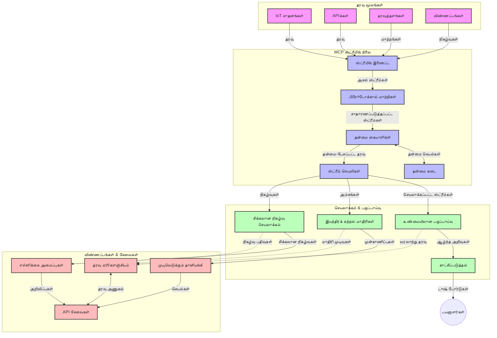

# நேரடி தரவு ஸ்ட்ரீமிங் க்கான மாதிரி சூழல் ஒப்பந்தம்

## மேலோட்டம்

நேற்று தரப்பட்ட உலகில் நிறுவனங்கள் மற்றும் பயன்பாடுகள் உடனடி தகவல்களைக் கையளிப்பதற்கு அவசியமான நேரடி தரவு ஸ்ட்ரீமிங் மிகவும் முக்கியமானதாக மாறியுள்ளன. மாதிரி சூழல் ஒப்பந்தம் (MCP) இவை நேரடி ஸ்ட்ரீமிங் செயல்முறைகளை மேம்படுத்த, தரவு செயலாக்கத்தின் திறனைக் கூடியபடுத்த, சூழல் முழுமையை பராமரித்து, மொத்த அமைப்பின் செயல்திறனை மேம்படுத்த ஒரு முக்கிய முன்னெடுப்பை வழங்குகிறது.

இந்த தொகுப்பு MCP எவ்வாறு AI மாதிரிகள், ஸ்ட்ரீமிங் தளங்கள் மற்றும் பயன்பாடுகளுக்கு இடையில் ஒரு தரமான சூழல் மேலாண்மையை வழங்குவதாக நேரடி தரவு ஸ்ட்ரீமிங் முறையை மாற்றுகிறது என்பதை ஆராய்கிறது.

## நேரடி தரவு ஸ்ட்ரீமிங்கின் அறிமுகம்

நேரடி தரவு ஸ்ட்ரீமிங் என்பது தரவு உருவானவுடன் அதனை தொடர்ச்சியாக மாற்றி, செயலாக்கி, பகுப்பாய்வு செய்யும் தொழில்நுட்பம் ஆகும். இது புதிய தகவல்களுக்கு உடனடியாக பதில் அளிக்கக் கூடியதாகும். பக்கேட் செயலாக்கத்துடன் மாறுபாடாக, இது நிலையான தரவுத்தொகுதிகளில் செயல்படுவதில்லை; அதற்கு பதிலாக இயக்கத்தில் உள்ள தரவுகளை செயலாக்கி நிமிடச் செயல் பிழையை குறைக்கின்றது.

### நேரடி தரவு ஸ்ட்ரீமிங்கின் முக்கியக் கருத்துக்கள்:

- **தொடர்ச்சி தரவு ஓட்டம்**: தரவு நிகழ்வுகள் அல்லது பதிவுகளாக நீடித்தும், முடிவற்றதும் செயலாக்கப்படுகிறது.
- **குறைந்த தாமத செயலாக்கம்**: தரவு உருவாக்கம் மற்றும் செயலாக்கத்திற்கு இடையேயான நேரத்தை குறைக்க அமைப்பு வடிவமைக்கப்பட்டுள்ளது.
- **விரிவாக்கத்திறன்**: ஸ்ட்ரீமிங் கட்டமைப்புக்கள் மாற்றத்தார்ந்த தரவு அளவுகள் மற்றும் வேகத்தை கையாள வேண்டும்.
- **பிழையற்ற சகிப்புத்தன்மை**: தவறுகளுக்கு எதிராக தகவலின் இடையூறு இல்லாத ஓட்டத்தை உறுதி செய்ய வேண்டும்.
- **நிலையான செயலாக்கம்**: நிகழ்வுகளுக்கு இடையேயான சூழலை பராமரிப்பது முக்கியமான பகுப்பாய்வுக்காக அவசியம்.

### மாதிரி சூழல் ஒப்பந்தம் மற்றும் நேரடி ஸ்ட்ரீமிங்

மாதிரி சூழல் ஒப்பந்தம் (MCP) நேரடி ஸ்ட்ரீமிங் சூழலில் பல முக்கிய சவால்களை கையாள்கிறது:

1. **சூழல் தொடர்ச்சி**: கணினித் தொகுதிகள் இடையே சூழல் பராமரிப்பை MCP தரமாக்குகிறது, AI மாதிரிகள் மற்றும் செயலாக்க முனையில் சம்பந்தப்பட்ட வரலாற்று மற்றும் சூழல் தகவல்களுக்கு அணுகலை உறுதி செய்கிறது.

2. **திறமையான நிலை மேலாண்மை**: சூழல் பரிமாற்றத்திற்கு கட்டமைக்கப்பட்ட முறைகளை வழங்குவதால் MCP ஸ்ட்ரீமிங் குழாய்களில் நிலை மேலாண்மையின் மேலதிகச் சுமையை குறைக்கிறது.

3. **இணக்குநாட்டுநிலை**: MCP வித்தியாசமான ஸ்ட்ரீமிங் தொழில்நுட்பங்கள் மற்றும் AI மாதிரிகளுக்கு இடையே சூழல் பகிர்வு மொழியை உருவாக்குகிறது, இதனால் கட்டமைப்புகள் மேலும் நெகிழ்வானதும் விரிவாக்கக்கூடியதும் ஆகின்றன.

4. **ஸ்ட்ரீமிங்-உறுதிப்படுத்தப்பட்ட சூழல்**: MCP அமலாக்கங்கள் நேரடி முடிவெடுப்புக்கான மிகவும் பொருத்தமான சூழல் உறுப்புகளை முன்னுரிமை அளிக்க முடியும்; இது செயல்திறன் மற்றும் துல்லியத்திற்கும் மேற்பார்வை செலுத்துகிறது.

5. **தனுச்செயலி செயலாக்கம்**: MCP வழியாக சரியான சூழல் மேலாண்மையுடன், தரவு மாற்றங்களின் மாறிக்கொண்டிருக்கும் நிலைகளையும் வடிவங்களையும் அடிப்படையாகக் கொண்டு ஸ்ட்ரீமிங் சாதின்கள் தானாக செயல்பாடுகளை சரிசெய்யலாம்.

இன்றைய பயன்பாடுகள், IoT சென்சார் வலையமைப்புகளிலிருந்து நிதி வர்த்தக தளங்களுக்குச் செல்லும்போது, MCP இனை ஸ்ட்ரீமிங் தொழில்நுட்பங்களுடன் ஒருங்கிணைப்பது மேலும் நுண்ணறிவு, சூழல் அறிவுடைய செயலாக்கத்தைக் கூடிய துல்லியத்துடன் இயக்கு விடுகிறது.

## கற்றல் குறிக்கோள்கள்

இந்த பாடம் முடிவில் நீங்கள்:

- நேரடி தரவு ஸ்ட்ரீமிங்கின் அடிப்படைகள் மற்றும் சவால்களை புரிந்து கொள்வீர்கள்
- மாதிரி சூழல் ஒப்பந்தம் (MCP) நேரடி ஸ்ட்ரீமிங்கை எவ்வாறு மேம்படுத்துகிறது என்பதை விளக்க முடியும்
- காஃப்கா மற்றும் புல்ஸர் போன்ற பிரபலமான கட்டமைப்புகளைப் பயன்படுத்தி MCP அடிப்படையிலான ஸ்ட்ரீமிங் தீர்வுகளை செயல்படுத்த முடியும்
- MCP மூலம் பிழையற்ற மற்றும் உயர் செயல்திறன் கொண்ட ஸ்ட்ரீமிங் கட்டமைப்புகளை வடிவமைக்கவும் நிரலிடவும் முடியும்
- IoT, நிதி வர்த்தகம் மற்றும் AI-ஏற்றுக்கொள்ளப்பட்ட பகுப்பாய்வு பயன்பாடுகளுக்கு MCP கருத்துக்களை பயன்படுத்த முடியும்
- MCP அடிப்படையிலான ஸ்ட்ரீமிங் தொழில்நுட்பங்களில் வளர்ச்சியடையும் போக்குகளை மற்றும் எதிர்கால புதுமைகளைக் கணிக்க முடியும்

### வரையறை மற்றும் முக்கியத்துவம்

நேரடி தரவு ஸ்ட்ரீமிங் என்பது குறைந்த தாமதத்துடன் தொடர்ச்சியாக தரவு உருவாக்கம், செயலாக்கம் மற்றும் பதிவேற்றத்தை உள்ளடக்கியது. பழைய தொகுதி செயலாக்கத்தின் மாறுபாடு இது, அதில் தரவு தொகுதிகளாக சேகரித்து செயல் படுத்தப்படுகிறதைவிட, நேரடியாக தரவு வருகிறவுடன் குறுக்கீடு செய்ய உதவுகிறது.

நேரடி தரவு ஸ்ட்ரீமிங்கின் முக்கிய அம்சங்கள்:

- **குறைந்த தாமதம்**: சில மில்லி வினாடிகளிலிருந்து விநாடிகளுக்குள் தரவு செயலாக்கம் மற்றும் பகுப்பாய்வு
- **தொடர்ச்சி ஓட்டம்**: பல்வேறு மூலங்களிலிருந்து தெரியவிரையாத தரவு ஓட்டங்கள்
- **உடன்திறன் செயலாக்கம்**: தொகுதிகளாக அல்லாமல் வந்தவுடன் தரவை பகுப்பாய்வு செய்தல்
- **நிகழ்வு சார்ந்த கட்டமைப்பு**: நிகழ்வுகள் நடக்கும் போதெல்லாம் பதில் அளித்தல்

### பாரம்பரிய தரவு ஸ்ட்ரீமிங் சவால்கள்

பாரம்பரிய தரவு ஸ்ட்ரீமிங் முறைகள் பல வரையறைகளை எதிர்கொள்கின்றன:

1. **சூழலை இழப்பு**: பிரிக்கப்பட்ட கணினி முறைமைகளுக்கு இடையில் சூழலை பராமரிக்க சிரமம்
2. **விரிவாக்க சிக்கல்கள்**: அதிக அளவு மற்றும் வேகத்தில் தரவை கையாளுவதில் சிரமம்
3. **இணக்குநாடு சிக்கல்கள்**: வெவ்வேறு முறைமைகளுக்கு இடையேயான ஒருங்கிணைப்பு சிக்கல்கள்
4. **தாமத மேலாண்மை**: உற்பத்தி நேரத்துடன் செயலாக்க நேரத்தை சமநிலை செய்தல்
5. **தரவு தொடர்ச்சி**: ஓட்டத்தில் தரவு துல்லியத்தன்மையும் முழுமையையும் உறுதி செய்தல்

## மாதிரி சூழல் ஒப்பந்தத்தை (MCP) அறிவோம்

### MCP என்பது என்ன?

மாதிரி சூழல் ஒப்பந்தம் (MCP) என்பது AI மாதிரிகள் மற்றும் பயன்பாடுகள் இடையேயான திறமையான தொடர்பை எளிதாக்க உருவாக்கப்பட்ட தரமான தொடர்பு ஒப்பந்தம் ஆகும். நேரடி தரவு ஸ்ட்ரீமிங்கில், MCP வழங்கும் கட்டமைப்பு:

- தரவு குழாயின் முழுக் காலத்தும் சூழலை பாதுகாக்கும்
- தரவு பரிமாற்ற வடிவங்களை ஒப்புக் கொள்வது
- பெரிய தரவுத்தொகுதிகளை மாற்றுவதற்கான சிறந்த முறைகள்
- மாதிரி இடையேயும், மாதிரி மற்றும் பயன்பாட்டுக்கிடையேயும் தொடர்பை மேம்படுத்துதல்

### அடிப்படைக் கூறுகள் மற்றும் கட்டமைப்பு

நேரடி ஸ்ட்ரீமிங்குக்கான MCP கட்டமைப்பு முக்கிய கூறுகளை கொண்டது:

1. **சூழல் மேலாளர்கள்**: ஸ்ட்ரீமிங் குழாயின் முழுவதும் சூழலை பராமரித்து நிர்வகிக்கிறார்கள்
2. **ஸ்ட்ரீம் செயலாக்கிகள்**: சூழல் அறிவுடன் வரும் தரவு ஓட்டங்களை செயலாக்குகிறார்கள்
3. **ஒப்பந்த மாற்றிகள்**: சூழலை பாதுகாத்து, வெவ்வேறு ஸ்ட்ரீமிங் ஒப்பந்தங்களுக்குள் மாற்றுகிறார்கள்
4. **சூழல் சேமிப்பு**: சூழல் தகவலை திறமையான முறையில் சேமித்து மீட்டெடுக்கிறது
5. **ஸ்ட்ரீமிங் இணைப்பாளர்கள்**: காஃப்கா, புல்ஸர், கிணிசிஸ் போன்ற பல்வேறு ஸ்ட்ரீமிங் தளங்களில் இணைக்கின்றனர்



### MCP நேரடி தரவு கையாள்வதை எப்படி மேம்படுத்துகிறது

MCP பாரம்பரிய ஸ்ட்ரீமிங் சவால்களைச் சந்திக்கிறது:

- **சூழல் முழுமை**: குழாயின் முழுவதும் தரவுத்துளைகளுக்கிடையில் தொடர்புகளை பராமரித்தல்
- **தரவு பரிமாற்றத்தில் திறமையான கட்டுப்பாடு**: அறிவார்ந்த சூழல் மேலாண்மையால் தரவுப் பரிமாற்றத்தில் மீண்டும் செய்யுதலை குறைத்தல்
- **ஒப்பந்த செய்யப்பட்ட இடைமுகங்கள்**: ஸ்ட்ரீமிங் கூறுகளுக்கான சீரான API-களை வழங்குதல்
- **குறைந்த தாமதம்**: திறமையான சூழல் கையாள்வின் மூலம் செயலாக்கச் சுமையை குறைத்தல்
- **மேம்பட்ட விரிவாக்க திறன்**: சூழலை பராமரிக்கப்பெறும் போது அகாந்த விரிவாக்கத்தை ஆதரித்தல்

## ஒருங்கிணைப்பு மற்றும் செயல்படுத்தல்

நேரடி தரவு ஸ்ட்ரீமிங் அமைப்புகள் செயல்திறன் மற்றும் சூழல் முழுமையை பராமரிக்க கவனமான கட்டமைப்பு வடிவமைப்பு மற்றும் செயல்படுத்தல் தேவை. மாதிரி சூழல் ஒப்பந்தம் AI மாதிரிகள் மற்றும் ஸ்ட்ரீமிங் தொழில்நுட்பங்களை ஒருங்கிணைக்க ஒரு தரநிலைத்தன்மையான அணுகுமுறையை வழங்குகிறது, இது மேலும் மேம்பட்ட, சூழல் அறிவுடைய செயலாக்க குழாய்களை உருவாக்க அனுமதிக்கிறது.

### ஸ்ட்ரீமிங் கட்டமைப்புகளில் MCP ஒருங்கிணைப்பு சுருக்கம்

நேரடி ஸ்ட்ரீமிங் சூழலில் MCP செயல்படுத்தும் போது கவனிக்க வேண்டியவை:

1. **சூழல் தொடர்ச்சி மற்றும் பரிமாற்றம்**: MCP தொடர்ச்சியான சூழல் தகவலை ஸ்ட்ரீமிங் தரவு தொகுதிகளில் குறியாக்கம் செய்ய மூலோபாயங்களை வழங்குகிறது; அவை தரவு செயலாக்க குழாயில் அவசியமான சூழலை சமர்த்தியுடன் தொடரச் செய்கின்றன. இதில் ஸ்ட்ரீமிங் பரிமாற்றத்திற்கு சிறந்த தரநிலை குறியாக்க வடிவங்கள் உள்ளடக்கப்படுகின்றன.

2. **நிலைத்த ஸ்ட்ரீம் செயலாக்கம்**: MCP செயலாக்க முனைகளுக்கு இடையில் தொடர்ச்சியான சூழல் பிரதிநிதித்துவத்தை பராமரித்து அறிவார்ந்த நிலைத்த செயலாக்கத்தைத் தருகிறது. இது பாரம்பரியமாக சிக்கலான நிலை மேலாண்மையை கொண்டிருக்கும் பிரிக்கப்பட்ட ஸ்ட்ரீமிங் கட்டமைப்புகளுக்கு மிகவும் பயனுள்ளதாக அமைகிறது.

3. **நிகழ்வு நேரம் மாறிவரை vs செயலாக்க நேரம்**: நிகழ்வுகள் எப்போது நடந்தன என்பதையும் அவை எப்போது செயலாக்கப்படுகின்றன என்பதையும் வேறுபடுத்தவதும் MCP செயல்பாடுகளில் அடங்கியிருக்க வேண்டும். செயற்பாட்டு ஒப்பந்தத்தில் நிகழ்வு நேர முனைக்கான காலத்தையும் சேர்க்கலாம்.

4. **பின்வட்ட அழுத்த மேலாண்மை**: SCP மூலம் சூழல் கையாள்வை தரநிலையாக்கியதால், தகவல் ஓட்டத்தில் பின்வட்ட அழுத்தத்தைக் கண்காணித்து, கூறுகள் தங்களது செயலாக்க திறனை பரிமாறிக் கொண்டு ஓட்டத்தை சரிசெய்யலாம்.

5. **சூழல் சாளர அளவீடு மற்றும் கூட்டு செயல்பாடு**: MCP கால பரப்பாலும் தொடர்பு சூழல் வடிவங்களையும் கட்டமைக்கப்பட்ட முறையில் வழங்கி, நிகழ்வு ஓட்டங்களில் குறிப்பான கூட்டு செயல்பாடுகளை மேம்படுத்தும்.

6. **தரவும்-ஒன்றும் செயலாக்கம்**: ஒருமுறை சொந்தமாக செயல்பட வேண்டிய ஸ்ட்ரீமிங் தனிக்கேள்விகளில் MCP செயலாக்க நிலை பரிந்துரைகளை கீழ்காணக் கூடிய முறையில் சேர்க்கிறது.

பல்வேறு ஸ்ட்ரீமிங் தொழில்நுட்பங்களில் MCP செயல்படுத்தல் சூழல் மேலாண்மைக்கு ஒருங்கிணைந்த அணுகுமுறையை உருவாக்கி, தனிப்பயன் ஒருங்கிணைப்பு குறியீட்டு தேவையை குறைத்து, தரவு குழாய்ச்சியில் அவசியமான சூழலைத் தருகின்றது.

### MCP பல்வேறு தரவு ஸ்ட்ரீமிங் கட்டமைப்புகளில்

இவை தற்போது உள்ள MCP குறிப்பீடுகளுக்கு அமைந்து JSON-RPC அடித்தளத்தில், வெவ்வேறு பரிசாக இயக்கக்கூடிய முறைகளை கொண்டவை. குறியீடு எப்படி தனிப்பயனான பரிசுக்களை உருவாக்கி காஃப்கா, புல்ஸர் போன்ற ஸ்ட்ரீமிங் தளங்களை MCP உடன் இணைக்கக் கூடியதாக உள்ளது என்பதை காட்டுகிறது.

இந்த எடுத்துக்காட்டுகள் MCP இன் நடுநிலை நிலையை (ஜூன் 2025) சரியாக பிரதிபலிக்கும் வகையில் குறியிடப்பட்டுள்ளன.

MCP பிரபலமான ஸ்ட்ரீமிங் கட்டமைப்புகளுடன் ஒருங்கிணைக்கப்படலாம்:

#### ஆப்பாசி காஃப்கா ஒருங்கிணைப்பு

```python
import asyncio
import json
from typing import Dict, Any, Optional
from confluent_kafka import Consumer, Producer, KafkaError
from mcp.client import Client, ClientCapabilities
from mcp.core.message import JsonRpcMessage
from mcp.core.transports import Transport

# MCP மற்றும் Kafka ஐ இணைக்க தனிப்பயன் போக்குவரத்து வகுப்பு
class KafkaMCPTransport(Transport):
    def __init__(self, bootstrap_servers: str, input_topic: str, output_topic: str):
        self.bootstrap_servers = bootstrap_servers
        self.input_topic = input_topic
        self.output_topic = output_topic
        self.producer = Producer({'bootstrap.servers': bootstrap_servers})
        self.consumer = Consumer({
            'bootstrap.servers': bootstrap_servers,
            'group.id': 'mcp-client-group',
            'auto.offset.reset': 'earliest'
        })
        self.message_queue = asyncio.Queue()
        self.running = False
        self.consumer_task = None
        
    async def connect(self):
        """Connect to Kafka and start consuming messages"""
        self.consumer.subscribe([self.input_topic])
        self.running = True
        self.consumer_task = asyncio.create_task(self._consume_messages())
        return self
        
    async def _consume_messages(self):
        """Background task to consume messages from Kafka and queue them for processing"""
        while self.running:
            try:
                msg = self.consumer.poll(1.0)
                if msg is None:
                    await asyncio.sleep(0.1)
                    continue
                
                if msg.error():
                    if msg.error().code() == KafkaError._PARTITION_EOF:
                        continue
                    print(f"Consumer error: {msg.error()}")
                    continue
                
                # செய்தி மதிப்பை JSON-RPC ஆக பகுக்கவும்
                try:
                    message_str = msg.value().decode('utf-8')
                    message_data = json.loads(message_str)
                    mcp_message = JsonRpcMessage.from_dict(message_data)
                    await self.message_queue.put(mcp_message)
                except Exception as e:
                    print(f"Error parsing message: {e}")
            except Exception as e:
                print(f"Error in consumer loop: {e}")
                await asyncio.sleep(1)
    
    async def read(self) -> Optional[JsonRpcMessage]:
        """Read the next message from the queue"""
        try:
            message = await self.message_queue.get()
            return message
        except Exception as e:
            print(f"Error reading message: {e}")
            return None
    
    async def write(self, message: JsonRpcMessage) -> None:
        """Write a message to the Kafka output topic"""
        try:
            message_json = json.dumps(message.to_dict())
            self.producer.produce(
                self.output_topic,
                message_json.encode('utf-8'),
                callback=self._delivery_report
            )
            self.producer.poll(0)  # பின்ன کال்களை தூண்டவும்
        except Exception as e:
            print(f"Error writing message: {e}")
    
    def _delivery_report(self, err, msg):
        """Kafka producer delivery callback"""
        if err is not None:
            print(f'Message delivery failed: {err}')
        else:
            print(f'Message delivered to {msg.topic()} [{msg.partition()}]')
    
    async def close(self) -> None:
        """Close the transport"""
        self.running = False
        if self.consumer_task:
            self.consumer_task.cancel()
            try:
                await self.consumer_task
            except asyncio.CancelledError:
                pass
        self.consumer.close()
        self.producer.flush()

# Kafka MCP போக்குவரத்துக்கான உதாரண பயன்பாடு
async def kafka_mcp_example():
    # Kafka போக்குவரத்துடன் MCP கிளையண்ட் உருவாக்கவும்
    client = Client(
        {"name": "kafka-mcp-client", "version": "1.0.0"},
        ClientCapabilities({})
    )
    
    # Kafka போக்குவரத்தை உருவாக்கி இணைக்கவும்
    transport = KafkaMCPTransport(
        bootstrap_servers="localhost:9092",
        input_topic="mcp-responses",
        output_topic="mcp-requests"
    )
    
    await client.connect(transport)
    
    try:
        # MCP அமர்வை துவக்கவும்
        await client.initialize()
        
        # MCP மூலம் ஒரு கருவியை இயக்கு உதாரணம்
        response = await client.execute_tool(
            "process_data",
            {
                "data": "sample data",
                "metadata": {
                    "source": "sensor-1",
                    "timestamp": "2025-06-12T10:30:00Z"
                }
            }
        )
        
        print(f"Tool execution response: {response}")
        
        # சுத்தமான மூடு
        await client.shutdown()
    finally:
        await transport.close()

# உதாரணம் இயக்கவும்
if __name__ == "__main__":
    asyncio.run(kafka_mcp_example())
```

#### ஆப்பாசி புல்ஸர் செயல்படுத்தல்

```python
import asyncio
import json
import pulsar
from typing import Dict, Any, Optional
from mcp.core.message import JsonRpcMessage
from mcp.core.transports import Transport
from mcp.server import Server, ServerOptions
from mcp.server.tools import Tool, ToolExecutionContext, ToolMetadata

# புல்சர் பயன்படுத்தும் தனிப்பயன் MCP போக்குவரத்தை உருவாக்கவும்
class PulsarMCPTransport(Transport):
    def __init__(self, service_url: str, request_topic: str, response_topic: str):
        self.service_url = service_url
        self.request_topic = request_topic
        self.response_topic = response_topic
        self.client = pulsar.Client(service_url)
        self.producer = self.client.create_producer(response_topic)
        self.consumer = self.client.subscribe(
            request_topic,
            "mcp-server-subscription",
            consumer_type=pulsar.ConsumerType.Shared
        )
        self.message_queue = asyncio.Queue()
        self.running = False
        self.consumer_task = None
    
    async def connect(self):
        """Connect to Pulsar and start consuming messages"""
        self.running = True
        self.consumer_task = asyncio.create_task(self._consume_messages())
        return self
    
    async def _consume_messages(self):
        """Background task to consume messages from Pulsar and queue them for processing"""
        while self.running:
            try:
                # நேரம் முடிவோடு தடைப்படாத பெறுதல்
                msg = self.consumer.receive(timeout_millis=500)
                
                # செய்தியை செயலாக்கவும்
                try:
                    message_str = msg.data().decode('utf-8')
                    message_data = json.loads(message_str)
                    mcp_message = JsonRpcMessage.from_dict(message_data)
                    await self.message_queue.put(mcp_message)
                    
                    # செய்தியினை உறுதிப்படுத்தவும்
                    self.consumer.acknowledge(msg)
                except Exception as e:
                    print(f"Error processing message: {e}")
                    # பிழை இருந்தால் எதிர்மறை உறுதி செய்தி
                    self.consumer.negative_acknowledge(msg)
            except Exception as e:
                # நேரம் முடிவு அல்லது பிற исключения கையாளவும்
                await asyncio.sleep(0.1)
    
    async def read(self) -> Optional[JsonRpcMessage]:
        """Read the next message from the queue"""
        try:
            message = await self.message_queue.get()
            return message
        except Exception as e:
            print(f"Error reading message: {e}")
            return None
    
    async def write(self, message: JsonRpcMessage) -> None:
        """Write a message to the Pulsar output topic"""
        try:
            message_json = json.dumps(message.to_dict())
            self.producer.send(message_json.encode('utf-8'))
        except Exception as e:
            print(f"Error writing message: {e}")
    
    async def close(self) -> None:
        """Close the transport"""
        self.running = False
        if self.consumer_task:
            self.consumer_task.cancel()
            try:
                await self.consumer_task
            except asyncio.CancelledError:
                pass
        self.consumer.close()
        self.producer.close()
        self.client.close()

# ஸ்ட்ரீமிங் தரவை செயலாக்கும் மாதிரி MCP கருவியை வரையறுக்கவும்
@Tool(
    name="process_streaming_data",
    description="Process streaming data with context preservation",
    metadata=ToolMetadata(
        required_capabilities=["streaming"]
    )
)
async def process_streaming_data(
    ctx: ToolExecutionContext,
    data: str,
    source: str,
    priority: str = "medium"
) -> Dict[str, Any]:
    """
    Process streaming data while preserving context
    
    Args:
        ctx: Tool execution context
        data: The data to process
        source: The source of the data
        priority: Priority level (low, medium, high)
        
    Returns:
        Dict containing processed results and context information
    """
    # MCP சூழலை பயன்படுத்தும் செயலாக்க உதாரணம்
    print(f"Processing data from {source} with priority {priority}")
    
    # MCP இல் இருந்து உரையாடல் சூழலை அணுகவும்
    conversation_id = ctx.conversation_id if hasattr(ctx, 'conversation_id') else "unknown"
    
    # மேம்பட்ட சூழலைக் கொண்டு முடிவுகளை வழங்கவும்
    return {
        "processed_data": f"Processed: {data}",
        "context": {
            "conversation_id": conversation_id,
            "source": source,
            "priority": priority,
            "processing_timestamp": ctx.get_current_time_iso()
        }
    }

# புல்சர் போக்குவரத்தை பயன்படுத்தும் MCP சேவையகத்தின் உதாரண செயலாக்கம்
async def run_mcp_server_with_pulsar():
    # MCP சேவையகத்தை உருவாக்கவும்
    server = Server(
        {"name": "pulsar-mcp-server", "version": "1.0.0"},
        ServerOptions(
            capabilities={"streaming": True}
        )
    )
    
    # எங்கள் கருவியை பதிவு செய்யவும்
    server.register_tool(process_streaming_data)
    
    # புல்சர் போக்குவரத்தை உருவாக்கி இணைக்கவும்
    transport = PulsarMCPTransport(
        service_url="pulsar://localhost:6650",
        request_topic="mcp-requests",
        response_topic="mcp-responses"
    )
    
    try:
        # புல்சர் போக்குவரத்துடன் சேவையகத்தை தொடங்கு
        await server.run(transport)
    finally:
        await transport.close()

# சேவையகத்தை இயக்கு
if __name__ == "__main__":
    asyncio.run(run_mcp_server_with_pulsar())
```

### கடந்து செயல்படுத்தும் சிறந்த நடைமுறைகள்

MCP ஐ நேரடி ஸ்ட்ரீமிங்கில் செயல்படுத்தும் போது:

1. **பிழை சகிப்புத்தன்மைக்காக வடிவமைக்கவும்**:
   - சரியான பிழை கையாள்வை நடைமுறைப்படுத்தவும்
   - தோல்வியான செய்திகளுக்காக dead-letter தரிசைகள் பயன்படுத்தவும்
   - இடும்படையில்லா செயலிகள் வடிவமைக்கவும்

2. **செயல்திறனுக்காக மேம்படுத்தவும்**:
   - படிக அளவுகளைச் சரி செய்யவும்
   - தேவையான இடங்களில் தொகுக்கல் பயன்படுத்தவும்
   - பின்வட்ட அழுத்த முறைகளை நடைமுறைப்படுத்தவும்

3. **கண்காணிப்பு மற்றும் ஆய்வு செய்வது**:
   - ஸ்ட்ரீம் செயலாக்க அளவுகோல்களை கண்காணிக்கவும்
   - சூழல் பரவல் கண்காணிக்கவும்
   - வித்தியாசங்களுக்கு அறிவிப்புகளை அமைக்கவும்

4. **உங்கள் ஸ்ட்ரீம்களை பாதுகாக்கவும்**:
   - உணர்ச்சி மிக்க தரவுக்கு குறியாக்கம் பயன்படுத்தவும்
   - ஆவணப்படுத்தல் மற்றும் அங்கீகாரத்தை பயன்படுத்தவும்
   - சரியான அணுகல் கட்டுப்பாடுகளை செயல்படுத்தவும்


### MCP IoT மற்றும் எட்ஜ் கணின்துறையிலும்

MCP இல் வெளிநகரக் கணினித்துறையில் முன்னேற்றம்:

- சாதன சூழமைப்பை செயலாக்க குழாயின் முழுவதும் பாதுகாத்தல்
- எட்ஜ் இருந்து மேகம் வரை திறமையான தரவு ஸ்ட்ரீமிங்கை இயக்கு
- IoT தரவு ஸ்ட்ரீமுகளில் நேரடி பகுப்பாய்வை ஆதரிக்க
- சூழல் அறிவுடன் சாதனங்களுக்கு இடையிடை தொடர்பை எளிதாக்குதல்

உதாரணம்: ஸ்மார்ட் நகர சென்சார் வலைகள்
```
Sensors → Edge Gateways → MCP Stream Processors → Real-time Analytics → Automated Responses
```

### நிதி பரிவர்த்தனைகளில் மற்றும் உயர்நிலை வர்த்தகத்தில் பங்கு

நிதி தரவு ஸ்ட்ரீமிங்கில் MCP முக்கிய நன்மைகள்:

- வர்த்தக முடிவுகளுக்கு மிக குறைந்த தாமத செயலாக்கம்
- செயலாக்க முழுவதும் பரிவர்த்தனை சூழலை பராமரித்தல்
- சூழல் அறிவுடன் கூடிய சிக்கலான நிகழ்வு செயலாக்கத்திற்கு ஆதரவு
- பிரிக்கப்பட்ட வர்த்தக முறைமைகளில் தரவு தொடர்ச்சியை உறுதி செய்தல்

### AI இயக்கிய தரவு பகுப்பாய்விலுள்ள மேம்பாட்டு முன்னேற்றங்கள்

MCP ஸ்ட்ரீமிங் பகுப்பாய்வுக்கு புதிய வாய்ப்புகளை ஏற்படுத்துகிறது:

- நேரடி மாதிரி பயிற்சி மற்றும் முன்னறிவிப்பு
- ஸ்ட்ரீமிங் தரவுகளிலிருந்து தொடர்ந்த கற்றல்
- சூழல் அறிவுடன் செயல்படும் அம்ச எடுப்பு
- பாதுகாக்கப்பட்ட சூழலுடன் பன்மூல மாதிரி முன்னறிவிப்பு குழாய்கள்

## எதிர்கால போக்குகள் மற்றும் புதுமைகள்

### நேரடி சூழலில் MCP வளர்ச்சி

எதிர்காலத்தில் MCP குறித்து:

- **குவாண்டம் கணினி ஒருங்கிணைப்பு**: குவாண்டம் அடிப்படையிலான ஸ்ட்ரீமிங் அமைப்புகள் தயாரித்தல்
- **எட்ஜ்-பூர்வ செயலாக்கம்**: அதிகமான சூழல் அறிவுடைய செயலாக்கத்தை எட்ஜ் சாதனங்களுக்கு மாற்றுதல்
- **தானாக மேம்படும் ஸ்ட்ரீமிங் நிரலாக்கம்**: தானாகவே செயல்திறன் உயரும் குழாய்கள்
- **மக்கள் ஒன்று கூடி செயலாக்கம்**: தனியுரிமையை பராமரித்த பங்கு செயலாக்கம்

### தொழில்நுட்ப முன்னேற்றங்கள்

MCP ஸ்ட்ரீமிங்கை வடிவமைக்கும் மறுமொழி தொழில்நுட்பங்கள்:

1. **AI-திறமையுடைய ஸ்ட்ரீமிங் ஒப்பந்தங்கள்**: AI பண்புகளுக்கான தனிப்பயன் ஒப்பந்தங்கள்
2. **நியூரோமார்பிக் கணினி ஒருங்கிணைப்பு**: தம்பதியினைப் போல செயல்படும் கணினித் தொழில்நுட்பம்
3. **சேவையற்ற ஸ்ட்ரீமிங்**: கட்டமைப்பு மேலாண்மையின்றி நிகழ்வு சார்ந்த ஸ்ட்ரீமிங்
4. **பிரிக்கப்பட்ட சூழல் சேமிப்புக்கள்**: உலகளாவிய அளவில் பகிரப்பட்ட ஆனால் உயர்ந்த தொடர்ச்சியுடைய சூழல் மேலாண்மை

## செயல்பாட்டு பயிற்சிகள்

### பயிற்சி 1: அடிப்படையான MCP ஸ்ட்ரீமிங் குழாயை அமைத்தல்

இந்த பயிற்சியில், நீங்கள் எப்படி:
- அடிப்படையாக MCP ஸ்ட்ரீமிங் சூழலை கட்டமைப்பது
- ஸ்ட்ரீம் செயலாக்கத்தில் சூழல் மேலாளர்களை செயல்படுத்துவது
- சூழல் பாதுகாப்பை சோதித்து உறுதிசெய்வது என்பதை கற்றுக்கொள்வீர்கள்

### பயிற்சி 2: நேரடி பகுப்பாய்வு டாஷ்போர்ட்டை உருவாக்குதல்

முழுமையான பயன்பாட்டை உருவாக்குங்கள்:
- MCP பயன்படுத்தி ஸ்ட்ரீமிங் தரவை ஏற்றுதல்
- சூழலை பராமரிக்கவும் ஸ்ட்ரீமிங் செயலாற்றல் செய்தல்
- முடிவுகளை நேரடியாக காட்சிப்படுத்தல்

### பயிற்சி 3: MCP உடன் சிக்கலான நிகழ்வு செயலாக்கம்

மேம்பட்ட பயிற்சி:
- ஸ்ட்ரீம்களில் எடுத்துக்காட்டுகளை கண்டறிதல்
- பல ஸ்ட்ரீம்களுக்கிடையே சூழல் ஒப்பீடு
- பாதுகாக்கப்பட்ட சூழலுடன் சிக்கலான நிகழ்வுகளை உருவாக்குதல்

## கூடுதல் வளங்கள்

- [Model Context Protocol Specification](https://modelcontextprotocol.io) - அதிகாரப்பூர்வ MCP குறிப்புரை மற்றும் ஆவணங்கள்
- [Apache Kafka Documentation](https://kafka.apache.org/documentation/) - ஸ்ட்ரீம் செயலாக்கத்திற்கு காஃப்காவைப் பற்றி கற்றுக்கொள்ளவும்
- [Apache Pulsar](https://pulsar.apache.org/) - ஒருங்கிணைந்த செய்தி மற்றும் ஸ்ட்ரீமிங் தளம்
- [Streaming Systems: The What, Where, When, and How of Large-Scale Data Processing](https://www.oreilly.com/library/view/streaming-systems/9781491983867/) - ஸ்ட்ரீமிங் கட்டமைப்புகளுக்கான விரிவான புத்தகம்
- [Microsoft Azure Event Hubs](https://learn.microsoft.com/azure/event-hubs/event-hubs-about) - நிர்வகிக்கப்படும் நிகழ்வுக் குவியல் சேவை
- [MLflow Documentation](https://mlflow.org/docs/latest/index.html) - இயந்திர கற்றல் மாதிரி கண்காணிப்பு மற்றும் செயல்படுத்தல்
- [Real-Time Analytics with Apache Storm](https://storm.apache.org/releases/current/index.html) - நேரடி கணிதக்கூறுகளுக்கான செயலாக்க கட்டமைப்பு
- [Flink ML](https://nightlies.apache.org/flink/flink-ml-docs-master/) - ஆப்பாசி ஃப்லிங்க் க்கான இயந்திர கற்றல் நூலகம்
- [LangChain Documentation](https://python.langchain.com/docs/get_started/introduction) - LLM களைப் பயன்படுத்தி பயன்பாடுகளை உருவாக்குதல்


## கற்றல் விளைவுகள்

இந்த தொகுப்பை முடித்தவுடன், நீங்கள்:

- நேரடி தரவு ஸ்ட்ரீமிங்கின் அடிப்படைகள் மற்றும் சவால்களை புரிந்து கொள்வீர்கள்
- மாதிரி சூழல் ஒப்பந்தம் (MCP) நேரடி ஸ்ட்ரீமிங்கை எவ்வாறு மேம்படுத்துகிறது என்பதைக் கூற முடியும்
- காஃப்கா மற்றும் புல்ஸர் போன்ற பிரபலமான கட்டமைப்புகளைப் பயன்படுத்தி MCP அடிப்படையிலான ஸ்ட்ரீமிங் தீர்வுகளை செயல்படுத்த முடியும்
- MCP மூலம் பிழையற்ற மற்றும் உயர் செயல்திறன் கொண்ட ஸ்ட்ரீமிங் கட்டமைப்புகளை வடிவமைக்கவதும், நேர்த்தியாக அமல்படுத்தவதும் முடியும்
- IoT, நிதி வர்த்தகம் மற்றும் AI இயக்கப்பட்ட பகுப்பாய்வு பயன்பாடுகளுக்கு MCP கருத்துக்களை பயன்படுத்த முடியும்
- MCP அடிப்படையிலான ஸ்ட்ரீமிங் தொழில்நுட்பங்களில் வளர்ச்சியடையும் போக்குகளை மற்றும் எதிர்கால புதுமைகளைக் கணிக்க முடியும்

## அடுத்தது என்ன

- [5.11 நேரடி தேடல்](../mcp-realtimesearch/README.md)

---

<!-- CO-OP TRANSLATOR DISCLAIMER START -->
**மறுப்பு**:
இந்த ஆவணம் AI மொழிபெயர்ப்பு சேவை [Co-op Translator](https://github.com/Azure/co-op-translator) பயன்படுத்தி மொழிபெயர்க்கப்பட்டுள்ளது. நாங்கள் துல்லியத்திற்காக முயற்சி செய்துள்ளோம், ஆனால் தானாக செய்யப்படும் மொழிபெயர்ப்புகளில் பிழைகள் அல்லது தவறுகள் இருக்கலாம் என்பதை கவனத்தில் கொள்ளவும். அசல் ஆவணம் அதன் தாய்மொழியில் அதிகாரப்பூர்வ ஆதாரமாக கருதப்பட வேண்டும். முக்கியமான தகவல்களுக்கு, தொழில்நுட்பமான மனித மொழிபெயர்ப்பு பரிந்துரைக்கப்படுகிறது. இந்த மொழிபெயர்ப்பைப் பயன்படுத்துவதால் ஏற்படும் எந்த தவறான புரிதல்கள் அல்லது தவறான விளக்கத்திற்கும் நாங்கள் பொறுப்பில்வில்லை.
<!-- CO-OP TRANSLATOR DISCLAIMER END -->