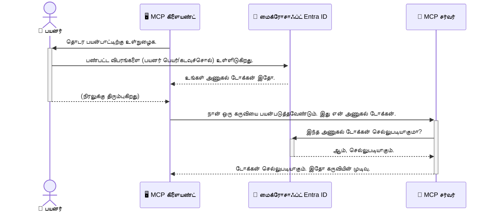

# AI வேலைப்பாடுகளை பாதுகாப்பது: மாதிரி உள்ளடக்க நெறிமுறை சேவையகங்களுக்கு Entra ID அங்கீகாரம்

## அறிமுகம்
உங்கள் மாதிரி உள்ளடக்க நெறிமுறை (MCP) சேவையகத்தை பாதுகாப்பது உங்கள் வீட்டின் முன்னணி கதவை பூட்டி வைப்பது போல் முக்கியம். உங்கள் MCP சேவையகத்தை திறந்தவாகவிட்டு வைப்பது உங்கள் கருவிகள் மற்றும் தரவை அனுமதியற்ற அணுகலுக்கு உட்படுத்துவதைக் குறிக்கும், இது பாதுகாப்பு குறைபாடுகள் உருவாக்கும். Microsoft Entra ID ஒரு வலுவான கிளவுட் அடிப்படையிலான அடையாள மற்றும் அணுகல் மேலாண்மை தீர்வை வழங்குகிறது, இது அனுமதிக்கப்பட்ட பயனாளர்கள் மற்றும் பயன்பாடுகள் மட்டுமே உங்கள் MCP சேவையகத்துடன் தொடர்பு கொள்ள முடியும் என்பதில் உறுதி செய்கிறது. இந்த பிரிவில், நீங்கள் Entra ID அங்கீகாரம் மூலம் உங்கள் AI வேலைப்பாடுகளை பாதுகாப்பது எப்படி என்பதைக் கற்கப்போகிறீர்கள்.

## கற்றல் குறிக்கோள்கள்
இந்தப் பிரிவின் முடிவில், நீங்கள் செய்யக்கூடியவை:

- MCP சேவையகங்களை பாதுகாப்பது எதற்கு முக்கியம் என்பதை புரிந்து கொள்ள.
- Microsoft Entra ID மற்றும் OAuth 2.0 அங்கீகாரம் அடிப்படைகளை விளக்க.
- பொது மற்றும் நம்பக கூலர்களுக்கு இடையிலான வேறுபாட்டை உணர.
- Entra ID அங்கீகாரத்தை உள்ளூர் (பொது கூல்) மற்றும் தொலைநிலையிலான (நம்பக கூல்) MCP சேவையக சூழல்களில் நடைமுறைப்படுத்த.
- AI வேலைப்பாடுகளை உருவாக்கும் போது பாதுகாப்பு சிறந்த நடைமுறைகளை பின்பற்ற.

## பாதுகாப்பும் MCP

உங்கள் வீட்டின் முன்னணி கதவை பூட்டி வைக்காமல் வைப்பதைப்போல், உங்கள் MCP சேவையகத்தை யாருக்கு வேண்டுமானாலும் அணுகும் வகையில் திறந்தவிவைக்க கூடாது. உங்கள் AI வேலைப்பாடுகளை பாதுகாப்பது வலுவான, நம்பகமான மற்றும் பாதுகாப்பான பயன்பாடுகளை உருவாக்குவதற்குக் கழுகிச் செய்யும். இந்த அத்தியாயம் Microsoft Entra ID பயன்படுத்தி உங்கள் MCP சேவையகங்களை பாதுகாப்பது எப்படி என்பதைக் கற்றுக்கொடுக்கிறது, இதனால் அனுமதிக்கப்பட்ட பயனாளர்களும் பயன்பாடுகளும் மட்டுமே உங்களுடைய கருவிகள் மற்றும் தரவோடு தொடர்பு கொள்ள முடியும்.

## MCP சேவையகங்களுக்கு பாதுகாப்பு ஏன் முக்கியம்?

உங்கள் MCP சேவையகத்தில் மின்னஞ்சல் அனுப்பும் அல்லது வாடிக்கையாளர் தரவுத்தளத்தை அணுகும் ஒரு கருவி 있다고 கருதுங்கள். பாதுகாப்பற்ற சேவையகம் எந்த ஒருவர் அதைப் பயன்படுத்தி அனுமதியற்ற தரவு அணுகல், ஸ்பாம் அல்லது பிற தீவிர நடவடிக்கைகள் செய்ய வாய்ப்பு தரும்.

அங்கீகாரத்தை நடைமுறைப்படுத்துவதன் மூலம், சேவையகத்திற்கு வரும் ஒவ்வொரு கோரிக்கையும் சரிபார்க்கப்படுகிறது, கோரிக்கையிடும் பயனர் அல்லது பயன்பாட்டின் அடையாளத்தை உறுதிப்படுத்துகிறது. இது உங்கள் AI வேலைப்பாடுகளை பாதுகாப்பதில் முதல் மற்றும் மிக முக்கியமான படியாகும்.

## Microsoft Entra ID அறிமுகம்

[**Microsoft Entra ID**](https://adoption.microsoft.com/microsoft-security/entra/) என்பது கிளவுட் அடிப்படையிலான அடையாள மற்றும் அணுகல் மேலாண்மை சேவையாகும். உங்கள் பயன்பாடுகளுக்கான பொது பாதுகாப்பு காவலர் போல இது செயல்படுகிறது. பயனாளர் அடையாளங்களை சோதிக்கும் (அங்கீகாரம்) மற்றும் அவர்கள் என்ன செய்ய அனுமதிக்கப்படுகிறார்கள் என்பதை நிர்ணயிப்பதைக் (அங்கீகரிப்பு) கையாள்கிறது.

Entra ID பயன்படுத்துவதன் மூலம், நீங்கள்:

- பயனாளர்களுக்கான பாதுகாப்பான உள்நுழைவுகளை இயக்கு.
- APIகளையும் சேவைகளையும் பாதுகாக்க.
- அணுகல் கொள்கைகளை மைய இடத்தில் இருந்து நிர்வகிக்க முடியும்.

MCP சேவையகங்களுக்கு, Entra ID ஒரு வலுவான மற்றும் பரவலாக நம்பப்பட்ட தீர்வை வழங்குகிறது, உங்கள் சேவையகத்தின் திறன்களை யார் அணுகலாம் என்பதை நிர்வகிக்க.

---

## மாயாஜாலத்தை புரிந்து கொள்வது: Entra ID அங்கீகாரம் எப்படி வேலை செய்கிறது

Entra ID **OAuth 2.0** போன்ற திறந்த தரநிலைகளை பயன்படுத்தி அங்கீகாரத்தை கையாள்கிறது. விவரங்கள் சிக்கலானதாக இருக்கலாம் என்றாலும், அடிப்படையான கருத்து எளிமையானதும், ஒப்புமையால் புரிந்துகொள்ளக்கூடியதும் ஆகும்.

### OAuth 2.0 இன் மென்மையான அறிமுகம்: வாலைட் விசை

OAuth 2.0 உங்களது காருக்கான வாலைட் சேவையைப் போல நினைத்துக் கொள்ளலாம். நீங்கள் ஒரு உணவகத்திற்கு வரும்போது, உங்களது மாஸ்டர் விசையை வாலைட்டுக்குத் தரமாட்டீர்கள். அதற்கு பதிலாக, காரை ஓட்டவும் கதவுகளை பூட்டி வைக்கவும் கூடிய, ஆனாலும் டிரங்க் அல்லது க்ளவ் கம்பார்ட்மெண்டை திறக்க முடியாத **வாலைட் விசையை** நீங்கள் வழங்குவீர்கள்.

இந்த ஒப்புமையில்:

- **நீங்கள்** என்பது **பயனர்**.
- **உங்கள் கார்** என்பது மதிப்புமிக்க கருவிகள் மற்றும் தரவுகளுடன் கூடிய **MCP சேவையகம்**.
- **வாலைட்** என்பது **Microsoft Entra ID**.
- **பார்க்கிங் அட்டெண்டண்ட்** என்பது **MCP கிளையண்ட்** (சேவையகத்தை அணுக முயற்சிக்கும் பயன்பாடு).
- **வாலைட் விசை** என்பது **அணுகல் டோக்கன்**.

அணுகல் டோக்கன் என்பது உங்கள் உள்நுழைவிற்கு பிறகு Entra IDயிடமிருந்து MCP கிளையண்ட் பெறும் பாதுகாப்பான உரை தொடர் ஆகும். அந்த டோக்கனை MCP சேவையகத்திற்கு ஒவ்வொரு கோரிக்கையிலும் கிளையண்ட் சமர்ப்பிக்கிறது. சேவையகம் அந்த டோக்கனை சரிபார்க்கிறது, கோரிக்கை செல்லுபடியாகும் என்பதை உறுதிசெய்கிறது மற்றும் கிளையண்ட் தேவையான அனுமதிகளைக் கொண்டிருக்கிறது என்பதை உறுதி செய்கிறது, உங்கள் உண்மையான அடையாளப் பதிவு விவரங்களை (உங்கள் கடவுச்சொல்லைப் போன்றவை) கையாளாமல்.

### அங்கீகார ஓட்டம்

இவ்வாறு நடைமுறையாக இது செயல்படுகிறது:



### Microsoft Authentication Library (MSAL) அறிமுகம்

கோட்பாகம் பார்க்கும் முன், எடுத்துக்காட்டுகளில் காணப்படும் முக்கிய கூறான **Microsoft Authentication Library (MSAL)** ஐ அறிமுகம் செய்ய வேண்டும்.

MSAL என்பது ஒரு நூலகமாகும், இது Microsoft tarafından உருவாக்கப்பட்டுள்ளது, இது வளர்ப்பவர்களுக்கு அங்கீகாரத்தை கையாள மிகவும் எளிதாக்குகிறது. நீங்கள் பாதுகாப்பு டோக்கன்களை கையாளுதல், உள்நுழைவுகளை நிர்வகித்தல் மற்றும் அமர்வு புதுப்பிப்பை எழுதியிட வேண்டிய அவசியம் இல்லாமல் MSAL அவற்றைச் செய்து கொடுக்கிறது.

MSAL பயன்படுத்த பரிந்துரைக்கப்படுவதன் காரணங்கள்:

- **பாதுகாப்பானது:** இது தொழில்துறைத்தரநிலை நெறிமுறைகள் மற்றும் பாதுகாப்பின் சிறந்த நடைமுறைகளை பின்பற்றுகிறது, உங்கள் கோடுகளில் உள்ள பலவீனங்களின் ஆபத்தை குறைக்கிறது.
- **உருவாக்கத்தைக் எளிமையாக்கும்:** OAuth 2.0 மற்றும் OpenID Connect நெறிமுறைகளின் சிக்கல்களை மறைத்து, உங்கள் பயன்பாட்டிற்கு வலுவான அங்கீகாரத்தை சில வரிகளுக்குள் சேர்க்கும் வாய்ப்பை தருகிறது.
- **பராமரிக்கபடும்:** Microsoft சீரமைக்கௌண்ட வந்துகொண்டுள்ள இந்நூலகம் புதிய பாதுகாப்பு அச்சுறுத்தல்களும், பரிதி மாற்றங்களும் அடிப்படையில் புதுப்பிக்கப்படுகிறது.

MSAL .NET, JavaScript/TypeScript, Python, Java, Go மற்றும் iOS, Android போன்ற மொபைல் வலைப்பின்னல்கள் உட்பட பல மொழி மற்றும் பயன்பாட்டு கட்டமைப்புகளை ஆதரிக்கிறது. இதனால் உங்கள் தொழில்நுட்ப பண்பட்டியில் ஒரே மாதிரிப் பாதுகாப்பு முறைகளை பயன்படுத்த முடியும்.

MSAL குறித்த மேலதிக தகவலுக்கு, அதிகாரபூர்வ [MSAL அவலோக ஆவணம்](https://learn.microsoft.com/entra/identity-platform/msal-overview) ஐப் பாருங்கள்.

---

## Entra ID உடன் உங்கள் MCP சேவையகத்தை பாதுகாப்பது: படி படியாக வழிகாட்டி

இப்போது, Entra ID பயன்படுத்தி உள்ளூர் MCP சேவையகத்தை (stdio மூலமாக தொடர்பு கொள்ளும்) பாதுகாப்பது எப்படி என்பதைப் பார்ப்போம். இந்த எடுத்துக்காட்டு **பொது கூல்** பயன்பாட்டை பயன்படுத்துகிறது, இது பயனாளரின் இயந்திரத்தில் ஓடும் பயன்பாடுகளுக்கு, உதாரணமாக டெஸ்க் டாப் செயலி அல்லது உள்ளூர் உருவாக்க சேவையகம், பொருத்தமாகும்.

### நிலை 1: உள்ளூர் MCP சேவையகத்தை பாதுகாப்பது (பொது கூல் உடன்)

இந்த நிலையில், `stdio` மூலமாக தொடர்பு கொள்ளும், உள்ளூர் ஓடும் MCP சேவையகத்தை பார்க்கப்போகிறோம், இது Entra ID அங்கீகாரம் கொண்டு பயனாளரை அனுமதி பெறுவதற்கு முன் அனுமதிக்கிறது. சேவையகத்தில் Microsoft Graph API இலிருந்து பயனர் இறுதிப் பதிவுகளை பெற்று தரும் ஒரு கருவி இருக்கும்.

#### 1. Entra IDஇல் பயன்பாட்டை அமைக்குதல்

எந்தவொரு கோடுமுறையையும் எழுதும் முன், Microsoft Entra IDயில் உங்கள் பயன்பாட்டை பதிவு செய்யவேண்டும். இது Entra IDக்கு உங்கள் பயன்பாட்டைப் பற்றி தெரிவிக்கிறது மற்றும் அங்கீகார சேவையைப் பயன்படுத்த அனுமதிக்கிறது.

1. **[Microsoft Entra போர்ட்டல்](https://entra.microsoft.com/)** செல்லுங்கள்.
2. **App registrations**க்குச் சென்று **New registration** கிளிக் செய்யுங்கள்.
3. உங்கள் பயன்பாட்டுக்கு பெயர் கொடுங்கள் (எ.கா., "My Local MCP Server").
4. **Supported account types** இல் **Accounts in this organizational directory only** தெரிவுசெய்யவும்.
5. இந்த எடுத்துக்காட்டிற்கு **Redirect URI** காலியாக விடலாம்.
6. **Register** கிளிக் செய்யவும்.

பதிவுச் செய்த பிறகு, **Application (client) ID** மற்றும் **Directory (tenant) ID** குறித்த விவரங்களை குறிக்கவும். உங்கள் கோடுகளில் அவற்றை பயன்படுத்த வேண்டியுள்ளது.

#### 2. கோடு: ஒரு பகுப்பாய்வு

அங்கீகாரத்தை கையாளும் முக்கிய பகுதிகளை பார்ப்போம். முழு எடுத்துக்காட்டு [Entra ID - Local - WAM](https://github.com/Azure-Samples/mcp-auth-servers/tree/main/src/entra-id-local-wam) என்ற கோப்புறையில் உள்ளது, இது [mcp-auth-servers GitHub தொகுப்பு](https://github.com/Azure-Samples/mcp-auth-servers)யில் கிடைக்கும்.

**`AuthenticationService.cs`**

இந்த வகுப்பு Entra ID உடன் தொடர்பைப் பராமரிக்க பொறுப்பு.

- **`CreateAsync`**: MSAL (Microsoft Authentication Library) இலிருந்து `PublicClientApplication` உருவாக்குகிறது. இது உங்கள் பயன்பாட்டின் `clientId` மற்றும் `tenantId` கொண்டு கொணர்க்கப்படுகிறது.
- **`WithBroker`**: இது Windows Web Account Manager போன்ற ப்ரோகர் பயன்பாட்டை செயல்படுத்துகிறது, இது பாதுகாப்பான மற்றும் அசாதாரண ஒரே உள்நுழைவு அனுபவத்தை வழங்கும்.
- **`AcquireTokenAsync`**: இதுதான் முக்கிய முறை. முதலில் இது அமைதியான முறையில் (silent) டோக்கன் பெற முயல்கிறது, அதாவது பயனர் ஏற்கனவே செல்லுபடியாகும் அமர்வை வைத்திருந்தால் மீண்டும் உள்நுழைய வேண்டாம். அமைதியான முறையால் டோக்கனைக் கிடைக்காமல் இருந்தால், பயனரை மீண்டும் திறந்தவெளியில் உள்நுழையும்படி கேட்டல் செய்கிறது.

```csharp
// Simplified for clarity
public static async Task<AuthenticationService> CreateAsync(ILogger<AuthenticationService> logger)
{
    var msalClient = PublicClientApplicationBuilder
        .Create(_clientId) // Your Application (client) ID
        .WithAuthority(AadAuthorityAudience.AzureAdMyOrg)
        .WithTenantId(_tenantId) // Your Directory (tenant) ID
        .WithBroker(new BrokerOptions(BrokerOptions.OperatingSystems.Windows))
        .Build();

    // ... cache registration ...

    return new AuthenticationService(logger, msalClient);
}

public async Task<string> AcquireTokenAsync()
{
    try
    {
        // Try silent authentication first
        var accounts = await _msalClient.GetAccountsAsync();
        var account = accounts.FirstOrDefault();

        AuthenticationResult? result = null;

        if (account != null)
        {
            result = await _msalClient.AcquireTokenSilent(_scopes, account).ExecuteAsync();
        }
        else
        {
            // If no account, or silent fails, go interactive
            result = await _msalClient.AcquireTokenInteractive(_scopes).ExecuteAsync();
        }

        return result.AccessToken;
    }
    catch (Exception ex)
    {
        _logger.LogError(ex, "An error occurred while acquiring the token.");
        throw; // Optionally rethrow the exception for higher-level handling
    }
}
```

**`Program.cs`**

இங்கு MCP சேவையகம் அமைக்கப்பட்டு அங்கீகார சேவை இணைக்கப்படுகிறது.

- **`AddSingleton<AuthenticationService>`**: இது `AuthenticationService` ஐ சார்பு ஊற்றி பொருள் தடுப்பில் பதிவு செய்கிறது, இது பயன்பாட்டின் வேறு பகுதிகளில் (எமது கருவியில் போன்ற) பயன்படுத்தப்படும்.
- **`GetUserDetailsFromGraph` கருவி**: இந்த கருவிக்கு `AuthenticationService`வின் உருவம் தேவை. அது எதுவும் செய்யும் முன் `authService.AcquireTokenAsync()` அழைத்து செல்லுபடியான அணுகல் டோக்கனை பெறுகிறது. அங்கீகாரம் வெற்றி பெற்றால், அந்த டோக்கன் Microsoft Graph APIக்கு அழைப்பைச் செய்ய பயன்படுகிறது.

```csharp
// Simplified for clarity
[McpServerTool(Name = "GetUserDetailsFromGraph")]
public static async Task<string> GetUserDetailsFromGraph(
    AuthenticationService authService)
{
    try
    {
        // This will trigger the authentication flow
        var accessToken = await authService.AcquireTokenAsync();

        // Use the token to create a GraphServiceClient
        var graphClient = new GraphServiceClient(
            new BaseBearerTokenAuthenticationProvider(new TokenProvider(authService)));

        var user = await graphClient.Me.GetAsync();

        return System.Text.Json.JsonSerializer.Serialize(user);
    }
    catch (Exception ex)
    {
        return $"Error: {ex.Message}";
    }
}
```

#### 3. இது எவ்வாறு ஒன்றாக வேலை செய்கிறது 

1. MCP கிளையண்ட் `GetUserDetailsFromGraph` கருவியை பயன்படுத்த முயற்சிக்கும் போது, கருவி முதலில் `AcquireTokenAsync` அழைக்கிறது.
2. `AcquireTokenAsync` MSAL நூலகத்தைக் கொண்டு செல்லுபடியான டோக்கனைக் கண்டறிகிறது.
3. டோக்கன் இல்லாதால், MSAL ப்ரோகர் வழியாக பயனரை Entra ID கணக்குடன் உள்நுழைய அழைக்கிறது.
4. பயனர் உள்நுழைந்ததும், Entra ID அணுகல் டோக்கனை வழங்குகிறது.
5. கருவி அந்த டோக்கனை பெற்று Microsoft Graph APIக்கு பாதுகாப்பான அழைப்பை செய்கிறது.
6. பயனரின் விவரங்கள் MCP கிளையண்டுக்கு திரும்ப வழங்கப்படுகின்றன.

இந்த செயல்முறை உள்நுழைந்த பயனாளர்கள் மட்டும் கருவியை பயன்படுத்த முடியும் என உறுதி செய்கிறது, மற்றும் உங்கள் உள்ளூர் MCP சேவையகத்தை பாதுகாக்கிறது.

### நிலை 2: தொலைநிலையிலான MCP சேவையகத்தை பாதுகாப்பது (நம்பக கூல் உடன்)

உங்கள் MCP சேவையகம் தூர இயந்திரத்தில் (கிளவுட் சேவையகம் போன்ற) ஓடி HTTP ஸ்ட்ரீமிங் போன்ற நெறியமைப்பில் தொடர்பு கொள்ளும் போது பாதுகாப்பு தேவைகள் வேறுபடுகின்றன. இது க்கான, **நம்பக கூல்** மற்றும் **அங்கீகார குறியீடு ஓட்டம்** பயன்படுத்த வேண்டும். இது அதிக பாதுகாப்பான முறையாகும், ஏனெனில் பயன்பாட்டின் ரகசியங்கள் எப்போதும் உலாவியில் வெளிப்படாது.

இந்த எடுத்துக்காட்டு TypeScript அடிப்படையிலான MCP சேவையகத்தை பயன்படுத்தி Express.js கொண்டுள்ளது, இது HTTP கோரிக்கைகளை கையாள்கிறது.

#### 1. Entra IDஇல் பயன்பாட்டை அமைக்குதல்

Entra IDஇல் அமைப்பு பொதுக்கூலுடன் சமமானது, ஆனால் ஒரு முக்கிய வேறுபாடு உள்ளது: **client secret** ஒன்றை உருவாக்க வேண்டும்.

1. **[Microsoft Entra போர்ட்டல்](https://entra.microsoft.com/)** செல்லுங்கள்.
2. உங்கள் செயலியில், **Certificates & secrets** தாவலை திறக்கவும்.
3. **New client secret** கிளிக் செய்து விளக்கத்தை கொடுத்து சேர்க்கவும்.
4. **முக்கியம்:** ரகசிய மதிப்பை உடனே நகலெடுக்கவும். அதை மீண்டும் பார்க்க முடியாது.
5. **Redirect URI**யை அமைக்கவும். **Authentication** தாவலில், **Add a platform** கிளிக் செய்து, **Web** தேர்ந்தெடுத்து உங்கள் பயன்பாட்டிற்கான Redirect URI (எ.கா., `http://localhost:3001/auth/callback`) கொடுக்கவும்.

> **⚠️ முக்கிய பாதுகாப்பு குறிப்பு:** உற்பத்தி பயன்பாடுகளுக்காக, Microsoft, client secrets பதிலாக **secretless authentication** முறைகள், உதாரணமாக **Managed Identity** அல்லது **Workload Identity Federation** பயன்படுத்த பரிந்துரைக்கிறது. client secrets பாதுகாப்பு ஆபத்துகளுக்கு உட்படும்; அவை வெளிப்படக்கூடியவையோ அல்லது குற்றவாளிகளால் கைப்பற்றக்கூடியவையோ ஆக இருக்கலாம். கன்ட்ரோக்ட் னியமப்படுத்தப்பட்ட அடையாளங்கள் முறைகள் குறியாக்கம் கோடுகளில் அல்லது கட்டமைப்புகளில் கடவுச்சொற்களை சேமிக்க தேவையில்லாமல் பாதுகாப்பாக இருப்பதைக் கொடுக்கிறது.
>
> மேலதிக தகவலுக்கு, [Azure வளங்களுக்கு மேலாண்மை அடையாளங்களுக்கான அவலோகம்](https://learn.microsoft.com/entra/identity/managed-identities-azure-resources/overview) பார்க்கவும்.

#### 2. கோடு: ஒரு பகுப்பாய்வு

இந்த எடுத்துக்காட்டு அமர்வுத் தளத்தில் (session based) செயல்படுகிறது. பயனர் அங்கீகாரம் செய்து குறிகளை (access token மற்றும் refresh token) அமர்வில் சேமிக்கிறது, பயனருக்கு அமர்வு டோக்கனை வழங்குகிறது. அடுத்த கோரிக்கைகளுக்கு அந்த அமர்வு டோக்கன் பயன்படுத்தப்படுகிறது. முழு எடுத்துக்காட்டு [Entra ID - Confidential client](https://github.com/Azure-Samples/mcp-auth-servers/tree/main/src/entra-id-cca-session) என்ற கோப்புறையில் உள்ளது, இது [mcp-auth-servers GitHub தொகுப்பு](https://github.com/Azure-Samples/mcp-auth-servers)யில் கிடைக்கும்.

**`Server.ts`**

Express சேவையகமும் MCP பரிமாற்ற அடுக்கும் அமைக்கப்பட்டுள்ள கோப்பு.

- **`requireBearerAuth`**: `/sse` மற்றும் `/message` முகவரிகளை பாதுகாக்கும் மிடில்வேர். இது கோரிக்கையின் `Authorization` தலைப்பில் செல்லுபடியான போரர் டோக்கன் இருக்கிறதா என சரிபார்க்கிறது.
- **`EntraIdServerAuthProvider`**: `McpServerAuthorizationProvider` இடைமுகத்தை செயல்படுத்தும் தூவிய வகை. OAuth 2.0 ஓட்டத்தை கையாள்வதில் பொறுப்பு.
- **`/auth/callback`**: Entra IDயிடமிருந்து பயனர் அங்கீகாரம் செய்த பிறகு Redirect கையாளும் முகவரி. அங்கீகாரக் குறியீட்டை அணுகல் டோக்கன்களாக மாற்றுகிறது.

```typescript
// தெளிவுக்காக எளிமையாக்கப்பட்டது
const app = express();
const { server } = createServer();
const provider = new EntraIdServerAuthProvider();

// SSE உள் புள்ளியை பாதுகாத்தல்
app.get("/sse", requireBearerAuth({
  provider,
  requiredScopes: ["User.Read"]
}), async (req, res) => {
  // ... போக்குவரத்துடன் இணைக்கவும் ...
});

// செய்தி உள் புள்ளியை பாதுகாத்தல்
app.post("/message", requireBearerAuth({
  provider,
  requiredScopes: ["User.Read"]
}), async (req, res) => {
  // ... செய்தியை கையாளவும் ...
});

// OAuth 2.0 கால் பிள்வை கையாளுதல்
app.get("/auth/callback", (req, res) => {
  provider.handleCallback(req.query.code, req.query.state)
    .then(result => {
      // ... வெற்றி அல்லது தோல்வியை கையாளவும் ...
    });
});
```

**`Tools.ts`**

MCP சேவையகம் வழங்கும் கருவிகளை வரையறுக்கும் கோப்பு. `getUserDetails` கருவி முந்தைய எடுத்துக்காட்டுக்கு ஒத்தது, ஆனால் இது அமர்வு டோக்கனிலிருந்து அணுகல் டோக்கனை பெறுகிறது.

```typescript
// தெளிவுக்காக எளிமைப்படுத்தப்பட்டது
server.setRequestHandler(CallToolRequestSchema, async (request) => {
  const { name } = request.params;
  const context = request.params?.context as { token?: string } | undefined;
  const sessionToken = context?.token;

  if (name === ToolName.GET_USER_DETAILS) {
    if (!sessionToken) {
      throw new AuthenticationError("Authentication token is missing or invalid. Ensure the token is provided in the request context.");
    }

    // அணிகலனுள் சேமிப்பிலிருந்து Entra ID டோகனைப் பெறுக
    const tokenData = tokenStore.getToken(sessionToken);
    const entraIdToken = tokenData.accessToken;

    const graphClient = Client.init({
      authProvider: (done) => {
        done(null, entraIdToken);
      }
    });

    const user = await graphClient.api('/me').get();

    // ... பயனர் விவரங்களை திரும்ப அளிக்கவும் ...
  }
});
```

**`auth/EntraIdServerAuthProvider.ts`**

இந்த வகுப்பு வகுப்புக்கு பராமரிக்கும்:

- பயனரை Entra ID உள்நுழைவு தளத்திற்கு பாதை மாற்றம் செய்யுதல்.
- அங்கீகாரக் குறியீட்டை அணுகல் டோக்கனுக்கு மாற்றுதல்.
- அங்கீகாரக் குறி கடிதகத்தை `tokenStore`ல் சேமித்தல்.
- அணுகல் டோக்கன் காலாவதியாகும் போது புதுப்பித்தல்.

#### 3. இது எவ்வாறு ஒன்றாக வேலை செய்கிறது

1. பயனர் முதன்முறையாக MCP சேவையகத்துடன் இணைக்க முயற்சிக்கும் போது, `requireBearerAuth` மிடில்வேர் செல்லுபடியான அமர்வு இல்லாததால் அவரை Entra ID உள்நுழைவு பக்கத்திற்கு மாற்றும்.
2. பயனர் Entra ID கணக்குடன் உள்நுழைகிறார்.
3. Entra ID பயனரை `/auth/callback` endpoint க்கு ஒரு அங்கீகாரக் குறியீட்டுடன் மீண்டும் வழிமாற்றுகிறது.  
4. சேவையகம் குறியீட்டை அணுகல் குறியீடு மற்றும் புதுப்பிப்பு குறியீட்டுக்கு மாற்றி, அவற்றை ஒன்று சேர்த்து, ஒரு session token ஐ உருவாக்கி கிளையண்டிற்கு அனுப்புகிறது.  
5. இனிமேல், கிளையண்ட் இந்த session token ஐ `Authorization` தலைப்பில் வைத்து அனைத்து எதிர்கால MCP சேவையகம் கோரிக்கைகளில் பயன்படுத்தலாம்.  
6. `getUserDetails` கருவி அழைக்கப்படும் போது, அது session token ஐ பயன்படுத்தி Entra ID அணுகல் குறியீட்டை கண்டறிந்து அதனை பயன்படுத்தி Microsoft Graph API ஐ அழைக்கிறது.  

இந்த ஓட்டம் பொதுவான கிளையண்ட் ஓட்டத்தைவிட சிக்கலானது, ஆனால் இணையத்தை அணுகும் endpoint களுக்குத் தேவையானது. தொலை MCP சேவையகங்கள் பொதுவான இணையத்தில் கிடைக்கக்கூடியவை ஆகையால், அனுமதியின்றி அணுகுதல் மற்றும் வேண்டாமையானத் தாக்குதல்களைத் தடுப்பதற்கு வலுவான பாதுகாப்பு நடவடிக்கைகள் அவசியம்.

## பாதுகாப்பு சிறந்த நடைமுறைகள்

- **எப்பொழுதும் HTTPS ஐப் பயன்படுத்தவும்**: கிளையண்ட் மற்றும் சேவையகம் இடையேயான தொடர்பை குறியாக்கி, குறியீடுகள் பிடிக்கப்படுவதைத் தடுங்கள்.  
- **பாத்திர அடிப்படையிலான அணுகல் கட்டுப்பாடு (RBAC)**: பயனர் அங்கீகரிக்கப்பட்டியான் என்பதை மட்டும் பாராமல்; அவர் என்ன செய்ய அனுமதிக்கப்படுகிறான் என்பதை பாருங்கள். Entra ID இல் ரோல்கள் அமைத்து அவற்றை MCP சேவையகத்தில் சரிபார்க்கலாம்.  
- **பரிசீலனை மற்றும் முகாமை செய்யவும்**: அனைத்து அங்கீகார நிகழ்வுகளையும் பதிவு செய்து சந்தேகமான செயல்பாடுகளை கண்டறிந்து பதிலளிக்கவும்.  
- **அளவீட்டுப் பிணையதிறனையும் திருத்தத்தையும் கையாளவும்**: Microsoft Graph மற்றும் பிற API கள் தவறான பயன்பாட்டை தடுக்கும் அளவீட்டுப் போதிய எண்ணிக்கையைச் செயல்படுத்துகின்றன. உங்கள் MCP சேவையகத்தில் அதிகரிக்கும் நேர இடைவெளி மற்றும் மீண்டும் முயற்சி செய்யும் முறைமைகளை செயல்படுத்தி HTTP 429 (மிகவும் கோரிக்கைகள்) பதில்களை நன்றாக கையாளவும். அடிக்கடி அணுகப்படும் தரவுகளை சேமித்து API அழைப்புகளை குறைக்கவும்.  
- **குறியீடு சேமிப்பை பாதுகாப்புடன் செய்யவும்**: அணுகல் குறியீடுகள் மற்றும் புதுப்பிப்பு குறியீடுகளை பாதுகாப்பாக சேமிக்கவும். உள்ளூர் பயன்பாடுகளுக்கு, கணினி பாதுகாப்பு சேமிப்புத் முறைகளை பயன்படுத்துங்கள். சேவையக பயன்பாடுகளுக்கு, மின்னியல் குறியாக்க storage அல்லது Azure Key Vault போன்ற பாதுகாப்பான முக்கிய மேலாண்மை சேவைகளைப் பயன்படுத்த பரிந்துரைக்கப்படுகிறது.  
- **குறியீடு காலாவதியாக்கத்தை கையாளவும்**: அணுகல் குறியீடுகளுக்கு நிரந்தர காலத்திற்குள் மட்டுமே பயன்பாடு. புதுப்பிப்பு குறியீடுகளை பயன்படுத்தி தானாக குறியீடு புதுப்பிப்பை செயல்படுத்தி, பயனர் மீண்டும் அங்கீகாரம் பெற வேண்டாமலும் தொடர்ந்த அனுபவத்தை வழங்கவும்.  
- **Azure API Management பயன்படுத்த பரிந்துரைகள்**: பாதுகாப்பை நேரடியாக MCP சேவையகத்தில் செயல்படுத்துவது நுட்பக் கட்டுப்பாட்டைப் பெற்றுக்கொடுக்கிறது, ஆனால் Azure API Management போன்ற API வாயில்கள் அங்கீகாரம், அங்கீகரிப்பு, அளவுகோல் மற்றும் கண்காணிப்பு போன்ற பல பாதுகாப்பு கேள்விகளை தானாக கையாளும் மையமயமான பாதுகாப்பு அடுக்கை வழங்குகின்றன. இணைந்த MCP மற்றும் API Gateway பயன்பாடுகளுக்கான கூடுதல் விவரங்களுக்கு, எங்கள் [Azure API Management Your Auth Gateway For MCP Servers](https://techcommunity.microsoft.com/blog/integrationsonazureblog/azure-api-management-your-auth-gateway-for-mcp-servers/4402690) பதிவைப் பார்வையிடவும்.  

## முக்கிய எடுத்துக்காட்டுகள்

- உங்கள் MCP சேவையகத்தை பாதுகாப்பாக வைத்திருப்பது உங்கள் தரவு மற்றும் கருவிகளைப் பாதுகாப்பதற்கான அவசியம்.  
- Microsoft Entra ID அங்கீகாரம் மற்றும் அங்கீகரிப்புக்கு வலுவான மற்றும் விரிவாக்கக்கூடிய தீர்வாகும்.  
- உள்ளூரான பயன்பாடுகளுக்கு **பொது கிளையண்ட்** மற்றும் தொலை சேவையகங்களுக்கு **நிரந்தரமான கிளையண்ட்** பயன்படுத்தவும்.  
- **அங்கீகாரக் குறியீடு ஓட்டம்** வலை பயன்பாடுகளுக்கான மிகவும் பாதுகாப்பான விருப்பமாகும்.  

## பயிற்சி

1. நீங்கள் உருவாக்கக்கூடிய MCP சேவையகத்தைப் பற்றி சிந்தியுங்கள். அது உள்ளூர் சேவையகமா அல்லது தொலை சேவையகமா?  
2. உங்கள் பதிப்பின் அடிப்படையில், பொது கிளையண்ட் அல்லது நிரந்தர கிளையண்ட் பயன்படுத்துவீர்களா?  
3. Microsoft Graph இன் மீது செயல்பட உங்கள் MCP சேவையகம் எந்த அனுமதி கோருவீர்கள்?  

## செயல்பாட்டு பயிற்சிகள்

### பயிற்சி 1: Entra ID இல் பயன்பாட்டை பதிவு செய்யவும்  
Microsoft Entra போர்டலைச் சென்று உங்கள் MCP சேவையகத்துக்கான புதிய பயன்பாட்டை பதிவு செய்யவும்.  
பயன்பாடு (கிளையண்ட்) ஐடி மற்றும் அடைவு (தனியார்) ஐடியைப் பதிவுசெய்யவும்.  

### பயிற்சி 2: உள்ளூர் MCP சேவையகத்தை பாதுகாப்பாய்க் கையாள (பொது கிளையண்ட்)  
- பயனர் அங்கீகாரத்துக்காக MSAL (Microsoft Authentication Library) ஐ இணைக்கும் குறியீடு உதாரணத்தை பின்பற்றவும்.  
- Microsoft Graph இல் இருந்து பயனர் விவரங்களைப் பெறும் MCP கருவியை அழைத்து அங்கீகார ஓட்டத்தை சோதிக்கவும்.  

### பயிற்சி 3: தொலை MCP சேவையகத்தை பாதுகாப்பாய்க் கையாள (நிரந்தர கிளையண்ட்)  
- Entra ID இல் ஒரு நிரந்தர கிளையண்டை பதிவு செய்து ஒரு கிளையண்ட் ரகசியத்தை உருவாக்கவும்.  
- உங்கள் Express.js MCP சேவையகத்தில் அங்கீகாரக் குறியீடு ஓட்டத்தை அமைக்கவும்.  
- பாதுகாப்பான endpoint களை சோதித்து குறியீடு அடிப்படையிலான அணுகலை உறுதி செய்யவும்.  

### பயிற்சி 4: பாதுகாப்பு சிறந்த நடைமுறைகளை நடைமுறைப்படுத்தவும்  
- உங்கள் உள்ளூர் அல்லது தொலை சேவையகத்திற்கான HTTPS ஐ இயக்கு.  
- சேவையக லாஜிகில் பாத்திர அடிப்படையிலான அணுகல் கட்டுப்பாட்டை (RBAC) நடைமுறைப்படுத்தவும்.  
- குறியீடு காலாவதி மற்றும் பாதுகாப்பான குறியீடு சேமிப்பைச் சேர்க்கவும்.  

## வளங்கள்

1. **MSAL மேலோட்ட ஆவணம்**  
Microsoft Authentication Library (MSAL) பல்வேறு தளங்களில் வலுவான குறியீடு பெற்றுக்கொள்ள ஏறத்தாழ எப்படி உதவுகிறது என்பதை கற்றுக்கொள்ள:  
[MSAL Overview on Microsoft Learn](https://learn.microsoft.com/en-gb/entra/msal/overview)  

2. **Azure-Samples/mcp-auth-servers GitHub களஞ்சியம்**  
MCP சேவையகங்களில் அங்கீகார ஓட்டங்களை காட்டும் குறியீடு உதாரணங்கள்:  
[Azure-Samples/mcp-auth-servers on GitHub](https://github.com/Azure-Samples/mcp-auth-servers)  

3. **Azure வளங்களுக்கு மேலாண்மை அடையாளங்கள்**  
கணினி அல்லது பயனர்-ஒதுக்கப்பட்ட மேலாண்மை அடையாளங்களைப் பயன்படுத்தி ரகசியங்களை நீக்கும் வழிமுறைகள்:  
[Managed Identities Overview on Microsoft Learn](https://learn.microsoft.com/en-us/entra/identity/managed-identities-azure-resources/)  

4. **Azure API Management: உங்கள் MCP சேவையகங்களுக்கு அங்கீகார வாயிலயம்**  
MCP சேவையகங்களுக்கு பாதுகாப்பான OAuth2 வாயிலயம் APIM ஐப் பயன்படுத்தும் விரிவான விளக்கம்:  
[Azure API Management Your Auth Gateway For MCP Servers](https://techcommunity.microsoft.com/blog/integrationsonazureblog/azure-api-management-your-auth-gateway-for-mcp-servers/4402690)  

5. **Microsoft Graph அனுமதி குறிப்பு**  
Microsoft Graph இற்கான பிரதிநிதித்துவ மற்றும் பயன்பாட்டு அனுமதிகளின் விரிவான பட்டியல்:  
[Microsoft Graph Permissions Reference](https://learn.microsoft.com/zh-tw/graph/permissions-reference)  

## கற்றல் முடிவுகள்  
இந்த பகுதியை முடித்தபின் நீங்கள்:

- MCP சேவையகங்கள் மற்றும் AI பணிவழிகளுக்கு அங்கீகாரம் எதற்கு அவசியம் என்பதை விளக்கக்கூடாது.  
- உள்ளூர் மற்றும் தொலை MCP சேவையக நிலைகளுக்கான Entra ID அங்கீகாரத்தை அமைக்கும் மற்றும் கட்டமைக்கும் அறிவு.  
- உங்கள் சேவையகத்தின் பரவலுக்கு ஏற்ப சரியான கிளையண்ட் வகையை (பொது அல்லது நிரந்தர) தேர்ந்தெடுக்கவும்.  
- குறியீடு சேமிப்பு மற்றும் பாத்திர அடிப்படையிலான அங்கீகரிப்புடன் பாதுகாப்பான குறியீடு நடைமுறைகளை செயல்படுத்தவும்.  
- உங்கள் MCP சேவையகத்தையும் கருவிகளையும் அனுமதியின்றி அணுகுதலிலிருந்து நம்பிக்கையுடன் பாதுகாக்கவும்.  

## அடுத்து என்ன

- [5.13 Model Context Protocol (MCP) Integration with Microsoft Foundry](../mcp-foundry-agent-integration/README.md)

---

<!-- CO-OP TRANSLATOR DISCLAIMER START -->
**மறுப்பு**:
இந்த ஆவணம் AI மொழிபெயர்ப்பு சேவை [Co-op Translator](https://github.com/Azure/co-op-translator) பயன்படுத்தி மொழிபெயர்க்கப்பட்டுள்ளது. நாங்கள் துல்லியத்திற்காக முயற்சி செய்துள்ளோம், ஆனால் தானாக செய்யப்படும் மொழிபெயர்ப்புகளில் பிழைகள் அல்லது தவறுகள் இருக்கலாம் என்பதை கவனத்தில் கொள்ளவும். அசல் ஆவணம் அதன் தாய்மொழியில் அதிகாரப்பூர்வ ஆதாரமாக கருதப்பட வேண்டும். முக்கியமான தகவல்களுக்கு, தொழில்நுட்பமான மனித மொழிபெயர்ப்பு பரிந்துரைக்கப்படுகிறது. இந்த மொழிபெயர்ப்பைப் பயன்படுத்துவதால் ஏற்படும் எந்த தவறான புரிதல்கள் அல்லது தவறான விளக்கத்திற்கும் நாங்கள் பொறுப்பில்வில்லை.
<!-- CO-OP TRANSLATOR DISCLAIMER END -->