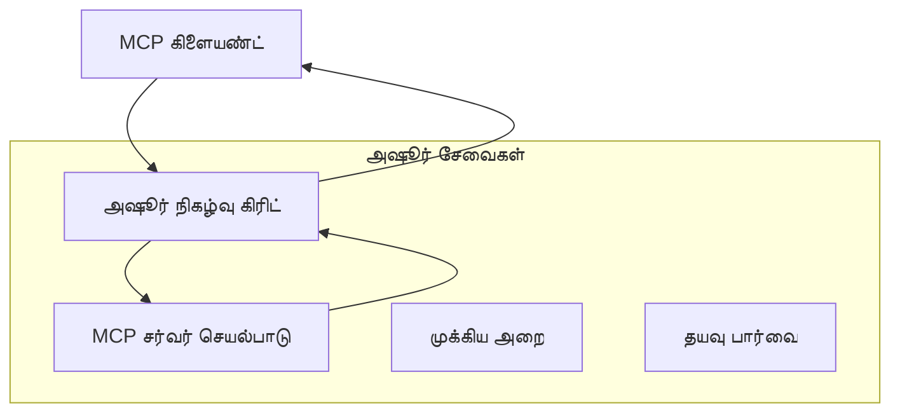
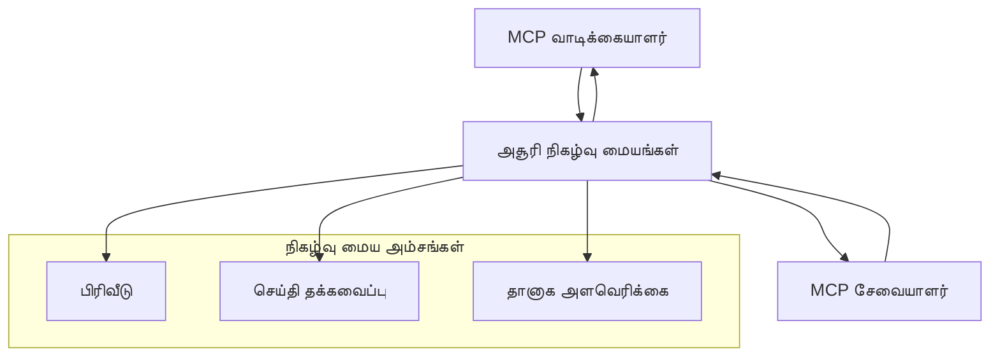

# MCP தனிப்பயன் பரிமாற்றங்கள் - மேம்பட்ட அமல்படுத்தல் வழிகாட்டி

மாதிரி சூழல் புரோட்டோக்கால் (MCP) பரிமாற்ற முறைகளில் தாண்டவம் அளிக்கிறது, சிறப்பான நிறுவன சூழல்களுக்கு தனிப்பயன் செயல்பாடுகளை அனுமதிக்கிறது. இந்த மேம்பட்ட வழிகாட்டி Azure Event Grid மற்றும் Azure Event Hubs ஆகியவற்றைப் பயன்படுத்தி பரிமாற்ற செயல்பாடுகளைக் ஆராய்கிறது, வணிகமயமாக்கத்துக்கான, மேக-உருமாற்ற MCP தீர்வுகளை உருவாக்க உதவுகிறது.

## அறிமுகம்

MCP இன் ஸ்டாண்டர்ட் பரிமாற்றங்கள் (stdio மற்றும் HTTP ஸ்ட்ரீமிங்) பெரும்பான்மையான பயன்பாடுகளை நன்கு செய்தாலும், வணிக சூழல்கள் மேம்பட்ட பரிமாற்ற முறைகளை கேட்கும், அதிகரித்த வியாபாரம், நம்பகத்தன்மை மற்றும் ஏற்கனவே உள்ள மேக அடிப்படை கட்டமைப்புடன் ஒருங்கிணைக்கும் விதமாக. தனிப்பயன் பரிமாற்றங்கள் MCP க்கு மேகமயமாக்கப்பட்ட செய்தியியல் சேவைகளைப் பயன்படுத்தி சமகால அல்லாத தொடர்பு, நிகழ்வு-மூலமாகும் அமைப்புகள் மற்றும் பகிர்ந்துள்ள செயலாக்கம் ஆகியவற்றை சக்ரவிநியோகமாக் செய்ய உதவுகின்றன.

இந்த பாடம் தொடர்பான MCP விவரக்கணிப்பின் (2025-11-25) அடிப்படையில், Azure செய்தியியல் சேவைகள் மற்றும் நிறுவனர் ஒருங்கிணைப்பு வடிவங்களை நோக்கி மேம்பட்ட பரிமாற்ற செயல்பாடுகளைத் தனித்து ஆய்வு செய்கிறது.

### **MCP பரிமாற்ற கட்டமைப்பு**

**MCP விவரக்கணிப்பிலிருந்து (2025-11-25):**

- **ஸ்டாண்டர்ட் பரிமாற்றங்கள்**: stdio (பரிந்துரைக்கப்பட்டவை), HTTP ஸ்ட்ரீமிங் (தூர வழிக்காட்சிக்கானது)
- **தனிப்பயன் பரிமாற்றங்கள்**: MCP செய்தி பரிமாற்றப் புரோட்டோக்கால் செயல்படுத்தும் அனைத்து பரிமாற்றங்களும்
- **செய்தி வடிவம்**: JSON-RPC 2.0 MCP-சந்தித்த நீட்டிப்புகளுடன்
- **இருவழி தொடர்பு**: தகவல் மற்றும் பதில்களுக்கான முழுமையான இருவழி தொடர்பு தேவையானது

## கற்றல் குறிக்கோள்கள்

இந்த மேம்பட்ட பாடத்தினை முடித்தவுடன், நீங்கள்:

- **தனிப்பயன் பரிமாற்ற தேவைகளைப் புரிந்துகொள்ளலாம்**: சமகாலதன்மையுடன் MCP புரோட்டோக்கால் எந்தவொரு பரிமாற்றத் தளத்திலும் செயல்படுத்த
- **Azure Event Grid பரிமாற்றத்தை உருவாக்கலாம்**: சேவையற்ற வணிகமயமாக்குவதற்கான நிகழ்வு-மூல MCP சேவையகங்களை உருவாக்கலாம்
- **Azure Event Hubs பரிமாற்றத்தை செயல்படுத்தலாம்**: நேரடி ஸ்ட்ரீமிங்கிற்காக உயர் னிலைய MCP தீர்வுகளை வடிவமைக்கலாம்  
- **நிறுவனர் வடிவங்களைப் பயன்படுத்தலாம்**: Azure அடிப்படை கட்டமைப்புடன் தனிப்பயன் பரிமாற்றங்களை ஒருங்கிணைக்கலாம்
- **பரிமாற்ற நம்பகத்தன்மையை கையாளலாம்**: நிறுவனர் சூழல்களுக்கு செய்தி பாதுகாப்பு, வரிசை மற்றும் பிழை கையாள்வை நடைமுறைப்படுத்தலாம்
- **செயல்திறனை மேம்படுத்தலாம்**: அளவு, மறைமுகம் மற்றும் மூலவட்டத்தைப் பொருந்தும் பரிமாற்ற தீர்வுகளை வடிவமைக்கலாம்

## **பரிமாற்ற தேவைகள்**

### **MCP விவரக்கணிப்பிலிருந்து முதன்மையான தேவைகள் (2025-11-25):**

```yaml
Message Protocol:
  format: "JSON-RPC 2.0 with MCP extensions"
  bidirectional: "Full duplex communication required"
  ordering: "Message ordering must be preserved per session"
  
Transport Layer:
  reliability: "Transport MUST handle connection failures gracefully"
  security: "Transport MUST support secure communication"
  identification: "Each session MUST have unique identifier"
  
Custom Transport:
  compliance: "MUST implement complete MCP message exchange"
  extensibility: "MAY add transport-specific features"
  interoperability: "MUST maintain protocol compatibility"
```

## **Azure Event Grid பரிமாற்ற செயல்படுத்தல்**

Azure Event Grid நிகழ்வு-மூல MCP கட்டமைப்புகளுக்கான சேவையற்ற நிகழ்வு வழிகாட்டல் சேவையை வழங்குகிறது. இந்த செயல்பாடு நீளமான, தளவிடுக்கப்பட்ட MCP முறைமைகளை உருவாக்கும் முறையை விளக்குகிறது.

### **கட்டமைப்பு பார்வை**



### **C# செயல்படுத்தல் - Event Grid பரிமாற்றம்**

```csharp
using Azure.Messaging.EventGrid;
using Microsoft.Extensions.Azure;
using System.Text.Json;

public class EventGridMcpTransport : IMcpTransport
{
    private readonly EventGridPublisherClient _publisher;
    private readonly string _topicEndpoint;
    private readonly string _clientId;
    
    public EventGridMcpTransport(string topicEndpoint, string accessKey, string clientId)
    {
        _publisher = new EventGridPublisherClient(
            new Uri(topicEndpoint), 
            new AzureKeyCredential(accessKey));
        _topicEndpoint = topicEndpoint;
        _clientId = clientId;
    }
    
    public async Task SendMessageAsync(McpMessage message)
    {
        var eventGridEvent = new EventGridEvent(
            subject: $"mcp/{_clientId}",
            eventType: "MCP.MessageReceived",
            dataVersion: "1.0",
            data: JsonSerializer.Serialize(message))
        {
            Id = Guid.NewGuid().ToString(),
            EventTime = DateTimeOffset.UtcNow
        };
        
        await _publisher.SendEventAsync(eventGridEvent);
    }
    
    public async Task<McpMessage> ReceiveMessageAsync(CancellationToken cancellationToken)
    {
        // Event Grid is push-based, so implement webhook receiver
        // This would typically be handled by Azure Functions trigger
        throw new NotImplementedException("Use EventGridTrigger in Azure Functions");
    }
}

// Azure Function for receiving Event Grid events
[FunctionName("McpEventGridReceiver")]
public async Task<IActionResult> HandleEventGridMessage(
    [EventGridTrigger] EventGridEvent eventGridEvent,
    ILogger log)
{
    try
    {
        var mcpMessage = JsonSerializer.Deserialize<McpMessage>(
            eventGridEvent.Data.ToString());
        
        // Process MCP message
        var response = await _mcpServer.ProcessMessageAsync(mcpMessage);
        
        // Send response back via Event Grid
        await _transport.SendMessageAsync(response);
        
        return new OkResult();
    }
    catch (Exception ex)
    {
        log.LogError(ex, "Error processing Event Grid MCP message");
        return new BadRequestResult();
    }
}
```

### **TypeScript செயல்படுத்தல் - Event Grid பரிமாற்றம்**

```typescript
import { EventGridPublisherClient, AzureKeyCredential } from "@azure/eventgrid";
import { McpTransport, McpMessage } from "./mcp-types";

export class EventGridMcpTransport implements McpTransport {
    private publisher: EventGridPublisherClient;
    private clientId: string;
    
    constructor(
        private topicEndpoint: string,
        private accessKey: string,
        clientId: string
    ) {
        this.publisher = new EventGridPublisherClient(
            topicEndpoint,
            new AzureKeyCredential(accessKey)
        );
        this.clientId = clientId;
    }
    
    async sendMessage(message: McpMessage): Promise<void> {
        const event = {
            id: crypto.randomUUID(),
            source: `mcp-client-${this.clientId}`,
            type: "MCP.MessageReceived",
            time: new Date(),
            data: message
        };
        
        await this.publisher.sendEvents([event]);
    }
    
    // ஏஜுர் செயல்பாடுகள் மூலம் நிகழ்வு இயக்கப்பட்ட பெறுகை
    onMessage(handler: (message: McpMessage) => Promise<void>): void {
        // அமல்படுத்தல் ஏஜுர் செயல்பாடுகள் நிகழ்வு கிரிட் டிரிகரை பயன்படுத்தும்
        // இது webhook பெறுநருக்கான கருத்து நேர்முகம்
    }
}

// ஏஜுர் செயல்பாடுகள் அமல்படுத்தல்
import { app, InvocationContext, EventGridEvent } from "@azure/functions";

app.eventGrid("mcpEventGridHandler", {
    handler: async (event: EventGridEvent, context: InvocationContext) => {
        try {
            const mcpMessage = event.data as McpMessage;
            
            // MCP செய்தியை செயலாக்குங்கள்
            const response = await mcpServer.processMessage(mcpMessage);
            
            // நிகழ்வு கிரிட் மூலம் பதிலை அனுப்புக
            await transport.sendMessage(response);
            
        } catch (error) {
            context.error("Error processing MCP message:", error);
            throw error;
        }
    }
});
```

### **Python செயல்படுத்தல் - Event Grid பரிமாற்றம்**

```python
from azure.eventgrid import EventGridPublisherClient, EventGridEvent
from azure.core.credentials import AzureKeyCredential
import asyncio
import json
from typing import Callable, Optional
import uuid
from datetime import datetime

class EventGridMcpTransport:
    def __init__(self, topic_endpoint: str, access_key: str, client_id: str):
        self.client = EventGridPublisherClient(
            topic_endpoint, 
            AzureKeyCredential(access_key)
        )
        self.client_id = client_id
        self.message_handler: Optional[Callable] = None
    
    async def send_message(self, message: dict) -> None:
        """Send MCP message via Event Grid"""
        event = EventGridEvent(
            data=message,
            subject=f"mcp/{self.client_id}",
            event_type="MCP.MessageReceived",
            data_version="1.0"
        )
        
        await self.client.send(event)
    
    def on_message(self, handler: Callable[[dict], None]) -> None:
        """Register message handler for incoming events"""
        self.message_handler = handler

# அஜூர் செயல்பாடுகளின் அமலாக்கம்
import azure.functions as func
import logging

def main(event: func.EventGridEvent) -> None:
    """Azure Functions Event Grid trigger for MCP messages"""
    try:
        # ஈவின்ட் கிரிட் நிகழ்வு இருந்து MCP செய்தியை பகுப்பாய்வு செய்
        mcp_message = json.loads(event.get_body().decode('utf-8'))
        
        # MCP செய்தியை செயலாக்கு
        response = process_mcp_message(mcp_message)
        
        # பதிலை மீண்டும் ஈவின்ட் கிரிட் மூலம் அனுப்பு
        # (அமலாக்கம் புதிய ஈவின்ட் கிரிட் கிளையண்டை உருவாக்கும்)
        
    except Exception as e:
        logging.error(f"Error processing MCP Event Grid message: {e}")
        raise
```

## **Azure Event Hubs பரிமாற்ற செயல்படுத்தல்**

Azure Event Hubs குறைந்த தாமதம்、高பட் இணையான செய்தி பரிமாற்ற உட்பட உயர் வேக நேரடி ஸ்ட்ரீமிங் திறன்களை வழங்குகிறது.

### **கட்டமைப்பு பார்வை**



### **C# செயல்படுத்தல் - Event Hubs பரிமாற்றம்**

```csharp
using Azure.Messaging.EventHubs;
using Azure.Messaging.EventHubs.Producer;
using Azure.Messaging.EventHubs.Consumer;
using System.Text;

public class EventHubsMcpTransport : IMcpTransport, IDisposable
{
    private readonly EventHubProducerClient _producer;
    private readonly EventHubConsumerClient _consumer;
    private readonly string _consumerGroup;
    private readonly CancellationTokenSource _cancellationTokenSource;
    
    public EventHubsMcpTransport(
        string connectionString, 
        string eventHubName,
        string consumerGroup = "$Default")
    {
        _producer = new EventHubProducerClient(connectionString, eventHubName);
        _consumer = new EventHubConsumerClient(
            consumerGroup, 
            connectionString, 
            eventHubName);
        _consumerGroup = consumerGroup;
        _cancellationTokenSource = new CancellationTokenSource();
    }
    
    public async Task SendMessageAsync(McpMessage message)
    {
        var messageBody = JsonSerializer.Serialize(message);
        var eventData = new EventData(Encoding.UTF8.GetBytes(messageBody));
        
        // Add MCP-specific properties
        eventData.Properties.Add("MessageType", message.Method ?? "response");
        eventData.Properties.Add("MessageId", message.Id);
        eventData.Properties.Add("Timestamp", DateTimeOffset.UtcNow);
        
        await _producer.SendAsync(new[] { eventData });
    }
    
    public async Task StartReceivingAsync(
        Func<McpMessage, Task> messageHandler)
    {
        await foreach (PartitionEvent partitionEvent in _consumer.ReadEventsAsync(
            _cancellationTokenSource.Token))
        {
            try
            {
                var messageBody = Encoding.UTF8.GetString(
                    partitionEvent.Data.EventBody.ToArray());
                var mcpMessage = JsonSerializer.Deserialize<McpMessage>(messageBody);
                
                await messageHandler(mcpMessage);
            }
            catch (Exception ex)
            {
                // Handle deserialization or processing errors
                Console.WriteLine($"Error processing message: {ex.Message}");
            }
        }
    }
    
    public void Dispose()
    {
        _cancellationTokenSource?.Cancel();
        _producer?.DisposeAsync().AsTask().Wait();
        _consumer?.DisposeAsync().AsTask().Wait();
        _cancellationTokenSource?.Dispose();
    }
}
```

### **TypeScript செயல்படுத்தல் - Event Hubs பரிமாற்றம்**

```typescript
import { 
    EventHubProducerClient, 
    EventHubConsumerClient, 
    EventData 
} from "@azure/event-hubs";

export class EventHubsMcpTransport implements McpTransport {
    private producer: EventHubProducerClient;
    private consumer: EventHubConsumerClient;
    private isReceiving = false;
    
    constructor(
        private connectionString: string,
        private eventHubName: string,
        private consumerGroup: string = "$Default"
    ) {
        this.producer = new EventHubProducerClient(
            connectionString, 
            eventHubName
        );
        this.consumer = new EventHubConsumerClient(
            consumerGroup,
            connectionString,
            eventHubName
        );
    }
    
    async sendMessage(message: McpMessage): Promise<void> {
        const eventData: EventData = {
            body: JSON.stringify(message),
            properties: {
                messageType: message.method || "response",
                messageId: message.id,
                timestamp: new Date().toISOString()
            }
        };
        
        await this.producer.sendBatch([eventData]);
    }
    
    async startReceiving(
        messageHandler: (message: McpMessage) => Promise<void>
    ): Promise<void> {
        if (this.isReceiving) return;
        
        this.isReceiving = true;
        
        const subscription = this.consumer.subscribe({
            processEvents: async (events, context) => {
                for (const event of events) {
                    try {
                        const messageBody = event.body as string;
                        const mcpMessage: McpMessage = JSON.parse(messageBody);
                        
                        await messageHandler(mcpMessage);
                        
                        // குறைந்தபட்சம் ஒருமுறை விநியோகத்திற்கான செக் பாயின்ட் புதுப்பிக்கவும்
                        await context.updateCheckpoint(event);
                    } catch (error) {
                        console.error("Error processing Event Hubs message:", error);
                    }
                }
            },
            processError: async (err, context) => {
                console.error("Event Hubs error:", err);
            }
        });
    }
    
    async close(): Promise<void> {
        this.isReceiving = false;
        await this.producer.close();
        await this.consumer.close();
    }
}
```

### **Python செயல்படுத்தல் - Event Hubs பரிமாற்றம்**

```python
from azure.eventhub import EventHubProducerClient, EventHubConsumerClient
from azure.eventhub import EventData
import json
import asyncio
from typing import Callable, Dict, Any
import logging

class EventHubsMcpTransport:
    def __init__(
        self, 
        connection_string: str, 
        eventhub_name: str,
        consumer_group: str = "$Default"
    ):
        self.producer = EventHubProducerClient.from_connection_string(
            connection_string, 
            eventhub_name=eventhub_name
        )
        self.consumer = EventHubConsumerClient.from_connection_string(
            connection_string,
            consumer_group=consumer_group,
            eventhub_name=eventhub_name
        )
        self.is_receiving = False
    
    async def send_message(self, message: Dict[str, Any]) -> None:
        """Send MCP message via Event Hubs"""
        event_data = EventData(json.dumps(message))
        
        # MCP-க்கு தொடர்புடைய பண்புகளை சேர்
        event_data.properties = {
            "messageType": message.get("method", "response"),
            "messageId": message.get("id"),
            "timestamp": "2025-01-14T10:30:00Z"  # உண்மையான நேரமுத்திரையை பயன்படுத்து
        }
        
        async with self.producer:
            event_data_batch = await self.producer.create_batch()
            event_data_batch.add(event_data)
            await self.producer.send_batch(event_data_batch)
    
    async def start_receiving(
        self, 
        message_handler: Callable[[Dict[str, Any]], None]
    ) -> None:
        """Start receiving MCP messages from Event Hubs"""
        if self.is_receiving:
            return
        
        self.is_receiving = True
        
        async with self.consumer:
            await self.consumer.receive(
                on_event=self._on_event_received(message_handler),
                starting_position="-1"  # துவக்கத்திலிருந்தே தொடங்கு
            )
    
    def _on_event_received(self, handler: Callable):
        """Internal event handler wrapper"""
        async def handle_event(partition_context, event):
            try:
                # Event Hubs நிகழ்விலிருந்து MCP செய்தியை பாகுபடுத்து
                message_body = event.body_as_str(encoding='UTF-8')
                mcp_message = json.loads(message_body)
                
                # MCP செய்தியை செயலாக்கு
                await handler(mcp_message)
                
                # குறைந்தது ஒருமுறை வழங்குவதற்காக சோதனை புள்ளியை புதுப்பி
                await partition_context.update_checkpoint(event)
                
            except Exception as e:
                logging.error(f"Error processing Event Hubs message: {e}")
        
        return handle_event
    
    async def close(self) -> None:
        """Clean up transport resources"""
        self.is_receiving = False
        await self.producer.close()
        await self.consumer.close()
```

## **மேம்பட்ட பரிமாற்ற வடிவமுறை**

### **செய்தி பாதுகாப்பு மற்றும் நம்பகத்தன்மை**

```csharp
// Implementing message durability with retry logic
public class ReliableTransportWrapper : IMcpTransport
{
    private readonly IMcpTransport _innerTransport;
    private readonly RetryPolicy _retryPolicy;
    
    public async Task SendMessageAsync(McpMessage message)
    {
        await _retryPolicy.ExecuteAsync(async () =>
        {
            try
            {
                await _innerTransport.SendMessageAsync(message);
            }
            catch (TransportException ex) when (ex.IsRetryable)
            {
                // Log and retry
                throw;
            }
        });
    }
}
```

### **பரிமாற்ற பாதுகாப்பு ஒருங்கிணைப்பு**

```csharp
// Integrating Azure Key Vault for transport security
public class SecureTransportFactory
{
    private readonly SecretClient _keyVaultClient;
    
    public async Task<IMcpTransport> CreateEventGridTransportAsync()
    {
        var accessKey = await _keyVaultClient.GetSecretAsync("EventGridAccessKey");
        var topicEndpoint = await _keyVaultClient.GetSecretAsync("EventGridTopic");
        
        return new EventGridMcpTransport(
            topicEndpoint.Value.Value,
            accessKey.Value.Value,
            Environment.MachineName
        );
    }
}
```

### **பரிமாற்ற கண்காணிப்பு மற்றும் காணொலி**

```csharp
// Adding telemetry to custom transports
public class ObservableTransport : IMcpTransport
{
    private readonly IMcpTransport _transport;
    private readonly ILogger _logger;
    private readonly TelemetryClient _telemetryClient;
    
    public async Task SendMessageAsync(McpMessage message)
    {
        using var activity = Activity.StartActivity("MCP.Transport.Send");
        activity?.SetTag("transport.type", "EventGrid");
        activity?.SetTag("message.method", message.Method);
        
        var stopwatch = Stopwatch.StartNew();
        
        try
        {
            await _transport.SendMessageAsync(message);
            
            _telemetryClient.TrackDependency(
                "EventGrid",
                "SendMessage",
                DateTime.UtcNow.Subtract(stopwatch.Elapsed),
                stopwatch.Elapsed,
                true
            );
        }
        catch (Exception ex)
        {
            _telemetryClient.TrackException(ex);
            throw;
        }
    }
}
```

## **நிறுவனர் ஒருங்கிணைப்பு சூழல்கள்**

### **சூழல் 1: பகிர்ந்து செயலாக்கும் MCP**

பல செயலாக்க முத்திரைப்புள்ளிகளுக்கு MCP கோரிக்கைகளை Azure Event Grid பயன்படுத்தி பகிர்ந்தல்:

```yaml
Architecture:
  - MCP Client sends requests to Event Grid topic
  - Multiple Azure Functions subscribe to process different tool types
  - Results aggregated and returned via separate response topic
  
Benefits:
  - Horizontal scaling based on message volume
  - Fault tolerance through redundant processors
  - Cost optimization with serverless compute
```

### **சூழல் 2: நிஜ நேர MCP ஸ்ட்ரீமிங்**

உயர்தரம் MCP தொடர்புகளுக்கு Azure Event Hubs பயன்படுத்தல்:

```yaml
Architecture:
  - MCP Client streams continuous requests via Event Hubs
  - Stream Analytics processes and routes messages
  - Multiple consumers handle different aspect of processing
  
Benefits:
  - Low latency for real-time scenarios
  - High throughput for batch processing
  - Built-in partitioning for parallel processing
```

### **சூழல் 3: கலந்தரிந்து பரிமாற்ற கட்டமைப்பு**

விவசாய பயன்பாடுகளுக்கு பல பரிமாற்றங்களை இணைத்தல்:

```csharp
public class HybridMcpTransport : IMcpTransport
{
    private readonly IMcpTransport _realtimeTransport; // Event Hubs
    private readonly IMcpTransport _batchTransport;    // Event Grid
    private readonly IMcpTransport _fallbackTransport; // HTTP Streaming
    
    public async Task SendMessageAsync(McpMessage message)
    {
        // Route based on message characteristics
        var transport = message.Method switch
        {
            "tools/call" when IsRealtime(message) => _realtimeTransport,
            "resources/read" when IsBatch(message) => _batchTransport,
            _ => _fallbackTransport
        };
        
        await transport.SendMessageAsync(message);
    }
}
```

## **செயல்திறன் மேம்பாடு**

### **Event Grid க்கான செய்தி தொகுப்பு**

```csharp
public class BatchingEventGridTransport : IMcpTransport
{
    private readonly List<McpMessage> _messageBuffer = new();
    private readonly Timer _flushTimer;
    private const int MaxBatchSize = 100;
    
    public async Task SendMessageAsync(McpMessage message)
    {
        lock (_messageBuffer)
        {
            _messageBuffer.Add(message);
            
            if (_messageBuffer.Count >= MaxBatchSize)
            {
                _ = Task.Run(FlushMessages);
            }
        }
    }
    
    private async Task FlushMessages()
    {
        List<McpMessage> toSend;
        lock (_messageBuffer)
        {
            toSend = new List<McpMessage>(_messageBuffer);
            _messageBuffer.Clear();
        }
        
        if (toSend.Any())
        {
            var events = toSend.Select(CreateEventGridEvent);
            await _publisher.SendEventsAsync(events);
        }
    }
}
```

### **Event Hubs க்கான பகுப்பாய்வு திட்டம்**

```csharp
public class PartitionedEventHubsTransport : IMcpTransport
{
    public async Task SendMessageAsync(McpMessage message)
    {
        // Partition by client ID for session affinity
        var partitionKey = ExtractClientId(message);
        
        var eventData = new EventData(JsonSerializer.SerializeToUtf8Bytes(message))
        {
            PartitionKey = partitionKey
        };
        
        await _producer.SendAsync(new[] { eventData });
    }
}
```

## **தனிப்பயன் பரிமாற்றங்களுக்கான சோதனை**

### **சோதனை நகல்களுடன் யுனிட் சோதனை**

```csharp
[Test]
public async Task EventGridTransport_SendMessage_PublishesCorrectEvent()
{
    // Arrange
    var mockPublisher = new Mock<EventGridPublisherClient>();
    var transport = new EventGridMcpTransport(mockPublisher.Object);
    var message = new McpMessage { Method = "tools/list", Id = "test-123" };
    
    // Act
    await transport.SendMessageAsync(message);
    
    // Assert
    mockPublisher.Verify(
        x => x.SendEventAsync(
            It.Is<EventGridEvent>(e => 
                e.EventType == "MCP.MessageReceived" &&
                e.Subject == "mcp/test-client"
            )
        ),
        Times.Once
    );
}
```

### **Azure Test Containers உடன் ஒருங்கிணைப்பு சோதனை**

```csharp
[Test]
public async Task EventHubsTransport_IntegrationTest()
{
    // Using Testcontainers for integration testing
    var eventHubsContainer = new EventHubsContainer()
        .WithEventHub("test-hub");
    
    await eventHubsContainer.StartAsync();
    
    var transport = new EventHubsMcpTransport(
        eventHubsContainer.GetConnectionString(),
        "test-hub"
    );
    
    // Test message round-trip
    var sentMessage = new McpMessage { Method = "test", Id = "123" };
    McpMessage receivedMessage = null;
    
    await transport.StartReceivingAsync(msg => {
        receivedMessage = msg;
        return Task.CompletedTask;
    });
    
    await transport.SendMessageAsync(sentMessage);
    await Task.Delay(1000); // Allow for message processing
    
    Assert.That(receivedMessage?.Id, Is.EqualTo("123"));
}
```

## **சிறந்த நடைமுறைகள் மற்றும் வழிகாட்டுதல்கள்**

### **பரிமாற்ற வடிவமைப்பு கோட்பாடுகள்**

1. **இடியம்போட்டென்சி**: போட்டிகளை கையாள மேலதிக சோதித்து செய்தி செயலாக்கமானது இயல்பு வாய்ந்ததாக இருக்க வேண்டும்
2. **பிழை கையாள்வு**: விரிவான பிழை கையாள்வும் இறந்த கடிதங்கள் வரிசையையும் செயல்படுத்தவும்
3. **கண்காணிப்பு**: விரிவான தொலைபார்க்கையுடன் மற்றும் உடல் சோதனைகளைக் சேர்க்கவும்
4. **பாதுகாப்பு**: நிர்வகிக்கப்பட்ட அடையாளங்களையும் குறைந்த உரிமை அணுகலையும் பயன்படுத்தவும்
5. **செயல்திறன்**: குறிப்பிட்ட மறைமுக மற்றும் மூலவட்ட தேவைகளுக்கான வடிவமைப்பு

### **Azure-வுக்கு சிறப்பு பரிந்துரைகள்**

1. **நிர்வகிக்கப்பட்ட அடையாளம் பயன்படுத்து**: தயாரிப்பில் இணைப்பு சரக்குகளை தவிர்க்கவும்
2. **சார்கிட் இடைவெளிகளைக் கையாளவும்**: Azure சேவை நிறுத்தப்படுதலை எதிர்க்க பாதுகாப்பு
3. **செலவுகளை கண்காணி**: செய்தி தொகுதி மற்றும் செயலாக்க செலவுகளை கண்காணி
4. **அளவைத் திட்டமிடு**: ஆரம்பத்தில் பகுப்பாய்வு மற்றும் அளவிடல் வடிவமுறை வடிவமைக்கு
5. **முழுமையாக சோதனை செய்க**: விரிவான சோதனைக்கு Azure DevTest Labs ஐப் பயன்படுத்துக

## **முடிவு**

தனிப்பயன் MCP பரிமாற்றங்கள் Azure செய்தியியல் சேவைகள் மூலம் வலுவான நிறுவன சூழல்களை இயல்பாக்குகின்றன. Event Grid அல்லது Event Hubs பரிமாற்றங்களை செயல்படுத்துவதன் மூலம், நீங்கள் நீளமான, நம்பகமான MCP தீர்வுகளை உருவாக்கி, ஏற்கனவே உள்ள Azure அடிப்படை கட்டமைப்புடன் சரியாக ஒருங்கிணைக்கலாம்.

நிகழ்ச்சிகள் MCP புரோட்டோக்கால் ஒத்துழைப்பையும் Azure சிறந்த நடைமுறைகளையும் பாதுகாத்து, தயாரிப்பிற்கு தயாரான வடிவமுறைகளை காட்டுகின்றன.

## **கூடுதல் வளங்கள்**

- [MCP விவரக்கணிப்பு 2025-11-25](https://modelcontextprotocol.io/specification/2025-11-25/)
- [Azure Event Grid ஆவணம்](https://docs.microsoft.com/azure/event-grid/)
- [Azure Event Hubs ஆவணம்](https://docs.microsoft.com/azure/event-hubs/)
- [Azure Functions Event Grid துண்டுரை](https://docs.microsoft.com/azure/azure-functions/functions-bindings-event-grid)
- [Azure SDK .NET க்கான](https://github.com/Azure/azure-sdk-for-net)
- [Azure SDK TypeScript க்கான](https://github.com/Azure/azure-sdk-for-js)
- [Azure SDK Python க்கான](https://github.com/Azure/azure-sdk-for-python)

---

> *இந்த வழிகாட்டி தயாரிப்பு MCP முறைமைகளுக்கான நடைமுறை செயல்பாட்டுக் கொள்கைகளைக் கவனிக்கிறது. உங்கள் குறிப்பிட்ட தேவைகள் மற்றும் Azure சேவையின் வரம்புகளை எதிர்கொண்டு பரிமாற்ற செயல்பாட்டைப் பரிசோதிக்கவும்.*
> **தற்போதைய ஸ்டாண்டர்ட்**: இந்த வழிகாட்டி [MCP விவரக்கணிப்பு 2025-11-25](https://modelcontextprotocol.io/specification/2025-11-25/) பரிமாற்ற தேவைகள் மற்றும் மேம்பட்ட நிறுவன பரிமாற்ற வடிவங்களை பிரதிபலிக்கிறது.

## அடுத்தது என்ன
- [6. சமூக பங்களிப்புகள்](../../06-CommunityContributions/README.md)

---

<!-- CO-OP TRANSLATOR DISCLAIMER START -->
**மறுப்பு**:
இந்த ஆவணம் AI மொழிபெயர்ப்பு சேவை [Co-op Translator](https://github.com/Azure/co-op-translator) பயன்படுத்தி மொழிபெயர்க்கப்பட்டுள்ளது. நாங்கள் துல்லியத்திற்காக முயற்சி செய்துள்ளோம், ஆனால் தானாக செய்யப்படும் மொழிபெயர்ப்புகளில் பிழைகள் அல்லது தவறுகள் இருக்கலாம் என்பதை கவனத்தில் கொள்ளவும். அசல் ஆவணம் அதன் தாய்மொழியில் அதிகாரப்பூர்வ ஆதாரமாக கருதப்பட வேண்டும். முக்கியமான தகவல்களுக்கு, தொழில்நுட்பமான மனித மொழிபெயர்ப்பு பரிந்துரைக்கப்படுகிறது. இந்த மொழிபெயர்ப்பைப் பயன்படுத்துவதால் ஏற்படும் எந்த தவறான புரிதல்கள் அல்லது தவறான விளக்கத்திற்கும் நாங்கள் பொறுப்பில்வில்லை.
<!-- CO-OP TRANSLATOR DISCLAIMER END -->