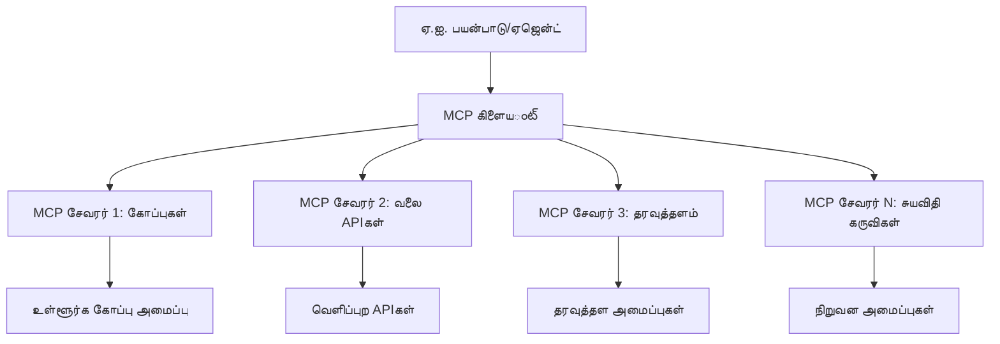

# 🌐 Module 2: Microsoft Foundry Toolkit அடிப்படையுடன் MCP

[]()
[]()
[]()

## 📋 கற்றல் குறிக்கோள்கள்

இந்த module இறுதியில், நீங்கள்:
- ✅ Model Context Protocol (MCP) கட்டமைப்பையும் அதன் பயன்களையும் புரிந்துகொள்ள முடியும்
- ✅ Microsoft's MCP சர்வர் சூழலை ஆராய முடியும்
- ✅ MCP சர்வர்களை Microsoft Foundry Toolkit Agent Builder உடன் ஒருங்கிணைக்க முடியும்
- ✅ Playwright MCP பயன்படுத்தி செயலூக்கமான browser automation ஏஜெண்டை உருவாக்க முடியும்
- ✅ உங்கள் ஏஜெண்டுகளில் MCP கருவிகளை உள்ளமைத்து சோதனை செய்ய முடியும்
- ✅ MCP இயக்கும் ஏஜெண்ட்களைச் செல்லுபடியாக்கி வெளியிட முடியும்

## 🎯 Module 1-லை அடுத்தடுத்து கட்டமைத்தல்

Module 1-ல், Microsoft Foundry Toolkit அடிப்படைகளை நாங்கள் அடைந்தோம் மற்றும் முதல் Python Agent-ஐ உருவாக்கினோம். இப்போது நாம் உங்கள் ஏஜெண்ட்களை வெளிப்புற கருவிகள் மற்றும் சேவைகளுடன் **Model Context Protocol (MCP)** என்ற புரட்சி முனைவுடன் இணைத்து **சூப்பர் சார்ஜ்** செய்வோம்.

இதனை அடிப்படைக் கணக்கீட்டாளரிலிருந்து முழு கணினிக்கான மேம்பாட்டாக கருதுங்கள் — உங்கள் AI ஏஜெண்ட்கள் பின்வருமாறு செயல்பட முடியும்:
- 🌐 வலைத்தளங்களை உலாவி, தொடர்பு கொள்ள
- 📁 கோப்புகளை அணுகி, மாற்று செய்ய
- 🔧 நிறுவன அமைப்புகளுடன் ஒருங்கிணைப்பு
- 📊 APIs மூலம் நேரடி தரவுகளை செயலாக்க

## 🧠 Model Context Protocol (MCP) புரிதல்

### 🔍 MCP என்பது என்ன?

Model Context Protocol (MCP) என்பது **"AI பயன்பாடுகளுக்கான USB-C"** — பெரும் மொழி மாதிரிகள் (LLMs) மற்றும் வெளிப்புற கருவிகள், தரவுத்தளம், சேவைகளுடன் இணைக்கும் ஒரு புரட்சி திறந்தத் தரநிலையாகும். USB-C ஒன்றான இணைப்பை வழங்கி கேபிள் குழப்பங்களை நீக்கியது போல MCP ஒரு ஒரே பெறுமதியான செயல்முறை மூலம் AI ஒருங்கிணைப்பை எளிதாக்குகிறது.

### 🎯 MCP தீர்க்கும் பிரச்சினை

**MCP முன்னர்:**
- 🔧 தனிப்பயன் ஒருங்கிணைப்புகள் ஒவ்வொரு கருவிக்கும்
- 🔄 உரிமையாளர் கட்டுப்பாட்டு அடைப்பு
- 🔒 போதாமை இணைப்புகளால் பாதுகாப்பு சிக்கல்கள்
- ⏱️ அடிப்படைக் ஒருங்கிணைப்புக்கு பல மாத வளர்ச்சி

**MCP உடன்:**
- ⚡ உடனடி கருவி ஒருங்கிணைப்பு
- 🔄 வாடிக்கையாளர் சாரா கட்டமைப்பு
- 🛡️ பாதுகாப்பு சிறந்த நடைமுறைகள் உட்படுத்தப்பட்டவை
- 🚀 புதிய திறன்களை நிமிடங்களுக்குள் சேர்த்தல்

### 🏗️ MCP கட்டமைப்பு ஆழமான புரிதல்

MCP ஒரு **க்ளையண்ட்-சர்வர் கட்டமைப்பைப்** பின்பற்றுகிறது, இது பாதுகாப்பான, அளவுகோலான சூழலை உருவாக்குகிறது:



**🔧 கோர்ப் கூறுகள்:**

| கூறு | பங்கு | உதாரணங்கள் |
|-----------|------|----------|
| **MCP ஓடுகள்** | MCP சேவைகளைப் பயன்படுத்தும் செயலிகள் | Claude Desktop, VS Code, Microsoft Foundry Toolkit |
| **MCP கிளையண்டுகள்** | செயல்முறை கையாளிகள் (1:1 சர்வர்களுடன்) | ஓடு செயலிகளில் உள்ளவை |
| **MCP சர்வர்கள்** | வழக்கமான செயல்முறை மூலம் திறனை வெளிப்படுத்துகிறார்கள் | Playwright, Files, Azure, GitHub |
| **கடத்தல் அடுக்கு** | தொடர்பு முறை | stdio, HTTP, WebSockets |


## 🏢 Microsoft's MCP சர்வர் சூழல்

Microsoft உண்மை வணிக தேவைகளுக்கு பதிலளிக்கும் தொழிற்சாலை தரமான சர்வர்களுடன் MCP சூழலை முன்னணியில் வழிநடத்துகிறது.

### 🌟 Microsoft's MCP முக்கிய சர்வர்கள்

#### 1. ☁️ Azure MCP சர்வர்
**🔗 சேமிப்பு:** [azure/azure-mcp](https://github.com/azure/azure-mcp)
**🎯 நோக்கம்:** AI ஒருங்கிணைப்புடன் முழுமையான Azure வள மேலாண்மை

**✨ முக்கிய அம்சங்கள்:**
- விளக்கமான உள்கட்டமைப்பு வழங்கல்
- நேரடி வள கண்காணிப்பு
- செலவுக் குறைப்பு பரிந்துரைகள்
- பாதுகாப்பு உட்பத்திகள் சோதனை

**🚀 பயன்பாட்டு நிலைகள்:**
- AI உதவியுடன் உள்கட்டமைப்பு-ஆக-கோடு
- தானியங்கி வள அளவு ஆக்மெய்த்தல்
- மேகச் செலவுக் குறைப்பு
- DevOps வேலைப்பாடுத்தமிழ்மொழி

#### 2. 📊 Microsoft Dataverse MCP
**📚 ஆவணம்:** [Microsoft Dataverse Integration](https://go.microsoft.com/fwlink/?linkid=2320176)
**🎯 நோக்கம்:** வியாபார தரவுகளுக்கான இயற்கை மொழி இடைமுகம்

**✨ முக்கிய அம்சங்கள்:**
- இயற்கை மொழி தரவுத்தள வினாக்கள்
- வியாபாரக் கருத்துக்களைப் புரிதல்
- தனிப்பயன் முன்மொழிவு வடிவங்கள்
- நிறுவன தரவு ஆளுகை

**🚀 பயன்பாட்டு நிலைகள்:**
- வியாபார அறிவு அறிக்கைகள்
- வாடிக்கையாளர் தரவு பகுப்பாய்வு
- விற்பனை குழாய் உளவியல்
- ஒழுங்கு தரவு வினாக்கள்

#### 3. 🌐 Playwright MCP சர்வர்
**🔗 சேமிப்பு:** [microsoft/playwright-mcp](https://github.com/microsoft/playwright-mcp)
**🎯 நோக்கம்:** உலாவி தானியங்கி மற்றும் வலை தொடர்பு திறன்கள்

**✨ முக்கிய அம்சங்கள்:**
- பல உலாவி தானியங்கி (Chrome, Firefox, Safari)
- நுண்ணறிவு கூறு கண்டறிதல்
- படமெடுக்கும் & PDF உருவாக்கம்
- வலைப்பின்னல் கண்காணிப்பு

**🚀 பயன்பாட்டு நிலைகள்:**
- தானியக்க சோதனை வேலைப்பாடுகள்
- இணைய அலைபிடிப்பு மற்றும் தரவு மயக்கம்
- UI/UX கண்காணிப்பு
- போட்டி பகுப்பாய்வு தானியக்கம்

#### 4. 📁 Files MCP சர்வர்
**🔗 சேமிப்பு:** [microsoft/files-mcp-server](https://github.com/microsoft/files-mcp-server)
**🎯 நோக்கம்:** நுண்ணறிவு கோப்பு அமைப்பு நடவடிக்கைகள்

**✨ முக்கிய அம்சங்கள்:**
- விளக்கமான கோப்பு மேலாண்மை
- உள்ளடக்க ஒத்திசைவு
- பதிப்பு கட்டுப்பாடு ஒருங்கிணைப்பு
- மெட்டாடேட்டா எடுப்பு

**🚀 பயன்பாட்டு நிலைகள்:**
- ஆவண மேலாண்மை
- குறியீட்டு களஞ்சிய அமைப்பு
- உள்ளடக்க வெளியீட்டு வேலைப்பாடுகள்
- தரவு குழாய் கோப்பு கையாளல்

#### 5. 📝 MarkItDown MCP சர்வர்
**🔗 சேமிப்பு:** [microsoft/markitdown](https://github.com/microsoft/markitdown)
**🎯 நோக்கம்:** மேம்பட்ட Markdown செயலாக்கம் மற்றும் மாற்றுதல்

**✨ முக்கிய அம்சங்கள்:**
- விரிவான Markdown பகுப்பு
- வடிவ மாற்றம் (MD ↔ HTML ↔ PDF)
- உள்ளடக்க அமைப்பு பகுப்பாய்வு
- மாதிரி செயலாக்கம்

**🚀 பயன்பாட்டு நிலைகள்:**
- தொழில்நுட்ப ஆவண வேலைப்பாடுகள்
- உள்ளடக்க மேலாண்மை அமைப்புகள்
- அறிக்கை உருவாக்கம்
- அறிவுத்தள தானியக்கம்

#### 6. 📈 Clarity MCP சர்வர்
**📦 தொகுப்பு:** [@microsoft/clarity-mcp-server](https://www.npmjs.com/package/@microsoft/clarity-mcp-server)
**🎯 நோக்கம்:** இணையவழி பகுப்பாய்வு மற்றும் பயனர் நடத்தை தெளிவுகள்

**✨ முக்கிய அம்சங்கள்:**
- ஹீட்மேப் தரவு பகுப்பாய்வு
- பயனர் அமர்வு பதிவு
- செயல்திறன் அளவுகோல்கள்
- மாற்று குழாய் பகுப்பாய்வு

**🚀 பயன்பாட்டு நிலைகள்:**
- வலைத்தளம் சிறப்பாக்கம்
- பயனர் அனுபவ ஆய்வு
- A/B சோதனை பகுப்பாய்வு
- வியாபார அறிவு டாஷ்போர்டுகள்

### 🌍 சமூதாய சூழல்

Microsoft சர்வர்களுக்கு மேல் MCP சூழல் கண்டு, சேர்க்கிறது:
- **🐙 GitHub MCP**: களஞ்சிய மேலாண்மை மற்றும் குறியீட்டு பகுப்பாய்வு
- **🗄️ தரவுத்தள MCPகள்**: PostgreSQL, MySQL, MongoDB ஒருங்கிணைப்புகள்
- **☁️ மேக வழங்குநர் MCPகள்**: AWS, GCP, Digital Ocean கருவிகள்
- **📧 தொடர்பு MCPகள்**: Slack, Teams, Email ஒருங்கிணைப்புகள்

## 🛠️ கையிட்ட ஆய்வகம்: Browser Automation ஏஜெண்ட் உருவாக்கல்

**🎯 திட்ட நோக்கம்:** Playwright MCP சர்வர் பயன்படுத்தி புத்திசாலி browser தானியக்க ஏஜெண்டை உருவாக்கு, இது வலைத்தளங்களை உலாவி, தகவலை எடுத்து, சிக்கலான வலை தொடர்புகளைச் செய்யும்.

### 🚀 கட்டம் 1: ஏஜெண்ட் அடித்தளம் அமைத்தல்

#### படி 1: உங்கள் ஏஜெண்டை ஆரம்பி
1. **Microsoft Foundry Toolkit Agent Builder திறக்கவும்**
2. **புதிய ஏஜெண்ட் அமைக்கவும்** பின்வரும் கட்டமைப்புடன்:
   - **பெயர்**: `BrowserAgent`
   - **மாதிரி**: GPT-4o தேர்ந்தெடு 


### 🔧 கட்டம் 2: MCP ஒருங்கிணைப்பு வேலைப்பாடு

#### படி 3: MCP சர்வர் ஒருங்கிணைப்பைச் சேர்
1. **Agent Builder இல் கருவிகள் பகுதியை திறக்கும்**
2. **"கருவி சேர்" கிளிக் செய்யவும்** ஒருங்கிணைப்பு பட்டியலை திறக்க
3. **கிடைக்கும் விருப்பங்களில் "MCP சர்வர்" தேர்வு செய்யவும்**


**🔍 கருவி வகைகள் புரிதல்:**
- **உள்ளமைவு கருவிகள்**: முன்னமைக்கப்பட்ட Microsoft Foundry Toolkit செயலிகள்
- **MCP சர்வர்கள்**: வெளிப்புற சேவை ஒருங்கிணைப்புகள்
- **தனிப்பயன் APIs**: உங்கள் சொந்த சேவை முடிவுகள்
- **பணிமுறை அழைப்பு**: நேரடி மாதிரி பணிமுறை அணுகல்

#### படி 4: MCP சர்வர் தேர்வு
1. **"MCP சர்வர்" விருப்பத்தை தேர்வு செய்யவும்**


2. **கிடைக்கும் ஒருங்கிணைப்புகளை ஆராய MCP அட்டவணையை உலாவவும்**


### 🎮 கட்டம் 3: Playwright MCP அமைத்தல்

#### படி 5: Playwright தேர்ந்தெடுத்து அமைக்கவும்
1. **Microsoft-அனுமதித்த MCP சர்வர்களை அணுக "Use Featured MCP Servers" கிளிக் செய்யவும்**
2. **அதிலிருந்து "Playwright" தேர்ந்தெடு**
3. **முதன்மை MCP ID-ஐ ஏற்று அல்லது உங்கள் சூழலுக்கு மாற்றவும்**


#### படி 6: Playwright திறன்களை இயக்கவும்
**🔑 முக்கியம்**: மிகமிக அதிக செயல்பாடு பெற அனைத்து Playwright செயல்முறைகளையும் தேவைப்படுத்தவும்


**🛠️ அத்தியாவசிய Playwright கருவிகள்:**
- **நெவிகேஷன்**: `goto`, `goBack`, `goForward`, `reload`
- **தொடர்பு**: `click`, `fill`, `press`, `hover`, `drag`
- **எடுத்தல்**: `textContent`, `innerHTML`, `getAttribute`
- **சரிபார்ப்பு**: `isVisible`, `isEnabled`, `waitForSelector`
- **பிடிக்கவும்**: `screenshot`, `pdf`, `video`
- **நெட்வொர்க்**: `setExtraHTTPHeaders`, `route`, `waitForResponse`

#### படி 7: ஒருங்கிணைப்பு வெற்றியை உறுதி செய்
**✅ வெற்றிக்குறிகள்:**
- அனைத்து கருவிகளும் Agent Builder இடைமுகத்தில் தோன்றும்
- ஒருங்கிணைப்பு பலகையில் பிழை செய்தி இல்லை
- Playwright சர்வர் நிலை "Connected" என்பதைக் காட்டுகிறது


**🔧 பொதுவான சிக்கல் தீர்வு:**
- **இணைப்பு தோல்வி**: இணைய இணைப்பு மற்றும் firewall அமைப்புகளைப் பாருங்கள்
- **கருவி குறைவு**: அமைப்பின் போது அனைத்து திறன்களும் தேர்வு செய்யப்பட்டுள்ளன என்பதை உறுதி செய்
- **அனுமதி பிழைகள்**: VS Code-க்கு தேவையான முறையான அனுமதிகள் உள்ளதா என சரிபார்

### 🎯 கட்டம் 4: மேம்பட்ட முன்மொழிவு பொறியியல்

#### படி 8: புத்திசாலி அமைப்பு முன்மொழிவுகளை வடிவமைக்கவும்
Playwright முழு திறனோடு கூடிய முன்மொழிவுகளை உருவாக்கு:

```markdown
# Web Automation Expert System Prompt

## Core Identity
You are an advanced web automation specialist with deep expertise in browser automation, web scraping, and user experience analysis. You have access to Playwright tools for comprehensive browser control.

## Capabilities & Approach
### Navigation Strategy
- Always start with screenshots to understand page layout
- Use semantic selectors (text content, labels) when possible
- Implement wait strategies for dynamic content
- Handle single-page applications (SPAs) effectively

### Error Handling
- Retry failed operations with exponential backoff
- Provide clear error descriptions and solutions
- Suggest alternative approaches when primary methods fail
- Always capture diagnostic screenshots on errors

### Data Extraction
- Extract structured data in JSON format when possible
- Provide confidence scores for extracted information
- Validate data completeness and accuracy
- Handle pagination and infinite scroll scenarios

### Reporting
- Include step-by-step execution logs
- Provide before/after screenshots for verification
- Suggest optimizations and alternative approaches
- Document any limitations or edge cases encountered

## Ethical Guidelines
- Respect robots.txt and rate limiting
- Avoid overloading target servers
- Only extract publicly available information
- Follow website terms of service
```

#### படி 9: தூண்டுகோல் பயனர் முன்மொழிவுகளை உருவாக்கு
விவிட திறன்களைப் பிரதிபலிக்கும் முன்மொழிவுகளை வடிவமைக்கவும்:

**🌐 வலை பகுப்பாய்வு உதாரணம்:**
```markdown
Navigate to github.com/kinfey and provide a comprehensive analysis including:
1. Repository structure and organization
2. Recent activity and contribution patterns  
3. Documentation quality assessment
4. Technology stack identification
5. Community engagement metrics
6. Notable projects and their purposes

Include screenshots at key steps and provide actionable insights.
```


### 🚀 கட்டம் 5: இயக்கு மற்றும் சோதனை

#### படி 10: முதல் தானியக்கத்தை இயக்கவும்
1. **"Run" கிளிக் செய்து தானியக்கத் தொடரை ஆரம்பி**
2. **நேரடி இயக்க கண்காணி**:
   - Chrome உலாவி தானாகத் துவங்கும்
   - ஏஜெண்ட் இலக்குக் காணொளிக்கு செல்லும்
   - படங்கள் ஒவ்வொரு முக்கிய படியையும் பிடிக்கும்
   - பகுப்பாய்வு முடிவுகள் நேரடியாக சந்து கொடுக்கப்படும்


#### படி 11: முடிவுகள் மற்றும் தெளிவுகளை பகுப்பாய்வு செய்
Agent Builder இடைமுகத்தில் முழுமையான பகுப்பாய்வை பாருங்கள்:


### 🌟 கட்டம் 6: மேம்பட்ட திறன்கள் மற்றும் வெளியீடு

#### படி 12: ஏஜெண்ட் ஏற்றுமதி செய்து உற்பத்தியில் வெளியிடு
Agent Builder பல வெளியீட்டு விருப்பங்களை ஆதரிக்கிறது:


## 🎓 Module 2 சுருக்கம் & அடுத்த படிகள்

### 🏆 சாதனை பெறப்பட்டது: MCP ஒருங்கிணைப்பு நிபுணர்

**✅ கற்றவைகள்:**
- [ ] MCP கட்டமைப்பை புரிந்து கொள்ளல் மற்றும் பயன்பாடுகள்
- [ ] Microsoft MCP சர்வர் சூழலை வழிசெய்தல்
- [ ] Playwright MCP-ஐ Microsoft Foundry Toolkit உடன் ஒருங்கிணைத்தல்
- [ ] சிக்கலான browser automation ஏஜெண்டுகளை உருவாக்கல்
- [ ] வலை தானியக்கத்திற்கு மேம்பட்ட முன்மொழிவு பொறியியல்

### 📚 கூடுதல் வளங்கள்

- **🔗 MCP விவரக்குறிப்பு**: [அதிகாரபூர்வ செயல்முறை ஆவணம்](https://modelcontextprotocol.io/)
- **🛠️ Playwright API**: [முழுமையான முறைகள் குறிப்பு](https://playwright.dev/docs/api/class-playwright)
- **🏢 Microsoft MCP சர்வர்கள்**: [தொழிற்சாலை ஒருங்கிணைவு கையேடு](https://github.com/microsoft/mcp-servers)
- **🌍 சமூதாய உதாரணங்கள்**: [MCP சர்வர் திரைபடம்](https://github.com/modelcontextprotocol/servers)

**🎉 வாழ்த்துக்கள்!** நீங்கள் வெற்றிகரமாக MCP ஒருங்கிணைப்பை அடைந்துள்ளீர்கள் மற்றும் இப்போது வெளிப்புற கருவி திறன்களுடன் உற்பத்திக்குத் தயாரான AI ஏஜெண்டுகளை உருவாக்கலாம்!

### 🔜 அடுத்த Module-க்கு தொடர்க

MCP திறன்களை அடுத்த நிலைக்கு கொண்டு செல்ல தயாரா? **[Module 3: Microsoft Foundry Toolkit உடன் மேம்பட்ட MCP மேம்பாடு](../lab3/README.md)** சென்று:
- உங்கள் சொந்த தனிப்பயன் MCP சர்வர்களை உருவாக்கவும்
- சமீபத்திய MCP Python SDKயை உள்ளமைக்கவும் பயன்படுத்தவும்
- MCP இன்ஸ்பெக்டரை பிழைத்திருத்தம் కోసం அமைக்கவும்
- மேம்பட்ட MCP சர்வர் மேம்பாட்டு வேலைப்பாடுகளை கற்றுக்கொள்ளவும்
- ஒரு வானிலை MCP சர்வரை துவக்கம் முதல் கட்டமைக்கவும்

---

<!-- CO-OP TRANSLATOR DISCLAIMER START -->
**மறுப்பு**:
இந்த ஆவணம் AI மொழிபெயர்ப்பு சேவை [Co-op Translator](https://github.com/Azure/co-op-translator) பயன்படுத்தி மொழிபெயர்க்கப்பட்டுள்ளது. நாங்கள் துல்லியத்திற்காக முயற்சி செய்துள்ளோம், ஆனால் தானாக செய்யப்படும் மொழிபெயர்ப்புகளில் பிழைகள் அல்லது தவறுகள் இருக்கலாம் என்பதை கவனத்தில் கொள்ளவும். அசல் ஆவணம் அதன் தாய்மொழியில் அதிகாரப்பூர்வ ஆதாரமாக கருதப்பட வேண்டும். முக்கியமான தகவல்களுக்கு, தொழில்நுட்பமான மனித மொழிபெயர்ப்பு பரிந்துரைக்கப்படுகிறது. இந்த மொழிபெயர்ப்பைப் பயன்படுத்துவதால் ஏற்படும் எந்த தவறான புரிதல்கள் அல்லது தவறான விளக்கத்திற்கும் நாங்கள் பொறுப்பில்வில்லை.
<!-- CO-OP TRANSLATOR DISCLAIMER END -->