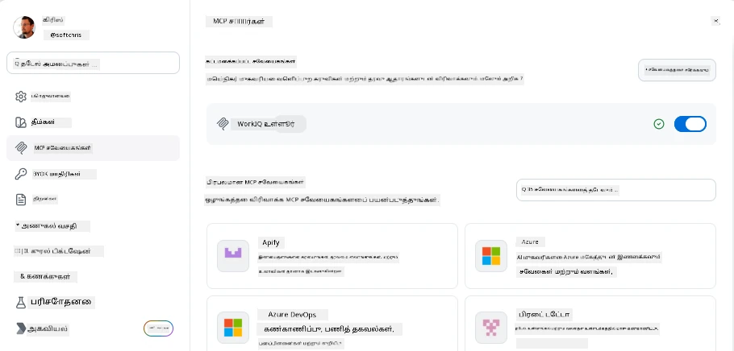
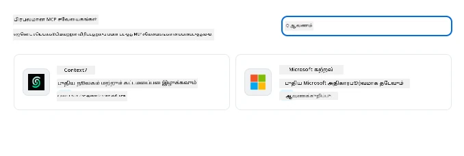
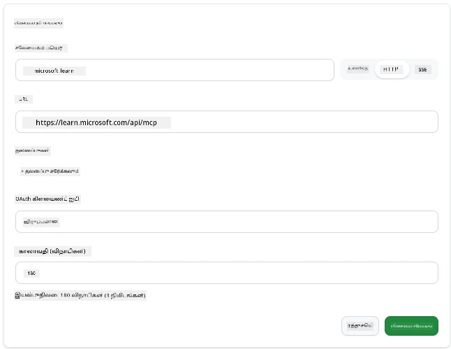
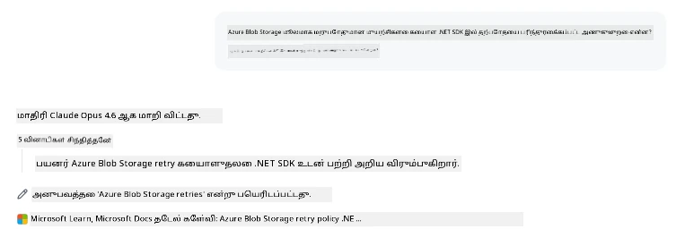
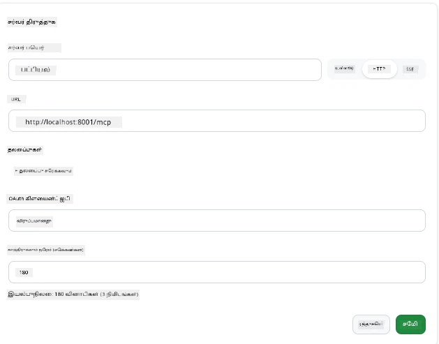
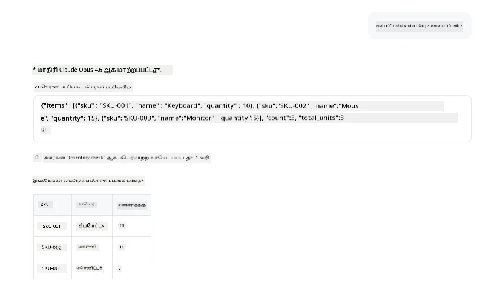
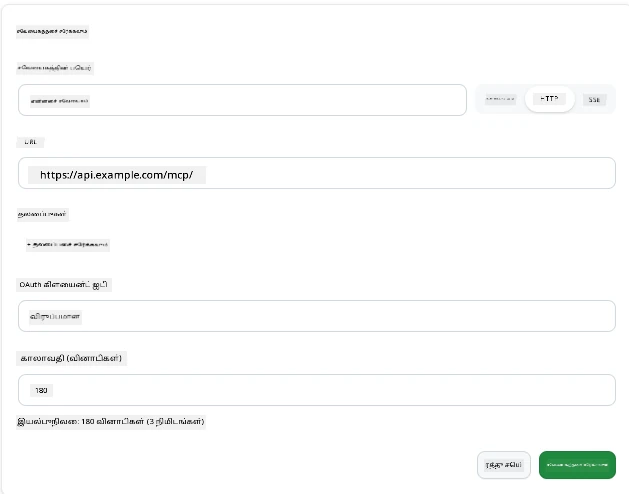
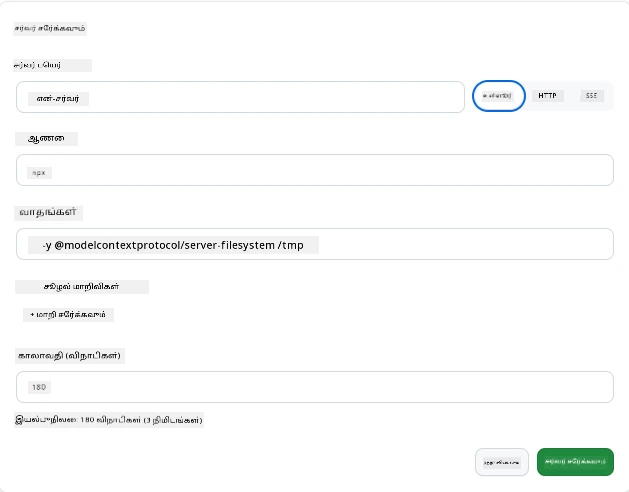

# GitHub Copilot ஆப் மூலம் MCP சேவையாளர்களைப் பயன்படுத்துதல்

இப்போது நீங்கள் MCP எப்படி வேலை செய்கிறது என்பதை அறிந்திருப்பீர்கள். நீங்கள் சேவையாளர்களை உருவாக்கி, கருவிகள் மற்றும் வளங்களை வரையறுத்து, கிளையண்ட்களை இணைத்துள்ளீர்கள். இப்போது நாம் செய்யாதது, பார்வையை மாற்றுவதே: நீங்கள் சேவையாளர் கட்டுபவர் ஆகாமல் ப்ரயோகிப்பவர் என்ற வகையில் உள்ள நிலையைப் பற்றி என்ன தெரியும்?—MCP-ஐ ஆதரிக்கும் ஒரு AI-சக்தியுள்ள பயன்பாட்டின் ப்ரயோகிப்பவராக இருப்பது எப்படி?

[GitHub Copilot App](https://github.com/github/app) என்பது MCP சேவையாளர்களைப் பயன்படுத்தக்கூடிய ஒரு டெஸ்க்டாப் ஆப் ஆகும். MCP சேவையாளர்களை அதில் இணைத்தால், புதிய நிலையை நீங்கள் திறக்கலாம்: Copilot இப்போது உங்கள் ஆவணங்களை அணுக, உள் API-களை அழைக்க, உங்கள் தரவுத்தளத்தைக் கேட்க, அல்லது எந்த சேவையையும் நீங்கள் சேவையால் இடைப்பட்டவைப் போல பேச்சுவிடலாம். ஆப் இருந்தே ஹோஸ்ட் ஆகிறது; உங்கள் MCP சேவையாளர் கருவிகள் ஆகிறார்.

இந்த பாடம் அந்த அனுபவத்தை தொடக்கம் முதல் முடிவு வரை உங்கள் வழிகாட்டி—MCP அமைப்புகள் பலகையை காண்பது முதல் உண்மை ஆவண சேவையாளர் ஒன்றை இணைத்து, பிறகு உங்கள் சொந்த தனிப்பயன் சேவையாளரை இணைக்கும் வரை.

## கற்றல் நோக்கங்கள்

இந்த பாடத்தின் முடிவில், நீங்கள் கீழ்கண்டவற்றை செய்ய இயலும்:

- Copilot ஆப்பின் அமைப்புகளில் MCP சேவையாளர்கள் பலகையை கண்டறிந்து அதன் வழிசெலுத்தலுக்குத் தெரிந்து கொள்.
- பராமரி செய்யப்பட்ட ஆவண சேவையாளர் ஒன்றை இணைத்து ஒரு அமர்வில் அதை பயன்படுத்துக.
- தனிப்பயன் சேவையாளர் ஒன்றை பதிவு செய்து, Copilot அதன் கருவிகளை அழைக்கச் சோதனை செய்.
- சேவையாளர் அழைக்கப்பட்டு வருவதற்கு சூழல் மாறிலிகள் அல்லது தனிப்பயன் தலைப்புகளை (HTTP என்றால்) வழங்குதல் எப்படி என்பதை அமைக்க.

## MCP ஹோஸ்டாக Copilot ஆப்பின் மெயின் கருத்து

இதோ அடிப்படைக் கருத்து: **Copilot இன் முகவர்கள் புத்திசாலிகள், ஆனால் அவர்கள் தெரிந்து கொள்ளும் விஷயம் நீங்கள் சொல்வதுதான்.** இயல்பாக, முகவர் உங்கள் வேலைத்தளத்தில் உள்ள கோப்புகளைப் படிக்கவும், டெர்மினல் கட்டளைகளை இயக்கவும் умеட், ஆனால் அது உங்கள் தரவுத்தளத்தைக் கேட்கவோ, காலண்டரை ஓடக்கூறவோ, தனிப்பயன் API-ஐ அழைக்கவோ இயலாது உதவி இல்லாமல். அங்கே MCP சேவையாளர் வருகிறார்கள். அவர்கள் Copilot-ஓடும் உங்கள் அமைப்புகளோடும்—தரவுத்தளங்கள், பதிப்புப் பொருள்திட்டம், API-கள், வடிவமைப்பு கருவிகள்—இவற்றிற்குள் பாலமாக செயல்பட்டு, முகவர்களுக்கு வேலை முடிக்க தேவையான தகவல் மற்றும் செயல்களை வழங்குகிறார்கள்.

நாம் முதலில் உங்கள் ஆப்பின் MCP சேவையாளர்களை மேலாண்மையாக்கும் அமைப்புகளைக் காணலாம்.

## படி 1: MCP அமைப்புகள் பலகையை கண்டுபிடித்தல்

Copilot ஆப்பைத் திறந்து, கீழே இடது பக்கத்தில் ஒரு பிட்சினைக் கச்சப்பை கண்டுபிடித்து அதைக் கிளிக் செய்யவும்.


"MCP Servers" என்பதைத் தேர்ந்தெடுக்கவும், மேலே உங்கள் முன்கூட்டியே அமைக்கப்பட்ட சேவையாளர்கள், கீழே பிரபல சேவையாளர்களின் சந்தை, மற்றும் மேலே "Add Server" பட்டன் பின்வருமாறு காட்சியாக்கப்பட வேண்டும்:



இது உங்கள் கட்டுப்பாட்டு மையம். இதிலிருந்து நீங்கள் சேவையாளர்களைச் சேர்க்கவும், அழிக்கவும், இயக்கு மற்றும் முடக்கவும் முடியும். மாற்றங்கள் புதிய அமர்விற்கு பொருந்தும்; ஏற்கனவே ஒரு அமர்வு திறந்திருக்கும் பொழுது, இதன் பட்டியை மாற்றிய பின் புதிய அமர்வினைத் தொடங்க வேண்டும்.

## படி 2: ஆவண சேவையாளர் ஒன்றை இணைத்தல்

நேரடியாகச் சிறந்த உதவியை செய்கிறோம். Microsoft Docs MCP சேவையாளர் Copilot ஐ அதிகாரப்பூர்வ Microsoft ஆவணங்களுக்கு அணுக அனுமதிக்கிறது. இதில் Azure, .NET, TypeScript மற்றும் பல உள்ளன. முகவர் தனது பயிற்சி தரவு (கட்டுப்பட்ட தேதி) மட்டுமே சாராதீர்கள், அது கேள்வி நேரத்தில் தற்போதைய ஆவணங்களை இழுக்க முடியும்.

இதைச் சேர்ப்பது எப்படி என்பது:

1. பிரபல சேவையாளர் பட்டியலில், **learn** என்று টাইப்பிட்டு "Microsoft Learn" சேவையாளரைத் தேர்ந்தெடுக்கவும்.

   

   கிளிக் செய்தவுடன், பெயர், கடத்தல் வகை மற்றும் URL முன்குறிக்கப்பட்டு ஒரு படிவம் வெளிப்படும்; அங்கே "Add Server" ஒத்தைச் சொடுக்க வேண்டும்.

2. "Add Server" அழுத்தினால், சில வினாடிகள் நேரம் ஆகி சேவையாளர் இணையும்.

   

   சேர்க்கப்பட்டவுடன், மேலே அமைக்கப்பட்ட சேவையாளராக காட்சியளிக்கும். அடுத்ததாக அதை முயற்சி செய்வோம்.

3. உரையாடல் பெட்டியை மூடி "Quick chat" ஐத் தேர்ந்தெடுக்கவும்.

4. கீழ்காணும் கூறியினையை பயன்படுத்தி Microsoft Learn சேவையாளர் கருவியைத் தூண்டுக.

   ```text
   What's the current recommended approach for handling Azure Blob Storage 
   retries using the .NET SDK?
   ```

   

நீங்கள் தற்போது சேர்த்த MCP சேவையாளர் எவ்வாறு குறிப்பிடப்படுகிறதோ அது தெரியும்.

## படி 3: தனிப்பயன் stdio சேவையாளர் இணைத்தல்

முன்பணம் எளிதாக இருக்கிறது, ஆனால் உண்மையான சக்தி உங்கள் சொந்த சேவையாளர்களை இணைப்பதில் உள்ளது. எனவே, நீங்கள் ஒரு சேவையாளர் கட்டியிருந்தீர்கள் (அல்லது வழங்கப்பட்டவரை) உள் API அல்லது நிறுவன அறிவுத் தோட்டத்தைக் கடந்து வழங்கும். இங்கே, நாம் கட்டிய MCP சேவையாளர் ஒன்று பயன்படுத்துகிறோம், அது நமது நிறுவன இருப்பு மேலாண்மையை கையாள்கிறது.

1. பிட்சினைக் கிளிக் செய்து மீண்டும் "MCP servers" ஐத் தேர்ந்தெடுக்கவும்.

2. "Add Server" பட்டனை அழுத்தி "+ Add Custom server" ஐத் தேர்ந்தெடுத்து கீழ்காணும் மதிப்புகளை வழங்குக:

   - பெயர்: `Inventory Server`
   - வலது பக்கத்தில் கடத்தல் முறையை தேர்ந்தெடு, **http**

   "Add Server" ஐ அழுத்தி, உங்கள் சேவையாளர் பட்டியலில் தோன்றும்.

   

4. சோதனை செய்ய, கீழ்காணும் கூறியினையை இயக்குக:

    ```
    list inventory
    ```

   

   இப்போது உங்கள் தனிப்பயன் கட்டிய சேவையாளர் இருந்து கிடைத்த இருக்கும் இருப்புச் பொருட்களின் பட்டியலை நீங்கள் காணலாம்.

சிறப்பாக, இப்போது நீங்கள் வெளியே உள்ள மற்றும் உங்கள் சொந்த MCP சேவையாளர்களை Copilot ஆப்பில் சேர்க்கும் நல்ல புரிதலைப் பெற்றுவிட்டீர்கள். அடுத்து, ரகசியங்கள் மற்றும் சூழல் மாறிலிகளை கையாள்வது பற்றி பேசுவோம்.

## படி 4: மேம்பட்ட அமைப்புகள்

இப்பொழுது வரை, நீங்கள் MCP சேவையாளர்களை பெயர் மற்றும் URL மட்டும் வழங்கி சேர்த்துள்ளீர்கள். ஆனால் உங்கள் சேவையாளர் API விசை அல்லது வேறு மதிப்பு தேவைப்பட்டால்? கடத்தல் முறையைப் பொறுத்து தேவையை பூர்த்தி செய்ய நமக்கு வழி உள்ளது.

- **http அல்லது SSE கடத்தல்**: தேவையான தலைப்புகளை அமைக்கலாம்.

   அங்குள்ள அங்கீகாரத்திற்காக, உதாரணமாக Authorization தலைப்பை குறிப்பிடலாம். மதிப்பு நிலையான எழுத்துரு (string) ஆக இருக்கலாம். OAuth பயன்படுத்தினால், அதன் OAuth கிளையன்ட் ஐடியை வழங்கலாம்.

   

- **stdio கடத்தல்**: சூழல் மாறிலிகள் அமைக்கப்படலாம்.

   சேவையுடன் தொடங்கும்பொழுது சேவையாளர் நுழைவதற்கு தேவையான எந்தவொரு சூழல் மாறிலிகளையும் இங்கே குறிப்பிடலாம்.

   

## சுருக்கம்

Copilot ஆப் MCP சேவையாளர்களை முகவர்கள் திறன்களின் முதன்மை நீட்சிகளாக கருதுகிறது. இந்த பாடத்தில் MCP சேவையாளர்களைச் சேர்ப்பதும், அது ஒரு அமர்வில் எப்படி பயன்படுத்தப்படுவது முழுமையாகப் பார்த்தீர்கள். இப்போது நீங்கள் பொது சேவையாளர்களுடன், உள் API-களுடன், தனிப்பயன் கருவிகளுடன் இணைக்க முடியும்; இது முகவர்களுக்கு தேவைப்படும் தகவல் மற்றும் செயல்களை தானாகவே நிறைவேற்றும் திறனை அளிக்கிறது.

## 📚 கூடுதல் வளங்கள்

### அதிகாரப்பூர்வ ஆவணங்கள்

- [GitHub Copilot App](https://github.com/github/app)
- [MCP Specification](https://modelcontextprotocol.io/specification/2025-03-26) - மாதிரி சூழல் நெறிமுறை وضّح

### சமூகங்கள்
- [MCP Community Discord](https://discord.com/invite/ByRwuEEgH4) - நேரடி விவாதங்கள்
- [GitHub Discussions](https://github.com/microsoft/MCP-Server-and-PostgreSQL-Sample-Retail/discussions) - கேள்வி & பதில்கள் மற்றும் பகிர்வு
- [Stack Overflow](https://stackoverflow.com/questions/tagged/model-context-protocol) - தொழில்நுட்ப கேள்விகள்

---

<!-- CO-OP TRANSLATOR DISCLAIMER START -->
**மறுப்பு**:
இந்த ஆவணம் AI மொழிபெயர்ப்பு சேவை [Co-op Translator](https://github.com/Azure/co-op-translator) பயன்படுத்தி மொழிபெயர்க்கப்பட்டுள்ளது. நாங்கள் துல்லியத்திற்காக முயற்சி செய்துள்ளோம், ஆனால் தானாக செய்யப்படும் மொழிபெயர்ப்புகளில் பிழைகள் அல்லது தவறுகள் இருக்கலாம் என்பதை கவனத்தில் கொள்ளவும். அசல் ஆவணம் அதன் தாய்மொழியில் அதிகாரப்பூர்வ ஆதாரமாக கருதப்பட வேண்டும். முக்கியமான தகவல்களுக்கு, தொழில்நுட்பமான மனித மொழிபெயர்ப்பு பரிந்துரைக்கப்படுகிறது. இந்த மொழிபெயர்ப்பைப் பயன்படுத்துவதால் ஏற்படும் எந்த தவறான புரிதல்கள் அல்லது தவறான விளக்கத்திற்கும் நாங்கள் பொறுப்பில்வில்லை.
<!-- CO-OP TRANSLATOR DISCLAIMER END -->