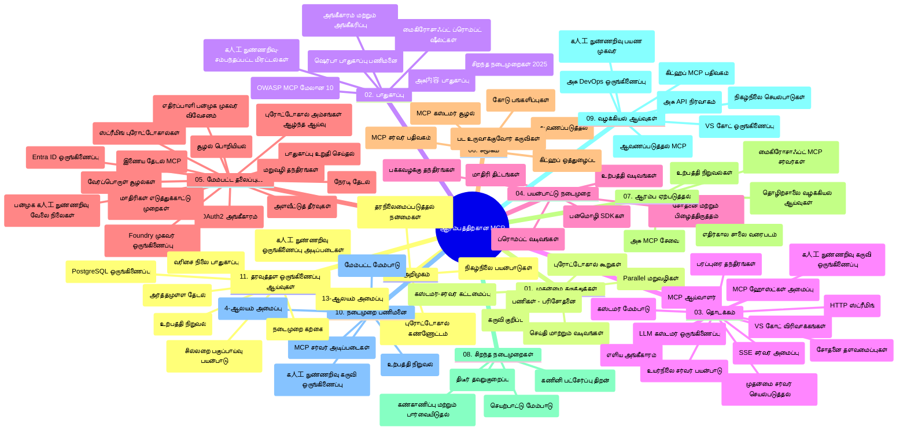

# ஆரம்பநிலை மாடல் சூழல் நெறிமுறை (MCP) - ஆய்வு கோவை

"அரம்பநிலை மாடல் சூழல் நெறிமுறை (MCP)" பாடத்திட்டத்திற்கான இந்த ஆய்வு கோவை, களஞ்சிய அமைப்பு மற்றும் உள்ளடக்கத்தின் ஒரு மேலோட்டத்தை வழங்குகிறது. களஞ்சியத்தை திறமையாக வழிசெய்யவும் மற்றும் கிடைக்கும் வளங்களை முழுமையாக பயன்படுத்தவும் இந்த கோவையைப் பயன் படுத்துங்கள்.

## களஞ்சியத்தின் மேற்பார்வை

மாடல் சூழல் நெறிமுறை (MCP) என்பது AI மாடல்களுக்கும் கிளையன்ட் பயன்பாடுகளுக்கும் இடையேயான தொடர்புகளுக்கான ஒரு நிலையான பேரமைப்பு. முதலில் Anthropic நிறுவனத்தால் உருவாக்கப்பட்ட MCP இப்போது அதிகாரப்பூர்வ GitHub அமைப்பின் மூலம் MCP சமுதாயத்தால் பராமரிக்கப்படுகிறது. இந்தக் களஞ்சியத்தில் C#, Java, JavaScript, Python மற்றும் TypeScript ஆகிய மொழிகளில் செயல்படுத்தப்பட்ட கைபிடிக்கப்பட்ட குறியீடு எடுத்துக்காட்டுகளுடன் விரிவான பாடத்திட்டம் வழங்கப்படுகின்றது. இது AI உருவாக்குநர்கள், கணினி வடிவமைப்பாளர்கள் மற்றும் மென்பொருள் பொறியாளர்களுக்காக வடிவமைக்கப்பட்டு உள்ளது.

## காட்சிப்படுத்தப்பட்ட பாடத்திட்ட வரைபடம்

## களஞ்சிய கட்டமைப்பு

இந்தக் களஞ்சியத்தை MCP இன் வெவ்வேறு அம்சங்களை கவனிக்கும் பதினொன்று மையப் பிரிவுகளாக ஒழுங்குபடுத்தப்பட்டுள்ளது:

1. **அறிமுகம் (00-Introduction/)**
   - மாடல் சூழல் நெறிமுறையின் மேலோட்டம்
   - AI பணித்துறைகளில் நிலைத்தன்மை முக்கியத்துவம்
   - நடைமுறை பயன்பாடுகள் மற்றும் நன்மைகள்

2. **முக்கிய கருத்துகள் (01-CoreConcepts/)**
   - கிளையன்ட்-சர்வர் வடிவமைப்பு
   - முக்கிய நெறிமுறை கூறுகள்
   - MCP இல் செய்தி பரிமாற்ற சுறுகைகள்

3. **பாதுகாப்பு (02-Security/)**
   - MCP அடிப்படையிலான அமைப்புகளின் பாதுகாப்பு அச்சுறுத்தல்கள்
   - செயல்படுத்துதலில் பாதுகாப்பு சிறந்த நடைமுறைகள்
   - அங்கீகாரமும் அங்கீகரிக்கும் முனைகளும்
   - **முழுமையான பாதுகாப்பு ஆவணங்கள்**:
     - MCP பாதுகாப்பு சிறந்த நடைமுறைகள் 2025
     - Azure உள்ளடக்கம் பாதுகாப்பு செயல்படுத்தல் வழிகாட்டி
     - MCP பாதுகாப்பு கட்டுப்பாடுகள் மற்றும் நுட்பங்கள்
     - MCP சிறந்த நடைமுறை விரைவு குறிப்பு
   - **முக்கிய பாதுகாப்பு தலைப்புகள்**:
     - பாம்பு ஊடல் மற்றும் கருவி நசிவு தாக்குதல்கள்
     - தொடர் கவர்ச்சி மற்றும் குழப்பமான துணை பிரச்சனைகள்
     - டோக்கன் கடத்தல்கள்
     - அதிக அனுமதிகள் மற்றும் அணுகல் கட்டுப்பாடுகள்
     - AI கூறுகளுக்கான வழங்கல் சங்கிலி பாதுகாப்பு
     - Microsoft Prompt Shields ஒருங்கிணைப்பு

4. **ஆரம்பம் (03-GettingStarted/)**
   - சுற்றுச்சூழல் அமைப்பு மற்றும் கட்டமைப்பு
   - அடிப்படை MCP சர்வர்கள் மற்றும் கிளையண்ட்கள் உருவாக்குதல்
   - உள்ளமைந்த பயன்பாடுகளுடன் ஒருங்கிணைப்பு
   - கீழ்காணும் பிரிவுகளை உள்ளடக்கியது:
     - முதல் சர்வர் செயல்படுத்தல்
     - கிளையன்ட் மேம்பாடு
     - LLM கிளையன்ட் ஒருங்கிணைப்பு
     - VS Code ஒருங்கிணைப்பு
     - Server-Sent Events (SSE) சர்வர்
     - மேம்பட்ட சர்வர் பயன்பாடு
     - HTTP ஒட்டுமொத்தம்
     - AI கருவி பைதான் ஒருங்கிணைப்பு
     - சோதனை முறைகள்
     - வெளியீடு வழிகாட்டிகள்

5. **நடைமுறை செயல்படுத்தல் (04-PracticalImplementation/)**
   - பல்வேறு நிரலாக்க மொழிகளில் SDK களைப் பயன்படுத்தல்
   - பிழைத்திருத்தல், சோதனை மற்றும் சரிபார்ப்பு நுட்பங்கள்
   - மறுபயன்பாடு செய்யக்கூடிய முன்னோட்டு வடிவங்கள் மற்றும் பணிச்சூழல்கள் உருவாக்குதல்
   - செயல்படுத்தல் எடுத்துக்காட்டு திட்டங்கள்

6. **மேம்பட்ட தலைப்புகள் (05-AdvancedTopics/)**
   - சூழல் பொறியியல் நுட்பங்கள்
   - Foundry এജن்ட் ஒருங்கிணைப்பு
   - பன்முறை AI பணிச்சூழல்கள்
   - OAuth2 அங்கீகாரம் டெமோக்கள்
   - நேரடி தேடல் திறன்கள்
   - நேரடி ஒட்டுமொத்தம்
   - மூல சூழல்கள் செயல்படுத்தல்
   - வழிசெலுத்தல் நுட்பங்கள்
   - மாதிரிகை நுட்பங்கள்
   - பரிமாண விரிவாக்க பாணிகள்
   - பாதுகாப்பு கருத்துகைகள்
   - Entra ID பாதுகாப்பு ஒருங்கிணைப்பு
   - வலை தேடல் ஒருங்கிணைப்பு
   - எதிர்ப்பு பன்முகம் காரண ஒழுங்கமைப்பு (உலகம் விவாத பாணிகள்)

7. **சமூக பங்களிப்புகள் (06-CommunityContributions/)**
   - குறியீடு மற்றும் ஆவணங்களைச் சேர்க்கும் வழிமுறைகள்
   - GitHub மூலம் ஒத்துழைப்பு
   - சமுதாய வழியனுப்பல்கள் மற்றும் கருத்துக் குறிப்புகள்
   - பல MCP கிளையன்ட்களைப் பயன்படுத்துதல் (Claude Desktop, Cline, VSCode)
   - புகழ்பெற்ற MCP சர்வர்களுடன் பணியாற்றுதல் - பட உருவாக்கல் உட்பட

8. **ஆரம்ப அங்கீகாரத்தின் பாடங்கள் (07-LessonsfromEarlyAdoption/)**
   - உண்மையான செயல்படுத்தல்கள் மற்றும் வெற்றிக் கதைகள்
   - MCP அடிப்படையிலான தீர்வுகளை கட்டுவதும் வெளியிடுவதும்
   - போக்குகள் மற்றும் எதிர்கால திட்டப்படிகள்
   - **Microsoft MCP சர்வர் வழிகாட்டி**: 10 தயாரிப்பு-உரோற்பு Microsoft MCP சர்வர்களுக்கான முழுமையான வழிகாட்டி:
     - Microsoft Learn Docs MCP சர்வர்
     - Azure MCP சர்வர் (15+ சிறப்பு இணைப்புகள்)
     - GitHub MCP சர்வர்
     - Azure DevOps MCP சர்வர்
     - MarkItDown MCP சர்வர்
     - SQL Server MCP சர்வர்
     - Playwright MCP சர்வர்
     - Dev Box MCP சர்வர்
     - Microsoft Foundry MCP சர்வர்
     - Microsoft 365 Agents Toolkit MCP சர்வர்

9. **சிறந்த நடைமுறைகள் (08-BestPractices/)**
   - செயல்திறன் மேம்படுத்தல் மற்றும் பராமரிப்பு
   - தவறு சகிப்பான MCP அமைப்புகளை வடிவமைத்தல்
   - சோதனை மற்றும் தாங்குமுறை முறைகள்

10. **கேஸ் ஆய்வுகள் (09-CaseStudy/)**
    - **ஏழு விரிவான கேஸ் ஆய்வுகள்** MCP பல்துறை பயன்பாடுகளை வெளிப்படுத்துகின்றன:
    - **Azure AI பயண முகவர்கள்**: Azure OpenAI மற்றும் AI Search உடன் பன்முக முகவர் ஒழுங்கமைப்பு
    - **Azure DevOps ஒருங்கிணைப்பு**: YouTube தரவுத் தளாதிக்கங்களுடன் பணிச்சூழல்களை தானியக்கப்படுத்தல்
    - **நேரடி ஆவண மீட்பு**: Python கட்டளை வரிசை கிளையன்ட் மற்றும் HTTP ஒட்டுமொத்தம்
    - **பேச்சு அடிப்படை ஆய்வு திட்டம் உருவாக்கி**: Chainlit வலை பயன்பாடு மற்றும் உரையாடல் AI
    - **எடிட்டரில் உள்ள ஆவணங்கள்**: VS Code மற்றும் GitHub Copilot பணிச்சூழல்கள் ஒருங்கிணைப்பு
    - **Azure API மேலாண்மை**: வணிக API ஒருங்கிணைப்பு மற்றும் MCP சர்வர் உருவாக்கல்
    - **GitHub MCP ரெஜிஸ்ட்ரி**: சூழல் மேம்பாடு மற்றும் முகவர் ஒருங்கிணைப்பு மேடை
    - நிறுவன ஒருங்கிணைப்பு, உருவாக்குனர் உற்பத்தித்திறன் மற்றும் சூழல் மேம்பாட்டு எடுத்துக்காட்டுகள்

11. **கைபிடிச்சி பட்டறை (10-StreamliningAIWorkflowsBuildingAnMCPServerWithAIToolkit/)**
    - MCP மற்றும் AI கருவியுடன் ஒருங்கிணைக்கப்பட்ட விரிவான கைபிடிக் பட்டறை
    - AI மாடல்களை நிஜ உலக கருவிகளுடன் இணைக்கும் அறிவாற்றல் பயன்பாடுகளை உருவாக்குதல்
    - அடிப்படைகள், தனிப்பயன் சர்வர் மேம்பாடு மற்றும் உற்பத்தி அமர்த்தல் முறைகள் ஆகியவற்றை உள்ளடக்கிய நடைமுறை தொகுதிகள்
    - **பட்டறை அமைப்பு**:
      - பட்டறை 1: MCP சர்வர் அடிப்படைகள்
      - பட்டறை 2: மேம்பட்ட MCP சர்வர் மேம்பாடு
      - பட்டறை 3: AI கருவி ஒருங்கிணைப்பு
      - பட்டறை 4: உற்பத்தி வெளியீடு மற்றும் பரிமாணம்
    - கட்டத்திட்ட அடிப்படையிலான கற்றல் அணுகுமுறை மற்றும் படிப்படையாக வழிசெய்தல்

12. **MCP சர்வர் தரவுத்தள ஒருங்கிணைவு பட்டறைகள் (11-MCPServerHandsOnLabs/)**
    - PostgreSQL ஒருங்கிணைப்புடன் தயாரிப்பு-உரோற்பு MCP சர்வர்களை கட்டுவதற்கான **13-பட்டறை கற்றல் பாதை**
    - Zava Retail பயன்பாட்டுடன் உண்மையான சில்லறை பகுப்பாய்வு செயல்படுத்தல்
    - நிறுவன அளவிலான வடிவங்கள் - வரிசை நிலை பாதுகாப்பு (RLS), பொருத்தமான தேடல் மற்றும் பன்முக வாடிக்கையாளர் தரவுப் பயன்பாடு
    - **முழுமையான பட்டறை அமைப்பு**:
      - **பட்டறைகள் 00-03: அடித்தளங்கள்** - அறிமுகம், கட்டமைப்பு, பாதுகாப்பு, சுற்றுச்சூழல் அமைப்பு
      - **பட்டறைகள் 04-06: MCP சர்வர் கட்டமைத்தல்** - தரவுத்தளம் வடிவமைப்பு, MCP சர்வர் செயல்படுத்தல், கருவி மேம்பாடு
      - **பட்டறைகள் 07-09: மேம்பட்ட அம்சங்கள்** - பொருத்தமான தேடல், சோதனை மற்றும் பிழைத்திருத்தல், VS Code ஒருங்கிணைப்பு
      - **பட்டறைகள் 10-12: உற்பத்தி மற்றும் சிறந்த நடைமுறைகள்** - வெளியீடு, கண்காணிப்பு, செயல்முறை மேம்பாடு
    - **கையாளப்படும் தொழில்நுட்பங்கள்**: FastMCP கட்டமைப்பு, PostgreSQL, Azure OpenAI, Azure Container Apps, Application Insights
    - **கற்றல் முடிவுகள்**: தயாரிப்பு-உரோற்பு MCP சர்வர்கள், தரவுத்தள ஒருங்கிணைவு வடிவுகள், AI-ஆல் இயக்கப்படும் பகுப்பாய்வு, நிறுவன பாதுகாப்பு

## கூடுதல் வளங்கள்

களஞ்சியத்தில் ஆதரவு வளங்கள் உள்ளன:

- **படங்கள் கோப்புறை**: பாடத்திட்டத்தில் பயன்படுத்தப்படும் வரைபடங்கள் மற்றும் விளக்கப்படங்கள்
- **மொழிபெயர்ப்புகள்**: ஆவணங்களின் தானாக மொழிபெயர்ப்பு உட்பட பல மொழி ஆதரவு
- **அதிகாரப்பூர்வ MCP வளங்கள்**:
  - [MCP ஆவணங்கள்](https://modelcontextprotocol.io/)
  - [MCP குறிப்புரை](https://spec.modelcontextprotocol.io/)
  - [MCP GitHub களஞ்சியம்](https://github.com/modelcontextprotocol)

## இந்தக் களஞ்சியத்தை எவ்வாறு பயன்படுத்துவது

1. **வரிசைப்படி கற்றல்**: வரிசையாக அத்தியாயங்களை (00 முதல் 11 வரை) பின்பற்றவும் அமைக்கப்பட்ட கற்றல் அனுபவத்துக்கு.
2. **மொழி-நிலை கவனம்**: விருப்ப மொழியில் செயல்முறை எடுத்துக்காட்டுகளை ஆராயவும்.
3. **நடைமுறை செயல்படுத்தல்**: "ஆரம்பம்" பகுதியில் இருந்து உங்கள் சுற்றுச்சூழலை அமைக்கவும் மற்றும் முதல் MCP சர்வர் மற்றும் கிளையன்டை உருவாக்கவும்.
4. **மேம்பட்ட ஆராய்ச்சி**: அடிப்படைகளை அறிந்தபின் மேம்பட்ட தலைப்புகளை ஆராய்ந்து அறிவை விரிவாக்கவும்.
5. **சமூக பங்களிப்பு**: GitHub விவாதங்கள் மற்றும் Discord சேனல்களினூடாக MCP சமுதாயத்தில் பங்கேற்று வல்லுநர்களுடன் மற்றும் உருவாக்குநர்களுடன் இணைக்கவும்.

## MCP கிளையன்ட்கள் மற்றும் கருவிகள்

பாடத்திட்டத்தில் பல MCP கிளையன்ட்கள் மற்றும் கருவிகள் பற்றிய விவரங்கள் உள்ளன:

1. **அதிகாரப்பூர்வ கிளையன்ட்கள்**:
   - Visual Studio Code
   - MCP Visual Studio Code இல்
   - Claude Desktop
   - Claude VSCode இல்
   - Claude API

2. **சமூக கிளையன்ட்கள்**:
   - Cline (தெருமன்பட்டி அடிப்படையிலான)
   - Cursor (குறியீடு தொகுப்பான்)
   - ChatMCP
   - Windsurf

3. **MCP மேலாண்மை கருவிகள்**:
   - MCP CLI
   - MCP மேனேஜர்
   - MCP லிங்கர்
   - MCP ரூட்டர்

## பிரபல MCP சர்வர்கள்

களஞ்சியத்தில் பல MCP சர்வர்கள் அறிமுகப்படுத்தப்பட்டுள்ளன, பின்வருமாறு:

1. **அதிகாரப்பூர்வ Microsoft MCP சர்வர்கள்**:
   - Microsoft Learn Docs MCP சர்வர்
   - Azure MCP சர்வர் (15+ சிறப்பு இணைப்புகள்)
   - GitHub MCP சர்வர்
   - Azure DevOps MCP சர்வர்
   - MarkItDown MCP சர்வர்
   - SQL Server MCP சர்வர்
   - Playwright MCP சர்வர்
   - Dev Box MCP சர்வர்
   - Microsoft Foundry MCP சர்வர்
   - Microsoft 365 Agents Toolkit MCP சர்வர்

2. **அதிகாரப்பூர்வ குறிப்புரை சர்வர்கள்**:
   - கோப்பு அமைப்பு
   - பெறுதல்
   - நினைவகம்
   - தொடர் சிந்தனை

3. **பட உருவாக்கம்**:
   - Azure OpenAI DALL-E 3
   - Stable Diffusion WebUI
   - Replicate

4. **மென்பொருள் மேம்பாட்டு கருவிகள்**:
   - Git MCP
   - கட்டளை கட்டுப்பாடு
   - குறியீடு உதவியாளர்

5. **சிறப்பு சர்வர்கள்**:
   - Salesforce
   - Microsoft Teams
   - Jira & Confluence

## பங்களிப்பு

இந்தக் களஞ்சியம் சமூகத்திடமிருந்து பங்களிப்புகளை வரவேற்கிறது. MCP சூழலுக்கு திறமையாக பங்களிக்க சமூக பங்களிப்புகள் பாகத்தை பார்க்கவும்.

----

*இந்த ஆய்வு கோவையை 5 பெப்ரவரி, 2026 அன்று MCP குறிப்புரையின் 2025-11-25 பதிப்பிற்கேற்றவிதமாக கடைசியாக புதுப்பிக்கப்பட்டது மற்றும் அந்த தேதிக்குப் பின்னர் களஞ்சிய உள்ளடக்கம் புதுப்பிக்கப்படலாம்.*

---

<!-- CO-OP TRANSLATOR DISCLAIMER START -->
**மறுப்பு**:
இந்த ஆவணம் AI மொழிபெயர்ப்பு சேவை [Co-op Translator](https://github.com/Azure/co-op-translator) பயன்படுத்தி மொழிபெயர்க்கப்பட்டுள்ளது. நாங்கள் துல்லியத்திற்காக முயற்சி செய்துள்ளோம், ஆனால் தானாக செய்யப்படும் மொழிபெயர்ப்புகளில் பிழைகள் அல்லது தவறுகள் இருக்கலாம் என்பதை கவனத்தில் கொள்ளவும். அசல் ஆவணம் அதன் தாய்மொழியில் அதிகாரப்பூர்வ ஆதாரமாக கருதப்பட வேண்டும். முக்கியமான தகவல்களுக்கு, தொழில்நுட்பமான மனித மொழிபெயர்ப்பு பரிந்துரைக்கப்படுகிறது. இந்த மொழிபெயர்ப்பைப் பயன்படுத்துவதால் ஏற்படும் எந்த தவறான புரிதல்கள் அல்லது தவறான விளக்கத்திற்கும் நாங்கள் பொறுப்பில்வில்லை.
<!-- CO-OP TRANSLATOR DISCLAIMER END -->