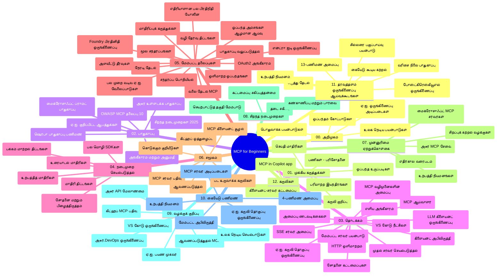

# ஆரம்பக்கருத்து செயல்முறை (MCP) - படிப்பு கையேடு

"ஆரம்பக்கருத்து செயல்முறை (MCP) - ஆரம்பத்திற்கான" பாடத்திட்டத்துக்கான செயல்முறை அமைப்பு மற்றும் உள்ளடக்கத்தின் மீதான முழுமையான கண்ணோட்டத்தை இந்த படிப்பு கையேடு வழங்குகிறது. கிடைக்கும் வளங்களை சிறப்பாக பயன்படுத்த இந்த கையேட்டை பயன்படுத்தி சொத்துக்களை துல்லியமாக நகர்த்தலாம்.

## இருப்பிடம் கண்ணோடு

ஆரம்பக்கருத்து செயல்முறை (MCP) என்பது AI மாடல்களுக்கும் கிளையண்ட் பயன்பாடுகளுக்கும் இடையேயான தொடர்புக்கு ஒரு நிலையான வடிவமைப்பு ஆகும். முதலில் Anthropic உருவாக்கிய MCP தற்போது அதிகாரப்பூர்வ GitHub அமைப்பின் மூலம் MCP சமூகத்தால் பராமரிக்கப்படுகிறது. இந்த இருப்பிடம் C#, Java, JavaScript, Python மற்றும் TypeScript போன்ற மொழிகளில் கொடுக்கப்பட்ட செயல்பாட்டு எடுத்துக்காட்டுகளுடன் விரிவான பாடத்திட்டத்தை வழங்குகிறது, முக்கியமாக AI டெவலப்பர்கள், அமைப்பு வடிவமைப்பாளர்கள் மற்றும் மென்பொருள் பொறியாளர்களுக்காக.

## காட்சி படிப்பு வரைபடம்

## இருப்பிடம் அமைப்பு

இருப்பிடம் பன்னிரண்டு முக்கிய பிரிவுகளாக ஒழுங்குபடுத்தப்பட்டு உள்ளது, ஒவ்வொன்றும் MCP இன் வேறு நோக்குகளைக் கவனிக்கிறது:

1. **அறிமுகம் (00-Introduction/)**
   - ஆரம்பக்கருத்து செயல்முறை குறித்த கண்ணோட்டம்
   - AI பைப்பிளைன்களில் நிலைப்பாடு முக்கியத்துவம்
   - நடைமுறை பயன்கள் மற்றும் நன்மைகள்

2. **அடிப்படை கருத்துகள் (01-CoreConcepts/)**
   - கிளையண்ட்-சர்வர் கட்டமைப்பு
   - முக்கிய செயல்முறை அங்கங்கள்
   - MCP இல் செய்தி பரிமாற்றக் குறிப்புகள்

3. **பாதுகாப்பு (02-Security/)**
   - MCP அடிப்படையிலான அமைப்புகளில் பாதுகாப்பு அச்சுறுத்தல்கள்
   - செயல்படுத்தல்களில் பாதுகாப்பு நடைமுறைகள்
   - அங்கீகாரம் மற்றும் அதிகாரவியல் முறைகள்
   - **விரிவான பாதுகாப்பு ஆவணங்கள்**:
     - MCP பாதுகாப்பு சிறந்த நடைமுறைகள் 2025
     - Azure உள்ளடக்க பாதுகாப்பு நடைமுறை கையேடு
     - MCP பாதுகாப்பு கட்டுப்பாடுகள் மற்றும் நுட்பங்கள்
     - MCP சிறந்த நடைமுறைகள் விரைவு சுட்டுமுறை
   - **முக்கிய பாதுகாப்பு தலைப்புகள்**:
     - ப்ரொம்ப்ட் ஊட்டுதல் மற்றும் கருவி நச்சுத்தல் தாக்குதல்
     - அமர்வு கையாளுதல் மற்றும் குழப்பப்பட்ட பிரதிநிதி பிரச்சனைகள்
     - டோக்கன் கடத்தல் பாதிப்பு
     - அதிகமான அனுமதிகள் மற்றும் அணுகல் கட்டுப்பாடு
     - AI கூறுகளுக்கான விநியோக சங்கிலி பாதுகாப்பு
     - Microsoft ப்ரொம்ப்ட் ஷீல்ட்ஸ் ஒருங்கிணைப்பு

4. **தொடக்க வழிகாட்டி (03-GettingStarted/)**
   - சுற்றுப்பயணம் அமைத்தல் மற்றும் கட்டமைப்பு
   - அடிப்படைக் MCP சர்வர்கள் மற்றும் கிளையண்டுகள் உருவாக்கல்
   - உள்ளமைப்பு பயன்பாடுகளுடன் ஒருங்கிணைப்பு
   - சேர்க்கப்பட்ட பிரிவுகள்:
     - முதலாவது சர்வர் செயலாக்கம்
     - கிளையண்ட் மேம்பாடு
     - LLM கிளையண்ட் ஒருங்கிணைப்பு
     - VS Code ஒருங்கிணைப்பு
     - சர்வர்-அனுப்பப்படும் நிகழ்வுகள் (SSE) சர்வர்
     - மேம்பட்ட சர்வர் பயன்பாடு
     - HTTP ஸ்ட்ரீமிங்
     - AI கருவி தொகுப்பு ஒருங்கிணைப்பு
     - சோதனை நடவடிக்கைகள்
     - பிரசாரம் வழிகாட்டி

5. **நடைமுறை செயலாக்கம் (04-PracticalImplementation/)**
   - பல மொழி SDK பயன்படுத்தல்
   - பிழைத் தணிக்கை, சோதனை மற்றும் சரிபார்ப்பு முறைகள்
   - மீண்டும் பயன்படுத்தக்கூடிய ப்ரொம்ப்ட் சாவடிகள் மற்றும் வேலை ஓட்டங்களை உருவாக்கல்
   - செயலாக்க எடுத்துக்காட்டுகளுடன் மாதிரி திட்டங்கள்

6. **மேம்பட்ட தலைப்புகள் (05-AdvancedTopics/)**
   - கருத்து பொறியியல் நுட்பங்கள்
   - Foundry முகவரியுடன் ஒருங்கிணைப்பு
   - பன்முகமான AI வேலை ஓட்டங்கள் 
   - OAuth2 அங்கீகாரம் முன்னாடி காட்சிகள்
   - நேரடி தேடல் திறன்கள்
   - நேரடி ஸ்ட்ரீமிங்
   - ரூட் கருத்துக்கள் செயலாக்கம்
   - வழிமுறை திட்டங்கள்
   - மாதிரிப்புக்கும் எடுத்துக்காட்டும் முறைகள்
   - பரிணாம அணுகுமுறை
   - பாதுகாப்பு கருத்துக்கள்
   - Entra ID பாதுகாப்பு ஒருங்கிணைப்பு
   - வலை தேடல் ஒருங்கிணைப்பு
   - எதிர்மறை பன்முகக் கூட்டு காரணித்தன்மை (வாத முறை)

7. **சமூக பங்களிப்புகள் (06-CommunityContributions/)**
   - குறியீடு மற்றும் ஆவண வகுத்தல் பங்களிப்பது எப்படி
   - GitHub மூலம் இணையாக செயல்படுதல்
   - சமூக சவுகாரம் முன்மொழிவுகள் மற்றும் கருத்து வெளியீடு
   - பல MCP கிளையண்டுகளைப் பயன்படுத்துதல் (Claude Desktop, Cline, VSCode)
   - புகழ்பெற்ற MCP சர்வர்களுடன் வேலை செய்தல், பட உற்பத்தி உள்ளிட்ட

8. **முன்பதிவிலிருந்து பாடங்கள் (07-LessonsfromEarlyAdoption/)**
   - நிஜ உலக செயல்படுத்தல்கள் மற்றும் வெற்றி கதைகள்
   - MCP அடிப்படையிலான தீர்வுகளை உருவாக்கல் மற்றும் பிரசாரம்
   - போக்குகள் மற்றும் எதிர்கால திட்டங்கள்
   - **Microsoft MCP சர்வர் கையேடு**: 10 தயாரிப்பு தயார் Microsoft MCP சர்வர்களுக்கான விரிவான கையேடு:
     - Microsoft Learn Docs MCP சர்வர்
     - Azure MCP சர்வர் (15+ சிறப்பு இணைப்புக்கள்)
     - GitHub MCP சர்வர்
     - Azure DevOps MCP சர்வர்
     - MarkItDown MCP சர்வர்
     - SQL Server MCP சர்வர்
     - Playwright MCP சர்வர்
     - Dev Box MCP சர்வர்
     - Microsoft Foundry MCP சர்வர்
     - Microsoft 365 Agents Toolkit MCP சர்வர்

9. **சிறந்த நடைமுறைகள் (08-BestPractices/)**
   - செயல்திறன் மேம்படுத்தல் மற்றும் ஒழுங்குபடுத்தல்
   - தவறில்லாத MCP அமைப்புகளை வடிவமைத்தல்
   - சோதனை மற்றும் திறம்பட செயல்பாடு

10. **வாதாராய்வுகள் (09-CaseStudy/)**
    - **ஒன்பது விரிவான வாதாராய்வுகள்** பல்வேறு சூழல்களில் MCP திறனைப் பெற்றுக்காட்டும்:
    - **Azure AI பயண முகவர்கள்**: Azure OpenAI மற்றும் AI தேடலுடன் பன்முக முகவர்கள் ஒருங்கிணைப்பு
    - **Azure DevOps ஒருங்கிணைப்பு**: YouTube தரவு புதுப்பிப்புகளுடன் வேலை ஓட்டங்களை தானாகச் செய்யல்
    - **நேரடி ஆவணப்பிரதி பெறல்**: Python கான்சோல் கிளையண்டுடன் HTTP ஸ்ட்ரீமிங்
    - **அறிவியல் படிப்பு திட்ட ஜெனரேட்டர்**: Chainlit வலை பயன்பாடு உரையாடல் AI உடன்
    - **எடிட்டர் உள்ள ஆவணங்கள்**: VS Code மற்றும் GitHub Copilot வேலை ஓட்டங்கள்
    - **Azure API மேலாண்மை**: MCP சர்வர் உருவாக்கத்துடன் நிறுவன API ஒருங்கிணைப்பு
    - **GitHub MCP பதிவு மையம்**: பயன்முறை மேம்பாடு மற்றும் முகவரியுடன் இணைப்பு தளம்
    - நிறுவன ஒருங்கிணைப்பு, டெவலப்பர் உற்பத்தி மற்றும் பயன்முறை விருத்திகளுக்கான செயலாக்க எடுத்துக்காட்டுகள்

11. **கைமுறை பணியகம் (10-StreamliningAIWorkflowsBuildingAnMCPServerWithAIToolkit/)**
    - MCP மற்றும் AI கருவித்தொகுப்பை இணைக்கும் விரிவான கைமுறை பணியகம்
    - AI மாடல்களை உண்மையான கருவிகளோடு இணைக்கும் நுண்ணறிவு பயன்பாடுகள் கட்டமைத்தல்
    - அடிப்படைகள், தனிப்பயன் சர்வர் மேம்பாடு மற்றும் தயாரிப்பு பிரசாரம் முறைகளை உள்ளடக்கிய நடைமுறை மாட்யூல்கள்
    - ** ஆய்வு அமைப்பு**:
      - ஆய்வு 1: MCP சர்வர் அடிப்படைகள்
      - ஆய்வு 2: மேம்பட்ட MCP சர்வர் மேம்பாடு
      - ஆய்வு 3: AI கருவித்தொகுப்பு ஒருங்கிணைப்பு
      - ஆய்வு 4: தயாரிப்பு பிரசாரம் மற்றும் பரிமாணம்
    - ஆய்வு அடிப்படையிலான படிப்பு வழிகாட்டல்

12. **MCP சர்வர் தரவுத்தள ஒருங்கிணைப்பு ஆய்வுக்கூடங்கள் (11-MCPServerHandsOnLabs/)**
    - PostgreSQL ஒருங்கிணைப்புடன் தயாரிப்பு-தயார் MCP சர்வர்கள் கட்டுவதற்கான விரிவான 13-ஆய்வு படிப்புத்தளம்
    - Zava Retail பயன்பாடு மூலம் நிஜ உலக உளங்கு பகுப்பாய்வு செயலாக்கம்
    - நிறுவன தரத்தில் பதவிக்குரிய үлவுகள், வரிசை நிலை பாதுகாப்பு (RLS), அர்த்தமுள்ள தேடல் மற்றும் பன்முக தரவுச் அணுகல்
    - **முழுமையான ஆய்வு அமைப்பு**:
      - **ஆய்வுகள் 00-03: அடித்தளம்** - அறிமுகம், கட்டமைப்பு, பாதுகாப்பு, சுற்றுப்பயணம் அமைத்தல்
      - **ஆய்வுகள் 04-06: MCP சர்வர் கட்டமைத்தல்** - தரவுத்தள வடிவமைப்பு, MCP சர்வர் செயலாக்கம், கருவி மேம்பாடு
      - **ஆய்வுகள் 07-09: மேம்பட்ட அம்சங்கள்** - அர்த்தமுள்ள தேடல், சோதனை மற்றும் பிழைத்திருத்தம், VS Code ஒருங்கிணைப்பு
      - **ஆய்வுகள் 10-12: தயாரிப்பு மற்றும் சிறந்த நடைமுறைகள்** - பிரசாரம், கண்காணிப்பு, மேம்படுத்தல்
    - **பயன்படுத்திய தொழில்நுட்பங்கள்**: FastMCP கட்டமைப்பு, PostgreSQL, Azure OpenAI, Azure Container Apps, Application Insights
    - **கற்றல் முடிவுகள்**: தயாரிப்பு-தயார் MCP சர்வர்கள், தரவுத்தள ஒருங்கிணைப்பு வடிவங்கள், AI மீடியான பகுப்பாய்வுகள், நிறுவன பாதுகாப்பு

13. **கருவிகள் (12-tooling/)**
    - MCP ஐ Copilot பயன்பாடு மற்றும் பிற கருவிகளில் எப்படி பயன்படுத்துவது

## கூடுதல் வளங்கள்

இருப்பிடம் ஆதரவு வளங்களை உள்ளது:

- **படங்கள் கோப்புறை**: பாடத்திட்டத்தை முழுமையாக உள்ளடக்கிய வரைபடங்கள் மற்றும் விளக்கங்கள்
- **மொழிபெயர்ப்புகள்**: ஆவணங்களின் தன்னிச்சையான பன்மொழி மொழிபெயர்ப்புகள்
- **அதிகாரப்பூர்வ MCP வளங்கள்**:
  - [MCP ஆவணங்கள்](https://modelcontextprotocol.io/)
  - [MCP குறிப்புரை](https://spec.modelcontextprotocol.io/)
  - [MCP GitHub Repository](https://github.com/modelcontextprotocol)

## இந்த இருப்பிடத்தை எப்படி பயன்படுத்துவது

1. **வரிசையாக கற்றல்**: அத்தியாயங்களை 00 முதல் 11 வரையில் வரிசைப்படி படியுங்கள்.
2. **மொழி-சேர்ந்த கவனம்**: நீங்கள் விரும்பும் ப்ரோகிராமிங் மொழிக்கான செயலாக்கங்களை மாதிரி அடைவில் ஆராயுங்கள்.
3. **நடைமுறை செயலாக்கம்**: சுற்றுப்பயணம் அமைத்து முதலாவது MCP சர்வரும் கிளையண்டும் உருவாக்க "தொடக்க வழிகாட்டி" பிரிவை தொடங்குங்கள்.
4. **மேம்பட்ட ஆராய்ச்சி**: அடிப்படைகளுடன் பழகியபின்னர் மேம்பட்ட தலைப்புகளில் ஆழமாக படியுங்கள்.
5. **சமூக ஒத்துழைப்பு**: GitHub விவாதங்கள் மற்றும் Discord சேனல்களின் வாயிலாக MCP சமூகத்தில் இணைந்து நிபுணர்களுடன் மற்றும் பிற டெவலப்பர்களுடன் தொடர்பு கொள்ளுங்கள்.

## MCP கிளையண்டுகள் மற்றும் கருவிகள்

பாடத்திட்டம் பல MCP கிளையண்டுகள் மற்றும் கருவிகளை உள்ளடக்கியது:

1. **அதிகாரப்பூர்வ கிளையண்டுகள்**:
   - Visual Studio Code 
   - Visual Studio Code இல் MCP
   - Claude Desktop
   - VSCode இல் Claude
   - Claude API

2. **சமூக கிளையண்டுகள்**:
   - Cline (கட்டளை வரி)
   - Cursor (குறியீடு தொகுப்பான்)
   - ChatMCP
   - Windsurf

3. **MCP மேலாண்மை கருவிகள்**:
   - MCP CLI
   - MCP மேலாளர்
   - MCP இணைப்பாளர்
   - MCP வழித்தலைவர்

## புகழ்பெற்ற MCP சர்வர்கள்

இருப்பிடம் பல MCP சர்வர்களை அறிமுகப்படுத்துகிறது, அவை:

1. **அதிகார Microsoft MCP சர்வர்கள்**:
   - Microsoft Learn Docs MCP சர்வர்
   - Azure MCP சர்வர் (15+ சிறப்பு இணைப்புக்கள்)
   - GitHub MCP சர்வர்
   - Azure DevOps MCP சர்வர்
   - MarkItDown MCP சர்வர்
   - SQL Server MCP சர்வர்
   - Playwright MCP சர்வர்
   - Dev Box MCP சர்வர்
   - Microsoft Foundry MCP சர்வர்
   - Microsoft 365 Agents Toolkit MCP சர்வர்

2. **அதிகார அற.reference சர்வர்கள்**:
   - Filesystem
   - Fetch
   - Memory
   - Sequential Thinking

3. **பட உற்பத்தி**:
   - Azure OpenAI DALL-E 3
   - Stable Diffusion WebUI
   - Replicate

4. **மேம்பாட்டு கருவிகள்**:
   - Git MCP
   - கட்டளை வரி கட்டுப்பாடு
   - குறியீடு உதவியாளர்

5. **சிறப்பு சர்வர்கள்**:
   - Salesforce
   - Microsoft Teams
   - Jira & Confluence

## பங்களிப்பு

இந்த இருப்பிடம் சமுதாயத்திலிருந்து பங்களிப்பை வரவேற்கிறது. MCP சூழல் விளக்கமாக பங்களிப்பதற்கான வழிகாட்டி க்கான சமூக பங்களிப்புகள் பிரிவை காணவும்.

----

*இந்த படிப்பு கையேடு 2026 பிப்ரவரி 5 அன்று கடைசியாக புதுப்பிக்கப்பட்டது, அதில் 2025-11-25 MCP குறிப்புரை இறுதியானது பிரதிபலிக்கிறது மற்றும் அந்நாளைத் தெரிவிக்கும் இருப்பிடம் மேலோட்டத் தகவலையும் வழங்குகிறது. இந்த நாளுக்குப் பின் இருப்பிடம் உள்ளடக்கம் புதுப்பிக்கப்படலாம்.*

---

<!-- CO-OP TRANSLATOR DISCLAIMER START -->
**மறுப்பு**:
இந்த ஆவணம் AI மொழிபெயர்ப்பு சேவை [Co-op Translator](https://github.com/Azure/co-op-translator) பயன்படுத்தி மொழிபெயர்க்கப்பட்டுள்ளது. நாங்கள் துல்லியத்திற்காக முயற்சி செய்துள்ளோம், ஆனால் தானாக செய்யப்படும் மொழிபெயர்ப்புகளில் பிழைகள் அல்லது தவறுகள் இருக்கலாம் என்பதை கவனத்தில் கொள்ளவும். அசல் ஆவணம் அதன் தாய்மொழியில் அதிகாரப்பூர்வ ஆதாரமாக கருதப்பட வேண்டும். முக்கியமான தகவல்களுக்கு, தொழில்நுட்பமான மனித மொழிபெயர்ப்பு பரிந்துரைக்கப்படுகிறது. இந்த மொழிபெயர்ப்பைப் பயன்படுத்துவதால் ஏற்படும் எந்த தவறான புரிதல்கள் அல்லது தவறான விளக்கத்திற்கும் நாங்கள் பொறுப்பில்வில்லை.
<!-- CO-OP TRANSLATOR DISCLAIMER END -->