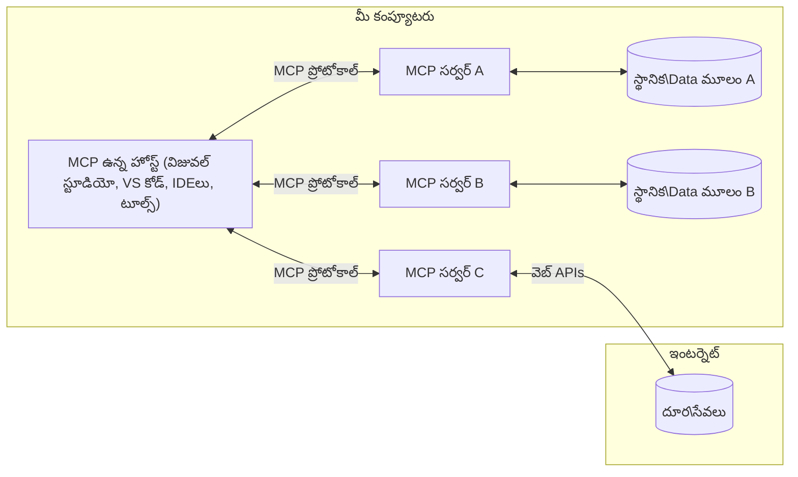

# MCP కోర్ కాన్సెప్ట్‌లు: AI ఇంటిగ్రేషన్ కోసం మోడల్ కాంటెక్స్ ప్రోటోకాల్‌ను మాస్టర్ చేయటం

[](https://youtu.be/earDzWGtE84)

_(ఈ పాఠం వీడియోను వీక్షించడానికి పైన ఉన్న చిత్రంపై క్లిక్ చేయండి)_

[Model Context Protocol (MCP)](https://github.com/modelcontextprotocol) అనేది పెద్ద భాషా నమూనాలు (LLMs) మరియు బాహ్య టూల్స్, అప్లికేషన్‌లు, డేటా సోర్స్‌ల మధ్య కమ్యూనికేషన్‌ను గరిష్టీకరించే శక్తివంతమైన, ప్రమాణీకృత ఫ్రేమ్‌వర్క్.  
ఈ గైడ్ MCP యొక్క మూల భావనల గురించి మీకు వివరించును. మీరు దీని క్లయింట్-సర్వర్ ఆర్కిటెక్చర్, ముఖ్యమైన భాగాలు, కమ్యూనికేషన్ మెకానిజం, మరియు అమలు ఉత్తమ పద్ధతుల గురించి నేర్చుకుంటారు.

- **స్పష్టమైన వినియోగదారు అనుమతి**: అన్ని డేటా యాక్సెస్ మరియు ఆపరేషన్లు నిర్వర్తించే ముందు వినియోగదారుడు స్పష్టమైన అనుమతిని పొందాలి. వినియోగదారులు ఏ డేటా యాక్సెస్ అవుతుందో, ఏ చర్యలు తీసుకుంటాయో స్పష్టంగా అర్థం చేసుకోవాలి, అనుమతులు మరియు అధికారాలపై సూక్ష్మ నియంత్రణతో.

- **డేటా గోప్యత రక్షణ**: వినియోగదారు డేటా మాత్రమే స్పష్టమైన అనుమతితో వెల్లడించబడాలి మరియు మొత్తం ఇంటరాక్షన్ లైఫ్‌సైకాల్లో దృఢమైన యాక్సెస్ నియంత్రణలతో రక్షించబడాలి. అమల్లు అనధికార డేటా ప్రసారాన్ని నివారించాలి మరియు తక్కువ గోప్యతా సరిహద్దులను కాపాడాలి.

- **టూల్ అమలు భద్రత**: ప్రతి టూల్ పిలుపు స్పష్టమైన వినియోగదారు అనుమతితో ఉండాలి మరియు టూల్ యొక్క ఫంక్షనాలిటీ, పారామీటర్లు, మరియు సాధ్యమైన ప్రభావం గురించి స్పష్టమైన అవగాహన కలిగి ఉండాలి. దృఢమైన భద్రతా సరిహద్దులు అనవసర, అపాయకర లేదా దుర్వినియోగ టూల్ అమలును నిరోధించాలి.

- **ట్రాన్స్‌పోర్ట్ లేయర్ సెక్యూరిటీ**: అన్ని కమ్యూనికేషన్ ఛానెల్స్ సరిగ్గా గుప్తీకరణ మరియు ధృవీకరణ చర్యలతో ఉపయోగించాలి. రిమోట్ కనెక్షన్లు సురక్షిత ట్రాన్స్‌పోర్ట్ ప్రోటోకాల్‌లు మరియు సరైన క్రెడెన్షియల్ నిర్వహణను అమలు చేయాలి.

#### అమలు సూచనాలు:

- **అనుమతి నిర్వహణ**: వినియోగదారులకు ఏ సర్వర్లు, టూల్స్, వనరులు యాక్సెస్ చేయదగినవి అనే దానిపై సూక్ష్మ అనుమతి వ్యవస్థలు అమలు చేయండి  
- **ధృవీకరణ & అధికారాలు**: OAuth, API కీ లాంటి సురక్షిత ధృవీకరణ పద్ధతులు మరియు సరైన టోకెన్ నిర్వహణ, గడువు ఉపయోగించండి  
- **ఇన్‌పుట్ ధృవీకరణ**: నిర్వచించబడిన స్కీమాల ప్రకారం అన్ని పారామీటర్లు మరియు డేటా ఇన్‌పుట్‌లను ధృవీకరించండి, ఇంజెక్షన్ దాడులను నివారించండి  
- **ఆడిట్ లాగింగ్**: భద్రతా పర్యవేక్షణ మరియు అనుగుణత కోసం అన్ని ఆపరేషన్ల పూర్తి లాగ్‌లను నిర్వహించండి  

## అవలోకనం

ఈ పాఠం Model Context Protocol (MCP) యొక్క ప్రాథమిక ఆర్కిటెక్చర్ మరియు భాగాలను అన్వేషిస్తుంది. మీరు క్లయింట్-సర్వర్ ఆర్కిటెక్చర్, ముఖ్య భాగాలు, మరియు MCP ఇంటరాక్షన్‌లను శక్తివంతం చేసే కమ్యూనికేషన్ మెకానిజం గురించి నేర్చుకుంటారు.

## ముఖ్యమైన నేర్పుకునే ఆశయాలు

ఈ పాఠం ముగింపు వరకు మీరు:

- MCP క్లయింట్-సర్వర్ ఆర్కిటెక్చర్‌ను అర్థం చేసుకోవాలి.
- హోస్ట్స్, క్లయింట్లు మరియు సర్వర్ల పాత్రలు మరియు బాధ్యతలను గుర్తించాలి.
- MCPని ఒక అనుకూల ఇంటిగ్రేషన్ లేయర్‌గా మార్చే ప్రధాన లక్షణాలను విశ్లేషించాలి.
- MCP పరిసరాలలో సమాచార ప్రవాహం ఎలా జరుగుతుందో నేర్చుకోవాలి.
- .NET, Java, Python మరియు JavaScript కోడ్ ఉదాహరణల ద్వారా వినియోగపదార్థ జ్ఞానం పొందాలి.

## MCP ఆర్కిటెక్చర్: లోతైన అవగాహన

MCP పరిసరములు క్లయింట్-సర్వర్ మోడల్‌పై నిర్మించబడ్డాయి. ఈ మాడ్యులర్ నిర్మాణం AI అప్లికేషన్‌లు టూల్స్, డేటాబేస్‌లు, API లు, మరియు నేపథ్యంలో ఉన్న వనరులతో సమర్ధవంతంగా సర్దుబాటు చేసుకోవడానికి అనుమతిస్తుంది. మనం ఈ ఆర్కిటెక్చర్‌ను ప్రధాన భాగాలుగా విభజిద్దాం.

మూలంగా, MCP క్లయింట్-సర్వర్ ఆర్కిటెక్చర్‌ను అనుసరిస్తుంది, ఇక్కడ ఒక హోస్ట్ అప్లికేషన్ అనేక సర్వర్లకు కనెక్ట్ అవుతుంది:


- **MCP హోస్టులు**: VSCode, Claude Desktop, IDEలు లేదా MCP ద్వారా డేటా యాక్సెస్ చేయాలనుకునే AI టూల్స్ వంటి ప్రోగ్రాములు  
- **MCP క్లయింట్లు**: సర్వర్లతో 1:1 కనెక్షన్లను నిర్వహించే ప్రోటోకాల్ క్లయింట్లు  
- **MCP సర్వర్లు**: ప్రతి ఒక్కరు ప్రత్యేక సామర్థ్యాలను ప్రమాణీకృత Model Context Protocol ద్వారా అందించే లైట్‌వైట్ ప్రోగ్రాములు  
- **లోకల్ డేటా స్రవంతులు**: MCP సర్వర్లకు సురక్షితంగా యాక్సెస్ ఉండే మీ కంప్యూటర్ ఫైళ్లు, డేటాబేస్‌లు మరియు సేవలు  
- **రిమోట్ సేవలు**: ఇంటర్నెట్ మీద APIల ద్వారా MCP సర్వర్లు కనెక్ట్ కావచ్చు అని అందుబాటులో ఉన్న బయటి సిస్టమ్స్  

MCP ప్రోటోకాల్ ఒక అభివృద్ధి చెందుతున్న ప్రమాణం, ఇది తేదీ ఆధారిత వెర్షనింగ్ (YYYY-MM-DD ఫార్మాట్) ఉపయోగిస్తుంది. ప్రస్తుత ప్రోటోకాల్ వెర్షన్ **2025-11-25**. తాజా నవీకరణలను మీరు [ప్రోటోకాల్ స్పెసిఫికేషన్](https://modelcontextprotocol.io/specification/2025-11-25/) లో చూడవచ్చు.

### 1. హోస్టులు

Model Context Protocol (MCP)లో, **హోస్టులు** అనేది వినియోగదారులు ప్రోటోకాల్తో ఇంటరాక్ట్ అయ్యే ప్రైమరీ ఇంటర్‌ఫేస్‌గా పని చేసే AI అప్లికేషన్‌లు. హోస్టులు అనేక MCP సర్వర్లతో కనెక్షన్లను సమన్వయపరచి నిర్వహిస్తాయి, ప్రతి సర్వర్ కనెక్షన్ కోసం ప్రత్యేక MCP క్లయింట్లను సృష్టించి. హోస్టుల ఉదాహరణలు:

- **AI అప్లికేషన్లు**: Claude Desktop, Visual Studio Code, Claude Code  
- **డెవలప్‌మెంట్ ఎన్విరాన్‌మెంట్‌లు**: MCP ఇంటిగ్రేషన్ ఉన్న IDEలు మరియు కోడ్ ఎడిటర్లు  
- **కస్టమ్ అప్లికేషన్లు**: ప్రత్యేకంగా రూపొందించిన AI ఏజెంట్లు మరియు టూల్స్  

**హోస్టులు** AI మోడల్ ఇంటరాక్షన్‌లను సమన్వయం చేసే అప్లికేషన్లు. అవి:

- **AI మోడల్స్‌ను ఆర్కిస్ట్రేట్ చేయడం**: LLMs తో సంభాషణలకు స్పందనలు సృష్టించడం మరియు AI వర్క్‌ఫ్లోలను సమన్వయపరచడం  
- **క్లయింట్ కనెక్షన్ల నిర్వహణ**: ప్రతి MCP సర్వర్ కనెక్షన్ కోసం ఒక MCP క్లయింట్ సృష్టించడం మరియు నిర్వహించడం  
- **వినియోగదారు ఇంటర్‌ఫేస్ నియంత్రణ**: సంభాషణ ప్రవాహం, వినియోగదారులతో ఇంటరాక్షన్, మరియు స్పందన ప్రదర్శనను నిర్వహించడం  
- **సెక్యూరిటీ అమలు**: అనుమతులు, భద్రతా పరిమితులు మరియు ధృవీకరణను నియంత్రించడం  
- **వినియోగదారు అనుమతి నిర్వహణ**: డేటా పంచుకోవడం మరియు టూల్ అమలు కోసం వినియోగదారుడు ఆమోదాన్ని నిర్వహించడం  

### 2. క్లయింట్లు

**క్లయింట్లు** అనేవి హోస్ట్‌లు మరియు MCP సర్వర్ల మధ్య ప్రత్యేకమైన ఒక-ఒక్క కనెక్షన్లను నిర్వహించే కీలక భాగాలు. ప్రతి MCP క్లయింట్‌ను హోస్ట్ ఒక నిర్దిష్ట MCP సర్వర్‌కు కనెక్ట్ కావడానికి సృష్టిస్తుంది, సంసిద్ధ కమ్యూనికేషన్ ఛానెల్స్‌ను నిర్ధారిస్తుంది. అనేక క్లయింట్లు హోస్టులకు అనేక సర్వర్లతో ఒక్కసাথে కనెక్ట్ కావడానికి అవకాశం ఇస్తాయి.

**క్లయింట్లు** హోస్ట్ అప్లికేషన్‌లో కనెక్టర్ భాగాలు. అవి:

- **ప్రోటోకాల్ కమ్యూనికేషన్**: JSON-RPC 2.0 అభ్యర్థనలు సర్వర్లకు పంపడం, ప్రాంప్ట్‌లు మరియు సూచనలతో  
- **సామర్థ్య సంగ్రహం**: ప్రారంభ సమయంలో సర్వర్లతో మద్దతునిచ్చే ఫీచర్లు మరియు ప్రోటోకాల్ వెర్షన్లను చర్చించడం  
- **టూల్ అమలు**: మోడల్స్ నుండి టూల్ అమలు అభ్యర్థనలు నిర్వహించడం మరియు స్పందనలను ప్రాసెస్ చేయడం  
- **రీయల్టైం అప్డేట్లు**: సర్వర్ల నుండి నోటిఫికేషన్లు మరియు ప్రత్యక్ష నవీకరణలను నిర్వహించడం  
- **స్పందన ప్రాసెసింగ్**: వినియోగదారులకు ప్రదర్శించటానికి సర్వర్ స్పందనలను ప్రాసెస్ చేసి ఆకృతీకరించడం  

### 3. సర్వర్లు

**సర్వర్లు** MCP క్లయింట్లకు సందర్భం, టూల్స్ మరియు సామర్థ్యాలను అందించే ప్రోగ్రాములు. అవి లోకల్‌గా (హోస్ట్‌తో అదే మెషీన్లో) లేదా రిమోట్‌గా (బాహ్య ప్లాట్‌ఫార్మ్‌లుపై) అమలవుతాయి, క్లయింట్ అభ్యర్థనలను నిర్వహించి నిర్మిత స్పందనలు అందించడానికి బాధ్యత వహిస్తాయి. సర్వర్లు ప్రమాణీకృత Model Context Protocol ద్వారా ప్రత్యేక ఫంక్షనాలిటీని అందిస్తాయి.

**సర్వర్లు** అనేవి సందర్భం మరియు సామర్థ్యాలను అందించే సర్వీసులు. అవి:

- **ఫీచర్ నమోదు**: క్లయింట్లకు అందుబాటులో ఉన్న ప్రిమిటివ్‌లు (వనరులు, ప్రాంప్ట్‌లు, టూల్స్) నమోదు చేసి అందించడం  
- **అభ్యర్థన ప్రాసెసింగ్**: క్లయింట్ల నుండి టూల్ పిలుపులు, వనరు అభ్యర్థనలు, ప్రాంప్ట్ అభ్యర్థనలను స్వీకరించి అమలు చేయడం  
- **సందర్భం అందించడం**: మోడల్ స్పందనలను మెరుగుపర్చడానికి సందర్భ సమాచారం మరియు డేటా అందించడం  
- **రాష్ట్ర నిర్వహణ**: సెషన్ల స్థితిని నిర్వహించడం మరియు అవసరమైతే స్థితిసంబంధిత ఇంటరాక్షన్‌లను నిర్వహించడం  
- **రీయల్టైం నోటిఫికేషన్లు**: సామర్థ్య మార్పులు మరియు నవీకరణల గురించి కనెక్ట్ అయిన క్లయింట్లకు సమాచారం పంపడం  

సర్వర్లను ఎవరు అయినా మోడల్ సామర్థ్యాల‌ను ప్రత్యేక ఫంక్షనాలిటీలతో విస్తరించేందుకు అభివృద్ధి చేయవచ్చు, మరియు అవి లోకల్ మరియు రిమోట్ అమలుకు మద్దతునివ్వవచ్చు.

### 4. సర్వర్ ప్రిమిటివ్‌లు

Model Context Protocol (MCP)లో సర్వర్లు మూడు ప్రాథమిక **ప్రిమిటివ్** లను అందిస్తాయి, ఇవి క్లయింట్లు, హోస్టులు మరియు భాషా నమూనాల మధ్య సాంప్రదాయమయిన మరియు సుటిలైజ్డ్ ఇంటరాక్షన్లకు ఆవశ్యకమైన నిర్మాణాత్మక అంశాలు. ఈ ప్రిమిటివ్‌లు ప్రోటోకాల్తో అందుబాటులో ఉన్న సందర్భ సమాచార మరియు చర్యల రకాలను నిర్వచిస్తాయి.

MCP సర్వర్లు ఈ మూడు ప్రాథమిక ప్రిమిటివ్‌లలో ఏదైనా కలయికను ప్రకటించవచ్చు:

#### వనరులు

**వనరులు** అనేవి AI అప్లికేషన్‌లకు సందర్భ సమాచారాన్ని అందించే డేటా సోర్స్‌లు. అవి స్థిరమైన లేదా డైనమిక్ కంటెంట్ ను ప్రాతినిధ్యం చేస్తాయి, మోడల్ అర్థం చేసుకోవడం మరియు నిర్ణయం తీసుకోవడాన్ని మెరుగుపరుస్తాయి:

- **సందర్భ డేటా**: AI మోడల్ వినియోగానికి నిర్మిత సమాచారం మరియు సందర్భం  
- **జ్ఞాన ఆధారాలు**: డాక్యుమెంట్ నిల్వలు, వ్యాసాలు, మాన్యువల్స్, పరిశోధనా పత్రాలు  
- **లోకల్ డేటా సోర్స్‌లు**: ఫైల్స్, డేటాబేస్‌లు, లోకల్ సిస్టమ్ సమాచారం  
- **బాహ్య డేటా**: API స్పందనలు, వెబ్ సేవలు, దూర సిస్టమ్ డేటా  
- **డైనమిక్ కంటెంట్**: బాహ్య పరిస్థితులపై ఆధారపడే ప్రత్యక్ష డేటా  

వనరులు URIల ద్వారా గుర్తించబడతాయి మరియు `resources/list` ద్వారా ఆవిష్కరణ మరియు `resources/read` ద్వారా పొందడానికి మద్దతు ఇస్తాయి:

```text
file://documents/project-spec.md
database://production/users/schema
api://weather/current
```

#### ప్రాంప్ట్‌లు

**ప్రాంప్ట్‌లు** భాషా నమూనాలతో ఇంటరాక్షన్లను నిర్మించడానికి సహాయకమైన పునర్వినియోగమయ్యే మూసలుగా ఉంటాయి. అవి ప్రమాణీకృత ఇంటరాక్షన్ నమూనాలు మరియు టెంప్లేటెడ్ వర్క్‌ఫ్లోలను అందిస్తాయి:

- **మూసబద్ధమైన ఇంటరాక్షన్లు**: ముందుగానే నిర్మించిన సందేశాలు మరియు సంభాషణ స్టార్టర్లు  
- **వర్క్‌ఫ్లో టెంప్లేట్‌లు**: సాధారణ పనుల కోసం ప్రమాణీకృత క్రమాల వరుసలు  
- **ఫ్యూ-షాట్ ఉదాహరణలు**: మోడల్ సూచనలకు ఉదాహరణ ఆధారిత మూసలు  
- **సిస్టమ్ ప్రాంప్ట్‌లు**: మోడల్ ప్రవర్తన మరియు సందర్భాన్ని నిర్వచించే ఆధారమైన ప్రాంప్ట్‌లు  
- **డైనమిక్ టెంప్లేట్‌లు**: ప్రత్యేక సందర్భాలకు అనుగుణంగా అనుకూలించే పారామీటర్ ప్రాంప్ట్‌లు  

ప్రాంప్ట్‌లు వేరియబుల్ ప్రత్యామ్నాయం మద్దతు ఇస్తాయి మరియు అవి `prompts/list` ద్వారా ఆవిష్కరించి `prompts/get` ద్వారా పొందవచ్చు:

```markdown
Generate a {{task_type}} for {{product}} targeting {{audience}} with the following requirements: {{requirements}}
```

#### టూల్స్

**టూల్స్** అనేవి AI మోడళ్లు ప్రత్యేక చర్యలు తీసుకునేందుకు పిలవగల నిర్వర్తించదగిన ఫంక్షన్లు. అవి MCP పరిసరపు "క్రియాపదాలు"ని సూచిస్తాయి, మోడల్స్ బాహ్య వ్యవస్థలతో ఇంటరాక్ట్ కాబోసేందుకు వీలు చేస్తాయి:

- **నిర్వర్తించదగిన ఫంక్షన్లు**: మోడల్స్ స్పెసిఫిక్ పారామీటర్లతో పిలవగల ప్రత్యేక ఆపరేషన్లు  
- **బాహ్య సిస్టమ్ ఇంటిగ్రేషన్**: API కాల్స్, డేటాబేస్ ప్రశ్నలు, ఫైల్ ఆపరేషన్లు, లెక్కింపులు  
- **విభిన్న గుర్తింపు**: ప్రతి టూల్‌కు ప్రత్యేక పేరు, వివరణ మరియు పారామీటర్ స్కీమా ఉంటాయి  
- **నిర్మిత I/O**: టూల్స్ ధృవీకరించిన పారామీటర్లను స్వీకరిస్తాయి మరియు నిర్మిత, టైపైన రిగులర్ పంపిణీ ఇస్తాయి  
- **చర్య సామర్థ్యాలు**: మోడల్స్ నిజమైన ప్రపంచ చర్యలు చేయడానికి మరియు ప్రత్యక్ష డేటా పొందడానికి వీలు కల్పిస్తాయి  

టూల్స్‌ను JSON స్కీమా తో నిర్వచిస్తారు పారామీటర్ ధృవీకరణ కోసం, మరియు అవి `tools/list` ద్వారా ఆవిష్కరించి `tools/call` ద్వారా అమలు చేయబడతాయి. మెరుగైన UI ప్రదర్శన కోసం టూల్స్ **ఐకాన్లు**తో కూడ ఉండవచ్చు.

**టూల్ వివరణలు**: టూల్స్ ప్రవర్తనా సూచనలను మద్దతు ఇస్తాయి (ఉదా, `readOnlyHint`, `destructiveHint`) ఇవి ఒక టూల్ పఠనోపయోగమా లేదా ధ్వంసాత్మకమో సూచిస్తాయి, క్లయింట్లు టూల్ అమలుపై సమంజసం తీసుకోవడానికి సహాయపడతాయి.

ఉదాహరణ టూల్ నిర్వచనం:

```typescript
server.tool(
  "search_products", 
  {
    query: z.string().describe("Search query for products"),
    category: z.string().optional().describe("Product category filter"),
    max_results: z.number().default(10).describe("Maximum results to return")
  }, 
  async (params) => {
    // శోధనను అమలు చేసి నిర్మిత ఫలితాలను తిరిగి ఇవ్వండి
    return await productService.search(params);
  }
);
```

## క్లయింట్ ప్రిమిటివ్‌లు

Model Context Protocol (MCP)లో, **క్లయింట్లు** సర్వర్లు హోస్ట్ అప్లికేషన్గా అదనపు సామర్థ్యాలను అభ్యర్థించేందుకు అనుమతించే ప్రిమిటివ్‌లను ఆవిష్కరించగలవు. ఈ క్లయింట్-సైడ్ ప్రిమిటివ్‌లు అధికంగా, ఇంటరాక్టివ్ సర్వర్ అమలులకు అవకాశం ఇస్తాయి, ఇవి AI మోడల్ సామర్థ్యాలు మరియు వినియోగదారు ఇంటరాక్షన్లను యాక్సెస్ చేయగలవు.

### సాంప్లింగ్

**సాంప్లింగ్** ప్లాట్‌ఫారం సర్వర్లకు క్లయింట్ యొక్క AI అప్లికేషన్ నుండి భాషా మోడల్ పూర్తి సూచనలను అభ్యర్థించడానికి అనుమతిస్తుంది. ఈ ప్రిమిటివ్ సర్వర్లు తమ స్వంత మోడల్ డిపెండెన్సీలు లేకుండా LLM సామర్థ్యాలను యాక్సెస్ చేసుకునేందుకు వీలు ఇస్తుంది:

- **మోడల్-స్వతంత్ర యాక్సెస్**: సర్వర్లు LLM SDK లను చేర్చకుండా లేదా మోడల్ యాక్సెస్‌ను నిర్వహించకుండా పూర్తిచెయబడే విధంగా అభ్యర్థనలు చేయగలవు  
- **సర్వర్-ప్రారంభిత AI**: సర్వర్లు క్లయింట్ AI మోడల్ ఉపయోగించిన కంటెంట్ స్వయంచాలకంగా సృష్టించగలవు  
- **ఆవృత LLM ఇంటరాక్షన్‌లు**: సర్వర్స్ AI సహాయం కోరుకునే సంక్లిష్ట పరిస్థితులకు మద్దతు ఇస్తాయి  
- **డైనమిక్ కంటెంట్ జనరేషన్**: హోస్ట్ మోడల్ ఉపయోగించి సందర్భానికి సరిపోయే ప్రతిస్పందనలు సృష్టించగలదు  
- **టూల్ పిలుపు మద్దతు**: సర్వర్లు `tools` మరియు `toolChoice` పారామీటర్లు చేర్చుకొని క్లయింట్ మోడల్ sampling సమయంలో టూల్స్‌ను పిలవగలుగుతుంది  

సాంప్లింగ్ `sampling/complete` పద్ధతితో ప్రారంభించబడుతుంది, అక్కడ సర్వర్లు పూర్తి అభ్యర్థనలు క్లయింట్లకు పంపుతారు.

### రూట్స్

**రూట్స్** క్లయింట్లు సర్వర్లకు ఫైల్‌సిస్టం సరిహద్దులను ప్రమాణీకృతంగా తెలియజేసే వఱ్ఱుస్తాయి, సర్వర్లు ఏ డైరెక్టరీలు మరియు ఫైళ్ళను యాక్సెస్ చేయగలవో అర్ధం చేసుకోవడంలో సహాయపడతాయి:

- **ఫైల్‌సిస్టం సరిహద్దులు**: సర్వర్లు ఫైల్‌సిస్టంలో ఎక్కడ పని చేయగలరో సరిహద్దులను నిర్వచిస్తాయి  
- **యాక్సెస్ నియంత్రణ**: ఏ డైరక్టరీలు, ఫైళ్ళకు అనుమతులు ఉన్నాయో సర్వర్లకు సహాయపడుతుంది  
- **డైనమిక్ నవీకరణలు**: క్లయింట్లు రూట్స్ మారినపుడు సర్వర్లకు నోటిఫై చేయగలదు  
- **URI ఆధార గుర్తింపు**: రూట్స్ `file://` URIలతో యాక్సెస్ అయ్యే డైరెక్టరీలు మరియు ఫైళ్ళను గుర్తిస్తాయి  

రూట్స్ `roots/list` ద్వారా ఆవిష్కరించబడతాయి, క్లయింట్లు `notifications/roots/list_changed` పంపుతారు రూట్స్ మారినప్పుడు.

### ఎలిసిటేషన్

**ఎలిసిటేషన్** సర్వర్లు క్లయింట్ ఇంటర్‌ఫేస్ ద్వారా వినియోగదారుల నుండి అదనపు సమాచారం లేదా నిర్ధారణలను అభ్యర్థించడానికి అనుమతిస్తుంది:

- **వినియోగదారు ఇన్‌పుట్ అభ్యర్థనలు**: టూల్ అమలుకు అవసరమయ్యే అదనపు సమాచారం కోసం సర్వర్లు అభ్యర్థనలు చేయగలవి  
- **నిర్ధారణ డైలాగులు**: సున్నితమైన లేదా ప్రభావవంతమైన కార్యకలాపాల కోసం వినియోగదారుల ఆమోదం కోరటం  
- **ఇంటరాక్టివ్ వర్క్‌ఫ్లోలు**: వినియోగదారుడితో దశల వారీగా ఇంటరాక్షన్‌లను సృష్టించగలదు  
- **డైనమిక్ పారామీటర్ సేకరణ**: టూల్ అమలులో అందని లేదా ఐచ్ఛిక పారామీటర్లను సేకరించటం  

ఎలిసిటేషన్ అభ్యర్థనలు `elicitation/request` పద్ధతి ద్వారా క్లయింట్ ఇంటర్‌ఫేస్ ద్వారా వినియోగదారు ఇన్‌పుట్ సేకరించడానికి చేయబడతాయి.

**URL మోడ్ ఎలిసిటేషన్**: సర్వర్లు URL ఆధారిత వినియోగదారు ఇంటరాక్షన్లను కూడా అభ్యర్థించగలవు, ఇది సర్వర్లకు వినియోగదారులను బాహ్య వెబ్ పేజీలకు(authentication, నిర్ధారణ, లేదా డేటా ఎంట్రీ కోసం) నడిపించడానికి అనుమతిస్తుంది.

### లాగింగ్

**లాగింగ్** సర్వర్లకు క్లయింట్లకు నిర్మిత లాగ్ సందేశాలను పంపే అవకాశం ఇస్తుంది, డీబగ్గింగ్, పర్యవేక్షణ, మరియు ఆపరేషన్ దృశ్యమానత కోసం:

- **డీబగ్గింగ్ మద్దతు**: సర్వర్లు సమస్య పరిష్కారానికి వివరణాత్మక అమల లాగ్‌లు అందించడం  
- **ఆపరేషనల్ పర్యవేక్షణ**: క్లయింట్లకు స్థితి నవీకరణలు మరియు పనితీరు మెట్రిక్స్ పంపడం  
- **తప్పిద నివేదిక**: వివరమైన దోష సందర్భం మరియు విశ్లేషణ సమాచారం అందించడం  
- **ఆడిట్ ట్రయిల్స్**: సర్వర్ ఆపరేషన్ల మరియు నిర్ణయాల పూర్తి లాగ్‌లను సృష్టించడం  

లాగింగ్ సందేశాలు సర్వర్ ఆపరేషన్లలో పారదర్శకతను కల్పించి డీబగ్గింగ్ సులభతరం చేయడానికి క్లయింట్లకు పంపబడతాయి.

## MCPలో సమాచార ప్రవాహం

Model Context Protocol (MCP) హోస్ట్లు, క్లయింట్లు, సర్వర్లు మరియు మోడల్స్ మధ్య సమాచార నిర్మిత ప్రవాహాన్ని నిర్వచిస్తుంది. ఈ ప్రవాహాన్ని అర్థం చేసుకోవడం ద్వారా వినియోగదారు అభ్యర్థనలు ఎలా ప్రాసెస్ అవుతాయో, బాహ్య టూల్స్ మరియు డేటా ఎలా మోడల్ స్పందనలలో సమ్మిళితం అవుతాయో స్పష్టంగా తెలుస్తుంది.
- **హోస్ట్ కనెక్షన్ ప్రారంభిస్తుంది**  
  హోస్ట్ అప్లికేషన్ (IDE లేదా చాట్ ఇంటర్‌ఫేస్ వంటి) సాధారణంగా STDIO, WebSocket లేదా ఇతర మద్దతు పొందిన ట్రాన్స్‌పోర్ట్ ద్వారా MCP సర్వర్‌తో కనెక్షన్ ఏర్పాటు చేస్తుంది.

- **సామర్ధ్య చర్చ**  
  కస్టమర్ (హోస్ట్‌లోకి ఎంబెడ్ చేయబడి) మరియు సర్వర్ తమ మద్దతు పొందిన ఫీచర్లు, టూల్స్, వనరులు, మరియు ప్రొటోకాల్ సంచికల గురించి సమాచారం మార్చుకుంటారు. ఇది రెండు వైపులా సెషన్ కోసం అందుబాటులో ఉన్న సామర్ధ్యాలు ఏవో అర్థం చేసుకోవడానికి సహాయపడుతుంది.

- **వినియోగదారు అభ్యర్థన**  
  వినియోగదారు హోస్టుతో పరస్పరం చేస్తాడు (ఉదా. ప్రాంప్ట్ లేదా కమాండ్ ఎంటర్ చేయడం). హోస్ట్ ఈ ఇన్‌పుట్‌ను సేకరించి దాన్ని ప్రాసెసింగ్ కోసం కస్టమర్‌కు పంపుతుంది.

- **వనరు లేదా టూల్ ఉత్పత్తి**  
  - కస్టమర్ మోడల్ యొక్క అర్థం పెంపుకోవడానికి సర్వర్ నుండి అదనపు సారాంశం లేదా వనరులు (ఫైళ్లు, డేటాబేస్ నాణేలు, లేదా జ్ఞానాధార పత్రాలు) అడగవచ్చు.  
  - మోడల్ ఎక్కడైతే టూల్ అవసరమని నిర్ణయిస్తే (ఉదా. డేటా తీసుకొనుట, లెక్కింపు నిర్వహణ, లేదా API కాల్ చేయడం), కస్టమర్ టూల్ పిలుపు అభ్యర్థనను సర్వర్‌కి పంపుతుంది, టూల్ పేరు మరియు పారామితులు సూచిస్తాయి.

- **సర్వర్ అమలు**  
  సర్వర్ వనరు లేదా టూల్ అభ్యర్థనను అందించి, అవసరమైన ఆపరేషన్లు (ఫంక్షన్ నడపడం, డేటాబేస్ విచారణ, లేదా ఫైల్ రీట్రీవల్) నిర్వహించి, ఫలితాలను గঠনాత్మక రీతిలో కస్టమర్‌కి తిరిగి పంపుతుంది.

- **ప్రతిస్పందన సృష్టి**  
  కస్టమర్ సర్వర్ నుండి వచ్చిన ప్రతిస్పందనలు (వనరు డేటా, టూల్ అవుట్పుట్‌లు) ప్రస్తుత మోడల్ పరస్పర సంబంధంలో అనుసంధానిస్తుంది. మోడల్ ఈ సమాచారం ఉపయోగించి సమగ్ర, సందర్భోచిత ప్రతిస్పందనని రూపొందిస్తుంది.

- **ఫలితాన్ని ప్రదర్శించటం**  
  హోస్ట్ కస్టమర్ నుండి తుది అవుట్పుట్‌ను అందుకుని వినియోగదారునికి చూపిస్తుంది, తరచుగా మోడల్ రూపొందించిన టెక్స్‌ట్ మరియు టూల్ అమలుల లేదా వనరు శోధన ఫలితాలు రెండింటినీ చేర్చుతుంది.

ఈ ఫ్లో MCP కి అధునాతన, ఇంటరాక్టివ్, మరియు సందర్భ జాగ్రత్త AI అప్లికేషన్‌లను మోడల్స్‌ను బాహ్య టూల్స్ మరియు డేటా సోర్సులతో సజావుగా కనెక్ట్ చేయటానికి అనుమతిస్తుంది.

## ప్రొటోకాల్ వాసుసంపద మరియు పొరలు

MCP రెండు ప్రత్యేక వాసుసంపద పొరలను కలిగి ఉంది, ఇవి కలిసి సంపూర్ణ కమ్యూనికేషన్ ఫ్రేమ్‌వర్క్‌ను అందిస్తాయి:

### డేటా పొర

**డేటా పొర** మౌలిక MCP ప్రొటోకాల్‌ను **JSON-RPC 2.0** ఆధారంగా అమలు చేస్తుంది. ఈ పొర సందేశ నిర్మాణం, సారాంశాలు, మరియు పరస్పర చర్య నమూనాలను నిర్వచిస్తుంది:

#### ప్రాథమిక భాగాలు:

- **JSON-RPC 2.0 ప్రొటోకాల్**: అన్ని కమ్యూనికేషన్లు JSON-RPC 2.0 మెసేజ్ ఫార్మాట్ ను ఉపయోగించి పద్ధతులు, ప్రతిస్పందనలు మరియు నోటిఫికేషన్ల కోసం నిర్వహిస్తాయి  
- **జీవన చక్ర నిర్వహణ**: క్లయింట్లు మరియు సర్వర్ల మధ్య కనెక్షన్ ప్రారంభం, సామర్ధ్య చర్చ, సెషన్ ముగింపు నిర్వహణ  
- **సర్వర్ ప్రిమిటివ్స్**: సర్వర్లు టూల్స్, వనరులు, మరియు ప్రాంప్ట్స్ ద్వారా మౌలిక కార్యక్రమాన్ని అందించగలుగుతాయి  
- **క్లయింట్ ప్రిమిటివ్స్**: సర్వర్లు LLM నమూనాల నుండి నమూనా తీయడం, వినియోగదారు ఇన్‌పుట్ కోరడం, మరియు లాగ్ సందేశాలను పంపడం నడిపించగలుగుతాయి  
- **రియల్టైమ్ నోటిఫికేషన్లు**: పోలింగ్ లేకుండానే డైనమిక్ అప్‌డేట్లకు అసింక్రనస్ నోటిఫికేషన్లకు మద్దతు

#### ముఖ్య లక్షణాలు:

- **ప్రొటోకాల్ వెర్షన్ చర్చ**: YYYY-MM-DD తేదీ ఆధారిత సంచిక ఉపయోగించి అనుకూలత నిర్ధారిస్తుంది  
- **సామర్ధ్య ఆవిష్కరణ**: ప్రారంభ సమయంలో క్లయింట్లు మరియు సర్వర్లు మద్దతు పొందిన ఫీచర్లు మార్పిడి చేస్తారు  
- **స్టేట్‌ఫుల్ సెషన్స్**: అనేక పరస్పర చర్యలపై కనెక్షన్ స్థితిని నిలుపుకుని పరిస్థితి సరిగా కొనసాగుతుంది

### ట్రాన్స్‌పోర్ట్ పొర

**ట్రాన్స్‌పోర్ట్ పొర** MCP పాల్గొనేవారి మధ్య కమ్యూనికేషన్ ఛానల్స్, సందేశం నిర్మాణం మరియు ధృవీకరణ నిర్వహణ చేస్తుంది:

#### మద్దతు పొందిన ట్రాన్స్‌పోర్ట్ పద్ధతులు:

1. **STDIO ట్రాన్స్‌పోర్ట్**:  
   - సొంత ఇన్‌పుట్/అవుట్పుట్ స్ట్రీములను కలిగి ప్రత్యక్ష ప్రాసెస్ కమ్యూనికేషన్ కోసం ఉపయోగిస్తారు  
   - అదే యంత్రంలోని స్థానిక ప్రాసెస్‌ల కోసం ఏదైనా నెట్‌వర్క్ ఓవర్‌హెడ్ లేకుండా ఉత్తమం  
   - స్థానిక MCP సర్వర్ అమలులకు సాధారణం

2. **ಸ್ಟ್ರೀమಬಲ್ HTTP ಟ್ರాన్స్‌పೋರ್ಟ್**:  
   - క్లయింట్-టు-సర్వర్ సందేశాల కోసం HTTP POST ఉపయోగిస్తుంది  
   - సర్వర్-టు-క్లయింట్ స్ట్రీమింగ్ కోసం ఐచ్ఛిక Server-Sent Events (SSE) మద్దతు  
   - నెట్వర్క్‌ల ద్వారా దూర సర్వర్ కమ్యూనికేషన్ అనుమతిస్తుంది  
   - మామూలు HTTP ధృవీకరణ (బేరర్ టోకెన్లు, API కీలు, కస్టమ్ హెడ్డర్స్) మద్దతు  
   - MCP సురక్షిత టోకెన్-ఆధారిత ధృవీకరణ కోసం OAuth సిఫార్సు చేస్తుంది

#### ట్రాన్స్‌పోర్ట్ అభ్యాసం:

ట్రాన్స్‌పోర్ట్ పొర కమ్యూనికేషన్ వివరాలను డేటా పొర నుండి విచ్ఛిన్నం చేస్తుంది, అందువలన అన్ని ట్రాన్స్‌పోర్ట్ పద్ధతుల్లో అదే JSON-RPC 2.0 మెసేజ్ ఫార్మాట్ ఉపయోగించబడుతుంది. ఈ అభ్యాసం అనువర్తనాలను స్థానిక మరియు దూర సర్వర్ల మధ్య సజావుగా మార్పిడి చేసేందుకు అనుమతిస్తుంది.

### భద్రత పాయింట్లు

MCP అమలులు అన్ని ప్రొటోకాల్ ఆపరేషన్లలో సురక్షితం, నమ్మకమైన, మరియు భద్రత గల పరస్పర చర్యలను నిర్ధారించేందుకు అనుసరించవలసిన ముఖ్య భద్రత సూత్రాలను పాటించాలి:

- **వినియోగదారు అనుమతి మరియు నియంత్రణ**: ఏ డేటా యాక్సెస్ చేసేముందు లేదా ఆపరేషన్లు నిర్వహించేముందు స్పష్టమైన వినియోగదారు అనుమతి ఉండాలి. ఏ డేటా పంచుకోబడతుందో మరియు ఏ చర్యలు అనుమతించబడ్డాయో వినియోగదారుని సమర్థమైన నియంత్రణ ఉండాలి, సమీక్ష మరియు ఆమోదానికి సరళమైన ఉపయోగకర ఇంటర్‌ఫేస్‌లతో.

- **డేటా గోప్యత**: వినియోగదారు డేటా స్పష్టమైన అనుమతితో మాత్రమే బయటపడాలి మరియు అనుకూలమైన యాక్సెస్ నియంత్రణలతో రక్షించబడాలి. MCP అమలులు అనధికార డేటా ప్రసారం నుంచి రక్షణలు కలిగి ఉండాలి, మరియు అన్ని పరస్పర చర్యల్లో గోప్యతా పరిరక్షణ నిర్వహించాలి.

- **టూల్ భద్రత**: ఏ టూల్‌ను పనిలో పెట్టేముందు స్పష్టమైన వినియోగదారు అనుమతి అవసరం. ప్రతి టూల్ ఫంక్షనాలిటీ స్పష్టంగా వినియోగదారుకు తెలిసియుండాలి, మరియు అనుకోని లేదా ప్రమాదకర టూల్ అమలుకు గట్టి భద్రతా పరిమితులు అమలు చేయాలి.

ఈ భద్రతా సూత్రాలను అనుసరించడం ద్వారా MCP వినియోగదారు నమ్మకం, గోప్యత, మరియు భద్రతను అన్ని ప్రోటోకాల్ పరస్పర చర్యలలో స్థిరపరుస్తుంది, శక్తివంతమైన AI ఇంటిగ్రేషన్లను కూడా సులభతరం చేస్తుంది.

## కోడ్ ఉదాహరణలు: ముఖ్య భాగాలు

కింది పాప్యులర్ ప్రోగ్రామింగ్ భాషల్లో MCP సర్వర్ ముఖ్య భాగాలు మరియు టూల్స్ ఎలా అమలు చేయాలో చూపించే కోడ్ ఉదాహరణలు ఉన్నాయి.

### .NET ఉదాహరణ: టూల్స్ తో సరళ MCP సర్వర్ సృష్టి

సొగసైన .NET కోడ్ ఉదాహరణ ఇది, కస్టమ్ టూల్స్‌తో సరళ MCP సర్వర్ ఎలా అమలు చేయాలో చూపిస్తుంది. టూల్స్ నిర్వచించడం, రిజిస్టర్ చేయడం, అభ్యర్థనలు నిర్వహించడం మరియు Model Context Protocol ద్వారా సర్వర్‌ను కనెక్ట్ చేయడం చూపిస్తుంది.

```csharp
using System;
using System.Threading.Tasks;
using ModelContextProtocol.Server;
using ModelContextProtocol.Server.Transport;
using ModelContextProtocol.Server.Tools;

public class WeatherServer
{
    public static async Task Main(string[] args)
    {
        // Create an MCP server
        var server = new McpServer(
            name: "Weather MCP Server",
            version: "1.0.0"
        );
        
        // Register our custom weather tool
        server.AddTool<string, WeatherData>("weatherTool", 
            description: "Gets current weather for a location",
            execute: async (location) => {
                // Call weather API (simplified)
                var weatherData = await GetWeatherDataAsync(location);
                return weatherData;
            });
        
        // Connect the server using stdio transport
        var transport = new StdioServerTransport();
        await server.ConnectAsync(transport);
        
        Console.WriteLine("Weather MCP Server started");
        
        // Keep the server running until process is terminated
        await Task.Delay(-1);
    }
    
    private static async Task<WeatherData> GetWeatherDataAsync(string location)
    {
        // This would normally call a weather API
        // Simplified for demonstration
        await Task.Delay(100); // Simulate API call
        return new WeatherData { 
            Temperature = 72.5,
            Conditions = "Sunny",
            Location = location
        };
    }
}

public class WeatherData
{
    public double Temperature { get; set; }
    public string Conditions { get; set; }
    public string Location { get; set; }
}
```


### జావా ఉదాహరణ: MCP సర్వర్ భాగాలు

ఇది .NET ఉదాహరణలో వంట MCP సర్వర్ మరియు టూల్ రిజిస్ట్రేషన్‌ను జావాలో అమలు చేస్తుంది.

```java
import io.modelcontextprotocol.server.McpServer;
import io.modelcontextprotocol.server.McpToolDefinition;
import io.modelcontextprotocol.server.transport.StdioServerTransport;
import io.modelcontextprotocol.server.tool.ToolExecutionContext;
import io.modelcontextprotocol.server.tool.ToolResponse;

public class WeatherMcpServer {
    public static void main(String[] args) throws Exception {
        // ఒక MCP సర్వర్‌ను సృష్టించండి
        McpServer server = McpServer.builder()
            .name("Weather MCP Server")
            .version("1.0.0")
            .build();
            
        // వాతావరణ సాధనాన్ని నమోదు చేయండి
        server.registerTool(McpToolDefinition.builder("weatherTool")
            .description("Gets current weather for a location")
            .parameter("location", String.class)
            .execute((ToolExecutionContext ctx) -> {
                String location = ctx.getParameter("location", String.class);
                
                // వాతావరణ డేటాను పొందండి (సరళీకృతం)
                WeatherData data = getWeatherData(location);
                
                // అలంకరించిన ప్రతిస్పందనను ఇవ్వండి
                return ToolResponse.content(
                    String.format("Temperature: %.1f°F, Conditions: %s, Location: %s", 
                    data.getTemperature(), 
                    data.getConditions(), 
                    data.getLocation())
                );
            })
            .build());
        
        // stdio ట్రాన్స్‌పోర్ట్ ఉపయోగించి సర్వర్‌ను కనెక్ట్ చేయండి
        try (StdioServerTransport transport = new StdioServerTransport()) {
            server.connect(transport);
            System.out.println("Weather MCP Server started");
            // ప్రాసెస్ ముగియనంత వరకు సర్వర్‌ను రన్‌లో ఉంచండి
            Thread.currentThread().join();
        }
    }
    
    private static WeatherData getWeatherData(String location) {
        // అమలు వాతావరణ APIని పిలుస్తుంది
        // ఉదాహరణలకు సరళీకృతం చేయబడింది
        return new WeatherData(72.5, "Sunny", location);
    }
}

class WeatherData {
    private double temperature;
    private String conditions;
    private String location;
    
    public WeatherData(double temperature, String conditions, String location) {
        this.temperature = temperature;
        this.conditions = conditions;
        this.location = location;
    }
    
    public double getTemperature() {
        return temperature;
    }
    
    public String getConditions() {
        return conditions;
    }
    
    public String getLocation() {
        return location;
    }
}
```


### పython ఉదాహరణ: MCP సర్వర్ నిర్మాణం

ఈ ఉదాహరణ fastmcp ఉపయోగిస్తుంది, కాబట్టి దయచేసి ముందుగా అది ఇన్‌స్టాల్ చేసుకోండి:

```python
pip install fastmcp
```


కోడ్ సాంపిల్:

```python
#!/usr/bin/env python3
import asyncio
from fastmcp import FastMCP
from fastmcp.transports.stdio import serve_stdio

# FastMCP సర్వర్ సృష్టించండి
mcp = FastMCP(
    name="Weather MCP Server",
    version="1.0.0"
)

@mcp.tool()
def get_weather(location: str) -> dict:
    """Gets current weather for a location."""
    return {
        "temperature": 72.5,
        "conditions": "Sunny",
        "location": location
    }

# ఒక తరగతి ఉపయోగించి ప్రత్యామ్నాయ విధానం
class WeatherTools:
    @mcp.tool()
    def forecast(self, location: str, days: int = 1) -> dict:
        """Gets weather forecast for a location for the specified number of days."""
        return {
            "location": location,
            "forecast": [
                {"day": i+1, "temperature": 70 + i, "conditions": "Partly Cloudy"}
                for i in range(days)
            ]
        }

# తరగతి టూల్స్ నమోదు చేయండి
weather_tools = WeatherTools()

# సర్వర్ ప్రారంభించండి
if __name__ == "__main__":
    asyncio.run(serve_stdio(mcp))
```


### జావాస్క్రిప్ట్ ఉదాహరణ: MCP సర్వర్ సృష్టి

ఈ ఉదాహరణ JavaScript లో MCP సర్వర్ సృష్టిని మరియు వాతావరణ సంబంధ టూల్స్ రెండు ఎలా రిజిస్టర్ చేయాలో చూపిస్తుంది.

```javascript
// అధికారిక మోడల్ కాంటెక్స్ట్ ప్రోటోకాల్ SDK ఉపయోగిస్తున్నాము
import { McpServer } from "@modelcontextprotocol/sdk/server/mcp.js";
import { StdioServerTransport } from "@modelcontextprotocol/sdk/server/stdio.js";
import { z } from "zod"; // పరామితి ధృవీకరణ కోసం

// MCP సర్వర్ సృష్టించండి
const server = new McpServer({
  name: "Weather MCP Server",
  version: "1.0.0"
});

// వాతావరణ సాధనాన్ని నిర్వచించండి
server.tool(
  "weatherTool",
  {
    location: z.string().describe("The location to get weather for")
  },
  async ({ location }) => {
    // ఇది సాధారణంగా వాతావరణ APIని పిలుస్తుంది
    // ప్రదర్శన కోసం సరళీకృతం చేయబడింది
    const weatherData = await getWeatherData(location);
    
    return {
      content: [
        { 
          type: "text", 
          text: `Temperature: ${weatherData.temperature}°F, Conditions: ${weatherData.conditions}, Location: ${weatherData.location}` 
        }
      ]
    };
  }
);

// పూర్వాహ్న విన్యాస సాధనాన్ని నిర్వచించండి
server.tool(
  "forecastTool",
  {
    location: z.string(),
    days: z.number().default(3).describe("Number of days for forecast")
  },
  async ({ location, days }) => {
    // ఇది సాధారణంగా వాతావరణ APIని పిలుస్తుంది
    // ప్రదర్శన కోసం సరళీకృతం చేయబడింది
    const forecast = await getForecastData(location, days);
    
    return {
      content: [
        { 
          type: "text", 
          text: `${days}-day forecast for ${location}: ${JSON.stringify(forecast)}` 
        }
      ]
    };
  }
);

// సహాయక ఫంక్షన్లు
async function getWeatherData(location) {
  // API కాల్ ను అనుకరించండి
  return {
    temperature: 72.5,
    conditions: "Sunny",
    location: location
  };
}

async function getForecastData(location, days) {
  // API కాల్ ను అనుకరించండి
  return Array.from({ length: days }, (_, i) => ({
    day: i + 1,
    temperature: 70 + Math.floor(Math.random() * 10),
    conditions: i % 2 === 0 ? "Sunny" : "Partly Cloudy"
  }));
}

// stdio రవాణా ద్వారా సర్వర్ ను కలపండి
const transport = new StdioServerTransport();
server.connect(transport).catch(console.error);

console.log("Weather MCP Server started");
```


ఈ JavaScript ఉదాహరణ Model Context Protocol SDK ఉపయోగించి MCP సర్వర్ సృష్టి చూపిస్తుంది. `weatherTool` మరియు `forecastTool` అనే రెండు టూల్స్ క్రింద MCP క్లయింట్లకి అందుబాటులో ఉంచడానికి `StdioServerTransport` ఉపయోగించి ఎలా చేయాలో చూపిస్తుంది.

## భద్రత మరియు అనుమతులు

MCP ప్రోటోకాల్ అంతటా భద్రత మరియు అనుమతుల నిర్వహణ కోసం కొన్ని అంతర్గత భావనలు మరియు పద్ధతులను కలిగి ఉంటుంది:

1. **టూల్ అనుమతి నియంత్రణ**  
  సెషన్ సమయంలో మోడల్ ఉపయోగించగల టూల్స్‌ను క్లయింట్లు పేర్కొనవచ్చు. దీని వల్ల స్పష్టంగా అనుమతించిన టూల్స్ మాత్రమే యాక్సెస్ చేయబడతాయి, అనుకోని లేదా ప్రమాదకర ఆపరేషన్లు తగ్గుతాయి. అనుమతులు వినియోగదారు ఇష్టాలు, సంస్థ విధానాలు, లేదా పరస్పర చర్య సందర్భం ఆధారంగా డైనమిక్‌గా కాన్ఫిగర్ చేయబడవచ్చు.

2. **ధృవీకరణ**  
  సర్వర్లు టూల్స్, వనరులు, లేదా సున్నితమైన ఆపరేషన్లకు యాక్సెస్ ఇవ్వేముందు ధృవీకరణ అవసరం వుంటుంది. ఇందులో API కీలు, OAuth టోకెన్లు, లేదా ఇతర ధృవీకరణ పద్ధతులు వుండవచ్చు. సరైన ధృవీకరణ ద్వారా కాకుండా నమ్మకమైన క్లయింట్లు మరియు వినియోగదారులే సర్వర్ సామర్థ్యాలను పిలవగలరు.

3. **వెలిడేషన్**  
  అన్ని టూల్ పిలుపుల కోసం పారామితుల వెలిడేషన్ కఠినంగా పాటించబడుతుంది. ప్రతి టూల్ తన పారామితులు కోసం అంచనా వేసే రకాలు, ఫార్మాట్లు, మరియు పరిమితులను నిర్వచిస్తుంది, సర్వర్ వాటిని అందులోనూ ఇన్‌కమింగ్ అభ్యర్థనలను పరామర్శించి సంపూర్ణతను నిర్ధారిస్తుంది. ఇది కేసులు తప్పుదోవపట్టిన లేదా హానికర ఇన్‌పుట్ చేరుకోవకుండా నిరోధిస్తుంది మరియు ఆపరేషన్ల సమగ్రతను కాపాడుతుంది.

4. **రేట్ లిమిటింగ్**  
  దుర్వినియోగాన్ని నివారించడానికి మరియు సర్వర్ వనరుల సమానమైన వినియోగం సంరక్షించడానికి MCP సర్వర్లు టూల్ పిలుపులు మరియు వనరు యాక్సెస్‌ల కోసం రేట్ లిమిటింగ్ అమలు చేయవచ్చు. రేట్ లిమిట్లు వినియోగదారు, సెషన్, లేదా గ్లోబల్ స్థాయిలో వర్తించవచ్చు, ఇది డినైయల్-ఆఫ్-సర్వీస్ దాడులు లేదా అధిక వనరు వినియోగాన్ని నివారిస్తుంది.

ఈ పద్ధతులను కలిపి MCP భాష నమూనాలను బాహ్య టూల్స్ మరియు డేటా సోర్సులతో సురక్షితంగా కలపడానికి ప్రామాణమైన ఆధారాన్ని అందిస్తుంది, వినియోగదారులకు మరియు డెవలపర్లకు యాక్సెస్ మరియు వినియోగంపై మౌలిక నియంత్రణలు ఇస్తుంది.

## ప్రోటోకాల్ సందేశాలు & కమ్యూనికేషన్ ఫ్లో

MCP కమ్యూనికేషన్ స్పష్టమైన, నమ్మదగిన పరస్పర చర్యల కోసం నిర్మించిన **JSON-RPC 2.0** సందేశాలను ఉపయోగిస్తుంది. వివిధ రకాల ఆపరేషన్ల కోసం ప్రత్యేక సందేశ నమూనాలను ప్రోటోకాల్ నిర్వచించాయి:

### ప్రాథమిక సందేశ రకాలు:

#### **ప్రారంభ సందేశాలు**  
- **`initialize` అభ్యర్థన**: కనెక్షన్ ప్రారంభం మరియు ప్రోటోకాల్ సంచిక, సామర్ధ్యాలు చర్చ  
- **`initialize` ప్రతిస్పందన**: మద్దతు పొందిన ఫీచర్లు మరియు సర్వర్ సమాచారం ధృవీకరణ  
- **`notifications/initialized`**: ప్రారంభం పూర్తయినదని, సెషన్ సిద్ధంగా ఉందని సంకేతం

#### **ఆవిష్కరణ సందేశాలు**  
- **`tools/list` అభ్యర్థన**: సర్వర్ నుంచి లభించే టూల్స్ ఆవిష్కరణ  
- **`resources/list` అభ్యర్థన**: లభ్యమయ్యే వనరుల జాబితా  
- **`prompts/list` అభ్యర్థన**: అందుబాటులో ఉన్న ప్రాంప్ట్ టెంప్లేట్‌లు పొందడం

#### **నిర్వహణ సందేశాలు**  
- **`tools/call` అభ్యర్థన**: నిర్దిష్ట టూల్ కార్యాచరణతో అమలుచేయడం  
- **`resources/read` అభ్యర్థన**: నిర్దిష్ట వనరునుండి కంటెంట్ రీట్రీవ్  
- **`prompts/get` అభ్యర్థన**: ఐచ్ఛిక పారామితులతో ప్రాంప్ట్ టెంప్లేట్ తీసుకోవడం

#### **క్లయింట్-చెవ్వైన సందేశాలు**  
- **`sampling/complete` అభ్యర్థన**: సర్వర్ క్లయింట్ ద్వారా LLM పూర్తి కోరుతుంది  
- **`elicitation/request`**: వినియోగదారుని ఇన్‌పుట్ కోసం సర్వర్ క్లయింట్ చెవ్వు ద్వారా అడుగుట  
- **లాగింగ్ సందేశాలు**: సర్వర్ స్ట్రక్చర్డ్ లాగ్ సందేశాలను క్లయింట్‌కి పంపుతుంది

#### **నోటిఫికేషన్ సందేశాలు**  
- **`notifications/tools/list_changed`**: టూల్ మార్పుల గురించి సర్వర్ క్లయింట్‌కు తెలియజేస్తుంది  
- **`notifications/resources/list_changed`**: వనరు మార్పుల గురించి తెలియజేస్తుంది  
- **`notifications/prompts/list_changed`**: ప్రాంప్ట్ మార్పుల గురించి తెలియజేస్తుంది

### సందేశ నిర్మాణం:

అన్ని MCP సందేశాలు JSON-RPC 2.0 ఫార్మాట్ అనుసరిస్తాయి:  
- **అభ్యర్థన సందేశాలు**: `id`, `method`, మరియు ఐచ్ఛిక `params` ఉంటాయి  
- **ప్రతిస్పందన సందేశాలు**: `id` మరియు `result` లేదా `error` ఉంటాయి  
- **నోటిఫికేషన్ సందేశాలు**: `method` మరియు ఐచ్ఛిక `params` కలిగి ఉంటాయి (ఇప్పుడు `id` లేకుండా మరియు ప్రతిస్పందన అవసరం లేదు)

ఈ నిర్మిత గల కమ్యూనికేషన్ సమర్థవంతమైన, ట్రేస్ చేయదగిన, మరియు విస్తరించగల పరస్పర చర్యలను నిర్ధారిస్తుంది, దీని ద్వారా రియల్టైమ్ అప్‌డేట్‌లు, టూల్ చైనింగ్, మరియు పటిష్టమైన లోపాల నిర్వహణ సాధ్యమవుతుంది.

### టాస్కులు (పరిశీలనాత్మక)

**టాస్కులు** అనేవి పరిశీలనాత్మక ఫీచర్, ఇవి MCP అభ్యర్థనలకు ఆలస్యపు ఫలిత స్వీకరణను మరియు స్థితి ట్రాకింగ్‌ను అనుమతించే నిలకడైన అమలు రాపర్స్.

- **దీర్ఘకాలిక ఆపరేషన్లు**: ఖర్చుతో కూడుకున్న లెక్కింపులు, వర్క్‌ఫ్లో ఆటోమేషన్, మరియు బ్యాచ్ ప్రాసెసింగ్‌ను ట్రాక్ చేస్తాయి  
- **ఆలస్యపు ఫలితాలు**: టాస్క్ స్థితిని పోలింగ్ చేసి ఆపరేషన్ పూర్తి అయిన తర్వాత ఫలితాలు తీసుకోవడం  
- **స్థితి ట్రాకింగ్**: నిర్వచిత జీవిత చక్ర దశల ద్వారా టాస్క్ పురోగతిని పర్యవేక్షణ  
- **బహుస్థితి ఆపరేషన్స్**: అనేక పరస్పర చర్యల ద్వారా కవర్ అయ్యే క్లిష్ట వర్క్‌ఫ్లోలను మద్దతు

టాస్కులు సాంప్రదాయ MCP అభ్యర్థనలను ముడిపెట్టి అసింక్రనస్ అమలు నమూనాలను సాధ్యంచేస్తాయి, తద్వారా వెంటనే పూర్తవలేని ఆపరేష‌న్లను నిర్వహించగలుగుతాయి.

## ముఖ్యాంశాలు

- **వాసుసంపద**: MCP క్లయింట్-సర్వర్ వాసుసంపదను ఉపయోగిస్తుంది, ఇక్కడ హోస్ట్లు అనేక క్లయింట్ కనెక్షన్లను సర్వర్లకు నిర్వహిస్తాయి  
- **పాల్గొనేవారు**: ఈ వ్యవస్థలో హోస్ట్లు (AI అప్లికేషన్లు), క్లయింట్లు (ప్రోటోకాల్ కనెక్టర్లు), మరియు సర్వర్లు (సామర్ధ్య సరఫరాదారులు) ఉంటారు  
- **ట్రాన్స్‌పోర్ట్ పద్ధతులు**: STDIO (స్థానిక) మరియు Streamable HTTP ఐచ్ఛిక SSE తో (దూర) మద్దతు ఉంటాయి  
- **ప్రాథమిక ప్రిమిటివ్స్**: సర్వర్లు టూల్స్ (నడిపించగల ఫంక్షన్లు), వనరులు (డేటా సోర్సులు), మరియు ప్రాంప్ట్స్ (టెంప్లేట్లు) అందిస్తారు  
- **క్లయింట్ ప్రిమిటివ్స్**: సర్వర్లు నమూనా తీయటం (LLM పూర్తి తో టూల్ పిలుపు మద్దతుతో), elicitation (URL మోడ్ సహా వినియోగదారు ఇన్‌పుట్), roots (ఫైల్‌సిస్టమ్ పరిమితులు), మరియు లాగింగ్ కస్టమర్ల నుంచి అడగగలుగుతాయి  
- **పరిశీలనాత్మక ఫీచర్స్**: టాస్కులు దీర్ఘకాల ఆపరేషన్ల కోసం నిలకడి అమలు రాపర్స్ అందిస్తాయి  
- **ప్రోటోకాల్ ఆధారం**: JSON-RPC 2.0 మరియు తేదీ ఆధారిత సంచిక (ప్రస్తుత: 2025-11-25)  
- **రియల్టైమ్ సామర్ధ్యాలు**: డైనమిక్ అప్‌డేట్లను, రియల్టైమ్ సమన్వయాన్ని మద్దతు  
- **భద్రత ప్రాధాన్యత**: స్పష్టమైన వినియోగదారు అనుమతి, డేటా గోప్యత రక్షణ, మరియు సురక్షిత ట్రాన్స్‌పోర్ట్ ప్రధాన అవసరాలు

## వ్యాయామం

మీ డొమైన్లో ఉపయోగకరమైన ఒక సరళ MCP టूल్ని డిజైన్ చేయండి. నిర్వచించండి:  
1. ఆ టూల్ పేరు ఏమిటి  
2. అది ఏ పారామితులను స్వీకరిస్తుంది  
3. అది ఏ అవుట్పుట్‌ను ఇస్తుంది  
4. ఒక మోడల్ ఈ టూల్‌ను వినియోగించి వినియోగదారు సమస్యలను ఎలా పరిష్కరిస్తుంది

---

## తరువాతి దశ

తదుపరి: [Chapter 2: Security](../02-Security/README.md)

---

<!-- CO-OP TRANSLATOR DISCLAIMER START -->
**అస్పష్టత నివేదిక**:
ఈ పత్రాన్ని AI అనువాద సేవ [Co-op Translator](https://github.com/Azure/co-op-translator) ఉపయోగించి అనువదించబడింది. మేము ఖచ్చితత్వానికి ప్రయత్నిస్తూనే ఉంటాం, అయితే ఆటోమేటిక్ అనువాదాల్లో తప్పిదాలు లేదా అసత్యతలు ఉండవచ్చు. అసలు పత్రం దాని స్థానిక భాషలో అధికారిక మూలంగా పరిగణించబడాలి. ముఖ్యమైన సమాచారం కోసం, ప్రొఫెషనల్ మానవ అనువాదాన్ని సిఫారసు చేస్తాము. ఈ అనువాదం వలన తలెత్తిన ఏవైనా అవగాహనలో తప్పులు లేదా తప్పుదోషాలకు మేము బాధ్యులు కావు.
<!-- CO-OP TRANSLATOR DISCLAIMER END -->