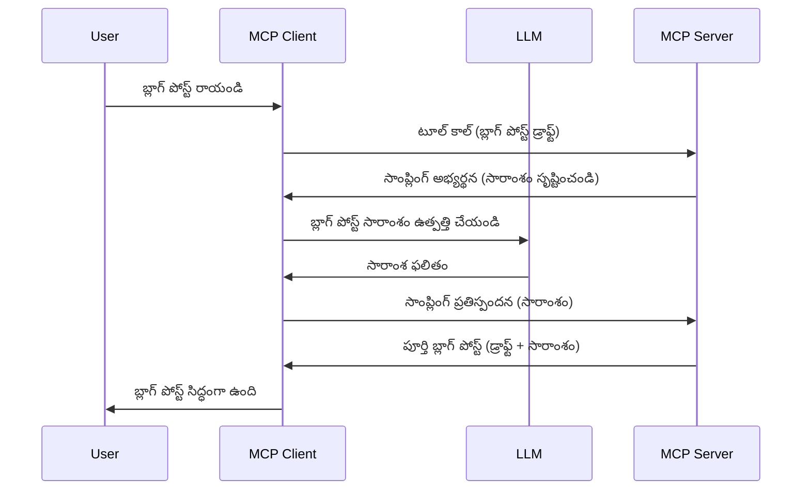

# శాంప్లింగ్ - క్లయింట్‌కు లక్షణాలను లేదా విధులను అప్పగించడం

ఎప్పుడైతే, మీరు MCP క్లయింట్ మరియు MCP సర్వర్ ఒక సాధారణ లక్ష్యాన్ని సాధించేందుకు కలిసి పనిచేయాల్సి ఉంటుంది. మీరు ఒక సందర్భంలో ఉంటారు, అక్కడ సర్వర్‌కు క్లయింట్ వద్ద ఉన్న LLM సహాయం అవసరం. ఇలాంటి పరిస్థితుల్లో, శాంప్లింగ్‌ను ఉపయోగించాలి.

కొన్ని వాడుక ఉదాహరణలను మరియు శాంప్లింగ్‌తో ఒక పరిష్కారాన్ని ఎలా నిర్మించాలో తెలుసుకుందాం.

## అవలోకనం

ఈ పాఠంలో, శాంప్లింగ్ ఎప్పుడు మరియు ఎక్కడ ఉపయోగించాలో మరియు దానిని ఎలా కాన్ఫిగర్ చేయాలో వివరించటం మేము లక్ష్యం.

## శిక్షణ లక్ష్యాలు

ఈ అధ్యాయంలో, మేము:

- శాంప్లింగ్ అంటే ఏమిటి మరియు ఎప్పుడు ఉపయోగించాలి అనే విషయాన్ని వివరించగలము.
- MCP లో శాంప్లింగ్‌ను ఎలా కాన్ఫిగర్ చేయాలో చూపించగలము.
- శాంప్లింగ్ యథార్థంలో ఎలా పనిచేస్తుందో ఉదాహరణలు అందించగలము.

## శాంప్లింగ్ అంటే ఏమిటి మరియు దానిని ఎందుకు ఉపయోగించాలి?

శాంప్లింగ్ అనేది ఒక పురోగతి లక్షణం, ఇది ఈ రీతిలో పనిచేస్తుంది:



### శాంప్లింగ్ అభ్యర్థన

సరే, ఇప్పుడు మనకు ఒక విశ్వసనీయ సందర్భం యొక్క సగం ఎత్తు చూపు ఉంది, మరి శాంప్లింగ్ అభ్యర్థన గురించి మాట్లాడుకుందాం, ఇది సర్వర్ క్లయింట్‌కు తిరిగి పంపుతుంది. JSON-RPC ఫార్మాట్లో ఇలాంటి అభ్యర్థన ఈ విధంగా కనిపించవచ్చు:

```json
{
  "jsonrpc": "2.0",
  "id": 1,
  "method": "sampling/createMessage",
  "params": {
    "messages": [
      {
        "role": "user",
        "content": {
          "type": "text",
          "text": "Create a blog post summary of the following blog post: <BLOG POST>"
        }
      }
    ],
    "modelPreferences": {
      "hints": [
        {
          "name": "claude-3-sonnet"
        }
      ],
      "intelligencePriority": 0.8,
      "speedPriority": 0.5
    },
    "systemPrompt": "You are a helpful assistant.",
    "maxTokens": 100
  }
}
```

ఇక్కడ కొన్ని విషయాలు విశేషంగా చెప్పదగినవి:

- Prompt, content -> text కింద ఉన్నది, ఇది మన ప్రాంప్ట్, ఇది LLM కోసం బ్లాగ్ పోస్ట్ కంటెంట్‌ను సారాంశం చేయమని సూచన.

- **modelPreferences**. ఈ విభాగం కేవలం ఒక కోరిక, LLM తో ఏ కాన్ఫిగరేషన్ ఉపయోగించాలో సిఫార్సు. వినియోగదారు వీటిని అనుసరించవచ్చు లేదా మార్చవచ్చు. ఇక్కడ మోడల్, వేగం మరియు బుద్ధిమత్తా ప్రాధాన్యతలకు సంబంధించిన సిఫార్సులు ఇచ్చివున్నాయి.
- **systemPrompt**, ఇది మీ సాధారణ సిస్టమ్ ప్రాంప్ట్, ఇది మీ LLM కి వ్యక్తిత్వాన్ని ఇస్తుంది మరియు మార్గదర్శక సూచనలు అందిస్తుంది.
- **maxTokens**, ఇది ఈ పని కోసం మీరు ఎన్ని టోకన్లను సిఫార్సు చేస్తారో చెప్పే మరో లక్షణం.

### శాంప్లింగ్ ప్రతిస్పందన

ఈ ప్రతిస్పందన MCP క్లయింట్ చివరికి MCP సర్వర్‌కి తిరిగి పంపే దేనూ, ఇది క్లయింట్ LLM ని పిలిచి, ఆ ప్రతిస్పందన కోసం వేచి, ఆ తర్వాత ఈ మెసేజ్‌ని నిర్మించడం ఫలితం. JSON-RPC లో ఇది ఈ విధంగా ఉంటుంది:

```json
{
  "jsonrpc": "2.0",
  "id": 1,
  "result": {
    "role": "assistant",
    "content": {
      "type": "text",
      "text": "Here's your abstract <ABSTRACT>"
    },
    "model": "gpt-5",
    "stopReason": "endTurn"
  }
}
```

ప్రతిస్పందన బ్లాగ్ పోస్ట్ యొక్క సారాంశం కావడం మనం అడిగినట్లు గమనించండి. అలాగే వినియోగదారు ఏమి వాడాలో మార్పు చేసుకున్నట్లు "claude-3-sonnet" పై "gpt-5" మోడల్ వాడటం కూడా గమనించండి. ఇది వినియోగదారు తన ఆలోచన మార్చుకోవచ్చని, మరియు మీ శాంప్లింగ్ అభ్యర్థన కేవలం సూచన మాత్రమే అని సూచిస్తుంది.

అలాగే మనం ముఖ్యమైన ప్రవాహాన్ని అర్థం చేసుకున్నాం, మరియు ఇది ఉపయోగకరమైన పని "బ్లాగ్ పోస్ట్ సృష్టి + సారాంశం" గా ఉందని. ఇప్పుడు ఇది పనిచేయడానికి మనం ఏమి చేయాలో చూద్దాం.

### సందేశ రకాలు

శాంప్లింగ్ సందేశాలు కేవలం టెక్స్ట్‌కి మాత్రమూ పరిమితమవ్వవు, మీరు చిత్రాలు మరియు ఆడియో కూడా పంపవచ్చు. JSON-RPC ఎలా భిన్నంగా ఉన్నదో చూద్దాం:

**టెక్స్ట్**

```json
{
  "type": "text",
  "text": "The message content"
}
```

**చిత్ర కంటెంట్**

```json
{
  "type": "image",
  "data": "base64-encoded-image-data",
  "mimeType": "image/jpeg"
}
```

**ఆడియో కంటెంట్**

```json
{
  "type": "audio",
  "data": "base64-encoded-audio-data",
  "mimeType": "audio/wav"
}
```

> NOTE: శాంప్లింగ్ పై మరింత విపులమైన సమాచారం కోసం, [ఖాతాదారుల అధికారిక డాక్స్](https://modelcontextprotocol.io/specification/2025-11-25/client/sampling) చూడండి

## క్లయింట్‌లో శాంప్లింగ్‌ను ఎలా కాన్ఫిగర్ చేయాలి

> గమనిక: మీరు కేవలం సర్వర్ రూపొందిస్తున్నట్లైతే, ఇక్కడ అధికంగా చేయాల్సిన పని లేదు.

క్లయింట్‌లో, ఈ క్రింది లక్షణాన్ని ఇలా పేర్కొనాలి:

```json
{
  "capabilities": {
    "sampling": {}
  }
}
```

ఈ లక్షణం మీ ఎంపిక చేసిన క్లయింట్ సర్వర్‌తో ప్రారంభంకాల్పనలో అట్టి విధంగా స్వీకరించబడుతుంది.

## శాంప్లింగ్ వాడకం ఉదాహరణ - బ్లాగ్ పోస్ట్ సృష్టి

మనము ఒక శాంప్లింగ్ సర్వర్ కోడింగ్ చేద్దాం, ఈ క్రింది మెట్లు చేయాల్సి ఉంటుంది:

1. సర్వర్ పై ఒక సాధనం సృష్టించండి.
1. ఆ సాధనం ఒక శాంప్లింగ్ అభ్యర్థన సృష్టించాలి.
1. ఆ సాధనం క్లయింట్ శాంప్లింగ్ అభ్యర్థనకు సమాధానం వచ్చే వరకు వేచివుండాలి.
1. అనంతరం సాధనం ఫలితం ఉత్పత్తి చేయాలి.

దశల వారీగా కోడ్ చూద్దాం:

### -1- సాధనం సృష్టించండి

**python**

```python
@mcp.tool()
async def create_blog(title: str, content: str, ctx: Context[ServerSession, None]) -> str:
    """Create a blog post and generate a summary"""

```

### -2- శాంప్లింగ్ అభ్యర్థన సృష్టించండి

మీ సాధనాన్ని ఈ క్రింది కోడ్‌తో విస్తరించండి:

**python**

```python
post = BlogPost(
        id=len(posts) + 1,
        title=title,
        content=content,
        abstract=""
    )

prompt = f"Create an abstract of the following blog post: title: {title} and draft: {content} "

result = await ctx.session.create_message(
        messages=[
            SamplingMessage(
                role="user",
                content=TextContent(type="text", text=prompt),
            )
        ],
        max_tokens=100,
)

```

### -3- ప్రతిస్పందన కోసం వేచి, సమాధానాన్ని తిరిగి ఇవ్వండి

**python**

```python
post.abstract = result.content.text

posts.append(post)

# పూర్తి ఉత్పత్తిని తిరిగి ఇవ్వండి
return json.dumps({
    "id": post.title,
    "abstract": post.abstract
})
```

### -4- పూర్తిగా కోడ్

**python**

```python
from starlette.applications import Starlette
from starlette.routing import Mount, Host

from mcp.server.fastmcp import Context, FastMCP

from mcp.server.session import ServerSession
from mcp.types import SamplingMessage, TextContent

import json


from uuid import uuid4
from typing import List
from pydantic import BaseModel


mcp = FastMCP("Blog post generator")

# app = FastAPI()

posts = []

class BlogPost(BaseModel):
    id: int
    title: str
    content: str
    abstract: str

posts: List[BlogPost] = []

@mcp.tool()
async def create_blog(title: str, content: str, ctx: Context[ServerSession, None]) -> str:
    """Create a blog post and generate a summary"""

    post = BlogPost(
        id=len(posts) + 1,
        title=title,
        content=content,
        abstract=""
    )

    prompt = f"Create an abstract of the following blog post: title: {title} and draft: {content} "

    result = await ctx.session.create_message(
        messages=[
            SamplingMessage(
                role="user",
                content=TextContent(type="text", text=prompt),
            )
        ],
        max_tokens=100,
    )

    post.abstract = result.content.text

    posts.append(post)

    # పూర్తి బ్లాగ్ పోస్ట్‌ను తిరిగి ఇవ్వండి
    return json.dumps({
        "id": post.title,
        "abstract": post.abstract
    })

if __name__ == "__main__":
    print("Starting server...")
    # mcp.run()
    mcp.run(transport="streamable-http")

# ఈ విధంగా యాప్‌ను నడపండి: python server.py
```

### -5- Visualization Studio కోడ్లో పరీక్షించటం

ఇది Visual Studio కోడ్లో పరీక్షించటానికి, క్రింది విధంగా చేయండి:

1. టర్మినల్‌లో సర్వర్ ప్రారంభించండి
1. *mcp.json*లో జోడించండి (మరియు అది ప్రారంభమై ఉండాలి) ఉదాహరణకి ఇలా:

   ```json
   "servers": {
      "blog-server": {
        "type": "http",
        "url": "http://localhost:8000/mcp"
      }
   }
   ```

1. ఒక ప్రాంప్ట్ టైప్ చేయండి:

   ```text
   create a blog post named "Where Python comes from", the content is "Python is actually named after Monty Python Flying Circus"
   ```

1. శాంప్లింగ్ జరగడానికి అనుమతించండి. మొదటి సారి ఈ పరీక్షనుంచి మీకు అదనపు డైలాగ్ చూపబడుతుంది, దానిని మీరు అంగీకరించాలి, అంత తర్వాత సాధారణ డైలాగ్ వస్తుంది మీరు సాధనం నడుపమని అడిగేటప్పుడు

1. ఫలితాలు పరిశీలించండి. ఫలితాలు GitHub Copilot చాట్‌లో అందంగా ప్రదర్శించబడతాయి, అలాగే మీరు రా JSON ప్రతిస్పందనను కూడా పరిశీలించవచ్చు.

**బోనస్**. Visual Studio కోడ్ టూలింగ్ శాంప్లింగ్‌కు గొప్ప మద్ధతు కలిగింది. మీరు ఇన్‌స్టాల్ చేసిన సర్వర్‌కి శాంప్లింగ్ యాక్సెస్‌ను ఈ కింది విధంగా కాన్ఫిగర్ చేయవచ్చు:

1. ఎక్స్‌టెన్షన్ విభాగానికి నావిగేట్ చేయండి.
1. "MCP SERVERS - INSTALLED" విభాగంలో మీ ఇన్‌స్టాల్ చేసిన సర్వర్ కోసం కాగ్ ఐకాన్ ఎంచుకోండి.
1. "Configure Model Access" ఎంచుకోండి, ఇక్కడ మీరు GitHub Copilot శాంప్లింగ్ చేయేప్పుడు ఉపయోగించగల మోడల్స్ ఎంచుకోవచ్చు. "Show Sampling requests" ద్వారా ఇటీవల జరిగిన శాంప్లింగ్ అభ్యర్థనలన్నీ చూడవచ్చు.

## అసైన్మెంట్

ఈ అసైన్మెంట్‌లో, మీరు కొంత భిన్నమైన శాంప్లింగ్, అంటే ఒక శాంప్లింగ్ ఇంటిగ్రేషన్ నిర్మించబడాలి, ఇది ఉత్పత్తి వివరణ ఉత్పత్తి చేయడం సపోర్ట్ చేస్తుంది. ఇక్కడ మీ కధనం:

**సన్నివేశం**: ఇ-కామర్స్ బ్యాక్ ఆఫీస్ ఉద్యోగికి సహాయం కావాలి, ఉత్పత్తి వివరణలు జనరేట్ చేయడంలో చాలా సమయం పోతోంది. అందువలన మీరు ఒక పరిష్కారాన్ని నిర్మించాలి, అందులో మీరు "create_product" అనే సాధనం పిలవాలి, దీనిలో "title" మరియు "keywords" ఆర్గుమెంట్లుగా ఉంటాయి, ఇది పూర్తి ఉత్పత్తిని తయారు చేస్తుంది, అందులో "description" ఫీల్డ్ ఉంటుంది, అది క్లయింట్ LLM ద్వారా నింపబడాలి.

TIP: ముందుగా నేర్చుకున్న దానిని ఉపయోగించి ఈ సర్వర్ మరియు దాని సాధనాన్ని ఒక శాంప్లింగ్ అభ్యర్థనతో నిర్మించండి.

## పరిష్కారం

[Solution](./solution/README.md)

## ప్రధాన అంశాలు

శాంప్లింగ్ అనేది ఒక శక్తివంతమైన లక్షణం, ఇది సర్వర్‌కు LLM సహాయం కావాలనుకుంటే పనులను క్లయింట్‌కి అప్పగించేందుకు అనుమతిస్తుంది.

## తదుపరి

- [అధ్యాయం 4 - వాస్తవిక అమలు](../../04-PracticalImplementation/README.md)

---

<!-- CO-OP TRANSLATOR DISCLAIMER START -->
**అస్వీకరణ**:
ఈ పత్రం AI అనువాద సేవ [Co-op Translator](https://github.com/Azure/co-op-translator) ఉపయోగించి అనువదించబడింది. మేము ఖచ్చితత్వానికి ప్రయత్నిస్తున్నప్పటికీ, ఆటోమేటెడ్ అనువాదాలు తప్పులు లేదా అసమగ్రతలను కలిగి ఉండవచ్చు. దాని స్వదేశ భాషలో ఉన్న అసలు పత్రాన్ని అధికారం కలిగిన మూలంగా పరిగణించాలి. కీలకమైన సమాచారం కోసం, ప్రొఫెషనల్ మానవ అనువాదాన్ని సిఫారసు చేస్తాము. ఈ అనువాదం ఉపయోగం వల్ల కలిగే ఏవైనా అపార్థాలు లేదా తప్పుదారులు కోసం మేము బాధ్యత వహించము.
<!-- CO-OP TRANSLATOR DISCLAIMER END -->