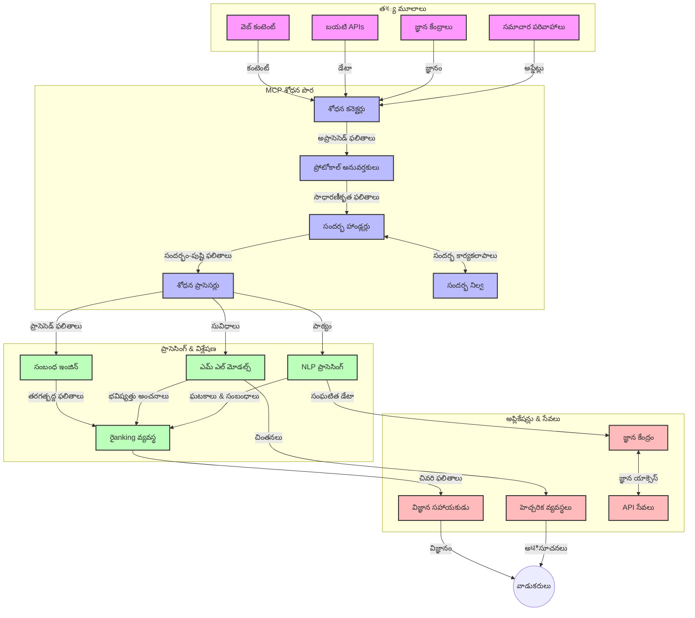
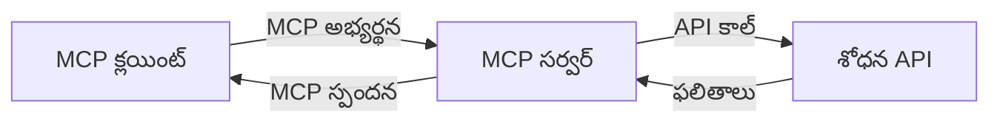
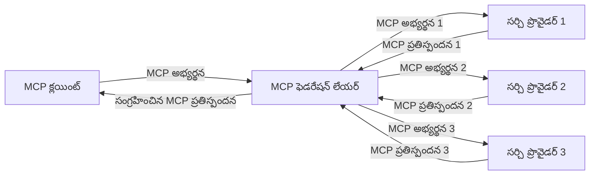
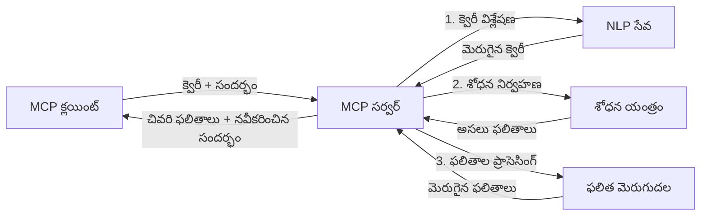

# రియల్-టైమ్ వెబ్ సెర్చ్ కోసం మోడల్ కాంటెక్స్ట్ ప్రోటోకాల్

## సమీక్ష

ఇప్పటి సమాచారం ఆధారిత పరిసరాల్లో రియల్-టైమ్ వెబ్ సెర్చ్ అవసరం ప్రారంభమైంది, యాప్‌లు ఇంటర్నెట్ అంతటా తాజా సమాచారానికి తక్షణమైన ప్రాప్యత అవసరమవుతుంది, సంబంధిత మరియు సమయోచిత ప్రతిస్పందనలను అందించుటకు. మోడల్ కాంటెక్స్ట్ ప్రోటోకాల్ (MCP) ఈ రియల్-టైమ్ సెర్చ్ ప్రక్రియలను ఆప్టిమైజ్ చేయడంలో ఒక ప్రధాన పురోగతిని సూచిస్తుంది, సెర్చ్ సామర్థ్యాన్ని మెరుగుపరచడం, కాంటెక్స్ట్ సమగ్రతను నిర్వహించడం, మరియు సమగ్ర వ్యవస్థ పనితీరును అందించడం.

ఈ మాడ్యూల్ MCP ఎలా రియల్-టైమ్ వెబ్ సెర్చ్‌ను మారుస్తుందో, AI మోడల్స్, సెర్చ్ ఇంజిన్లు మరియు యాప్‌ల మధ్య కాంటెక్స్ట్ నిర్వహణకు ప్రమాణీకృత దృష్టికోణాన్ని అందించడం ద్వారా పరిశీలిస్తుంది.

### మీరు నేర్చుకునేది

ఈ సమగ్ర మార్గదర్శకంలో, మీరు తెలుసుకుంటారు:

- MCP AI మోడల్స్ మరియు రియల్-టైమ్ వెబ్ సెర్చ్ సామర్థ్యాల మధ్య సజావుగా సంభందం కలిగించటం ఎలా చేస్తుందో
- MCPతో సమర్థవంతమైన మరియు స్కేలబుల్ సెర్చ్ పరిష్కారాలు అమలు చేయడానికి ఆర్కిటెక్చరల్ నమూనాలు
- అనేక ప్రశ్నలు మరియు పరస్పర చర్యలలో సెర్చ్ కాంటెక్స్ట్ ఎలా సంరక్షించుకోవాలో సాంకేతిక విధానాలు
- వివిధ సెర్చ్ సందర్భాలలో Python మరియు JavaScriptలో ప్రాక్టికల్ కోడ్ అమలు
- MCP ఆధారిత సెర్చ్ వ్యవస్థల్లో ప్రాసంగికత, తాజాదనం, మరియు పనితీరు మధ్య సంతులనం సాధించే పద్ధతులు

## రియల్-టైమ్ వెబ్ సెర్చ్ పరిచయం

రియల్-టైమ్ వెబ్ సెర్చ్ అనేది టెక్నాలజీ మనుగడ, దీని ద్వారా వెబ్ ఆధారిత సమాచారాన్ని ప్రచురించబడిన వెంటనే లేదా అప్‌డేట్ అయిన వెంటనే నిరంతరం ప్రశ్నించడం, ప్రాసెసింగ్ చేయడం, మరియు విశ్లేషించడం జరుగుతుంది, వ్యవస్థలకు తక్కువ ఆలస్యం లో తాజా మరియు సంబంధిత సమాచారాన్ని అందించడం సాధ్యం అవుతుంది. సాంప్రదాయ సెర్చ్ వ్యవస్థాలు గంటలు లేదా రోజులు పాతుదైన ఇండెక్స్డ్ డేటాపై ఆధారపడి పనిచేసే విషయంలో, రియల్-టైమ్ సెర్చ్ వెబ్ వేదికల నుండి ప్రత్యక్ష డేటాను ప్రాసెస్ చేసి ఆన్‌లైన్ కంటెంట్ ప్రస్తుత స్థితిని ప్రతిబింబించే సమాచారం మరియు వివరాలను అందిస్తుంది.

### రియల్-టైమ్ వెబ్ సెర్చ్ యొక్క ప్రధాన ఆలోచనలు:

- **నిరంతర ప్రశ్న ప్రక్రియ**: సెర్చ్ ప్రశ్నలు నిరంతరం మరింత తాజాగా అప్‌డేట్ అయ్యే డేటా మూలాలపై ప్రాసెస్ చేయబడతాయి
- **తాజాదన ప్రాధాన్యత**: వ్యవస్థలు తాజా సమాచారానికి ప్రాధాన్యత ఇస్తాయి
- **సంబంధిత సంతులనం**: సంబంధితత మరియు తాజాదనం మధ్య భద్రత
- **విస్తృత ఆర్కిటెక్చర్**: వ్యవస్థలు భిన్నమైన ప్రశ్న లోడ్లు మరియు డేటా పరిమాణాలు నిర్వహించగలగాలి
- **సందర్భాత్మక అవగాహన**: అనేక సెర్చ్ దశలలో వినియోగదారు కాంటెక్స్ట్ నిర్వహణ అనివార్యం, అర్ధవంతమైన ఫలితాలకు
- **గత ఫలితాల ఆధారంగా ప్రశ్నల మార్పు**: కాంటెక్స్ట్ మరియు గత ఫలితాల ఆధారంగా ప్రశ్నలను సవరణ చేయడం
- **బహుళ మూలం సమాప‌న**: అనేక సెర్చ్ ప్రొవైడర్లు మరియు వెబ్ స్రోতాల నుండి ఫలితాలను కలపటం
- **సామాంతర అవగాహన**: కీవర్డ్ల కంటే అర్థం ఆధారంగా ప్రశ్నలు మరియు కంటెంట్ ప్రాసెస్ చేయడం
- **రియల్-టైమ్ ర్యాంకింగ్**: కొత్త సమాచారం అందుబాటులోకి వచ్చిన కొద్దీ ఫలితాల ర్యాంకులను సత్వర మార్పు

### మోడల్ కాంటెక్స్ట్ ప్రోటోకాల్ మరియు రియల్-టైమ్ వెబ్ సెర్చ్

మోడల్ కాంటెక్స్ట్ ప్రోటోకాల్ (MCP) రియల్-టైమ్ వెబ్ సెర్చ్ వాతావరణాల్లో కొన్ని ముఖ్యమైన సవాళ్లను పరిష్కరిస్తుంది:

1. **సెర్చ్ కాంటెక్స్ట్ సంరక్షణ**: MCP పంపిణీచేయబడిన సెర్చ్ భాగాల దాదాపు కాంటెక్స్ట్ ఎలా నిర్వహించాలో ప్రమాణీకరించి, AI మోడల్స్ మరియు ప్రాసెసింగ్ నోడ్లు సంబంధిత ప్రశ్న చరిత్ర మరియు వినియోగదారు అభిరుచులకు ప్రాప్యం కల్పిస్తుంది.

2. **సమర్థవంతమైన ప్రశ్న నిర్వహణ**: కాంటెక్స్ట్ ప్రసారానికి నిర్మిత యంత్రాంగాలను అందించడం ద్వారా MCP ప్రతి సెర్చ్ దశలో కాంటెక్స్ట్ పునరావృతం చేసే ఓవరహెడ్‌ను తగ్గిస్తుంది.

3. **అంతర కార్యకలాప సామర్థ్యం**: MCP విభిన్న సెర్చ్ సాంకేతికతలు మరియు AI మోడల్స్ మధ్య కాంటెక్స్ట్ భాగస్వామ్యాన్ని సాధించడానికి సాధారణ భాషని సృష్టిస్తుంది, మరింత సౌలభ్యం మరియు విస్తరణాత్మక ఆర్కిటెక్చర్‌లను అందిస్తుంది.

4. **సెర్చ్-ఆప్టిమైజ్డ్ కాంటెక్స్ట్**: MCP అమలు ప్రదర్శనలు ఏ కాంటెక్స్ట్ అంశాలు సమర్థవంతమైన సెర్చ్ కోసం అత్యంత సంబంధితమో ప్రాధాన్యం ఇవ్వవచ్చు, పనితీరు మరియు ఖచ్చితత్వం రెండింటికీ అనుకూలత.

5. **అనుకూలిత సెర్చ్ ప్రాసెసింగ్**: MCP ద్వారా సరైన కాంటెక్స్ట్ నిర్వహణతో, సెర్చ్ వ్యవస్థలు అభివృద్ధి చెందుతున్న వినియోగదారు అవసరాలు మరియు సమాచార పరిస్థితుల ఆధారంగా ప్రాసెసింగ్‌ను డైనమిక్‌గా సర్దుబాటు చేయగలవు.

సమకాలీన అప్లికేషన్లలో వార్తలు సమాహరణ నుండి పరిశోధనా సహాయకులు వరకు MCP మరియు వెబ్ సెర్చ్ సాంకేతికతల ఇంటిగ్రేషన్ మరింత తెలివైన, కాంటెక్స్ట్-సమర్థవంతమైన సెర్చ్‌ను సాధ్యంచేస్తుంది, వాడుకరి పరస్పర చర్యలుతో పాటు ప్రస్తుత సంబంధిత ఫలితాలను పెంచుతుంది.

## నేర్చుకునే లక్ష్యాలు

ఈ పాఠం ముగింపు నాటికి, మీరు చేయగలుగుతారు:

- రియల్-టైమ్ వెబ్ సెర్చ్ ప్రాథ‌మికాలు మరియు ఆధునిక అనువర్తనాల్లో దీని సవాళ్లను అర్థం చేసుకోవటం
- మోడల్ కాంటెక్స్ట్ ప్రోటోకాల్ (MCP) రియల్-టైమ్ వెబ్ సెర్చ్ సామర్థ్యాలను ఎలా మెరుగుపరుస్తుందో వివరణ చేయటం
- ప్రముఖ ఫ్రేమ్‌వర్క్‌లు మరియు APIలను ఉపయోగించి MCP ఆధారిత సెర్చ్ పరిష్కారాలను అమలు చేయటం
- MCPతో స్కేలబుల్, అధిక పనితీరు సెర్చ్ ఆర్కిటెక్చర్‌లను రూపకల్పన చేసి విడుదల చేయటం
- సేమాంటిక్ సెర్చ్, పరిశోధన సహాయం, మరియు AI-అద్భుత బ్రౌజింగ్ వంటి వివిధ ఉపయ‌ోగాల్లో MCP ఆలోచనలను వర్తించటం
- MCP ఆధారిత సెర్చ్ సాంకేతికతల్లో ఎదుగుతున్న ధోరణులు మరియు భవిష్యత్ ఆవిష్కరణలను అంచనా వేయటం
- వినియోగదారు పరస్పర చర్యల నుండి నేర్చుకునే కాంటెక్స్ట్-అవగాహన సెర్చ్ వ్యవస్థలను అభివృద్ధి చేయటం
- ప్రమాణీకృత MCP ప్రోటోకాల్‌లను ఉపయోగించి AI సహాయులలో వెబ్ సెర్చ్ సామర్థ్యాలను ఇంటిగ్రేట్ చేయటం
- కాంటెక్స్ట్ ఆధారంగా దశల వారీగా ఫలితాలను మెరుగుపర్చే బహుళ దశల సెర్చ్ పైప్లైన్లను సృష్టించడం
- సమగ్ర కాంటెక్స్ట్ అవగాహనను భద్రపరచడంతో పాటు సెర్చ్ పనితీరును ఆప్టిమైజ్ చేయటం

### నిర్వచనం మరియు ప్రాముఖ్యత

రియల్-టైమ్ వెబ్ సెర్చ్ అనేది వెబ్ ఆధారిత సమాచారాన్ని నిరంతరంగా ప్రశ్నించి, పొందుతూ, తక్కువ ఆలస్యం లో అందించడాన్ని కలిగి ఉంటుంది. సాంప్రదాయ సెర్చ్ ఇంజిన్లు పర్యాయంగా వెబ్‌ను క్రాల్ చేసి ఇండెక్స్ చేస్తే, రియల్-టైమ్ సెర్చ్ సమాచారం అందుబాటులోకి వచ్చిన వెంటనే అందించడంపై దృష్టి పెట్టింది, దీని వల్ల అత్యంత తాజా కంటెంట్‌కు తక్షణ ప్రాప్యత సాధ్యమవుతుంది.

రియల్-టైమ్ వెబ్ సెర్చ్ ముఖ్య లక్షణాలు:

- **తాజాదనం**: తాజా కంటెంట్ మరియు అప్‌డేట్లకు ప్రాధాన్యత
- **నిరంతర ప్రాసెసింగ్**: కొత్త సమాచారానికి నిరంతర పర్యవేక్షణ
- **ప్రశ్నల సవరణ**: కాంటెక్స్ట్ మరియు ఫీడ్బ్యాక్ ఆధారంగా సెర్చ్ ప్రశ్నలను మెరుగుపరచడం
- **తక్షణ డెలివరీ**: తక్కువ ఆలస్యంతో సెర్చ్ ఫలితాలు అందించడం
- **కాంటెక్స్ట్ నిలుపుదల**: మెరుగైన సంబంధితత కోసం గత ప్రశ్నలపై ఆధారపడి నిర్మాణం

### సాంప్రదాయ వెబ్ సెర్చ్‌లో సవాళ్లు

సాంప్రదాయ వెబ్ సెర్చ్ వర్తింపులో రియల్-టైమ్ పరిస్థితుల్లో అనేక పరిమితులు ఉన్నాయి:

1. **కాంటెక్స్ట్ విభజన**: అనేక ప్రశ్నల మధ్య సెర్చ్ కాంటెక్స్ట్ నిర్వహించడం కష్టం
2. **సమాచార తాజాదనం**: అత్యంత తాజా సమాచారాన్ని అందుకోవడం మరియు ప్రాధాన్యత ఇవ్వడంలో సవాళ్లు
3. **ఇంటిగ్రేషన్ సంక్లిష్టత**: సెర్చ్ వ్యవస్థలు మరియు యిల్లింటివేశన్స్ మధ్య అంతరక్రియ తగిలించే సమస్యలు
4. **ఆలస్యం సమస్యలు**: సమగ్ర సెర్చ్ మరియు స్పందన సమయ అవసరాలను సమతుల్యం చేయడం
5. **సంబంధిత సర్దుబాటు**: తాజాదనను ప్రాధాన్యం ఇచ్చేటప్పుడు ఖచ్చితత్వం మరియు సంబంధితతను నిర్ధారించడం

## సెర్చ్ కోసం మోడల్ కాంటెక్స్ట్ ప్రోటోకాల్ (MCP) అర్థం చేసుకోవడం

### సెర్చ్ కాంటెక్స్ట్‌లలో MCP అంటే ఏమిటి?

మోడల్ కాంటెక్స్ట్ ప్రోటోకాల్ (MCP) అనే ప్రోటోకాల్ AI మోడల్స్ మరియు అప్లికేషన్ల మధ్య సమర్థవంతమైన పరస్పర చర్యకు ప్రమాణీకరించిన కమ్యూనికేషన్ ప్రోటోకాల్. రియల్-టైమ్ వెబ్ సెర్చ్ సందర్భంలో, MCP క్రింద ఇలా వ్యవహరిస్తుంది:

- ప్రశ్నల సెట్‌లలో సెర్చ్ కాంటెక్స్ట్‌ను నిలుపుకోవటం
- సెర్చ్ ప్రశ్నలు మరియు ఫలితాల ఫార్మాట్లను ప్రమాణీకరించటం
- సెర్చ్ పారామీటర్ల మరియు ఫలితాల ప్రసారాన్ని ఆప్టిమైజ్ చేయడం
- మోడల్స్ మరియు సెర్చ్ ఇంజిన్ల మధ్య సంభాషణను మెరుగుపరచటం

### ముఖ్యమైన భాగాలు మరియు నిర్మాణం

రియల్-టైమ్ వెబ్ సెర్చ్ కోసం MCP ఆర్కిటెక్చర్ కింది కీలక భాగాలున్నది:

1. **ప్రశ్న కాంటెక్స్ట్ హ్యాండ్లర్లు**: అనేక ప్రశ్నలలో సెర్చ్ కాంటెక్స్ట్‌ను నిర్వహించడం
2. **సెర్చ్ ప్రాసెసర్లు**: కాంటెక్స్ట్-అవగాహన సాంకేతికతలతో సెర్చ్ అభ్యర్థనలను ప్రాసెస్ చేయడం
3. **ప్రోటోకాల్ అడాప్టర్లు**: విభిన్న సెర్చ్ APIల మధ్య కాంటెక్స్ట్ నిలుపుతూ మార్పిడి చేయడం
4. **కాంటెక్స్ట్ స్టోర్**: సెర్చ్ చరిత్ర మరియు అభిరుచులను సమర్థవంతంగా నిల్వ చేసి తిరిగి పొందటం
5. **సెర్చ్ కనెక్టర్లు**: వివిధ సెర్చ్ ఇంజిన్లకు మరియు వెబ్ APIలకుకు కనెక్ట్ అవడం



### MCP రియల్-టైమ్ వెబ్ సెర్చ్‌ను ఎలా మెరుగుపరుస్తుంది

MCP సాంప్రదాయ వెబ్ సెర్చ్ సవాళ్లను ఇలా పరిష్కరించబడుతుంది:

- **కాంటెక్స్ట్ నిరంతరత్వం**: మొత్తం సెర్చ్ సెషన్ అంతటా ప్రశ్నల మధ్య సంబంధాలు నిలుపుకోవడం
- **ఆప్టిమైజ్డ్ ప్రసారం**: తెలివైన కాంటెక్స్ట్ నిర్వహణ ద్వారా సెర్చ్ పారామీటర్లలో తగ్గింపు
- **ప్రమాణీకృత ఇంటర్ఫేసులు**: సెర్చ్ భాగాలకు ఒకరెండు APIs అందించడం
- **తగ్గిన ఆలస్యం**: సమర్థవంతమైన కాంటెక్స్ట్ నిర్వహణ ద్వారా ప్రాసెసింగ్ ఓవర్‌హెడ్ తగ్గింపు
- **మెరుగైన ప్రాసంగికత**: అనేక ప్రశ్నలలో వినియోగదారు ఉద్దేశాలను నిలుపుకోవడం ద్వారా సెర్చ్ ప్రాసంగికత పెంపు

## ఇంటిగ్రేషన్ మరియు అమలు

రియల్-టైమ్ వెబ్ సెర్చ్ వ్యవస్థలు పనితీరు మరియు కాంటెక్స్ట్ సమగ్రత రెండింటినీ నిలుపుకోవటానికి కూటమీత నిర్మాణ రూపకల్పన మరియు అమలు అవసరం. మోడల్ కాంటెక్స్ట్ ప్రోటోకాల్ AI మోడల్స్ మరియు సెర్చ్ సాంకేతికతలను సమ్మిళితం చేయడానికి ప్రమాణీకృత పద్ధతిని అందిస్తుంది, మరింత పరిణతమైన, కాంటెక్స్ట్-అవగాహన సెర్చ్ పైప్లైన్లను సాధించడానికి.

### సెర్చ్ ఆర్కిటెక్చర్లు లో MCP ఇంటిగ్రేషన్ వెర్షన్

రియల్-టైమ్ వెబ్ సెర్చ్ పరిసరాల్లో MCPని అమలు చేయడంలో కింది కీలక అంశాలు ఉంటాయి:

1. **సెర్చ్ కాంటెక్స్ట్ శీరియలైజేషన్**: MCP సెర్చ్ అభ్యర్థనల్లో కాంటెక్స్ట్ సమాచారాన్ని సంకేతీకరించడానికి సమర్థవంతమైన యంత్రాంగాలను అందిస్తుంది, అవసరమైన కాంటెక్స్ట్ అభ్యర్థనతో పాటు ప్రాసెసింగ్ పైప్‌లైన్ పొడవుతో కలుసుకొని. దీనిలో సెర్చ్ సంబంధిత మెటాడేటా కోసం ప్రమాణీకృత శీరియలైజేషన్ ఫార్మాట్లు ఉంటాయి.

2. **స్టేట్‌ఫుల్ సెర్చ్ ప్రాసెసింగ్**: MCP సెర్చ్ దశల మధ్య కాంటెక్స్ట్ ప్రాతినిధ్యం స్థిరంగా ఉంచటం ద్వారా మరింత తెలివైన స్టేట్‌ఫుల్ ప్రాసెసింగ్ కి అనుమతిస్తుంది. ఇది పలు దశల సెర్చ్ పైప్లైన్లలో, కాంటెక్స్ట్ మెరుగుదల ఫలితాలను మెరుగుపరుస్తుంది.

3. **ప్రశ్న వ్యాప్తి మరియు మెరుగుదల**: MCP అమలు సెర్చ్ వ్యవస్థల్లో సేకరించిన కాంటెక్స్ట్ ఆధారంగా క్లిష్టమైన ప్రశ్న విస్తరణ మరియు మెరుగుదలలను సులభతరం చేస్తుంది, సెర్చ్ సెషన్ పురోగమనం వెంటనే ఫలితాలు మరింత సంబంధితంగా రూపాంతరం చేస్తుంది.

4. **ఫలితాల క్యాచింగ్ మరియు ప్రాధాన్యత ఇవ్వటం**: కాంటెక్స్ట్ నిర్వహణ ప్రమాణీకరణ ద్వారా MCP ఫలితాల క్యాచింగ్ మరియు ప్రాధాన్యతా క్రమాన్ని నిర్వహించడం సహాయపడుతుంది, భాగాలు అభివృద్ధి చెందుతున్న సెర్చ్ కాంటెక్స్ట్ ఆధారంగా సర్దుబాటు అవుతాయి.

5. **సెర్చ్ ఫెడరేషన్ మరియు సమాహరణ**: MCP కాంటెక్స్ట్ యొక్క నిర్మిత ప్రతిమలకు అనుగుణంగా అనేక బ్యాక్‌ఎండ్లపై క్లిష్టమైన సెర్చ్ ఫెడరేషన్ సులభతరం చేస్తుంది, విభిన్న మూలాల నుండి ఫలితాలను మరింత అర్థవంతమైన సమాహరణ పెంచుతుంది.

వివిధ సెర్చ్ సాంకేతికతలలో MCP అమలు కాంటెక్స్ట్ నిర్వహణకు యునిఫైడ్ అభిగమనం సృష్టిస్తుంది, అనుకూల ఇంటిగ్రేషన్ కోడ్ అవసరాన్ని తీసేస్తూ సెర్చ్ ప్రశ్నల్లో అర్థవంతమైన కాంటెక్స్ట్ నిలుపుకునే వ్యవస్థ సామర్థ్యాన్ని పెంచుతుంది.

### వివిధ వెబ్ సెర్చ్ అమలుల్లో MCP

ఈ ఉదాహరణలు ప్రస్తుతం ఉన్న MCP స్పెసిఫికేషన్‌ను అనుసరిస్తాయి, ఇది JSON-RPC ఆధారిత ప్రోటోకాల్ మరియు విశిష్టమైన ట్రాన్స్‌పోర్ట్ మెకానిజమ్స్‌ను కలిగి ఉంటుంది. ఈ కోడ్ ప్రదర్శన మీకు MCP ప్రోటోకాల్‌తో పూర్తి అనుకూలతను నిలుపుకుని కస్టమ్ సెర్చ్ ఇంటిగ్రేషన్లను ఎలా చేయాలో చూపుతుంది.

<details>
<summary>Generic Search APIతో Python అమలు</summary>

```python
import asyncio
import json
import aiohttp
from typing import Dict, Any, Optional, List
from contextlib import asynccontextmanager
from collections.abc import AsyncIterator

# ప్రామాణిక MCP లైబ్రరీలను దిగుమతి చేయండి
from mcp.client.session import ClientSession
from mcp.client.streamable_http import streamablehttp_client
from mcp.types import TextContent, CreateMessageRequestParams, CreateMessageResult
from mcp.server.fastmcp import FastMCP

# వెబ్ శోధన కోసం ఒక FastMCP సర్వర్ సృష్టించండి
search_server = FastMCP("WebSearch")

# వెబ్ శోధన ఆపరేషన్లను నిర్వహించడానికి క్లాస్
class WebSearchHandler:
    def __init__(self, api_endpoint: str, api_key: str):
        self.api_endpoint = api_endpoint
        self.api_key = api_key
        self.session = None
        
    async def initialize(self):
        """Initialize the HTTP session"""
        self.session = aiohttp.ClientSession(
            headers={"Authorization": f"Bearer {self.api_key}"}
        )
    
    async def close(self):
        """Close the HTTP session"""
        if self.session:
            await self.session.close()
            
    async def perform_search(self, query: str, max_results: int = 5, 
                           include_domains: List[str] = None, 
                           exclude_domains: List[str] = None,
                           time_period: str = "any") -> Dict[str, Any]:
        """Perform web search using the search API"""
        # శోధన పారామితులను నిర్మించండి
        search_params = {
            "q": query,
            "limit": max_results,
            "time": time_period
        }
        
        if include_domains:
            search_params["site"] = ",".join(include_domains)
            
        if exclude_domains:
            search_params["exclude_site"] = ",".join(exclude_domains)
        
        # శోధన అభ్యర్థనను నిర్వహించండి
        try:
            async with self.session.get(
                self.api_endpoint,
                params=search_params
            ) as response:
                if response.status != 200:
                    error_text = await response.text()
                    raise Exception(f"Search API error: {response.status} - {error_text}")
                
                search_data = await response.json()
                
                # API-స్పష్ట ప్రతిస్పందనను ప్రామాణిక ఫార్మాట్‌కు మార్చండి
                results = []
                for item in search_data.get("results", []):
                    results.append({
                        "title": item.get("title", ""),
                        "url": item.get("url", ""),
                        "snippet": item.get("snippet", ""),
                        "date": item.get("published_date", ""),
                        "source": item.get("source", "")
                    })
                
                return {
                    "query": query,
                    "totalResults": len(results),
                    "results": results
                }
        except Exception as e:
            print(f"Search API request error: {e}")
            raise

# శోధన హ్యాండ్లర్‌ను ప్రారంభించండి
search_handler = WebSearchHandler(
    api_endpoint="https://api.search-service.example/search",
    api_key="your-api-key-here"
)

# శోధన హ్యాండ్లర్‌ను నిర్వహించడానికి లైఫ్స్పాన్‌ను సెట్ చేయండి
@asyncio.asynccontextmanager
async def app_lifespan(server: FastMCP):
    """Manage application lifecycle"""
    await search_handler.initialize()
    try:
        yield {"search_handler": search_handler}
    finally:
        await search_handler.close()

# సర్వర్ కోసం లైఫ్స్పాన్‌ను సెట్ చేయండి
search_server = FastMCP("WebSearch", lifespan=app_lifespan)

# ఒక వెబ్ శోధన సాధనాన్ని నమోదు చేయండి
@search_server.tool()
async def web_search(query: str, max_results: int = 5, 
                   include_domains: List[str] = None,
                   exclude_domains: List[str] = None,
                   time_period: str = "any") -> Dict[str, Any]:
    """
    Search the web for information
    
    Args:
        query: The search query
        max_results: Maximum number of results to return (default: 5)
        include_domains: List of domains to include in search results
        exclude_domains: List of domains to exclude from search results
        time_period: Time period for results ("day", "week", "month", "any")
        
    Returns:
        Dictionary containing search results
    """
    ctx = search_server.get_context()
    search_handler = ctx.request_context.lifespan_context["search_handler"]
    
    results = await search_handler.perform_search(
        query=query,
        max_results=max_results,
        include_domains=include_domains,
        exclude_domains=exclude_domains,
        time_period=time_period
    )
    
    return results

# ఉదాహరణ క్లయింట్ వినియోగం
async def client_example():
    # Streamable HTTP ట్రాన్స్‌పోర్ట్ ఉపయోగించి శోధన సర్వర్‌కు కనెక్ట్ అవ్వండి
    async with streamablehttp_client("http://localhost:8000/mcp") as (read, write, _):
        async with ClientSession(read, write) as session:
            # కనెక్షన్‌ని ప్రారంభించండి
            await session.initialize()
            
            # web_search సాధనాన్ని పిలవండి
            search_results = await session.call_tool(
                "web_search", 
                {
                    "query": "latest developments in AI and Model Context Protocol",
                    "max_results": 5,
                    "time_period": "day",
                    "include_domains": ["github.com", "microsoft.com"]
                }
            )
            
            print(f"Search results: {search_results}")

# సర్వర్ నడపడానికి ఉదాహరణ
if __name__ == "__main__":
    # Streamable HTTP ట్రాన్స్‌పోర్ట్‌తో సర్వర్ నడపండి
    search_server.run(transport="streamable-http")
```
</details>

<details>
<summary>Browser-ఆధారిత సెర్చ్‌తో JavaScript అమలు</summary>

```javascript
// వెబ్ సెర్చ్ కోసం MCP సర్వర్ అమలు
import { McpServer, ResourceTemplate } from '@modelcontextprotocol/sdk/server/mcp.js';
import { StreamableHTTPServerTransport } from '@modelcontextprotocol/sdk/server/streamableHttp.js';
import { z } from 'zod';

// వెబ్ సెర్చ్ కోసం MCP సర్వర్ సృష్టించండి
const searchServer = new McpServer({
    name: "BrowserSearch",
    description: "A server that provides web search capabilities"
});

// సెర్చ్ సర్వీస్ క్లాస్
class SearchService {
    constructor(searchApiUrl, apiKey) {
        this.searchApiUrl = searchApiUrl;
        this.apiKey = apiKey;
    }

    async performSearch(parameters) {
        const {
            query = '',
            maxResults = 5,
            includeDomains = [],
            excludeDomains = [],
            timePeriod = 'any'
        } = parameters;
        
        // పారామితులతో సెర్చ్ URL ని తయారుచేయండి
        const url = new URL(this.searchApiUrl);
        url.searchParams.append('q', query);
        url.searchParams.append('limit', maxResults);
        url.searchParams.append('time', timePeriod);
        
        if (includeDomains.length > 0) {
            url.searchParams.append('site', includeDomains.join(','));
        }
        
        if (excludeDomains.length > 0) {
            url.searchParams.append('exclude_site', excludeDomains.join(','));
        }
        
        try {
            const response = await fetch(url.toString(), {
                method: 'GET',
                headers: {
                    'Authorization': `Bearer ${this.apiKey}`,
                    'Content-Type': 'application/json'
                }
            });
            
            if (!response.ok) {
                const errorText = await response.text();
                throw new Error(`Search API error: ${response.status} - ${errorText}`);
            }
            
            const searchData = await response.json();
            
            // API-ప్రత్యేక ప్రతిచర్యను సాధారణ ఫార్మాట్‌కి మార్చండి
            const results = searchData.results?.map(item => ({
                title: item.title || '',
                url: item.url || '',
                snippet: item.snippet || '',
                date: item.published_date || '',
                source: item.source || ''
            })) || [];
            
            return {
                query,
                totalResults: results.length,
                results
            };
        } catch (error) {
            console.error('Search API request error:', error);
            throw error;
        }
    }
}

// సెర్చ్ సర్వీస్‌ని ప్రారంభించండి
const searchService = new SearchService(
    'https://api.search-service.example/search',
    'your-api-key-here'
);

// సర్వర్ కోసం కాన్టెక్స్ట్ ప్రొవైడర్‌ని సెట్ చేయండి
searchServer.setContextProvider(() => {
    return {
        searchService
    };
});

// వెబ్ సెర్చ్ టూల్‌ని నమోదుచేయండి
searchServer.tool({
    name: 'web_search',
    description: 'Search the web for information',
    parameters: {
        type: 'object',
        properties: {
            query: {
                type: 'string',
                description: 'The search query'
            },
            maxResults: {
                type: 'integer',
                description: 'Maximum number of results to return',
                default: 5
            },
            includeDomains: {
                type: 'array',
                items: { type: 'string' },
                description: 'List of domains to include in search results'
            },
            excludeDomains: {
                type: 'array',
                items: { type: 'string' },
                description: 'List of domains to exclude from search results'
            },
            timePeriod: {
                type: 'string',
                description: 'Time period for results',
                enum: ['day', 'week', 'month', 'any'],
                default: 'any'
            }
        },
        required: ['query']
    },
    handler: async (params, context) => {
        const { searchService } = context;
        return await searchService.performSearch(params);
    }
});

// సెర్చ్ సర్వర్‌కి కనెక్ట్ అయ్యేందుకు ఉదాహరణ క్లయింట్ కోడ్
import { Client } from '@modelcontextprotocol/sdk/client/index.js';
import { StreamableHTTPClientTransport } from '@modelcontextprotocol/sdk/client/streamableHttp.js';

async function connectToSearchServer() {
    // సెర్చ్ సర్వర్‌కి కనెక్ట్ కావడం
    const transport = new StreamableHTTPClientTransport(
        new URL('http://localhost:8000/mcp')
    );
    
    const client = new Client({
        name: 'search-client',
        version: '1.0.0'
    });
    
    await client.connect(transport);
    
    // సెర్చ్ టూల్‌ని అమలు చేయండి
    const searchResults = await client.callTool({
        name: 'web_search',
        arguments: {
            query: 'Model Context Protocol implementation examples',
            maxResults: 10,
            timePeriod: 'week',
            includeDomains: ['github.com', 'docs.microsoft.com']
        }
    });
    
    console.log('Search results:', searchResults);
    
    // శుభ్రపరచడం
    await client.disconnect();
}

// సర్వర్‌ని ప్రారంభించండి
const transport = new StreamableHTTPServerTransport();
await searchServer.connect(transport);
console.log('Search server running at http://localhost:8000/mcp');

// వేరే ప్రాసెస్‌లో లేదా సర్వర్ ప్రారంభమైన తర్వాత
// connectToSearchServer().catch(console.error);
```
</details> 

## కోడ్ ఉదాహరణల కోసం బాధ్యతా వార్త

> **ముఖ్యమైన గమనిక**: దిగువ కోడ్ ఉదాహరణలు మోడల్ కాంటెక్స్ట్ ప్రోటోకాల్ (MCP)ను వెబ్ సెర్చ్ ఫంక్షనాలిటీతో ఎలా ఇంటిగ్రేట్ చేసుకోవచ్చో చూపిస్తాయి. అవి అధికారిక MCP SDK నమూనా మరియు నిర్మాణాలను అనుసరిస్తాయి కానీ విద్యా ప్రయోజనాల కోసం సరళీకృతం చేయబడ్డాయి.
> 
> ఈ ఉదాహరణలు ప్రదర్శిస్తాయి:
> 
> 1. **Python అమలు**: FastMCP సర్వర్ అమలు, ఇది వెబ్ సెర్చ్ సాధనాన్ని అందిస్తుంది మరియు బాహ్య సెర్చ్ APIకి కనెక్ట్ అవుతుంది. ఈ ఉదాహరణ సరి అయిన జీవనకాల నిర్వహణ, కాంటెక్స్ట్ హ్యాండ్లింగ్, మరియు సాధన అమలు MCP అధికారిక Python SDK ([https://github.com/modelcontextprotocol/python-sdk](https://github.com/modelcontextprotocol/python-sdk)) నమూనాలను అనుసరిస్తుంది. సర్వర్ గ్రహింపును మెరుగుపరిచిన Streamable HTTP ట్రాన్స్‌పోర్ట్‌ను ఉపయోగిస్తుంది, ఇది పూర్వపు SSE ట్రాన్స్‌పోర్ట్‌కు ప్రత్యామ్నాయం.
> 
> 2. **JavaScript అమలు**: MCP TypeScript SDK ([https://github.com/modelcontextprotocol/typescript-sdk](https://github.com/modelcontextprotocol/typescript-sdk)) నుంచీ FastMCP నమూనా ఉపయోగించి TypeScript/JavaScript అమలు, సరైన సాధన నిర్వచనాలతో మరియు క్లయింట్ కనెక్షన్లతో సెర్చ్ సర్వర్ క్రియేట్ చేయడం. ఇది సెషన్ నిర్వహణ మరియు కాంటెక్స్ట్ సంరక్షణకు తాజా సిఫారసు చేసిన నమూనాలను అనుసరిస్తుంది.
> 
> ఈ ఉదాహరణలకు Herstellung వాడకానికి అదనపు లోపాలు, సాక్ష్యపత్రాలు మరియు నిర్దిష్ట API ఇంటిగ్రేషన్ కోడ్ అవసరం. చూపించిన సెర్చ్ API ఎండ్పాయింట్లు (`https://api.search-service.example/search`) అంతర్గత placeholders మాత్రమే, వాటిని వాస్తవ సెర్చ్ సర్వీస్ ఎండ్పాయింట్లతో మార్చాలి.
> 
> పూర్తి అమలు వివరాలకు మరియు తాజా సాంకేతిక విధానాలకు [సంప్రదాయ MCP స్పెసిఫికేషన్](https://spec.modelcontextprotocol.io/) మరియు SDK డాక్యుమెంటేషన్‌ను చూడండి.

## ముఖ్యమైన ఆలోచనలు

### మోడల్ కాంటెక్స్ట్ ప్రోటోకాల్ (MCP) ఫ్రేమ్‌వర్క్

అంతస్తులో, మోడల్ కాంటెక్స్ట్ ప్రోటోకాల్ AI మోడల్స్, అప్లికేషన్లు, మరియు సేవల మధ్య కాంటెక్స్ట్ మార్పిడి కోసం ప్రమాణీకృత మార్గాన్ని అందిస్తుంది. రియల్-టైమ్ వెబ్ సెర్చ్‌లో, ఈ ఫ్రేమ్‌వర్క్ సమగ్ర, బహుళ-తిరుగుబాటు సెర్చ్ అనుభవాలను సృష్టించడానికి తలవిగా ఉంటుంది. ముఖ్య భాగాలు:

1. **క్లయింట్-సర్వర్ నిర్మాణం**: MCP సెర్చ్ క్లయింట్లు (అభ్యర్థనలు చేసే వారు) మరియు సెర్చ్ సర్వర్లు (పరిచయకర్తలు) మధ్య స్పష్టమైన వేరుచేత్నను స్థాపించి, విస్తృత అవతరణ నమూనాలకు అనుమతిస్తుంది.

2. **JSON-RPC కమ్యూనికేషన్**: ఈ ప్రోటోకాల్ JSON-RPCని మెసేజ్ మార్పిడి కోసం ఉపయోగిస్తుంది, దీని ద్వారా వెబ్ సాంకేతికతలకు అనుగుణంగా ఉంటుంది మరియు వేర్వేరు వేదికలపై సులభంగా అమలు చేయవచ్చు.

3. **కాంటెక్స్ట్ నిర్వహణ**: MCP అనేక పరస్పర చర్యల పొడుగున కాంటెక్స్ట్ నిర్వహణ, నవీకరణ, మరియు ప్రయోజనాన్ని నిర్వచించే నిర్మిత పద్ధతులను నిర్దేశిస్తుంది.

4. **సాధన నిర్వచనాలు**: సెర్చ్ సామర్థ్యాలను బాగా నిర్వచించిన పారామీటర్ల మరియు రిటర్న్ విలువలతో ప్రమాణికృత సాధనాలుగా ప్రదర్శిస్తుంది.

5. **స్ట్రీమింగ్ మద్దతు**: ఈ ప్రోటోకాల్ ఫలితాలను పటిమతో స్ట్రీమ్ చేయడాన్ని మద్దతు ఇస్తుంది, ఇది కొత్త సమాచారం దశలవారీగా అందజేయబడే రియల్-టైమ్ సెర్చ్‌కు అవసరం.

### వెబ్ సెర్చ్ ఇంటిగ్రేషన్ నమూనాలు

MCPని వెబ్ సెర్చ్‌తో ఏకీకృతం చేయగలిగేటప్పుడు, కొన్ని నమూనాలు కనిపిస్తాయి:

#### 1. ప్రత్యక్ష సెర్చ్ ప్రొవైడర్ ఇంటిగ్రేషన్


  
ఈ నమూనాలో, MCP సర్వర్ ఒకటి లేదా ఒక కంటే ఎక్కువ సెర్చ్ APIలతో నేరుగా ఇంటరాక్ట్ చేస్తుంది, MCP అభ్యర్థనలను API నిర్దిష్ట కాల్‌లుగా మారుస్తూ ఫలితాలను MCP ప్రతిస్పందనలుగా ఫార్మాట్ చేస్తుంది.

#### 2. కాంటెక్స్ట్ సంరక్షణతో ఫెడరేటెడ్ సెర్చ్


  
ఈ నమూనా మల్టిపుల్ MCP అనుకూల సెర్చ్ ప్రొవైడర్ల మధ్య సెర్చ్ ప్రశ్నల పంపిణీ చేస్తూ, ప్రతి ఒక్కటి వివిధ కంటెంట్ లేదా సెర్చ్ సామర్థ్యాలలో ప్రత్యేకత కలిగి ఉండవచ్చు, ఒకైక కాంటెక్స్ట్ నిలుపుకొని పనిచేస్తుంది.

#### 3. కాంటెక్స్ట్-మెరుగైన సెర్చ్ చైన్


  
ఈ నమూనాలో, సెర్చ్ ప్రక్రియ అనేక దశలుగా విడగొట్టి, ప్రతి దశలో కాంటెక్స్ట్ మెరుగుపర్చబడుతుంది, దాంతో దశలవారీగా మరింత సంబంధిత ఫలితాలు వస్తాయి.

### సెర్చ్ కాంటెక్స్ట్ భాగాలు

MCP ఆధారిత వెబ్ సెర్చ్ లో కాంటెక్స్ట్ సాధారణంగా:

- **ప్రశ్న చరిత్ర**: సెషన్‌లో గత సెర్చ్ ప్రశ్నలు
- **వినియోగదారు అభిరుచులు**: భాష, ప్రాంతం, సేఫ్ సెర్చ్ సెట్టింగ్స్
- **పరస్పర చర్య చరిత్ర**: ఏ ఫలితాలను క్లిక్ చేసారు, ఫలితాలపై గడిపిన సమయం
- **సెర్చ్ పారామీటర్లు**: ఫిల్టర్లు, సార్ట్ ఆర్డర్లు, మరియు ఇతర సెర్చ్ మార్పులు
- **డొమైన్ పరిజ్ఞానం**: సెర్చ్‌కు సంబంధించి విషయం స్థాయి కాంటెక్స్ట్
- **కాలబద్ధ కాంటెక్స్ట్**: సమయ ఆధారిత సంబంధిత అంశాలు
- ** మూల అభిరుచులు**: నమ్మకమైన లేదా ఇష్టమైన సమాచారం మూలాలు

## ఉపయోగాలు మరియు అనువర్తనాలు

### పరిశోధన మరియు సమాచారం సమీకరణ

MCP పరిశోధనా వర్క్‌ఫ్లోలను మెరుగుపరుస్తుంది:

- సెర్చ్ సెషన్‌లలో పరిశోధన కాంటెక్స్ట్ నిలుపుకోవడం
- క్లిష్టమైన, కాంటెక్స్ట్ అనుగుణమైన ప్రశ్నలను ప్రేరేపించడం
- బహుళ మూలాల సెర్చ్ ఫెడరేషన్ మద్దతు
- సెర్చ్ ఫలితాల నుండి జ్ఞాన ఆహరణ సౌకర్యం

### రియల్-టైమ్ వార్తలు మరియు ధోరణుల పర్యవేక్షణ

MCP ఆధారిత సెర్చ్ వార్తల పర్యవేక్షణకు లాభాలు అందిస్తుంది:

- కనిష్ట రియల్-టైమ్ లో పెరుగుతున్న వార్త కథనాల కనుగోళ్లు
- సంబంధిత సమాచారానికి కాంటెక్స్ట్ ఆధారిత ఫిల్టరింగ్
- బహుళ మూలాలపై విషయం మరియు ఏజెంట్ ట్రాకింగ్
- వినియోగదారుల కాంటెక్స్ట్ ఆధారంగా వ్యక్తిగత వార్త అలర్ట్లు

### AI-ఉత్ప్రేరక బ్రౌజింగ్ మరియు పరిశోధన

MCP AI-ఉత్ప్రేరక బ్రౌజింగ్ కోసం కొత్త అవకాశాలు సృష్టిస్తుంది:

- ప్రస్తుత బ్రౌజర్ క్రియాశీలత ఆధారంగా కాంటెక్స్ట్-ఆధారిత సెర్చ్ సూచనలు
- వెబ్ సెర్చ్‌ను LLM-ఎన్నిపొందిన సహాయకులతో సజావుగా అనుసంధానం
- కాంటెక్స్ట్ నిలుపుదలతో బహుళ తిరుగుబాటు సెర్చ్ మెరుగుదలు
- ఫ్యాక్ట్‌-చెకింగ్ మరియు సమాచారం ధృవీకరణను అభివృద్ధి

## భవిష్యత్ ధోరణులు మరియు ఆవిష్కరణలు

### వెబ్ సెర్చ్‌లో MCP అభివృద్ధి

భవిష్యత్‌లో MCP ఈ ప్రాంతాలను పరిష్కరించడానికి అభివృద్ధి చెందుతుందని మేము ఆశిస్తున్నాము:
- **బహుభాషా శోధన**: కంటెంట్‌ను నిలిపి పెట్టేటట్లుగా పాఠ్యం, చిత్రం, ఆడియో మరియు వీడియో శోధనలను సమన్వయ పరిచడం  
- **పరిధివిహీన శోధన**: పంపిణీ మరియు సమాఖ్యిత శోధన వ్యవస్థలను మద్దతు ఇవ్వడం  
- **శోధన గోప్యత**: సందర్భాధారిత గోప్యత-రక్షించే శోధన యంత్రాంగాలు  
- **విచారణ అర్థంపరచడం**: సహజ భాష శోధన ప్రశ్నల లోతైన సారాంశ విశ్లేషణ  

### సాంకేతికతలో సంభావ్య అభివృద్ధులు

MCP శోధన భవిష్యత్తును రూపొందించే ఉద్భవించే సాంకేతికతలు:

1. **న్యూరల్ శోధన నిర్మాణాలు**: MCP కోసం ఎంబెడింగ్-ఆధారిత శోధన వ్యవస్థలు  
2. **వ్యతిరేక శోధన సందర్భం**: వ్యక్తిగత వినియోగదారు శోధన శైలులను కాలక్రమంలో నేర్చుకోవడం  
3. **జ్ఞాన గ్రాఫ్ సమన్వయం**: డొమైన్-ప్రత్యేక జ్ఞాన గ్రాఫ్లచే అభివృద్ధిచేసిన సందర్భాధారిత శోధన  
4. **క్రాస్-మోడల్ సందర్భం**: వివిధ శోధన విధానాలకు మధ్య సందర్భాన్ని నిలుపుకొనడం  

## అనుభవ శిక్షణ వ్యాయామాలు

### వ్యాయామం 1: ప్రాథమిక MCP శోధన పైప్‌లైన్ ఏర్పాటు

ఈ వ్యాయామంలో మీరు నేర్చుకుంటారు:  
- ప్రాథమిక MCP శోధనావస్థను కాన్ఫిగర్ చేయడం  
- వెబ్ శోధన కోసం సందర్భ హ్యాండ్లర్లను అమలు చేయడం  
- శోధన పునరావృతాల మధ్య సందర్భ సంరక్షణను పరీక్షించి నిర్ధారించడం  

### వ్యాయామం 2: MCP శోధనతో పరిశోధనా సహాయకుడు సృష్టించడం

క్రింది పనులను చేయగల పూర్తి అప్లికేషన్ సృష్టించండి:  
- సహజ భాష పరిశోధనా ప్రశ్నలను ప్రాసెస్ చేయడం  
- సందర్భాధారిత వెబ్ శోధనలను చేయడం  
- బహుళ మూలాల నుండి సమాచారాన్ని సమ్మిళితం చేయడం  
- సక్రమంగా పునఃసంఘటించిన పరిశోధనా ఫలితాలను ప్రదర్శించడం  

### వ్యాయామం 3: MCPతో బహుళ మూలాల శోధన సమాఖ్య అమలు

అభివృద్ధి చెందిన వ్యాయామం, దీనిలో:  
- బహుళ శోధన ఇంజన్లకు సందర్భాధారిత విచారణ పంపించడం  
- ఫలితాల ర్యాంకింగ్ మరియు సమ్మేళనం  
- శోధన ఫలితాల సందర్భానుగుణ రిపీటిషన్ తొలగింపు  
- మూలం-విశేష మెటాడేటాను నిర్వహించడం  

## అదనపు వనరులు

- [Model Context Protocol Specification](https://spec.modelcontextprotocol.io/) - అధికారిక MCP వివరాలు మరియు ప్రోటోకాల్ డాక్యుమెంటేషన్  
- [Model Context Protocol Documentation](https://modelcontextprotocol.io/) - వివరమైన పాఠాలు మరియు అమలుదారిత మార్గదర్శకాలు  
- [MCP Python SDK](https://github.com/modelcontextprotocol/python-sdk) - MCP ప్రోటోకాల్ అధికారిక పైథాన్ అమలు  
- [MCP TypeScript SDK](https://github.com/modelcontextprotocol/typescript-sdk) - MCP ప్రోటోకాల్ అధికారిక TypeScript అమలు  
- [MCP Reference Servers](https://github.com/modelcontextprotocol/servers) - MCP సర్వర్ల సూచిక అమలులు  
- [Bing Web Search API Documentation](https://learn.microsoft.com/en-us/bing/search-apis/bing-web-search/overview) - మైক্রోసాఫ్ట్ వెబ్ శోధన API  
- [Google Custom Search JSON API](https://developers.google.com/custom-search/v1/overview) - గూగుల్ ప్రోగ్రామబుల్ శోధన ఇంజిన్  
- [SerpAPI Documentation](https://serpapi.com/search-api) - శోధన ఇంజిన్ ఫలితాల API  
- [Meilisearch Documentation](https://www.meilisearch.com/docs) - ఓపెన్-సోర్స్ శోధన ఇంజిన్  
- [Elasticsearch Documentation](https://www.elastic.co/guide/index.html) - పంపిణీ శోధన మరియు విశ్లేషణ ఇంజిన్  
- [LangChain Documentation](https://python.langchain.com/docs/get_started/introduction) - LLMలతో అప్లికేషన్లు నిర్మించడం  

## నేర్చుకున్న ఫలితాలు

ఈ మాడ్యూల్ పూర్తి చేసిన తర్వాత, మీరు చేయగలరు:

- నిజ సమయ వెబ్ శోధన మరియు దాని సవాళ్ల ప్రాథమికాలను అర్థం చేసుకోవడం  
- Model Context Protocol (MCP) ఎలా నిజ సమయ వెబ్ శోధన సామర్థ్యాలను మెరుగుపరిచేదో వివరించడం  
- ప్రజాదరణ పొందిన ఫ్రేమ్‌వర్క్‌లు మరియు APIలతో MCP-ఆధారిత శోధన పరిష్కారాలు అమలు చేయడం  
- MCPతో స్కేలబుల్, అధిక పనితీరు శోధనా నిర్మాణాలను రూపకల్పన మరియు అమలు చేయడం  
- MCP భావాలను వివిధ వినియోగవల్లలకు వర్తింపచేయడం, వీటిలో సారాంశ శోధన, పరిశోధనా సహాయం మరియు AI-ఆధృత బ్రౌజింగ్ ఉంది  
- MCP-ఆధారిత శోధన సాంకేతికతలలో ఉద్భవించే అధ్యయనాలు మరియు భవిష్యత్తు ఆవిష్కరణలను మూల్యాంకించడం  

### విశ్వసనీయత మరియు భద్రత పరిగణనలు

MCP-ఆధారిత వెబ్ శోధన పరిష్కారాలు అమలు చేసే సందర్భంలో MCP స్పెసిఫికేషన్ నుండి ఈ ముఖ్య సూత్రాలను గుర్తుంచుకోండి:

1. **వినియోగదారు సమ్మతి మరియు నియంత్రణ**: అన్ని డేటా యాక్సెస్ మరియు కార్యకలాపాలపై వినియోగదారులు స్పష్టమైన సమ్మతి ఇచ్చి, అర్థం చేసుకోవాలి. ఇది ముఖ్యంగా బాహ్య డేటా మూలాలను యాక్సెస్ చేసే వెబ్ శోధన అమలులకు ముఖ్యం.

2. **డేటా గోప్యత**: శోధన ప్రశ్నలు మరియు ఫలితాలను సరైన రీతిలో నిర్వహించడం, ముఖ్యంగా సున్నితమైన సమాచారాన్ని కలిగి ఉన్నప్పుడల్లా. వినియోగదారు డేటాను రక్షించేందుకు సరైన యాక్సెస్ నియంత్రణలను అమలు చేయండి.

3. **పరికరం భద్రత**: శోధన పరికరాల కోసం సరైన అంగీకారం మరియు ధ్రువీకరణను అమలు చేయండి, ఎందుకంటే అవి ఏవిధంగా కోడ్ అమలులో ఆపదలను కలిగించవచ్చు. పరికరం ప్రవర్తన వివరణలను నమ్మకమైన సర్వర్ నుండి లభించకపోతే అననుకున్నవిగా పరిగణించాలి.

4. **స్పష్ట డాక్యుమెంటేషన్**: MCP ఆధారిత శోధన అమలకు సంబంధించిన సామర్థ్యాలు, పరిమితులు మరియు భద్రత పరిగణనలను స్పష్టంగా డాక్యుమెంట్ చేయండి, MCP స్పెసిఫికేషన్ లోని అమలుదారిత మార్గదర్శకాల ప్రకారం.

5. **బలమైన సమ్మతి ప్రక్రియలు**: ప్రతి పరికరం ఉపయోగించే ముందు దాని కార్యాచరణను స్పష్టంగా వివరిస్తూ సమ్మతి మరియు అంగీకారం ప్రవర్తనలు బలంగా నిర్మించండి, ముఖ్యంగా బాహ్య వెబ్ వనరులను సంప్రదించే పరికరాల కోసం.

MCP భద్రత మరియు విశ్వసనీయత పరిగణనల పూర్తి వివరాలకు, [అధికారిక డాక్యుమెంటేషన్](https://modelcontextprotocol.io/specification/2025-11-25/basic/security_best_practices) ను చూడండి.

## తదుపరి ఏమిటి  

- [5.12 Entra ID Authentication for Model Context Protocol Servers](../mcp-security-entra/README.md)

---

<!-- CO-OP TRANSLATOR DISCLAIMER START -->
**అస్వీకరణ**:
ఈ పత్రం AI అనువాద సేవ [Co-op Translator](https://github.com/Azure/co-op-translator) ఉపయోగించి అనువదించబడింది. మేము ఖచ్చితత్వానికి ప్రయత్నిస్తున్నప్పటికీ, ఆటోమేటెడ్ అనువాదాలు తప్పులు లేదా అసమగ్రతలను కలిగి ఉండవచ్చు. దాని స్వదేశ భాషలో ఉన్న అసలు పత్రాన్ని అధికారం కలిగిన మూలంగా పరిగణించాలి. కీలకమైన సమాచారం కోసం, ప్రొఫెషనల్ మానవ అనువాదాన్ని సిఫారసు చేస్తాము. ఈ అనువాదం ఉపయోగం వల్ల కలిగే ఏవైనా అపార్థాలు లేదా తప్పుదారులు కోసం మేము బాధ్యత వహించము.
<!-- CO-OP TRANSLATOR DISCLAIMER END -->