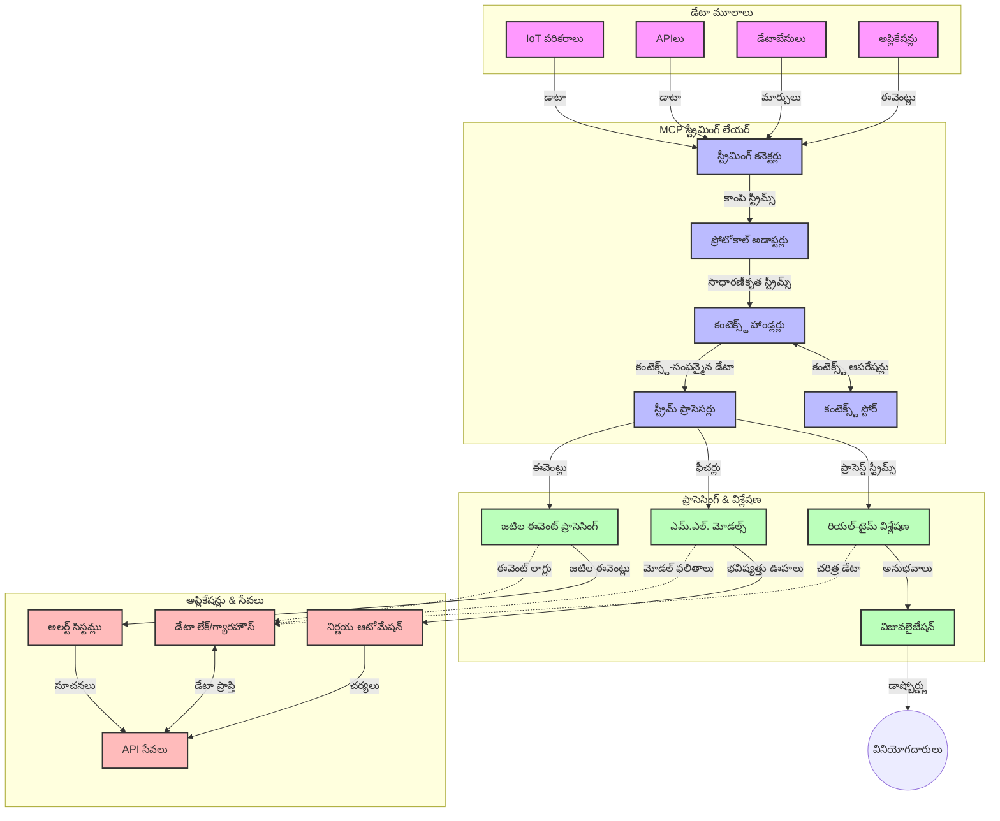

# రియల్-టైమ్ డేటా స్ట్రీమింగ్ కోసం మోడల్ కాంటెక్స్ ప్రోటోకాల్

## అవలోకనం

రియల్-టైమ్ డేటా స్ట్రీమింగ్ అనేది నేటి డేటా ఆధారిత ప్రపంచంలో చాలా అవసరమైనది, అందులో వ్యాపారాలు మరియు అనువర్తనాలు సమయోచిత నిర్ణయాలు తీసుకోవడానికి సమాచారాన్ని తక్షణమే పొందాలి. మోడల్ కాంటెక్స్ ప్రోటోకాల్ (MCP) ఈ రియల్-టైమ్ స్ట్రీమింగ్ ప్రక్రియలను మెరుగుపరచడంలో ఒక ప్రధాన అభివృద్ధిని సూచిస్తుంది, ఇది డేటా ప్రాసెసింగ్ సామర్థ్యాన్ని పెంచి, సందర్భ సమాచారాన్ని నిర్వహించడంతో పాటు మొత్తం సిస్టమ్ పనితీరును మెరుగుపరుస్తుంది.

ఈ మాడ్యూల్ MCP రియల్-టైమ్ డేటా స్ట్రీమింగ్‌ను ఎలా మారుస్తుందో పరిశీలిస్తుంది. ఇవి AI మోడల్స్, స్ట్రీమింగ్ ప్లాట్‌ఫారమ్‌లు మరియు అనువర్తనాల మధ్య సందర్భ నిర్వహణకు ఒక ప్రమాణీకృత దృష్టికోణాన్ని అందిస్తుంది.

## రియల్-టైమ్ డేటా స్ట్రీమింగ్ పరిచయం

రియల్-టైమ్ డేటా స్ట్రీమింగ్ అనేది నిరंतर డేటా జెనరేషన్, ప్రాసెసింగ్, మరియు విశ్లేషణను సాధ్యమయ్యే సాంకేతిక పద్ధతి, ఇందులో సిస్టమ్‌లు కొత్త సమాచారం వస్తే వెంటనే స్పందిస్తాయి. సంప్రదాయ బ్యాచ్ ప్రాసెసింగ్‌తో భిన్నంగా, ఇది గమనంలో ఉన్న డేటాను ప్రాసెస్ చేసి, తరచూ చురుకైన జ్ఞానాన్ని మరియు చర్యలను సులభతరం చేస్తుంది.

### రియల్-టైమ్ డేటా స్ట్రీమింగ్ యొక్క ప్రాథమిక భావాలు:

- **నిరంతర డేటా ప్రవాహం**: డేటా నిరంతరంగా, ఎప్పుడూ ముగియని సంఘటనలు లేదా రికార్డుల ప్రాసెసింగ్ ద్వారా నిర్వహించబడుతుంది.
- **తక్కువ ఆలస్యం ప్రాసెసింగ్**: డేటా ఉత్పత్తి మరియు ప్రాసెసింగ్ మధ్య సమయాన్ని తక్కువగా ఉంచేందుకు సిస్టమ్‌లు రూపొదింపబడతాయి.
- **స్కేలబిలిటీ**: స్ట్రీమింగ్ వాస్తవాలు మారవచ్చు - పెద్ద డేటా పరిమాణాలు మరియు వేగాలను నిర్వహించగలగాలి.
- **ఫాల్ట్ టోలరెన్స్**: డేటా ప్రవాహం నిలిపివేయకుండా సిస్టమ్ లోపాలను అమర్చి నిర్వహించాలి.
- **స్థితిస్థాపక ప్రాసెసింగ్**: సంఘటనల మధ్య స.context నిలుపుకోవడం అర్థవంతమైన విశ్లేషణకు అవసరం.

### మోడల్ కాంటెక్స్ ప్రోటోకాల్ మరియు రియల్-టైమ్ స్ట్రీమింగ్

మోడల్ కాంటెక్స్ ప్రోటోకాల్ (MCP) రియల్-టైమ్ స్ట్రీమింగ్ పర్యావరణాల్లో క్రింది ముఖ్యమైన సవాళ్లను పరిష్కరిస్తుంది:

1. **సందర్భ కొనసాగింపు**: MCP పంపిణీ చేసిన స్ట్రీమింగ్ భాగాల మధ్య సందర్భాన్ని సరిగ్గా నిర్వహించే విధానం అందిస్తుంది, దీంతో AI మోడల్స్ మరియు ప్రాసెసింగ్ నోడ్స్ సంబంధిత గత సమాచారం మరియు పరిసర సమాచారానికి యాక్సెస్ కలిగి ఉంటాయి.

2. **ఫలవంతమైన స్థితి నిర్వహణ**: సందర్భ మార్పిడి కోసం ఆకృతీకరించిన పద్ధతులు ద్వారా MCP స్ట్రీమింగ్ పైప్‌లైన్లలో స్థితి నిర్వహణలో ఉన్న జరుగును తగ్గిస్తుంది.

3. **అంతర్క్రియాత్మకత**: వివిధ స్ట్రీమింగ్ సాంకేతికతలు మరియు AI మోడల్స్ మధ్య సందర్భ భాగస్వామ్యం కోసం పాఠ్యాన్ని సృష్టించడం ద్వారా, మరింత లవచికమైన మరియు విస్తృతమైన వాస్తవ నిర్మాణాలు సాధ్యం అవుతాయి.

4. **స్ట్రీమింగ్‌కు అనుకూలమైన సందర్భం**: MCP అమలు చేసే సందర్భాల్లో, రియల్-టైమ్ నిర్ణయాల కోసం అత్యంత సంబంధితమైన సందర్భ అంశాలు ప్రాధాన్యం పొందుతాయి, ఇది పనితీరును మరియు ఖచ్చితత్వాన్ని మెరుగుపరుస్తుంది.

5. **అనుకూల ప్రాసెసింగ్**: MCP ద్వారా సరైన సందర్భ నిర్వహణతో, స్ట్రీమింగ్ సిస్టమ్స్ డేటాలో పరిణత పరిస్థితులు మరియు నమూనాల ఆధారంగా ప్రాసెసింగ్‌ను డైనమిక్‌గా సర్దుబాటు చేసుకోవచ్చు.

ఇంటర్నెట్ ఆఫ్ థింగ్స్ (IoT) సెన్సార్ నెట్‌వర్క్స్ నుండి ఆర్థిక ట్రేడింగ్ ప్లాట్‌ఫారమ్‌ల వరకు ఆధునిక అనువర్తనాల్లో, MCP మరియు స్ట్రీమింగ్ సాంకేతికతల సమ్మిళితం మరింత బుద్ధివంతమైన, సందర్భం-అడుగడుగునూ తెలుసుకునే ప్రాసెసింగ్‌ను సాధ్యమవుతుంది, ఇది క్లిష్టమైన, పరిణామాత్మక పరిస్థితులకు తగిన విధంగా స్పందిస్తుంది.

## నేర్చుకోవాల్సిన లక్ష్యాలు

ఈ పాఠం ముగింపు నాటికి, మీరు చేయగలిగేది:

- రియల్-టైమ్ డేటా స్ట్రీమింగ్ పాత భావనలను మరియు సవాళ్లను అవగాహన చేసుకోవడం
- మోడల్ కాంటెక్స్ ప్రోటోకాల్ (MCP) రియల్-టైమ్ డేటా స్ట్రీమింగ్‌ను ఎలా మెరుగుపరిస్తుందో వివరించడం
- Kafka మరియు Pulsar వంటి ప్రసిద్ధ ఫ్రేమ్‌వర్క్స్ ఉపయోగించి MCP ఆధారిత స్ట్రీమింగ్ పరిష్కారాలను అమలు చేయడం
- MCP తో ఫాల్ట్-టోలరెంట్, అధిక-ప్రదర్శన స్ట్రీమింగ్ వాస్తవ నిర్మాణాలను రూపకల్పన చేయడం మరియు మోహరించడం
- MCP సిద్ధాంతాలను IoT, ఆర్థిక ట్రేడింగ్, మరియు AI ఆధారిత విశ్లేషణ సందర్భాలలో వర్తింపజేయడం
- MCP-ఆధారిత స్ట్రీమింగ్ సాంకేతికతలలో అభివృద్ధి చెందుతున్న ధోరణులు మరియు భవిష్యత్తు ఆవిష్కరణలను మూల్యాంకనం చేయడం

### నిర్వచనం మరియు ప్రాముఖ్యత

రియల్-టైమ్ డేటా స్ట్రీమింగ్ అంటే తక్కువ ఆలస్యంతో డేటా నిరంతరం సృష్టించబడటం, ప్రాసెస్ చేయబడటం, మరియు పంపిణీ చేయబడటాన్ని సూచిస్తుంది. బ్యాచ్ ప్రాసెసింగ్‌లో డేటా సమూహాలుగా సేకరించడం మరియు ప్రాసెస్ చేయడం జరిగితే, స్ట్రీమింగ్ డేటా ఆమోద సమయంలోలాంటి లోపలి మెరుగుదలలతో ప్రాసెస్ అవుతుంది, వెంటనే అర్థం చేసుకోవడం మరియు చర్యలు తీసుకోవడం చేయగలదు.

రియల్-టైమ్ డేటా స్ట్రీమింగ్ యొక్క ముఖ్య లక్షణాలు:

- **తక్కువ ఆలస్యం**: మిల్లీసెకన్ల నుండి సెకన్ల పాటు డేటాను ప్రాసెస్ చేసి విశ్లేషించడం
- **నిరంతర ప్రవాహం**: వివిధ మూలాల నుండి నిరవధిక డేటా ప్రవాహం
- **తక్షణ ప్రాసెసింగ్**: డేటా వచ్చిన వెంటనే విశ్లేషించడం, బ్యాచ్‌లకు కాకుండా
- **సంఘటనల ఆధారిత వాస్తవ నిర్మాణం**: సంఘటనలు జరిగిన వెంటనే స్పందించడం

### సంప్రదాయ డేటా స్ట్రీమింగ్‌లో సవాళ్లు

సంప్రదాయ డేటా స్ట్రీమింగ్ విధానాలు కొన్ని పరిమితులను ఎదుర్కొంటున్నాయి:

1. **సందర్భం కోల్పోటం**: పంపిణీబడిన సిస్టమ్‌లలో సందర్భాన్ని నిర్వహించడంలో కష్టతనాలు
2. **స్కేలబిలిటీ సమస్యలు**: అధిక-పరిమాణం, అధిక-వేగం డేటాను నిర్వహించడంలో సవాళ్లు
3. **సంయోజన సంక్లిష్టత**: వేర్వేరు సిస్టమ్‌ల మధ్య అంతర్క్రియ మార్చడంలో ఇబ్బందులు
4. **ఆలస్యం నిర్వహణ**: ప్రసంగ సామర్థ్యం మరియు ప్రాసెసింగ్ సమయంలో సమతౌల్యం సాధించడం
5. **డేటా ప్రతిరూపత**: స్ట్రీమ్ అంతటా డేటా ఖచ్చితత్వం మరియు సంపూర్ణతను నిర్ధారించడం

## మోడల్ కాంటెక్స్ ప్రోటోకాల్ (MCP)ని అర్థం చేసుకోవడం

### MCP అంటే ఏమిటి?

మోడల్ కాంటెక్స్ ప్రోటోకాల్ (MCP) అనేది AI మోడల్స్ మరియు అనువర్తనాల మధ్య సమర్థవంతమైన పరస్పర చర్యను సులభతరం చేయడానికి రూపొందించిన ప్రమాణీకృత కమ్యూనికేషన్ ప్రోటోకాల్. రియల్-టైమ్ డేటా స్ట్రీమింగ్ సందర్భంలో, MCP ఇది కిందివాటికి ఫ్రేమ్‌వర్క్ అందిస్తుంది:

- డేటా పైప్‌లైన్ అంతటా సందర్భాన్ని పరిరక్షించడం
- డేటా మార్పిడి ఫార్మాట్లను ప్రమాణీకృతం చేయించడం
- పెద్ద డేటాసెట్ల ప్రసారాన్ని ఆప్టిమైజ్ చేయడం
- మోడల్-టు-మోడల్ మరియు మోడల్-టు-అప్లికేషన్ కమ్యూనికేషన్‌ను మెరుగుపరచడం

### ప్రాథమిక భాగాలు మరియు వాస్తవ నిర్మాణం

రియల్-టైమ్ స్ట్రీమింగ్ కోసం MCP వాస్తవ నిర్మాణంలో కొన్ని ప్రధాన భాగాలు ఉంటాయి:

1. **కాంటెక్స్ హ్యాండ్లర్స్**: స్ట్రీమింగ్ పైప్‌లైన్ అంతటా సందర్భ సమాచారం నిర్వహించడం మరియు పరిరక్షించడం
2. **స్ట్రీమ్ ప్రాసెసర్లు**: సందర్భ-జ్ఞానంతో కూడిన పరిణామ เทคนิคలతో డేటా స్ట్రీమ్స్‌ను ప్రాసెస్ చేయడం
3. **ప్రోటోకాల్ అడాప్టర్స్**: వేర్వేరు స్ట్రీమింగ్ ప్రోటోకాల్స్ మధ్య కాంటెక్స్ నిలుపుకున్నప్పటికీ మార్పిడి చేయడం
4. **కాంటెక్స్ స్టోర్**: సందర్భ సమాచారాన్ని సమర్థవంతంగా నిల్వచేసి తిరిగి పొందడం
5. **స్ట్రీమింగ్ కనెక్టర్స్**: వివిధ స్ట్రీమింగ్ ప్లాట్‌ఫారమ్‌లకు (Kafka, Pulsar, Kinesis, మొదలైనవి) కనెక్ట్ చేయడం




### MCP రియల్-టైమ్ డేటా హ్యాండ్లింగ్‌ను ఎలా మెరుగుపరుస్తుంది

MCP సంప్రదాయ స్ట్రీమింగ్ సవాళ్లను ఈ విధంగా పరిష్కరిస్తుంది:

- **సందర్భ సమగ్రత**: డేటా బిందువుల మధ్య సంబంధాలను పైప్‌లైన్ అంతటా నిలుపుకొనడం
- **ఆప్టిమైజ్డ్ ప్రసారం**: తెలివైన సందర్భ నిర్వహణ ద్వారా డేటా మార్పిడిలో మిగతావుతలను తగ్గించడం
- **ప్రమాణీకృత ఇంటర్‌ఫేస్లు**: స్ట్రీమింగ్ భాగాల కోసం ఆసక్తికరమైన APIs అందించడం
- **అల్ప ఆలస్యం**: సమర్థవంతమైన సందర్భ నిర్వహణ ద్వారా ప్రాసెసింగ్ తగినంత తక్కువగా చేయడం
- **మెరుగైన స్కేలబిలిటీ**: సందర్భాన్ని నిలుపుకుని హారిజాంటల్ స్కేలింగ్‌కు మద్దతు ఇవ్వడం

## ఏకీకరణ మరియు అమలు

రియల్-టైమ్ డేటా స్ట్రీమింగ్ సిస్టమ్స్ పనితీరు మరియు సందర్భ సమగ్రత రెండింటినీ సమర్ధవంతంగా నిర్వహించేందుకు జాగ్రత్తనైన వాస్తవ నిర్మాణ రూపకల్పన మరియు అమలు అవసరం. మోడల్ కాంటెక్స్ ప్రోటోకాల్ (MCP) AI మోడల్స్ మరియు స్ట్రీమింగ్ సాంకేతికతలను ఏకీకృతంగా కలపడానికి ప్రమాణీకృత దృష్టికోణం అందిస్తూ, మరింత అవగాహన గల సందర్భ-ఆధారిత ప్రాసెసింగ్ పైప్‌లైన్లను సృష్టించగలదు.

### స్ట్రీమింగ్ వాస్తవ నిర్మాణాల్లో MCP ఏకీకరణ అవగాహన

రియల్-టైమ్ స్ట్రీమింగ్ వాతావరణాల్లో MCP అమలు చెందడానికి కొన్ని ముఖ్య అంశాలు:

1. **కాంటెక్స్ సీరియలైజేషన్ మరియు ట్రాన్స్‌పోర్ట్**: MCP స్ట్రీమింగ్ డేటా ప్యాకెట్లలో సందర్భ సమాచారాన్ని ఎఫిషియెంట్‌గా ఎన్కోడ్ చేసేందుకు పద్ధతులు అందిస్తుంది. దీని వల్ల అవసరమైన సందర్భం డేటా ప్రాసెసింగ్ పైప్‌లైన్ అంతటా అనుసరిస్తుంది. ఇది స్ట్రీమింగ్ ట్రాన్స్‌పోర్ట్ కోసం ఆప్టిమైజ్ చేసిన ప్రమాణీకృత సీరియలైజేషన్ ఫార్మాట్లను కలిగి ఉంటుంది.

2. **స్థితిస్థాపక స్ట్రీమ్ ప్రాసెసింగ్**: MCP సాంప్రదాయంగా కష్టమైన స్థితి నిర్వహణ సమస్యలను అధిగమించేలా ప్రాసెసింగ్ నోడ్లలో స.context ప్రాతినిధ్యాన్ని స్థిరంగా ఉంచుతూ, మరింత జ్ఞానపూర్వకమైన స్థితిస్థాపక ప్రాసెసింగ్‌కు అనుమతిస్తుంది. ఇది పంపిణీ చేసిన స్ట్రీమింగ్ వాస్తవ నిర్మాణాల్లో బాండ్ అవుతుంది.

3. **ఈవెంట్-టైమ్ మరియు ప్రాసెసింగ్-టైమ్**: MCP స్ట్రీమింగ్ సిస్టమ్స్‌లో ఈవెంట్లు ఎప్పుడైన జరిగాయి మరియు ఎప్పుడైన ప్రాసెస్ చేయబడ్డాయి అనే వ్యత్యాసాలను పరిష్కరించగలది. ప్రోటోకాల్ ఈవెంట్ టైమ్ సూత్రాలను నిలుపుకునే కాల ఆధారిత సందర్భాన్ని చేర్చవచ్చు.

4. **బ్యాక్ ప్రెషర్ నిర్వహణ**: MCP సందర్భ నిర్వహణను ప్రమాణీకరించడం ద్వారా స్ట్రీమింగ్ సిస్టమ్స్‌లో బ్యాక్ ప్రెషర్ నిర్వహణ సులభమవుతుంది, ఇది భాగాలు తమ ప్రాసెసింగ్ సామర్థ్యాలను తెలియజేసి ఫ్లోను సర్దుబాటు చేసుకోవడానికి సహాయపడుతుంది.

5. **కాంటెక్స్ విండోవింగ్ మరియు సమాహరణ**: MCP కాలంలో మరియు సంబంధిత సందర్భాల ఆకృతీకరణలను అందిస్తూ, ఇనుము, మరింతజ్ఞానపూర్వక సమాహరణలను సంఘటనల స్ట్రీమ్స్ అంతటా చేయగలుగుతుంది.

6. **నిజమైన-ఒకసారి ప్రాసెసింగ్**: నిజమైన-ఒకసారి సూత్రాలు అవసరమైన స్ట్రీమింగ్ సిస్టమ్స్ లో MCP ప్రాసెసింగ్ మెటాడాటాను చేర్చగలిగితే పంపిణీ భాగాలలో ప్రాసెసింగ్ స్థితిని ట్రాక్ చేసి ధృవీకరించడానికి సహాయపడుతుంది.

వివిధ స్ట్రీమింగ్ సాంకేతికతల్లో MCP అమలు సందర్భ నిర్వహణకు ఏకైక దృష్టికోణాన్ని సృష్టిస్తుంది, ఇది ప్రత్యేక ఏకీకరణ కోడ్ అవసరాన్ని తగ్గించి, డేటా పైప్‌లైన్ ద్వారా ప్రవహించే సందర్భాన్ని నిర్వహించే సామర్థ్యాన్ని పెంచుతుంది.

### వివిధ డేటా స్ట్రీమింగ్ ఫ్రేమ్‌వర్క్లలో MCP

ఈ ఉదాహరణలు ప్రస్తుత MCP స్పెసిఫికేషన్‌ను అనుసరించి JSON-RPC ఆధారిత ప్రోటోకాల్తో వేర్వేరు ట్రాన్స్‌పోర్ట్ యంత్రాంగాలను చూపిస్తాయి. కోడ్ తగినట్లుగా Kafka మరియు Pulsar వంటి స్ట్రీమింగ్ ప్లాట్‌ఫార్మ్‌లను ఇన్‌స్టాల్ చేసుకునే మెళకువను చేర్చే విధానాన్ని ప్రదర్శిస్తుంది, MCP ప్రోటోకాల్‌తో పూర్తి సాదృశ్యం ఉన్నట్లు నిర్ధారిస్తుంది.

ఈ ఉదాహరణలు MCPకి కేంద్రమైన సందర్భ అవగాహనను నిలుపుకునేందుకు ఎలా స్ట్రీమింగ్ ప్లాట్‌ఫారమ్‌లను అనుసంధానించవచ్చో చూపించేందుకు రూపొందించబడ్డాయి. ఈ విధానం జూన్ 2025 నాటికి MCP స్పెసిఫికేషన్ ప్రస్తుత స్థితిని క్రమంగా ప్రతిబింబిస్తుంది.

MCPని ప్రసిద్ధ స్ట్రీమింగ్ ఫ్రేమ్‌వర్క్స్‌తో అనుసంధానించవచ్చు, వాటిలో:

#### అపచ్చే కాఫ్కా (Apache Kafka) ఏకీకరణ

```python
import asyncio
import json
from typing import Dict, Any, Optional
from confluent_kafka import Consumer, Producer, KafkaError
from mcp.client import Client, ClientCapabilities
from mcp.core.message import JsonRpcMessage
from mcp.core.transports import Transport

# MCP ని Kafkaతో జతచేసేందుకు అనుకూల రవాణా తరగతి
class KafkaMCPTransport(Transport):
    def __init__(self, bootstrap_servers: str, input_topic: str, output_topic: str):
        self.bootstrap_servers = bootstrap_servers
        self.input_topic = input_topic
        self.output_topic = output_topic
        self.producer = Producer({'bootstrap.servers': bootstrap_servers})
        self.consumer = Consumer({
            'bootstrap.servers': bootstrap_servers,
            'group.id': 'mcp-client-group',
            'auto.offset.reset': 'earliest'
        })
        self.message_queue = asyncio.Queue()
        self.running = False
        self.consumer_task = None
        
    async def connect(self):
        """Connect to Kafka and start consuming messages"""
        self.consumer.subscribe([self.input_topic])
        self.running = True
        self.consumer_task = asyncio.create_task(self._consume_messages())
        return self
        
    async def _consume_messages(self):
        """Background task to consume messages from Kafka and queue them for processing"""
        while self.running:
            try:
                msg = self.consumer.poll(1.0)
                if msg is None:
                    await asyncio.sleep(0.1)
                    continue
                
                if msg.error():
                    if msg.error().code() == KafkaError._PARTITION_EOF:
                        continue
                    print(f"Consumer error: {msg.error()}")
                    continue
                
                # సందేశ విలువను JSON-RPCగా విశ్లేషించండి
                try:
                    message_str = msg.value().decode('utf-8')
                    message_data = json.loads(message_str)
                    mcp_message = JsonRpcMessage.from_dict(message_data)
                    await self.message_queue.put(mcp_message)
                except Exception as e:
                    print(f"Error parsing message: {e}")
            except Exception as e:
                print(f"Error in consumer loop: {e}")
                await asyncio.sleep(1)
    
    async def read(self) -> Optional[JsonRpcMessage]:
        """Read the next message from the queue"""
        try:
            message = await self.message_queue.get()
            return message
        except Exception as e:
            print(f"Error reading message: {e}")
            return None
    
    async def write(self, message: JsonRpcMessage) -> None:
        """Write a message to the Kafka output topic"""
        try:
            message_json = json.dumps(message.to_dict())
            self.producer.produce(
                self.output_topic,
                message_json.encode('utf-8'),
                callback=self._delivery_report
            )
            self.producer.poll(0)  # కాల్‌బ్యాక్‌లను ప్రారంభించండి
        except Exception as e:
            print(f"Error writing message: {e}")
    
    def _delivery_report(self, err, msg):
        """Kafka producer delivery callback"""
        if err is not None:
            print(f'Message delivery failed: {err}')
        else:
            print(f'Message delivered to {msg.topic()} [{msg.partition()}]')
    
    async def close(self) -> None:
        """Close the transport"""
        self.running = False
        if self.consumer_task:
            self.consumer_task.cancel()
            try:
                await self.consumer_task
            except asyncio.CancelledError:
                pass
        self.consumer.close()
        self.producer.flush()

# Kafka MCP రవాణా యొక్క ఉదాహరణ ఉపయోగం
async def kafka_mcp_example():
    # Kafka రవాణాతో MCP క్లయింట్‌ను సృష్టించండి
    client = Client(
        {"name": "kafka-mcp-client", "version": "1.0.0"},
        ClientCapabilities({})
    )
    
    # Kafka రవాణాను సృష్టించి కనెక్ట్ చేయండి
    transport = KafkaMCPTransport(
        bootstrap_servers="localhost:9092",
        input_topic="mcp-responses",
        output_topic="mcp-requests"
    )
    
    await client.connect(transport)
    
    try:
        # MCP సెషన్‌ను ప్రారంభించండి
        await client.initialize()
        
        # MCP ద్వారా సాధనాన్ని అమలు చేయడం యొక్క ఉదాహరణ
        response = await client.execute_tool(
            "process_data",
            {
                "data": "sample data",
                "metadata": {
                    "source": "sensor-1",
                    "timestamp": "2025-06-12T10:30:00Z"
                }
            }
        )
        
        print(f"Tool execution response: {response}")
        
        # శుభ్రంగా బంద్ చేయండి
        await client.shutdown()
    finally:
        await transport.close()

# ఉదాహరణను నడపండి
if __name__ == "__main__":
    asyncio.run(kafka_mcp_example())
```


#### అపచ్చే పుల్సర్ (Apache Pulsar) అమలు

```python
import asyncio
import json
import pulsar
from typing import Dict, Any, Optional
from mcp.core.message import JsonRpcMessage
from mcp.core.transports import Transport
from mcp.server import Server, ServerOptions
from mcp.server.tools import Tool, ToolExecutionContext, ToolMetadata

# పుల్సార్‌ను ఉపయోగించే ప్రత్యేక MCP రవాణాను సృష్టించండి
class PulsarMCPTransport(Transport):
    def __init__(self, service_url: str, request_topic: str, response_topic: str):
        self.service_url = service_url
        self.request_topic = request_topic
        self.response_topic = response_topic
        self.client = pulsar.Client(service_url)
        self.producer = self.client.create_producer(response_topic)
        self.consumer = self.client.subscribe(
            request_topic,
            "mcp-server-subscription",
            consumer_type=pulsar.ConsumerType.Shared
        )
        self.message_queue = asyncio.Queue()
        self.running = False
        self.consumer_task = None
    
    async def connect(self):
        """Connect to Pulsar and start consuming messages"""
        self.running = True
        self.consumer_task = asyncio.create_task(self._consume_messages())
        return self
    
    async def _consume_messages(self):
        """Background task to consume messages from Pulsar and queue them for processing"""
        while self.running:
            try:
                # టైమ్ అవుట్‌తో బ్లాక్ కాకుండా అందుకోవడం
                msg = self.consumer.receive(timeout_millis=500)
                
                # సందేశాన్ని ప్రాసెస్ చేయండి
                try:
                    message_str = msg.data().decode('utf-8')
                    message_data = json.loads(message_str)
                    mcp_message = JsonRpcMessage.from_dict(message_data)
                    await self.message_queue.put(mcp_message)
                    
                    # సందేశాన్ని అంగీకరించండి
                    self.consumer.acknowledge(msg)
                except Exception as e:
                    print(f"Error processing message: {e}")
                    # లోపం జరిగినట్లయితే నెగెటివ్ అంగీకారం ఇవ్వండి
                    self.consumer.negative_acknowledge(msg)
            except Exception as e:
                # టైమ్ అవుట్ లేదా ఇతర తప్పిదాలను నిర్వహించండి
                await asyncio.sleep(0.1)
    
    async def read(self) -> Optional[JsonRpcMessage]:
        """Read the next message from the queue"""
        try:
            message = await self.message_queue.get()
            return message
        except Exception as e:
            print(f"Error reading message: {e}")
            return None
    
    async def write(self, message: JsonRpcMessage) -> None:
        """Write a message to the Pulsar output topic"""
        try:
            message_json = json.dumps(message.to_dict())
            self.producer.send(message_json.encode('utf-8'))
        except Exception as e:
            print(f"Error writing message: {e}")
    
    async def close(self) -> None:
        """Close the transport"""
        self.running = False
        if self.consumer_task:
            self.consumer_task.cancel()
            try:
                await self.consumer_task
            except asyncio.CancelledError:
                pass
        self.consumer.close()
        self.producer.close()
        self.client.close()

# స్ట్రీమింగ్ డేటాను ప్రాసెస్ చేసే నమూనా MCP టూల్‌ను నిర్వచించండి
@Tool(
    name="process_streaming_data",
    description="Process streaming data with context preservation",
    metadata=ToolMetadata(
        required_capabilities=["streaming"]
    )
)
async def process_streaming_data(
    ctx: ToolExecutionContext,
    data: str,
    source: str,
    priority: str = "medium"
) -> Dict[str, Any]:
    """
    Process streaming data while preserving context
    
    Args:
        ctx: Tool execution context
        data: The data to process
        source: The source of the data
        priority: Priority level (low, medium, high)
        
    Returns:
        Dict containing processed results and context information
    """
    # MCP సందర్భాన్ని ఉపయోగించే ఉదాహరణ ప్రక్రియ
    print(f"Processing data from {source} with priority {priority}")
    
    # MCP నుండి సంభాషణ సందర్భాన్ని యాక్సెస్ చేయండి
    conversation_id = ctx.conversation_id if hasattr(ctx, 'conversation_id') else "unknown"
    
    # మెరుగుపరచబడిన సందర్భంతో ఫలితాలను తిరిగి ఇవ్వండి
    return {
        "processed_data": f"Processed: {data}",
        "context": {
            "conversation_id": conversation_id,
            "source": source,
            "priority": priority,
            "processing_timestamp": ctx.get_current_time_iso()
        }
    }

# పుల్సార్ రవాణాని ఉపయోగించే MCP సర్వర్ అమలు ఉదాహరణ
async def run_mcp_server_with_pulsar():
    # MCP సర్వర్‌ను సృష్టించండి
    server = Server(
        {"name": "pulsar-mcp-server", "version": "1.0.0"},
        ServerOptions(
            capabilities={"streaming": True}
        )
    )
    
    # మా టూల్‌ను నమోదు చేయండి
    server.register_tool(process_streaming_data)
    
    # పుల్సార్ రవాణాను సృష్టించి కనెక్ట్ చేయండి
    transport = PulsarMCPTransport(
        service_url="pulsar://localhost:6650",
        request_topic="mcp-requests",
        response_topic="mcp-responses"
    )
    
    try:
        # పుల్సార్ రవాణాతో సర్వర్‌ను ప్రారంభించండి
        await server.run(transport)
    finally:
        await transport.close()

# సర్వర్‌ను నడపండి
if __name__ == "__main__":
    asyncio.run(run_mcp_server_with_pulsar())
```


### అమలుకు சிறந்த ప్రాక్టీసులు

రియల్-టైమ్ స్ట్రీమింగ్ కోసం MCP అమలు చేసే సమయాన్ని అనుసరించి:

1. **ఫాల్ట్ టోలరెన్స్ కోసం రూపకల్పన చేయండి**:
   - సరైన లోపాల నిర్వహణను అమలు చేయండి
   - విఫలమైన సందేశాలకు డెడ్-లెటర్ క్యూలు ఉపయోగించండి
   - ఐడంపోటెంట్ ప్రాసెసర్లను రూపకల్పన చేయండి

2. **పనితీరు కోసం ఆప్టిమైజ్ చేయండి**:
   - సంబంధిత బఫర్ పరిమాణాలను సెట్ చేయండి
   - అవసరమైన చోట బ్యాచ్ ప్రాసెసింగ్ ఉపయోగించండి
   - బ్యాక్ ప్రెషర్ యంత్రాంగాలు అమలు చేయండి

3. **మానిటర్ మరియు పరిశీలించండి**:
   - స్ట్రీమ్ ప్రాసెసింగ్ మీట్రిక్స్‌ను ట్రాక్ చేయండి
   - సందర్భ ప్రచారాన్ని మానిటర్ చేయండి
   - అసామాన్యాలకు అలెర్టులను అమలు చేయండి

4. **మీ స్ట్రీమ్స్‌ను సురక్షితం చేయండి**:
   - సెన్సిటివ్ డేటా కోసం ఎన్‌క్రిప్షన్ అమలు చేయండి
   - జాగ్రత గుర్తింపు మరియు అధికారాన్ని ఉపయోగించండి
   - సరైన యాక్సెస్ కంట్రోల్స్‌ను వర్తింపజేయండి

### MCP IoT మరియు ఎడ్జ్ కంప్యూటింగ్‌లో

MCP IoT స్ట్రీమింగ్‌ను ఈ విధంగా మెరుగుపరుస్తుంది:

- ప్రాసెసింగ్ పైప్‌లైన్ అంతటా డివైస్ సందర్భాన్ని పరిరక్షించడం
- సమర్థవంతమైన ఎడ్జ్-టు-క్లౌడ్ డేటా స్ట్రీమింగ్‌ను సృష్టించడం
- IoT డేటా స్ట్రీమ్స్ పై రియల్-టైమ్ విశ్లేషణలను మద్దతు ఇవ్వడం
- సందర్భంతో డివైస్-టు-డివైస్ కమ్యూనికేషన్ సౌకర్యం

ఉదాహరణ: స్మార్ట్ సిటీ సెన్సార్ నెట్‌వర్క్స్  
```
Sensors → Edge Gateways → MCP Stream Processors → Real-time Analytics → Automated Responses
```


### ఆర్థిక లావాదేవీల మరియు అధిక-ఫ్రీక్వెన్సీ ట్రేడింగ్‌లో పాత్ర

MCP ఆర్థిక డేటా స్ట్రీమింగ్ కోసం ప్రముఖ ప్రయోజనాలను అందిస్తుంది:

- ట్రేడింగ్ నిర్ణయాలకు అతి తక్కువ ఆలస్య ప్రాసెసింగ్
- ప్రాసెసింగ్ సమయంలో లావాదేవీ సందర్భాన్ని నిలుపుకోవడం
- సందర్భ మూల్యాంకనంతో క్లిష్టమైన సంఘటన ప్రాసెసింగ్‌కు మద్దతు
- పంపిణీ చేయబడిన ట్రేడింగ్ సిస్టమ్స్ అంతటా డేటా ఖచ్చితత్వం నిర్ధారణ

### AI ఆధారిత డేటా విశ్లేషణను మెరుగుపరచడం

MCP స్ట్రీమింగ్ విశ్లేషణకు కొత్త అవకాశాలను సృష్టిస్తుంది:

- రియల్-టైమ్ మోడల్ శిక్షణ మరియు నిర్ధారణ
- స్ట్రీమింగ్ డేటా నుంచి నిరంతర అభ్యాసం
- సందర్భ-జ్ఞానంతో కూడిన ఫీచర్ ఎక్స్‌ట్రాక్షన్
- నిల్వ చేసిన సందర్భంతో బహుముఖ మోడల్ నిర్ధారణ పైప్‌లైన్లు

## భవిష్యత్ ధోరణులు మరియు ఆవిష్కరణలు

### రియల్-టైమ్ వాతావరణాల్లో MCP వికాసం

భవిష్యత్తులో MCP క్రిందివాటిపై దృష్టి సారిస్తుంది:

- **క్వాంటం కంప్యూటింగ్ సమ్మేళనం**: క్వాంటం ఆధారిత స్ట్రీమింగ్ సిస్టమ్స్‌కు సిద్ధంగా ఉండటం
- **ఎడ్జ్-నేటివ్ ప్రాసెసింగ్**: మరింత సందర్భ-జ్ఞాన ప్రాసెసింగ్ ఎడ్జ్ పరికరాలకు మార్చడం
- **స్వయం-ఆప్టిమైజింగ్ స్ట్రీమింగ్**: స్వీయ మెరుగుదల గల స్ట్రీమింగ్ పైప్‌లైన్లు
- **ఫెడరేటెడ్ స్ట్రీమింగ్**: గోప్యతను పరిరక్షిస్తూ పంపిణీ ప్రాసెసింగ్

### సాంకేతిక అభివృద్ధి కార్యక్రమాలు

MCP స్ట్రీమింగ్ భవిష్యత్తును రూపొదించే అత్యంత ప్రముఖ సాంకేతికతలు:

1. **AI-ఆప్టిమైజ్ చేయబడిన స్ట్రీమింగ్ ప్రోటోకాల్స్**: AI వర్క్‌లోడ్స్ కోసం ప్రత్యేకంగా రూపొందించిన ప్రోటోకాల్స్
2. **న్యూరోమార్ఫిక్ కంప్యూటింగ్ సమ్మిళనం**: బ్రెయిన్-ప్రేరిత కంప్యూటింగ్ స్ట్రీమ్ ప్రాసెసింగ్ కోసం
3. **సర్వర్‌లెస్ స్ట్రీమింగ్**: నిర్మాణం నిర్వహణ లేకుండా సంఘటన ఆధారిత, స్కేలబుల్ స్ట్రీమింగ్
4. **వెహళ్ళ పటిష్ట కాంటెక్స్ట్ స్టోర్లు**: ప్రపంచవ్యాప్తంగా పంపిణీ చేసిన, గాని అత్యంత ఖచ్చితమైన సందర్భ నిర్వహణ

## ప్రాయోగిక వ్యాయామాలు

### వ్యాయామం 1: ఒక ప్రాథమిక MCP స్ట్రీమింగ్ పైప్‌లైన్ సెటప్ చేయడం

ఈ వ్యాయామంలో మీరు నేర్చుకుంటారు:

- ప్రాథమిక MCP స్ట్రీమింగ్ వాతావరణాన్ని కాన్ఫిగర్ చేయడం
- స్ట్రీమ్ ప్రాసెసింగ్ కోసం సందర్భ హ్యాండ్లర్‌లను అమలు చేయడం
- సందర్భ పరిరక్షణని పరీక్షించి ధృవీకరించడం

### వ్యాయామం 2: రియల్-టైమ్ విశ్లేషణ డాష్బోర్డ్ నిర్మాణం

కంప్లీట్ అప్లికేషన్ క్రియేట్ చేయండి:

- MCP ఉపయోగించి స్ట్రీమింగ్ డేటాను ఇంగెస్ట్ చేయడం
- సందర్భాన్ని నిలుపుకుని స్ట్రీమ్ను ప్రాసెస్ చేయడం
- ఫలితాలను రియల్-టైమ్‌లో విజువలైజ్ చేయడం

### వ్యాయామం 3: MCPతో క్లిష్ట సంఘటన ప్రాసెసింగ్ అమలు

అdvాన్స్డ్ వ్యాయామం కవర్ చేస్తుంది:

- స్ట్రీమ్స్‌లో నమూనా గుర్తింపు
- బహుళ స్ట్రీమ్స్ అంతటా సందర్భక కరలేషన్
- నిలుపుకున్న సందర్భంతో క్లిష్ట సంఘటనల తయారీ

## అదనపు వనరులు

- [Model Context Protocol Specification](https://modelcontextprotocol.io) - అధికారిక MCP స్పెసిఫికేషన్ మరియు డాక్యుమెంటేషన్  
- [Apache Kafka Documentation](https://kafka.apache.org/documentation/) - స్ట్రీమ్ ప్రాసెసింగ్ కోసం Kafka గురించి తెలుసుకోండి  
- [Apache Pulsar](https://pulsar.apache.org/) - ఐకీకృత సందేశ మరియు స్ట్రీమింగ్ ప్లాట్‌ఫారమ్  
- [Streaming Systems: The What, Where, When, and How of Large-Scale Data Processing](https://www.oreilly.com/library/view/streaming-systems/9781491983867/) - స్ట్రీమింగ్ వాస్తవ నిర్మాణాలపై సమగ్ర పుస్తకం  
- [Microsoft Azure Event Hubs](https://learn.microsoft.com/azure/event-hubs/event-hubs-about) - నిర్వహిత సంఘటన స్ట్రీమింగ్ సేవ  
- [MLflow Documentation](https://mlflow.org/docs/latest/index.html) - ML మోడల్ ట్రాకింగ్ మరియు మోహరణ కోసం  
- [Real-Time Analytics with Apache Storm](https://storm.apache.org/releases/current/index.html) - రియల్-టైమ్ లెక్కల కోసం ప్రాసెసింగ్ ఫ్రేమ్‌వర్క్  
- [Flink ML](https://nightlies.apache.org/flink/flink-ml-docs-master/) - అపచ్చే ఫ్లింక్ కోసం మెషీన్ లెర్నింగ్ లైబ్రరీ  
- [LangChain Documentation](https://python.langchain.com/docs/get_started/introduction) - LLMలతో అప్లికేషన్లు నిర్మించడం  

## నేర్చుకున్న ఫలితాలు

ఈ మాడ్యూల్ పూర్తిచేసిన తర్వాత మీరు చేయగలుగుతారు:

- రియల్-టైమ్ డేటా స్ట్రీమింగ్ ప్రాథమికాలు మరియు సవాళ్లను అర్థం చేసుకోవడం
- మోడల్ కాంటెక్స్ ప్రోటోకాల్ (MCP) రియల్-టైమ్ డేటా స్ట్రీమింగ్‌ను ఎలా మెరుగుపరిస్తుందో వివరణ ఇవ్వడం
- Kafka మరియు Pulsar వంటి ప్రాచుర్యంలో ఉన్న ఫ్రేమ్‌వర్క్‌లను ఉపయోగించి MCP ఆధారిత స్ట్రీమింగ్ పరిష్కారాలను అమలు చేయడం
- MCP తో ఫాల్ట్-టోలరెంట్, అధిక పనితీరు స్ట్రీమింగ్ వాస్తవ నిర్మాణాలను రూపకల్పన చేసి అమలు చేయడం
- MCP సిద్ధాంతాలను IoT, ఆర్థిక ట్రేడింగ్ మరియు AI ఆధారిత విశ్లేషణ సందర్భాల్లో ఉపయోగించడం
- MCP-ఆధారిత స్ట్రీమింగ్ సాంకేతికతలలో అభివృద్ధి చెందుతున్న ధోరణులు మరియు భవిష్యత్ ఆవిష్కరణలను మూల్యాంకనం చేయడం

## తదుపరి ఏమిటి

- [5.11 రియల్‌టైమ్ సెర్చ్](../mcp-realtimesearch/README.md)

---

<!-- CO-OP TRANSLATOR DISCLAIMER START -->
**అస్వీకరణ**:
ఈ పత్రం AI అనువాద సేవ [Co-op Translator](https://github.com/Azure/co-op-translator) ఉపయోగించి అనువదించబడింది. మేము ఖచ్చితత్వానికి ప్రయత్నిస్తున్నప్పటికీ, ఆటోమేటెడ్ అనువాదాలు తప్పులు లేదా అసమగ్రతలను కలిగి ఉండవచ్చు. దాని స్వదేశ భాషలో ఉన్న అసలు పత్రాన్ని అధికారం కలిగిన మూలంగా పరిగణించాలి. కీలకమైన సమాచారం కోసం, ప్రొఫెషనల్ మానవ అనువాదాన్ని సిఫారసు చేస్తాము. ఈ అనువాదం ఉపయోగం వల్ల కలిగే ఏవైనా అపార్థాలు లేదా తప్పుదారులు కోసం మేము బాధ్యత వహించము.
<!-- CO-OP TRANSLATOR DISCLAIMER END -->