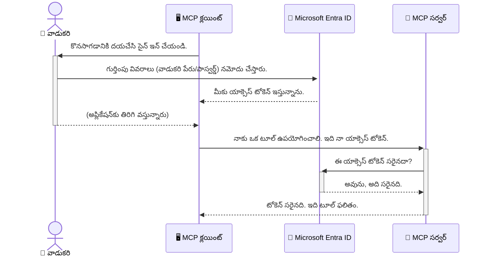

# AI పనిముట్లు రక్షణ: మోడల్ కాంటెక్స్ ప్రోటోకాల్ సర్వర్లకు Entra ID ధృవీకరణ

## పరిచయం
మీ మోడల్ కాంటెక్స్ ప్రోటోకాల్ (MCP) సర్వర్ ను సురక్షితంగా ఉంచడం అనేది మీ ఇంటి ముందుమూసిన తలుపును లాక్కోవడం అంతే ముఖ్యమని గుర్తుపెట్టుకోండి. మీ MCP సర్వర్ ను తెరిచి ఉంచడం అనధికార యాక్సెస్ కు మీ పరికరాలు మరియు డేటాను వెల్లడించడం, ఇది భద్రతా ఉల్లంఘనలకు కారణం కావచ్చు. Microsoft Entra ID ఒక బలమైన క్లౌడ్ ఆధారిత గుర్తింపు మరియు యాక్సెస్ నిర్వహణ పరిష్కారాన్ని అందించి, అధికృత యూజర్లు మరియు అప్లికేషన్లు మాత్రమే మీ MCP సర్వర్ తో పరస్పరం చేయగలుగుతారని నిర్ధారిస్తుంది. ఈ విభాగంలో, మీరు Entra ID ధృవీకరణను ఉపయోగించి మీ AI పనిముట్లను ఎలా రక్షించాలో నేర్చుకుంటారు.

## నేర్పుబోధులు
ఈ విభాగం ముగింపుకు, మీరు చేయగలుగుతారు:

- MCP సర్వర్లను సురక్షితంగా ఉంచుట ఎంత కీలకమో అర్థం చేసుకోవడం.
- Microsoft Entra ID మరియు OAuth 2.0 ధృవీకరణ ఆధారభూతాలు వివరించడం.
- పబ్లిక్ మరియు కాన్ఫిడెన్షియల్ క్లయింట్ల మధ్య తేడాను గుర్తించడం.
- స్థానిక (పబ్లిక్ క్లయింట్) మరియు రిమోట్ (కాన్ఫిడెన్షియల్ క్లయింట్) MCP సర్వర్ సందర్భాలలో Entra ID ధృవీకరణను అమలు చేయడం.
- AI పనిముట్లు అభివృద్ధి సమయంలో భద్రత ఉత్తమ ఆచారాలను వర్తింపజేయడం.

## భద్రత మరియు MCP

మీ ఇంటి ముందుమూసటి తలుపును లాక్కోకుండా ఉంచేందుకోకపోతే, అదే విధంగా మీ MCP సర్వర్ ను ఎవరైనా ప్రవేశించకుండా సురక్షితం చేయాలి. మీ AI పనిముట్లు బలమైన, विश्वासযোগ্য మరియు సురక్షితమైన అప్లికేషన్లు సృష్టించడం కోసం చాలా ముఖ్యమైనవి. ఈ అధ్యాయం Microsoft Entra ID ను ఉపయోగించి మీ MCP సర్వర్లను సురక్షితంగా ఉంచే విధానాన్ని పరిచయం చేస్తుంది, తద్వారా అధికృత యూజర్లు మరియు అప్లికేషన్లు మాత్రమే మీ పరికరాలు మరియు డేటాతో పరస్పరం చేయగలుగుతారు.

## MCP సర్వర్లకు భద్రత ఎందుకు అవసరం

మీ MCP సర్వర్ వద్ద ఒక టూల్ ఉంది అని ఊహించండి, అది ఇమెయిల్స్ పంపగలదు లేదా కస్టమర్ డేటాబేస్ యాక్సెస్ చేయగలదు. ఒక సురక్షితంగా లేని సర్వర్ అంటే ఎవరైనా ఆ టూల్ ను ఉపయోగించగలుగుతారు, ఇది అనధికార డేటా యాక్సెస్, స్పామ్ లేదా ఇతర దుర్మార్గ కార్యకలాపాలకు దారితీస్తుంది.

ధృవీకరణను అమలు చేయడం ద్వారా, మీరు ప్రతి అభ్యర్థనను పరిశీలించి, అభ్యర్థన చేసే యూజర్ లేదా అప్లికేషన్ యొక్క గుర్తింపును నిర్ధారిస్తారు. ఇది మీ AI పనిముట్ల భద్రతకుపై మొదటి మరియు అత్యంత కీలకమైన దశ.

## Microsoft Entra ID పరిచయం

[**Microsoft Entra ID**](https://adoption.microsoft.com/microsoft-security/entra/) అనేది ఒక క్లౌడ్ ఆధారిత గుర్తింపు మరియు యాక్సెస్ నిర్వహణ సేవ. దీన్ని మీ అప్లికేషన్లకు విశ్వవ్యాప్త భద్రతా గార్డు అని భావించొచ్చు. ఇది యూజర్ గుర్తింపును ధృవీకరించడం (authentication) మరియు వారు ఏ పనులు చేయగలరో నిర్ణయించడం (authorization) వంటి సంక్లిష్ట ప్రక్రియలను నిర్వహిస్తుంది.

Entra ID వాడుతూ మీరు చేయగలుగుతారు:

- యూజర్ల కొరకు సురక్షిత సైన్-ఇన్ ను సక్షమం చేయడం.
- APIలు మరియు సేవలను రక్షించడం.
- యాక్సెస్ విధానాలను ఒక కేంద్ర స్థలం నుండి నిర్వహించడం.

MCP సర్వర్ల కొరకు, Entra ID ఒక బలమైన, విశ్వసనీయ పరిష్కారాన్ని అందిస్తుంది, ఎవరు మీ సర్వర్ సామర్ధ్యాలకు యాక్సెస్ పొందగలరో నియంత్రించడానికి.

---

## మాయాజాలం అర్థం చేసుకోవడం: Entra ID ధృవీకరణ ఎలా పనిచేస్తుంది

Entra ID **OAuth 2.0** వంటివి వంటి ఓపెన్ ప్రమాణాలను ఉపయోగిస్తుంది ధృవీకరణ నడిపేందుకు. వివరాలు సంక్లిష్టంగా ఉండొచ్చు, కానీ మూల భావన సరళం మరియు ఒక ఉదాహరణతో అర్థం చేసుకోవచ్చు.

### OAuth 2.0 కు మృదువైన పరిచయము: వాలెట్ కీ

OAuth 2.0 ను మీ కారుకు వాలెట్ సేవ వలె భావించండి. మీరు రెస్టారెంట్ వద్దకు వచ్చేటప్పుడు, వాలెట్ కు మీ మాస్టర్ కీ ఇవ్వరు. స్థానంలో, మీరు ఒక **వాలెట్ కీ** ఇస్తారు, అది పరిమిత అనుమతులతో ఉంటుంది—ఇది కారును స్టార్ట్ చేసి తలుపులను లాక్ చేయగలదు, కాని బ్యాగ్ బాగి లేదా గుండ్రటి డబ్బాను తెరవలేం.

ఈ ఉదాహరణలో:

- **మీరు** అంటే **యూజర్**.
- **మీ కారు** అంటే విలువైన పరికరాలు మరియు డేటా కలిగిన **MCP సర్వర్**.
- **వాలెట్** అంటే **Microsoft Entra ID**.
- **పార్కింగ్ ఎటెన్డెంట్** అంటే **MCP క్లయింట్** (సర్వర్ యాక్సెస్ చేయాలనుకునే అప్లికేషన్).
- **వాలెట్ కీ** అంటే **యాక్సెస్ టోకెన్**.

యాక్సెస్ టోకెన్ అనేది Entra ID నుండి మీరు సైన్-ఇన్ అయిన వెంటనే MCP క్లయింట్ అందుకునే ఒక సురక్షిత పాఠ్యం. క్లయింట్ ఈ టోకెన్ ను ప్రతి అభ్యర్థనలో MCP సర్వర్ కి సమర్పిస్తుంది. సర్వర్ ఈ టోకెన్ ను ధృవీకరించి అభ్యర్థన చట్టబద్ధమైనదే అని నిర్ధారిస్తుంది మరియు క్లయింట్ కు అవసరమైన అనుమతులు ఉన్నాయని కూడా నిర్ధారిస్తుంది, మీ నిజమైన సర్టిఫికేట్ల (పాస్‌వర్డ్ లాంటి) అవసరం లేకుండా.

### ధృవీకరణ ప్రవాహం

ప్రయోగంలో ఇది ఎలా పనిచేస్తుందో:



### Microsoft Authentication Library (MSAL) పరిచయం

కోడ్ వైపు దూకక ముందు, మీరు ఉదాహరణల్లో చూడబోయే ప్రధాన భాగం: **Microsoft Authentication Library (MSAL)** గురించి తెలుసుకోవడం ముఖ్యం.

MSAL అనేది Microsoft అభివృద్ధి చేసిన ఒక లైబ్రరీ, ఇది డెవలపర్లకు ధృవీకరణ నిర్వహణను సులభతరం చేయడానికి. మీరు భద్రత టోకెన్లను నిర్వహించడం, సైన్-ఇన్ నిర్వహణ, సెషన్ల రిఫ్రెష్ లాంటి సంక్లిష్ట కోడ్ వ్రాయకుండానే MSAL ఈ బాధ్యతలు తీసుకుంటుంది.

MSAL వాడకానికి ప్రధాన కారణాలు:

- **సురక్షితం:** ఇది పరిశ్రమ ప్రమాణాలు మరియు భద్రత ఉత్తమ ఆచారాలను అమలు చేస్తుంది, మీ కోడ్ లో లోపాలు రావడం తగ్గిస్తుంది.
- **అభివృద్ధి సులభతరం:** OAuth 2.0 మరియు OpenID Connect సూత్రాలను వివరించకుండా, మీ అప్లికేషన్ కు బలమైన ధృవీకరణను కొద్ది పంక్తుల కోడ్ తో చేర్చవచ్చు.
- **నియమిత పర్యవేక్షణ:** Microsoft_MSAL నూతన భద్రతా బెదిరింపులు మరియు వేదిక మార్పులు కోసం నిరంతరం పునర్నిర్మాణం మరియు నవీకరణలు చేస్తోంది.

MSAL కి .NET, JavaScript/TypeScript, Python, Java, Go, iOS మరియు Android వంటి మొబైల్ వేదికలకు మద్దతు ఉంటుంది. అంటే మీరు మొత్తం టెక్నాలజీ స్టాక్ లో అనుసరించదగిన ధృవీకరణ విధానాలను ఉపయోగించవచ్చు.

MSAL గురించి మరింత తెలుసుకోవడానికి, అధికారిక [MSAL సమీక్ష డాక్యుమెంటేషన్](https://learn.microsoft.com/entra/identity-platform/msal-overview) చూడండి.

---

## Entra ID తో మీ MCP సర్వర్ ను సురక్షితం చేయడం: స్టెప్-బై-స్టెప్ గైడ్

ఇప్పుడు, స్థానిక MCP సర్వర్ (stdio పై కమ్యూనికేట్ చేసే) ఎలా Entra ID తో సురక్షితం చేయాలో చూద్దాం. ఈ ఉదాహరణలో **పబ్లిక్ క్లయింట్** ఉపయోగిస్తారు, ఇది యూజర్ యంత్రముపై నడిచే అప్లికేషన్లకు, ఉపశీర్షిక అనగా డెస్క్‌టాప్ యాప్ లేదా స్థానిక డెవలప్‌మెంట్ సర్వర్ కు అనువైనది.

### పరిస్థితి 1: స్థానిక MCP సర్వర్ ను సురక్షితం చేయడం (పబ్లిక్ క్లయింట్ తో)

ఈ సందర్భంలో, `stdio` ద్వారా కమ్యూనికేట్ చేసే స్థానిక MCP సర్వర్ ఉంటుంది, యూజర్ ను ధృవీకరించడానికి Entra ID వాడుతుంది, టూల్స్ యాక్సెస్ కు ముందు. సర్వర్ వద్ద ఒకే ఒక టూల్ ఉంటుంది, అది Microsoft Graph API నుండీ యూజర్ ప్రొఫైల్ సమాచారాన్ని తెస్తుంది.

#### 1. Entra ID లో అప్లికేషన్ ను సెటప్ చేయడం

ఏ కోడ్ రాయక ముందే, Microsoft Entra ID లో మీ అప్లికేషన్ ను నమోదు చేయాలి. ఇది Entra ID కు మీ అప్లికేషన్ గురించి తెలుపుతుంది మరియు ధృవీకరణ సేవ వాడుటకు అనుమతిస్తుంది.

1. **[Microsoft Entra పోర్టల్](https://entra.microsoft.com/)** కి వెళ్లండి.
2. **App registrations** seksīaniki velli **New registration** పై క్లిక్ చేయండి.
3. మీ అప్లికేషన్ కు పేరు ఇవ్వండి (ఉదా: "My Local MCP Server").
4. **Supported account types** కోసం **Accounts in this organizational directory only** ఎంచుకోండి.
5. ఈ ఉదాహరణకి **Redirect URI** ఖాళీగా ఉంచవచ్చు.
6. **Register** పై క్లిక్ చేయండి.

నమోదైన తరువాత, **Application (client) ID** మరియు **Directory (tenant) ID** గుర్తుంచుకోండి. కోడ్ లో ఇవి అవసరమయ్యే అవుతాయి.

#### 2. కోడ్: భాగాల వివరణ

ధృవీకరణ నిర్వహించే కీలక పదార్థాలను చూద్దాం. ఈ ఉదాహరణకు పూర్తి కోడ్ [Entra ID - Local - WAM](https://github.com/Azure-Samples/mcp-auth-servers/tree/main/src/entra-id-local-wam) ఫోల్డర్ లో [mcp-auth-servers GitHub రిపాజిటరీ](https://github.com/Azure-Samples/mcp-auth-servers) లో అందుబాటులో ఉంది.

**`AuthenticationService.cs`**

ఈ తరగతి Entra ID తో పరస్పర చర్యలను నిర్వహిస్తుంది.

- **`CreateAsync`**: MSAL (Microsoft Authentication Library) నుండి `PublicClientApplication` ను ప్రారంభిస్తుంది. మీరు అందించిన `clientId` మరియు `tenantId` తో కన్ఫిగర్ చేస్తుంది.
- **`WithBroker`**: బ్రోకర్ (Windows Web Account Manager వంటివి) ఉపయోగించడానికి అనుమతిస్తుంది, ఇది మరింత సురక్షితమైన సింగిల్ సైన్-ఆన్ అనుభవాన్ని ఇస్తుంది.
- **`AcquireTokenAsync`**: ఇది ప్రధాన పద్ధతి. ఇది మొదట సైలెంట్ గా టోకెన్ పొందడానికి ప్రయత్నిస్తుంది (అర్థం యూజర్ ఇప్పటికే చెల్లుబాటు అవుతున్న సెషన్ ఉన్నప్పుడు మళ్ళీ సైన్-ఇన్ అవసరం ఉండదు). సైలెంట్ టోకెన్ పొందకపోతే, యూజర్ ను ఇంటరాక్టివ్ గా సైన్-ఇన్ చేయించును.

```csharp
// Simplified for clarity
public static async Task<AuthenticationService> CreateAsync(ILogger<AuthenticationService> logger)
{
    var msalClient = PublicClientApplicationBuilder
        .Create(_clientId) // Your Application (client) ID
        .WithAuthority(AadAuthorityAudience.AzureAdMyOrg)
        .WithTenantId(_tenantId) // Your Directory (tenant) ID
        .WithBroker(new BrokerOptions(BrokerOptions.OperatingSystems.Windows))
        .Build();

    // ... cache registration ...

    return new AuthenticationService(logger, msalClient);
}

public async Task<string> AcquireTokenAsync()
{
    try
    {
        // Try silent authentication first
        var accounts = await _msalClient.GetAccountsAsync();
        var account = accounts.FirstOrDefault();

        AuthenticationResult? result = null;

        if (account != null)
        {
            result = await _msalClient.AcquireTokenSilent(_scopes, account).ExecuteAsync();
        }
        else
        {
            // If no account, or silent fails, go interactive
            result = await _msalClient.AcquireTokenInteractive(_scopes).ExecuteAsync();
        }

        return result.AccessToken;
    }
    catch (Exception ex)
    {
        _logger.LogError(ex, "An error occurred while acquiring the token.");
        throw; // Optionally rethrow the exception for higher-level handling
    }
}
```

**`Program.cs`**

ఇక్కడ MCP సర్వర్ సెట్ చేస్తారు మరియు ధృవీకరణ సేవను సమ్మిళితం చేస్తారు.

- **`AddSingleton<AuthenticationService>`**: ఈ క్రియ `AuthenticationService` ని డిపెండెన్సీ ఇంజెక్షన్ కంటైనర్ లో నమోదు చేయడం, తద్వారా అది అప్లికేషన్ ఇతర భాగాలు ఉపయోగించగలుగుతాయి (ఉదా: మా టూల్స్).
- **`GetUserDetailsFromGraph` టూల్**: ఈ టూల్ `AuthenticationService` ఇన్స్టాన్స్ అవసరం. ఏదైనా చేసే ముందు `authService.AcquireTokenAsync()` ను పిలుస్తుంది సరైన యాక్సెస్ టోకెన్ పొందడానికి. ధృవీకరణ విజయం అయితే, టోకెన్ తో ఇక్కడ Microsoft Graph API ని కాల్ చేసి యూజర్ వివరాలు తెస్తుంది.

```csharp
// Simplified for clarity
[McpServerTool(Name = "GetUserDetailsFromGraph")]
public static async Task<string> GetUserDetailsFromGraph(
    AuthenticationService authService)
{
    try
    {
        // This will trigger the authentication flow
        var accessToken = await authService.AcquireTokenAsync();

        // Use the token to create a GraphServiceClient
        var graphClient = new GraphServiceClient(
            new BaseBearerTokenAuthenticationProvider(new TokenProvider(authService)));

        var user = await graphClient.Me.GetAsync();

        return System.Text.Json.JsonSerializer.Serialize(user);
    }
    catch (Exception ex)
    {
        return $"Error: {ex.Message}";
    }
}
```

#### 3. ఇది ఎలా కలిసి పనిచేస్తుంది

1. MCP క్లయింట్ `GetUserDetailsFromGraph` టూల్ ఉపయోగించాలని ప్రయత్నించినప్పుడు, టూల్ మొదట `AcquireTokenAsync` ను పిలుస్తుంది.
2. `AcquireTokenAsync` MSAL లైబ్రరీని సరైన టోకెన్ కోసం పరిశీలించమని సూచిస్తుంది.
3. టోకెన్ కనుగొనబడకపోతే, MSAL బ్రోకర్ ద్వారా యూజర్ ను Entra ID ఖాతాతో సైన్-ఇన్ చేయమని ప్రాంప్ట్ ఇస్తుంది.
4. యూజర్ సైన్-ఇన్ అయిన తర్వాత, Entra ID యాక్సెస్ టోకెన్ పొందిస్తుంది.
5. టూల్ ఆ టోకెన్ ను స్వీకరించి, Microsoft Graph API కి సురక్షిత కాల్ చేస్తుంది.
6. యూజర్ వివరాలు MCP క్లయింట్ కు తిరిగి వస్తాయి.

ఈ ప్రక్రియ ద్వారా కేవలం ధృవీకరించబడిన యూజర్లు మాత్రమే టూల్ ఉపయోగించగలుగుతారు, మీ స్థానిక MCP సర్వర్ ని విజయవంతంగా సురక్షితం చేస్తుంది.

### పరిస్థితి 2: రిమోట్ MCP సర్వర్ ను సురక్షితం చేయడం (కాన్ఫిడెన్షియల్ క్లయింట్ తో)

మీ MCP సర్వర్ ఒక రిమోట్ యంత్రముపై (క్లౌడ్ సర్వర్ లాంటిది) పరిగణించబడితే, HTTP స్ట్రీమింగ్ వంటి ప్రోటోకాల్ ద్వారా కమ్యూనికేట్ చేస్తుంటే, భద్రతా అవసరాలు భిన్నంగా ఉంటాయి. ఈ సందర్భంలో, మీరు **కాన్ఫిడెన్షియల్ క్లయింట్** మరియు **Authorization Code Flow** ఉపయోగించడం మంచిది. ఇది మరింత సురక్షిత పద్ధతి, ఎందుకంటే అప్లికేషన్ రహస్యాలు ఎప్పుడూ బ్రౌజర్ దృష్టికి రావు.

ఈ ఉదాహరణలో TypeScript ఆధారిత MCP సర్వర్ వాడుతారు, ఇది Express.js తో HTTP అభ్యర్థనలను నిర్వహిస్తుంది.

#### 1. Entra ID లో అప్లికేషన్ ను సెటప్ చేయడం

Entra ID లో సెటప్ పబ్లిక్ క్లయింట్ వలెనే ఉంటుంది, కానీ ఒక ముఖ్య వ్యత్యాసం: మీరు **క్లయింట్ సీక్రెట్** సృష్టించాలి.

1. **[Microsoft Entra పోర్టల్](https://entra.microsoft.com/)** కి వెళ్లండి.
2. మీ అప్లికేషన్ నమోదు లో **Certificates & secrets** ట్యాబ్ కి వెళ్లండి.
3. **New client secret** పై క్లిక్ చేసి, ఒక వివరణ ఇచ్చి **Add** పై క్లిక్ చేయండి.
4. **ముఖ్యము:** సీక్రెట్ విలువను వెంటనే కాపీ చేసుకోండి. మీరు మళ్ళీ చూడలేరు.
5. **Redirect URI** ను కూడా కంఫిగర్ చేయాలి. **Authentication** ట్యాబ్ లోకి వెళ్లి **Add a platform** క్లిక్ చేసి **Web** ఎంచుకుని మీ అప్లికేషన్ కోసం redirect URI (ఉదా: `http://localhost:3001/auth/callback`) ఇవ్వండి.

> **⚠️ ముఖ్య భద్రతా గమనిక:** ప్రొడక్షన్ అప్లికేషన్ల కోసం, Microsoft క్లయింట్ సీక్రెట్లకు బదులుగా **Managed Identity** లేదా **Workload Identity Federation** వంటివి ఉపయోగించే **సీక్రెట్ లేని ధృవీకరణ** పద్దతులను అసలైనగా సిఫార్సు చేస్తుంది. క్లయింట్ సీక్రెట్ల భద్రతా ప్రమాదాలు కలిగించవచ్చు, అవి బయటపడగలవు లేదా దొంగిలించబడగలవు. మేనేజ్డ్ ఐడెంటిటీజీ మీ కోడ్ లేదా కాన్ఫిగరేషన్ లో సర్టిఫికేట్లు దాచాల్సిన అవసరాన్ని తొలగించి మరింత భద్రత కలిగిస్తుంది.
>
> మేనేజ్డ్ ఐడెంటిటీజీ మరియు వాటి అమలు గురించి మరింత సమాచారం కోసం, [Azure వనరుల కోసం Managed identities సమీక్ష](https://learn.microsoft.com/entra/identity/managed-identities-azure-resources/overview) చూడండి.

#### 2. కోడ్: భాగాల వివరణ

ఈ ఉదాహరణ సెషన్-ఆధారిత విధానాన్ని వాడుతుంది. యూజర్ ధృవీకరించిన వెంటనే, సర్వర్ యాక్సెస్ టోకెన్ మరియు రిఫ్రెష్ టోకెన్ ను సెషన్ లో నిల్వ చేస్తుంది మరియు యూజర్ కు సెషన్ టోకెన్ ఇస్తుంది. తరువాతి అభ్యర్థనలకు ఈ సెషన్ టోకెన్ ఉపయోగిస్తారు. పూర్తి కోడ్ ఈ ఉదాహరణకు [Entra ID - Confidential client](https://github.com/Azure-Samples/mcp-auth-servers/tree/main/src/entra-id-cca-session) ఫోల్డర్ లో [mcp-auth-servers GitHub రిపాజిటరీ](https://github.com/Azure-Samples/mcp-auth-servers) లో అందుబాటులో ఉంది.

**`Server.ts`**

ఈ ఫైల్ Express సర్వర్ మరియు MCP ట్రాన్స్‌పోర్ట్ లేయర్ ను సెట్ చేస్తుంది.

- **`requireBearerAuth`**: ఇది మిడిల్‌వేర్, `/sse` మరియు `/message` ఎండ్పాయింట్లను రక్షిస్తుంది. అభ్యర్థన `Authorization` హెడ్డర్ లో సరైన బేరర్ టోకెన్ ఉందా అని తనిఖీ చేస్తుంది.
- **`EntraIdServerAuthProvider`**: ఇది ఒక అనుకూల తరగతి, `McpServerAuthorizationProvider` ఇంటర్‌ఫేస్ ని అమలు చేస్తుంది. ఇది OAuth 2.0 ప్రవాహాన్ని నిర్వహిస్తుంది.
- **`/auth/callback`**: యూజర్ ధృవీకరణ తర్వాత Entra ID నుండి రీడైరెక్ట్ స్వీకరించిన ఎండ్పాయింట్. ఇది ఆథరైజేషన్ కోడ్ ను యాక్సెస్ టోకెన్ మరియు రిఫ్రెష్ టోకెన్ లో మారుస్తుంది.

```typescript
// స్పష్టత కోసం సులభతరం చేయబడింది
const app = express();
const { server } = createServer();
const provider = new EntraIdServerAuthProvider();

// SSE ఎండ్‌పాయింట్‌ను రక్షించండి
app.get("/sse", requireBearerAuth({
  provider,
  requiredScopes: ["User.Read"]
}), async (req, res) => {
  // ... ట్రాన్స్‌పోర్ట్‌తో కనెక్ట్ అవ్వండి ...
});

// సందేశ ఎండ్‌పాయింట్‌ను రక్షించండి
app.post("/message", requireBearerAuth({
  provider,
  requiredScopes: ["User.Read"]
}), async (req, res) => {
  // ... సందేశాన్ని నిర్వహించండి ...
});

// OAuth 2.0 కాల్బ్యాక్‌ను నిర్వహించండి
app.get("/auth/callback", (req, res) => {
  provider.handleCallback(req.query.code, req.query.state)
    .then(result => {
      // ... విజయమో విఫలమో నిర్వహించండి ...
    });
});
```

**`Tools.ts`**

ఈ ఫైల్ MCP సర్వర్ అందించే టూల్స్ ను నిర్వచిస్తుంది. `getUserDetails` టూల్ మునుపటి ఉదాహరణతో సమానమైనది, కానీ ఇది సెషన్ నుండి యాక్సెస్ టోకెన్ ను తీసుకుంటుంది.

```typescript
// స్పష్టత కోసం సరళీకృతం
server.setRequestHandler(CallToolRequestSchema, async (request) => {
  const { name } = request.params;
  const context = request.params?.context as { token?: string } | undefined;
  const sessionToken = context?.token;

  if (name === ToolName.GET_USER_DETAILS) {
    if (!sessionToken) {
      throw new AuthenticationError("Authentication token is missing or invalid. Ensure the token is provided in the request context.");
    }

    // సెషన్ స్టోర్ నుండి ఎంట్రా ID టోకెన్ పొందండి
    const tokenData = tokenStore.getToken(sessionToken);
    const entraIdToken = tokenData.accessToken;

    const graphClient = Client.init({
      authProvider: (done) => {
        done(null, entraIdToken);
      }
    });

    const user = await graphClient.api('/me').get();

    // ... వాడుకరి వివరాలు తిరిగించండి ...
  }
});
```

**`auth/EntraIdServerAuthProvider.ts`**

ఈ తరగతి లాజిక్ నిర్వహిస్తుంది:

- యూజర్ ను Entra ID సైన్-ఇన్ పేజీ కి రీడైరెక్ట్ చేయడం.
- ఆథరైజేషన్ కోడ్ ను యాక్సెస్ టోకెన్ కు మార్పిడి చేయడం.
- టోకెన్లను `tokenStore` లో నిల్వ చేయడం.
- యాక్సెస్ టోకెన్ ముగిసినప్పుడు దాన్ని రిఫ్రెష్ చేయడం.

#### 3. ఇది ఎలా కలిసి పనిచేస్తుంది

1. ఒక యూజర్ మొదటిసారి MCP సర్వర్ కు కనెక్ట్ కావాలనుకునేటప్పుడు, `requireBearerAuth` మిడిల్‌వేర్ వారికి సరైన సెషన్ లేదని గుర్తించి వారిని Entra ID సైన్-ఇన్ పేజీకి రీడైరెక్ట్ చేస్తుంది.
2. యూజర్ తమ Entra ID ఖాతాతో సైన్-ఇన్ చేస్తారు.
3. Entra ID యూజర్‌ను `/auth/callback` ఎండ్‌పాయింట్‌కు తిరిగి ఆథరైజేషన్ కోడ్‌తో మళ్లించును.
4. సర్వర్ ఆ కోడ్‌ను యాక్సెస్ టోకెన్ మరియు రిఫ్రెష్ టోకెన్‌కు మార్చి, వాటిని నిల్వ చేసి, సెషన్ టోకెన్‌ను సృష్టించి క్లయింట్‌కు పంపుతుంది.
5. క్లయింట్ ఇప్పుడు ఈ సెషన్ టోకెన్‌ను MCP సర్వర్‌కు అన్ని భవిష్యత్తు అభ్యర్థనల కోసం `Authorization` హెడ్డర్‌లో ఉపయోగించవచ్చు.
6. `getUserDetails` టూల్ పిలవబడినప్పుడు, అది సెషన్ టోకెన్‌ను ఉపయోగించి Entra ID యాక్సెస్ టోకెన్‌ను చూడుతుంది మరియు ఆ తరువాత దాన్ని ఉపయోగించి Microsoft Graph APIను పిలుస్తుంది.

ఈ ప్రవాహం పబ్లిక్ క్లయింట్ ప్రవాహం కంటే కాంప్లెక్స్ కానీ ఇంటర్నెట్-ముఖంగా ఉన్న ఎండ్‌పాయింట్ల కోసం అవసరం. రిమోట్ MCP సర్వర్లు పబ్లిక్ ఇంటర్నెట్ ద్వారా 접근ించవచ్చు కాబట్టి, వారు అనధికార ప్రవేశం మరియు సంభావ్య దాడుల నుండి రక్షించేందుకు బలమైన సెక్యూరిటీ చర్యలు అవసరం.


## సెక్యూరిటీ ఉత్తమ అవలీల

- **ఎల్లప్పుడూ HTTPS ఉపయోగించండి**: క్లయింట్ మరియు సర్వర్ మధ్య కమ్యూనికేషన్‌ను ఎన్‌క్రిప్ట్ చేయండి, టోకెన్లు దొంగిలింపబడకుండా రక్షించడానికి.
- **రోల్-ఆధారిత యాక్సెస్ కంట్రోల్ (RBAC) అమలు చేయండి**: యూజర్ అథెంటికేట్ అయ్యాడా అనే దానికోసం మాత్రమే కాకుండా, వారు ఏ పనులు చేయడానికి అనుమతి ఉన్నారో తనిఖీ చేయండి. మీరు Entra IDలో రోల్స్ నిర్వచించవచ్చు మరియు పరిగణించవచ్చు MCP సర్వర్‌లో.
- **మానిటర్ చేసి ఆడిట్ చేయండి**: అన్ని అథెంటికేషన్ ఈవెంట్స్‌ను లాగ్ చేయండి, అనుమానాస్పద కార్యకలాపాలు గుర్తించి స్పందించడానికి.
- **రేట్ లిమిటింగ్ మరియు థ్రాట్లింగ్ నిర్వహించడం**: Microsoft Graph మరియు ఇతర APIలు దుర్వినియోగం నివారించేందుకు రేట్ లిమిటింగ్ అమలు చేస్తాయి. MCP సర్వర్‌లో ఎక్స్‌పోనెన్షియల్ బ్యాకాఫ్ మరియు రీట్రై లాజిక్ అమలు చేసి HTTP 429 (చాలా అభ్యర్థనలున్నాయి) స్పందనలను సమర్థంగా నిర్వహించండి. తరచుగా యాక్సెస్ అయ్యే డేటా క్యాష్ చేయడం ద్వారా API కాల్స్‌ను తగ్గించండి.
- **సురక్షిత టోకెన్ నిల్వ**: యాక్సెస్ టోకెన్లు మరియు రిఫ్రెష్ టోకెన్లను సురక్షితంగా నిల్వ చేయండి. లోకల్ యాప్లికేషన్ల కోసం, సిస్టమ్ యొక్క సురక్షిత నిల్వ విధానాలు ఉపయోగించండి. సర్వర్ యాప్లికేషన్ల కోసం, ఎన్‌క్రిప్టెడ్ స్టోరేజ్ లేదా Azure Key Vault వంటి సురక్షిత కీ మేనేజ్‌మెంట్ సేవలను ఉపయోగించే పద్ధతులను పరిగణనలోకి తీసుకోండి.
- **టోకెన్ ఆవధి నిర్వహణ**: యాక్సెస్ టోకెన్లకు పరిమిత కాల జీవిత ఉంది. వినియోగదారుడి మళ్లితిరుగు అవసరం లేకుండా సజరుగైన అనుభవం కోసం రిఫ్రెష్ టోకెన్లను ఉపయోగించి ఆటోమేటిక్ టోకెన్ రిఫ్రెష్ అమలు చేయండి.
- **Azure API Management ఉపయోగించుకోవడం పరిగణించండి**: సెక్యూరిటీని నేరుగా MCP సర్వర్‌లో అమలు చేస్తే మీరు బాగా నియంత్రణ పొందవచ్చు, అయినా API గేట్వేస్‌లు (ఉదా: Azure API Management) అనేక సెక్యూరిటీ సమస్యలను ఆటోమేటిగ్గా, అందుబాటులో ఉన్నట్టు నిర్వహిస్తాయి, అథెంటికేషన్, ఆథరైజేషన్, రేట్ లిమిటింగ్, మరియు మానిటరింగ్ వంటి. ఇవి మీ క్లయింట్స్ మరియు MCP సర్వర్ల మధ్య ఒక కేంద్రీకరించిన సెక్యూరిటీ స్థాయిని అందిస్తాయి. MCP తో API గేట్వేస్‌లను ఉపయోగించడం గురించిన మరింత వివరాలకు, మా [Azure API Management Your Auth Gateway For MCP Servers](https://techcommunity.microsoft.com/blog/integrationsonazureblog/azure-api-management-your-auth-gateway-for-mcp-servers/4402690) చూడండి.


## ముఖ్యమైన విషయాలు

- మీ MCP సర్వర్‌ను రక్షించడం మీ డేటా మరియు టూల్స్ రక్షణకు అత్యవసరం.
- Microsoft Entra ID అథెంటికేషన్ మరియు ఆథరైజేషన్ కోసం బలమైన మరియు స్కేలబుల్ పరిష్కారాన్ని అందిస్తుంది.
- లోకల్ యాప్లికేషన్ల కోసం **పబ్లిక్ క్లయింట్**, రిమోట్ సర్వర్ల కోసం **కాన్‌ఫిడెన్షియల్ 클యింట్** ఉపయోగించండి.
- **ఆథరైజేషన్ కోడ్ ఫ్లో** వెబ్ యాప్లికేషన్ల కోసం అత్యంత సురక్షిత ఎంపిక.


## వ్యాయామం

1. మీరు నిర్మించవచ్చు అనే MCP సర్వర్ గురించి ఆలోచించండి. అది లోకల్ సర్వర్ అవుతుందా లేదా రిమోట్ సర్వర్ అవుతుందా?
2. మీ ఉత్తరాన్ని ఆధారంగా పబ్లిక్ 클యింట్ లేదా కాన్‌ఫిడెన్షియల్ క్లయింట్‌ను ఉపయోగిస్తారా?
3. Microsoft Graph పై చర్యలు చేయడానికి మీ MCP సర్వర్ ఏ అనుమతులను అభ్యర్థిస్తుందో చెప్పండి?


## ప్రాయోగిక వ్యాయామాలు

### వ్యాయామం 1: Entra IDలో యాప్లికేషన్‌కు నమోదు కావడం  
Microsoft Entra పోర్టల్‌కి వెళ్లండి.  
మీ MCP సర్వర్ కోసం కొత్త యాప్లికేషన్‌ను నమోదు చేయండి.  
యాప్లికేషన్ (క్లయింట్) ID మరియు డైరెక్టరీ (టెనెంట్) IDను రికార్డు చేసుకోండి.

### వ్యాయామం 2: లోకల్ MCP సర్వర్ (పబ్లిక్ క్లయింట్)ని సురక్షితం చేయడం  
- యూజర్ అథెంటికేషన్ కోసం MSAL (Microsoft Authentication Library)ను సమీకరించే కోడ్ ఉదాహరణను అనుసరించండి.  
- Microsoft Graph నుండి యూజర్ వివరాలు పొందే MCP టూల్‌ను పిలుస్తూ అథెంటికేషన్ ఫ్లోను పరీక్షించండి.

### వ్యాయామం 3: రిమోట్ MCP సర్వర్ (కాన్‌ఫిడెన్షియల్ క్లయింట్)ను సురక్షితం చేయడం  
- Entra IDలో కాన్‌ఫిడెన్షియల్ క్లయింట్‌ను నమోదు చేయండి మరియు క్లయింట్ సీక్రెట్ సృష్టించండి.  
- మీ Express.js MCP సర్వర్‌లో ఆథరైజేషన్ కోడ్ ఫ్లోను కాన్ఫిగర్ చేయండి.  
- రక్షిత ఎండ్‌పాయింట్లు పనిచేస్తున్నాయా మరియు టోకెన్ ఆధారంగా యాక్సెస్ ఉన్నదని నిర్ధారించుకోండి.

### వ్యాయామం 4: సెక్యూరిటీ ఉత్తమ ప్రథమతలను వర్తింపజేయండి  
- మీ లోకల్ లేదా రిమోట్ సర్వర్‌కు HTTPS ఎనేబుల్ చేయండి.  
- సర్వర్ లోజిక్‌లో రోల్-ఆధారిత యాక్సెస్ కంట్రోల్ (RBAC)ను అమలు చేయండి.  
- టోకెన్ గడువు ముగింపు నిర్వహణ మరియు సురక్షిత టోకెన్ నిల్వను జోడించండి.

## వనరులు

1. **MSAL సమీక్ష డాక్యుమెంటేషన్**  
   Microsoft Authentication Library (MSAL) పథకాలలో సురక్షిత టోకెన్ పొందడం ఎలా జరుగుతుందో తెలుసుకోండి:  
   [MSAL Overview on Microsoft Learn](https://learn.microsoft.com/en-gb/entra/msal/overview)

2. **Azure-Samples/mcp-auth-servers GitHub రిపోజిటరీ**  
   MCP సర్వర్లు అథెంటికేషన్ ప్రవాహాలు చూపించే రిఫరెన్స్ అమలు ఉధాహరణలు:  
   [Azure-Samples/mcp-auth-servers on GitHub](https://github.com/Azure-Samples/mcp-auth-servers)

3. **Azure వనరుల కోసం మేనేజ్‌‌డు ఐడెంటిటీల సమీక్ష**  
   సిస్టమ్ లేదా యూజర్-అసైన్డ్ మేనేజ్‌‌డు ఐడెంటిటీలను ఉపయోగించి రహస్యాలను తొలగించడం ఎలా జరుగుతుందో తెలుసుకోండి:  
   [Managed Identities Overview on Microsoft Learn](https://learn.microsoft.com/en-us/entra/identity/managed-identities-azure-resources/)

4. **Azure API Management: MCP సర్వర్ల కోసం మీ ఆథ్ గేట్వే**  
   MCP సర్వర్ల కోసం సురక్షిత OAuth2 గేట్‌వేని APIM ఉపయోగించి ఎలా ఉపయోగించాలో లోతైన అవగాహన:  
   [Azure API Management Your Auth Gateway For MCP Servers](https://techcommunity.microsoft.com/blog/integrationsonazureblog/azure-api-management-your-auth-gateway-for-mcp-servers/4402690)

5. **Microsoft Graph అనుమతుల సూచిక**  
   Microsoft Graph కోసం డెలిగేటెడ్ మరియు యాప్లికేషన్ అనుమతుల సమగ్ర జాబితా:  
   [Microsoft Graph Permissions Reference](https://learn.microsoft.com/zh-tw/graph/permissions-reference)


## నేర్చుకున్న ఫలితాలు  
ఈ విభాగాన్ని పూర్తి చేసిన తర్వాత, మీరు చేయగలరు:

- MCP సర్వర్ల మరియు AI వర్క్‌ఫ్లోల కోసం అథెంటికేషన్ ఎందుకు ముఖ్యమో వివరించగలరు.  
- స్థానిక మరియు రిమోట్ MCP సర్వర్ సన్నివేశాల కోసం Entra ID అథెంటికేషన్‌ను సెట్ అప్ చేసి కాన్ఫిగర్ చేయగలరు.  
- మీ సర్వర్ అమరిక ఆధారంగా తగిన క్లయింట్ రకాన్ని (పబ్లిక్ లేదా కాన్‌ఫిడెన్షియల్) ఎంచుకోగలరు.  
- టోకెన్ నిల్వ మరియు రోల్ ఆధారిత ఆథరైజేషన్ సహా సురక్షిత కోడింగ్ పద్ధతులను అమలు చేయగలరు.  
- అనధికార ప్రవేశం నుండి మీ MCP సర్వర్ మరియు దాని టూల్స్‌ను సురక్షితంగా రక్షించగలరు.

## తర్వాత ఏం ఉంటుంది

- [5.13 Model Context Protocol (MCP) Integration with Microsoft Foundry](../mcp-foundry-agent-integration/README.md)

---

<!-- CO-OP TRANSLATOR DISCLAIMER START -->
**అస్వీకరణ**:
ఈ పత్రం AI అనువాద సేవ [Co-op Translator](https://github.com/Azure/co-op-translator) ఉపయోగించి అనువదించబడింది. మేము ఖచ్చితత్వానికి ప్రయత్నిస్తున్నప్పటికీ, ఆటోమేటెడ్ అనువాదాలు తప్పులు లేదా అసమగ్రతలను కలిగి ఉండవచ్చు. దాని స్వదేశ భాషలో ఉన్న అసలు పత్రాన్ని అధికారం కలిగిన మూలంగా పరిగణించాలి. కీలకమైన సమాచారం కోసం, ప్రొఫెషనల్ మానవ అనువాదాన్ని సిఫారసు చేస్తాము. ఈ అనువాదం ఉపయోగం వల్ల కలిగే ఏవైనా అపార్థాలు లేదా తప్పుదారులు కోసం మేము బాధ్యత వహించము.
<!-- CO-OP TRANSLATOR DISCLAIMER END -->