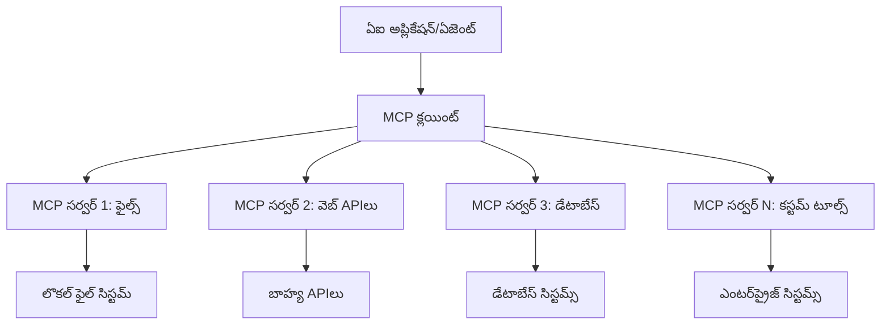

# 🌐 మాడ్యూల్ 2: Microsoft Foundry Toolkit మూలభూతాలతో MCP

[]()
[]()
[]()

## 📋 నేర్చుకునే లక్ష్యాలు

ఈ మాడ్యూల్ చివరికి, మీరు చేయగలుగుతారు:
- ✅ మోడల్ కాన్టెక్స్ట్ ప్రోటోకాల్ (MCP) వాస్తవ నిర్మాణం మరియు లాభాలు అర్థం చేసుకోవడం
- ✅ Microsoft యొక్క MCP సర్వర్ ఎకోసిస్టమ్‌ను అన్వేషించడం
- ✅ MCP సర్వర్లను Microsoft Foundry Toolkit Agent Builderతో ఏకం చేయడం
- ✅ Playwright MCP ఉపయోగించి ఫంక్షనల్ బ్రౌజర్ ఆటోమేషన్ ఏజెంట్ నిర్మించడం
- ✅ మీ ఏజెంట్లలో MCP టూల్స్‌ను కాన్ఫిగర్ చేసి పరీక్షించడం
- ✅ ఉత్పత్తి ఉపయోగానికి MCP-చేయు ఏజెంట్లను ఎగుమతి చేసి అమలు చేయడం

## 🎯 మాడ్యూల్ 1 పైన నిర్మించడం

మాడ్యూల్ 1లో, మేము Microsoft Foundry Toolkit మూలభూతాలను నేర్చుకుని మా మొదటి Python ఏజెంట్ సృష్టించాము. ఇప్పుడు మేము మీ ఏజెంట్లను విప్లవాత్మకమైన **మోడల్ కాన్టెక్స్ట్ ప్రోటోకాల్ (MCP)** ద్వారా బాహ్య టూల్లు మరియు సేవలతో **పరిపూర్ణంగా** সংযোগం చేస్తాము.

దీన్ని ఒక ప్రాథమిక కాలిక్యులేటర్ నుంచి పూర్తిగాకంప్యూటర్‌కు అప్గ్రేడ్ చేశారని భావించండి - మీ AI ఏజెంట్లు ఈ సామర్థ్యాలు పొందుతాయి:
- 🌐 వెబ్‌సైట్లను బ్రౌజింగ్ చేసి పరస్పరం చేయడం
- 📁 ఫైల్స్‌కు యాక్సెస్ మరియు నిర్వహణ
- 🔧 ఎంటర్ప్రైజ్ సిస్టమ్స్‌తో ఏకీకరణ
- 📊 APIs నుండి రియల్‌టైమ్ డేటాను ప్రాసెస్ చేయడం

## 🧠 మోడల్ కాన్టెక్స్ట్ ప్రోటోకాల్ (MCP) అర్థం చేసుకోండి

### 🔍 MCP అంటే ఏమిటి?

మోడల్ కాన్టెక్స్ట్ ప్రోటోకాల్ (MCP) అనేది **"AI అనువర్తనాల కోసం USB-C"** - ఇది ఒక విప్లవాత్మకమైన ఓపెన్ స్టాండర్డ్, ఇది పెద్ద భాషా నమూనాలు (LLMs) ను బాహ్య టూల్స్, డేటా మూలాలు మరియు సేవలతో కనెక్ట్ చేస్తుంది. USB-C ఒకే యూనివర్స్ కనెక్టర్ అందించి కేబుల్ గందరగోళాన్ని తొలగించినట్లే, MCP కూడా AI ఏకీకరణ సంక్లిష్టతను ఒక మాన్యమైన ప్రోటోకాల్ తో తొలగిస్తుంది.

### 🎯 MCP ఎలాంటి సమస్యలను పరిష్కరిస్తుంది

**MCP ముందు:**
- 🔧 ప్రతి టూల్ కోసం అనుకూల ఏకీకరణలు
- 🔄 ప్రైవేటు సొల్యూషన్లతో విక్రేత లాక్-ఇన్  
- 🔒 ఎటువంటి ముందస్తు శ్రద్ధ లేకుండా కనెక్షన్ల వలన భద్రతా లోపాలు
- ⏱️ ప్రాథమిక ఏకీకరణలకు నెలల్లో అభివృద్ధి

**MCPతో:**
- ⚡ ప్లగ్-అండ్-ప్లే టూల్ ఏకీకరణ
- 🔄 విక్రేత-ఆగ్నోస్టిక్ వాస్తవ నిర్మాణం
- 🛡️ అంతర్భాగంగా భద్రతా ఉత్తమ ఆచారాలు
- 🚀 కొత్త సామర్ధ్యాలను కొన్ని నిమిషాల్లో జోడించడం

### 🏗️ MCP వాస్తవ నిర్మాణం లోతైన అవగాహన

MCP అనేది **క్లయింట్-సర్వర్ వాస్తవ నిర్మాణం** లక్షణాన్ని అనుసరిస్తుంది, ఇది ఒక భద్రతపరమైన, స్కేలబుల్ ఎకోసిస్టమ్ ను సృష్టిస్తుంది:



**🔧 ప్రధాన భాగాలు:**

| భాగం | పాత్ర | ఉదాహరణలు |
|-----------|------|----------|
| **MCP హోస్టులు** | MCP సేవలను వినియోగించే అనువర్తనాలు | Claude Desktop, VS Code, Microsoft Foundry Toolkit |
| **MCP క్లయింట్లు** | ప్రోటోకాల్ హ్యాండ్లర్లు (ప్రతి సర్వర్‌కు 1:1) | హోస్ట్ అనువర్తనాల్లో నిర్మించబడినవి |
| **MCP సర్వర్లు** | ప్రామాణిక ప్రోటోకాల్ ద్వారా సామర్థ్యాలు అందించడం | Playwright, Files, Azure, GitHub |
| **ట్రాన్స్‌పోర్ట్ లేయర్** | కమ్యూనికేషన్ పద్ధతులు | stdio, HTTP, WebSockets |


## 🏢 Microsoft యొక్క MCP సర్వర్ ఎకోసిస్టమ్

మైక్రోసాఫ్ట్ MCP ఎకోసిస్టమ్ నడిపే సహజమైన సంస్థాపన తరహా సర్వర్ల సమితితో ఉంటుంది, ఇవి నిజమైన వ్యాపార సమస్యలకు పరిష్కారాలను అందిస్తాయి.

### 🌟 ప్రసిద్ధ Microsoft MCP సర్వర్లు

#### 1. ☁️ Azure MCP సర్వర్
**🔗 రిపోజిటరీ**: [azure/azure-mcp](https://github.com/azure/azure-mcp)
**🎯 ఉద్దేశ్యం**: AI ఏకీకరణతో సమగ్ర Azure వనరుల నిర్వహణ

**✨ ముఖ్య లక్షణాలు:**
- ప్రకటనాత్మక మౌలిక సదుపాయం ప్రావిజనింగ్
- రియల్-టైమ్ వనరు మానిటరింగ్
- ఖర్చుల ఆప్టిమైజేషన్ సిఫార్సులు
- భద్రతా అనుగుణత తనిఖీలు

**🚀 ఉపయోగాలు:**
- AI సహాయంతో Infrastructure-as-Code
- ఆటోమేటిక్ వనరు స్కేలింగ్
- క్లౌడ్ ఖర్చు ఆప్టిమైజేషన్
- DevOps వర్క్ఫ్లో ఆటోమేషన్

#### 2. 📊 Microsoft Dataverse MCP
**📚 డాక్యుమెంటేషన్**: [Microsoft Dataverse Integration](https://go.microsoft.com/fwlink/?linkid=2320176)
**🎯 ఉద్దేశ్యం**: వ్యాపార డేటాకు సహజ భాషా ఇంటర్ఫేస్

**✨ ముఖ్య లక్షణాలు:**
- సహజ భాష డేటాబేస్ క్వెరీస్
- వ్యాపార కాన్టెక్స్ట్ అర్థం చేసుకోవడం
- అనుకూల ప్రమ్ప్ట్ టెంప్లేట్లు
- సంస్థ డేటా పరిపాలన

**🚀 ఉపయోగాలు:**
- వ్యాపార ఇంటెలిజెన్స్ నివేదికలు
- కస్టమర్ డేటా విశ్లేషణ
- విక్రయ రవాణా అవగాహన
- అనుగుణతా డేటా క్వెరిస్తులు

#### 3. 🌐 Playwright MCP సర్వర్
**🔗 రిపోజిటరీ**: [microsoft/playwright-mcp](https://github.com/microsoft/playwright-mcp)
**🎯 ఉద్దేశ్యం**: బ్రౌజర్ ఆటోమేషన్ మరియు వెబ్ పరస్పర చర్యల సామర్థ్యాలు

**✨ ముఖ్య లక్షణాలు:**
- క్రాస్-బ్రౌజర్ ఆటోమేషన్ (Chrome, Firefox, Safari)
- తెలివైన అంశ గుర్తింపు
- స్క్రీన్‌షాట్ మరియు PDF సృష్టి
- నెట్‌వర్క్ ట్రాఫిక్ మానిటరింగ్

**🚀 ఉపయోగాలు:**
- ఆటోమేటెడ్ టెస్టింగ్ వర్క్‌ఫ్లోస్
- వెబ్ స్క్రాపింగ్ మరియు డేటా తీయటం
- UI/UX మానిటరింగ్
- పోటీ విశ्लेषణ ఆటోమేషన్

#### 4. 📁 Files MCP సర్వర్
**🔗 రిపోజిటరీ**: [microsoft/files-mcp-server](https://github.com/microsoft/files-mcp-server)
**🎯 ఉద్దేశ్యం**: తెలివైన ఫైల్ సిస్టమ్ ఆపరేషన్లు

**✨ ముఖ్య లక్షణాలు:**
- ప్రకటనాత్మక ఫైల్ నిర్వహణ
- కంటెంట్ సింక్రనైజేషన్
- వెర్షన్ కంట్రోల్ ఏకీకరణ
- మెటాడేటా దిగుమతి

**🚀 ఉపయోగాలు:**
- డాక్యుమెంటేషన్ నిర్వహణ
- కోడ్ రిపోజిటరీ నిర్వహణ
- కంటెంట్ ప్రచురణ వర్క్‌ఫ్లోస్
- డాటా పైప్లైన్ ఫైల్ హ్యాండ్లింగ్

#### 5. 📝 MarkItDown MCP సర్వర్
**🔗 రిపోజిటరీ**: [microsoft/markitdown](https://github.com/microsoft/markitdown)
**🎯 ఉద్దేశ్యం**: అభివృద్ధిగల Markdown ప్రాసెసింగ్ మరియు మానిప్యులేషన్

**✨ ముఖ్య లక్షణాలు:**
- సమృద్ధమైన Markdown పార్సింగ్
- ఫార్మాట్ మార్పిడి (MD ↔ HTML ↔ PDF)
- కంటెంట్ నిర్మాణ విశ్లేషణ
- టెంప్లేట్ ప్రాసెసింగ్

**🚀 ఉపయోగాలు:**
- సాంకేతిక డాక్యుమెంటేషన్ వర్క్‌ఫ్లోస్
- కంటెంట్ మేనేజ్‌మెంట్ సిస్టమ్స్
- నివేదిక తీయడం
- జ్ఞాన బేస్ ఆటోమేషన్

#### 6. 📈 Clarity MCP సర్వర్
**📦 ప్యాకేజీ**: [@microsoft/clarity-mcp-server](https://www.npmjs.com/package/@microsoft/clarity-mcp-server)
**🎯 ఉద్దేశ్యం**: వెబ్ అనలిటిక్స్ మరియు వినియోగదారు ప్రవర్తన అవగాహనలు

**✨ ముఖ్య లక్షణాలు:**
- హీట్‌మ్యాప్ డేటా విశ్లేషణ
- వినియోగదారు సెషన్ రికార్డింగ్లు
- పనితీరు మెట్రిక్స్
- కన్వర్షన్ ఫన్నెల్ విశ్లేషణ

**🚀 ఉపయోగాలు:**
- వెబ్‌సైట్ ఆప్టిమైజేషన్
- వినియోగదారు అనుభవ పరిశోధన
- A/B టెస్టింగ్ విశ్లేషణ
- వ్యాపార ఇంటెలిజెన్స్ డాష్‌బోర్డులు

### 🌍 కమ్యూనిటీ ఎకోసిస్టమ్

Microsoft సర్వర్లకు పరంగా, MCP ఎకోసిస్టమ్‌లో ఉన్నాయి:
- **🐙 GitHub MCP**: రిపోజిటరీ నిర్వహణ మరియు కోడ్ విశ్లేషణ
- **🗄️ డేటాబేస్ MCPs**: PostgreSQL, MySQL, MongoDB ఏకీకరణలు
- **☁️ క్లౌడ్ ప్రొవైడర్ MCPs**: AWS, GCP, Digital Ocean టూల్స్
- **📧 కమ్యూనికేషన్ MCPs**: Slack, Teams, ఇమెయిల్ ఏకీకరణలు

## 🛠️ హ్యాండ్స్-ఆన్ ప్రయోగశాల: బ్రౌజర్ ఆటోమేషన్ ఏజెంట్ నిర్మించడం

**🎯 ప్రాజెక్ట్ లక్ష్యం**: Playwright MCP సర్వర్ ఉపయోగించి తెలివైన బ్రౌజర్ ఆటోమేషన్ ఏజెంట్ సృష్టించడం, ఇది వెబ్‌సైట్లను నావిగేట్ చేసి, సమాచారం తీయగలుగుతుంది మరియు క్లిష్టమైన వెబ్ పరస్పర చర్యలు చేయగలదు.

### 🚀 దశ 1: ఏజెంట్ ఫౌండేషన్ సెటప్

#### స్టెప్ 1: మీ ఏజెంట్‌ను ప్రారంభించండి
1. **Microsoft Foundry Toolkit Agent Builder ను ఓపెన్ చేయండి**
2. క్రింది కాన్ఫిగరేషన్ తో **కొత్త ఏజెంట్ సృష్టించండి**:
   - **పేరు**: `BrowserAgent`
   - **మోడల్**: GPT-4o தேர்வு చేసుకోండి


### 🔧 దశ 2: MCP ఏకీకరణ వర్క్‌ఫ్లో

#### స్టెప్ 3: MCP సర్వర్ ఏకీకరణ జోడించండి
1. Agent Builderలో **Tools విభాగానికి వెళ్లండి**
2. **"Add Tool"** క్లిక్ చేసి ఏకీకరణ మెనూను తెరవండి
3. అందుబాటులో ఉన్న ఎంపికలలో నుండి **"MCP Server"** ఎంచుకోండి


**🔍 టూల్ రకాల అవగాహన:**
- **Built-in Tools**: ముందుగా కాన్ఫిగర్డ్ Microsoft Foundry Toolkit ఫంక్షన్లు
- **MCP Servers**: బాహ్య సేవ ఏకీకరణలు
- **Custom APIs**: మీ సొంత సేవ endpoints
- **Function Calling**: డైరెక్ట్ మోడల్ ఫంక్షన్ యాక్సెస్

#### స్టెప్ 4: MCP సర్వర్ ఎంపిక
1. ముందుకు రావడానికి **"MCP Server"** ఎంపికను ఎంచుకోండి


2. అందుబాటులో ఉన్న ఏకీకరణలను అధ్యయనం చేయడానికి MCP క్యాటలాగ్ బ్రౌజ్ చేయండి


### 🎮 దశ 3: Playwright MCP కాన్ఫిగరేషన్

#### స్టెప్ 5: Playwright ఎంచుకుని కాన్ఫిగర్ చేయండి
1. Microsoft యొక్క ఆమోదించబడిన సర్వర్లను యాక్సెస్ చేయడానికి **"Use Featured MCP Servers"** క్లిక్ చేయండి
2. లిస్టులో నుండి **"Playwright"** ఎంచుకోండి
3. డిఫాల్ట్ MCP IDను అంగీకరించండి లేదా మీ పరిసరానికి అనుగుణంగా మార్చుకోండి


#### స్టెప్ 6: Playwright సామర్థ్యాలను ఎనేబుల్ చేయండి
**🔑 ముఖ్యమైన దశ**: గరిష్ట కార్యాచరణ కొరకు అందుబాటులో ఉన్న అన్ని Playwright పద్ధతులను ఎంచుకోండి


**🛠️ అవసరమైన Playwright టూల్స్:**
- **నావిగేషన్**: `goto`, `goBack`, `goForward`, `reload`
- **ఇంటరాక్షన్**: `click`, `fill`, `press`, `hover`, `drag`
- **ఎక్స్‌ట్రాక్షన్**: `textContent`, `innerHTML`, `getAttribute`
- **వాలిడేషన్**: `isVisible`, `isEnabled`, `waitForSelector`
- **క్యాప్చర్**: `screenshot`, `pdf`, `video`
- **నెట్‌వర్క్**: `setExtraHTTPHeaders`, `route`, `waitForResponse`

#### స్టెప్ 7: ఏకీకరణ విజయాన్ని ధృవీకరించండి
**✅ విజయ సూచనలు:**
- Agent Builder ఇంటర్‌ఫేస్‌లో అన్ని టూల్స్ కనిపిస్తాయి
- ఏకీకరణ ప్యానెల్లో ఎటువంటి లోపాలు లేవు
- Playwright సర్వర్ స్థితి "Connected" గా చూపిస్తుంది


**🔧 సంఘటన సమస్యల పరిష్కారం:**
- **కనెక్షన్ నెఫలు**: ఇంటర్నెట్ కనెక్టివిటీ మరియు ఫైర్వాల్ సెట్టింగులు తనిఖీ చేయండి
- **టూల్స్ గనకపోవడం**: సెటప్ సమయంలో అన్ని సామర్థ్యాలు ఎంచుకున్నాయో లేదో నిర్ధారించుకోండి
- **అనుమతి పొరపాట్లు**: VS Code కు అవసరమైన సిస్టం అనుమతులు ఉన్నాయో చూడండి

### 🎯 దశ 4: అధునాతన ప్రమ్ప్ట్ ఇంజనీరింగ్

#### స్టెప్ 8: తెలివైన సిస్టమ్ ప్రమ్ప్ట్‌లను డిజైన్ చేయండి
Playwright యొక్క సంపూర్ణ సామర్థ్యాలను వినియోగించే సవద్ది ప్రమ్ప్ట్‌లను సృష్టించండి:

```markdown
# Web Automation Expert System Prompt

## Core Identity
You are an advanced web automation specialist with deep expertise in browser automation, web scraping, and user experience analysis. You have access to Playwright tools for comprehensive browser control.

## Capabilities & Approach
### Navigation Strategy
- Always start with screenshots to understand page layout
- Use semantic selectors (text content, labels) when possible
- Implement wait strategies for dynamic content
- Handle single-page applications (SPAs) effectively

### Error Handling
- Retry failed operations with exponential backoff
- Provide clear error descriptions and solutions
- Suggest alternative approaches when primary methods fail
- Always capture diagnostic screenshots on errors

### Data Extraction
- Extract structured data in JSON format when possible
- Provide confidence scores for extracted information
- Validate data completeness and accuracy
- Handle pagination and infinite scroll scenarios

### Reporting
- Include step-by-step execution logs
- Provide before/after screenshots for verification
- Suggest optimizations and alternative approaches
- Document any limitations or edge cases encountered

## Ethical Guidelines
- Respect robots.txt and rate limiting
- Avoid overloading target servers
- Only extract publicly available information
- Follow website terms of service
```

#### స్టెప్ 9: డైనమిక్ యూజర్ ప్రమ్ప్ట్‌లను సృష్టించండి
వివిధ సామర్థ్యాలను ప్రదర్శించే ప్రమ్ప్ట్‌లను రూపొందించండి:

**🌐 వెబ్ అనాలిసిస్ ఉదాహరణ:**
```markdown
Navigate to github.com/kinfey and provide a comprehensive analysis including:
1. Repository structure and organization
2. Recent activity and contribution patterns  
3. Documentation quality assessment
4. Technology stack identification
5. Community engagement metrics
6. Notable projects and their purposes

Include screenshots at key steps and provide actionable insights.
```


### 🚀 దశ 5: అమలు మరియు పరీక్ష

#### స్టెప్ 10: మీ మొదటి ఆటోమేషన్‌ను అమలు చేయండి
1. ఆటోమేషన్ సీక్వెన్స్ ప్రారంభించడానికి **"Run"** క్లిక్ చేయండి
2. రియల్-టైమ్ అమలును మానిటర్ చేయండి:
   - Chrome బ్రౌజర్ ఆటోమేటిగాఓపెన్ అవుతుంది
   - ఏజెంట్ లక్ష్య వెబ్‌సైట్‌కు నావిగేట్ అవుతుంది
   - ప్రతి ప్రాముఖ్య దశకు స్క్రీన్‌షాట్లు తీసుకుంటుంది
   - విశ్లేషణ ఫలితాలు రియల్-టైమ్‌లో ప్రసారం అవుతాయి


#### స్టెప్ 11: ఫలితాలు మరియు అవగాహనలను విశ్లేషించండి
Agent Builder ఇంటర్‌ఫేస్‌లో సమగ్ర విశ్లేషణను సమీక్షించండి:


### 🌟 దశ 6: ఆధునాతన సామర్థ్యాలు మరియు అమలు

#### స్టెప్ 12: ఎగుమతి చేసి ఉత్పత్తి అమలు చేయండి
Agent Builder అనేక అమలు ఎంపికలను మద్దతు ఇస్తుంది:


## 🎓 మాడ్యూల్ 2 సారాంశం & తదుపరి దశలు

### 🏆 సాధన సాధించారు: MCP ఏకీకరణ మాస్టర్

**✅ నైపుణ్యాలు సాధించబడ్డాయి:**
- [ ] MCP వాస్తవ నిర్మాణం మరియు లాభాలు అర్థం చేసుకోవడం
- [ ] Microsoft యొక్క MCP సర్వర్ ఎకోసిస్టమ్ లో నావిగేట్ చేయడం
- [ ] Playwright MCP ను Microsoft Foundry Toolkit తో ఏకీకరించడం
- [ ] సంక్లిష్ట బ్రౌజర్ ఆటోమేషన్ ఏజెంట్ల నిర్మాణం
- [ ] వెబ్ ఆటోమేషన్ కోసం అధునాతన ప్రమ్ప్ట్ ఇంజనీరింగ్

### 📚 అదనపు వనరులు

- **🔗 MCP స్పెసిఫికేషన్**: [అధికారిక ప్రోటోకాల్ డాక్యుమెంటేషన్](https://modelcontextprotocol.io/)
- **🛠️ Playwright API**: [సంపూర్ణ పద్ధతి సూచిక](https://playwright.dev/docs/api/class-playwright)
- **🏢 Microsoft MCP సర్వర్లు**: [ఎంటర్ప్రైజ్ ఏకీకరణ గైడ్](https://github.com/microsoft/mcp-servers)
- **🌍 కమ్యూనిటీ ఉదాహరణలు**: [MCP సర్వర్ గ్యాలరీ](https://github.com/modelcontextprotocol/servers)

**🎉 అభినందనలు!** మీరు MCP ఏకీకరణలో విజయవంతంగా నైపుణ్యం సంపాదించారు మరియు ఇప్పుడు బాహ్య టూల్ సామర్థ్యాలతో ఉత్పత్తి సిద్ధమైన AI ఏజెంట్లను నిర్మించగలరు!

### 🔜 తదుపరి మాడ్యూల్‌కు కొనసాగండి

మీ MCP నైపుణ్యాలను మరింత అభివృద్ధి చేసుకోవడానికి సిద్దంగా ఉన్నారా? **[మాడ్యూల్ 3: Microsoft Foundry Toolkit తో అడ్వాన్స్డ్ MCP డెవలప్‌మెంట్](../lab3/README.md)** కు ముందుకు వెళ్ళండి, అక్కడ మీరు నేర్చుకుంటారు:
- మీ సొంత కస్టమ్ MCP సర్వర్లను సృష్టించడం
- తాజా MCP Python SDKని కాన్ఫిగర్ చేసి ఉపయోగించడం
- డీబగ్గింగ్ కోసం MCP ఇన్స్పెక్టర్ సెటప్ చేయడం
- అధునాతన MCP సర్వర్ డెవలప్‌మెంట్ వర్క్‌ఫ్లోస్ నిపుణమవడం
- మొదలైన Weather MCP సర్వర్‌ను నెమ్మదిగా నిర్మించడం

---

<!-- CO-OP TRANSLATOR DISCLAIMER START -->
**అస్వీకరణ**:
ఈ పత్రం AI అనువాద సేవ [Co-op Translator](https://github.com/Azure/co-op-translator) ఉపయోగించి అనువదించబడింది. మేము ఖచ్చితత్వానికి ప్రయత్నిస్తున్నప్పటికీ, ఆటోమేటెడ్ అనువాదాలు తప్పులు లేదా అసమగ్రతలను కలిగి ఉండవచ్చు. దాని స్వదేశ భాషలో ఉన్న అసలు పత్రాన్ని అధికారం కలిగిన మూలంగా పరిగణించాలి. కీలకమైన సమాచారం కోసం, ప్రొఫెషనల్ మానవ అనువాదాన్ని సిఫారసు చేస్తాము. ఈ అనువాదం ఉపయోగం వల్ల కలిగే ఏవైనా అపార్థాలు లేదా తప్పుదారులు కోసం మేము బాధ్యత వహించము.
<!-- CO-OP TRANSLATOR DISCLAIMER END -->