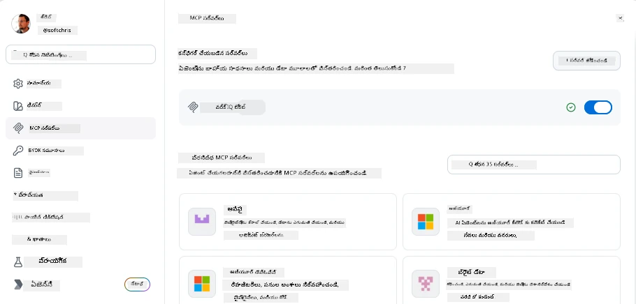
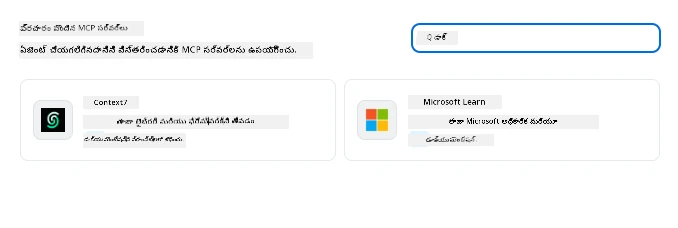
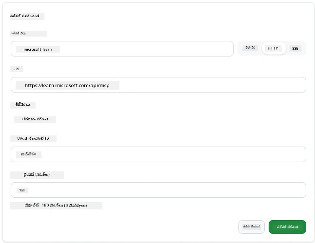
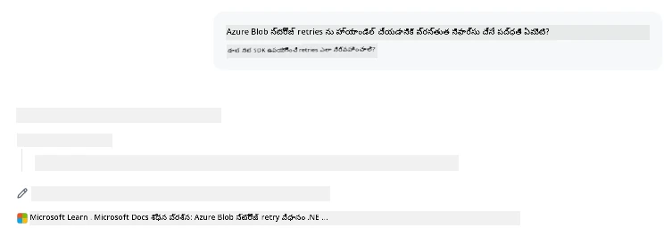
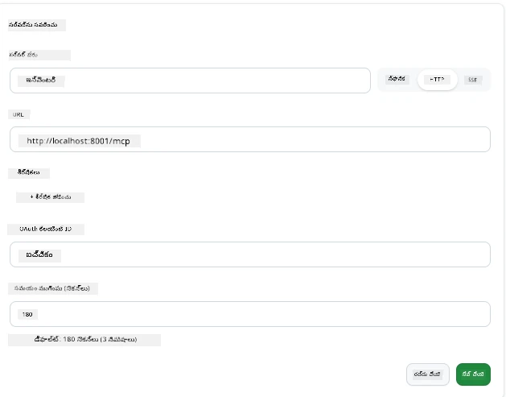
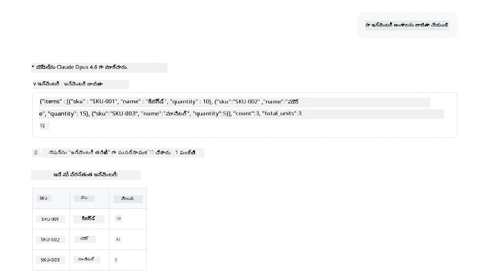
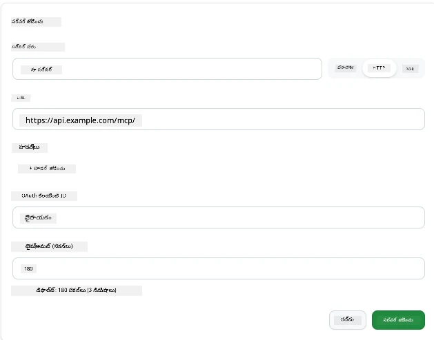
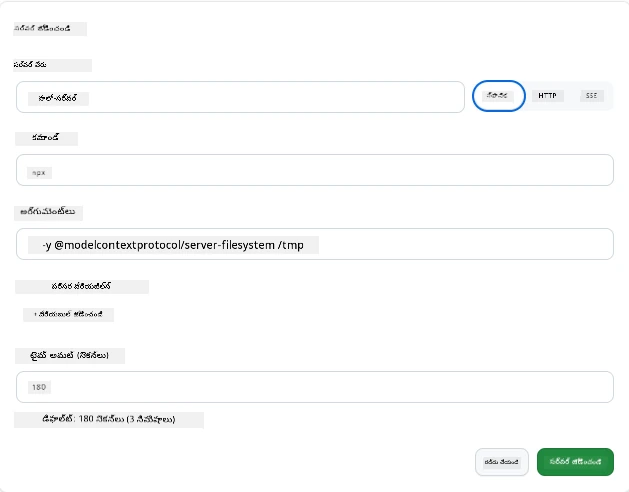

# GitHub Copilot యాప్‌లో MCP సర్వర్‌లను ఉపయోగించడం

ఈ దాకా మీరు MCP ఎలా పని చేస్తుందని తెలుసుకున్నారు. మీరు సర్వర్‌లను నిర్మించారు, టూల్స్ మరియు వనరులను నిర్వచించారు, మరియు క్లయింట్లను కనెкт్ చేసారు. కానీ ఇప్పటి వరకు మనం ఒక దృక్పథం మార్పు చేయలేదు: మీరు సర్వర్‌ను నిర్మించేవారు కాకుండా, MCP మద్దతు చేసే AI-పవర్డ్ యాప్ వినియోగదారునిగా ఉండటం ఎలా ఉంటుంది?

[GitHub Copilot యాప్](https://github.com/github/app) ఒక డెస్క్‌టాప్ యాప్, ఇది MCP సర్వర్‌లను ఉపయోగించగలదు. MCP సర్వర్‌లను దానికి కనెక్ట్ చేస్తే, మీరు కొత్త స్థాయి అందుకుంటారు: Copilot ఇప్పుడు మీ డాక్యుమెంటేషన్‌లోకి చేరగలదు, మీ అంతర్గత APIs ని పిలవగలదు, మీ డేటాబేస్‌ని క్వెరీ చేయగలదు, లేదా మీరు సర్వర్‌గా చుట్టిన ఏ సేవతోనైనా మాటాడగలదు. యాప్ ఆతిథ్యం ఇస్తుంది; మీ MCP సర్వర్లు దాని టూల్స్ అయిపోతాయి.

ఈ పాఠం ఆ అనుభవాన్ని ప్రారంభం నుండి చివరి వరకు నడిపిస్తుంది—MCP సెట్టింగ్స్ ప్యానెల్ కనుగొనడం నుండి ఒక నిజమైన డాక్యుమెంటేషన్ సర్వర్‌ని కనెక్ట్ చేయడం మరియు తర్వాత మీ స్వంత కస్టమ్ సర్వర్‌ను వయిర్ చేయడం వరకు.

## నేర్చుకునే లక్ష్యాలు

ఈ పాఠం ముగిసే వరకూ మీరు చేయగలరు:

- Copilot యాప్ సెట్టింగ్స్‌లో MCP సర్వర్స్ ప్యానెల్‌ను కనుగొనడం మరియు నావిగేట్ చేయడం.
- హోస్టెడ్ డాక్యుమెంటేషన్ సర్వర్‌ను కనెక్ట్ చేసి సెషన్‌లో ఉపయోగించడం.
- ఒక కస్టమ్ సర్వర్‌ను నమోదుచేసి Copilot దాని టూల్స్‌ను పిలవగలదని నిర్ధారించడం.
- సర్వర్‌ను పిలవడానికి అవసరమైతే పర్యావరణ వేరియబుల్స్ లేదా కస్టమ్ హెడ్డర్లు ఎలా అందించాలో (HTTP అయితే) కాన్ఫిగర్ చేయడం.

## MCP హోస్ట్‌గా Copilot యాప్

మూల భావన ఇదే: **Copilot యొక్క ఏజెంట్లు తెలివిగా ఉన్నా, వారు మీ చెప్పే దాని మేరకు మాత్రమే తెలుసుకుంటారు.** డిఫాల్ట్‌గా, ఏజెంట్ మీ వర్క్‌స్పేస్‌లో ఫైల్స్ చదవగలదు మరియు టెర్మినల్ కమాండ్లు అమలు చేయగలదు, కానీ అది మీ డేటాబేస్‌ను క్వెరీ చేయలేడు, క్యాలెండర్ ని చూడలేడు లేదా సహాయం లేకుండా ఒక కస్టమ్ APIని పిలవలేడు. అక్కడ MCP సర్వర్‌లు వస్తాయి. అవి Copilot మరియు మీ సిస్టమ్స్‌—డేటాబేస్‌లు, వెర్షన్ కంట్రోల్, APIs, డిజైన్ టూల్స్—మధ్య వంతెనలుగా పనిచేస్తాయి, ఏజెంట్లకు పనిని పూర్తి చేసేందుకు అవసరమైన సమాచారం మరియు చర్యలకు ప్రాప్తిని ఇస్తుంది.

మీ యాప్ యొక్క MCP సర్వర్‌లను నిర్వహించేందుకు ఆ సెట్టింగ్స్ కనుగొనేందుకు మొదలుపెడదాం.

## దశ 1: MCP సెట్టింగ్స్ ప్యానెల్ కనుగొనడం

Copilot యాప్ ఓపెన్ చేసి ఎడమ దిగువలో ఉన్న కోగ్ చిహ్నాన్ని కనుగొని దానిపై క్లిక్ చేయండి.


"MCP Servers" ను ఎంచుకున్నారా అని నిర్ధారించుకోండి, ఇప్పుడు మీ ఇప్పటికే కాన్ఫిగర్ చేసిన సర్వర్స్ టాప్‌లో కనిపిస్తాయి, దిగువన ప్రజాదరణ పొందిన సర్వర్‌ల మార్కెట్ప్లేస్ ఉంటుంది, మరియు ఎడమ పైభాగంలో "Add Server" బటనూ కనిపిస్తుంది.



ఈ కేంద్రమే మీ నియంత్రణ కేంద్రం. మీరు ఇక్కడ సర్వర్‌లను జోడించవచ్చు, తొలగించవచ్చు, ఎనేబుల్ లేదా డిసేబుల్ చేయవచ్చు. మార్పులు కొత్త సెషన్‌లకు ప్రభావితం అవుతాయి; మీరు ఓపెన్‌లో సెషన్ ఉన్నట్లయితే, ఈ జాబితాను మార్చిన తర్వాత కొత్త సెషన్ ప్రారంభించాలి.

## దశ 2: డాక్యుమెంటేషన్ సర్వర్‌ను కనెక్ట్ చేయడం

తక్షణం ఉపయోగపడే దానితో మొదలువద్దాం. Microsoft Docs MCP సర్వర్ Copilot కి అధికారిక Microsoft డాక్స్ యాక్సెస్ ఇస్తుంది. దీనిలో Azure, .NET, TypeScript, మరియు మరెన్నో ఉన్నాయి. ఏజెంట్ తన శిక్షణ డేటా మీద ఆధారపడకుండా (బదులుగా అది మూడొడ్డి గడువు ఉన్నది), అడిగే సమయంలో ప్రస్తుత డాక్స్‌ని తీసుకురాగలదు.

దీనిని జోడించే విధానం ఇలా ఉంది:

1. ప్రజాదరణ సర్వర్లు గ్రిడ్‌లో **learn** అని టైప్ చేసి, "Microsoft Learn" అనబడే సర్వర్‌ను ఎంచుకోండి.

   

   క్లిక్ చేయగానే, పేరు, ట్రాన్స్‌పోర్ట్ టైప్ మరియు URL ముందుగానే పోషించబడిన ఫారం కనిపిస్తుంది, మిగిలేది "Add Server" క్లిక్ చేయడం మాత్రమే.

2. "Add Server" క్లిక్ చేయండి, సర్వర్ కనెక్ట్ కావడానికి కొన్ని సెకన్లు పడుతుంది.

   

   జోడించిన తర్వాత, ఇది టాప్ ప్రాంతంలో ఒక కాన్ఫిగర్ చేసిన సర్వర్‌గా చూపిస్తుంది. ఇప్పుడు దీన్ని ప్రయత్నించుకుందాం.

3. డైలాగ్ మూసి, Quick chat ఎంచుకోండి.

4. క్రింద ఇచ్చిన ప్రాంప్ట్‌ని టైప్ చేసి Microsoft Learn సర్వర్‌పై ఒక టూల్‌ని ట్రిగర్ చేయండి.

   ```text
   What's the current recommended approach for handling Azure Blob Storage 
   retries using the .NET SDK?
   ```

   

ఇప్పుడు మీరు జోడించిన MCP సర్వర్ ఎలా సూచించమో చూస్తారు.

## దశ 3: కస్టమ్ stdio సర్వర్‌ను కనెక్ట్ చేయడం

ప్రిసెట్స్ సౌకర్యవంతమైనవి, కానీ నిజమైన శక్తి మీ స్వంత సర్వర్‌లను కనెక్ట్ చెయ్యడంలో ఉంది. మీరు సంస్థ అంతర్గత API లేదా కంపెనీ జ్ఞానస్థానాన్ని ఎక్స్‌పోజ్ చేసే సర్వర్‌ని నిర్మించారనుకుందాం. ఈ సందర్భంలో, మా సంస్థ ఇన్వెంటరీ నిర్వహణను నిర్వహించే MCP సర్వర్‌ను ఉపయోగిస్తాము.

1. కోగ్‌పై క్లిక్ చేసి "MCP servers" మళ్లీ ఎంచుకోండి.

2. "Add Server" బటన్‌ను ఎంచుకొని "+ Add Custom server" ఎంపికపై క్లిక్ చేసి క్రింది విలువలు ఇవ్వండి:

   - పేరు: `Inventory Server`
   - రైట్లో ట్రాన్స్‌పోర్ట్ ఎంచుకోండి, **http**

   "Add Server" ఎంచుకోండి ఇది మీ కాన్ఫిగర్ చేసిన సర్వర్ల జాబితాలో కనిపిస్తుంది.

   

4. దాన్ని పరీక్షించేందుకు, క్రింది విధంగా ప్రాంప్ట్ నడిపండి:

    ```
    list inventory
    ```

   

   ఇప్పుడు మీరు మీ స్వంత నిర్మించిన సర్వర్ నుండి ఇన్వెంటరీ అంశాల జాబితా రావడం చూడగలరు.

అద్భుతం, మీరు ఇప్పుడిప్పుడు Copilot యాప్ కు బహిరంగ మరియు మీ స్వంత MCP సర్వర్‌లను జోడించడం సులభమాయింది. తరువాత, రహస్యాలు మరియు పర్యావరణ వేరియబుల్స్ ఎలా నిర్వహించాలో చూద్దాం.

## దశ 4: అధునాతన సెట్టింగ్స్

ఇప్పటి వరకు, MCP సర్వర్‌లను జోడించటం ఎంటర్ చేసిన పేరు, URL మాత్రమే ఇచ్చి చేసింది. కానీ మీ సర్వర్‌కు API కీ లేదా మరెవరైనా విలువ అవసరమైతే? ట్రాన్స్‌పోర్ట్ టైప్ పై ఆధారపడి, మనం అవసరమైనది అందించొచ్చు.

- **http లేదా SSE ట్రాన్స్‌పోర్ట్**: అవసరమైనట్లయితే హెడ్డర్లు సెట్ చేయవచ్చు.

   అనుమతికి, ఉదాహరణకు మీరు Authorization హెడ్డర్‌ను సూచించవచ్చు. విలువ ఒక స్థిరమైన స్ట్రింగ్ కావచ్చు. OAuth వాడితే, దానికై OAuth క్లయింట్ ID అందించొచ్చు.

   

- **stdio ట్రాన్స్‌పోర్ట్**: పర్యావరణ వేరియబుల్స్ సెట్ చేయవచ్చు.

   ఇక్కడ మీరు మొదలు పెట్టేటప్పుడు సర్వర్‌కు పంపించాల్సిన ఏవైనా పర్యావరణ వేరియబుల్స్‌ను ప్రత్యేకం గా సూచించవచ్చు.

   

## సారాంశం

Copilot యాప్ MCP సర్వర్‌లను ఏజెంట్ సామర్థ్యాల ప్రథమ తరగతి విస్తరణలాగా చూసుకుంటుంది. ఈ పాఠంలో మీరు MCP సర్వర్‌లను జోడించడం నుండి వాటిని సెషన్‌లో ఉపయోగించడం వరకు సర్వప్రయాణాన్ని చూసారు. ఇప్పుడు మీరు ప్రజా సర్వర్‌లు, అంతర్గత APIs, మరియు కస్టమ్ టూల్స్‌కి కనెక్ట్ అవ్వగలరు, ఏజెంట్లు స్వతంత్రంగా పనులు పూర్తి చేసుకోవడానికి అవసరమైన సమాచారం మరియు చర్యలకు ప్రాప్తి పొందగలవు.

## 📚 అదనపు వనరులు

### అధికారిక డాక్యుమెంట్లు

- [GitHub Copilot App](https://github.com/github/app)
- [MCP స్పెసిఫికేషన్](https://modelcontextprotocol.io/specification/2025-03-26) - మోడల్ కాంటెక్స్ట్ ప్రోటోకాల్ స్పెసిఫికేషన్

### కమ్యూనిటీ
- [MCP కమ్యూనిటీ డిస్కార్డ్](https://discord.com/invite/ByRwuEEgH4) - ప్రత్యక్ష చర్చలు
- [GitHub చర్చలు](https://github.com/microsoft/MCP-Server-and-PostgreSQL-Sample-Retail/discussions) - ప్రశ్నలు మరియు పంచుకోవడం
- [Stack Overflow](https://stackoverflow.com/questions/tagged/model-context-protocol) - సాంకేతిక ప్రశ్నలు

---

<!-- CO-OP TRANSLATOR DISCLAIMER START -->
**అస్వీకరణ**:
ఈ పత్రం AI అనువాద సేవ [Co-op Translator](https://github.com/Azure/co-op-translator) ఉపయోగించి అనువదించబడింది. మేము ఖచ్చితత్వానికి ప్రయత్నిస్తున్నప్పటికీ, ఆటోమేటెడ్ అనువాదాలు తప్పులు లేదా అసమగ్రతలను కలిగి ఉండవచ్చు. దాని స్వదేశ భాషలో ఉన్న అసలు పత్రాన్ని అధికారం కలిగిన మూలంగా పరిగణించాలి. కీలకమైన సమాచారం కోసం, ప్రొఫెషనల్ మానవ అనువాదాన్ని సిఫారసు చేస్తాము. ఈ అనువాదం ఉపయోగం వల్ల కలిగే ఏవైనా అపార్థాలు లేదా తప్పుదారులు కోసం మేము బాధ్యత వహించము.
<!-- CO-OP TRANSLATOR DISCLAIMER END -->