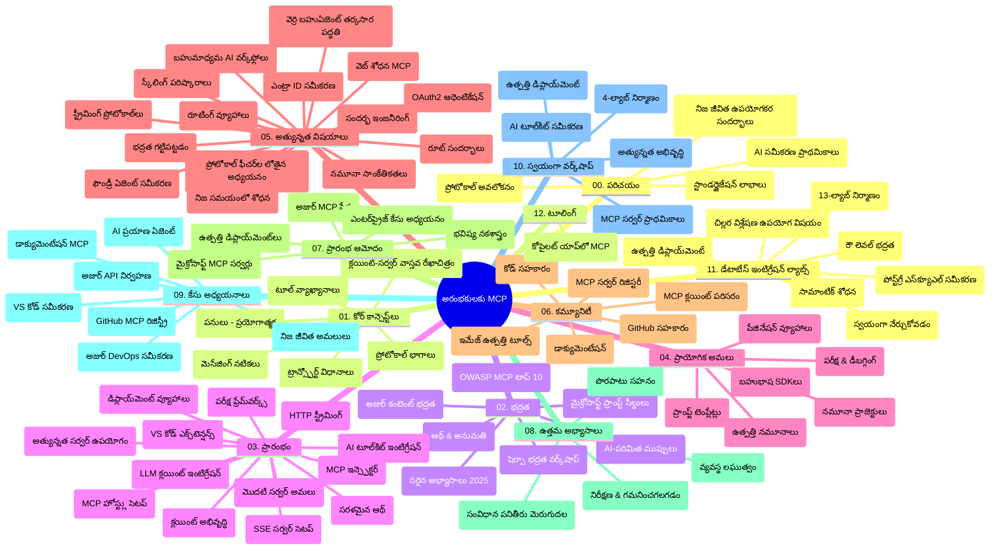

# ప్రారంభकर्तులకు మోడల్ కాంటెక్స్ట్ ప్రోటోకాల్ (MCP) - అధ్యయన మార్గదర్శిని

ఈ అధ్యయన మార్గదర్శిని "మోడల్ కాంటెక్స్ట్ ప్రోటోకాల్ (MCP) ఫర్ బిగినర్స్" పాఠ్యపetano యొక్క రిపోజిటరీ నిర్మాణం మరియు కంటెంట్ మీద ఓవerview ని అందిస్తుంది. రిపోజిటరీని సమర్ధవంతంగా అన్వేషించడానికి మరియు అందుబాటులోనున్న వనరులను గరిష్టంగా ఉపయోగించుకోవడానికి ఈ మార్గదర్శిని ఉపయోగించండి.

## రిపోజిటరీ అవలోకనం

మోడల్ కాంటెక్స్ట్ ప్రోటోకాల్ (MCP) అనేది AI మోడల్స్ మరియు క్లయింట్ అప్లికేషన్ల మధ్య పరస్పర చర్యలకు ఒక ప్రామాణిక రూపరేఖ. ఇది మొదట Anthropic ద్వారా సృష్టించబడింది, ఇప్పుడు MCP అధికారిక GitHub సంస్థ ద్వారా MCP సముదాయం నిర్వహిస్తోంది. ఈ రిపోజిటరీ C#, Java, JavaScript, Python మరియు TypeScript లో ప్రాథమిక కోడ్ ఉదాహరణ‌లతో సహా విస్తృత పాఠ్యపetanoని అందిస్తుంది, ఇది AI అభివృద్ధికర్షకులు, వ్యవస్థ ఆర్కిటెక్ట్‌లకు మరియు సాఫ్ట్‌వేర్ ఇంజనీర్లకు రూపొందించబడింది.

## దృశ్య పాఠ్యపetano నక్శా

## రిపోజిటరీ నిర్మాణం

రిపోజిటరీ MCP యొక్క వివిధ అంశాలపై దృష్టి సారిస్తూ పన్నెండు ప్రధాన విభాగాలలో ఏర్పాటు చేయబడింది:

1. **పరిచయం (00-Introduction/)**
   - మోడల్ కాంటెక్స్ట్ ప్రోటోకాల్ అవలోకనం
   - AI పైప్లైన్లలో ప్రామాణీకరణ ఎందుకు ముఖ్యం
   - ప్రాక్టికల్ వాడుక కేసులు మరియు లాభాలు

2. **ప్రధాన భావాలు (01-CoreConcepts/)**
   - క్లయింట్-సర్వర్ వాస్తవికonstruktion
   - కీలక ప్రోటోకాల్ భాగాలు
   - MCPలో సందేశపు నమూనాలు

3. **భద్రత (02-Security/)**
   - MCP ఆధారిత వ్యవస్థల భద్రతా ముప్పులు
   - అమలు సురక్షితతకు ఉత్తమ పద్ధతులు
   - ప్రమాణీకరణ మరియు అనుమతుల వ్యూహాలు
   - **విశ్లేషణాత్మక భద్రతా డాక్యుమెంటేషన్**:
     - MCP భద్రత ఉత్తమ పద్ధతులు 2025
     - అజూర్ కంటెంట్ సేఫ్టీ అమలు మార్గదర్శిని
     - MCP భద్రత నియంత్రణలు మరియు సాంకేతికతలు
     - MCP ఉత్తమ పద్ధతులు క్విక్ రెఫరెన్స్
   - **ప్రధాన భద్రతా అంశాలు**:
     - ప్రాంప్ట్ ఇంజెక్షన్ మరియు టూల్ విషపూరణ దాడులు
     - సెషన్ హাইজాకింగ్ మరియు గందరగోళంలోని డిప్యూటీ సమస్యలు
     - టోకెన్ పాస్త్రూ దోషాలు
     - అధిక అనుమతులు మరియు యాక్సెస్ కంట్రోల్
     - AI భాగాల సరఫరా గొలుసు భద్రత
     - Microsoft Prompt Shields సమీకరణ

4. **ప్రారంభించడం (03-GettingStarted/)**
   - పరిసర అమరిక మరియు కాన్ఫిగరేషన్
   - ప్రాథమిక MCP సర్వర్లు మరియు కస్టమర్ల సృష్టి
   - ఇప్పటికే ఉన్న అప్లికేషన్లలో ఇంటిగ్రేషన్
   - లో ఉన్న విభాగాలు:
     - మొదటి సర్వర్ అమలు
     - క్లయింట్ అభివృద్ధి
     - LLM క్లయింట్ ఇంటిగ్రేషన్
     - VS కోడ్ ఇంటిగ్రేషన్
     - సర్వర్-సెంట్ ఈవెంట్స్ (SSE) సర్వర్
     - ఆధునిక సర్వర్ వినియోగం
     - HTTP స్ట్రీమింగ్
     - AI టూల్‌కిట్ ఇంటిగ్రేషన్
     - పరీక్షా వ్యూహాలు
     - డిప్లోయ్‌మెంట్ మార్గదర్శిని

5. **ప్రాయోగిక అమలు (04-PracticalImplementation/)**
   - వివిధ ప్రోగ్రామింగ్ భాషలలో SDKలను ఉపయోగించడం
   - డీబగ్గింగ్, పరీక్ష మరియు ధ్రువీకరణ సాంకేతికతలు
   - తిరిగి ఉపయోగించవచ్చునని ప్రాంప్ట్ టెంప్లేట్లు మరియు వర్క్‌ఫ్లోలు రూపొందించడం
   - అమలు ఉదాహరణలతో నమూనా ప్రాజెక్టులు

6. **అడ్వాన్స్డ్ అంశాలు (05-AdvancedTopics/)**
   - కాంటెక్స్ట్ ఇంజనీరింగ్ సాంకేతికతలు
   - Foundry ఏజెంట్ ఇంటిగ్రేషన్
   - బహుళ మోడ్ AI వర్క్‌ఫ్లోలు
   - OAuth2 ప్రమాణీకరణ డెమోలు
   - రియల్-టైమ్ సెర్చ్ సామర్థ్యాలు
   - రియల్-టైమ్ స్ట్రీమింగ్
   - రూట్ కాంటెక్స్ట్ అమలు
   - రౌటింగ్ వ్యూహాలు
   - శాంప్లింగ్ సాంకేతికతలు
   - స్కేలింగ్ దృక్కోణాలు
   - భద్రతా ఆలోచనలు
   - Entra ID భద్రతా సమీకరణ
   - వెబ్ సెర్చ్ సమీకరణ
   - ప్రతిద్వంద్వ బహుళ-ఏజెంట్ కారణాలు (వాద విభేద నమూనాలు)

7. **సముదాయ తోడ్పాట్లు (06-CommunityContributions/)**
   - కోడ్ మరియు డాక్యుమెంటేషన్ లో ఎలా భాగస్వామ్యం చేయాలి
   - GitHub ద్వారా సహకారం
   - సముదాయ ఆధారిత అభివృద్ధులు మరియు అభిప్రాయాలు
   - విభిన్న MCP కస్టమర్లను ఉపయోగించడం (Claude Desktop, Cline, VSCode)
   - ప్రసిద్ధ MCP సర్వర్లతో పని (చిత్ర రూపొందింపు సహా)

8. **ప్రారంభ ఆమోదం పాఠాలు (07-LessonsfromEarlyAdoption/)**
   - వాస్తవ ప్రపంచ అమలలు మరియు విజయం కథలు
   - MCP ఆధారిత పరిష్కారాల నిర్మాణం మరియు ప్రవేశపెట్టడం
   - ధోరణులు మరియు భవిష్యత్తు రోడ్మ్యాప్
   - **Microsoft MCP Servers మార్గదర్శిని**: 10 ప్రొడక్షన్-రెడీ Microsoft MCP సర్వర్ల సమగ్రమైన మార్గదర్శిని:
     - Microsoft Learn Docs MCP Server
     - Azure MCP Server (15+ ప్రత్యేక కనెక్టర్‌లు)
     - GitHub MCP Server
     - Azure DevOps MCP Server
     - MarkItDown MCP Server
     - SQL Server MCP Server
     - Playwright MCP Server
     - Dev Box MCP Server
     - Microsoft Foundry MCP Server
     - Microsoft 365 Agents Toolkit MCP Server

9. **ఉత్తమ పద్ధతులు (08-BestPractices/)**
   - పనితీరు సర్దుబాటు మరియు మెరుగుదల
   - ఫాల్ట్-టాలరెంట్ MCP వ్యవస్థలు రూపొందించడం
   - పరీక్ష మరియు ప్రతిఘటన వ్యూహాలు

10. **కేస్ స్టడీలు (09-CaseStudy/)**
    - MCPలో విభిన్న పరిస్థితుల్లో MCP బహుముఖతను చూపించే **ఏడు సమగ్ర కేస్ స్టడీలు**:
    - **Azure AI ట్రావెల్ ఏజెంట్స్**: Azure OpenAI మరియు AI Searchతో బహుళ ఏజెంట్ నిర్మాణం
    - **Azure DevOps ఇంటిగ్రేషన్**: YouTube డేటా నవీకరణలతో వర్క్‌ఫ్లో ప్రక్రియల ఆటోమేషన్
    - **రియల్-టైమ్ డాక్యుమెంటేషన్ రిట్రీవల్**: Python కన్సోల్ కస్టమర్ మరియు స్ట్రీమింగ్ HTTP
    - **ఇంటరాక్టివ్ అధ్యయన ప్రణాళిక జనరేటర్**: Chainlit వెబ్ అప్లికేషన్ మరియు సంభాషణాత్మక AI
    - **ఇన్-ఎడిటర్ డాక్యుమెంటేషన్**: VS కోడ్ ఇంటిగ్రేషన్ GitHub Copilot వర్క్‌ఫ్లోలతో
    - **Azure API మేనేజ్మెంట్**: MCP సర్వర్ సృష్టితో ఎంటర్‌ప్రైజ్ API ఇంటిగ్రేషన్
    - **GitHub MCP రిజిస్ట్రీ**: బహుళ ఏజెంటిక్ ఇంటిగ్రేషన్ వేదికతో ఎకోసిస్టమ్ అభివృద్ధి
    - ఎంటర్‌ప్రైజ్ ఇంటిగ్రేషన్, అభివృద్ధికర్గా ఉత్పాదకత మరియు ఎకోసిస్టమ్ అభివృద్ధి సమస్యల అమలు ఉదాహరణలు

11. **హ్యాండ్స్-ఆన్ వర్క్‌షాప్ (10-StreamliningAIWorkflowsBuildingAnMCPServerWithAIToolkit/)**
    - MCPను AI టూల్‌కిట్‌తో కలిపిన సమగ్రమైన హ్యాండ్స్-ఆన్ వర్క్‌షాప్
    - AI మోడల్స్ మరియు వాస్తవ ప్రపంచ సాధనాలను అనుసంధానించే నైపుణ్యపూర్వక అప్లికేషన్లు నిర్మించడం
    - ప్రాథమిక అంశాలు, కస్టమ్ సర్వర్ డెవలప్మెంట్ మరియు ప్రొడక్షన్ డిప్లోయ్‌మెంట్ వ్యూహాలను కవర్ చేసే ప్రాక్టికల్ మాడ్యూల్స్
    - **ల్యాబ్ నిర్మాణం**:
      - ల్యాబ్ 1: MCP సర్వర్ ప్రాథమికాలు
      - ల్యాబ్ 2: అడ్వాన్స్డ్ MCP సర్వర్ అభివృద్ధి
      - ల్యాబ్ 3: AI టూల్‌కిట్ ఇంటిగ్రేషన్
      - ల్యాబ్ 4: ప్రొడక్షన్ డిప్లోయ్‌మెంట్ మరియు స్కేలింగ్
    - ల్యాబ్ ఆధారిత నేర్చుకోవడం దశల వారీ సూచనలతో

12. **MCP సర్వర్ డేటాబేస్ ఇంటిగ్రేషన్ ల్యాబులు (11-MCPServerHandsOnLabs/)**
    - పోస్ట్‌గ్రెSQL ఇంటిగ్రేషన్‌తో ప్రొడక్షన్-రిడి MCP సర్వర్లకు సమగ్రమైన 13-ల్యాబ్ నేర్చుకునే మార్గం
    - Zava రిటైల్ వాడుక కేసుతో వాస్తవ ప్రపంచ రిటైల్ విశ్లేషణల అమలు
    - ఎంటర్‌ప్రైజ్-గ్రేడ్ నమూనాలు: రో లెవెల్ సెక్యూరిటీ (RLS), సెమాంటిక్ సెర్చ్ మరియు బహుళ-అధివారం డేటా యాక్సెస్
    - **పూర్తి ల్యాబ్ నిర్మాణం**:
      - **ల్యాబులు 00-03: పునాది** - పరిచయం, వాస్తవికonstruktion, భద్రత, పరిసర అమరిక
      - **ల్యాబులు 04-06: MCP సర్వర్ నిర్మాణం** - డేటాబేస్ డిజైన్, MCP సర్వర్ అమలు, టూల్ అభివృద్ధి
      - **ల్యాబులు 07-09: అధునాతన లక్షణాలు** - సెమాంటిక్ సెర్చ్, పరీక్ష & డీబగ్గింగ్, VS కోడ్ ఇంటిగ్రేషన్
      - **ల్యాబులు 10-12: ప్రొడక్షన్ & ఉత్తమ పద్ధతులు** - డిప్లోయ్‌మెంట్, మానిటరింగ్, ఆప్టిమైజేషన్
    - **సాంకేతిక పరిజ్ఞానం**: FastMCP ఫ్రేమ్‌వర్క్, PostgreSQL, Azure OpenAI, Azure Container Apps, అప్లికేషన్ ఇన్‌సైట్స్
    - **నేర్లొబ్భుతాలు**: ప్రొడక్షన్-రిడి MCP సర్వర్లు, డేటాబేస్ ఇంటిగ్రేషన్ నమూనాలు, AI ఆధారిత విశ్లేషణలు, ఎంటర్‌ప్రైజ్ భద్రత

13. **టూలింగ్ (12-tooling/)**
    - MCPని Copilot అప్లికేషన్ మరియు ఇతర సాధనాలలో ఎలా ఉపయోగించాలో నేర్చుకోండి

## అదనపు వనరులు

రిపోజిటరీకు మద్దతయిన వనరులు ఉన్నవి:

- **Images ఫోల్డర్**: పాఠ్యపetanoలో ఉపయోగించే చిత్రాలు మరియు చిత్రాల సంపుటి
- **అనువాదాలు**: డాక్యుమెంటేషన్ యొక్క బహుభాషా మద్దతు, ఆటోమేటెడ్ అనువాదాలతో
- **ఆధికారిక MCP వనరులు**:
  - [MCP డాక్యుమెంటేషన్](https://modelcontextprotocol.io/)
  - [MCP స్పెసిఫికేషన్](https://spec.modelcontextprotocol.io/)
  - [MCP GitHub రిపోజిటరీ](https://github.com/modelcontextprotocol)

## ఈ రిపోజిటరీని ఎలా ఉపయోగించాలి

1. **అనుక్రమణీయంగా నేర్చుకోవడం**: 00 నుంచి 11 వరకు అధ్యాయాలను క్రమబద్ధంగా అనుసరించండి.
2. **భాష-నిర్ధిష్ట దృష్టి**: మీరు ఇష్టపడే ప్రోగ్రామింగ్ భాషలో అమలుల కోసం నమూనా డైరెక్టరీలను అన్వేషించండి.
3. **ప్రాక్టికల్ అమలు**: పరిసరాన్ని సెట్ అప్ చేసి మొదటి MCP సర్వర్ మరియు క్లయింట్ సృష్టించడానికి "Getting Started" విభాగంతో మొదలుపెట్టు.
4. **అధునాతన అన్వేషణ**: ప్రాథమిక అంశాలపై అవగాహన వచ్చిన తర్వాత, మీ జ్ఞానాన్ని విస్తరించడానికి Advanced Topics లోకి వెళ్లండి.
5. **సముదాయ భాగస్వామ్యం**: MCP సముదాయం GitHub చర్చలు మరియు Discord చానల్స్ ద్వారా చేరండి, నిపుణులు మరియు ఇతర అభివృద్ధికర్లతో కనెక్ట్ అవ్వండి.

## MCP కస్టమర్లు మరియు సాధనాలు

క్రూరిక్యూలం వివిధ MCP కస్టమర్లు మరియు సాధనాలను కవర్ చేస్తుంది:

1. **ఆధికారిక కస్టమర్లు**:
   - Visual Studio Code
   - Visual Studio Code లో MCP
   - Claude Desktop
   - VSCode లో Claude
   - Claude API

2. **సముదాయ కస్టమర్లు**:
   - Cline (టెర్మినల్-ఆధారిత)
   - Cursor (కోడ్ ఎడిటర్)
   - ChatMCP
   - Windsurf

3. **MCP నిర్వహణ సాధనాలు**:
   - MCP CLI
   - MCP మేనేజర్
   - MCP లింకర్
   - MCP రౌటర్

## ప్రసిద్ధ MCP సర్వర్లు

రిపోజిటరీ వివిధ MCP సర్వర్లను పరిచయం చేస్తుంది, అందిలో:

1. **ఆధికారిక Microsoft MCP సర్వర్లు**:
   - Microsoft Learn Docs MCP Server
   - Azure MCP Server (15+ ప్రత్యేక కనెక్టర్లు)
   - GitHub MCP Server
   - Azure DevOps MCP Server
   - MarkItDown MCP Server
   - SQL Server MCP Server
   - Playwright MCP Server
   - Dev Box MCP Server
   - Microsoft Foundry MCP Server
   - Microsoft 365 Agents Toolkit MCP Server

2. **ఆధికారిక రిఫరెన్స్ సర్వర్లు**:
   - Filesystem
   - Fetch
   - Memory
   - Sequential Thinking

3. **చిత్ర రూపొందింపు**:
   - Azure OpenAI DALL-E 3
   - Stable Diffusion WebUI
   - Replicate

4. **డెవలప్‌మెంట్ సాధనాలు**:
   - Git MCP
   - Terminal Control
   - Code Assistant

5. **ప్రత్యేక సర్వర్లు**:
   - Salesforce
   - Microsoft Teams
   - Jira & Confluence

## సహకారం

ఈ రిపోజిటరీ సముదాయం నుండి భాగస్వామ్యాలను స్వాగతిస్తుంది. MCP ఎకోసిస్టమ్ కి సమర్ధవంతంగా సహకరించడానికి సూచనల కొరకు Community Contributions విభాగాన్ని చూడండి.

----

*ఈ అధ్యయన మార్గదర్శిని చివరిసారిగా ఫిబ్రవరి 5, 2026 న నవీకరించబడింది, MCP స్పెసిఫికేషన్ 2025-11-25కి ప్రాతినిధ్యం వహిస్తూ ఈ తేదీకి సంబంధించిన రిపోజిటరీ అవలోకనాన్ని అందిస్తుంది. దీని తరువాత రిపోజిటరీ కంటెంట్ అప్డేట్ కావచ్చు.*

---

<!-- CO-OP TRANSLATOR DISCLAIMER START -->
**అస్వీకరణ**:
ఈ పత్రం AI అనువాద సేవ [Co-op Translator](https://github.com/Azure/co-op-translator) ఉపయోగించి అనువదించబడింది. మేము ఖచ్చితత్వానికి ప్రయత్నిస్తున్నప్పటికీ, ఆటోమేటెడ్ అనువాదాలు తప్పులు లేదా అసమగ్రతలను కలిగి ఉండవచ్చు. దాని స్వదేశ భాషలో ఉన్న అసలు పత్రాన్ని అధికారం కలిగిన మూలంగా పరిగణించాలి. కీలకమైన సమాచారం కోసం, ప్రొఫెషనల్ మానవ అనువాదాన్ని సిఫారసు చేస్తాము. ఈ అనువాదం ఉపయోగం వల్ల కలిగే ఏవైనా అపార్థాలు లేదా తప్పుదారులు కోసం మేము బాధ్యత వహించము.
<!-- CO-OP TRANSLATOR DISCLAIMER END -->