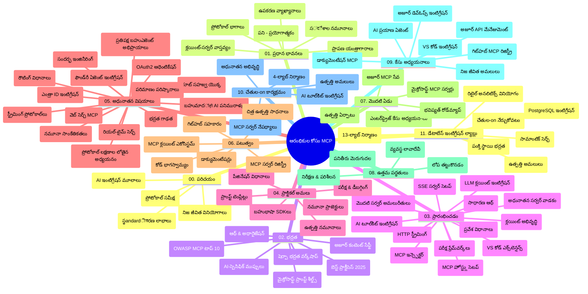

# మోడల్ కాంటెక్స్ట్ ప్రోటోకాల (MCP) ప్రారంభికులకు - అధ్యయన గైడ్

ఈ అధ్యయన గైడ్ "మోడల్ కాంటెక్స్ట్ ప్రోటోకాల (MCP) ప్రారంభికులకు" పాఠ్యक्रमం కోసం నిర్వచించిన రిపాజిటరీ నిర్మాణం మరియు విషయాల సమీక్షను అందిస్తుంది. రిపాజిటరీని సమర్థవంతంగా అన్వేషించడానికి మరియు అందుబాటులో ఉన్న వనరులను ఎక్కువగా ఉపయోగించుకోవటానికి ఈ గైడ్‌ను ఉపయోగించండి.

## రిపాజిటరీ అవలోకనం

మోడల్ కాంటెక్స్ట్ ప్రోటోకాల (MCP) అనేది AI మోడల్స్ మరియు క్లయింట్ అప్లికేషన్ల మధ్య పరస్పర చర్యలకు ఒక ప్రమాణీకరించిన ఫ్రేమ్‌వర్క్. మొదట Anthropic ద్వారా సృష్టించబడిన MCP ను ఇప్పుడు అధికారిక GitHub సంస్థ ద్వారా విస్తృత MCP కమ్యూనిటీ నిర్వహిస్తుంది. ఈ రిపాజిటరీ AI డెవలపర్లు, సిస్టమ్ వాస్తవ్యవేత్తలు మరియు సాఫ్ట్‌వేర్ ఇంజనీర్ల కోసం రూపొందించిన C#, జావా, జావాస్క్రిప్ట్, పైథాన్ మరియు టైప్‌స్క్రిప్ట్ లో చేతితో చేసే కోడ్ ఉదాహరణలతో సమగ్ర పాఠ్యಕ್ರಮాన్ని అందిస్తుంది.

## దೃಷ్య పాఠ్యક્રમ మ్యాప్

## రిపాజిటరీ నిర్మాణం

రిపాజిటరీను ఎగరవారుగా పదకొండు ప్రధాన విభాగాలుగా అమర్చారు, ప్రతి ఒకటి MCP యొక్క వేర్వేరు అంశాల మీద దృష్టి పెడుతుంది:

1. **పరిచయం (00-Introduction/)**
   - మోడల్ కాంటెక్స్ట్ ప్రోటోకాల అవలోకనం
   - AI పైప్‌లైన్లలో ప్రమాణీకరణ ఎందుకు ముఖ్యమో
   - ఉపయోగకరమైన వాడుక సందర్భాలు మరియు లాభాలు

2. **మూల సూత్రాలు (01-CoreConcepts/)**
   - క్లయింట్-సర్వర్ నిర్మాణం
   - ప్రధాన ప్రోటోకాల విషయాలు
   - MCPలో సందేశ పంపిణీ నమూనాలు

3. **భద్రత (02-Security/)**
   - MCP ఆధారిత వ్యవస్థలలో భద్రతా ముప్పులు
   - అమలులకు భద్రత కల్పించే ఉత్తమ ఆచారాలు
   - ధ్రువీకరణ మరియు అనుమతి వ్యూహాలు
   - **సమగ్ర భద్రత పత్రాలు**:
     - MCP భద్రత ఉత్తమ ఆచారాలు 2025
     - Azure కంటెంట్ భద్రత అమలిగంలో గైడ్
     - MCP భద్రత నియంత్రణలు మరియు సాంకేతికతలు
     - MCP ఉత్తమ ఆచారాల త్వరితమార్గదర్శకాలు
   - **ప్రధాన భద్రతా విషయాలు**:
     - ప్రాంప్ట్ ఇంజెక్షన్ మరియు టూల్ పాయిజనింగ్ దాడులు
     - సెషన్ హైజాకింగ్ మరియు గందరగోళంగా ఉన్న డిప్యూటీ సమస్యలు
     - టోకెన్ పాస్త్రూ ఖాతరాలు
     - అధిక అనుమతులు మరియు యాక్సెస్ నియంత్రణ
     - AI భాగాల సరఫరా గొలుసు భద్రత
     - Microsoft ప్రాంప్ట్ షీల్డ్స్ ఇంటిగ్రేషన్

4. **ప్రారంభం (03-GettingStarted/)**
   - పరిసరాలు సెట్ చేసుకోవడం మరియు కాన్ఫిగర్ చేయడం
   - ప్రాథమిక MCP సర్వర్లు మరియు క్లయింట్ల సృష్టి
   - ఉన్న అప్లికేషన్లతో ఇంటిగ్రేషన్
   - లోపల ఉన్నాయి:
     - మొదటి సర్వర్ అమలు
     - క్లయింట్ అభివృద్ధి
     - LLM క్లయింట్ ఇంటిగ్రేషన్
     - VS కోడ్ ఇంటిగ్రేషన్
     - సర్వర్-సెంట్స్ ఈవెంట్స్ (SSE) సర్వర్
     - అభివృద్ధి సర్వర్ వాడకం
     - HTTP స్ట్రీమింగ్
     - AI టూల్‌కిట్ ఇంటిగ్రేషన్
     - తనిఖీకి వ్యూహాలు
     - డిప్లాయ్‌మెంట్ మార్గదర్శకాలు

5. **ప్రయోక్తాత్మక అమలు (04-PracticalImplementation/)**
   - వివిధ ప్రోగ్రామింగ్ భాషలలో SDK వాడకం
   - డీబగ్గింగ్, పరీక్షలు మరియు ధృవీకరణ సాంకేతికతలు
   - పునర్వినియోగ ప్రాంప్ట్ మాదిరులు మరియు వర్క్‌ఫ్లోల తయారీ
   - అమలు ఉదాహరణలతో నమూనా ప్రాజెక్టులు

6. **అధునాతన అంశాలు (05-AdvancedTopics/)**
   - కాంటెక్స్ట్ ఇంజనీరింగ్ సాంకేతికతలు
   - ఫౌండ్రీ ఏజెంట్ ఇంటిగ్రేషన్
   - మల్టీ-మోడల్ AI వర్క్‌ఫ్లోలు
   - OAuth2 ధ్రువీకరణ డెమోలు
   - రియల్-టైమ్ శోధన సామర్ధ్యాలు
   - రియల్-టైమ్ స్ట్రీమింగ్
   - రూట్ కాంటెక్స్ట్ అమలు
   - రౌటింగ్ వ్యూహాలు
   - శాంప్లింగ్ సాంకేతికతలు
   - స్కేలింగ్ విధానాలు
   - భద్రతా పరిగణనలు
   - Entra ID భద్రత ఇంటిగ్రేషన్
   - వెబ్ శోధన ఇంటిగ్రేషన్
   - వ్యతిరేకమైన బహుఎజెంటు తర్కం (వివాద నమూనాలు)

7. **సమాజం చెయ్యకాలు (06-CommunityContributions/)**
   - కోడ్ మరియు డాక్యుమెంటేషన్ నిపుణతకు ఎలా సహకరించాలి
   - GitHub ద్వారా సహకారం
   - సమాజం నడుపుతున్న మెరుగుదలలు మరియు అభిప్రాయాలు
   - వివిధ MCP క్లయింట్ల వాడకం (Claude డెస్క్‌టాప్, Cline, VSCode)
   - పాపులర్ MCP సర్వర్లతో పని చేయడం, ఇమేజ్ జనరేషన్ సహా

8. **ప్రాథమిక ఆమోదం పాఠాలు (07-LessonsfromEarlyAdoption/)**
   - వాస్తవిక అమలు మరియు విజయం కథలు
   - MCP-ఆధారిత పరిష్కారాలను నిర్మించడం మరియు పెడల్పడం
   - ధోరణులు మరియు భవిష్యత్తు రోడ్‌మ్యాప్
   - **Microsoft MCP సర్వర్ల గైడ్**: 10 తయారీ-సిద్ధ మైక్రోసాఫ్ట్ MCP సర్వర్ల సమగ్ర గైడ్:
     - Microsoft Learn Docs MCP సర్వర్
     - Azure MCP సర్వర్ (15+ ప్రత్యేక కనెక్టర్లతో)
     - GitHub MCP సర్వర్
     - Azure DevOps MCP సర్వర్
     - MarkItDown MCP సర్వర్
     - SQL Server MCP సర్వర్
     - Playwright MCP సర్వర్
     - Dev Box MCP సర్వర్
     - Microsoft Foundry MCP సర్వర్
     - Microsoft 365 Agents Toolkit MCP సర్వర్

9. **ఉత్తమ ఆచారాలు (08-BestPractices/)**
   - పనితీరు ట్యూనింగ్ మరియు ఆప్టిమైజేషన్
   - తప్పుడు-నివారణ జారీ MCP వ్యవస్థల రూపకల్పన
   - పరీక్షించడం మరియు వ్యవస్థాధారక వ్యూహాలు

10. **కేసు అధ్యయనాలు (09-CaseStudy/)**
    - MCP బహుముఖ్యతను ప్రదర్శించే **ఏడు సమగ్ర కేసు అధ్యయనాలు** వివిధ సన్నివేశాలలో:
    - **Azure AI ప్రయాణ ఏజెంట్లు**: Azure OpenAI మరియు AI శోధనతో బహుఎజెంటు సంస్కరణ
    - **Azure DevOps ఇంటిగ్రేషన్**: YouTube డేటా నవీకరణలతో వర్క్‌ఫ్లో ఆటోమేషన్
    - **తక్షణ డాక్యుమెంటేషన్ పొందడం**: Python కన్సోల్ క్లయింట్ HTTP స్ట్రీమింగ్‌తో
    - **ఇంటరాక్టివ్ స్టడీ ప్లాన్ జనరేటర్**: Chainlit వెబ్ అప్లికేషన్ పరస్పర AIతో
    - **ఇన్ఎడిటర్ డాక్యుమెంటేషన్**: VS కోడ్ GitHub Copilot వర్క్‌ఫ్లోలు తో
    - **Azure API నిర్వహణ**: ఎంటర్‌ప్రైజ్ API ఇంటిగ్రేషన్ MCP సర్వర్ సృష్టితో
    - **GitHub MCP రిజిస్ట్రి**: ఎకోసిస్టమ్ అభివృద్ధి మరియు ఏజెంటిక్ ఇంటిగ్రేషన్ వేదిక
    - ఎంటర్‌ప్రైజ్ ఇంటిగ్రేషన్, డెవలపర్ ఉత్పాదకత మరియు ఎకోసిస్టమ్ అభివృద్ధి అమలు ఉదాహరణలు

11. **చేతితో వర్క్‌షాప్ (10-StreamliningAIWorkflowsBuildingAnMCPServerWithAIToolkit/)**
    - MCP మరియు AI టూల్‌కిట్ కలిపిన సమగ్ర చేతితో వర్క్‌షాప్
    - AI మోడల్స్ మరియు వాస్తవ ప్రపంచ టూల్స్ మధ్య తెలివైన అప్లికేషన్లు నిర్మించడం
    - మూలాలు, కస్టమ్ సర్వర్ అభివృద్ధి మరియు ఉత్పత్తి డిప్లాయ్‌మెంట్ వ్యూహాలు కవర్ చేసే ప్రాక్టికల్ మాడ్యూల్స్
    - **ల్యాబ్ నిర్మాణం**:
      - ల్యాబ్ 1: MCP సర్వర్ మూలాలు
      - ల్యాబ్ 2: అధునాతన MCP సర్వర్ అభివృద్ధి
      - ల్యాబ్ 3: AI టూల్‌కిట్ ఇంటిగ్రేషన్
      - ల్యాబ్ 4: ఉత్పత్తి డిప్లాయ్‌మెంట్ మరియు స్కేలింగ్
    - దశలవారీ సూచనలతో ల్యాబ్ ఆధారిత నేర్చుకోవటము

12. **MCP సర్వర్ డేటాబేస్ ఇంటిగ్రేషన్ ల్యాబ్స్ (11-MCPServerHandsOnLabs/)**
    - తయారీలోని MCP సర్వర్లు PostgreSQL ఇంటిగ్రేషన్ తో నిర్మించడానికి **13-ల్యాబ్ లెర్నింగ్ పాత్** సమగ్రంగా
    - Zava రిటైల్ ఉపయోగకారణమైన వాస్తవిక రిటైల్ విశ్లేషణ అమలు
    - ఎంటర్‌ప్రైజ్-స్థాయి నమూనాలు - రో లెవెల్ సెక్యూరిటీ (RLS), సేమాంటిక్ శోధన, బహుళ-వసతి డేటా యాక్సెస్
    - **పూర్తి ల్యాబ్ నిర్మాణం**:
      - **ల్యాబ్స్ 00-03: మూలాలు** - పరిచయం, నిర్మాణం, భద్రత, పరిసర సెట్‌అప్
      - **ల్యాబ్స్ 04-06: MCP సర్వర్ నిర్మించడం** - డేటాబేస్ డిజైన్, MCP సర్వర్ అమలు, టూల్ అభివృద్ధి
      - **ల్యాబ్స్ 07-09: అధునాతన ఫీచర్స్** - సేమాంటిక్ శోధన, పరీక్ష మరియు డీబగ్గింగ్, VS కోడ్ ఇంటిగ్రేషన్
      - **ల్యాబ్స్ 10-12: ఉత్పత్తి & ఉత్తమ ఆచారాలు** - డిప్లాయ్‌మెంట్, మానిటరింగ్, ఆప్టిమైజేషన్
    - **సాంకేతికాలు**: FastMCP ఫ్రేమ్‌వర్క్, PostgreSQL, Azure OpenAI, Azure కంటెయినర్ అప్స్, అప్లికేషన్ ఇన్సైట్స్
    - **నైపుణ్యాలు**: తయారీలో MCP సర్వర్లు, డేటాబేస్ ఇంటిగ్రేషన్ నమూనాలు, AI ఆధారిత విశ్లేషణ, ఎంటర్‌ప్రైజ్ భద్రత

## అదనపు వనరులు

రిపాజిటరీలో మద్దతుదారుల వనరులు ఉన్నాయి:

- **Images ఫోల్డర్**: మొత్తం పాఠ్యక్రమంలో ఉపయోగించే చిత్రాలు మరియు చిత్రణలు
- **అనువాదాలు**: పలు భాషల మద్దతుతో డాక్యుమెంటేషన్ స్వయంచాలక అనువాదాలు
- **అధికృత MCP వనరులు**:
  - [MCP Documentation](https://modelcontextprotocol.io/)
  - [MCP Specification](https://spec.modelcontextprotocol.io/)
  - [MCP GitHub Repository](https://github.com/modelcontextprotocol)

## ఈ రిపాజిటరీని ఎలా ఉపయోగించాలి

1. **క్రమబద్ధమైన అభ్యాసం**: అధ్యాయాలను ఉత్తరం క్రమంలో (00 నుండి 11 వరకు) అనుసరించండి.
2. **భాషాపరమైన దృష్టికోణం**: మీరు ఇష్టపడే ప్రోగ్రామింగ్ భాషకి సంబంధించిన అమలుల కోసం నమూనా డైరెక్టరీలను పరిశీలించండి.
3. **ప్రయోక్తాత్మక అమలు**: "Getting Started" విభాగం నుండి ప్రారంభించి మీ పరిసరాన్ని సెట్ చేసుకొని మొదటి MCP సర్వర్ మరియు క్లయింట్ సృష్టి చేయండి.
4. **అధునాతన అన్వేషణ**: ప్రాథమిక విషయాలు తెలుసుకున్న తర్వాత, అడ్వాన్స్డ్ టాపిక్స్ లోకి వెళ్ళి మీ జ్ఞానాన్ని పెంచుకోండి.
5. **సమాజం పాల్గొనడము**: MCP సమాజంలో GitHub చర్చలు మరియు Discord ఛానెల్స్ ద్వారా నిపుణులు, మిత్రులతో కలవండి.

## MCP క్లయింట్లు మరియు టూల్స్

ఈ పాఠ్యక్రమం వివిధ MCP క్లయింట్లు మరియు టూల్స్ ను కవర్ చేస్తుంది:

1. **అధికృత క్లయింట్లు**:
   - Visual Studio Code
   - MCP Visual Studio Code లో
   - Claude డెస్క్‌టాప్
   - Claude VSCode లో
   - Claude API

2. **సమాజ క్లయింట్లు**:
   - Cline (టెర్మినల్ ఆధారిత)
   - Cursor (కోడ్ ఎడిటర్)
   - ChatMCP
   - Windsurf

3. **MCP నిర్వహణ టూల్స్**:
   - MCP CLI
   - MCP మేనేజర్
   - MCP లింకర్
   - MCP రౌటర్

## ప్రముఖ MCP సర్వర్లు

రిపాజిటరీ వివిధ MCP సర్వర్లను పరిచయం చేస్తుంది, అందులో:

1. **అధికార Microsoft MCP సర్వర్లు**:
   - Microsoft Learn Docs MCP సర్వర్
   - Azure MCP సర్వర్ (15+ ప్రత్యేక కనెక్టర్లు)
   - GitHub MCP సర్వర్
   - Azure DevOps MCP సర్వర్
   - MarkItDown MCP సర్వర్
   - SQL Server MCP సర్వర్
   - Playwright MCP సర్వర్
   - Dev Box MCP సర్వర్
   - Microsoft Foundry MCP సర్వర్
   - Microsoft 365 Agents Toolkit MCP సర్వర్

2. **అధికార సూచన సర్వర్లు**:
   - Filesystem
   - Fetch
   - Memory
   - Sequential Thinking

3. **చిత్ర ఉత్పత్తి**:
   - Azure OpenAI DALL-E 3
   - Stable Diffusion WebUI
   - Replicate

4. **అభివృద్ధి టూల్స్**:
   - Git MCP
   - Terminal Control
   - Code Assistant

5. **ప్రత్యేక సర్వర్లు**:
   - Salesforce
   - Microsoft Teams
   - Jira & Confluence

## సహకారం

ఈ రిపాజిటరీ సమాజం నుండి సహకారాలను ఆహ్వానిస్తుంది. MCP ఎకోసిస్టమ్ కోసం సమర్థవంతంగా ఎలా సహకరించాలో Community Contributions విభాగంలో చూడండి.

----

*ఈ అధ్యయన గైడ్ చివరిసారిగా ఫిబ్రవరి 5, 2026 న అప్డేట్ చేయబడింది, తాజా MCP Specification 2025-11-25 ప్రతిబింబిస్తూ మరియు ఆ తేదీ వరకూ రిపాజిటరీ సమీక్షను అందిస్తుంది. ఆ తేదీ తర్వాత రిపాజిటరీ విషయాలు నవీకరించబడవచ్చు.*

---

<!-- CO-OP TRANSLATOR DISCLAIMER START -->
**అస్వీకరణ**:
ఈ పత్రం AI అనువాద సేవ [Co-op Translator](https://github.com/Azure/co-op-translator) ఉపయోగించి అనువదించబడింది. మేము ఖచ్చితత్వానికి ప్రయత్నిస్తున్నప్పటికీ, ఆటోమేటెడ్ అనువాదాలు తప్పులు లేదా అసమగ్రతలను కలిగి ఉండవచ్చు. దాని స్వదేశ భాషలో ఉన్న అసలు పత్రాన్ని అధికారం కలిగిన మూలంగా పరిగణించాలి. కీలకమైన సమాచారం కోసం, ప్రొఫెషనల్ మానవ అనువాదాన్ని సిఫారసు చేస్తాము. ఈ అనువాదం ఉపయోగం వల్ల కలిగే ఏవైనా అపార్థాలు లేదా తప్పుదారులు కోసం మేము బాధ్యత వహించము.
<!-- CO-OP TRANSLATOR DISCLAIMER END -->