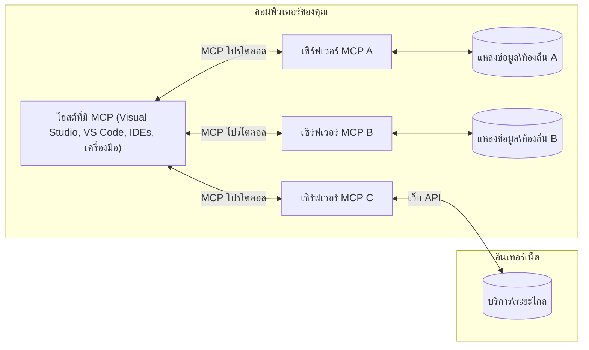

# MCP Core Concepts: การทำความเข้าใจ Model Context Protocol สำหรับการรวม AI

[](https://youtu.be/earDzWGtE84)

_(คลิกที่ภาพด้านบนเพื่อดูวิดีโอของบทเรียนนี้)_

[Model Context Protocol (MCP)](https://github.com/modelcontextprotocol) เป็นกรอบงานมาตรฐานที่ทรงพลังซึ่งเพิ่มประสิทธิภาพการสื่อสารระหว่าง Large Language Models (LLMs) กับเครื่องมือ แอปพลิเคชัน และแหล่งข้อมูลภายนอก  
คู่มือนี้จะพาคุณผ่านแนวคิดหลักของ MCP คุณจะได้เรียนรู้เกี่ยวกับสถาปัตยกรรมแบบไคลเอนต์-เซิร์ฟเวอร์ ส่วนประกอบที่สำคัญ กลไกการสื่อสาร และแนวทางปฏิบัติที่ดีที่สุดในการใช้งาน

- **ความยินยอมของผู้ใช้แบบชัดเจน**: การเข้าถึงและการดำเนินการใด ๆ ต้องได้รับการอนุมัติจากผู้ใช้อย่างชัดเจนก่อนทำงาน ผู้ใช้ต้องเข้าใจอย่างชัดเจนว่าข้อมูลใดจะถูกเข้าถึงและจะดำเนินการอะไร พร้อมทั้งควบคุมสิทธิ์และการอนุญาตได้อย่างละเอียด  
- **การปกป้องข้อมูลส่วนตัว**: ข้อมูลผู้ใช้จะถูกเปิดเผยเฉพาะเมื่อได้รับความยินยอมอย่างชัดเจน และต้องได้รับการปกป้องด้วยมาตรการเข้าถึงที่เข้มงวดตลอดช่วงอายุการโต้ตอบ การใช้งานต้องป้องกันการส่งข้อมูลโดยไม่ได้รับอนุญาตและรักษาขอบเขตความเป็นส่วนตัวอย่างเคร่งครัด  
- **ความปลอดภัยในการเรียกใช้เครื่องมือ**: ทุกการเรียกใช้งานเครื่องมือต้องได้รับความยินยอมจากผู้ใช้โดยชัดเจน พร้อมความเข้าใจในฟังก์ชันการทำงานของเครื่องมือ พารามิเตอร์ และผลกระทบที่อาจเกิดขึ้น ขอบเขตความปลอดภัยที่แข็งแกร่งต้องป้องกันการใช้งานที่ไม่ตั้งใจ ไม่ปลอดภัย หรือเป็นอันตราย  
- **ความปลอดภัยของชั้นการส่งข้อมูล**: ช่องทางการสื่อสารทั้งหมดควรใช้การเข้ารหัสและกลไกตรวจสอบตัวตนที่เหมาะสม การเชื่อมต่อระยะไกลควรมีการใช้งานโปรโตคอลการส่งข้อมูลที่ปลอดภัยและการจัดการข้อมูลรับรองอย่างเหมาะสม

#### แนวทางการใช้งาน:

- **การจัดการสิทธิ์**: ใช้ระบบสิทธิ์แบบละเอียดที่ช่วยให้ผู้ใช้ควบคุมเซิร์ฟเวอร์ เครื่องมือ และทรัพยากรที่เข้าถึงได้  
- **การตรวจสอบและอนุญาต**: ใช้วิธีตรวจสอบตัวตนที่ปลอดภัย (OAuth, API keys) พร้อมการจัดการโทเค็นและการหมดอายุอย่างเหมาะสม  
- **การตรวจสอบข้อมูลนำเข้า**: ตรวจสอบพารามิเตอร์และข้อมูลทุกอย่างตามสคีมาเพื่อป้องกันการโจมตีแบบ injection  
- **การบันทึกตรวจสอบ**: เก็บบันทึกการดำเนินการทั้งหมดสำหรับการตรวจสอบความปลอดภัยและการปฏิบัติตามระเบียบ

## ภาพรวม

บทเรียนนี้สำรวจสถาปัตยกรรมพื้นฐานและส่วนประกอบที่ประกอบเป็นระบบนิเวศของ Model Context Protocol (MCP) คุณจะได้เรียนรู้เกี่ยวกับสถาปัตยกรรมแบบไคลเอนต์-เซิร์ฟเวอร์ ส่วนประกอบสำคัญ และกลไกการสื่อสารที่ขับเคลื่อนการโต้ตอบใน MCP

## วัตถุประสงค์การเรียนรู้หลัก

หลังจากจบบทเรียนนี้ คุณจะสามารถ:

- เข้าใจสถาปัตยกรรมไคลเอนต์-เซิร์ฟเวอร์ของ MCP  
- ระบุบทบาทและหน้าที่ของ Hosts, Clients และ Servers  
- วิเคราะห์คุณสมบัติหลักที่ทำให้ MCP เป็นเลเยอร์บูรณาการที่ยืดหยุ่น  
- เรียนรู้การไหลของข้อมูลภายในระบบ MCP  
- ได้รับความเข้าใจเชิงปฏิบัติผ่านตัวอย่างโค้ดใน .NET, Java, Python และ JavaScript

## สถาปัตยกรรม MCP: การเจาะลึก

ระบบนิเวศ MCP สร้างบนโมเดลไคลเอนต์-เซิร์ฟเวอร์ โครงสร้างแบบโมดูลาร์นี้ช่วยให้แอปพลิเคชัน AI โต้ตอบกับเครื่องมือ ฐานข้อมูล API และทรัพยากรตามบริบทได้อย่างมีประสิทธิภาพ เรามาดูรายละเอียดของสถาปัตยกรรมนี้ในส่วนประกอบหลัก

โดยหลักการ MCP ใช้สถาปัตยกรรมไคลเอนต์-เซิร์ฟเวอร์ ที่ซึ่งแอปพลิเคชันโฮสต์สามารถเชื่อมต่อกับเซิร์ฟเวอร์หลายตัวได้:


- **MCP Hosts**: โปรแกรมเช่น VSCode, Claude Desktop, IDEs หรือเครื่องมือ AI ที่ต้องการเข้าถึงข้อมูลผ่าน MCP  
- **MCP Clients**: ไคลเอนต์โปรโตคอลที่รักษาการเชื่อมต่อแบบ 1:1 กับเซิร์ฟเวอร์  
- **MCP Servers**: โปรแกรมน้ำหนักเบาที่แสดงความสามารถเฉพาะผ่านมาตรฐาน Model Context Protocol  
- **Local Data Sources**: ไฟล์ ฐานข้อมูล และบริการในเครื่องของคุณที่ MCP servers สามารถเข้าถึงได้อย่างปลอดภัย  
- **Remote Services**: ระบบภายนอกที่เชื่อมต่อผ่านอินเทอร์เน็ตที่ MCP servers สามารถเชื่อมต่อด้วย API

โปรโตคอล MCP เป็นมาตรฐานที่พัฒนาโดยใช้เวอร์ชันตามวัน (รูปแบบ YYYY-MM-DD) เวอร์ชันปัจจุบันคือ **2025-11-25** คุณสามารถดูการอัปเดตล่าสุดได้ที่ [protocol specification](https://modelcontextprotocol.io/specification/2025-11-25/)

### 1. Hosts

ใน Model Context Protocol (MCP) **Hosts** คือแอปพลิเคชัน AI ที่ทำหน้าที่เป็นอินเทอร์เฟซหลักที่ผู้ใช้โต้ตอบกับโปรโตคอล Hosts ประสานงานและจัดการการเชื่อมต่อไปยัง MCP servers หลายตัวโดยสร้าง MCP clients ที่แยกเฉพาะสำหรับแต่ละการเชื่อมต่อกับเซิร์ฟเวอร์ ตัวอย่าง Hosts ได้แก่:

- **แอปพลิเคชัน AI**: Claude Desktop, Visual Studio Code, Claude Code  
- **สภาพแวดล้อมการพัฒนา**: IDEs และตัวแก้ไขโค้ดที่รวม MCP  
- **แอปพลิเคชันที่กำหนดเอง**: ตัวแทน AI และเครื่องมือที่สร้างขึ้นเฉพาะงาน

**Hosts** คือแอปพลิเคชันที่ประสานงานการโต้ตอบกับโมเดล AI พวกเขา:

- **ประสานงานโมเดล AI**: เรียกใช้หรือโต้ตอบกับ LLMs เพื่อสร้างคำตอบและจัดการเวิร์กโฟลว์ AI  
- **จัดการการเชื่อมต่อไคลเอนต์**: สร้างและรักษา MCP client หนึ่งตัวต่อการเชื่อมต่อ MCP server หนึ่งตัว  
- **ควบคุมอินเทอร์เฟซผู้ใช้**: จัดการการสนทนา การโต้ตอบกับผู้ใช้ และการแสดงผลคำตอบ  
- **บังคับใช้ความปลอดภัย**: ควบคุมสิทธิ์ ข้อจำกัดด้านความปลอดภัย และการตรวจสอบตัวตน  
- **จัดการความยินยอมของผู้ใช้**: ดูแลการอนุมัติของผู้ใช้สำหรับการแชร์ข้อมูลและการเรียกใช้เครื่องมือ

### 2. Clients

**Clients** เป็นส่วนประกอบสำคัญที่รักษาการเชื่อมต่อแบบหนึ่งต่อหนึ่งระหว่าง Hosts กับ MCP servers แต่ละ client ของ MCP ถูกสร้างขึ้นโดย Host เพื่อเชื่อมต่อกับ MCP server เฉพาะ จัดการช่องทางการสื่อสารอย่างเป็นระเบียบและปลอดภัย ไคลเอนต์หลายตัวช่วยให้ Hosts สามารถเชื่อมต่อกับเซิร์ฟเวอร์หลายตัวพร้อมกันได้

**Clients** คือส่วนเชื่อมต่อภายในแอปพลิเคชันโฮสต์ พวกเขา:

- **สื่อสารโปรโตคอล**: ส่งคำขอ JSON-RPC 2.0 ไปยังเซิร์ฟเวอร์พร้อมกับพรอมต์และคำสั่ง  
- **เจรจาความสามารถ**: เจรจาคุณสมบัติและเวอร์ชันโปรโตคอลที่เซิร์ฟเวอร์รองรับในช่วงเริ่มต้น  
- **การเรียกใช้เครื่องมือ**: จัดการคำขอเรียกใช้เครื่องมือจากโมเดลและประมวลผลคำตอบ  
- **อัปเดตแบบเรียลไทม์**: จัดการการแจ้งเตือนและอัปเดตเรียลไทม์จากเซิร์ฟเวอร์  
- **ประมวลผลคำตอบ**: ประมวลผลและจัดรูปแบบคำตอบจากเซิร์ฟเวอร์เพื่อแสดงผลแก่ผู้ใช้

### 3. Servers

**Servers** คือโปรแกรมที่ให้บริบท เครื่องมือ และความสามารถแก่ MCP clients พวกเขาสามารถทำงานได้ทั้งในเครื่อง (บนเครื่องเดียวกับ Host) หรือจากระยะไกล (บนแพลตฟอร์มภายนอก) รับผิดชอบในการจัดการคำขอจากไคลเอนต์และให้คำตอบที่เป็นโครงสร้าง Servers เปิดเผยฟังก์ชันเฉพาะผ่านมาตรฐาน Model Context Protocol

**Servers** คือบริการที่ให้บริบทและความสามารถ พวกเขา:

- **ลงทะเบียนฟีเจอร์**: ลงทะเบียนและเปิดเผยปริมิทีฟที่มี (ทรัพยากร, พรอมต์, เครื่องมือ) ให้กับไคลเอนต์  
- **ประมวลผลคำขอ**: รับและประมวลผลการเรียกใช้เครื่องมือ คำขอทรัพยากร และคำขอพรอมต์จากไคลเอนต์  
- **จัดหาบริบท**: ให้ข้อมูลตามบริบทและข้อมูลเพื่อเสริมการตอบสนองของโมเดล  
- **จัดการสถานะ**: รักษาสถานะเซสชันและจัดการการโต้ตอบที่ต้องมีสถานะเมื่อจำเป็น  
- **แจ้งเตือนแบบเรียลไทม์**: ส่งการแจ้งเตือนเกี่ยวกับการเปลี่ยนแปลงคุณสมบัติและอัปเดตไปยังไคลเอนต์ที่เชื่อมต่อ  

เซิร์ฟเวอร์สามารถพัฒนาโดยใครก็ได้เพื่อขยายความสามารถของโมเดลด้วยฟังก์ชันเฉพาะ และรองรับทั้งการปรับใช้งานแบบในเครื่องและระยะไกล

### 4. Server Primitives

เซิร์ฟเวอร์ใน Model Context Protocol (MCP) ให้สาม **ปริมิทีฟ** หลักที่เป็นโครงสร้างพื้นฐานสำหรับการโต้ตอบที่หลากหลายระหว่างไคลเอนต์ โฮสต์ และโมเดลภาษา ปริมิทีฟเหล่านี้กำหนดประเภทข้อมูลตามบริบทและการกระทำที่มีให้ผ่านโปรโตคอล

เซิร์ฟเวอร์ MCP สามารถเปิดเผยปริมิทีฟหลักต่อไปนี้ในรูปแบบใดก็ได้:

#### Resources

**Resources** คือแหล่งข้อมูลที่ให้บริบทแก่แอปพลิเคชัน AI เป็นเนื้อหาที่มีทั้งแบบคงที่และแบบไดนามิกเพื่อเสริมความเข้าใจและการตัดสินใจของโมเดล:

- **ข้อมูลตามบริบท**: ข้อมูลโครงสร้างและบริบทสำหรับการใช้โมเดล AI  
- **ฐานความรู้**: ที่จัดเก็บเอกสาร, บทความ, คู่มือ และงานวิจัย  
- **แหล่งข้อมูลในเครื่อง**: ไฟล์, ฐานข้อมูล และข้อมูลในระบบท้องถิ่น  
- **ข้อมูลภายนอก**: การตอบสนอง API, บริการเว็บ และข้อมูลระบบระยะไกล  
- **เนื้อหาแบบไดนามิก**: ข้อมูลเรียลไทม์ที่อัปเดตตามสภาวะภายนอก

ทรัพยากรถูกระบุด้วย URI และรองรับการค้นหาผ่าน `resources/list` และดึงข้อมูลผ่าน `resources/read`:

```text
file://documents/project-spec.md
database://production/users/schema
api://weather/current
```

#### Prompts

**Prompts** คือเทมเพลตที่ใช้ซ้ำเพื่อช่วยจัดโครงสร้างการโต้ตอบกับโมเดลภาษา พวกเขาให้รูปแบบการโต้ตอบมาตรฐานและเวิร์กโฟลว์แบบเทมเพลต:

- **การโต้ตอบแบบเทมเพลต**: ข้อความและจุดเริ่มต้นการสนทนาที่จัดรูปแบบไว้ล่วงหน้า  
- **เทมเพลตเวิร์กโฟลว์**: ลำดับที่ได้มาตรฐานสำหรับงานและการโต้ตอบทั่วไป  
- **ตัวอย่างแบบ few-shot**: เทมเพลตที่มีตัวอย่างเพื่อคำสั่งแก่โมเดล  
- **พรอมต์ระบบ**: พรอมต์พื้นฐานที่กำหนดพฤติกรรมและบริบทของโมเดล  
- **เทมเพลตไดนามิก**: พรอมต์ที่มีพารามิเตอร์และปรับให้เหมาะกับบริบทเฉพาะ

พรอมต์รองรับการแทนที่ตัวแปรและสามารถค้นหาได้ผ่าน `prompts/list` และดึงข้อมูลด้วย `prompts/get`:

```markdown
Generate a {{task_type}} for {{product}} targeting {{audience}} with the following requirements: {{requirements}}
```

#### Tools

**Tools** คือฟังก์ชันที่สามารถเรียกใช้ได้ซึ่งโมเดล AI ใช้เพื่อทำงานเฉพาะ พวกเขาเปรียบเสมือน "คำกริยา" ในระบบนิเวศ MCP ที่ช่วยให้โมเดลโต้ตอบกับระบบภายนอกได้:

- **ฟังก์ชันที่สามารถเรียกใช้ได้จริง**: การดำเนินการที่แยกจากกันซึ่งโมเดลสามารถเรียกด้วยพารามิเตอร์เฉพาะ  
- **การรวมระบบภายนอก**: การเรียก API, การสืบค้นฐานข้อมูล, การจัดการไฟล์, การคำนวณ  
- **อัตลักษณ์เฉพาะ**: เครื่องมือแต่ละชิ้นมีชื่อ คำอธิบาย และโครงสร้างพารามิเตอร์ที่เฉพาะเจาะจง  
- **การรับส่งข้อมูลแบบโครงสร้าง**: เครื่องมือรับพารามิเตอร์ที่ตรวจสอบแล้วและส่งคืนข้อมูลที่มีโครงสร้างและประเภทชัดเจน  
- **ความสามารถในการปฏิบัติการ**: ช่วยให้โมเดลทำงานจริงในโลกและดึงข้อมูลสดได้

เครื่องมือถูกกำหนดด้วย JSON Schema สำหรับการตรวจสอบพารามิเตอร์และค้นหาผ่าน `tools/list` พร้อมเรียกใช้งานผ่าน `tools/call` เครื่องมือยังสามารถรวม **ไอคอน** เป็นเมตาดาต้าเสริมสำหรับการแสดงผล UI ที่ดีขึ้น

**คำอธิบายเครื่องมือ**: เครื่องมือรองรับคำอธิบายพฤติกรรม (เช่น `readOnlyHint`, `destructiveHint`) ที่บอกว่าเครื่องมือเป็นแบบอ่านอย่างเดียวหรืออันตราย ช่วยให้ไคลเอนต์ตัดสินใจเรื่องการเรียกใช้งานเครื่องมือได้อย่างมีข้อมูล

ตัวอย่างการกำหนดเครื่องมือ:

```typescript
server.tool(
  "search_products", 
  {
    query: z.string().describe("Search query for products"),
    category: z.string().optional().describe("Product category filter"),
    max_results: z.number().default(10).describe("Maximum results to return")
  }, 
  async (params) => {
    // ดำเนินการค้นหาและส่งคืนผลลัพธ์ที่มีโครงสร้าง
    return await productService.search(params);
  }
);
```

## Client Primitives

ใน Model Context Protocol (MCP) **ไคลเอนต์** สามารถเปิดเผยปริมิทีฟที่ช่วยให้เซิร์ฟเวอร์ขอความสามารถเพิ่มเติมจากแอปพลิเคชันโฮสต์ ปริมิทีฟฝั่งไคลเอนต์เหล่านี้ช่วยให้เซิร์ฟเวอร์สามารถทำงานแบบมีปฏิสัมพันธ์มากขึ้นโดยเข้าถึงความสามารถของโมเดล AI และการโต้ตอบของผู้ใช้

### Sampling

**Sampling** ช่วยให้เซิร์ฟเวอร์ขอการเติมข้อความจากโมเดลภาษาในแอปพลิเคชัน AI ของไคลเอนต์ ปริมิทีฟนี้ช่วยให้เซิร์ฟเวอร์เข้าถึงความสามารถของ LLM ได้โดยไม่ต้องฝังโมเดลไว้เอง:

- **เข้าถึงแบบไม่ขึ้นกับโมเดล**: เซิร์ฟเวอร์สามารถขอการเติมข้อความโดยไม่ต้องรวม SDK ของ LLM หรือจัดการการเข้าถึงโมเดล  
- **เริ่มต้น AI โดยเซิร์ฟเวอร์**: ช่วยให้เซิร์ฟเวอร์สร้างเนื้อหาโดยอิสระโดยใช้โมเดล AI ของไคลเอนต์  
- **การโต้ตอบ LLM แบบซ้อน**: รองรับสถานการณ์ที่ซับซ้อนซึ่งเซิร์ฟเวอร์ต้องการความช่วยเหลือ AI เพื่อประมวลผล  
- **การสร้างเนื้อหาแบบไดนามิก**: ให้เซิร์ฟเวอร์สร้างคำตอบตามบริบทโดยใช้โมเดลของโฮสต์  
- **รองรับการเรียกใช้เครื่องมือ**: เซิร์ฟเวอร์สามารถรวมพารามิเตอร์ `tools` และ `toolChoice` เพื่อให้โมเดลของไคลเอนต์เรียกใช้เครื่องมือในช่วง sampling ได้

Sampling เริ่มต้นผ่านเมธอด `sampling/complete` ที่เซิร์ฟเวอร์ส่งคำขอเติมข้อความไปยังไคลเอนต์

### Roots

**Roots** ให้วิธีมาตรฐานสำหรับไคลเอนต์ในการเปิดเผยขอบเขตของระบบไฟล์แก่เซิร์ฟเวอร์ ช่วยให้เซิร์ฟเวอร์เข้าใจว่าพวกเขามีสิทธิ์เข้าถึงไดเรกทอรีและไฟล์ใดบ้าง:

- **ขอบเขตระบบไฟล์**: กำหนดขอบเขตที่เซิร์ฟเวอร์สามารถทำงานภายในระบบไฟล์  
- **การควบคุมการเข้าถึง**: ช่วยเซิร์ฟเวอร์เข้าใจว่าไดเรกทอรีและไฟล์ใดที่ได้รับอนุญาตให้เข้าถึง  
- **อัปเดตแบบไดนามิก**: ไคลเอนต์สามารถแจ้งไปยังเซิร์ฟเวอร์เมื่อรายการ roots เปลี่ยนแปลง  
- **ระบุด้วย URI**: Roots ใช้ URI แบบ `file://` เพื่อระบุไดเรกทอรีและไฟล์ที่เข้าถึงได้

Roots ค้นพบได้ผ่านเมธอด `roots/list` โดยไคลเอนต์ส่งการแจ้งเตือน `notifications/roots/list_changed` เมื่อ root เปลี่ยนแปลง

### Elicitation

**Elicitation** ช่วยให้เซิร์ฟเวอร์ขอข้อมูลเพิ่มเติมหรือการยืนยันจากผู้ใช้ผ่านอินเทอร์เฟซของไคลเอนต์:

- **คำขอข้อมูลจากผู้ใช้**: เซิร์ฟเวอร์สามารถขอข้อมูลเพิ่มเติมเมื่อจำเป็นสำหรับการเรียกใช้เครื่องมือ  
- **กล่องโต้ตอบยืนยัน**: ขออนุมัติจากผู้ใช้สำหรับการดำเนินการที่ละเอียดอ่อนหรือมีผลกระทบ  
- **เวิร์กโฟลว์แบบโต้ตอบ**: ช่วยให้เซิร์ฟเวอร์สร้างการโต้ตอบแบบทีละขั้นตอนกับผู้ใช้  
- **การรวบรวมพารามิเตอร์แบบไดนามิก**: รวบรวมพารามิเตอร์ที่ขาดหายหรือเป็นทางเลือกระหว่างการทำงานของเครื่องมือ  

คำขอ elicitation ทำผ่านเมธอด `elicitation/request` เพื่อเก็บข้อมูลผู้ใช้ผ่านอินเทอร์เฟซของไคลเอนต์

**URL Mode Elicitation**: เซิร์ฟเวอร์ยังสามารถขอการโต้ตอบกับผู้ใช้ผ่าน URL ให้เซิร์ฟเวอร์นำผู้ใช้ไปยังเว็บเพจภายนอกสำหรับการยืนยัน การรับรองความถูกต้อง หรือการป้อนข้อมูล

### Logging

**Logging** ช่วยให้เซิร์ฟเวอร์ส่งข้อความบันทึกที่มีโครงสร้างไปยังไคลเอนต์เพื่อการดีบัก การติดตาม และการตรวจสอบสถานะการทำงาน:

- **รองรับการดีบัก**: ช่วยให้เซิร์ฟเวอร์ให้บันทึกรายละเอียดการทำงานเพื่อแก้ไขปัญหา  
- **การติดตามสถานะการทำงาน**: ส่งสถานะและเมตริกประสิทธิภาพไปยังไคลเอนต์  
- **รายงานข้อผิดพลาด**: ให้บริบทและข้อมูลวิเคราะห์ข้อผิดพลาดด้วยรายละเอียด  
- **บันทึกเพื่อตรวจสอบย้อนหลัง**: สร้างบันทึกครบถ้วนเกี่ยวกับการทำงานและการตัดสินใจของเซิร์ฟเวอร์

ข้อความบันทึกถูกส่งไปยังไคลเอนต์เพื่อให้เข้าใจภาพรวมการทำงานของเซิร์ฟเวอร์และช่วยแก้ไขปัญหา

## การไหลของข้อมูลใน MCP

Model Context Protocol (MCP) กำหนดการไหลของข้อมูลที่มีโครงสร้างระหว่าง Hosts, Clients, Servers และโมเดล การเข้าใจกระบวนการนี้ช่วยอธิบายว่าคำขอของผู้ใช้ถูกประมวลผลอย่างไร และเครื่องมือและข้อมูลภายนอกถูกผนวกรวมเข้ากับคำตอบของโมเดลอย่างไร
- **โฮสต์เริ่มต้นการเชื่อมต่อ**  
  แอปพลิเคชันโฮสต์ (เช่น IDE หรืออินเทอร์เฟซแชท) สร้างการเชื่อมต่อกับเซิร์ฟเวอร์ MCP โดยทั่วไปผ่าน STDIO, WebSocket หรือช่องทางขนส่งที่รองรับอื่น ๆ

- **การเจรจาขีดความสามารถ**  
  ฝั่งไคลเอนต์ (ฝังอยู่ในโฮสต์) และเซิร์ฟเวอร์แลกเปลี่ยนข้อมูลเกี่ยวกับฟีเจอร์ เครื่องมือ ทรัพยากร และเวอร์ชันโปรโตคอลที่รองรับ ซึ่งช่วยให้ทั้งสองฝ่ายเข้าใจว่ามีความสามารถอะไรบ้างสำหรับเซสชันนี้

- **คำขอของผู้ใช้**  
  ผู้ใช้โต้ตอบกับโฮสต์ (เช่น ป้อนข้อความหรือคำสั่ง) โฮสต์จะเก็บข้อมูลอินพุตนี้และส่งต่อไปยังไคลเอนต์เพื่อประมวลผล

- **การใช้ทรัพยากรหรือเครื่องมือ**  
  - ไคลเอนต์อาจร้องขอบริบทเพิ่มเติมหรือทรัพยากรจากเซิร์ฟเวอร์ (เช่น ไฟล์ รายการฐานข้อมูล หรือบทความฐานความรู้) เพื่อเสริมความเข้าใจของโมเดล  
  - หากโมเดลตัดสินใจว่าจำเป็นต้องใช้เครื่องมือ (เช่น ดึงข้อมูล คำนวณ หรือเรียก API) ไคลเอนต์จะส่งคำขอเรียกใช้เครื่องมือไปยังเซิร์ฟเวอร์ โดยระบุชื่อเครื่องมือและพารามิเตอร์

- **การดำเนินการของเซิร์ฟเวอร์**  
  เซิร์ฟเวอร์ได้รับคำขอทรัพยากรหรือเครื่องมือ ดำเนินการที่จำเป็น (เช่น รันฟังก์ชัน คิวรีฐานข้อมูล หรือดึงไฟล์) และส่งผลลัพธ์กลับไปยังไคลเอนต์ในรูปแบบที่มีโครงสร้าง

- **การสร้างคำตอบ**  
  ไคลเอนต์รวมคำตอบของเซิร์ฟเวอร์ (ข้อมูลทรัพยากร ผลลัพธ์เครื่องมือ ฯลฯ) เข้ากับการโต้ตอบกับโมเดล โมเดลใช้ข้อมูลนี้เพื่อสร้างคำตอบที่ครอบคลุมและเหมาะสมกับบริบท

- **การแสดงผลลัพธ์**  
  โฮสต์รับผลลัพธ์สุดท้ายจากไคลเอนต์และแสดงให้ผู้ใช้เห็น โดยมักรวมถึงข้อความที่สร้างโดยโมเดลและผลลัพธ์จากการเรียกใช้เครื่องมือหรือดึงทรัพยากรต่าง ๆ

กระบวนการนี้ทำให้ MCP สนับสนุนแอปพลิเคชัน AI ที่มีความก้าวหน้า โต้ตอบได้ และเข้าใจบริบทโดยเชื่อมต่อโมเดลกับเครื่องมือและแหล่งข้อมูลภายนอกได้อย่างไร้รอยต่อ

## สถาปัตยกรรมและชั้นโปรโตคอล

MCP ประกอบด้วยสองชั้นสถาปัตยกรรมที่แตกต่างกันซึ่งทำงานร่วมกันเพื่อให้กรอบการสื่อสารที่สมบูรณ์:

### ชั้นข้อมูล

**ชั้นข้อมูล** ใช้โปรโตคอล MCP หลักโดยใช้ **JSON-RPC 2.0** เป็นฐาน ชั้นนี้กำหนดโครงสร้างข้อความ ความหมาย และรูปแบบการโต้ตอบ:

#### องค์ประกอบหลัก:

- **โปรโตคอล JSON-RPC 2.0**: การสื่อสารทั้งหมดใช้รูปแบบข้อความ JSON-RPC 2.0 มาตรฐานสำหรับการเรียกเมธอด คำตอบ และการแจ้งเตือน  
- **การจัดการวงจรชีวิต**: จัดการการเริ่มต้นการเชื่อมต่อ การเจรจาขีดความสามารถ และการยุติเซสชันระหว่างไคลเอนต์กับเซิร์ฟเวอร์  
- **ฟังก์ชันพื้นฐานของเซิร์ฟเวอร์**: อนุญาตให้เซิร์ฟเวอร์ให้ฟังก์ชันหลักผ่านเครื่องมือ ทรัพยากร และคำสั่งแบบ prompt  
- **ฟังก์ชันพื้นฐานของไคลเอนต์**: อนุญาตให้เซิร์ฟเวอร์ร้องขอตัวอย่างจาก LLM, กระตุ้นข้อมูลจากผู้ใช้ และส่งข้อความบันทึก  
- **การแจ้งเตือนแบบเรียลไทม์**: รองรับการแจ้งเตือนแบบอะซิงโครนัสสำหรับการอัปเดตแบบไดนามิกโดยไม่ต้อง polling

#### คุณสมบัติสำคัญ:

- **การเจรจาเวอร์ชันโปรโตคอล**: ใช้การกำหนดเวอร์ชันตามวันที่ (YYYY-MM-DD) เพื่อให้เข้ากันได้  
- **การค้นหาขีดความสามารถ**: ไคลเอนต์และเซิร์ฟเวอร์แลกเปลี่ยนข้อมูลฟีเจอร์ที่รองรับในระหว่างการเริ่มต้น  
- **เซสชันแบบมีสถานะ**: รักษาสถานะการเชื่อมต่อหลายครั้งเพื่อความต่อเนื่องของบริบท

### ชั้นขนส่ง

**ชั้นขนส่ง** จัดการช่องทางการสื่อสาร การสร้างกรอบข้อความ และการตรวจสอบสิทธิ์ระหว่างผู้เข้าร่วม MCP:

#### กลไกการขนส่งที่รองรับ:

1. **ขนส่ง STDIO**:  
   - ใช้สตรีมข้อมูลเข้า/ออกมาตรฐานสำหรับการสื่อสารระหว่างกระบวนการโดยตรง  
   - เหมาะสำหรับกระบวนการท้องถิ่นบนเครื่องเดียวกันโดยไม่มีภาระเครือข่าย  
   - ใช้สำหรับการใช้งานเซิร์ฟเวอร์ MCP ท้องถิ่นทั่วไป

2. **ขนส่ง HTTP แบบสตรีม**:  
   - ใช้ HTTP POST สำหรับส่งข้อความไคลเอนต์ไปยังเซิร์ฟเวอร์  
   - ตัวเลือก Server-Sent Events (SSE) สำหรับการส่งข้อมูลสตรีมจากเซิร์ฟเวอร์ไปไคลเอนต์  
   - ช่วยให้สื่อสารกับเซิร์ฟเวอร์ระยะไกลผ่านเครือข่าย  
   - รองรับการตรวจสอบสิทธิ์ HTTP มาตรฐาน (โทเค็น bearer, คีย์ API, เฮดเดอร์แบบกำหนดเอง)  
   - MCP แนะนำให้ใช้ OAuth สำหรับการตรวจสอบสิทธิ์ด้วยโทเค็นอย่างปลอดภัย

#### การนามธรรมของขนส่ง:

ชั้นขนส่งนามธรรมรายละเอียดการสื่อสารออกจากชั้นข้อมูล ทำให้รูปแบบข้อความ JSON-RPC 2.0 เดียวกันใช้ได้กับกลไกขนส่งทุกชนิด ช่วยให้แอปพลิเคชันสลับไปมาระหว่างเซิร์ฟเวอร์ท้องถิ่นและระยะไกลได้ง่าย

### ข้อพิจารณาด้านความปลอดภัย

การนำ MCP ไปใช้งานต้องปฏิบัติตามหลักเกณฑ์ด้านความปลอดภัยที่สำคัญจำนวนมากเพื่อให้การโต้ตอบทั้งหมดในโปรโตคอลมีความปลอดภัย ไว้วางใจได้ และปลอดภัย:

- **ความยินยอมและการควบคุมของผู้ใช้**: ผู้ใช้ต้องให้ความยินยอมอย่างชัดเจนก่อนเข้าถึงข้อมูลหรือดำเนินการใด ๆ ควรมีการควบคุมที่ชัดเจนว่าข้อมูลใดถูกแชร์และการกระทำใดที่ได้รับอนุญาต พร้อมอินเทอร์เฟซที่ใช้งานง่ายสำหรับตรวจสอบและอนุมัติกิจกรรม

- **ความเป็นส่วนตัวของข้อมูล**: ข้อมูลผู้ใช้จะถูกเปิดเผยเฉพาะเมื่อตกลงอย่างชัดแจ้งเท่านั้น และต้องได้รับการปกป้องด้วยการควบคุมการเข้าถึงที่เหมาะสม การใช้งาน MCP ต้องป้องกันการส่งข้อมูลโดยไม่ได้รับอนุญาตและรักษาความเป็นส่วนตัวตลอดการโต้ตอบทั้งหมด

- **ความปลอดภัยของเครื่องมือ**: ก่อนเรียกใช้เครื่องมือต้องได้รับความยินยอมจากผู้ใช้อย่างชัดเจน ผู้ใช้ควรเข้าใจฟังก์ชันของแต่ละเครื่องมืออย่างชัดเจน และต้องบังคับใช้ขอบเขตความปลอดภัยอย่างเข้มงวดเพื่อป้องกันการใช้งานเครื่องมือโดยไม่ได้ตั้งใจหรือไม่ปลอดภัย

ด้วยการปฏิบัติตามหลักเกณฑ์ด้านความปลอดภัยเหล่านี้ MCP จึงมั่นใจได้ว่าผู้ใช้จะได้รับความไว้วางใจ ความเป็นส่วนตัว และความปลอดภัยตลอดการโต้ตอบกับโปรโตคอล พร้อมทั้งเปิดใช้งานการผนวกรวม AI ที่มีพลัง

## ตัวอย่างโค้ด: องค์ประกอบสำคัญ

ด้านล่างนี้คือตัวอย่างโค้ดในหลายภาษาโปรแกรมยอดนิยมที่แสดงวิธีการใช้งานองค์ประกอบสำคัญของเซิร์ฟเวอร์ MCP และเครื่องมือ

### ตัวอย่าง .NET: การสร้างเซิร์ฟเวอร์ MCP ง่าย ๆ พร้อมเครื่องมือ

นี่คือตัวอย่างโค้ด .NET ที่ใช้งานจริงเพื่อแสดงวิธีการสร้างเซิร์ฟเวอร์ MCP ง่าย ๆ พร้อมกับเครื่องมือที่กำหนดเอง ตัวอย่างนี้แสดงการนิยามและลงทะเบียนเครื่องมือ การจัดการคำขอ และการเชื่อมต่อเซิร์ฟเวอร์โดยใช้โปรโตคอล Model Context

```csharp
using System;
using System.Threading.Tasks;
using ModelContextProtocol.Server;
using ModelContextProtocol.Server.Transport;
using ModelContextProtocol.Server.Tools;

public class WeatherServer
{
    public static async Task Main(string[] args)
    {
        // Create an MCP server
        var server = new McpServer(
            name: "Weather MCP Server",
            version: "1.0.0"
        );
        
        // Register our custom weather tool
        server.AddTool<string, WeatherData>("weatherTool", 
            description: "Gets current weather for a location",
            execute: async (location) => {
                // Call weather API (simplified)
                var weatherData = await GetWeatherDataAsync(location);
                return weatherData;
            });
        
        // Connect the server using stdio transport
        var transport = new StdioServerTransport();
        await server.ConnectAsync(transport);
        
        Console.WriteLine("Weather MCP Server started");
        
        // Keep the server running until process is terminated
        await Task.Delay(-1);
    }
    
    private static async Task<WeatherData> GetWeatherDataAsync(string location)
    {
        // This would normally call a weather API
        // Simplified for demonstration
        await Task.Delay(100); // Simulate API call
        return new WeatherData { 
            Temperature = 72.5,
            Conditions = "Sunny",
            Location = location
        };
    }
}

public class WeatherData
{
    public double Temperature { get; set; }
    public string Conditions { get; set; }
    public string Location { get; set; }
}
```

### ตัวอย่าง Java: องค์ประกอบเซิร์ฟเวอร์ MCP

ตัวอย่างนี้แสดงเซิร์ฟเวอร์ MCP และการลงทะเบียนเครื่องมือเดียวกับตัวอย่าง .NET ข้างต้น แต่เขียนด้วยภาษา Java

```java
import io.modelcontextprotocol.server.McpServer;
import io.modelcontextprotocol.server.McpToolDefinition;
import io.modelcontextprotocol.server.transport.StdioServerTransport;
import io.modelcontextprotocol.server.tool.ToolExecutionContext;
import io.modelcontextprotocol.server.tool.ToolResponse;

public class WeatherMcpServer {
    public static void main(String[] args) throws Exception {
        // สร้างเซิร์ฟเวอร์ MCP
        McpServer server = McpServer.builder()
            .name("Weather MCP Server")
            .version("1.0.0")
            .build();
            
        // ลงทะเบียนเครื่องมือสภาพอากาศ
        server.registerTool(McpToolDefinition.builder("weatherTool")
            .description("Gets current weather for a location")
            .parameter("location", String.class)
            .execute((ToolExecutionContext ctx) -> {
                String location = ctx.getParameter("location", String.class);
                
                // ดึงข้อมูลสภาพอากาศ (แบบง่าย)
                WeatherData data = getWeatherData(location);
                
                // ส่งคืนการตอบสนองที่จัดรูปแบบแล้ว
                return ToolResponse.content(
                    String.format("Temperature: %.1f°F, Conditions: %s, Location: %s", 
                    data.getTemperature(), 
                    data.getConditions(), 
                    data.getLocation())
                );
            })
            .build());
        
        // เชื่อมต่อเซิร์ฟเวอร์โดยใช้การขนส่ง stdio
        try (StdioServerTransport transport = new StdioServerTransport()) {
            server.connect(transport);
            System.out.println("Weather MCP Server started");
            // ให้เซิร์ฟเวอร์ทำงานต่อเนื่องจนกว่ากระบวนการจะสิ้นสุด
            Thread.currentThread().join();
        }
    }
    
    private static WeatherData getWeatherData(String location) {
        // การนำไปใช้งานจะเรียก API ของสภาพอากาศ
        // ทำให้ง่ายขึ้นสำหรับตัวอย่างเท่านั้น
        return new WeatherData(72.5, "Sunny", location);
    }
}

class WeatherData {
    private double temperature;
    private String conditions;
    private String location;
    
    public WeatherData(double temperature, String conditions, String location) {
        this.temperature = temperature;
        this.conditions = conditions;
        this.location = location;
    }
    
    public double getTemperature() {
        return temperature;
    }
    
    public String getConditions() {
        return conditions;
    }
    
    public String getLocation() {
        return location;
    }
}
```

### ตัวอย่าง Python: การสร้างเซิร์ฟเวอร์ MCP

ตัวอย่างนี้ใช้ fastmcp กรุณาติดตั้งก่อนใช้งาน:

```python
pip install fastmcp
```
Code Sample:

```python
#!/usr/bin/env python3
import asyncio
from fastmcp import FastMCP
from fastmcp.transports.stdio import serve_stdio

# สร้างเซิร์ฟเวอร์ FastMCP
mcp = FastMCP(
    name="Weather MCP Server",
    version="1.0.0"
)

@mcp.tool()
def get_weather(location: str) -> dict:
    """Gets current weather for a location."""
    return {
        "temperature": 72.5,
        "conditions": "Sunny",
        "location": location
    }

# วิธีทางเลือกโดยใช้คลาส
class WeatherTools:
    @mcp.tool()
    def forecast(self, location: str, days: int = 1) -> dict:
        """Gets weather forecast for a location for the specified number of days."""
        return {
            "location": location,
            "forecast": [
                {"day": i+1, "temperature": 70 + i, "conditions": "Partly Cloudy"}
                for i in range(days)
            ]
        }

# ลงทะเบียนเครื่องมือในคลาส
weather_tools = WeatherTools()

# เริ่มต้นเซิร์ฟเวอร์
if __name__ == "__main__":
    asyncio.run(serve_stdio(mcp))
```

### ตัวอย่าง JavaScript: การสร้างเซิร์ฟเวอร์ MCP

ตัวอย่างนี้แสดงการสร้างเซิร์ฟเวอร์ MCP ด้วย JavaScript และวิธีการลงทะเบียนเครื่องมือที่เกี่ยวข้องกับสภาพอากาศสองตัว

```javascript
// ใช้ SDK ของ Model Context Protocol อย่างเป็นทางการ
import { McpServer } from "@modelcontextprotocol/sdk/server/mcp.js";
import { StdioServerTransport } from "@modelcontextprotocol/sdk/server/stdio.js";
import { z } from "zod"; // สำหรับการตรวจสอบพารามิเตอร์

// สร้างเซิร์ฟเวอร์ MCP
const server = new McpServer({
  name: "Weather MCP Server",
  version: "1.0.0"
});

// กำหนดเครื่องมือพยากรณ์อากาศ
server.tool(
  "weatherTool",
  {
    location: z.string().describe("The location to get weather for")
  },
  async ({ location }) => {
    // โดยปกติจะเรียก API สภาพอากาศ
    // ทำให้ง่ายขึ้นเพื่อสาธิต
    const weatherData = await getWeatherData(location);
    
    return {
      content: [
        { 
          type: "text", 
          text: `Temperature: ${weatherData.temperature}°F, Conditions: ${weatherData.conditions}, Location: ${weatherData.location}` 
        }
      ]
    };
  }
);

// กำหนดเครื่องมือพยากรณ์
server.tool(
  "forecastTool",
  {
    location: z.string(),
    days: z.number().default(3).describe("Number of days for forecast")
  },
  async ({ location, days }) => {
    // โดยปกติจะเรียก API สภาพอากาศ
    // ทำให้ง่ายขึ้นเพื่อสาธิต
    const forecast = await getForecastData(location, days);
    
    return {
      content: [
        { 
          type: "text", 
          text: `${days}-day forecast for ${location}: ${JSON.stringify(forecast)}` 
        }
      ]
    };
  }
);

// ฟังก์ชันช่วยเหลือ
async function getWeatherData(location) {
  // จำลองการเรียก API
  return {
    temperature: 72.5,
    conditions: "Sunny",
    location: location
  };
}

async function getForecastData(location, days) {
  // จำลองการเรียก API
  return Array.from({ length: days }, (_, i) => ({
    day: i + 1,
    temperature: 70 + Math.floor(Math.random() * 10),
    conditions: i % 2 === 0 ? "Sunny" : "Partly Cloudy"
  }));
}

// เชื่อมต่อเซิร์ฟเวอร์โดยใช้การขนส่ง stdio
const transport = new StdioServerTransport();
server.connect(transport).catch(console.error);

console.log("Weather MCP Server started");
```

ตัวอย่าง JavaScript นี้สาธิตวิธีสร้างเซิร์ฟเวอร์ MCP ที่ลงทะเบียนเครื่องมือสภาพอากาศ และเชื่อมต่อโดยใช้ช่องทาง stdio เพื่อจัดการคำขอเข้าจากไคลเอนต์

## ความปลอดภัยและการอนุญาต

MCP มีแนวคิดและกลไกสำหรับการจัดการความปลอดภัยและการอนุญาตตลอดโปรโตคอลดังนี้:

1. **การควบคุมสิทธิ์เครื่องมือ**:  
  ไคลเอนต์สามารถระบุได้ว่าโมเดลได้รับอนุญาตให้ใช้เครื่องมือใดในระหว่างเซสชัน เพื่อให้มั่นใจว่าเข้าถึงเครื่องมือที่ได้รับอนุญาตอย่างชัดเจนเท่านั้น ช่วยลดความเสี่ยงจากการใช้งานโดยไม่ได้ตั้งใจหรือไม่ปลอดภัย สิทธิ์สามารถตั้งค่าแบบไดนามิกตามความชอบของผู้ใช้ นโยบายองค์กร หรือบริบทของการโต้ตอบ

2. **การตรวจสอบสิทธิ์**:  
  เซิร์ฟเวอร์สามารถกำหนดให้ตรวจสอบสิทธิ์ก่อนอนุญาตให้เข้าถึงเครื่องมือ ทรัพยากร หรือการดำเนินการที่ละเอียดอ่อน ซึ่งอาจรวมถึงคีย์ API, โทเค็น OAuth หรือระบบตรวจสอบสิทธิ์อื่น ๆ การตรวจสอบสิทธิ์ที่เหมาะสมช่วยให้มั่นใจว่าเฉพาะไคลเอนต์และผู้ใช้ที่เชื่อถือได้เท่านั้นที่สามารถเรียกใช้ฟังก์ชันบนเซิร์ฟเวอร์ได้

3. **การตรวจสอบความถูกต้อง**:  
  มีการบังคับตรวจสอบพารามิเตอร์สำหรับการเรียกใช้เครื่องมือทุกกรณี เครื่องมือแต่ละตัวกำหนดประเภท รูปแบบ และข้อจำกัดสำหรับพารามิเตอร์ที่คาดหวัง และเซิร์ฟเวอร์จะตรวจสอบคำขอที่เข้ามาอย่างเหมาะสม เพื่อป้องกันการป้อนข้อมูลที่ผิดรูปแบบหรือเป็นอันตรายและช่วยรักษาความสมบูรณ์ของการดำเนินงาน

4. **การจำกัดอัตรา**:  
  เพื่อป้องกันการใช้งานเกินควรและเพื่อให้การใช้ทรัพยากรเซิร์ฟเวอร์เป็นธรรม เซิร์ฟเวอร์ MCP สามารถตั้งค่าการจำกัดอัตราสำหรับการเรียกใช้เครื่องมือและการเข้าถึงทรัพยากรได้ การจำกัดอัตราอาจกำหนดต่อผู้ใช้ ต่อเซสชัน หรือแบบรวม และช่วยป้องกันการโจมตีแบบปฏิเสธการให้บริการหรือการใช้ทรัพยากรเกินควร

โดยการรวมกลไกเหล่านี้ MCP จึงเป็นพื้นฐานที่ปลอดภัยสำหรับการผนวกรวมโมเดลภาษาเข้ากับเครื่องมือภายนอกและแหล่งข้อมูลพร้อมทั้งมอบการควบคุมการเข้าถึงและการใช้งานอย่างละเอียดสำหรับผู้ใช้และนักพัฒนา

## ข้อความโปรโตคอลและการไหลของการสื่อสาร

การสื่อสารของ MCP ใช้ข้อความ **JSON-RPC 2.0** ที่มีโครงสร้างเพื่ออำนวยความสะดวกในการโต้ตอบที่ชัดเจนและเชื่อถือได้ระหว่างโฮสต์ ไคลเอนต์ และเซิร์ฟเวอร์ โปรโตคอลกำหนดรูปแบบข้อความเฉพาะสำหรับการดำเนินงานประเภทต่าง ๆ:

### ประเภทข้อความหลัก:

#### **ข้อความเริ่มต้น**
- **คำขอ `initialize`**: สร้างการเชื่อมต่อและเจรจาเวอร์ชันโปรโตคอลและขีดความสามารถ  
- **คำตอบ `initialize`**: ยืนยันฟีเจอร์ที่รองรับและข้อมูลเซิร์ฟเวอร์  
- **`notifications/initialized`**: แจ้งว่าเริ่มต้นเสร็จสมบูรณ์และเซสชันพร้อมใช้งาน

#### **ข้อความค้นหา**
- **คำขอ `tools/list`**: ค้นหาเครื่องมือที่มีในเซิร์ฟเวอร์  
- **คำขอ `resources/list`**: แสดงรายการทรัพยากร (แหล่งข้อมูล) ที่มี  
- **คำขอ `prompts/list`**: ดึงแบบฟอร์ม prompt ที่พร้อมใช้งาน

#### **ข้อความดำเนินการ**  
- **คำขอ `tools/call`**: เรียกใช้เครื่องมือเฉพาะพร้อมพารามิเตอร์ที่ส่งมา  
- **คำขอ `resources/read`**: ดึงเนื้อหาจากทรัพยากรเฉพาะ  
- **คำขอ `prompts/get`**: ดึงแบบฟอร์ม prompt พร้อมพารามิเตอร์เพิ่มเติม (ถ้ามี)

#### **ข้อความฝั่งไคลเอนต์**
- **คำขอ `sampling/complete`**: เซิร์ฟเวอร์ร้องขอผลลัพธ์จาก LLM ผ่านไคลเอนต์  
- **`elicitation/request`**: เซิร์ฟเวอร์ร้องขอข้อมูลจากผู้ใช้ผ่านอินเทอร์เฟซไคลเอนต์  
- **ข้อความ logging**: เซิร์ฟเวอร์ส่งข้อความบันทึกแบบมีโครงสร้างไปยังไคลเอนต์

#### **ข้อความแจ้งเตือน**
- **`notifications/tools/list_changed`**: เซิร์ฟเวอร์แจ้งไคลเอนต์ว่าเครื่องมือเปลี่ยนแปลง  
- **`notifications/resources/list_changed`**: เซิร์ฟเวอร์แจ้งไคลเอนต์ว่าทรัพยากรเปลี่ยนแปลง  
- **`notifications/prompts/list_changed`**: เซิร์ฟเวอร์แจ้งไคลเอนต์ว่า prompt เปลี่ยนแปลง

### โครงสร้างข้อความ:

ข้อความ MCP ทั้งหมดปฏิบัติตามรูปแบบ JSON-RPC 2.0 ดังนี้:  
- **ข้อความคำขอ**: ประกอบด้วย `id`, `method`, และ `params` ที่เลือกใช้ได้  
- **ข้อความคำตอบ**: ประกอบด้วย `id` และ `result` หรือ `error`  
- **ข้อความแจ้งเตือน**: ประกอบด้วย `method` และ `params` ที่เลือกใช้ได้ (ไม่มี `id` และไม่คาดหวังคำตอบ)

การสื่อสารที่มีโครงสร้างนี้ช่วยให้การโต้ตอบมีความน่าเชื่อถือ ตรวจสอบย้อนกลับได้ และขยายได้ รองรับสถานการณ์ขั้นสูง เช่น การอัปเดตแบบเรียลไทม์ การเชื่อมเครื่องมือ และการจัดการข้อผิดพลาดที่มั่นคง

### งาน (ทดลอง)

**งาน (Tasks)** เป็นฟีเจอร์ทดลองที่ให้ตัวหุ้มการดำเนินงานที่ยืดหยุ่นสำหรับการดึงผลลัพธ์ล่าช้าและติดตามสถานะของคำขอ MCP:

- **งานที่ใช้เวลานาน**: ติดตามการคำนวณที่ใช้เวลา อัตโนมัติของขั้นตอนการทำงาน และการประมวลผลแบบชุด  
- **ผลลัพธ์ล่าช้า**: สอบถามสถานะงานและดึงผลลัพธ์เมื่อดำเนินการเสร็จ  
- **ติดตามสถานะ**: ตรวจสอบความก้าวหน้างานผ่านสถานะวงจรชีวิตที่กำหนด  
- **การดำเนินงานหลายขั้นตอน**: รองรับขั้นตอนการทำงานที่ซับซ้อนหลายรอบการโต้ตอบ

งานเหล่านี้ห่อหุ้มคำขอ MCP มาตรฐานเพื่อเปิดใช้งานรูปแบบการดำเนินงานแบบอะซิงโครนัสสำหรับการดำเนินการที่ไม่สามารถเสร็จในทันที

## สรุปประเด็นสำคัญ

- **สถาปัตยกรรม**: MCP ใช้สถาปัตยกรรมไคลเอนต์-เซิร์ฟเวอร์ที่โฮสต์จัดการการเชื่อมต่อไคลเอนต์หลายตัวกับเซิร์ฟเวอร์  
- **ผู้เข้าร่วม**: ระบบรวมโฮสต์ (แอป AI), ไคลเอนต์ (ตัวเชื่อมโปรโตคอล), และเซิร์ฟเวอร์ (ผู้ให้บริการความสามารถ)  
- **กลไกขนส่ง**: การสื่อสารรองรับ STDIO (ท้องถิ่น) และ HTTP แบบสตรีมพร้อม SSE (ระยะไกล)  
- **ฟังก์ชันพื้นฐานของเซิร์ฟเวอร์**: เซิร์ฟเวอร์เผยแพร่เครื่องมือ (ฟังก์ชันที่รันได้), ทรัพยากร (แหล่งข้อมูล), และ prompt (แม่แบบ)  
- **ฟังก์ชันพื้นฐานของไคลเอนต์**: เซิร์ฟเวอร์สามารถร้องขอการสุ่มตัวอย่าง (ผลลัพธ์ LLM พร้อมการเรียกเครื่องมือ), การกระตุ้น (รับข้อมูลผู้ใช้รวมโหมด URL), ขอบเขตไฟล์, และการบันทึกจากไคลเอนต์  
- **ฟีเจอร์ทดลอง**: งานให้ตัวหุ้มการดำเนินงานที่ยืดหยุ่นสำหรับงานที่ใช้เวลานาน  
- **พื้นฐานโปรโตคอล**: สร้างบน JSON-RPC 2.0 พร้อมเวอร์ชันตามวันที่ (ปัจจุบัน: 2025-11-25)  
- **ความสามารถแบบเรียลไทม์**: รองรับการแจ้งเตือนสำหรับการอัปเดตไดนามิกและการซิงโครไนซ์แบบเรียลไทม์  
- **ความปลอดภัยมาก่อน**: ต้องมีความยินยอมของผู้ใช้ ปกป้องความเป็นส่วนตัวของข้อมูล และการขนส่งที่ปลอดภัยเป็นข้อกำหนดหลัก

## แบบฝึกหัด

ออกแบบเครื่องมือ MCP ง่าย ๆ ที่จะเป็นประโยชน์ในสาขาของคุณ กำหนด:  
1. เครื่องมือนี้จะชื่อว่าอะไร  
2. จะรับพารามิเตอร์อะไรบ้าง  
3. จะส่งออกอะไรกลับ  
4. โมเดลจะใช้เครื่องมือนี้อย่างไรเพื่อแก้ปัญหาของผู้ใช้

---

## ถัดไป

ถัดไป: [บทที่ 2: ความปลอดภัย](../02-Security/README.md)

---

<!-- CO-OP TRANSLATOR DISCLAIMER START -->
**คำปฏิเสธความรับผิดชอบ**:
เอกสารฉบับนี้ได้รับการแปลโดยใช้บริการแปลภาษาด้วย AI [Co-op Translator](https://github.com/Azure/co-op-translator) แม้เราจะพยายามให้ความถูกต้องสูงสุด แต่โปรดทราบว่าการแปลอัตโนมัติอาจมีข้อผิดพลาดหรือความคลาดเคลื่อนได้ เอกสารต้นฉบับในภาษาต้นฉบับถือเป็นแหล่งข้อมูลที่เชื่อถือได้ สำหรับข้อมูลที่มีความสำคัญ ขอแนะนำให้ใช้การแปลโดยมนุษย์ที่มีความเชี่ยวชาญ เรายังไม่รับผิดชอบต่อความเข้าใจผิดหรือการตีความที่ผิดพลาดใดๆ ที่เกิดจากการใช้การแปลนี้
<!-- CO-OP TRANSLATOR DISCLAIMER END -->