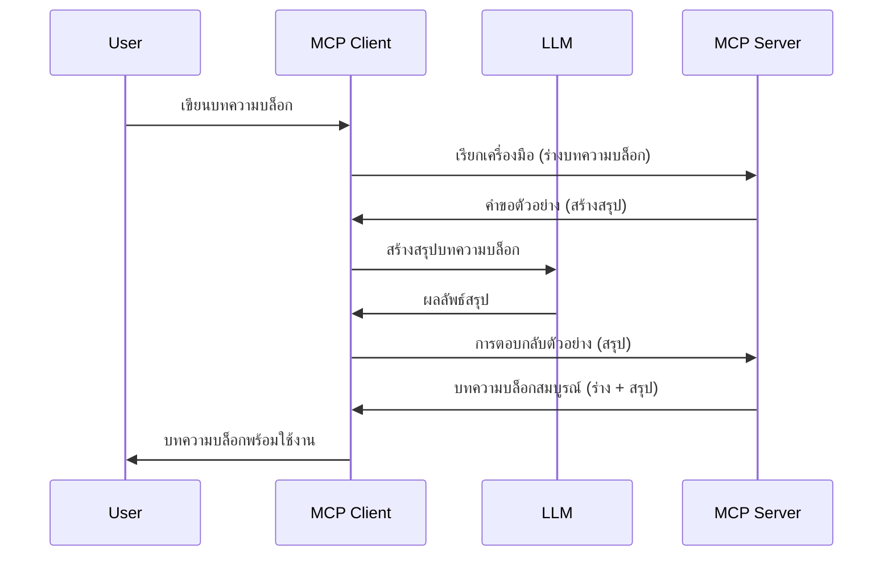

# Sampling - มอบหมายฟีเจอร์ให้กับ Client

บางครั้ง คุณจำเป็นต้องให้ MCP Client และ MCP Server ร่วมมือกันเพื่อบรรลุเป้าหมายร่วมกัน คุณอาจมีกรณีที่ Server ต้องการความช่วยเหลือจาก LLM ที่อยู่บน client สำหรับสถานการณ์นี้ sampling คือสิ่งที่คุณควรใช้

มาสำรวจกรณีการใช้งานบางส่วนและวิธีสร้างโซลูชันที่เกี่ยวข้องกับ sampling กัน

## ภาพรวม

ในบทเรียนนี้ เราจะเน้นอธิบายว่าเมื่อใดและที่ไหนควรใช้ Sampling และวิธีการตั้งค่า

## เป้าหมายการเรียนรู้

ในบทนี้ เราจะ:

- อธิบายว่า Sampling คืออะไรและเมื่อใดควรใช้
- แสดงวิธีตั้งค่า Sampling ใน MCP
- ให้ตัวอย่างการใช้งาน Sampling จริง

## Sampling คืออะไรและทำไมต้องใช้?

Sampling เป็นฟีเจอร์ขั้นสูงที่ทำงานในลักษณะดังนี้:



### คำขอ Sampling

โอเค ตอนนี้เรามีภาพรวมสถานการณ์ที่น่าเชื่อถือแล้ว เรามาคุยเกี่ยวกับคำขอ sampling ที่ server ส่งกลับไปยัง client กัน สิ่งที่ดูเหมือนคำขอในรูปแบบ JSON-RPC มีดังนี้:

```json
{
  "jsonrpc": "2.0",
  "id": 1,
  "method": "sampling/createMessage",
  "params": {
    "messages": [
      {
        "role": "user",
        "content": {
          "type": "text",
          "text": "Create a blog post summary of the following blog post: <BLOG POST>"
        }
      }
    ],
    "modelPreferences": {
      "hints": [
        {
          "name": "claude-3-sonnet"
        }
      ],
      "intelligencePriority": 0.8,
      "speedPriority": 0.5
    },
    "systemPrompt": "You are a helpful assistant.",
    "maxTokens": 100
  }
}
```

มีบางสิ่งที่ควรเรียกความสนใจที่นี่:

- Prompt ซึ่งอยู่ใน content -> text คือ prompt ของเราที่เป็นคำสั่งสำหรับ LLM ให้สรุปเนื้อหาบทความบล็อก

- **modelPreferences** ส่วนนี้คือความชอบ หรือคำแนะนำเกี่ยวกับการตั้งค่าเพื่อใช้ร่วมกับ LLM ผู้ใช้สามารถเลือกว่าจะใช้คำแนะนำเหล่านี้หรือแก้ไขตามต้องการ ในกรณีนี้มีคำแนะนำเกี่ยวกับโมเดลที่จะใช้ และลำดับความสำคัญด้านความเร็วและความเฉลียวฉลาด
- **systemPrompt** นี่คือ prompt ระบบปกติที่มอบบุคลิกภาพและคำแนะนำให้กับ LLM ของคุณ
- **maxTokens** คุณสมบัติอีกอย่างที่ใช้ระบุจำนวนโทเคนที่แนะนำให้ใช้สำหรับงานนี้

### การตอบสนอง Sampling

การตอบสนองนี้คือสิ่งที่ MCP Client ส่งกลับไปยัง MCP Server ซึ่งเป็นผลลัพธ์จากการที่ client เรียกใช้ LLM รอการตอบสนองนั้น แล้วสร้างข้อความนี้ขึ้นมา สิ่งที่อาจมีลักษณะดังนี้ในรูปแบบ JSON-RPC:

```json
{
  "jsonrpc": "2.0",
  "id": 1,
  "result": {
    "role": "assistant",
    "content": {
      "type": "text",
      "text": "Here's your abstract <ABSTRACT>"
    },
    "model": "gpt-5",
    "stopReason": "endTurn"
  }
}
```

สังเกตว่าการตอบสนองเป็นสาระสรุปของบทความบล็อกตามที่เราขอ นอกจากนี้สังเกตว่า `model` ที่ใช้ไม่ใช่โมเดลที่เราร้องขอแต่เป็น "gpt-5" แทน "claude-3-sonnet" เพื่อแสดงให้เห็นว่าผู้ใช้สามารถเปลี่ยนใจเกี่ยวกับการเลือกใช้โมเดลได้ และคำขอ sampling ของคุณเป็นเพียงคำแนะนำเท่านั้น

โอเค ตอนนี้ที่เราเข้าใจลำดับหลักและงานที่เป็นประโยชน์สำหรับใช้ "สร้างบทความบล็อก + สาระสรุป" มาดูกันว่าเราต้องทำอะไรเพื่อให้มันทำงานได้

### ประเภทข้อความ

ข้อความ sampling ไม่จำกัดแค่ข้อความ แต่คุณยังสามารถส่งภาพและเสียงได้ด้วย นี่คือลักษณะของ JSON-RPC ที่แตกต่างกัน:

**ข้อความ**

```json
{
  "type": "text",
  "text": "The message content"
}
```

**เนื้อหาภาพ**

```json
{
  "type": "image",
  "data": "base64-encoded-image-data",
  "mimeType": "image/jpeg"
}
```

**เนื้อหาเสียง**

```json
{
  "type": "audio",
  "data": "base64-encoded-audio-data",
  "mimeType": "audio/wav"
}
```

> NOTE: สำหรับข้อมูลที่ละเอียดเกี่ยวกับ Sampling โปรดดูที่ [เอกสารอย่างเป็นทางการ](https://modelcontextprotocol.io/specification/2025-11-25/client/sampling)

## วิธีตั้งค่า Sampling ใน Client

> หมายเหตุ: หากคุณสร้างแค่เซิร์ฟเวอร์เท่านั้น คุณไม่จำเป็นต้องทำอะไรเพิ่มมากนักที่นี่

ใน client คุณต้องระบุฟีเจอร์ดังนี้:

```json
{
  "capabilities": {
    "sampling": {}
  }
}
```

จากนั้นฟีเจอร์นี้จะถูกนำไปใช้เมื่อ client ที่เลือกเริ่มต้นเชื่อมต่อกับ server

## ตัวอย่าง Sampling ในการปฏิบัติ - สร้างบทความบล็อก

มาร่วมโค้ด sampling server กัน เราจำเป็นต้องทำสิ่งต่อไปนี้:

1. สร้างเครื่องมือบน Server
2. เครื่องมือนี้ควรสร้างคำขอ sampling
3. เครื่องมือควรรอคำขอ sampling จาก client และตอบกลับ
4. จากนั้นจึงให้ผลลัพธ์ของเครื่องมือ

มาดูโค้ดทีละขั้นตอน:

### -1- สร้างเครื่องมือ

**python**

```python
@mcp.tool()
async def create_blog(title: str, content: str, ctx: Context[ServerSession, None]) -> str:
    """Create a blog post and generate a summary"""

```

### -2- สร้างคำขอ sampling

ขยายเครื่องมือของคุณด้วยโค้ดดังนี้:

**python**

```python
post = BlogPost(
        id=len(posts) + 1,
        title=title,
        content=content,
        abstract=""
    )

prompt = f"Create an abstract of the following blog post: title: {title} and draft: {content} "

result = await ctx.session.create_message(
        messages=[
            SamplingMessage(
                role="user",
                content=TextContent(type="text", text=prompt),
            )
        ],
        max_tokens=100,
)

```

### -3- รอการตอบกลับและส่งต่อการตอบกลับ

**python**

```python
post.abstract = result.content.text

posts.append(post)

# ส่งคืนผลิตภัณฑ์ที่สมบูรณ์
return json.dumps({
    "id": post.title,
    "abstract": post.abstract
})
```

### -4- โค้ดเต็ม

**python**

```python
from starlette.applications import Starlette
from starlette.routing import Mount, Host

from mcp.server.fastmcp import Context, FastMCP

from mcp.server.session import ServerSession
from mcp.types import SamplingMessage, TextContent

import json


from uuid import uuid4
from typing import List
from pydantic import BaseModel


mcp = FastMCP("Blog post generator")

# app = FastAPI()

posts = []

class BlogPost(BaseModel):
    id: int
    title: str
    content: str
    abstract: str

posts: List[BlogPost] = []

@mcp.tool()
async def create_blog(title: str, content: str, ctx: Context[ServerSession, None]) -> str:
    """Create a blog post and generate a summary"""

    post = BlogPost(
        id=len(posts) + 1,
        title=title,
        content=content,
        abstract=""
    )

    prompt = f"Create an abstract of the following blog post: title: {title} and draft: {content} "

    result = await ctx.session.create_message(
        messages=[
            SamplingMessage(
                role="user",
                content=TextContent(type="text", text=prompt),
            )
        ],
        max_tokens=100,
    )

    post.abstract = result.content.text

    posts.append(post)

    # ส่งคืนโพสต์บล็อกฉบับสมบูรณ์
    return json.dumps({
        "id": post.title,
        "abstract": post.abstract
    })

if __name__ == "__main__":
    print("Starting server...")
    # mcp.run()
    mcp.run(transport="streamable-http")

# รันแอปด้วย: python server.py
```

### -5- ทดสอบใน Visual Studio Code

เพื่อทดสอบใน Visual Studio Code ให้ทำดังนี้:

1. เริ่ม server ใน terminal
2. เพิ่มมันใน *mcp.json* (และตรวจสอบให้แน่ใจว่าเริ่มทำงานแล้ว) เช่น:

   ```json
   "servers": {
      "blog-server": {
        "type": "http",
        "url": "http://localhost:8000/mcp"
      }
   }
   ```

3. พิมพ์ prompt:

   ```text
   create a blog post named "Where Python comes from", the content is "Python is actually named after Monty Python Flying Circus"
   ```

4. อนุญาตให้ sampling ทำงาน ครั้งแรกที่คุณทดสอบนี้ คุณจะเห็นกล่องโต้ตอบเพิ่มเติมซึ่งต้องยอมรับก่อน จากนั้นจะเห็นกล่องโต้ตอบปกติที่ขอให้คุณเรียกใช้เครื่องมือ

5. ตรวจสอบผลลัพธ์ คุณจะเห็นผลลัพธ์แสดงอย่างสวยงามใน GitHub Copilot Chat และยังสามารถตรวจสอบการตอบกลับ JSON ดิบได้เช่นกัน

**โบนัส** Visual Studio Code มีเครื่องมือที่สนับสนุน sampling อย่างดี คุณสามารถตั้งค่าการเข้าถึง Sampling บนเซิร์ฟเวอร์ที่ติดตั้งโดยทำตามนี้:

1. ไปยังส่วนส่วนขยาย
2. เลือกไอคอนฟันเฟืองสำหรับเซิร์ฟเวอร์ที่ติดตั้งในส่วน "MCP SERVERS - INSTALLED"
3. เลือก "Configure Model Access" ที่นี่คุณสามารถเลือกโมเดลที่ GitHub Copilot สามารถใช้เมื่อทำการ sampling ได้ และยังสามารถดูคำขอ sampling ล่าสุดโดยเลือก "Show Sampling requests"

## งานที่มอบหมาย

ในงานนี้ คุณจะสร้าง Sampling แบบที่แตกต่างเล็กน้อย นั่นคือ การผสมผสาน sampling ที่สนับสนุนการสร้างคำอธิบายสินค้า สถานการณ์ของคุณคือ:

**สถานการณ์**: พนักงานสำนักงานหลังบ้านของอีคอมเมิร์ซต้องการความช่วยเหลือ เพราะใช้เวลามากเกินไปในการสร้างคำอธิบายสินค้า ดังนั้นคุณต้องสร้างโซลูชันที่สามารถเรียกใช้เครื่องมือ "create_product" พร้อมอาร์กิวเมนต์ "title" และ "keywords" ซึ่งควรผลิตสินค้าที่ครบถ้วนรวมถึงฟิลด์ "description" ที่ควรจะถูกเติมโดย LLM ของ client

TIP: ใช้สิ่งที่คุณเรียนรู้ก่อนหน้านี้ในการสร้างเซิร์ฟเวอร์และเครื่องมือนี้โดยใช้คำขอ sampling

## โซลูชัน

[โซลูชัน](./solution/README.md)

## ข้อสรุปสำคัญ

Sampling คือฟีเจอร์ทรงพลังที่อนุญาตให้ server มอบหมายงานให้ client เมื่อ server ต้องการความช่วยเหลือจาก LLM

## ขั้นตอนต่อไป

- [บทที่ 4 - การประยุกต์ใช้งานจริง](../../04-PracticalImplementation/README.md)

---

<!-- CO-OP TRANSLATOR DISCLAIMER START -->
**ปฏิเสธความรับผิดชอบ**:
เอกสารนี้ได้รับการแปลโดยใช้บริการแปลภาษา AI [Co-op Translator](https://github.com/Azure/co-op-translator) ขณะที่เราพยายามให้ความถูกต้อง โปรดทราบว่าการแปลโดยอัตโนมัติอาจมีข้อผิดพลาดหรือความไม่ถูกต้อง เอกสารต้นฉบับในภาษาต้นทางควรถูกพิจารณาเป็นแหล่งข้อมูลที่เชื่อถือได้ สำหรับข้อมูลที่สำคัญ แนะนำให้ใช้การแปลโดยมนุษย์มืออาชีพ เราไม่รับผิดชอบต่อความเข้าใจผิดหรือการตีความที่ผิดพลาดที่เกิดขึ้นจากการใช้การแปลนี้
<!-- CO-OP TRANSLATOR DISCLAIMER END -->