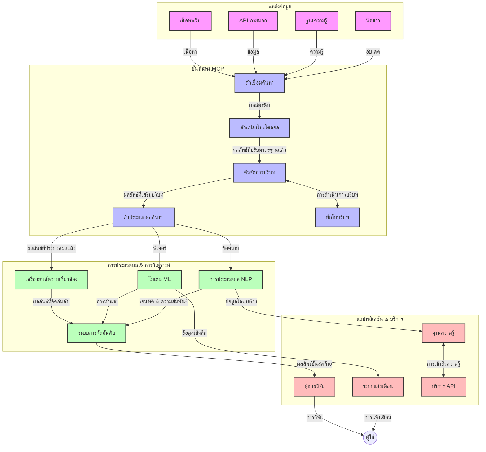
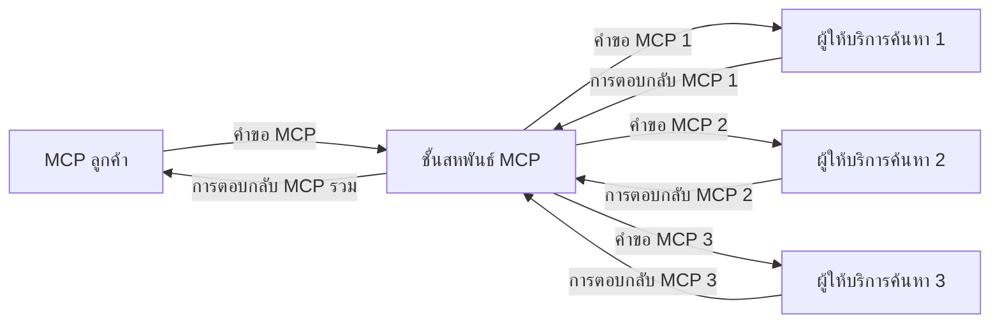
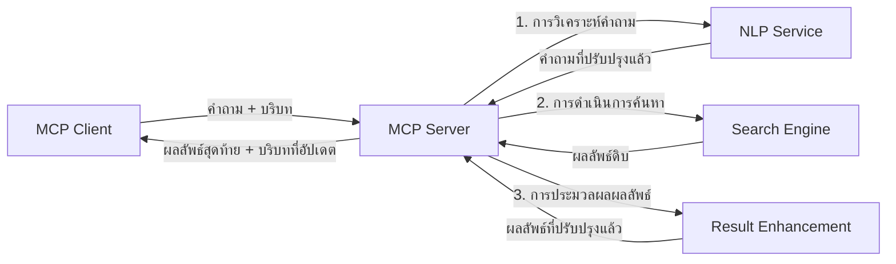

# โปรโตคอลบริบทแบบจำลองสำหรับการค้นหาเว็บแบบเวลาจริง

## ภาพรวม

การค้นหาเว็บแบบเวลาจริงกลายเป็นสิ่งจำเป็นในสภาพแวดล้อมที่ขับเคลื่อนด้วยข้อมูลในปัจจุบัน ซึ่งแอปพลิเคชันต่างๆ ต้องการเข้าถึงข้อมูลที่อัปเดตอย่างทันทีทันใดทั่วทั้งอินเทอร์เน็ตเพื่อให้ได้ผลลัพธ์ที่เกี่ยวข้องและทันเวลา โปรโตคอลบริบทแบบจำลอง (Model Context Protocol - MCP) เป็นความก้าวหน้าที่สำคัญในการปรับปรุงกระบวนการค้นหาแบบเวลาจริงเหล่านี้ เพิ่มประสิทธิภาพการค้นหา รักษาความสมบูรณ์ของบริบท และปรับปรุงประสิทธิภาพโดยรวมของระบบ

โมดูลนี้จะสำรวจว่า MCP เปลี่ยนแปลงการค้นหาเว็บแบบเวลาจริงอย่างไรโดยการมอบแนวทางมาตรฐานสำหรับการจัดการบริบทระหว่างโมเดล AI, เครื่องมือค้นหา และแอปพลิเคชันต่างๆ

### สิ่งที่คุณจะได้เรียนรู้

ในคู่มือฉบับสมบูรณ์นี้ คุณจะค้นพบ:

- วิธีที่ MCP สร้างสะพานเชื่อมต่อที่ไร้รอยต่อระหว่างโมเดล AI และความสามารถในการค้นหาเว็บแบบเวลาจริง
- แพตเทิร์นสถาปัตยกรรมสำหรับการใช้งานโซลูชันการค้นหาที่มีประสิทธิภาพและขยายตัวได้ด้วย MCP
- เทคนิคในการรักษาบริบทการค้นหาข้ามหลายคำค้นหาและการโต้ตอบ
- การใช้งานโค้ดจริงใน Python และ JavaScript สำหรับสถานการณ์การค้นหาต่างๆ
- วิธีการปรับสมดุลระหว่างความเกี่ยวข้อง ความสดใหม่ และประสิทธิภาพในระบบค้นหาที่ใช้ MCP

## บทนำสู่การค้นหาเว็บแบบเวลาจริง

การค้นหาเว็บแบบเวลาจริงคือแนวทางทางเทคโนโลยีที่ช่วยให้มีการสอบถาม ประมวลผล และวิเคราะห์ข้อมูลที่อยู่บนเว็บอย่างต่อเนื่องตามที่มีการเผยแพร่หรืออัปเดต ทำให้ระบบสามารถให้ข้อมูลที่สดและเกี่ยวข้องได้โดยมีความหน่วงต่ำ ต่างจากระบบค้นหาแบบเดิมที่ใช้ข้อมูลดัชนีซึ่งอาจเก็บไว้นานเป็นชั่วโมงหรือวัน การค้นหาแบบเวลาจริงจะประมวลผลข้อมูลสดจากเว็บ มอบข้อมูลเชิงลึกและข้อมูลที่สะท้อนสภาพปัจจุบันของเนื้อหาออนไลน์

### แนวคิดหลักของการค้นหาเว็บแบบเวลาจริง:

- **การประมวลผลคำค้นหาอย่างต่อเนื่อง**: คำค้นหาถูกประมวลผลกับแหล่งข้อมูลที่อัปเดตอย่างต่อเนื่อง  
- **การให้ความสำคัญกับความสดใหม่**: ระบบออกแบบมาเพื่อให้ความสำคัญกับข้อมูลที่สดใหม่  
- **การปรับสมดุลความเกี่ยวข้อง**: รักษาสมดุลระหว่างความเกี่ยวข้องและความสดใหม่  
- **สถาปัตยกรรมที่ขยายตัวได้**: ระบบต้องรองรับภาระงานและปริมาณข้อมูลที่เปลี่ยนแปลงได้  
- **ความเข้าใจในบริบท**: การรักษาบริบทของผู้ใช้ข้ามแต่ละขั้นตอนการค้นหามีความสำคัญต่อการให้ผลลัพธ์ที่มีความหมาย  
- **การปรับปรุงคำค้นหาอย่างไดนามิก**: การปรับเปลี่ยนคำค้นหาอย่างเหมาะสมตามบริบทและผลลัพธ์ก่อนหน้า  
- **การรวมแหล่งข้อมูลหลายแหล่ง**: รวมผลลัพธ์จากผู้ให้บริการค้นหาหลายรายและแหล่งเว็บต่างๆ  
- **ความเข้าใจเชิงความหมาย**: ประมวลผลคำค้นหาและเนื้อหาตามความหมาย ไม่ใช่แค่คำสำคัญ  
- **การจัดอันดับแบบเวลาจริง**: ปรับลำดับผลลัพธ์อย่างต่อเนื่องเมื่อมีข้อมูลใหม่เข้ามา

### โปรโตคอลบริบทแบบจำลองและการค้นหาเว็บแบบเวลาจริง

โปรโตคอลบริบทแบบจำลอง (MCP) แก้ไขความท้าทายที่สำคัญหลายประการในสภาพแวดล้อมการค้นหาเว็บแบบเวลาจริงดังนี้:

1. **การรักษาบริบทการค้นหา**: MCP มาตรฐานวิธีการรักษาบริบททั่วส่วนประกอบการค้นหาที่กระจายอยู่ เพื่อให้โมเดล AI และโหนดประมวลผลสามารถเข้าถึงประวัติคำค้นและความชอบของผู้ใช้ที่เกี่ยวข้องได้

2. **การจัดการคำค้นที่มีประสิทธิภาพ**: โดยมอบกลไกโครงสร้างสำหรับการส่งบริบท MCP ลดภาระงานซ้ำจากการส่งบริบทในแต่ละรอบการค้นหา

3. **ความสามารถในการทำงานร่วมกัน**: MCP สร้างภาษากลางสำหรับการแชร์บริบทระหว่างเทคโนโลยีค้นหาหลากหลายและโมเดล AI ช่วยให้สถาปัตยกรรมยืดหยุ่นและขยายตัวได้มากขึ้น

4. **บริบทที่ปรับเพื่อการค้นหา**: การใช้งาน MCP สามารถให้ความสำคัญกับองค์ประกอบบริบทที่เกี่ยวข้องที่สุดสำหรับการค้นหาที่มีประสิทธิภาพ ปรับให้เหมาะสมทั้งประสิทธิภาพและความแม่นยำ

5. **การประมวลผลการค้นหาแบบปรับตัว**: ด้วยการจัดการบริบทอย่างเหมาะสมผ่าน MCP ระบบค้นหาสามารถปรับกระบวนการตามความต้องการของผู้ใช้ที่เปลี่ยนแปลงและภูมิทัศน์ข้อมูล

ในแอปพลิเคชันสมัยใหม่ตั้งแต่การรวบรวมข่าวสารถึงผู้ช่วยวิจัย การบูรณาการ MCP กับเทคโนโลยีการค้นหาเว็บทำให้สามารถค้นหาอย่างชาญฉลาด มีบริบทรับรู้ และให้ผลลัพธ์ที่เกี่ยวข้องมากขึ้นเรื่อยๆ ตามการโต้ตอบของผู้ใช้

## วัตถุประสงค์การเรียนรู้

เมื่อจบบทเรียนนี้ คุณจะสามารถ:

- เข้าใจพื้นฐานของการค้นหาเว็บแบบเวลาจริงและความท้าทายในแอปพลิเคชันสมัยใหม่  
- อธิบายว่าทำไมโปรโตคอลบริบทแบบจำลอง (MCP) ช่วยเพิ่มความสามารถของการค้นหาเว็บแบบเวลาจริง  
- ใช้งานโซลูชันการค้นหาที่อิง MCP โดยใช้เฟรมเวิร์กและ API ยอดนิยม  
- ออกแบบและปรับใช้สถาปัตยกรรมการค้นหาที่ขยายตัวได้และมีประสิทธิภาพสูงด้วย MCP  
- ใช้แนวคิด MCP กับกรณีการใช้งานต่าง ๆ รวมถึงการค้นหาเชิงความหมาย การช่วยวิจัย และการท่องเว็บที่เสริมด้วย AI  
- ประเมินแนวโน้มและนวัตกรรมในอนาคตของเทคโนโลยีค้นหาที่ใช้ MCP  
- พัฒนาระบบค้นหาที่รับรู้บริบทและเรียนรู้จากการโต้ตอบของผู้ใช้  
- รวมความสามารถการค้นหาเว็บเข้ากับผู้ช่วย AI โดยใช้โปรโตคอล MCP ที่ได้มาตรฐาน  
- สร้างสายการค้นหาหลายขั้นตอนที่ปรับปรุงผลลัพธ์ตามบริบทอย่างก้าวหน้า  
- ปรับปรุงประสิทธิภาพการค้นหาในขณะที่รักษาการรับรู้บริบทครบถ้วน

### คำนิยามและความสำคัญ

การค้นหาเว็บแบบเวลาจริงเกี่ยวข้องกับการสอบถาม ดึงข้อมูล และจัดส่งข้อมูลบนเว็บอย่างต่อเนื่องโดยมีความหน่วงต่ำ แตกต่างจากเครื่องมือค้นหาแบบดั้งเดิมที่ครอบคลุมเว็บแบบเป็นช่วง MCP มุ่งมั่นที่จะนำเสนอข้อมูลทันทีทันใดในขณะที่ข้อมูลใหม่ปรากฏ ทำให้เข้าถึงเนื้อหาที่เป็นปัจจุบันที่สุดได้อย่างรวดเร็ว

คุณลักษณะสำคัญของการค้นหาเว็บแบบเวลาจริงได้แก่:

- **ความสดใหม่**: ให้ความสำคัญกับเนื้อหาล่าสุดและการอัปเดต  
- **การประมวลผลต่อเนื่อง**: ตรวจสอบข้อมูลใหม่อย่างสม่ำเสมอ  
- **การปรับคำค้น**: ปรับปรุงคำค้นตามบริบทและข้อเสนอแนะ  
- **การจัดส่งทันที**: ส่งมอบผลการค้นหาอย่างรวดเร็ว  
- **การเก็บบริบท**: ใช้คำค้นก่อนหน้าเพื่อเพิ่มความเกี่ยวข้อง

### ความท้าทายใน การค้นหาเว็บแบบดั้งเดิม

แนวทางการค้นหาเว็บแบบดั้งเดิมเผชิญข้อจำกัดหลายประการเมื่อใช้กับสถานการณ์แบบเวลาจริง:

1. **การกระจัดกระจายบริบท**: ยากที่จะรักษาบริบทการค้นหาข้ามหลายคำค้นหา  
2. **ความสดใหม่ของข้อมูล**: ยากที่จะเข้าถึงและให้ความสำคัญกับข้อมูลล่าสุด  
3. **ความซับซ้อนในการผสานรวม**: ปัญหาการทำงานร่วมกันระหว่างระบบค้นหาและแอปพลิเคชัน  
4. **ปัญหาเรื่องความหน่วง**: ต้องปรับสมดุลระหว่างการค้นหาอย่างครอบคลุมกับความเร็วตอบสนอง  
5. **การปรับความเกี่ยวข้อง**: ยืนยันความแม่นยำและความเกี่ยวข้องในขณะที่ให้ความสำคัญกับความสดใหม่

## การทำความเข้าใจโปรโตคอลบริบทแบบจำลอง (MCP) สำหรับการค้นหา

### MCP ในบริบทการค้นหาคืออะไร?

โปรโตคอลบริบทแบบจำลอง (MCP) คือโปรโตคอลสื่อสารมาตรฐานที่ออกแบบมาเพื่อส่งเสริมการโต้ตอบที่มีประสิทธิภาพระหว่างโมเดล AI และแอปพลิเคชัน ในบริบทของการค้นหาเว็บแบบเวลาจริง MCP มอบกรอบงานสำหรับ:

- การรักษาบริบทการค้นหาตลอดลำดับคำค้น
- การมาตรฐานรูปแบบคำค้นหาและผลลัพธ์
- การเพิ่มประสิทธิภาพการส่งผ่านพารามิเตอร์และผลลัพธ์การค้นหา
- การเสริมสร้างการสื่อสารระหว่างโมเดลและเครื่องมือค้นหา

### ส่วนประกอบหลักและสถาปัตยกรรม

สถาปัตยกรรม MCP สำหรับการค้นหาเว็บแบบเวลาจริงประกอบด้วยส่วนประกอบสำคัญหลายส่วน:

1. **ตัวจัดการบริบทคำค้น**: จัดการและรักษาบริบทการค้นหาข้ามหลายคำค้น  
2. **ตัวประมวลผลการค้นหา**: ประมวลผลคำค้นที่เข้ามาโดยใช้เทคนิคที่รับรู้บริบท  
3. **อะแดปเตอร์โปรโตคอล**: แปลงระหว่าง API การค้นหาที่หลากหลายพร้อมรักษาบริบท  
4. **ที่เก็บบริบท**: จัดเก็บและกู้คืนประวัติการค้นหาและความชอบได้อย่างมีประสิทธิภาพ  
5. **ตัวเชื่อมต่อการค้นหา**: เชื่อมต่อกับเครื่องมือค้นหาต่างๆ และ API เว็บ



### MCP ช่วยปรับปรุงการค้นหาเว็บแบบเวลาจริงอย่างไร

MCP แก้ไขปัญหาการค้นหาเว็บแบบดั้งเดิมผ่าน:

- **ความต่อเนื่องของบริบท**: รักษาความสัมพันธ์ระหว่างคำค้นข้ามทั้งช่วงเซสชันการค้นหา  
- **การส่งผ่านที่เพิ่มประสิทธิภาพ**: ลดความซ้ำซ้อนของพารามิเตอร์การค้นหาผ่านการจัดการบริบทอัจฉริยะ  
- **อินเทอร์เฟซมาตรฐาน**: มอบ API ที่สม่ำเสมอสำหรับส่วนประกอบการค้นหา  
- **ลดความหน่วง**: ลดภาระประมวลผลด้วยการจัดการบริบทอย่างมีประสิทธิภาพ  
- **เพิ่มความเกี่ยวข้อง**: ปรับปรุงความเกี่ยวข้องของการค้นหาโดยรักษาเจตนาของผู้ใช้ข้ามหลายคำค้น

## การบูรณาการและการใช้งาน

ระบบค้นหาเว็บแบบเวลาจริงต้องการการออกแบบสถาปัตยกรรมและการใช้งานอย่างรอบคอบเพื่อรักษาทั้งประสิทธิภาพและความสมบูรณ์ของบริบท โปรโตคอลบริบทแบบจำลองนำเสนอแนวทางมาตรฐานสำหรับการบูรณาการโมเดล AI และเทคโนโลยีการค้นหา ซึ่งช่วยให้สร้างสายการค้นหาที่รับรู้บริบทได้อย่างซับซ้อนยิ่งขึ้น

### ภาพรวมการบูรณาการ MCP ในสถาปัตยกรรมการค้นหา

การใช้งาน MCP ในสภาพแวดล้อมการค้นหาเว็บแบบเวลาจริงมีประเด็นสำคัญหลายประการ:

1. **การซีเรียลไลซ์บริบทการค้นหา**: MCP มีวิธีการที่มีประสิทธิภาพสำหรับการเข้ารหัสข้อมูลบริบทภายในคำขอการค้นหา เพื่อให้บริบทสำคัญติดตามคำค้นผ่านกระบวนการประมวลผล รวมถึงรูปแบบการซีเรียลไลซ์ที่เป็นมาตรฐานและเหมาะสำหรับเมตาดาต้าที่เกี่ยวข้องกับการค้นหา

2. **การประมวลผลการค้นหาแบบมีสถานะ**: MCP สนับสนุนการประมวลผลแบบมีสถานะอย่างชาญฉลาดมากขึ้นโดยรักษาการแทนบริบทที่สม่ำเสมอข้ามรอบการค้นหา ซึ่งมีค่ายิ่งในสายการค้นหาหลายขั้นตอนที่บริบทช่วยปรับปรุงผลลัพธ์

3. **การขยายและขัดเกลาคำค้น**: การใช้งาน MCP ในระบบค้นหาสามารถส่งเสริมการขยายและขัดเกลาคำค้นอย่างซับซ้อนโดยอิงจากบริบทที่สะสม ทำให้ได้ผลลัพธ์ที่เกี่ยวข้องมากขึ้นตามความคืบหน้าของเซสชันการค้นหา

4. **การแคชและการจัดลำดับความสำคัญของผลลัพธ์**: ด้วยการมาตรฐานการจัดการบริบท MCP ช่วยจัดการการแคชและลำดับความสำคัญของผลลัพธ์ ทำให้ส่วนประกอบสามารถปรับตัวตามบริบทการค้นหาที่เปลี่ยนแปลง

5. **การรวมและรวบรวมการค้นหาจากหลายแหล่ง**: MCP ส่งเสริมการรวมการค้นหาข้ามหลายแบ็กเอนด์อย่างซับซ้อนโดยมอบการแทนบริบทการค้นหาอย่างมีโครงสร้าง ช่วยให้การรวบรวมผลลัพธ์จากแหล่งที่หลากหลายมีความหมายมากขึ้น

การใช้งาน MCP กับเทคโนโลยีการค้นหาต่างๆ สร้างแนวทางการจัดการบริบทแบบรวม ลดความจำเป็นในการเขียนโค้ดบูรณาการเฉพาะทางในขณะที่เพิ่มความสามารถของระบบในการรักษาบริบทที่มีความหมายเมื่อคำค้นพัฒนาไป

### MCP ในการใช้งานการค้นหาเว็บต่างๆ

ตัวอย่างเหล่านี้เป็นไปตามข้อกำหนด MCP ปัจจุบันที่เน้นโปรโตคอลแบบ JSON-RPC พร้อมด้วยกลไกการขนส่งที่แตกต่างกัน โค้ดแสดงวิธีที่คุณสามารถใช้งานการบูรณาการการค้นหาที่กำหนดเองในขณะที่ยังรักษาความเข้ากันได้เต็มรูปแบบกับโปรโตคอล MCP


<details>
<summary>ตัวอย่างการใช้งานใน Python กับ Generic Search API</summary>

```python
import asyncio
import json
import aiohttp
from typing import Dict, Any, Optional, List
from contextlib import asynccontextmanager
from collections.abc import AsyncIterator

# นำเข้าสู่ไลบรารี MCP มาตรฐาน
from mcp.client.session import ClientSession
from mcp.client.streamable_http import streamablehttp_client
from mcp.types import TextContent, CreateMessageRequestParams, CreateMessageResult
from mcp.server.fastmcp import FastMCP

# สร้างเซิร์ฟเวอร์ FastMCP สำหรับค้นหาเว็บ
search_server = FastMCP("WebSearch")

# คลาสสำหรับจัดการการดำเนินการค้นหาเว็บ
class WebSearchHandler:
    def __init__(self, api_endpoint: str, api_key: str):
        self.api_endpoint = api_endpoint
        self.api_key = api_key
        self.session = None
        
    async def initialize(self):
        """Initialize the HTTP session"""
        self.session = aiohttp.ClientSession(
            headers={"Authorization": f"Bearer {self.api_key}"}
        )
    
    async def close(self):
        """Close the HTTP session"""
        if self.session:
            await self.session.close()
            
    async def perform_search(self, query: str, max_results: int = 5, 
                           include_domains: List[str] = None, 
                           exclude_domains: List[str] = None,
                           time_period: str = "any") -> Dict[str, Any]:
        """Perform web search using the search API"""
        # สร้างพารามิเตอร์การค้นหา
        search_params = {
            "q": query,
            "limit": max_results,
            "time": time_period
        }
        
        if include_domains:
            search_params["site"] = ",".join(include_domains)
            
        if exclude_domains:
            search_params["exclude_site"] = ",".join(exclude_domains)
        
        # ดำเนินการคำขอค้นหา
        try:
            async with self.session.get(
                self.api_endpoint,
                params=search_params
            ) as response:
                if response.status != 200:
                    error_text = await response.text()
                    raise Exception(f"Search API error: {response.status} - {error_text}")
                
                search_data = await response.json()
                
                # แปลงการตอบกลับเฉพาะ API เป็นรูปแบบมาตรฐาน
                results = []
                for item in search_data.get("results", []):
                    results.append({
                        "title": item.get("title", ""),
                        "url": item.get("url", ""),
                        "snippet": item.get("snippet", ""),
                        "date": item.get("published_date", ""),
                        "source": item.get("source", "")
                    })
                
                return {
                    "query": query,
                    "totalResults": len(results),
                    "results": results
                }
        except Exception as e:
            print(f"Search API request error: {e}")
            raise

# เริ่มต้นตัวจัดการการค้นหา
search_handler = WebSearchHandler(
    api_endpoint="https://api.search-service.example/search",
    api_key="your-api-key-here"
)

# ตั้งค่าอายุการใช้งานเพื่อจัดการตัวจัดการการค้นหา
@asyncio.asynccontextmanager
async def app_lifespan(server: FastMCP):
    """Manage application lifecycle"""
    await search_handler.initialize()
    try:
        yield {"search_handler": search_handler}
    finally:
        await search_handler.close()

# ตั้งค่าอายุการใช้งานสำหรับเซิร์ฟเวอร์
search_server = FastMCP("WebSearch", lifespan=app_lifespan)

# ลงทะเบียนเครื่องมือค้นหาเว็บ
@search_server.tool()
async def web_search(query: str, max_results: int = 5, 
                   include_domains: List[str] = None,
                   exclude_domains: List[str] = None,
                   time_period: str = "any") -> Dict[str, Any]:
    """
    Search the web for information
    
    Args:
        query: The search query
        max_results: Maximum number of results to return (default: 5)
        include_domains: List of domains to include in search results
        exclude_domains: List of domains to exclude from search results
        time_period: Time period for results ("day", "week", "month", "any")
        
    Returns:
        Dictionary containing search results
    """
    ctx = search_server.get_context()
    search_handler = ctx.request_context.lifespan_context["search_handler"]
    
    results = await search_handler.perform_search(
        query=query,
        max_results=max_results,
        include_domains=include_domains,
        exclude_domains=exclude_domains,
        time_period=time_period
    )
    
    return results

# ตัวอย่างการใช้งานของไคลเอนต์
async def client_example():
    # เชื่อมต่อกับเซิร์ฟเวอร์ค้นหาโดยใช้การขนส่ง HTTP แบบสตรีม
    async with streamablehttp_client("http://localhost:8000/mcp") as (read, write, _):
        async with ClientSession(read, write) as session:
            # เริ่มต้นการเชื่อมต่อ
            await session.initialize()
            
            # เรียกใช้เครื่องมือ web_search
            search_results = await session.call_tool(
                "web_search", 
                {
                    "query": "latest developments in AI and Model Context Protocol",
                    "max_results": 5,
                    "time_period": "day",
                    "include_domains": ["github.com", "microsoft.com"]
                }
            )
            
            print(f"Search results: {search_results}")

# ตัวอย่างการรันเซิร์ฟเวอร์
if __name__ == "__main__":
    # รันเซิร์ฟเวอร์ด้วยการขนส่ง HTTP แบบสตรีม
    search_server.run(transport="streamable-http")
```
</details> 

<details>
<summary>ตัวอย่างการใช้งานใน JavaScript กับการค้นหาบนเบราว์เซอร์</summary>


```javascript
// การใช้งานเซิร์ฟเวอร์ MCP สำหรับการค้นหาเว็บ
import { McpServer, ResourceTemplate } from '@modelcontextprotocol/sdk/server/mcp.js';
import { StreamableHTTPServerTransport } from '@modelcontextprotocol/sdk/server/streamableHttp.js';
import { z } from 'zod';

// สร้างเซิร์ฟเวอร์ MCP สำหรับการค้นหาเว็บ
const searchServer = new McpServer({
    name: "BrowserSearch",
    description: "A server that provides web search capabilities"
});

// คลาสบริการการค้นหา
class SearchService {
    constructor(searchApiUrl, apiKey) {
        this.searchApiUrl = searchApiUrl;
        this.apiKey = apiKey;
    }

    async performSearch(parameters) {
        const {
            query = '',
            maxResults = 5,
            includeDomains = [],
            excludeDomains = [],
            timePeriod = 'any'
        } = parameters;
        
        // สร้าง URL การค้นหาพร้อมพารามิเตอร์
        const url = new URL(this.searchApiUrl);
        url.searchParams.append('q', query);
        url.searchParams.append('limit', maxResults);
        url.searchParams.append('time', timePeriod);
        
        if (includeDomains.length > 0) {
            url.searchParams.append('site', includeDomains.join(','));
        }
        
        if (excludeDomains.length > 0) {
            url.searchParams.append('exclude_site', excludeDomains.join(','));
        }
        
        try {
            const response = await fetch(url.toString(), {
                method: 'GET',
                headers: {
                    'Authorization': `Bearer ${this.apiKey}`,
                    'Content-Type': 'application/json'
                }
            });
            
            if (!response.ok) {
                const errorText = await response.text();
                throw new Error(`Search API error: ${response.status} - ${errorText}`);
            }
            
            const searchData = await response.json();
            
            // แปลงการตอบสนองเฉพาะ API เป็นรูปแบบมาตรฐาน
            const results = searchData.results?.map(item => ({
                title: item.title || '',
                url: item.url || '',
                snippet: item.snippet || '',
                date: item.published_date || '',
                source: item.source || ''
            })) || [];
            
            return {
                query,
                totalResults: results.length,
                results
            };
        } catch (error) {
            console.error('Search API request error:', error);
            throw error;
        }
    }
}

// เริ่มต้นบริการการค้นหา
const searchService = new SearchService(
    'https://api.search-service.example/search',
    'your-api-key-here'
);

// ตั้งค่าโปรไวเดอร์บริบทสำหรับเซิร์ฟเวอร์
searchServer.setContextProvider(() => {
    return {
        searchService
    };
});

// ลงทะเบียนเครื่องมือค้นหาเว็บ
searchServer.tool({
    name: 'web_search',
    description: 'Search the web for information',
    parameters: {
        type: 'object',
        properties: {
            query: {
                type: 'string',
                description: 'The search query'
            },
            maxResults: {
                type: 'integer',
                description: 'Maximum number of results to return',
                default: 5
            },
            includeDomains: {
                type: 'array',
                items: { type: 'string' },
                description: 'List of domains to include in search results'
            },
            excludeDomains: {
                type: 'array',
                items: { type: 'string' },
                description: 'List of domains to exclude from search results'
            },
            timePeriod: {
                type: 'string',
                description: 'Time period for results',
                enum: ['day', 'week', 'month', 'any'],
                default: 'any'
            }
        },
        required: ['query']
    },
    handler: async (params, context) => {
        const { searchService } = context;
        return await searchService.performSearch(params);
    }
});

// ตัวอย่างโค้ดลูกค้าเพื่อเชื่อมต่อกับเซิร์ฟเวอร์ค้นหา
import { Client } from '@modelcontextprotocol/sdk/client/index.js';
import { StreamableHTTPClientTransport } from '@modelcontextprotocol/sdk/client/streamableHttp.js';

async function connectToSearchServer() {
    // เชื่อมต่อกับเซิร์ฟเวอร์ค้นหา
    const transport = new StreamableHTTPClientTransport(
        new URL('http://localhost:8000/mcp')
    );
    
    const client = new Client({
        name: 'search-client',
        version: '1.0.0'
    });
    
    await client.connect(transport);
    
    // เรียกใช้เครื่องมือค้นหา
    const searchResults = await client.callTool({
        name: 'web_search',
        arguments: {
            query: 'Model Context Protocol implementation examples',
            maxResults: 10,
            timePeriod: 'week',
            includeDomains: ['github.com', 'docs.microsoft.com']
        }
    });
    
    console.log('Search results:', searchResults);
    
    // ทำความสะอาด
    await client.disconnect();
}

// เริ่มเซิร์ฟเวอร์
const transport = new StreamableHTTPServerTransport();
await searchServer.connect(transport);
console.log('Search server running at http://localhost:8000/mcp');

// ในกระบวนการแยกต่างหาก หรือหลังจากที่เซิร์ฟเวอร์เริ่มทำงานแล้ว
// connectToSearchServer().catch(console.error);
```
</details> 


## ข้อจำกัดความรับผิดชอบของตัวอย่างโค้ด

> **หมายเหตุสำคัญ**: ตัวอย่างโค้ดด้านล่างนี้แสดงการบูรณาการโปรโตคอลบริบทแบบจำลอง (MCP) กับฟังก์ชันการค้นหาเว็บ แม้ว่าจะปฏิบัติตามรูปแบบและโครงสร้างของ SDK MCP อย่างเป็นทางการ แต่โค้ดเหล่านี้ถูกทำให้ง่ายลงเพื่อวัตถุประสงค์ทางการศึกษา  
>  
> ตัวอย่างเหล่านี้แสดงถึง:  
>  
> 1. **การใช้งานใน Python**: การใช้งานเซิร์ฟเวอร์ FastMCP ที่ให้เครื่องมือค้นหาเว็บและเชื่อมต่อกับ API การค้นหาภายนอก ตัวอย่างนี้แสดงการจัดการวงจรชีวิตอย่างเหมาะสม การจัดการบริบท และการใช้งานเครื่องมือ ตามรูปแบบของ [MCP Python SDK อย่างเป็นทางการ](https://github.com/modelcontextprotocol/python-sdk) เซิร์ฟเวอร์นี้ใช้การขนส่ง Streamable HTTP ที่แนะนำแทนการขนส่ง SSE รุ่นเก่าสำหรับการปรับใช้จริง  
>  
> 2. **การใช้งานใน JavaScript**: การใช้งาน TypeScript/JavaScript โดยใช้แพตเทิร์น FastMCP จาก [MCP TypeScript SDK อย่างเป็นทางการ](https://github.com/modelcontextprotocol/typescript-sdk) เพื่อสร้างเซิร์ฟเวอร์ค้นหาพร้อมนิยามเครื่องมือและการเชื่อมต่อไคลเอ็นต์อย่างเหมาะสม ปฏิบัติตามรูปแบบล่าสุดสำหรับการจัดการเซสชันและการรักษาบริบท  
>  
> ตัวอย่างเหล่านี้ต้องการการจัดการข้อผิดพลาด การพิสูจน์ตัวตน และโค้ดผสาน API เฉพาะทางเพิ่มเติมสำหรับการใช้งานจริง จุดปลาย API การค้นหาที่แสดง (`https://api.search-service.example/search`) เป็นเพียงตัวอย่างและควรแทนที่ด้วยจุดปลายบริการค้นหาจริง  
>  
> สำหรับรายละเอียดการใช้งานเต็มและแนวทางที่เป็นปัจจุบันที่สุด โปรดดูที่ [ข้อกำหนด MCP อย่างเป็นทางการ](https://spec.modelcontextprotocol.io/) และเอกสาร SDK

## แนวคิดหลัก

### กรอบงานโปรโตคอลบริบทแบบจำลอง (MCP)

ในพื้นฐาน โปรโตคอลบริบทแบบจำลองมอบวิธีการมาตรฐานสำหรับโมเดล AI แอปพลิเคชัน และบริการในการแลกเปลี่ยนบริบท ในการค้นหาเว็บแบบเวลาจริง กรอบงานนี้มีความสำคัญในการสร้างประสบการณ์การค้นหาหลายขั้นตอนที่สอดคล้องกัน ส่วนประกอบสำคัญรวมถึง:

1. **สถาปัตยกรรมลูกค้า-เซิร์ฟเวอร์**: MCP กำหนดการแยกชัดเจนระหว่างลูกค้าการค้นหา (ผู้ร้องขอ) และเซิร์ฟเวอร์การค้นหา (ผู้ให้บริการ) อนุญาตให้มีรูปแบบการปรับใช้ที่ยืดหยุ่น

2. **การสื่อสาร JSON-RPC**: โปรโตคอลใช้ JSON-RPC สำหรับแลกเปลี่ยนข้อความ ทำให้เข้ากันได้กับเทคโนโลยีเว็บและง่ายต่อการใช้งานบนแพลตฟอร์มต่างๆ

3. **การจัดการบริบท**: MCP กำหนดวิธีการมีโครงสร้างสำหรับการรักษา ปรับปรุง และใช้บริบทการค้นหาข้ามหลายการโต้ตอบ

4. **นิยามเครื่องมือ**: ความสามารถการค้นหาถูกเปิดเผยเป็นเครื่องมือมาตรฐานพร้อมพารามิเตอร์และค่าตอบกลับที่ชัดเจน

5. **รองรับการสตรีมมิ่ง**: โปรโตคอลรองรับการสตรีมผลลัพธ์ ซึ่งจำเป็นสำหรับการค้นหาแบบเวลาจริงที่ผลลัพธ์อาจมาถึงอย่างต่อเนื่อง

### แพตเทิร์นการบูรณาการการค้นหาเว็บ

เมื่อบูรณาการ MCP กับการค้นหาเว็บ จะพบแพตเทิร์นหลายอย่าง:

#### 1. การบูรณาการผู้ให้บริการค้นหาโดยตรง


ในแพตเทิร์นนี้ เซิร์ฟเวอร์ MCP ติดต่อโดยตรงกับ API การค้นหาอย่างน้อยหนึ่งรายการ โดยแปลงคำขอ MCP เป็นการเรียก API ที่เฉพาะเจาะจงและจัดรูปแบบผลลัพธ์เป็นการตอบกลับของ MCP

#### 2. การค้นหาผสานแบบรักษาบริบท



แพตเทิร์นนี้กระจายคำค้นข้ามผู้ให้บริการค้นหาที่เข้ากันได้กับ MCP หลายราย แต่ละรายอาจเชี่ยวชาญในเนื้อหาหรือความสามารถการค้นหาที่ต่างกัน ในขณะที่รักษาบริบทแบบรวม

#### 3. สายการค้นหาที่เพิ่มบริบท



ในแพตเทิร์นนี้ กระบวนการค้นหาแบ่งเป็นหลายขั้นตอน โดยบริบทได้รับการเติมเต็มในแต่ละขั้นตอน ทำให้ได้ผลลัพธ์ที่เกี่ยวข้องมากขึ้นเรื่อยๆ

### ส่วนประกอบบริบทการค้นหา

ใน MCP การค้นหาเว็บ บริบทโดยทั่วไปรวมถึง:

- **ประวัติคำค้น**: คำค้นหาก่อนหน้าในเซสชัน  
- **ความชอบของผู้ใช้**: ภาษา, ภูมิภาค, การตั้งค่าค้นหาอย่างปลอดภัย  
- **ประวัติการโต้ตอบ**: ผลลัพธ์ที่คลิก, เวลาที่ใช้กับผลลัพธ์  
- **พารามิเตอร์การค้นหา**: ตัวกรอง, ลำดับการจัดเรียง และตัวแก้ไขคำค้นอื่นๆ  
- **ความรู้โดเมน**: บริบทเฉพาะเรื่องที่เกี่ยวข้องกับการค้นหา  
- **บริบทตามเวลา**: ปัจจัยความเกี่ยวข้องตามเวลา  
- **ความชอบแหล่งข้อมูล**: แหล่งข้อมูลที่เชื่อถือหรือชื่นชอบ

## กรณีการใช้งานและแอปพลิเคชัน

### การวิจัยและการรวบรวมข้อมูล

MCP ช่วยเพิ่มเวิร์กโฟลว์การวิจัยโดย:

- รักษาบริบทการวิจัยผ่านเซสชันการค้นหา  
- เปิดใช้งานคำค้นที่ซับซ้อนและสอดคล้องกับบริบทมากขึ้น  
- รองรับการรวมการค้นหาจากหลายแหล่ง  
- ช่วยในกระบวนการสกัดความรู้จากผลลัพธ์การค้นหา

### การติดตามข่าวสารและแนวโน้มแบบเวลาจริง

การค้นหาโดยใช้ MCP มีข้อได้เปรียบในการติดตามข่าวสาร:

- ค้นพบข่าวที่กำลังเกิดขึ้นเกือบเวลาจริง  
- กรองข้อมูลที่เกี่ยวข้องตามบริบท  
- ติดตามหัวข้อและเอนทิตี้ข้ามหลายแหล่ง  
- แจ้งเตือนข่าวสารที่ปรับแต่งตามบริบทผู้ใช้

### การท่องเว็บและการวิจัยเสริมด้วย AI

MCP สร้างโอกาสใหม่สำหรับการท่องเว็บเสริมด้วย AI:

- ข้อเสนอแนะการค้นหาที่มีบริบทตามกิจกรรมเบราว์เซอร์ปัจจุบัน  
- การรวมอย่างไร้รอยต่อของการค้นหาเว็บกับผู้ช่วยที่ขับเคลื่อนด้วย LLM  
- การปรับปรุงการค้นหาหลายขั้นตอนด้วยการรักษาบริบท  
- การตรวจสอบข้อเท็จจริงและการยืนยันข้อมูลที่ดีขึ้น

## แนวโน้มและนวัตกรรมในอนาคต

### วิวัฒนาการของ MCP ในการค้นหาเว็บ

ในอนาคต เราคาดว่า MCP จะพัฒนาต่อเนื่องเพื่อจัดการกับ:
- **การค้นหาหลายรูปแบบ**: การรวมการค้นหาข้อความ รูปภาพ เสียง และวิดีโอ พร้อมการรักษาบริบท
- **การค้นหาแบบกระจายศูนย์**: รองรับระบบนิเวศการค้นหาแบบกระจายและแบบสหพันธ์
- **ความเป็นส่วนตัวในการค้นหา**: กลไกการค้นหาที่รักษาความเป็นส่วนตัวโดยคำนึงถึงบริบท
- **ความเข้าใจคำค้นหา**: การวิเคราะห์ความหมายเชิงลึกของคำค้นหาภาษาธรรมชาติ

### ความก้าวหน้าที่เป็นไปได้ในเทคโนโลยี

เทคโนโลยีใหม่ที่กำลังเกิดขึ้นที่จะกำหนดอนาคตของการค้นหา MCP:

1. **สถาปัตยกรรมการค้นหาแบบประสาทเทียม**: ระบบค้นหาที่ใช้การฝังตัวซึ่งปรับแต่งสำหรับ MCP
2. **บริบทการค้นหาแบบส่วนบุคคล**: การเรียนรู้รูปแบบการค้นหาของผู้ใช้แต่ละคนตลอดเวลา
3. **การผสานรวมกราฟความรู้**: การค้นหาเชิงบริบทที่เสริมหากราฟความรู้เฉพาะโดเมน
4. **บริบทข้ามรูปแบบ**: การรักษาบริบทข้ามโหมดการค้นหาที่แตกต่างกัน

## แบบฝึกหัดปฏิบัติ

### แบบฝึกหัดที่ 1: การตั้งค่าท่อการค้นหา MCP เบื้องต้น

ในแบบฝึกหัดนี้ คุณจะได้เรียนรู้วิธี:
- กำหนดสภาพแวดล้อมการค้นหา MCP เบื้องต้น
- ใช้ตัวจัดการบริบทสำหรับการค้นหาเว็บ
- ทดสอบและตรวจสอบการรักษาบริบทตลอดรอบการค้นหา

### แบบฝึกหัดที่ 2: การสร้างผู้ช่วยวิจัยด้วยการค้นหา MCP

สร้างแอปพลิเคชันครบวงจรที่:
- ประมวลผลคำถามวิจัยภาษาธรรมชาติ
- ดำเนินการค้นหาเว็บโดยคำนึงถึงบริบท
- สังเคราะห์ข้อมูลจากแหล่งข้อมูลหลายแห่ง
- นำเสนอผลการวิจัยอย่างเป็นระบบ

### แบบฝึกหัดที่ 3: การใช้งานการรวมการค้นหาจากหลายแหล่งด้วย MCP

แบบฝึกหัดขั้นสูงที่ครอบคลุม:
- การส่งคำค้นหาที่คำนึงถึงบริบทไปยังเครื่องมือค้นหาหลายแห่ง
- การจัดอันดับและการรวบรวมผลลัพธ์
- การลบซ้ำของผลการค้นหาโดยคำนึงถึงบริบท
- การจัดการเมตาดาต้าเฉพาะแหล่งข้อมูล

## แหล่งข้อมูลเพิ่มเติม

- [Model Context Protocol Specification](https://spec.modelcontextprotocol.io/) - รายละเอียดข้อกำหนด MCP อย่างเป็นทางการและเอกสารโปรโตคอลโดยละเอียด
- [Model Context Protocol Documentation](https://modelcontextprotocol.io/) - บทเรียนและคู่มือการใช้งานโดยละเอียด
- [MCP Python SDK](https://github.com/modelcontextprotocol/python-sdk) - การใช้งาน MCP ด้วย Python อย่างเป็นทางการ
- [MCP TypeScript SDK](https://github.com/modelcontextprotocol/typescript-sdk) - การใช้งาน MCP ด้วย TypeScript อย่างเป็นทางการ
- [MCP Reference Servers](https://github.com/modelcontextprotocol/servers) - ตัวอย่างการใช้งานเซิร์ฟเวอร์ MCP
- [Bing Web Search API Documentation](https://learn.microsoft.com/en-us/bing/search-apis/bing-web-search/overview) - API การค้นหาเว็บของ Microsoft
- [Google Custom Search JSON API](https://developers.google.com/custom-search/v1/overview) - เครื่องมือค้นหาที่ปรับแต่งได้ของ Google
- [SerpAPI Documentation](https://serpapi.com/search-api) - API แสดงผลหน้าผลการค้นหา
- [Meilisearch Documentation](https://www.meilisearch.com/docs) - เครื่องมือค้นหาแบบโอเพ่นซอร์ส
- [Elasticsearch Documentation](https://www.elastic.co/guide/index.html) - เครื่องมือค้นหาและวิเคราะห์แบบกระจาย
- [LangChain Documentation](https://python.langchain.com/docs/get_started/introduction) - การสร้างแอปพลิเคชันด้วย LLMs

## ผลลัพธ์การเรียนรู้

หลังจากทำโมดูลนี้เสร็จสิ้น คุณจะสามารถ:

- เข้าใจพื้นฐานของการค้นหาเว็บแบบเรียลไทม์และความท้าทายที่เกี่ยวข้อง
- อธิบายว่า Model Context Protocol (MCP) ช่วยเพิ่มประสิทธิภาพการค้นหาเว็บแบบเรียลไทม์อย่างไร
- นำเสนอวิธีการค้นหาที่ใช้ MCP โดยใช้เฟรมเวิร์กและ API ยอดนิยม
- ออกแบบและปรับใช้สถาปัตยกรรมการค้นหาที่สามารถปรับขนาดและมีประสิทธิภาพสูงด้วย MCP
- ประยุกต์ใช้แนวคิด MCP กับกรณีใช้งานต่างๆ เช่น การค้นหาเชิงความหมาย ผู้ช่วยวิจัย และการเรียกดูที่สนับสนุนด้วย AI
- ประเมินแนวโน้มใหม่และนวัตกรรมในอนาคตของเทคโนโลยีการค้นหาที่ใช้ MCP

### ข้อควรพิจารณาเรื่องความน่าเชื่อถือและความปลอดภัย

เมื่อใช้โซลูชันการค้นหาเว็บที่ใช้ MCP โปรดจดจำหลักการสำคัญเหล่านี้จากข้อกำหนด MCP:

1. **ความยินยอมและการควบคุมของผู้ใช้**: ผู้ใช้ต้องยินยอมและเข้าใจอย่างชัดเจนเกี่ยวกับการเข้าถึงข้อมูลและการดำเนินการทั้งหมด ซึ่งสำคัญอย่างยิ่งสำหรับการใช้งานการค้นหาเว็บที่อาจเข้าถึงแหล่งข้อมูลภายนอก

2. **ความเป็นส่วนตัวของข้อมูล**: ตรวจสอบให้แน่ใจว่าการจัดการคำค้นหาและผลลัพธ์เป็นไปอย่างเหมาะสม โดยเฉพาะเมื่อมีข้อมูลที่ละเอียดอ่อน ควบคุมการเข้าถึงข้อมูลของผู้ใช้อย่างเหมาะสม

3. **ความปลอดภัยของเครื่องมือ**: ใช้มาตรการการอนุญาตและการตรวจสอบอย่างเหมาะสมสำหรับเครื่องมือค้นหา เนื่องจากเครื่องมือเหล่านี้อาจเป็นความเสี่ยงด้านความปลอดภัยผ่านการรันโค้ดโดยพลการ รายละเอียดพฤติกรรมของเครื่องมือควรถูกพิจารณาว่าไม่น่าเชื่อถือหากไม่ได้มาจากเซิร์ฟเวอร์ที่เชื่อถือได้

4. **เอกสารชัดเจน**: จัดทำเอกสารที่ชัดเจนเกี่ยวกับความสามารถ ขีดจำกัด และข้อควรระวังด้านความปลอดภัยของการใช้งาน MCP ตามแนวทางการใช้งานในข้อกำหนด MCP

5. **กระบวนการความยินยอมที่แข็งแรง**: สร้างกระบวนการขอความยินยอมและการอนุญาตที่ชัดเจน อธิบายการทำงานของแต่ละเครื่องมือก่อนอนุญาตให้ใช้ โดยเฉพาะอย่างยิ่งสำหรับเครื่องมือที่ติดต่อกับทรัพยากรเว็บภายนอก

สำหรับรายละเอียดทั้งหมดเกี่ยวกับความปลอดภัยและความน่าเชื่อถือของ MCP โปรดดูที่ [เอกสารอย่างเป็นทางการ](https://modelcontextprotocol.io/specification/2025-11-25/basic/security_best_practices)

## ต่อไปคืออะไร

- [5.12 การตรวจสอบตัวตน Entra ID สำหรับเซิร์ฟเวอร์ Model Context Protocol](../mcp-security-entra/README.md)

---

<!-- CO-OP TRANSLATOR DISCLAIMER START -->
**ปฏิเสธความรับผิดชอบ**:
เอกสารนี้ได้รับการแปลโดยใช้บริการแปลภาษา AI [Co-op Translator](https://github.com/Azure/co-op-translator) ขณะที่เราพยายามให้ความถูกต้อง โปรดทราบว่าการแปลโดยอัตโนมัติอาจมีข้อผิดพลาดหรือความไม่ถูกต้อง เอกสารต้นฉบับในภาษาต้นทางควรถูกพิจารณาเป็นแหล่งข้อมูลที่เชื่อถือได้ สำหรับข้อมูลที่สำคัญ แนะนำให้ใช้การแปลโดยมนุษย์มืออาชีพ เราไม่รับผิดชอบต่อความเข้าใจผิดหรือการตีความที่ผิดพลาดที่เกิดขึ้นจากการใช้การแปลนี้
<!-- CO-OP TRANSLATOR DISCLAIMER END -->