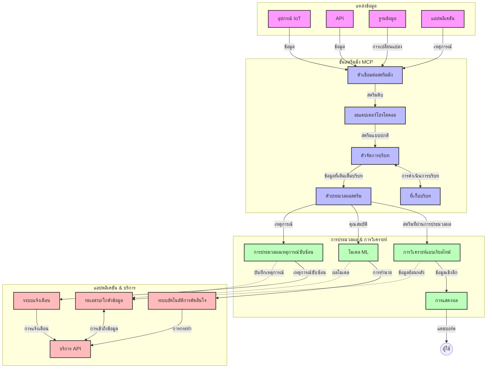

# โปรโตคอลบริบทโมเดลสำหรับสตรีมมิ่งข้อมูลเรียลไทม์

## ภาพรวม

การสตรีมมิ่งข้อมูลเรียลไทม์ได้กลายเป็นสิ่งจำเป็นในโลกที่ขับเคลื่อนด้วยข้อมูลในปัจจุบัน ซึ่งธุรกิจและแอปพลิเคชันต้องการเข้าถึงข้อมูลทันทีเพื่อทำการตัดสินใจในเวลาที่เหมาะสม โปรโตคอลบริบทโมเดล (Model Context Protocol หรือ MCP) เป็นความก้าวหน้าที่สำคัญในการเพิ่มประสิทธิภาพกระบวนการสตรีมมิ่งแบบเรียลไทม์เหล่านี้ ช่วยเพิ่มประสิทธิภาพการประมวลผลข้อมูล รักษาความสมบูรณ์ของบริบท และปรับปรุงประสิทธิภาพโดยรวมของระบบ

โมดูลนี้จะสำรวจว่า MCP เปลี่ยนแปลงการสตรีมมิ่งข้อมูลเรียลไทม์อย่างไรโดยการมอบแนวทางมาตรฐานสำหรับการจัดการบริบทข้ามโมเดล AI แพลตฟอร์มสตรีม และแอปพลิเคชันต่าง ๆ

## บทนำสู่การสตรีมมิ่งข้อมูลเรียลไทม์

การสตรีมมิ่งข้อมูลเรียลไทม์เป็นรูปแบบเทคโนโลยีที่ช่วยให้การถ่ายโอน ประมวลผล และวิเคราะห์ข้อมูลอย่างต่อเนื่องในขณะที่ข้อมูลถูกสร้างขึ้น ทำให้ระบบสามารถตอบสนองต่อข้อมูลใหม่ได้ทันที แตกต่างจากการประมวลผลแบบแบตช์แบบเดิมที่ใช้งานกับชุดข้อมูลแบบคงที่ การสตรีมมิ่งประมวลผลข้อมูลในขณะเคลื่อนที่ ส่งมอบข้อมูลเชิงลึกและการกระทำโดยมีความหน่วงต่ำมาก

### แนวคิดหลักของการสตรีมมิ่งข้อมูลเรียลไทม์:

- **การไหลของข้อมูลอย่างต่อเนื่อง**: ข้อมูลถูกประมวลผลในรูปแบบของเหตุการณ์หรือระเบียนที่ไม่สิ้นสุดอย่างต่อเนื่อง
- **การประมวลผลที่มีความหน่วงต่ำ**: ระบบถูกออกแบบมาเพื่อลดเวลาระหว่างการสร้างข้อมูลกับการประมวลผลให้น้อยที่สุด
- **ความสามารถในการขยายระบบ**: สถาปัตยกรรมสตรีมมิ่งต้องรองรับปริมาณและความเร็วของข้อมูลที่เปลี่ยนแปลงได้
- **ความทนทานต่อข้อผิดพลาด**: ระบบต้องมีความยืดหยุ่นต่อความล้มเหลวเพื่อให้การไหลของข้อมูลไม่สะดุด
- **การประมวลผลแบบมีบริบท (Stateful Processing)**: การรักษาบริบทข้ามเหตุการณ์มีความสำคัญสำหรับการวิเคราะห์ที่มีความหมาย

### โปรโตคอลบริบทโมเดลและการสตรีมมิ่งเรียลไทม์

โปรโตคอลบริบทโมเดล (MCP) แก้ไขปัญหาสำคัญหลายประการในสภาพแวดล้อมการสตรีมมิ่งแบบเรียลไทม์:

1. **ความต่อเนื่องของบริบท**: MCP มาตรฐานวิธีรักษาบริบทในส่วนประกอบการสตรีมมิ่งแบบกระจาย เพื่อให้โมเดล AI และโหนดประมวลผลสามารถเข้าถึงบริบทอดีตและสภาพแวดล้อมที่เกี่ยวข้องได้

2. **การจัดการสถานะอย่างมีประสิทธิภาพ**: ด้วยการให้กลไกที่มีโครงสร้างสำหรับการส่งผ่านบริบท MCP ช่วยลดภาระของการจัดการสถานะในสายงานสตรีม

3. **ความสามารถในการทำงานร่วมกัน**: MCP สร้างภาษากลางสำหรับการแลกเปลี่ยนบริบทระหว่างเทคโนโลยีสตรีมต่าง ๆ และโมเดล AI ช่วยให้สถาปัตยกรรมมีความยืดหยุ่นและขยายตัวได้มากขึ้น

4. **บริบทที่เหมาะสมกับการสตรีมมิ่ง**: การใช้งาน MCP สามารถกำหนดลำดับความสำคัญขององค์ประกอบบริบทที่เกี่ยวข้องที่สุดสำหรับการตัดสินใจแบบเรียลไทม์ เพื่อเพิ่มประสิทธิภาพทั้งด้านการทำงานและความแม่นยำ

5. **การประมวลผลแบบปรับตัว**: ด้วยการจัดการบริบทที่เหมาะสมผ่าน MCP ระบบสตรีมมิ่งสามารถปรับการประมวลผลแบบไดนามิกตามสภาพและรูปแบบที่เปลี่ยนแปลงในข้อมูล

ในแอปพลิเคชันสมัยใหม่ตั้งแต่เครือข่ายเซ็นเซอร์ IoT ไปจนถึงแพลตฟอร์มการซื้อขายทางการเงิน การผสาน MCP กับเทคโนโลยีสตรีมช่วยให้การประมวลผลแบบมีความรู้บริบทสามารถตอบสนองต่อสถานการณ์ซับซ้อนที่เปลี่ยนแปลงได้อย่างเหมาะสมในเวลาจริง

## วัตถุประสงค์การเรียนรู้

เมื่อสิ้นสุดบทเรียนนี้ คุณจะสามารถ:

- เข้าใจพื้นฐานของการสตรีมมิ่งข้อมูลเรียลไทม์และความท้าทายที่เกี่ยวข้อง
- อธิบายว่า โปรโตคอลบริบทโมเดล (MCP) ช่วยเพิ่มประสิทธิภาพการสตรีมมิ่งข้อมูลเรียลไทม์ได้อย่างไร
- นำเสนอวิธีการใช้งาน MCP กับเฟรมเวิร์กยอดนิยม เช่น Kafka และ Pulsar
- ออกแบบและใช้งานสถาปัตยกรรมสตรีมมิ่งที่ทนทานและมีประสิทธิภาพสูงโดยใช้ MCP
- ประยุกต์แนวคิด MCP กับกรณีการใช้งาน IoT การซื้อขายทางการเงิน และการวิเคราะห์ขับเคลื่อนด้วย AI
- ประเมินแนวโน้มและนวัตกรรมใหม่ในเทคโนโลยีสตรีมที่ใช้ MCP

### คำจำกัดความและความสำคัญ

การสตรีมมิ่งข้อมูลเรียลไทม์คือการสร้างข้อมูล การประมวลผล และการส่งมอบข้อมูลอย่างต่อเนื่องโดยมีความหน่วงต่ำสุด แตกต่างจากการประมวลผลแบบแบตช์ที่เก็บข้อมูลและประมวลผลเป็นชุด ๆ การสตรีมมิ่งข้อมูลจะประมวลผลข้อมูลทีละส่วนขณะที่มาถึง ช่วยให้เกิดข้อมูลเชิงลึกและการกระทำที่ทันทีทันใด

ลักษณะสำคัญของการสตรีมมิ่งข้อมูลเรียลไทม์ได้แก่:

- **ความหน่วงต่ำ**: ประมวลผลและวิเคราะห์ข้อมูลภายในระดับมิลลิวินาทีถึงวินาที
- **การไหลของข้อมูลอย่างต่อเนื่อง**: ข้อมูลไม่ขาดตอนจากแหล่งข้อมูลต่าง ๆ
- **การประมวลผลทันที**: วิเคราะห์ข้อมูลเมื่อมาถึงแทนที่จะประมวลผลเป็นชุด
- **สถาปัตยกรรมขับเคลื่อนด้วยเหตุการณ์**: ตอบสนองต่อเหตุการณ์เมื่อเกิดขึ้น

### ความท้าทายในสตรีมมิ่งข้อมูลแบบดั้งเดิม

วิธีการสตรีมมิ่งแบบดั้งเดิมเผชิญข้อจำกัดหลายประการ:

1. **การสูญเสียบริบท**: ยากในการรักษาบริบทข้ามระบบที่กระจายอยู่
2. **ปัญหาการขยายระบบ**: ความยากลำบากในการขยายระบบเพื่อรองรับข้อมูลที่ปริมาณและความเร็วสูง
3. **ความซับซ้อนในการผนวกรวมระบบ**: ปัญหาเรื่องความเข้ากันได้ระหว่างระบบต่าง ๆ
4. **การจัดการความหน่วง**: ต้องหาสมดุลระหว่างความเร็วและเวลาประมวลผล
5. **ความสอดคล้องของข้อมูล**: รับประกันความถูกต้องและครบถ้วนของข้อมูลตลอดสายสตรีม

## ความเข้าใจในโปรโตคอลบริบทโมเดล (MCP)

### MCP คืออะไร?

โปรโตคอลบริบทโมเดล (MCP) คือโปรโตคอลการสื่อสารมาตรฐานที่ออกแบบมาเพื่อสนับสนุนการทำงานที่มีประสิทธิภาพระหว่างโมเดล AI และแอปพลิเคชัน ในบริบทของการสตรีมมิ่งข้อมูลเรียลไทม์ MCP มอบกรอบทำงานสำหรับ:

- การเก็บรักษาบริบทตลอดสายงานข้อมูล
- มาตรฐานในการแลกเปลี่ยนข้อมูล
- การเพิ่มประสิทธิภาพการส่งข้อมูลชุดใหญ่
- การเพิ่มประสิทธิภาพการสื่อสารระหว่างโมเดลกับโมเดล และโมเดลกับแอปพลิเคชัน

### ส่วนประกอบหลักและสถาปัตยกรรม

สถาปัตยกรรม MCP สำหรับการสตรีมมิ่งเรียลไทม์ประกอบด้วยส่วนประกอบสำคัญหลายอย่าง:

1. **ตัวจัดการบริบท (Context Handlers)**: จัดการและรักษาข้อมูลบริบทตลอดสายงานสตรีม
2. **ตัวประมวลผลสตรีม (Stream Processors)**: ประมวลผลข้อมูลสตรีมเข้าด้วยเทคนิคที่ตระหนักถึงบริบท
3. **อะแดปเตอร์โปรโตคอล (Protocol Adapters)**: แปลงระหว่างโปรโตคอลสตรีมต่าง ๆ พร้อมรักษาบริบทไว้
4. **ที่เก็บบริบท (Context Store)**: เก็บและดึงข้อมูลบริบทอย่างมีประสิทธิภาพ
5. **คอนเนคเตอร์สตรีมมิ่ง (Streaming Connectors)**: เชื่อมต่อกับแพลตฟอร์มสตรีมต่าง ๆ เช่น Kafka, Pulsar, Kinesis เป็นต้น



### MCP ช่วยปรับปรุงการจัดการข้อมูลเรียลไทม์อย่างไร

MCP แก้ไขปัญหาการสตรีมแบบเดิมผ่าน:

- **ความสมบูรณ์ของบริบท**: รักษาความสัมพันธ์ระหว่างข้อมูลข้ามสายงานทั้งหมด
- **การส่งข้อมูลที่เหมาะสม**: ลดความซ้ำซ้อนในการแลกเปลี่ยนข้อมูลผ่านการจัดการบริบทอย่างชาญฉลาด
- **อินเทอร์เฟสแบบมาตรฐาน**: มอบ API ที่สม่ำเสมอสำหรับส่วนประกอบสตรีม
- **ลดความหน่วง**: ลดภาระประมวลผลผ่านการจัดการบริบทอย่างมีประสิทธิภาพ
- **เพิ่มความสามารถในการขยาย**: รองรับการขยายแนวนอนพร้อมรักษาบริบท

## การผนวกรวมและการใช้งาน

ระบบสตรีมมิ่งข้อมูลเรียลไทม์ต้องการการออกแบบสถาปัตยกรรมและการใช้งานที่รอบคอบเพื่อรักษาทั้งประสิทธิภาพและความสมบูรณ์ของบริบท โปรโตคอลบริบทโมเดลมอบแนวทางมาตรฐานในการผนวกรวมโมเดล AI และเทคโนโลยีสตรีม ช่วยให้ได้สายงานประมวลผลที่ซับซ้อนและตระหนักถึงบริบทมากขึ้น

### ภาพรวมของการผนวกรวม MCP ในสถาปัตยกรรมสตรีม

การใช้งาน MCP ในสภาพแวดล้อมสตรีมแบบเรียลไทม์ต้องพิจารณาประเด็นสำคัญหลายประการ:

1. **การซีเรียไรซ์และการส่งผ่านบริบท**: MCP มีกลไกประสิทธิภาพสำหรับการเข้ารหัสข้อมูลบริบทในแพ็กเก็ตข้อมูลสตรีม เพื่อให้บริบทสำคัญติดตามข้อมูลไปตลอดสายงานประมวลผล ซึ่งรวมถึงรูปแบบซีเรียไรซ์มาตรฐานที่เหมาะสมกับการส่งผ่านสตรีม

2. **การประมวลผลสถานะ (Stateful Stream Processing)**: MCP ช่วยให้การประมวลผลที่มีสถานะชาญฉลาดมากขึ้นโดยการรักษาการแทนบริบทที่สม่ำเสมอข้ามโหนดประมวลผล ซึ่งมีคุณค่ามากในสถาปัตยกรรมสตรีมแบบกระจายที่การจัดการสถานะมักเป็นเรื่องยุ่งยาก

3. **เวลาเหตุการณ์ vs. เวลาในการประมวลผล**: การใช้งาน MCP ในระบบสตรีมต้องแก้ไขปัญหาการแยกระหว่างเวลาที่เหตุการณ์เกิดขึ้นกับเวลาที่ถูกประมวลผล โปรโตคอลสามารถรวมบริบทเชิงเวลาที่รักษาความหมายของเวลาเหตุการณ์ได้

4. **การจัดการแรงดันย้อนกลับ (Backpressure Management)**: ด้วยการมาตรฐานการจัดการบริบท MCP ช่วยจัดการแรงดันย้อนกลับในระบบสตรีม โดยให้ส่วนประกอบสื่อสารความสามารถในการประมวลผลและปรับการไหลของข้อมูลได้

5. **การแบ่งหน้าต่างบริบทและการรวมข้อมูล**: MCP ช่วยให้การทำงานแบบหน้าต่าง (windowing) มีความซับซ้อนมากขึ้นโดยให้รูปแบบที่มีโครงสร้างของบริบทเชิงเวลาและความสัมพันธ์ เพื่อการรวมข้อมูลที่มีความหมายมากขึ้นในสตรีมเหตุการณ์

6. **การประมวลผลแบบ Exactly-Once**: ในระบบสตรีมที่ต้องการความหมายแบบประมวลผลข้อมูลแต่ละครั้งเพียงครั้งเดียว (exactly-once semantics) MCP สามารถรวมเมตาดาต้าการประมวลผลเพื่อช่วยติดตามและยืนยันสถานะการประมวลผลข้ามส่วนประกอบที่กระจายอยู่

การใช้งาน MCP กับเทคโนโลยีสตรีมแตกต่างกันสร้างแนวทางเดียวในการจัดการบริบท ลดความจำเป็นในการเขียนโค้ดผนวกรวมเฉพาะทาง ในขณะที่เพิ่มความสามารถของระบบในการรักษาบริบทที่มีความหมายเมื่อข้อมูลไหลผ่านสายงาน

### MCP ในเฟรมเวิร์กสตรีมมิ่งต่าง ๆ

ตัวอย่างเหล่านี้อิงตามสเปค MCP ปัจจุบันซึ่งเน้นโปรโตคอล JSON-RPC ที่มีกลไกการส่งผ่านแตกต่างกัน โค้ดแสดงวิธีการสร้างกลไกส่งผ่านข้อมูลเองที่ผสานรวมแพลตฟอร์มสตรีม เช่น Kafka และ Pulsar พร้อมรักษาความเข้ากันได้สมบูรณ์กับโปรโตคอล MCP

ตัวอย่างถูกออกแบบเพื่อแสดงให้เห็นว่าแพลตฟอร์มสตรีมมิ่งสามารถผสานกับ MCP เพื่อให้การประมวลผลข้อมูลเรียลไทม์ที่ตระหนักถึงบริบทซึ่งเป็นจุดสำคัญของ MCP ได้อย่างไร วิธีนี้รับรองว่าโค้ดตัวอย่างสอดคล้องกับสเปค MCP ปัจจุบัน ณ เดือนมิถุนายน 2025

MCP สามารถผสานกับเฟรมเวิร์กสตรีมยอดนิยมได้แก่:

#### การผสานกับ Apache Kafka

```python
import asyncio
import json
from typing import Dict, Any, Optional
from confluent_kafka import Consumer, Producer, KafkaError
from mcp.client import Client, ClientCapabilities
from mcp.core.message import JsonRpcMessage
from mcp.core.transports import Transport

# คลาสทรานสปอร์ตที่กำหนดเองเพื่อเชื่อมต่อ MCP กับ Kafka
class KafkaMCPTransport(Transport):
    def __init__(self, bootstrap_servers: str, input_topic: str, output_topic: str):
        self.bootstrap_servers = bootstrap_servers
        self.input_topic = input_topic
        self.output_topic = output_topic
        self.producer = Producer({'bootstrap.servers': bootstrap_servers})
        self.consumer = Consumer({
            'bootstrap.servers': bootstrap_servers,
            'group.id': 'mcp-client-group',
            'auto.offset.reset': 'earliest'
        })
        self.message_queue = asyncio.Queue()
        self.running = False
        self.consumer_task = None
        
    async def connect(self):
        """Connect to Kafka and start consuming messages"""
        self.consumer.subscribe([self.input_topic])
        self.running = True
        self.consumer_task = asyncio.create_task(self._consume_messages())
        return self
        
    async def _consume_messages(self):
        """Background task to consume messages from Kafka and queue them for processing"""
        while self.running:
            try:
                msg = self.consumer.poll(1.0)
                if msg is None:
                    await asyncio.sleep(0.1)
                    continue
                
                if msg.error():
                    if msg.error().code() == KafkaError._PARTITION_EOF:
                        continue
                    print(f"Consumer error: {msg.error()}")
                    continue
                
                # แยกวิเคราะห์ค่าข้อความเป็น JSON-RPC
                try:
                    message_str = msg.value().decode('utf-8')
                    message_data = json.loads(message_str)
                    mcp_message = JsonRpcMessage.from_dict(message_data)
                    await self.message_queue.put(mcp_message)
                except Exception as e:
                    print(f"Error parsing message: {e}")
            except Exception as e:
                print(f"Error in consumer loop: {e}")
                await asyncio.sleep(1)
    
    async def read(self) -> Optional[JsonRpcMessage]:
        """Read the next message from the queue"""
        try:
            message = await self.message_queue.get()
            return message
        except Exception as e:
            print(f"Error reading message: {e}")
            return None
    
    async def write(self, message: JsonRpcMessage) -> None:
        """Write a message to the Kafka output topic"""
        try:
            message_json = json.dumps(message.to_dict())
            self.producer.produce(
                self.output_topic,
                message_json.encode('utf-8'),
                callback=self._delivery_report
            )
            self.producer.poll(0)  # เรียกใช้งาน callback
        except Exception as e:
            print(f"Error writing message: {e}")
    
    def _delivery_report(self, err, msg):
        """Kafka producer delivery callback"""
        if err is not None:
            print(f'Message delivery failed: {err}')
        else:
            print(f'Message delivered to {msg.topic()} [{msg.partition()}]')
    
    async def close(self) -> None:
        """Close the transport"""
        self.running = False
        if self.consumer_task:
            self.consumer_task.cancel()
            try:
                await self.consumer_task
            except asyncio.CancelledError:
                pass
        self.consumer.close()
        self.producer.flush()

# ตัวอย่างการใช้งาน Kafka MCP transport
async def kafka_mcp_example():
    # สร้าง MCP client ด้วย Kafka transport
    client = Client(
        {"name": "kafka-mcp-client", "version": "1.0.0"},
        ClientCapabilities({})
    )
    
    # สร้างและเชื่อมต่อ Kafka transport
    transport = KafkaMCPTransport(
        bootstrap_servers="localhost:9092",
        input_topic="mcp-responses",
        output_topic="mcp-requests"
    )
    
    await client.connect(transport)
    
    try:
        # เริ่มต้นเซสชัน MCP
        await client.initialize()
        
        # ตัวอย่างการรันเครื่องมือผ่าน MCP
        response = await client.execute_tool(
            "process_data",
            {
                "data": "sample data",
                "metadata": {
                    "source": "sensor-1",
                    "timestamp": "2025-06-12T10:30:00Z"
                }
            }
        )
        
        print(f"Tool execution response: {response}")
        
        # ปิดระบบอย่างสะอาด
        await client.shutdown()
    finally:
        await transport.close()

# รันตัวอย่าง
if __name__ == "__main__":
    asyncio.run(kafka_mcp_example())
```

#### การใช้งานกับ Apache Pulsar

```python
import asyncio
import json
import pulsar
from typing import Dict, Any, Optional
from mcp.core.message import JsonRpcMessage
from mcp.core.transports import Transport
from mcp.server import Server, ServerOptions
from mcp.server.tools import Tool, ToolExecutionContext, ToolMetadata

# สร้างระบบขนส่ง MCP แบบกำหนดเองที่ใช้ Pulsar
class PulsarMCPTransport(Transport):
    def __init__(self, service_url: str, request_topic: str, response_topic: str):
        self.service_url = service_url
        self.request_topic = request_topic
        self.response_topic = response_topic
        self.client = pulsar.Client(service_url)
        self.producer = self.client.create_producer(response_topic)
        self.consumer = self.client.subscribe(
            request_topic,
            "mcp-server-subscription",
            consumer_type=pulsar.ConsumerType.Shared
        )
        self.message_queue = asyncio.Queue()
        self.running = False
        self.consumer_task = None
    
    async def connect(self):
        """Connect to Pulsar and start consuming messages"""
        self.running = True
        self.consumer_task = asyncio.create_task(self._consume_messages())
        return self
    
    async def _consume_messages(self):
        """Background task to consume messages from Pulsar and queue them for processing"""
        while self.running:
            try:
                # รับข้อมูลแบบไม่บล็อกพร้อมการหมดเวลารอ
                msg = self.consumer.receive(timeout_millis=500)
                
                # ประมวลผลข้อความ
                try:
                    message_str = msg.data().decode('utf-8')
                    message_data = json.loads(message_str)
                    mcp_message = JsonRpcMessage.from_dict(message_data)
                    await self.message_queue.put(mcp_message)
                    
                    # ยืนยันการรับข้อความ
                    self.consumer.acknowledge(msg)
                except Exception as e:
                    print(f"Error processing message: {e}")
                    # ปฏิเสธการยืนยันถ้ามีข้อผิดพลาด
                    self.consumer.negative_acknowledge(msg)
            except Exception as e:
                # จัดการการหมดเวลาหรือข้อยกเว้นอื่น ๆ
                await asyncio.sleep(0.1)
    
    async def read(self) -> Optional[JsonRpcMessage]:
        """Read the next message from the queue"""
        try:
            message = await self.message_queue.get()
            return message
        except Exception as e:
            print(f"Error reading message: {e}")
            return None
    
    async def write(self, message: JsonRpcMessage) -> None:
        """Write a message to the Pulsar output topic"""
        try:
            message_json = json.dumps(message.to_dict())
            self.producer.send(message_json.encode('utf-8'))
        except Exception as e:
            print(f"Error writing message: {e}")
    
    async def close(self) -> None:
        """Close the transport"""
        self.running = False
        if self.consumer_task:
            self.consumer_task.cancel()
            try:
                await self.consumer_task
            except asyncio.CancelledError:
                pass
        self.consumer.close()
        self.producer.close()
        self.client.close()

# กำหนดเครื่องมือ MCP ตัวอย่างที่ประมวลผลข้อมูลสตรีม
@Tool(
    name="process_streaming_data",
    description="Process streaming data with context preservation",
    metadata=ToolMetadata(
        required_capabilities=["streaming"]
    )
)
async def process_streaming_data(
    ctx: ToolExecutionContext,
    data: str,
    source: str,
    priority: str = "medium"
) -> Dict[str, Any]:
    """
    Process streaming data while preserving context
    
    Args:
        ctx: Tool execution context
        data: The data to process
        source: The source of the data
        priority: Priority level (low, medium, high)
        
    Returns:
        Dict containing processed results and context information
    """
    # ตัวอย่างการประมวลผลที่ใช้บริบท MCP
    print(f"Processing data from {source} with priority {priority}")
    
    # เข้าถึงบริบทการสนทนาจาก MCP
    conversation_id = ctx.conversation_id if hasattr(ctx, 'conversation_id') else "unknown"
    
    # ส่งคืนผลลัพธ์พร้อมบริบทที่เพิ่มขึ้น
    return {
        "processed_data": f"Processed: {data}",
        "context": {
            "conversation_id": conversation_id,
            "source": source,
            "priority": priority,
            "processing_timestamp": ctx.get_current_time_iso()
        }
    }

# ตัวอย่างการใช้งานเซิร์ฟเวอร์ MCP โดยใช้ระบบขนส่ง Pulsar
async def run_mcp_server_with_pulsar():
    # สร้างเซิร์ฟเวอร์ MCP
    server = Server(
        {"name": "pulsar-mcp-server", "version": "1.0.0"},
        ServerOptions(
            capabilities={"streaming": True}
        )
    )
    
    # ลงทะเบียนเครื่องมือของเรา
    server.register_tool(process_streaming_data)
    
    # สร้างและเชื่อมต่อระบบขนส่ง Pulsar
    transport = PulsarMCPTransport(
        service_url="pulsar://localhost:6650",
        request_topic="mcp-requests",
        response_topic="mcp-responses"
    )
    
    try:
        # เริ่มเซิร์ฟเวอร์ด้วยระบบขนส่ง Pulsar
        await server.run(transport)
    finally:
        await transport.close()

# รันเซิร์ฟเวอร์
if __name__ == "__main__":
    asyncio.run(run_mcp_server_with_pulsar())
```

### แนวทางปฏิบัติที่ดีที่สุดสำหรับการติดตั้งใช้งาน

เมื่อใช้งาน MCP สำหรับสตรีมมิ่งเรียลไทม์:

1. **ออกแบบเพื่อความทนทานต่อข้อผิดพลาด**:
   - ใช้งานการจัดการข้อผิดพลาดที่เหมาะสม
   - ใช้คิว dead-letter สำหรับข้อความที่ล้มเหลว
   - ออกแบบโปรเซสเซอร์ให้ทำงานซ้ำได้โดยไม่มีผลข้างเคียง (idempotent)

2. **เพิ่มประสิทธิภาพการทำงาน**:
   - กำหนดขนาดบัฟเฟอร์ให้เหมาะสม
   - ใช้การประมวลผลแบบแบตช์เมื่อต้องการ
   - ใช้กลไกการจัดการแรงดันย้อนกลับ

3. **ติดตามและสังเกตการณ์**:
   - ติดตามเมตริกการประมวลผลสตรีม
   - ตรวจสอบการกระจายบริบท
   - ตั้งค่าแจ้งเตือนสำหรับเหตุผิดปกติ

4. **รักษาความปลอดภัยของสตรีม**:
   - เข้ารหัสข้อมูลที่ละเอียดอ่อน
   - ใช้งานระบบการพิสูจน์ตัวตนและการอนุญาต
   - ใช้มาตรการควบคุมการเข้าถึงที่เหมาะสม

### MCP ใน IoT และการประมวลผลที่ Edge

MCP ช่วยเพิ่มประสิทธิภาพการสตรีมมิ่งใน IoT โดย:

- รักษาบริบทของอุปกรณ์ข้ามสายงานประมวลผล
- สนับสนุนการสตรีมข้อมูลจาก edge สู่ cloud อย่างมีประสิทธิภาพ
- รองรับการวิเคราะห์ข้อมูล IoT แบบเรียลไทม์
- ช่วยในการสื่อสารระหว่างอุปกรณ์ที่มีบริบท

ตัวอย่าง: เครือข่ายเซ็นเซอร์ในเมืองอัจฉริยะ
```
Sensors → Edge Gateways → MCP Stream Processors → Real-time Analytics → Automated Responses
```

### บทบาทในธุรกรรมทางการเงินและการซื้อขายความถี่สูง

MCP มอบประโยชน์สำคัญสำหรับการสตรีมข้อมูลทางการเงิน:

- การประมวลผลที่มีความหน่วงต่ำมากสำหรับการตัดสินใจซื้อขาย
- รักษาบริบทธุรกรรมตลอดกระบวนการ
- สนับสนุนการประมวลผลเหตุการณ์ซับซ้อนด้วยความรู้บริบท
- รับประกันความสอดคล้องของข้อมูลข้ามระบบการซื้อขายที่กระจายอยู่

### เพิ่มประสิทธิภาพการวิเคราะห์ขับเคลื่อน AI

MCP สร้างโอกาสใหม่สำหรับการวิเคราะห์ข้อมูลสตรีม:

- การฝึกและอนุมานโมเดลแบบเรียลไทม์
- การเรียนรู้อย่างต่อเนื่องจากข้อมูลสตรีม
- การสกัดฟีเจอร์ที่ตระหนักถึงบริบท
- สายงานอนุมานโมเดลหลายโมเดลที่รักษาบริบท

## แนวโน้มและนวัตกรรมอนาคต

### วิวัฒนาการของ MCP ในสภาพแวดล้อมเรียลไทม์

ในอนาคต เราคาดว่า MCP จะพัฒนาเพื่อตอบโจทย์:

- **การผสานกับคอมพิวเตอร์ควอนตัม**: เตรียมพร้อมสำหรับระบบสตรีมมิ่งที่ใช้ควอนตัม
- **การประมวลผลเนทีฟที่ Edge**: ย้ายการประมวลผลแบบตระหนักบริบทไปยังอุปกรณ์ edge มากขึ้น
- **การจัดการสตรีมแบบอัตโนมัติ**: สายงานสตรีมที่ปรับตัวเองได้
- **สตรีมแบบกระจายและรวมกัน**: การประมวลผลแบบกระจายพร้อมรักษาความเป็นส่วนตัว

### ความก้าวหน้าในเทคโนโลยีที่เป็นไปได้

เทคโนโลยีใหม่ที่กำลังก่อตัวและจะส่งผลต่ออนาคตของ MCP:

1. **โปรโตคอลสตรีมที่ปรับให้เหมาะสมสำหรับ AI**: โปรโตคอลที่ออกแบบเฉพาะสำหรับงาน AI
2. **การผสานคอมพิวเตอร์นิวโรมอร์ฟิก**: การประมวลผลที่ได้แรงบันดาลใจจากสมองสำหรับสตรีม
3. **สตรีมแบบไม่มีเซิร์ฟเวอร์**: สตรีมที่ขับเคลื่อนด้วยเหตุการณ์ มีการปรับขนาดอัตโนมัติโดยไม่ต้องจัดการโครงสร้างพื้นฐาน
4. **ที่เก็บบริบทแบบกระจาย**: การจัดการบริบทที่มีการกระจายทั่วโลกแต่คงความสอดคล้องสูง

## แบบฝึกหัด

### แบบฝึกหัดที่ 1: การตั้งค่าสายงานสตรีม MCP เบื้องต้น

ในแบบฝึกหัดนี้ คุณจะได้เรียนรู้วิธี:
- การกำหนดค่าสภาพแวดล้อมสตรีม MCP เบื้องต้น
- การใช้งานตัวจัดการบริบทสำหรับการประมวลผลสตรีม
- การทดสอบและยืนยันการรักษาบริบท

### แบบฝึกหัดที่ 2: การสร้างแดชบอร์ดวิเคราะห์ข้อมูลเรียลไทม์

สร้างแอปพลิเคชันครบวงจรที่:
- รับข้อมูลสตรีมผ่าน MCP
- ประมวลผลสตรีมพร้อมรักษาบริบท
- แสดงผลลัพธ์แบบเรียลไทม์

### แบบฝึกหัดที่ 3: การประมวลผลเหตุการณ์ซับซ้อนด้วย MCP

แบบฝึกหัดระดับสูงที่ครอบคลุม:
- การตรวจจับรูปแบบในสตรีม
- การเชื่อมโยงบริบทข้ามสตรีมหลายชุด
- การสร้างเหตุการณ์ซับซ้อนโดยรักษาบริบท

## แหล่งข้อมูลเพิ่มเติม

- [Model Context Protocol Specification](https://modelcontextprotocol.io) - ข้อกำหนดและเอกสาร MCP อย่างเป็นทางการ
- [Apache Kafka Documentation](https://kafka.apache.org/documentation/) - เรียนรู้เกี่ยวกับ Kafka สำหรับการประมวลผลสตรีม
- [Apache Pulsar](https://pulsar.apache.org/) - แพลตฟอร์มการส่งข้อความและสตรีมแบบรวมศูนย์
- [Streaming Systems: The What, Where, When, and How of Large-Scale Data Processing](https://www.oreilly.com/library/view/streaming-systems/9781491983867/) - หนังสือครอบคลุมสถาปัตยกรรมสตรีม
- [Microsoft Azure Event Hubs](https://learn.microsoft.com/azure/event-hubs/event-hubs-about) - บริการสตรีมอีเวนต์ที่มีการจัดการ
- [MLflow Documentation](https://mlflow.org/docs/latest/index.html) - สำหรับติดตามและปรับใช้โมเดล ML
- [Real-Time Analytics with Apache Storm](https://storm.apache.org/releases/current/index.html) - เฟรมเวิร์กสำหรับการประมวลผลข้อมูลเรียลไทม์
- [Flink ML](https://nightlies.apache.org/flink/flink-ml-docs-master/) - ไลบรารีแมชชีนเลิร์นนิงสำหรับ Apache Flink
- [LangChain Documentation](https://python.langchain.com/docs/get_started/introduction) - การสร้างแอปพลิเคชันด้วย LLMs

## ผลลัพธ์การเรียนรู้

เมื่อคุณศึกษาจบโมดูลนี้ คุณจะสามารถ:

- เข้าใจพื้นฐานของการสตรีมมิ่งข้อมูลเรียลไทม์และความท้าทายที่เกี่ยวข้อง
- อธิบายว่า โปรโตคอลบริบทโมเดล (MCP) ช่วยเพิ่มประสิทธิภาพการสตรีมมิ่งข้อมูลเรียลไทม์ได้อย่างไร
- นำเสนอวิธีการใช้งาน MCP กับเฟรมเวิร์กยอดนิยม เช่น Kafka และ Pulsar
- ออกแบบและใช้งานสถาปัตยกรรมสตรีมมิ่งที่ทนทานและมีประสิทธิภาพสูงโดยใช้ MCP
- ประยุกต์แนวคิด MCP กับกรณีการใช้งาน IoT การซื้อขายทางการเงิน และการวิเคราะห์ขับเคลื่อนด้วย AI
- ประเมินแนวโน้มและนวัตกรรมใหม่ในเทคโนโลยีสตรีมที่ใช้ MCP

## ต่อไปคือ

- [5.11 การค้นหาแบบเรียลไทม์](../mcp-realtimesearch/README.md)

---

<!-- CO-OP TRANSLATOR DISCLAIMER START -->
**ปฏิเสธความรับผิดชอบ**:
เอกสารนี้ได้รับการแปลโดยใช้บริการแปลภาษา AI [Co-op Translator](https://github.com/Azure/co-op-translator) ขณะที่เราพยายามให้ความถูกต้อง โปรดทราบว่าการแปลโดยอัตโนมัติอาจมีข้อผิดพลาดหรือความไม่ถูกต้อง เอกสารต้นฉบับในภาษาต้นทางควรถูกพิจารณาเป็นแหล่งข้อมูลที่เชื่อถือได้ สำหรับข้อมูลที่สำคัญ แนะนำให้ใช้การแปลโดยมนุษย์มืออาชีพ เราไม่รับผิดชอบต่อความเข้าใจผิดหรือการตีความที่ผิดพลาดที่เกิดขึ้นจากการใช้การแปลนี้
<!-- CO-OP TRANSLATOR DISCLAIMER END -->