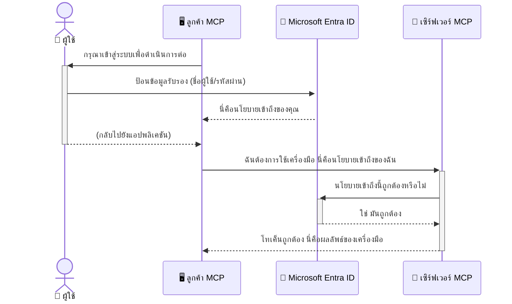

# การรักษาความปลอดภัยเวิร์กโฟลว์ AI: การพิสูจน์ตัวตน Entra ID สำหรับเซิร์ฟเวอร์ Model Context Protocol

## บทนำ
การรักษาความปลอดภัยเซิร์ฟเวอร์ Model Context Protocol (MCP) ของคุณมีความสำคัญเทียบเท่ากับการล็อกประตูหน้าบ้านของคุณ การปล่อยให้เซิร์ฟเวอร์ MCP ของคุณเปิดเผย ทำให้เครื่องมือและข้อมูลถูกเข้าถึงโดยไม่ได้รับอนุญาต ซึ่งอาจนำไปสู่การละเมิดความปลอดภัย Microsoft Entra ID มอบโซลูชันการจัดการตัวตนและการเข้าถึงบนคลาวด์ที่แข็งแกร่ง ช่วยให้มั่นใจได้ว่ามีเพียงผู้ใช้และแอปพลิเคชันที่ได้รับอนุญาตเท่านั้นที่สามารถโต้ตอบกับเซิร์ฟเวอร์ MCP ของคุณ ในส่วนนี้ คุณจะได้เรียนรู้วิธีปกป้องเวิร์กโฟลว์ AI ของคุณโดยใช้การพิสูจน์ตัวตน Entra ID

## วัตถุประสงค์การเรียนรู้
เมื่อสิ้นสุดส่วนนี้ คุณจะสามารถ:

- เข้าใจความสำคัญของการรักษาความปลอดภัยเซิร์ฟเวอร์ MCP
- อธิบายพื้นฐานของ Microsoft Entra ID และการพิสูจน์ตัวตน OAuth 2.0
- แยกแยะความแตกต่างระหว่างลูกค้าสาธารณะและลูกค้าลับ
- ใช้การพิสูจน์ตัวตน Entra ID ในทั้งสถานการณ์เซิร์ฟเวอร์ MCP ท้องถิ่น (ลูกค้าสาธารณะ) และเซิร์ฟเวอร์ระยะไกล (ลูกค้าลับ)
- นำแนวทางปฏิบัติด้านความปลอดภัยที่ดีที่สุดไปใช้เมื่อพัฒนาเวิร์กโฟลว์ AI

## ความปลอดภัยและ MCP

เช่นเดียวกับที่คุณจะไม่ปล่อยให้ประตูหน้าบ้านของคุณเปิดโดยไม่ล็อก คุณก็ไม่ควรปล่อยให้เซิร์ฟเวอร์ MCP ของคุณเปิดสำหรับทุกคน การรักษาความปลอดภัยเวิร์กโฟลว์ AI ของคุณเป็นสิ่งจำเป็นสำหรับการสร้างแอปพลิเคชันที่แข็งแกร่ง น่าเชื่อถือ และปลอดภัย บทนี้จะแนะนำคุณในการใช้ Microsoft Entra ID เพื่อรักษาความปลอดภัยเซิร์ฟเวอร์ MCP ของคุณ เพื่อให้แน่ใจว่ามีเฉพาะผู้ใช้และแอปพลิเคชันที่ได้รับอนุญาตเท่านั้นที่สามารถโต้ตอบกับเครื่องมือและข้อมูลของคุณได้

## ทำไมความปลอดภัยจึงสำคัญสำหรับเซิร์ฟเวอร์ MCP

ลองนึกภาพว่ามีเครื่องมือบนเซิร์ฟเวอร์ MCP ของคุณที่สามารถส่งอีเมลหรือเข้าถึงฐานข้อมูลลูกค้า เซิร์ฟเวอร์ที่ไม่ได้รับการรักษาความปลอดภัยหมายความว่าใครก็ได้อาจใช้เครื่องมือนั้น ส่งผลให้เกิดการเข้าถึงข้อมูลโดยไม่ได้รับอนุญาต สแปมหรือกิจกรรมที่เป็นอันตรายอื่นๆ

โดยการนำการพิสูจน์ตัวตนมาใช้ คุณจะมั่นใจได้ว่าทุกคำขอที่ส่งไปยังเซิร์ฟเวอร์ได้รับการตรวจสอบเพื่อยืนยันตัวตนของผู้ใช้หรือแอปพลิเคชันที่ทำคำขอ ขั้นตอนนี้เป็นขั้นตอนแรกและสำคัญที่สุดในการรักษาความปลอดภัยเวิร์กโฟลว์ AI ของคุณ

## บทนำสู่ Microsoft Entra ID

[**Microsoft Entra ID**](https://adoption.microsoft.com/microsoft-security/entra/) เป็นบริการจัดการตัวตนและการเข้าถึงบนคลาวด์ คิดเสมือนเป็นยามรักษาความปลอดภัยสากลสำหรับแอปพลิเคชันของคุณ มันจัดการกระบวนการที่ซับซ้อนในการตรวจสอบตัวตนผู้ใช้ (การพิสูจน์ตัวตน) และกำหนดสิ่งที่ผู้ใช้อนุญาตให้ทำได้ (การกำหนดสิทธิ์)

โดยการใช้ Entra ID คุณสามารถ:

- เปิดใช้งานการลงชื่อเข้าใช้อย่างปลอดภัยสำหรับผู้ใช้
- ปกป้อง API และบริการ
- จัดการนโยบายการเข้าถึงจากที่เดียว

สำหรับเซิร์ฟเวอร์ MCP Entra ID เป็นโซลูชันที่แข็งแกร่งและได้รับความเชื่อถืออย่างกว้างขวางเพื่อจัดการว่าใครสามารถเข้าถึงความสามารถของเซิร์ฟเวอร์คุณได้

---

## ทำความเข้าใจเวทมนตร์: วิธีการทำงานของการพิสูจน์ตัวตน Entra ID

Entra ID ใช้มาตรฐานเปิดอย่าง **OAuth 2.0** เพื่อจัดการการพิสูจน์ตัวตน แม้รายละเอียดอาจซับซ้อน แต่แนวคิดหลักนั้นง่ายและอธิบายได้ด้วยการเปรียบเทียบ

### แนะนำ OAuth 2.0 อย่างง่าย: กุญแจวาเลต์

คิดถึง OAuth 2.0 เหมือนบริการวาเลต์สำหรับรถของคุณ เมื่อคุณมาถึงร้านอาหาร คุณไม่ได้ให้กุญแจหลักแก่พนักงานวาเลต์ แต่ให้กุญแจวาเลต์ที่มีสิทธิ์จำกัด มันสามารถสตาร์ทรถและล็อกประตูได้แต่ไม่สามารถเปิดฝากระโปรงหรือลิ้นชักได้

ในการเปรียบเทียบนี้:

- **คุณ** คือ **ผู้ใช้**
- **รถของคุณ** คือ **เซิร์ฟเวอร์ MCP** ที่มีเครื่องมือและข้อมูลมีค่า
- **วาเลต์** คือ **Microsoft Entra ID**
- **ผู้ดูแลที่จอดรถ** คือ **MCP Client** (แอปพลิเคชันที่พยายามเข้าถึงเซิร์ฟเวอร์)
- **กุญแจวาเลต์** คือ **Access Token**

Access token คือตัวเลขข้อความปลอดภัยที่ MCP client ได้รับจาก Entra ID หลังจากที่คุณลงชื่อเข้าใช้ จากนั้น client จะส่งโทเค็นนี้ไปยังเซิร์ฟเวอร์ MCP ในทุกคำขอ เซิร์ฟเวอร์สามารถตรวจสอบโทเค็นเพื่อยืนยันว่าคำขอนั้นถูกต้องและว่าลูกค้ามีสิทธิ์จำเป็น โดยไม่จำเป็นต้องจัดการข้อมูลรับรองจริงของคุณ (เช่น รหัสผ่าน)

### กระบวนการพิสูจน์ตัวตน

นี่คือวิธีการทำงานในทางปฏิบัติ:



### แนะนำ Microsoft Authentication Library (MSAL)

ก่อนที่เราจะเข้าสู่โค้ด สิ่งสำคัญคือต้องแนะนำส่วนประกอบสำคัญที่คุณจะเห็นในตัวอย่าง: **Microsoft Authentication Library (MSAL)**

MSAL คือไลบรารีที่พัฒนาโดย Microsoft ช่วยให้นักพัฒนาสามารถจัดการการพิสูจน์ตัวตนได้ง่ายขึ้น แทนที่คุณจะต้องเขียนโค้ดซับซ้อนทั้งหมดเพื่อจัดการโทเค็นความปลอดภัย ลงชื่อเข้าใช้ และรีเฟรชเซสชัน MSAL จะดูแลส่วนที่ซับซ้อนทั้งหมดให้

การใช้ไลบรารีเช่น MSAL เป็นสิ่งที่แนะนำอย่างมากเพราะ:

- **ปลอดภัย:** MSAL นำมาตรฐานอุตสาหกรรมและแนวทางปฏิบัติด้านความปลอดภัยมาใช้ เพื่อลดความเสี่ยงช่องโหว่ในโค้ดของคุณ
- **ง่ายต่อการพัฒนา:** ซ่อนความซับซ้อนของ OAuth 2.0 และ OpenID Connect ช่วยให้คุณเพิ่มการพิสูจน์ตัวตนที่แข็งแกร่งในแอปพลิเคชันด้วยโค้ดเพียงไม่กี่บรรทัด
- **ได้รับการดูแลต่อเนื่อง:** Microsoft ดูแลและอัปเดต MSAL อย่างสม่ำเสมอเพื่อตอบสนองต่อภัยคุกคามด้านความปลอดภัยใหม่ ๆ และการเปลี่ยนแปลงแพลตฟอร์ม

MSAL รองรับภาษาต่าง ๆ และเฟรมเวิร์กแอปพลิเคชันมากมาย รวมถึง .NET, JavaScript/TypeScript, Python, Java, Go และแพลตฟอร์มมือถืออย่าง iOS และ Android ซึ่งหมายความว่าคุณสามารถใช้รูปแบบการพิสูจน์ตัวตนที่เหมือนกันทั่วทั้งเทคโนโลยีสแตกของคุณ

หากต้องการเรียนรู้เพิ่มเติมเกี่ยวกับ MSAL คุณสามารถดูได้ที่เอกสาร [ภาพรวม MSAL อย่างเป็นทางการ](https://learn.microsoft.com/entra/identity-platform/msal-overview)

---

## การรักษาความปลอดภัยเซิร์ฟเวอร์ MCP ของคุณด้วย Entra ID: คู่มือทีละขั้นตอน

ตอนนี้มาดูวิธีรักษาความปลอดภัยเซิร์ฟเวอร์ MCP ท้องถิ่น (ที่สื่อสารผ่าน `stdio`) โดยใช้ Entra ID ตัวอย่างนี้ใช้ **ลูกค้าสาธารณะ** ซึ่งเหมาะสำหรับแอปพลิเคชันที่ทำงานบนเครื่องของผู้ใช้ เช่น แอปบนเดสก์ท็อปหรือเซิร์ฟเวอร์พัฒนาท้องถิ่น

### สถานการณ์ที่ 1: การรักษาความปลอดภัยเซิร์ฟเวอร์ MCP ท้องถิ่น (ด้วยลูกค้าสาธารณะ)

ในสถานการณ์นี้ เราจะดูเซิร์ฟเวอร์ MCP ที่ทำงานในเครื่อง สื่อสารผ่าน `stdio` และใช้ Entra ID เพื่อพิสูจน์ตัวตนผู้ใช้ก่อนอนุญาตให้เข้าถึงเครื่องมือ เซิร์ฟเวอร์จะมีเครื่องมือเดียวที่ดึงข้อมูลโปรไฟล์ของผู้ใช้จาก Microsoft Graph API

#### 1. การตั้งค่าแอปพลิเคชันใน Entra ID

ก่อนเขียนโค้ด คุณต้องลงทะเบียนแอปพลิเคชันของคุณใน Microsoft Entra ID ซึ่งจะบอก Entra ID เกี่ยวกับแอปของคุณและให้สิทธิ์ในการใช้บริการพิสูจน์ตัวตน

1. ไปที่ **[พอร์ทัล Microsoft Entra](https://entra.microsoft.com/)**
2. ไปที่ **App registrations** และคลิก **New registration**
3. ตั้งชื่อแอปพลิเคชันของคุณ (เช่น "My Local MCP Server")
4. สำหรับ **Supported account types** เลือก **Accounts in this organizational directory only**
5. สามารถปล่อยช่อง **Redirect URI** ว่างในตัวอย่างนี้ได้
6. คลิก **Register**

หลังจากลงทะเบียน ให้จดบันทึก **Application (client) ID** และ **Directory (tenant) ID** ซึ่งจะใช้ในโค้ดของคุณ

#### 2. โค้ด: การวิเคราะห์

มาดูส่วนสำคัญของโค้ดที่จัดการกับการพิสูจน์ตัวตน โค้ดตัวอย่างทั้งหมดสำหรับสถานการณ์นี้มีให้ดูในโฟลเดอร์ [Entra ID - Local - WAM](https://github.com/Azure-Samples/mcp-auth-servers/tree/main/src/entra-id-local-wam) ใน [ที่เก็บ GitHub mcp-auth-servers](https://github.com/Azure-Samples/mcp-auth-servers)

**`AuthenticationService.cs`**

คลาสนี้รับผิดชอบการติดต่อกับ Entra ID

- **`CreateAsync`**: เมธอดนี้จะเริ่มต้น `PublicClientApplication` จาก MSAL โดยตั้งค่าด้วย `clientId` และ `tenantId` ของแอปคุณ
- **`WithBroker`**: เปิดใช้งานการใช้ broker (เช่น Windows Web Account Manager) ซึ่งให้ประสบการณ์ single sign-on ที่ปลอดภัยและราบรื่นกว่า
- **`AcquireTokenAsync`**: เมธอดหลักนี้ พยายามขอโทเค็นแบบเงียบๆ ก่อน (หมายความว่าหากผู้ใช้มีเซสชันที่ถูกต้องอยู่แล้วจะไม่ต้องลงชื่อเข้าใช้ใหม่) ถ้าไม่สามารถได้โทเค็นแบบเงียบได้ จะขอให้ผู้ใช้ลงชื่อเข้าใช้อย่างโต้ตอบ

```csharp
// Simplified for clarity
public static async Task<AuthenticationService> CreateAsync(ILogger<AuthenticationService> logger)
{
    var msalClient = PublicClientApplicationBuilder
        .Create(_clientId) // Your Application (client) ID
        .WithAuthority(AadAuthorityAudience.AzureAdMyOrg)
        .WithTenantId(_tenantId) // Your Directory (tenant) ID
        .WithBroker(new BrokerOptions(BrokerOptions.OperatingSystems.Windows))
        .Build();

    // ... cache registration ...

    return new AuthenticationService(logger, msalClient);
}

public async Task<string> AcquireTokenAsync()
{
    try
    {
        // Try silent authentication first
        var accounts = await _msalClient.GetAccountsAsync();
        var account = accounts.FirstOrDefault();

        AuthenticationResult? result = null;

        if (account != null)
        {
            result = await _msalClient.AcquireTokenSilent(_scopes, account).ExecuteAsync();
        }
        else
        {
            // If no account, or silent fails, go interactive
            result = await _msalClient.AcquireTokenInteractive(_scopes).ExecuteAsync();
        }

        return result.AccessToken;
    }
    catch (Exception ex)
    {
        _logger.LogError(ex, "An error occurred while acquiring the token.");
        throw; // Optionally rethrow the exception for higher-level handling
    }
}
```

**`Program.cs`**

ไฟล์นี้ตั้งค่าเซิร์ฟเวอร์ MCP และผนวกบริการพิสูจน์ตัวตนเข้าด้วยกัน

- **`AddSingleton<AuthenticationService>`**: ลงทะเบียน `AuthenticationService` กับคอนเทนเนอร์ dependency injection เพื่อให้ส่วนอื่นของแอป (เช่น เครื่องมือ) สามารถใช้งานได้
- **เครื่องมือ `GetUserDetailsFromGraph`**: เครื่องมือนี้ต้องการอินสแตนซ์ของ `AuthenticationService` ก่อนทำงานจะเรียก `authService.AcquireTokenAsync()` เพื่อรับ access token ที่ถูกต้อง หากการพิสูจน์ตัวตนสำเร็จ จะใช้โทเค็นนี้เรียก Microsoft Graph API เพื่อดึงข้อมูลผู้ใช้

```csharp
// Simplified for clarity
[McpServerTool(Name = "GetUserDetailsFromGraph")]
public static async Task<string> GetUserDetailsFromGraph(
    AuthenticationService authService)
{
    try
    {
        // This will trigger the authentication flow
        var accessToken = await authService.AcquireTokenAsync();

        // Use the token to create a GraphServiceClient
        var graphClient = new GraphServiceClient(
            new BaseBearerTokenAuthenticationProvider(new TokenProvider(authService)));

        var user = await graphClient.Me.GetAsync();

        return System.Text.Json.JsonSerializer.Serialize(user);
    }
    catch (Exception ex)
    {
        return $"Error: {ex.Message}";
    }
}
```

#### 3. การทำงานร่วมกันของทุกส่วน

1. เมื่อ MCP client พยายามใช้เครื่องมือ `GetUserDetailsFromGraph` เครื่องมือจะเรียก `AcquireTokenAsync` ก่อน
2. `AcquireTokenAsync` เรียกใช้ไลบรารี MSAL เพื่อตรวจหาทโทเค็นที่ยังใช้งานได้
3. หากไม่มีโทเค็น MSAL ผ่าน broker จะขอให้ผู้ใช้ลงชื่อเข้าใช้ด้วยบัญชี Entra ID ของตน
4. เมื่อผู้ใช้ลงชื่อเข้าใช้เสร็จ Entra ID จะออก access token
5. เครื่องมือจะรับโทเค็นและใช้มันเรียก Microsoft Graph API อย่างปลอดภัย
6. ข้อมูลผู้ใช้จะถูกส่งกลับไปยัง MCP client

กระบวนการนี้ช่วยให้มั่นใจได้ว่ามีเพียงผู้ใช้ที่ได้รับการพิสูจน์ตัวตนเท่านั้นที่สามารถใช้เครื่องมือ จึงเป็นการรักษาความปลอดภัยให้เซิร์ฟเวอร์ MCP ท้องถิ่นของคุณได้อย่างมีประสิทธิภาพ

### สถานการณ์ที่ 2: การรักษาความปลอดภัยเซิร์ฟเวอร์ MCP ระยะไกล (ด้วยลูกค้าลับ)

เมื่อเซิร์ฟเวอร์ MCP ของคุณทำงานบนเครื่องระยะไกล (เช่น เซิร์ฟเวอร์คลาวด์) และสื่อสารผ่านโปรโตคอลอย่าง HTTP Streaming ความต้องการด้านความปลอดภัยจะแตกต่างกัน ในกรณีนี้คุณควรใช้ **ลูกค้าลับ** และ **Authorization Code Flow** ซึ่งเป็นวิธีที่ปลอดภัยกว่าเพราะข้อมูลลับของแอปจะไม่ถูกเปิดเผยต่อเบราว์เซอร์

ตัวอย่างนี้ใช้เซิร์ฟเวอร์ MCP ที่พัฒนาด้วย TypeScript ซึ่งใช้ Express.js ในการจัดการคำขอ HTTP

#### 1. การตั้งค่าแอปพลิเคชันใน Entra ID

การตั้งค่าใน Entra ID คล้ายกับลูกค้าสาธารณะ แต่มีความแตกต่างสำคัญคือคุณต้องสร้าง **client secret**

1. ไปที่ **[พอร์ทัล Microsoft Entra](https://entra.microsoft.com/)**
2. ในการลงทะเบียนแอปของคุณ ไปที่แท็บ **Certificates & secrets**
3. คลิก **New client secret** ระบุคำอธิบาย แล้วคลิก **Add**
4. **สำคัญ:** คัดลอกค่าของ secret ทันที เพราะคุณจะไม่สามารถเห็นอีกได้
5. คุณต้องกำหนด **Redirect URI** ด้วย ไปที่แท็บ **Authentication** คลิก **Add a platform** เลือก **Web** และกรอก URI สำหรับแอปของคุณ (เช่น `http://localhost:3001/auth/callback`)

> **⚠️ หมายเหตุความปลอดภัยสำคัญ:** สำหรับแอปพลิเคชันที่ใช้งานจริง Microsoft แนะนำอย่างยิ่งให้ใช้วิธีการพิสูจน์ตัวตนแบบ **ไม่มีการใช้ secret** เช่น **Managed Identity** หรือ **Workload Identity Federation** แทนการใช้ client secret เพราะ client secret อาจถูกเปิดเผยหรือถูกเจาะระบบได้ การใช้ managed identity ให้ความปลอดภัยมากกว่าโดยไม่ต้องเก็บข้อมูลรับรองในโค้ดหรือคอนฟิกของคุณ
>
> สำหรับข้อมูลเพิ่มเติมเกี่ยวกับ managed identities และวิธีใช้งาน ดูที่ [ภาพรวม Managed identities สำหรับทรัพยากร Azure](https://learn.microsoft.com/entra/identity/managed-identities-azure-resources/overview)

#### 2. โค้ด: การวิเคราะห์

ตัวอย่างนี้ใช้แนวทางการจัดการเซสชัน เมื่อผู้ใช้พิสูจน์ตัวตนแล้ว เซิร์ฟเวอร์จะเก็บ access token และ refresh token ไว้ในเซสชัน และมอบ session token ให้ผู้ใช้ ซึ่งเซสชันโทเค็นนี้จะใช้สำหรับคำขอถัดไป โค้ดตัวอย่างทั้งหมดสำหรับสถานการณ์นี้มีให้ดูในโฟลเดอร์ [Entra ID - Confidential client](https://github.com/Azure-Samples/mcp-auth-servers/tree/main/src/entra-id-cca-session) ใน [ที่เก็บ GitHub mcp-auth-servers](https://github.com/Azure-Samples/mcp-auth-servers)

**`Server.ts`**

ไฟล์นี้ตั้งค่าเซิร์ฟเวอร์ Express และเลเยอร์การสื่อสาร MCP

- **`requireBearerAuth`**: เป็นมิดเดิลแวร์ที่ปกป้องเอ็นด์พอยต์ `/sse` และ `/message` โดยตรวจสอบว่ามี bearer token ที่ถูกต้องใน header `Authorization` ของคำขอหรือไม่
- **`EntraIdServerAuthProvider`**: คลาสกำหนดเองที่ใช้ interface `McpServerAuthorizationProvider` รับผิดชอบจัดการ flow ของ OAuth 2.0
- **`/auth/callback`**: เอ็นด์พอยต์นี้จัดการการเปลี่ยนเส้นทางจาก Entra ID หลังจากผู้ใช้พิสูจน์ตัวตน โดยจะแลกโค้ดการอนุญาตเป็น access token และ refresh token

```typescript
// ทำให้ง่ายขึ้นเพื่อความชัดเจน
const app = express();
const { server } = createServer();
const provider = new EntraIdServerAuthProvider();

// ปกป้องจุดเชื่อมต่อ SSE
app.get("/sse", requireBearerAuth({
  provider,
  requiredScopes: ["User.Read"]
}), async (req, res) => {
  // ... เชื่อมต่อกับการขนส่ง ...
});

// ปกป้องจุดเชื่อมต่อข้อความ
app.post("/message", requireBearerAuth({
  provider,
  requiredScopes: ["User.Read"]
}), async (req, res) => {
  // ... จัดการข้อความ ...
});

// จัดการการตอบกลับ OAuth 2.0
app.get("/auth/callback", (req, res) => {
  provider.handleCallback(req.query.code, req.query.state)
    .then(result => {
      // ... จัดการความสำเร็จหรือล้มเหลว ...
    });
});
```

**`Tools.ts`**

ไฟล์นี้กำหนดเครื่องมือที่เซิร์ฟเวอร์ MCP มีให้ เครื่องมือ `getUserDetails` คล้ายกับตัวอย่างก่อนหน้า แต่ได้รับ access token จากเซสชัน

```typescript
// ทำให้ง่ายขึ้นเพื่อความชัดเจน
server.setRequestHandler(CallToolRequestSchema, async (request) => {
  const { name } = request.params;
  const context = request.params?.context as { token?: string } | undefined;
  const sessionToken = context?.token;

  if (name === ToolName.GET_USER_DETAILS) {
    if (!sessionToken) {
      throw new AuthenticationError("Authentication token is missing or invalid. Ensure the token is provided in the request context.");
    }

    // ดึงโทเค็น Entra ID จากที่เก็บข้อมูลเซสชัน
    const tokenData = tokenStore.getToken(sessionToken);
    const entraIdToken = tokenData.accessToken;

    const graphClient = Client.init({
      authProvider: (done) => {
        done(null, entraIdToken);
      }
    });

    const user = await graphClient.api('/me').get();

    // ... ส่งคืนรายละเอียดผู้ใช้ ...
  }
});
```

**`auth/EntraIdServerAuthProvider.ts`**

คลาสนี้จัดการตรรกะสำหรับ:

- การเปลี่ยนเส้นทางผู้ใช้ไปยังหน้าลงชื่อเข้าใช้ของ Entra ID
- การแลกเปลี่ยน authorization code เป็น access token
- การจัดเก็บโทเค็นใน `tokenStore`
- การรีเฟรช access token เมื่อหมดอายุ

#### 3. การทำงานร่วมกันของทุกส่วน

1. เมื่อผู้ใช้พยายามเชื่อมต่อกับเซิร์ฟเวอร์ MCP เป็นครั้งแรก มิดเดิลแวร์ `requireBearerAuth` จะตรวจสอบว่าไม่มีเซสชันที่ถูกต้อง และจะเปลี่ยนเส้นทางผู้ใช้ไปยังหน้าลงชื่อเข้าใช้ Entra ID
2. ผู้ใช้ลงชื่อเข้าใช้ด้วยบัญชี Entra ID ของตน
3. Entra ID ส่งผู้ใช้กลับไปยัง endpoint `/auth/callback` พร้อมรหัสการอนุญาต  
4. เซิร์ฟเวอร์แลกรหัสนั้นเป็น access token และ refresh token, จัดเก็บไว้อย่างปลอดภัย และสร้าง session token ซึ่งจะถูกส่งไปยังไคลเอนต์  
5. ไคลเอนต์สามารถใช้ session token นี้ในหัวข้อ `Authorization` สำหรับทุกคำขอในอนาคตไปยังเซิร์ฟเวอร์ MCP  
6. เมื่อเรียกใช้เครื่องมือ `getUserDetails` จะใช้ session token ในการค้นหา access token ของ Entra ID แล้วใช้ access token นั้นเรียก Microsoft Graph API  

กระบวนการนี้ซับซ้อนกว่าสำหรับผู้ใช้สาธารณะ แต่จำเป็นสำหรับ endpoints ที่เปิดสู่สาธารณะบนอินเทอร์เน็ต เนื่องจากเซิร์ฟเวอร์ MCP ระยะไกลสามารถเข้าถึงผ่านอินเทอร์เน็ตสาธารณะ พวกเขาจึงต้องมีมาตรการรักษาความปลอดภัยที่เข้มงวดมากขึ้นเพื่อปกป้องจากการเข้าถึงโดยไม่ได้รับอนุญาตและการโจมตีที่อาจเกิดขึ้น


## แนวปฏิบัติที่ดีที่สุดด้านความปลอดภัย

- **ใช้งาน HTTPS เสมอ**: เข้ารหัสการสื่อสารระหว่างไคลเอนต์และเซิร์ฟเวอร์เพื่อปกป้องโทเค็นจากการถูกดักจับ  
- **ใช้การควบคุมการเข้าถึงตามบทบาท (RBAC)**: ไม่ใช่แค่ตรวจสอบว่า *ผู้ใช้* ได้รับการยืนยันตัวตนแล้วหรือไม่ แต่ตรวจสอบด้วยว่า *พวกเขา* ได้รับอนุญาตให้ทำอะไร คุณสามารถกำหนดบทบาทใน Entra ID และตรวจสอบบทบาทเหล่านั้นในเซิร์ฟเวอร์ MCP ของคุณ  
- **ติดตามและตรวจสอบ**: บันทึกเหตุการณ์การยืนยันตัวตนทั้งหมดเพื่อให้คุณสามารถตรวจจับและตอบสนองต่อกิจกรรมที่น่าสงสัย  
- **จัดการกับการจำกัดอัตรา (rate limiting) และการปรับลดการเรียกใช้งาน (throttling)**: Microsoft Graph และ API อื่น ๆ มีการจำกัดอัตราเพื่อป้องกันการใช้งานที่เกินขอบเขต ดำเนินการแบบถอยหลังแบบทบต้นและตรรกะการลองใหม่ในเซิร์ฟเวอร์ MCP ของคุณเพื่อจัดการกับการตอบสนอง HTTP 429 (Too Many Requests) อย่างราบรื่น ควรพิจารณาแคชข้อมูลที่เข้าถึงบ่อยเพื่อลดจำนวนคำขอ API  
- **จัดเก็บโทเค็นอย่างปลอดภัย**: จัดเก็บ access token และ refresh token อย่างปลอดภัย สำหรับแอปพลิเคชันในเครื่อง ให้ใช้กลไกการจัดเก็บที่ปลอดภัยของระบบ สำหรับแอปพลิเคชันเซิร์ฟเวอร์ ให้พิจารณาใช้การจัดเก็บแบบเข้ารหัสหรือบริการจัดการคีย์ที่ปลอดภัย เช่น Azure Key Vault  
- **จัดการการหมดอายุของโทเค็น**: access token มีอายุจำกัด จัดการการรีเฟรชโทเค็นโดยอัตโนมัติด้วย refresh token เพื่อรักษาประสบการณ์ผู้ใช้ที่ไม่มีสะดุดโดยไม่จำเป็นต้องยืนยันตัวตนใหม่  
- **พิจารณาใช้ Azure API Management**: แม้ว่าการรักษาความปลอดภัยโดยตรงในเซิร์ฟเวอร์ MCP ของคุณจะให้การควบคุมอย่างละเอียด แต่ API Gateway อย่าง Azure API Management สามารถจัดการปัญหาด้านความปลอดภัยเหล่านี้โดยอัตโนมัติ เช่น การยืนยันตัวตน การอนุญาต การจำกัดอัตรา และการตรวจสอบ พวกเขามอบชั้นความปลอดภัยแบบรวมศูนย์ที่อยู่ระหว่างไคลเอนต์ของคุณกับเซิร์ฟเวอร์ MCP สำหรับรายละเอียดเพิ่มเติมเกี่ยวกับการใช้ API Gateway กับ MCP โปรดดูที่ [Azure API Management Your Auth Gateway For MCP Servers](https://techcommunity.microsoft.com/blog/integrationsonazureblog/azure-api-management-your-auth-gateway-for-mcp-servers/4402690)


## ประเด็นสำคัญ

- การรักษาความปลอดภัยเซิร์ฟเวอร์ MCP ของคุณเป็นสิ่งสำคัญสำหรับการปกป้องข้อมูลและเครื่องมือของคุณ  
- Microsoft Entra ID ให้โซลูชันการยืนยันตัวตนและการอนุญาตที่แข็งแกร่งและขยายตัวได้  
- ใช้ **public client** สำหรับแอปพลิเคชันในเครื่อง และ **confidential client** สำหรับเซิร์ฟเวอร์ระยะไกล  
- **Authorization Code Flow** เป็นตัวเลือกที่ปลอดภัยที่สุดสำหรับเว็บแอปพลิเคชัน  


## แบบฝึกหัด

1. คิดเกี่ยวกับเซิร์ฟเวอร์ MCP ที่คุณอาจสร้าง จะเป็นเซิร์ฟเวอร์ในเครื่องหรือเซิร์ฟเวอร์ระยะไกล?  
2. จากคำตอบของคุณ คุณจะใช้ public client หรือ confidential client?  
3. เซิร์ฟเวอร์ MCP ของคุณจะขอสิทธิ์อะไรในการดำเนินการกับ Microsoft Graph?


## แบบฝึกหัดเชิงปฏิบัติ

### แบบฝึกหัด 1: ลงทะเบียนแอปพลิเคชันใน Entra ID  
ไปที่พอร์ทัล Microsoft Entra  
ลงทะเบียนแอปพลิเคชันใหม่สำหรับเซิร์ฟเวอร์ MCP ของคุณ  
บันทึก Application (client) ID และ Directory (tenant) ID  

### แบบฝึกหัด 2: ปกป้องเซิร์ฟเวอร์ MCP ในเครื่อง (Public Client)  
- ทำตามตัวอย่างโค้ดเพื่อรวม MSAL (Microsoft Authentication Library) สำหรับการยืนยันตัวตนผู้ใช้  
- ทดสอบกระบวนการยืนยันตัวตนโดยการเรียกใช้เครื่องมือ MCP ที่ดึงรายละเอียดผู้ใช้จาก Microsoft Graph  

### แบบฝึกหัด 3: ปกป้องเซิร์ฟเวอร์ MCP ระยะไกล (Confidential Client)  
- ลงทะเบียน confidential client ใน Entra ID และสร้าง client secret  
- กำหนดค่าเซิร์ฟเวอร์ Express.js MCP ของคุณให้ใช้ Authorization Code Flow  
- ทดสอบ endpoints ที่ได้รับการปกป้องและยืนยันการเข้าถึงโดยใช้โทเค็น  

### แบบฝึกหัด 4: นำแนวปฏิบัติด้านความปลอดภัยไปใช้  
- เปิดใช้งาน HTTPS สำหรับเซิร์ฟเวอร์ในเครื่องหรือเซิร์ฟเวอร์ระยะไกลของคุณ  
- นำการควบคุมการเข้าถึงตามบทบาท (RBAC) ไปใช้ในตรรกะเซิร์ฟเวอร์ของคุณ  
- เพิ่มการจัดการการหมดอายุของโทเค็นและการจัดเก็บโทเค็นอย่างปลอดภัย  


## แหล่งข้อมูล

1. **เอกสารภาพรวม MSAL**  
เรียนรู้วิธีที่ Microsoft Authentication Library (MSAL) ช่วยในการได้มาซึ่งโทเค็นที่ปลอดภัยข้ามแพลตฟอร์ม:  
[MSAL Overview on Microsoft Learn](https://learn.microsoft.com/en-gb/entra/msal/overview)  

2. **GitHub Repository Azure-Samples/mcp-auth-servers**  
ตัวอย่างการใช้งานเซิร์ฟเวอร์ MCP พร้อมการสาธิตกระบวนการยืนยันตัวตน:  
[Azure-Samples/mcp-auth-servers on GitHub](https://github.com/Azure-Samples/mcp-auth-servers)  

3. **ภาพรวม Managed Identities สำหรับ Azure Resources**  
เข้าใจวิธีการขจัดความลับโดยใช้ managed identities ที่กำหนดโดยระบบหรือผู้ใช้:  
[Managed Identities Overview on Microsoft Learn](https://learn.microsoft.com/en-us/entra/identity/managed-identities-azure-resources/)  

4. **Azure API Management: Your Auth Gateway for MCP Servers**  
เจาะลึกการใช้ APIM เป็นเกตเวย์ OAuth2 ที่ปลอดภัยสำหรับเซิร์ฟเวอร์ MCP:  
[Azure API Management Your Auth Gateway For MCP Servers](https://techcommunity.microsoft.com/blog/integrationsonazureblog/azure-api-management-your-auth-gateway-for-mcp-servers/4402690)  

5. **ข้อมูลอ้างอิงสิทธิ์ Microsoft Graph**  
รายการสิทธิ์การเข้าถึงแบบมอบหมายและแบบแอปสำหรับ Microsoft Graph อย่างครบถ้วน:  
[Microsoft Graph Permissions Reference](https://learn.microsoft.com/zh-tw/graph/permissions-reference)


## ผลลัพธ์การเรียนรู้  
หลังจากทำส่วนนี้เสร็จแล้ว คุณจะสามารถ:

- อธิบายเหตุผลว่าทำไมการยืนยันตัวตนจึงมีความสำคัญสำหรับเซิร์ฟเวอร์ MCP และเวิร์กโฟลว์ AI  
- ตั้งค่าและกำหนดค่าการยืนยันตัวตน Entra ID สำหรับสถานการณ์เซิร์ฟเวอร์ MCP ทั้งในเครื่องและระยะไกล  
- เลือกประเภทไคลเอนต์ที่เหมาะสม (public หรือ confidential) ตามการปรับใช้เซิร์ฟเวอร์ของคุณ  
- นำแนวทางการเขียนโค้ดอย่างปลอดภัยมาใช้ รวมถึงการจัดเก็บโทเค็นและการอนุญาตตามบทบาท  
- ปกป้องเซิร์ฟเวอร์ MCP ของคุณและเครื่องมือของมันจากการเข้าถึงโดยไม่ได้รับอนุญาตอย่างมั่นใจ  

## ต่อไปคืออะไร

- [5.13 Model Context Protocol (MCP) Integration with Microsoft Foundry](../mcp-foundry-agent-integration/README.md)

---

<!-- CO-OP TRANSLATOR DISCLAIMER START -->
**ปฏิเสธความรับผิดชอบ**:
เอกสารนี้ได้รับการแปลโดยใช้บริการแปลภาษา AI [Co-op Translator](https://github.com/Azure/co-op-translator) ขณะที่เราพยายามให้ความถูกต้อง โปรดทราบว่าการแปลโดยอัตโนมัติอาจมีข้อผิดพลาดหรือความไม่ถูกต้อง เอกสารต้นฉบับในภาษาต้นทางควรถูกพิจารณาเป็นแหล่งข้อมูลที่เชื่อถือได้ สำหรับข้อมูลที่สำคัญ แนะนำให้ใช้การแปลโดยมนุษย์มืออาชีพ เราไม่รับผิดชอบต่อความเข้าใจผิดหรือการตีความที่ผิดพลาดที่เกิดขึ้นจากการใช้การแปลนี้
<!-- CO-OP TRANSLATOR DISCLAIMER END -->