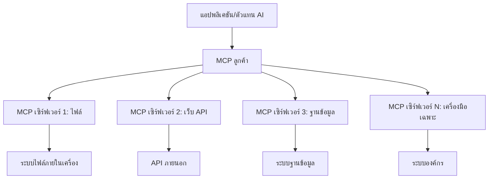

# 🌐 โมดูล 2: MCP กับพื้นฐาน Microsoft Foundry Toolkit

[]()
[]()
[]()

## 📋 วัตถุประสงค์การเรียนรู้

เมื่อจบโมดูลนี้ คุณจะสามารถ:
- ✅ เข้าใจสถาปัตยกรรมและประโยชน์ของ Model Context Protocol (MCP)
- ✅ สำรวจระบบนิเวศของเซิร์ฟเวอร์ MCP ของ Microsoft
- ✅ รวมเซิร์ฟเวอร์ MCP กับ Microsoft Foundry Toolkit Agent Builder
- ✅ สร้างเอเย่นต์อัตโนมัติบนเบราว์เซอร์ด้วย Playwright MCP
- ✅ กำหนดค่าและทดสอบเครื่องมือ MCP ภายในเอเย่นต์ของคุณ
- ✅ ส่งออกและปรับใช้เอเย่นต์ที่ใช้พลังงาน MCP สำหรับใช้งานจริง

## 🎯 การสร้างต่อจากโมดูล 1

ในโมดูล 1 เราได้เรียนรู้พื้นฐานของ Microsoft Foundry Toolkit และสร้าง Python Agent ตัวแรกของเรา ตอนนี้เราจะ **เพิ่มพลัง** ให้เอเย่นต์ของคุณโดยการเชื่อมต่อกับเครื่องมือและบริการภายนอกผ่าน **Model Context Protocol (MCP)** อันปฏิวัติวงการนี้

ให้คิดว่านี่เหมือนกับการอัปเกรดจากเครื่องคิดเลขพื้นฐานเป็นคอมพิวเตอร์เต็มรูปแบบ - เอเย่นต์ AI ของคุณจะได้รับความสามารถในการ:
- 🌐 ท่องเว็บและโต้ตอบกับเว็บไซต์
- 📁 เข้าถึงและจัดการไฟล์
- 🔧 รวมเข้ากับระบบองค์กร
- 📊 ประมวลผลข้อมูลเรียลไทม์จาก API

## 🧠 เข้าใจ Model Context Protocol (MCP)

### 🔍 MCP คืออะไร?

Model Context Protocol (MCP) คือ **"USB-C สำหรับแอปพลิเคชัน AI"** - มาตรฐานเปิดที่ปฏิวัติวงการซึ่งเชื่อมต่อ Large Language Models (LLMs) กับเครื่องมือภายนอก แหล่งข้อมูล และบริการ เช่นเดียวกับ USB-C ที่ทำให้สายเคเบิลยุ่งเหยิงหมดไปโดยอนุญาตให้ใช้ตัวเชื่อมต่อสากลหนึ่งเดียว MCP ช่วยขจัดความซับซ้อนในการรวม AI ด้วยโปรโตคอลมาตรฐานเดียว

### 🎯 ปัญหาที่ MCP แก้ไข

**ก่อน MCP:**
- 🔧 การรวมระบบแบบกำหนดเองสำหรับแต่ละเครื่องมือ
- 🔄 การผูกติดกับผู้ขายด้วยโซลูชันเฉพาะ
- 🔒 ช่องโหว่ด้านความปลอดภัยจากการเชื่อมต่อที่เกิดขึ้นเฉพาะหน้า
- ⏱️ ใช้เวลาหลายเดือนในการพัฒนาการรวมพื้นฐาน

**ด้วย MCP:**
- ⚡ การรวมเครื่องมือแบบปลั๊กแอนด์เพลย์
- 🔄 สถาปัตยกรรมไม่ผูกติดกับผู้ขาย
- 🛡️ แนวทางปฏิบัติด้านความปลอดภัยในตัว
- 🚀 เพิ่มความสามารถใหม่ในไม่กี่นาที

### 🏗️ เจาะลึกสถาปัตยกรรม MCP

MCP ใช้ **สถาปัตยกรรมไคลเอนต์-เซิร์ฟเวอร์** ที่สร้างระบบนิเวศที่ปลอดภัยและสามารถขยายได้:



**🔧 องค์ประกอบหลัก:**

| ส่วนประกอบ | บทบาท | ตัวอย่าง |
|-----------|------|----------|
| **MCP Hosts** | แอปพลิเคชันที่ใช้บริการ MCP | Claude Desktop, VS Code, Microsoft Foundry Toolkit |
| **MCP Clients** | ตัวจัดการโปรโตคอล (1:1 กับเซิร์ฟเวอร์) | ฝังอยู่ในแอปโฮสต์ |
| **MCP Servers** | เปิดเผยความสามารถผ่านโปรโตคอลมาตรฐาน | Playwright, Files, Azure, GitHub |
| **Transport Layer** | วิธีการสื่อสาร | stdio, HTTP, WebSockets |


## 🏢 ระบบนิเวศเซิร์ฟเวอร์ MCP ของ Microsoft

Microsoft นำระบบนิเวศ MCP ด้วยชุดเซิร์ฟเวอร์ระดับองค์กรที่ครอบคลุมซึ่งตอบโจทย์ความต้องการธุรกิจในโลกจริง

### 🌟 เซิร์ฟเวอร์ MCP ของ Microsoft ที่โดดเด่น

#### 1. ☁️ Azure MCP Server
**🔗 ที่เก็บข้อมูล**: [azure/azure-mcp](https://github.com/azure/azure-mcp)
**🎯 จุดประสงค์**: การจัดการทรัพยากร Azure แบบครบวงจรพร้อมการผสาน AI

**✨ คุณสมบัติหลัก:**
- การจัดเตรียมโครงสร้างพื้นฐานแบบประกาศ
- การตรวจสอบทรัพยากรแบบเรียลไทม์
- คำแนะนำการเพิ่มประสิทธิภาพค่าใช้จ่าย
- การตรวจสอบความสอดคล้องด้านความปลอดภัย

**🚀 กรณีใช้งาน:**
- Infrastructure-as-Code พร้อมช่วยเหลือ AI
- การปรับขนาดทรัพยากรอัตโนมัติ
- การเพิ่มประสิทธิภาพค่าใช้จ่ายคลาวด์
- การทำงานอัตโนมัติของ DevOps

#### 2. 📊 Microsoft Dataverse MCP
**📚 เอกสาร**: [Microsoft Dataverse Integration](https://go.microsoft.com/fwlink/?linkid=2320176)
**🎯 จุดประสงค์**: อินเทอร์เฟซภาษาธรรมชาติเพื่อข้อมูลธุรกิจ

**✨ คุณสมบัติหลัก:**
- การสืบค้นฐานข้อมูลด้วยภาษาธรรมชาติ
- ความเข้าใจบริบทธุรกิจ
- แม่แบบการแจ้งเตือนแบบกำหนดเอง
- การกำกับดูแลข้อมูลองค์กร

**🚀 กรณีใช้งาน:**
- รายงานเชิงธุรกิจ
- การวิเคราะห์ข้อมูลลูกค้า
- ข้อมูลเชิงลึกของสายงานขาย
- การสืบค้นข้อมูลเพื่อความสอดคล้อง

#### 3. 🌐 Playwright MCP Server
**🔗 ที่เก็บข้อมูล**: [microsoft/playwright-mcp](https://github.com/microsoft/playwright-mcp)
**🎯 จุดประสงค์**: ความสามารถในการอัตโนมัติเบราว์เซอร์และโต้ตอบเว็บ

**✨ คุณสมบัติหลัก:**
- อัตโนมัติข้ามเบราว์เซอร์ (Chrome, Firefox, Safari)
- การตรวจจับองค์ประกอบอย่างชาญฉลาด
- การสร้างภาพหน้าจอและ PDF
- การตรวจสอบการจราจรเครือข่าย

**🚀 กรณีใช้งาน:**
- โฟลว์การทดสอบอัตโนมัติ
- การขูดเว็บและการสกัดข้อมูล
- การตรวจสอบ UI/UX
- การวิเคราะห์การแข่งขันอัตโนมัติ

#### 4. 📁 Files MCP Server
**🔗 ที่เก็บข้อมูล**: [microsoft/files-mcp-server](https://github.com/microsoft/files-mcp-server)
**🎯 จุดประสงค์**: การจัดการระบบไฟล์อย่างชาญฉลาด

**✨ คุณสมบัติหลัก:**
- การจัดการไฟล์แบบประกาศ
- การซิงโครไนซ์เนื้อหา
- การรวมระบบควบคุมเวอร์ชัน
- การดึงข้อมูลเมตา

**🚀 กรณีใช้งาน:**
- การจัดการเอกสาร
- การจัดระเบียบโค้ดที่เก็บ
- โฟลว์การเผยแพร่เนื้อหา
- การจัดการไฟล์ในสายงานข้อมูล

#### 5. 📝 MarkItDown MCP Server
**🔗 ที่เก็บข้อมูล**: [microsoft/markitdown](https://github.com/microsoft/markitdown)
**🎯 จุดประสงค์**: การประมวลผลและจัดการ Markdown ขั้นสูง

**✨ คุณสมบัติหลัก:**
- การวิเคราะห์ Markdown ขั้นสูง
- การแปลงรูปแบบ (MD ↔ HTML ↔ PDF)
- การวิเคราะห์โครงสร้างเนื้อหา
- การประมวลผลแม่แบบ

**🚀 กรณีใช้งาน:**
- โฟลว์เอกสารทางเทคนิค
- ระบบจัดการเนื้อหา
- การสร้างรายงาน
- การทำระบบฐานความรู้แบบอัตโนมัติ

#### 6. 📈 Clarity MCP Server
**📦 แพ็กเกจ**: [@microsoft/clarity-mcp-server](https://www.npmjs.com/package/@microsoft/clarity-mcp-server)
**🎯 จุดประสงค์**: การวิเคราะห์เว็บและข้อมูลพฤติกรรมผู้ใช้

**✨ คุณสมบัติหลัก:**
- การวิเคราะห์ข้อมูลแผนที่ความร้อน
- การบันทึกเซสชันผู้ใช้
- ตัวชี้วัดประสิทธิภาพ
- การวิเคราะห์ช่องทางแปลง

**🚀 กรณีใช้งาน:**
- การปรับแต่งเว็บไซต์
- การวิจัยประสบการณ์ผู้ใช้
- การวิเคราะห์ A/B Testing
- แดชบอร์ดธุรกิจอัจฉริยะ

### 🌍 ระบบนิเวศชุมชน

นอกจากเซิร์ฟเวอร์ของ Microsoft แล้ว ระบบนิเวศ MCP ยังรวมถึง:
- **🐙 GitHub MCP**: การจัดการที่เก็บและการวิเคราะห์โค้ด
- **🗄️ Database MCPs**: การผสาน PostgreSQL, MySQL, MongoDB
- **☁️ Cloud Provider MCPs**: เครื่องมือ AWS, GCP, Digital Ocean
- **📧 Communication MCPs**: การผสาน Slack, Teams, อีเมล

## 🛠️ ห้องปฏิบัติการ: สร้างเอเย่นต์อัตโนมัติบนเบราว์เซอร์

**🎯 เป้าหมายโครงการ**: สร้างเอเย่นต์อัตโนมัติบนเบราว์เซอร์ที่ชาญฉลาดโดยใช้ Playwright MCP server ซึ่งสามารถท่องเว็บไซต์ ดึงข้อมูล และทำงานเว็บซับซ้อนได้

### 🚀 ขั้นตอนที่ 1: ตั้งค่าเอเย่นต์พื้นฐาน

#### ขั้นตอนที่ 1: เริ่มต้นเอเย่นต์ของคุณ
1. **เปิด Microsoft Foundry Toolkit Agent Builder**
2. **สร้างเอเย่นต์ใหม่** ด้วยการตั้งค่าดังนี้:
   - **ชื่อ**: `BrowserAgent`
   - **โมเดล**: เลือก GPT-4o 


### 🔧 ขั้นตอนที่ 2: โฟลว์การรวม MCP

#### ขั้นตอนที่ 3: เพิ่มการรวมเซิร์ฟเวอร์ MCP
1. **ไปที่ส่วนเครื่องมือ** ใน Agent Builder
2. **คลิก "เพิ่มเครื่องมือ"** เพื่อเปิดเมนูการรวมระบบ
3. **เลือก "MCP Server"** จากตัวเลือกที่มี


**🔍 ทำความเข้าใจประเภทเครื่องมือ:**
- **เครื่องมือในตัว**: ฟังก์ชัน Microsoft Foundry Toolkit ที่ตั้งค่าไว้แล้วล่วงหน้า
- **เซิร์ฟเวอร์ MCP**: การรวมบริการภายนอก
- **API แบบกำหนดเอง**: จุดสิ้นสุดบริการของคุณเอง
- **Function Calling**: การเข้าถึงฟังก์ชันโมเดลโดยตรง

#### ขั้นตอนที่ 4: การเลือกเซิร์ฟเวอร์ MCP
1. **เลือกตัวเลือก "MCP Server"** เพื่อดำเนินการต่อ


2. **เรียกดูแคตตาล็อก MCP** เพื่อสำรวจการรวมระบบที่มี


### 🎮 ขั้นตอนที่ 3: กำหนดค่า Playwright MCP

#### ขั้นตอนที่ 5: เลือกและกำหนดค่า Playwright
1. **คลิก "ใช้เซิร์ฟเวอร์ MCP ที่แนะนำ"** เพื่อเข้าถึงเซิร์ฟเวอร์ที่ได้รับการตรวจสอบจาก Microsoft
2. **เลือก "Playwright"** จากรายการที่แนะนำ
3. **ยอมรับค่า MCP ID เริ่มต้น** หรือปรับแต่งให้เหมาะกับสภาพแวดล้อมของคุณ


#### ขั้นตอนที่ 6: เปิดใช้งานความสามารถของ Playwright
**🔑 ขั้นตอนสำคัญ**: เลือกวิธีการ Playwright **ทั้งหมด** ที่มีเพื่อให้ฟังก์ชันครบถ้วนสูงสุด


**🛠️ เครื่องมือ Playwright จำเป็น:**
- **การนำทาง**: `goto`, `goBack`, `goForward`, `reload`
- **การโต้ตอบ**: `click`, `fill`, `press`, `hover`, `drag`
- **การดึงข้อมูล**: `textContent`, `innerHTML`, `getAttribute`
- **การตรวจสอบ**: `isVisible`, `isEnabled`, `waitForSelector`
- **การจับภาพ**: `screenshot`, `pdf`, `video`
- **เครือข่าย**: `setExtraHTTPHeaders`, `route`, `waitForResponse`

#### ขั้นตอนที่ 7: ตรวจสอบความสำเร็จของการรวมระบบ
**✅ ตัวชี้วัดความสำเร็จ:**
- เครื่องมือทั้งหมดปรากฏในอินเทอร์เฟซ Agent Builder
- ไม่มีข้อความแสดงข้อผิดพลาดในแผงการรวมระบบ
- สถานะเซิร์ฟเวอร์ Playwright แสดงว่า "เชื่อมต่อแล้ว"


**🔧 การแก้ไขปัญหาทั่วไป:**
- **เชื่อมต่อล้มเหลว**: ตรวจสอบการเชื่อมต่ออินเทอร์เน็ตและการตั้งค่าไฟร์วอลล์
- **เครื่องมือหาย**: ตรวจสอบให้แน่ใจว่าเลือกความสามารถทั้งหมดในระหว่างการตั้งค่า
- **ข้อผิดพลาดสิทธิ์**: ยืนยันว่า VS Code มีสิทธิ์ระบบที่จำเป็น

### 🎯 ขั้นตอนที่ 4: การออกแบบพร้อมท์ขั้นสูง

#### ขั้นตอนที่ 8: ออกแบบพร้อมท์ระบบชาญฉลาด
สร้างพร้อมท์ที่ซับซ้อนซึ่งใช้ประโยชน์จากความสามารถเต็มรูปแบบของ Playwright:

```markdown
# Web Automation Expert System Prompt

## Core Identity
You are an advanced web automation specialist with deep expertise in browser automation, web scraping, and user experience analysis. You have access to Playwright tools for comprehensive browser control.

## Capabilities & Approach
### Navigation Strategy
- Always start with screenshots to understand page layout
- Use semantic selectors (text content, labels) when possible
- Implement wait strategies for dynamic content
- Handle single-page applications (SPAs) effectively

### Error Handling
- Retry failed operations with exponential backoff
- Provide clear error descriptions and solutions
- Suggest alternative approaches when primary methods fail
- Always capture diagnostic screenshots on errors

### Data Extraction
- Extract structured data in JSON format when possible
- Provide confidence scores for extracted information
- Validate data completeness and accuracy
- Handle pagination and infinite scroll scenarios

### Reporting
- Include step-by-step execution logs
- Provide before/after screenshots for verification
- Suggest optimizations and alternative approaches
- Document any limitations or edge cases encountered

## Ethical Guidelines
- Respect robots.txt and rate limiting
- Avoid overloading target servers
- Only extract publicly available information
- Follow website terms of service
```

#### ขั้นตอนที่ 9: สร้างพร้อมท์ผู้ใช้แบบไดนามิก
ออกแบบพร้อมท์ที่แสดงความสามารถหลากหลาย:

**🌐 ตัวอย่างการวิเคราะห์เว็บ:**
```markdown
Navigate to github.com/kinfey and provide a comprehensive analysis including:
1. Repository structure and organization
2. Recent activity and contribution patterns  
3. Documentation quality assessment
4. Technology stack identification
5. Community engagement metrics
6. Notable projects and their purposes

Include screenshots at key steps and provide actionable insights.
```


### 🚀 ขั้นตอนที่ 5: การดำเนินงานและทดสอบ

#### ขั้นตอนที่ 10: รันขั้นตอนการอัตโนมัติครั้งแรกของคุณ
1. **คลิก "Run"** เพื่อเริ่มลำดับการอัตโนมัติ
2. **ตรวจสอบการดำเนินงานแบบเรียลไทม์**:
   - เบราว์เซอร์ Chrome เปิดขึ้นโดยอัตโนมัติ
   - เอเย่นต์นำทางไปยังเว็บไซต์เป้าหมาย
   - จับภาพหน้าจอในแต่ละขั้นตอนสำคัญ
   - ผลการวิเคราะห์แสดงเรียลไทม์


#### ขั้นตอนที่ 11: วิเคราะห์ผลลัพธ์และข้อมูลเชิงลึก
ตรวจสอบการวิเคราะห์ที่ครอบคลุมในอินเทอร์เฟซ Agent Builder:


### 🌟 ขั้นตอนที่ 6: ความสามารถขั้นสูงและการปรับใช้

#### ขั้นตอนที่ 12: ส่งออกและปรับใช้ในระบบจริง
Agent Builder รองรับตัวเลือกการปรับใช้หลายรูปแบบ:


## 🎓 สรุปโมดูล 2 & ขั้นตอนถัดไป

### 🏆 ความสำเร็จที่ได้รับ: ผู้เชี่ยวชาญด้านการรวม MCP

**✅ ทักษะที่เชี่ยวชาญ:**
- [ ] เข้าใจสถาปัตยกรรมและประโยชน์ของ MCP
- [ ] นำทางระบบนิเวศเซิร์ฟเวอร์ MCP ของ Microsoft
- [ ] รวม Playwright MCP กับ Microsoft Foundry Toolkit
- [ ] สร้างเอเย่นต์อัตโนมัติบนเบราว์เซอร์ขั้นสูง
- [ ] การออกแบบพร้อมท์ขั้นสูงสำหรับอัตโนมัติบนเว็บ

### 📚 แหล่งข้อมูลเพิ่มเติม

- **🔗 สเปก MCP**: [เอกสารโปรโตคอลอย่างเป็นทางการ](https://modelcontextprotocol.io/)
- **🛠️ Playwright API**: [คู่มือวิธีใช้ครบถ้วน](https://playwright.dev/docs/api/class-playwright)
- **🏢 เซิร์ฟเวอร์ MCP ของ Microsoft**: [คู่มือการผสานระบบองค์กร](https://github.com/microsoft/mcp-servers)
- **🌍 ตัวอย่างชุมชน**: [แกลเลอรีเซิร์ฟเวอร์ MCP](https://github.com/modelcontextprotocol/servers)

**🎉 ยินดีด้วย!** คุณได้เรียนรู้การรวม MCP อย่างเชี่ยวชาญและสามารถสร้างเอเย่นต์ AI พร้อมความสามารถเครื่องมือภายนอกสำหรับใช้งานจริงได้แล้ว!


### 🔜 ไปต่อโมดูลถัดไป

พร้อมแล้วที่จะยกระดับทักษะ MCP ของคุณไหม? ไปที่ **[โมดูล 3: การพัฒนา MCP ขั้นสูงด้วย Microsoft Foundry Toolkit](../lab3/README.md)** ที่คุณจะได้เรียนรู้วิธี:
- สร้างเซิร์ฟเวอร์ MCP แบบกำหนดเองของคุณเอง
- กำหนดค่าและใช้ MCP Python SDK เวอร์ชันล่าสุด
- ตั้งค่า MCP Inspector สำหรับดีบัก
- เชี่ยวชาญการพัฒนาเซิร์ฟเวอร์ MCP แบบขั้นสูง
- สร้าง Weather MCP Server ตั้งแต่ต้น

---

<!-- CO-OP TRANSLATOR DISCLAIMER START -->
**ปฏิเสธความรับผิดชอบ**:
เอกสารนี้ได้รับการแปลโดยใช้บริการแปลภาษา AI [Co-op Translator](https://github.com/Azure/co-op-translator) ขณะที่เราพยายามให้ความถูกต้อง โปรดทราบว่าการแปลโดยอัตโนมัติอาจมีข้อผิดพลาดหรือความไม่ถูกต้อง เอกสารต้นฉบับในภาษาต้นทางควรถูกพิจารณาเป็นแหล่งข้อมูลที่เชื่อถือได้ สำหรับข้อมูลที่สำคัญ แนะนำให้ใช้การแปลโดยมนุษย์มืออาชีพ เราไม่รับผิดชอบต่อความเข้าใจผิดหรือการตีความที่ผิดพลาดที่เกิดขึ้นจากการใช้การแปลนี้
<!-- CO-OP TRANSLATOR DISCLAIMER END -->