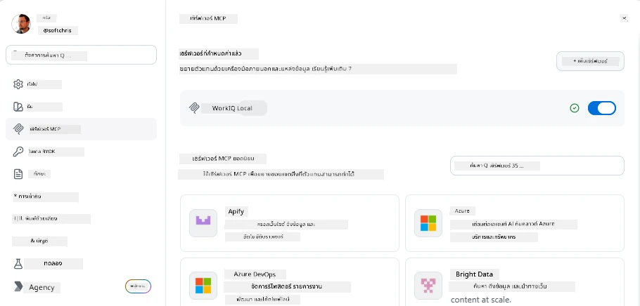
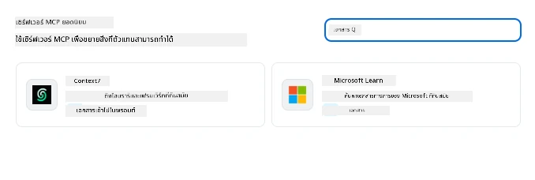
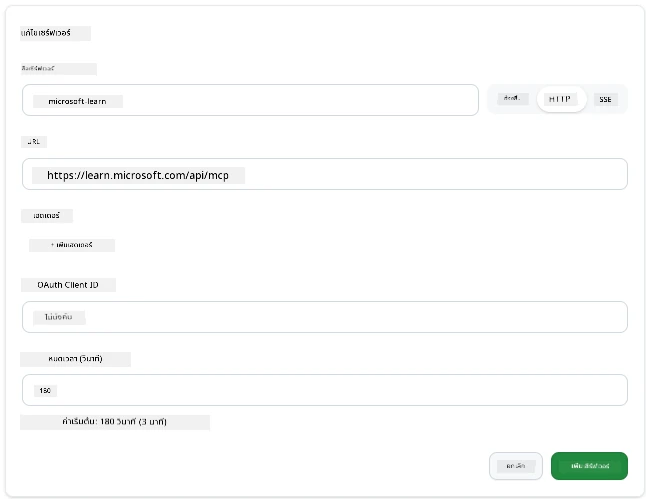
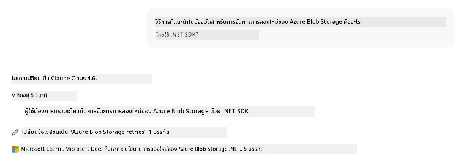
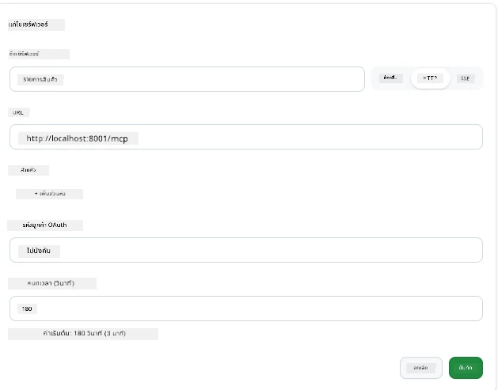
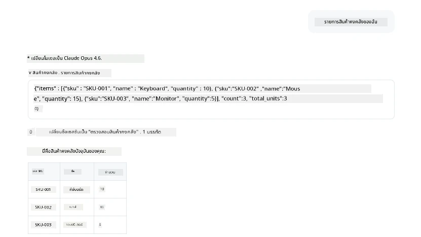
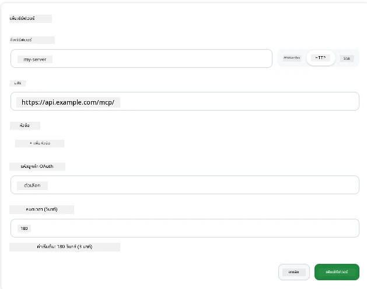
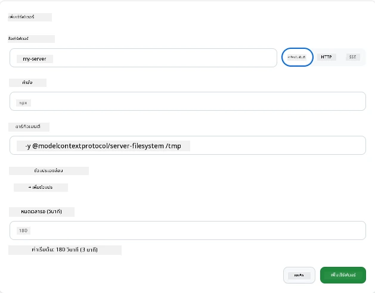

# การใช้ MCP Servers ในแอป GitHub Copilot

ตอนนี้คุณรู้แล้วว่า MCP ทำงานอย่างไร คุณได้สร้างเซิร์ฟเวอร์ กำหนดเครื่องมือและทรัพยากร และเชื่อมต่อไคลเอนต์ สิ่งที่เรายังไม่ทำคือเปลี่ยนมุมมอง: แทนที่จะเป็นคุณที่สร้างเซิร์ฟเวอร์ มันจะเป็นอย่างไรถ้าคุณอยู่ในฝั่ง *ผู้บริโภค* — ในฐานะผู้ใช้แอปที่ขับเคลื่อนด้วย AI ซึ่งรองรับ MCP?

[GitHub Copilot App](https://github.com/github/app) เป็นแอปเดสก์ท็อปที่สามารถใช้ MCP Servers ได้ การเชื่อมต่อ MCP servers กับมัน จะช่วยปลดล็อคระดับใหม่: Copilot สามารถเข้าถึงเอกสารของคุณ เรียก API ภายในของคุณ สืบค้นฐานข้อมูล หรือสื่อสารกับบริการที่คุณหุ้มในเซิร์ฟเวอร์ แอปจะกลายเป็นโฮสต์ และ MCP servers ของคุณกลายเป็นเครื่องมือของมัน

บทเรียนนี้จะพาคุณผ่านประสบการณ์นี้ตั้งแต่ต้นจนจบ — จากการค้นหาพาเนลการตั้งค่า MCP ไปจนถึงการเชื่อมต่อเซิร์ฟเวอร์เอกสารจริง และการเชื่อมต่อเซิร์ฟเวอร์แบบกำหนดเองของคุณเอง

## วัตถุประสงค์การเรียนรู้

เมื่อจบบทเรียนนี้ คุณจะสามารถ:

- ค้นหาและนำทางไปยังพาเนล MCP Servers ในการตั้งค่าแอป Copilot
- เชื่อมต่อเซิร์ฟเวอร์เอกสารที่โฮสต์และใช้งานภายในเซสชัน
- ลงทะเบียนเซิร์ฟเวอร์แบบกำหนดเองและตรวจสอบว่า Copilot สามารถเรียกใช้เครื่องมือของมันได้
- กำหนดค่าการเรียกเซิร์ฟเวอร์โดยการจัดเตรียมตัวแปรสภาพแวดล้อมหรือเฮดเดอร์แบบกำหนดเอง (ถ้าเป็น HTTP)

## แอป Copilot ในฐานะโฮสต์ MCP

นี่คือแนวคิดพื้นฐาน: **ตัวแทนของ Copilot ฉลาด แต่พวกเขารู้แค่สิ่งที่คุณบอกเท่านั้น** โดยปกติ ตัวแทนสามารถอ่านไฟล์ในที่ทำงานของคุณและรันคำสั่งเทอร์มินัลได้ แต่ไม่สามารถสืบค้นฐานข้อมูลของคุณ ดูปฏิทิน หรือเรียก API แบบกำหนดเองได้หากไม่มีตัวช่วย นั่นคือที่มาของ MCP Servers พวกมันทำหน้าที่เป็นสะพานเชื่อมระหว่าง Copilot กับระบบของคุณ — ฐานข้อมูล ระบบควบคุมเวอร์ชัน APIs เครื่องมือออกแบบ — ช่วยให้ตัวแทนเข้าถึงข้อมูลและการกระทำที่จำเป็นในการทำงานให้เสร็จสิ้น

มาเริ่มต้นด้วยการค้นหาการตั้งค่าเพื่อจัดการ MCP Servers ของแอปของคุณกัน

## ขั้นตอนที่ 1: ค้นหาพาเนลการตั้งค่า MCP

เปิดแอป Copilot และหาสัญลักษณ์ฟันเฟืองที่มุมล่างซ้ายแล้วคลิก


ตรวจสอบให้แน่ใจว่าคุณเลือก "MCP Servers" และคุณจะเห็นเซิร์ฟเวอร์ที่คุณตั้งค่าไว้แล้วอยู่ด้านบน ตลาดเซิร์ฟเวอร์ยอดนิยมอยู่ด้านล่าง และปุ่ม "Add Server" อยู่ด้านบน ดังนี้:



นี่คือศูนย์ควบคุมของคุณ คุณสามารถเพิ่ม ลบ เปิด หรือปิดใช้งานเซิร์ฟเวอร์ได้ที่นี่ การเปลี่ยนแปลงจะมีผลกับเซสชันใหม่; หากคุณมีเซสชันเปิดอยู่ คุณต้องเริ่มเซสชันใหม่หลังจากเปลี่ยนรายการนี้

## ขั้นตอนที่ 2: เชื่อมต่อเซิร์ฟเวอร์เอกสาร

มาทำสิ่งที่ใช้ประโยชน์ได้ทันที เซิร์ฟเวอร์ Microsoft Docs MCP ให้ Copilot เข้าถึงเอกสารอย่างเป็นทางการของ Microsoft ซึ่งรวมถึง Azure, .NET, TypeScript และอื่นๆ แทนที่ตัวแทนจะพึ่งพาข้อมูลการฝึกอบรม (ซึ่งมีวันตัด) มันสามารถดึงเอกสารปัจจุบันในเวลาสืบค้นได้

วิธีเพิ่ม:

1. ในตารางเซิร์ฟเวอร์ยอดนิยม พิมพ์ **learn** และเลือกเซิร์ฟเวอร์ชื่อ "Microsoft Learn"

   

   เมื่อคลิกแล้ว จะมีฟอร์มที่กรอกชื่อ ประเภทการขนส่ง และ URL ไว้ล่วงหน้า ทั้งหมดที่คุณต้องทำคือคลิก "Add Server"

2. คลิก "Add Server" แล้วจะใช้เวลาไม่กี่วินาทีในการเชื่อมต่อกับเซิร์ฟเวอร์

   

   เมื่อเพิ่มแล้ว ควรแสดงในส่วนบนเป็นเซิร์ฟเวอร์ที่ตั้งค่าไว้ ลองใช้งานดูได้เลย

3. ปิดกล่องโต้ตอบและเลือก Quick chat

4. พิมพ์คำสั่งด้านล่างเพื่อเรียกใช้เครื่องมือบนเซิร์ฟเวอร์ Microsoft Learn

   ```text
   What's the current recommended approach for handling Azure Blob Storage 
   retries using the .NET SDK?
   ```

   

คุณจะเห็นว่ามันอ้างอิงถึง MCP Server ที่เราเพิ่งเพิ่มไป

## ขั้นตอนที่ 3: เชื่อมต่อเซิร์ฟเวอร์ stdio แบบกำหนดเอง

การตั้งค่าที่เตรียมไว้สะดวกมาก แต่พลังจริงอยู่ที่การเชื่อมต่อเซิร์ฟเวอร์ของคุณเอง สมมติว่าคุณสร้างเซิร์ฟเวอร์ (หรือได้รับมา) ที่เปิดเผย API ภายในหรือฐานความรู้ของบริษัท ในกรณีนี้ เราจะใช้ MCP Server ที่เราสร้างซึ่งจัดการการจัดการสินค้าคงคลังของบริษัทเรา

1. คลิกฟันเฟืองและเลือก "MCP servers" อีกครั้ง

2. เลือกปุ่ม "Add Server" และ "+ Add Custom server" แล้วกรอกค่าดังนี้:

   - ชื่อ: `Inventory Server`
   - เลือกประเภทการขนส่ง (อยู่ทางขวา), **http**

   เลือก "Add Server" และมันควรปรากฏในรายการเซิร์ฟเวอร์ที่ตั้งค่าไว้ของคุณ

   

4. ทดสอบโดยรันคำสั่งประมาณนี้:

    ```
    list inventory
    ```

   

   คุณควรเห็นรายการสินค้าคงคลังที่ส่งกลับมาจากเซิร์ฟเวอร์ที่คุณสร้างเอง

เยี่ยมมาก คุณควรจะเข้าใจดีขึ้นเกี่ยวกับการเพิ่มเซิร์ฟเวอร์ภายนอกและของคุณเองในแอป Copilot แล้ว ต่อไปมาคุยเรื่องการจัดการความลับและตัวแปรสภาพแวดล้อมกัน

## ขั้นตอนที่ 4: การตั้งค่าขั้นสูง

จนถึงตอนนี้ คุณได้เห็นวิธีเพิ่ม MCP Servers ที่คุณเพียงระบุชื่อและ URL แต่ถ้าเซิร์ฟเวอร์ของคุณต้องการคีย์ API หรือค่าบางอย่างล่ะ? ขึ้นอยู่กับประเภทการขนส่ง เราสามารถมอบสิ่งที่ต้องการให้มันได้

- **http หรือการขนส่ง SSE**: ที่นี่เราสามารถตั้งค่าเฮดเดอร์ตามความต้องการ

   สำหรับการยืนยันตัวตน คุณสามารถระบุเฮดเดอร์ Authorization ได้ ตัวค่าอาจเป็นสตริงแบบคงที่ หากใช้ OAuth คุณสามารถให้ OAuth client ID แทนได้

   

- **stdio transport**: สามารถตั้งค่าตัวแปรสภาพแวดล้อมได้

   คุณสามารถระบุตัวแปรสภาพแวดล้อมที่ต้องการได้หลายตัว ซึ่งควรถูกส่งเข้าไปยังเซิร์ฟเวอร์เมื่อเริ่มต้น

   

## สรุป

แอป Copilot ปฏิบัติต่อ MCP servers เป็นส่วนขยายระดับชั้นนำของความสามารถของตัวแทน คุณได้เห็นกระบวนการทั้งหมดในบทเรียนนี้ ตั้งแต่การเพิ่ม MCP servers จนถึงการใช้งานในเซสชัน คุณสามารถเชื่อมต่อกับเซิร์ฟเวอร์สาธารณะ APIs ภายใน และเครื่องมือกำหนดเอง ทำให้ตัวแทนอิสระของคุณสามารถเข้าถึงข้อมูลและการกระทำที่จำเป็นในการทำงานให้สำเร็จได้

## 📚 แหล่งข้อมูลเพิ่มเติม

### เอกสารอย่างเป็นทางการ

- [GitHub Copilot App](https://github.com/github/app)
- [MCP Specification](https://modelcontextprotocol.io/specification/2025-03-26) - สเปคโปรโตคอลบริบทโมเดล

### ชุมชน
- [MCP Community Discord](https://discord.com/invite/ByRwuEEgH4) - สนทนาสด
- [GitHub Discussions](https://github.com/microsoft/MCP-Server-and-PostgreSQL-Sample-Retail/discussions) - ถามตอบและแลกเปลี่ยน
- [Stack Overflow](https://stackoverflow.com/questions/tagged/model-context-protocol) - คำถามด้านเทคนิค

---

<!-- CO-OP TRANSLATOR DISCLAIMER START -->
**ปฏิเสธความรับผิดชอบ**:
เอกสารนี้ได้รับการแปลโดยใช้บริการแปลภาษา AI [Co-op Translator](https://github.com/Azure/co-op-translator) ขณะที่เราพยายามให้ความถูกต้อง โปรดทราบว่าการแปลโดยอัตโนมัติอาจมีข้อผิดพลาดหรือความไม่ถูกต้อง เอกสารต้นฉบับในภาษาต้นทางควรถูกพิจารณาเป็นแหล่งข้อมูลที่เชื่อถือได้ สำหรับข้อมูลที่สำคัญ แนะนำให้ใช้การแปลโดยมนุษย์มืออาชีพ เราไม่รับผิดชอบต่อความเข้าใจผิดหรือการตีความที่ผิดพลาดที่เกิดขึ้นจากการใช้การแปลนี้
<!-- CO-OP TRANSLATOR DISCLAIMER END -->