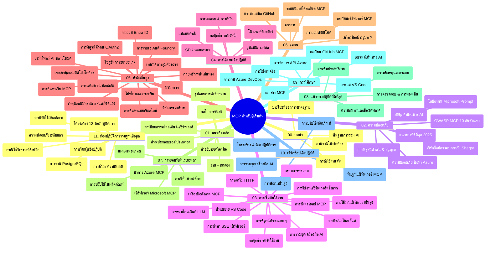

# Model Context Protocol (MCP) สำหรับผู้เริ่มต้น - คู่มือการศึกษา

คู่มือการศึกษานี้ให้ภาพรวมของโครงสร้างและเนื้อหาในที่เก็บข้อมูลสำหรับหลักสูตร "Model Context Protocol (MCP) สำหรับผู้เริ่มต้น" ใช้คู่มือนี้เพื่อช่วยนำทางที่เก็บข้อมูลอย่างมีประสิทธิภาพและใช้ประโยชน์สูงสุดจากทรัพยากรที่มีอยู่

## ภาพรวมของที่เก็บข้อมูล

Model Context Protocol (MCP) เป็นกรอบงานมาตรฐานสำหรับการโต้ตอบระหว่างโมเดลปัญญาประดิษฐ์และแอปพลิเคชันลูกค้า สร้างขึ้นครั้งแรกโดย Anthropic ตอนนี้ MCP ได้รับการดูแลโดยชุมชน MCP ที่กว้างขึ้นผ่านองค์กร GitHub อย่างเป็นทางการ ที่เก็บข้อมูลนี้ให้หลักสูตรที่ครอบคลุมพร้อมตัวอย่างโค้ดปฏิบัติใน C#, Java, JavaScript, Python และ TypeScript ออกแบบมาสำหรับนักพัฒนา AI สถาปนิกระบบ และวิศวกรซอฟต์แวร์

## แผนที่หลักสูตรแบบภาพ

## โครงสร้างของที่เก็บข้อมูล

ที่เก็บข้อมูลนี้จัดระเบียบเป็นสิบเอ็ดส่วนหลัก โดยแต่ละส่วนจะเน้นในแง่มุมต่าง ๆ ของ MCP:

1. **บทนำ (00-Introduction/)**
   - ภาพรวมของ Model Context Protocol
   - เหตุผลที่มาตรฐานมีความสำคัญในสายงาน AI
   - กรณีใช้งานและประโยชน์เชิงปฏิบัติ

2. **แนวคิดหลัก (01-CoreConcepts/)**
   - สถาปัตยกรรมไคลเอนต์-เซิร์ฟเวอร์
   - ส่วนประกอบหลักของโปรโตคอล
   - รูปแบบการส่งข้อความใน MCP

3. **ความปลอดภัย (02-Security/)**
   - ภัยคุกคามความปลอดภัยในระบบที่ใช้ MCP
   - แนวทางปฏิบัติที่ดีที่สุดสำหรับการรักษาความปลอดภัย
   - กลยุทธ์การยืนยันตัวตนและการอนุญาต
   - **เอกสารความปลอดภัยที่ครอบคลุม**:
     - แนวทางปฏิบัติที่ดีที่สุดด้านความปลอดภัย MCP 2025
     - คู่มือการใช้งาน Azure Content Safety
     - การควบคุมและเทคนิคความปลอดภัยของ MCP
     - สรุปแนวทางปฏิบัติที่ดีที่สุด MCP
   - **หัวข้อความปลอดภัยหลัก**:
     - การโจมตีด้วย prompt injection และการวางยาพิษเครื่องมือ
     - การแฮกเซสชันและปัญหา confused deputy
     - ช่องโหว่ token passthrough
     - สิทธิ์และการควบคุมการเข้าถึงเกินจำเป็น
     - ความปลอดภัยของซัพพลายเชนสำหรับส่วนประกอบ AI
     - การผสานรวม Microsoft Prompt Shields

4. **การเริ่มต้นใช้งาน (03-GettingStarted/)**
   - การตั้งค่าและกำหนดค่าสภาพแวดล้อม
   - การสร้างเซิร์ฟเวอร์และไคลเอนต์ MCP ขั้นพื้นฐาน
   - การผสานรวมกับแอปพลิเคชันที่มีอยู่
   - รวมถึงส่วน:
     - การสร้างเซิร์ฟเวอร์ตัวแรก
     - การพัฒนาไคลเอนต์
     - การผสาน LLM ไคลเอนต์
     - การผสาน VS Code
     - เซิร์ฟเวอร์ Server-Sent Events (SSE)
     - การใช้งานเซิร์ฟเวอร์ขั้นสูง
     - HTTP streaming
     - การผสาน AI Toolkit
     - กลยุทธ์การทดสอบ
     - แนวทางการปรับใช้งาน

5. **การนำไปใช้งานเชิงปฏิบัติ (04-PracticalImplementation/)**
   - การใช้ SDK ในหลายภาษาโปรแกรม
   - เทคนิคการดีบัก ทดสอบ และยืนยัน
   - การสร้างแม่แบบ prompt และเวิร์กโฟลว์ที่นำกลับมาใช้ใหม่ได้
   - ตัวอย่างโครงการพร้อมตัวอย่างการใช้งาน

6. **หัวข้อขั้นสูง (05-AdvancedTopics/)**
   - เทคนิควิศวกรรมบริบท
   - การผสานตัวแทน Foundry
   - เวิร์กโฟลว์ AI แบบมัลติโมดัล
   - ตัวอย่างการยืนยันตัวตน OAuth2
   - ความสามารถการค้นหาตามเวลาจริง
   - การสตรีมแบบเวลาจริง
   - การนำบริบทราก (root contexts) มาใช้
   - กลยุทธ์การกำหนดเส้นทาง
   - เทคนิคการสุ่มตัวอย่าง
   - วิธีการปรับขนาด
   - ข้อควรพิจารณาด้านความปลอดภัย
   - การผสาน Entra ID ด้านความปลอดภัย
   - การผสานการค้นหาเว็บ
   - การให้เหตุผลผู้แทนหลายฝ่ายแบบสู้กัน (รูปแบบการโต้แย้ง)

7. **การมีส่วนร่วมของชุมชน (06-CommunityContributions/)**
   - วิธีการร่วมเขียนโค้ดและเอกสาร
   - การทำงานร่วมกันผ่าน GitHub
   - การปรับปรุงและแลกเปลี่ยนความคิดเห็นโดยชุมชน
   - การใช้ไคลเอนต์ MCP ต่าง ๆ (Claude Desktop, Cline, VSCode)
   - การทำงานกับเซิร์ฟเวอร์ MCP ยอดนิยม รวมถึงการสร้างภาพ

8. **บทเรียนจากการใช้งานแรกเริ่ม (07-LessonsfromEarlyAdoption/)**
   - การใช้งานจริงและเรื่องราวความสำเร็จ
   - การสร้างและปรับใช้โซลูชันบนพื้นฐาน MCP
   - แนวโน้มและแผนที่อนาคต
   - **คู่มือ Microsoft MCP Servers**: คู่มือครบถ้วนสำหรับเซิร์ฟเวอร์ MCP ของ Microsoft 10 รายการ พร้อมรายละเอียด:
     - Microsoft Learn Docs MCP Server
     - Azure MCP Server (ตัวเชื่อมต่อเฉพาะ 15+ รายการ)
     - GitHub MCP Server
     - Azure DevOps MCP Server
     - MarkItDown MCP Server
     - SQL Server MCP Server
     - Playwright MCP Server
     - Dev Box MCP Server
     - Microsoft Foundry MCP Server
     - Microsoft 365 Agents Toolkit MCP Server

9. **แนวทางปฏิบัติที่ดีที่สุด (08-BestPractices/)**
   - การปรับจูนและเพิ่มประสิทธิภาพ
   - การออกแบบระบบ MCP ที่ทนต่อความผิดพลาด
   - กลยุทธ์การทดสอบและความยืดหยุ่น

10. **กรณีศึกษา (09-CaseStudy/)**
    - **เจ็ดกรณีศึกษาที่ครอบคลุม** แสดงให้เห็นความยืดหยุ่นของ MCP ในสถานการณ์ต่าง ๆ:
    - **Azure AI Travel Agents**: การจัดการตัวแทนหลายฝ่ายด้วย Azure OpenAI และ AI Search
    - **การผสาน Azure DevOps**: อัตโนมัติกระบวนการเวิร์กโฟลว์ด้วยการอัปเดตข้อมูล YouTube
    - **การดึงเอกสารแบบเรียลไทม์**: ไคลเอนต์ Python console พร้อมการสตรีม HTTP
    - **เครื่องมือสร้างแผนการศึกษาแบบโต้ตอบ**: แอปเว็บ Chainlit กับ AI สำหรับการสนทนา
    - **เอกสารในตัวแก้ไข**: การผสาน VS Code กับเวิร์กโฟลว์ GitHub Copilot
    - **การจัดการ API Azure**: การผสาน API องค์กรด้วยการสร้าง MCP server
    - **GitHub MCP Registry**: การพัฒนา ecosystem และแพลตฟอร์มการผสานตัวแทน
    - ตัวอย่างการใช้งานครอบคลุมการผสานองค์กร การเพิ่มประสิทธิภาพนักพัฒนา และการพัฒนา ecosystem

11. **เวิร์กชอปปฏิบัติ (10-StreamliningAIWorkflowsBuildingAnMCPServerWithAIToolkit/)**
    - เวิร์กชอปปฏิบัติแบบครบถ้วนรวม MCP กับ AI Toolkit
    - การสร้างแอปพลิเคชันอัจฉริยะเชื่อม AI models กับเครื่องมือในโลกจริง
    - โมดูลปฏิบัติครอบคลุมพื้นฐาน การพัฒนาเซิร์ฟเวอร์แบบกำหนดเอง และกลยุทธ์การปรับใช้ในผลิตจริง
    - **โครงสร้างแลป**:
      - แลป 1: พื้นฐาน MCP Server
      - แลป 2: การพัฒนา MCP Server ขั้นสูง
      - แลป 3: การผสาน AI Toolkit
      - แลป 4: การปรับใช้จริงและการปรับขนาด
    - วิธีการเรียนรู้แบบแลปพร้อมคำแนะนำทีละขั้นตอน

12. **แลปการผสานฐานข้อมูล MCP Server (11-MCPServerHandsOnLabs/)**
    - **เส้นทางเรียนรู้ 13 แลปครบวงจร** สำหรับการสร้าง MCP servers พร้อมใช้งานจริงที่ผสาน PostgreSQL
    - **การใช้งานจริงในบทวิเคราะห์ค้าปลีก** โดยใช้เคส Zava Retail
    - **รูปแบบระดับองค์กร** รวม Row Level Security (RLS), การค้นหาทางความหมาย และการเข้าถึงข้อมูลแบบผู้เช่าเดียวกันหลายราย
    - **โครงสร้างแลปครบถ้วน**:
      - **แลป 00-03: รากฐาน** - บทนำ สถาปัตยกรรม ความปลอดภัย การตั้งค่าสภาพแวดล้อม
      - **แลป 04-06: สร้าง MCP Server** - ออกแบบฐานข้อมูล การนำ MCP Server ไปใช้ พัฒนาเครื่องมือ
      - **แลป 07-09: ฟีเจอร์ขั้นสูง** - การค้นหาทางความหมาย การทดสอบและดีบัก การผสาน VS Code
      - **แลป 10-12: ผลิตจริง & แนวทางปฏิบัติ** - การปรับใช้ การตรวจสอบ การเพิ่มประสิทธิภาพ
    - **เทคโนโลยีที่ครอบคลุม**: FastMCP framework, PostgreSQL, Azure OpenAI, Azure Container Apps, Application Insights
    - **ผลลัพธ์การเรียนรู้**: MCP servers พร้อมใช้งานจริง, รูปแบบผสานฐานข้อมูล, การวิเคราะห์ด้วย AI, ความปลอดภัยระดับองค์กร

## แหล่งข้อมูลเพิ่มเติม

ที่เก็บนี้รวมทรัพยากรช่วยสนับสนุน:

- **โฟลเดอร์ภาพ**: มีแผนภาพและภาพประกอบที่ใช้ตลอดหลักสูตร
- **การแปลภาษา**: รองรับหลายภาษาโดยแปลเอกสารอัตโนมัติ
- **แหล่งข้อมูล MCP อย่างเป็นทางการ**:
  - [เอกสาร MCP](https://modelcontextprotocol.io/)
  - [ข้อกำหนด MCP](https://spec.modelcontextprotocol.io/)
  - [ที่เก็บ MCP GitHub](https://github.com/modelcontextprotocol)

## วิธีใช้ที่เก็บนี้

1. **เรียนรู้ตามลำดับ**: ตามบท (00 ถึง 11) สำหรับประสบการณ์การเรียนรู้ที่เป็นระบบ
2. **เน้นภาษาที่สนใจ**: สำรวจไดเรกทอรีตัวอย่างโค้ดในภาษาที่คุณชื่นชอบ
3. **การใช้งานเชิงปฏิบัติ**: เริ่มที่ส่วน "Getting Started" เพื่อเตรียมสภาพแวดล้อมและสร้างเซิร์ฟเวอร์กับไคลเอนต์ MCP ตัวแรก
4. **เจาะลึกขั้นสูง**: เมื่อมั่นใจในพื้นฐานแล้ว ให้ลงลึกหัวข้อขั้นสูงเพื่อขยายความรู้
5. **เข้าร่วมชุมชน**: ร่วมชุมชน MCP ผ่านทาง GitHub discussions และ Discord เพื่อเชื่อมต่อกับผู้เชี่ยวชาญและผู้พัฒนาอื่น ๆ

## ไคลเอนต์และเครื่องมือ MCP

หลักสูตรครอบคลุมไคลเอนต์และเครื่องมือ MCP ต่าง ๆ:

1. **ไคลเอนต์อย่างเป็นทางการ**:
   - Visual Studio Code 
   - MCP ใน Visual Studio Code
   - Claude Desktop
   - Claude ใน VSCode 
   - Claude API

2. **ไคลเอนต์ชุมชน**:
   - Cline (บนเทอร์มินัล)
   - Cursor (ตัวแก้ไขโค้ด)
   - ChatMCP
   - Windsurf

3. **เครื่องมือจัดการ MCP**:
   - MCP CLI
   - MCP Manager
   - MCP Linker
   - MCP Router

## เซิร์ฟเวอร์ MCP ยอดนิยม

ที่เก็บนี้แนะนำเซิร์ฟเวอร์ MCP หลายแบบ รวมถึง:

1. **เซิร์ฟเวอร์ MCP ของ Microsoft อย่างเป็นทางการ**:
   - Microsoft Learn Docs MCP Server
   - Azure MCP Server (ตัวเชื่อมต่อเฉพาะ 15+ รายการ)
   - GitHub MCP Server
   - Azure DevOps MCP Server
   - MarkItDown MCP Server
   - SQL Server MCP Server
   - Playwright MCP Server
   - Dev Box MCP Server
   - Microsoft Foundry MCP Server
   - Microsoft 365 Agents Toolkit MCP Server

2. **เซิร์ฟเวอร์อ้างอิงอย่างเป็นทางการ**:
   - Filesystem
   - Fetch
   - Memory
   - Sequential Thinking

3. **การสร้างภาพ**:
   - Azure OpenAI DALL-E 3
   - Stable Diffusion WebUI
   - Replicate

4. **เครื่องมือพัฒนา**:
   - Git MCP
   - Terminal Control
   - Code Assistant

5. **เซิร์ฟเวอร์เฉพาะทาง**:
   - Salesforce
   - Microsoft Teams
   - Jira & Confluence

## การมีส่วนร่วม

ที่เก็บนี้ยินดีต้อนรับการมีส่วนร่วมจากชุมชน ดูส่วนการมีส่วนร่วมของชุมชนสำหรับแนวทางการร่วมสร้าง ecosystem ของ MCP อย่างมีประสิทธิภาพ

----

*คู่มือการศึกษานี้อัปเดตล่าสุดเมื่อวันที่ 5 กุมภาพันธ์ 2026 สะท้อนถึงข้อกำหนด MCP Specification 2025-11-25 ล่าสุดและให้ภาพรวมของที่เก็บข้อมูลตามวันที่นั้น เนื้อหาของที่เก็บอาจมีการอัปเดตหลังจากวันดังกล่าว*

---

<!-- CO-OP TRANSLATOR DISCLAIMER START -->
**ปฏิเสธความรับผิดชอบ**:
เอกสารนี้ได้รับการแปลโดยใช้บริการแปลภาษา AI [Co-op Translator](https://github.com/Azure/co-op-translator) ขณะที่เราพยายามให้ความถูกต้อง โปรดทราบว่าการแปลโดยอัตโนมัติอาจมีข้อผิดพลาดหรือความไม่ถูกต้อง เอกสารต้นฉบับในภาษาต้นทางควรถูกพิจารณาเป็นแหล่งข้อมูลที่เชื่อถือได้ สำหรับข้อมูลที่สำคัญ แนะนำให้ใช้การแปลโดยมนุษย์มืออาชีพ เราไม่รับผิดชอบต่อความเข้าใจผิดหรือการตีความที่ผิดพลาดที่เกิดขึ้นจากการใช้การแปลนี้
<!-- CO-OP TRANSLATOR DISCLAIMER END -->