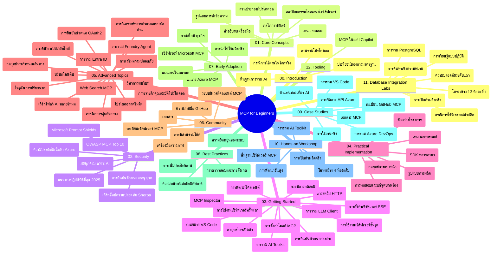

# โปรโตคอลบริบทของโมเดล (MCP) สำหรับผู้เริ่มต้น - คู่มือการศึกษา

คู่มือการศึกษานี้ให้ภาพรวมของโครงสร้างและเนื้อหาของที่เก็บสำหรับหลักสูตร "โปรโตคอลบริบทของโมเดล (MCP) สำหรับผู้เริ่มต้น" ใช้คู่มือนี้เพื่อการนำทางที่เก็บอย่างมีประสิทธิภาพและใช้ประโยชน์สูงสุดจากทรัพยากรที่มีอยู่

## ภาพรวมที่เก็บ

โปรโตคอลบริบทของโมเดล (MCP) เป็นกรอบงานมาตรฐานสำหรับการโต้ตอบระหว่างโมเดล AI และแอปพลิเคชันของลูกค้า โดยเริ่มต้นสร้างโดย Anthropic ปัจจุบัน MCP ได้รับการดูแลโดยชุมชน MCP ผ่านองค์กร GitHub ทางการ ที่เก็บนี้ให้หลักสูตรครอบคลุมพร้อมตัวอย่างโค้ดแบบลงมือปฏิบัติในภาษา C#, Java, JavaScript, Python, และ TypeScript ออกแบบมาสำหรับนักพัฒนา AI สถาปนิกระบบ และวิศวกรซอฟต์แวร์

## แผนที่หลักสูตรแบบภาพ

## โครงสร้างที่เก็บ

ที่เก็บถูกจัดระเบียบเป็นสิบสองส่วนหลัก ซึ่งแต่ละส่วนเน้นไปที่แง่มุมต่าง ๆ ของ MCP:

1. **บทนำ (00-Introduction/)**
   - ภาพรวมของโปรโตคอลบริบทของโมเดล
   - เหตุผลที่มาตรฐานมีความสำคัญในท่อ AI
   - กรณีใช้งานและประโยชน์เชิงปฏิบัติ

2. **แนวคิดหลัก (01-CoreConcepts/)**
   - สถาปัตยกรรมไคลเอนต์-เซิร์ฟเวอร์
   - ส่วนประกอบหลักของโปรโตคอล
   - รูปแบบการรับส่งข้อความใน MCP

3. **ความปลอดภัย (02-Security/)**
   - ภัยคุกคามด้านความปลอดภัยในระบบที่ใช้ MCP
   - แนวปฏิบัติที่ดีที่สุดสำหรับการรักษาความปลอดภัยของการใช้งาน
   - กลยุทธ์การตรวจสอบสิทธิ์และการอนุญาต
   - **เอกสารความปลอดภัยครบถ้วน**:
     - แนวปฏิบัติความปลอดภัย MCP 2025
     - คู่มือการใช้งาน Azure Content Safety
     - การควบคุมและเทคนิคความปลอดภัย MCP
     - เอกสารอ้างอิงแนวปฏิบัติที่ดีที่สุด MCP อย่างรวดเร็ว
   - **หัวข้อความปลอดภัยสำคัญ**:
     - การโจมตีด้วย prompt injection และการวางยาพิษเครื่องมือ
     - การแฮ็กเซสชันและปัญหาผู้ช่วยสับสน
     - จุดอ่อน token passthrough
     - สิทธิ์เกินจำเป็นและการควบคุมการเข้าถึง
     - ความปลอดภัยห่วงโซ่อุปทานสำหรับส่วนประกอบ AI
     - การผสานรวม Microsoft Prompt Shields

4. **เริ่มต้นใช้งาน (03-GettingStarted/)**
   - การตั้งค่าและการกำหนดค่าสภาพแวดล้อม
   - การสร้างเซิร์ฟเวอร์และไคลเอนต์ MCP เบื้องต้น
   - การรวมกับแอปพลิเคชันที่มีอยู่
   - รวมส่วนสำหรับ:
     - การใช้งานเซิร์ฟเวอร์ตัวแรก
     - การพัฒนาไคลเอนต์
     - การรวมไคลเอนต์ LLM
     - การผสานรวม VS Code
     - เซิร์ฟเวอร์ Server-Sent Events (SSE)
     - การใช้งานเซิร์ฟเวอร์ขั้นสูง
     - HTTP streaming
     - การรวม AI Toolkit
     - กลยุทธ์การทดสอบ
     - แนวทางการปรับใช้

5. **การใช้งานเชิงปฏิบัติ (04-PracticalImplementation/)**
   - การใช้ SDK ในหลายภาษาโปรแกรม
   - เทคนิคการดีบัก ทดสอบ และตรวจสอบความถูกต้อง
   - การออกแบบแบบแผน prompt และเวิร์กโฟลว์ที่นำกลับมาใช้ใหม่ได้
   - โครงการตัวอย่างพร้อมตัวอย่างการใช้งาน

6. **หัวข้อขั้นสูง (05-AdvancedTopics/)**
   - เทคนิควิศวกรรมบริบท
   - การรวมตัวแทน Foundry
   - เวิร์กโฟลว์ AI หลายรูปแบบ
   - ตัวอย่างการตรวจสอบสิทธิ์ OAuth2
   - ความสามารถในการค้นหาแบบเรียลไทม์
   - การสตรีมแบบเรียลไทม์
   - การใช้งานบริบทราก
   - กลยุทธ์การกำหนดเส้นทาง
   - เทคนิคการสุ่มตัวอย่าง
   - แนวทางการปรับขนาด
   - ข้อควรพิจารณาด้านความปลอดภัย
   - การผสานรวมความปลอดภัย Entra ID
   - การผสานรวมการค้นหาเว็บ
   - การโต้เถียงของ multi-agent ที่แข่งขันกัน (รูปแบบอภิปราย)

7. **การมีส่วนร่วมของชุมชน (06-CommunityContributions/)**
   - วิธีการร่วมเขียนโค้ดและเอกสาร
   - การร่วมมือผ่าน GitHub
   - การปรับปรุงและข้อเสนอแนะโดยชุมชน
   - การใช้ไคลเอนต์ MCP ต่าง ๆ (Claude Desktop, Cline, VSCode)
   - การทำงานกับ MCP เซิร์ฟเวอร์ยอดนิยมรวมถึงการสร้างภาพ

8. **บทเรียนจากการนำไปใช้เบื้องต้น (07-LessonsfromEarlyAdoption/)**
   - การใช้งานจริงและเรื่องราวความสำเร็จ
   - การสร้างและปรับใช้โซลูชันที่ใช้ MCP
   - แนวโน้มและแผนงานอนาคต
   - **คู่มือเซิร์ฟเวอร์ MCP ของ Microsoft**: คู่มือครบถ้วนสำหรับเซิร์ฟเวอร์ MCP ของ Microsoft 10 ตัวที่พร้อมใช้งานจริง รวมถึง:
     - Microsoft Learn Docs MCP Server
     - Azure MCP Server (ตัวเชื่อมต่อเฉพาะทางกว่า 15 ตัว)
     - GitHub MCP Server
     - Azure DevOps MCP Server
     - MarkItDown MCP Server
     - SQL Server MCP Server
     - Playwright MCP Server
     - Dev Box MCP Server
     - Microsoft Foundry MCP Server
     - Microsoft 365 Agents Toolkit MCP Server

9. **แนวปฏิบัติที่ดีที่สุด (08-BestPractices/)**
   - การปรับจูนและเพิ่มประสิทธิภาพ
   - การออกแบบระบบ MCP ที่ทนต่อความผิดพลาด
   - กลยุทธ์การทดสอบและความทนทาน

10. **การศึกษากรณี (09-CaseStudy/)**
    - **การศึกษากรณีครบถ้วนเจ็ดเรื่อง** แสดงความหลากหลายของ MCP ในสถานการณ์ต่าง ๆ:
    - **ตัวแทนท่องเที่ยว Azure AI**: การจัดการ multi-agent กับ Azure OpenAI และ AI Search
    - **การรวม Azure DevOps**: อัตโนมัติในการอัปเดตข้อมูล YouTube ในเวิร์กโฟลว์
    - **การดึงเอกสารแบบเรียลไทม์**: ไคลเอนต์คอนโซล Python พร้อมการสตรีม HTTP
    - **เครื่องมือสร้างแผนการศึกษาแบบโต้ตอบ**: เว็บแอป Chainlit พร้อม AI สนทนา
    - **เอกสารในตัวแก้ไข**: การผสานรวม VS Code กับเวิร์กโฟลว์ GitHub Copilot
    - **การจัดการ API ของ Azure**: การรวม API สำหรับองค์กรพร้อมการสร้าง MCP เซิร์ฟเวอร์
    - **ทะเบียน MCP ของ GitHub**: การพัฒนาระบบนิเวศและแพลตฟอร์มการรวมตัวแทน
    - ตัวอย่างการใช้งานครอบคลุมการรวมองค์กร ผลผลิตนักพัฒนา และการพัฒนาระบบนิเวศ

11. **เวิร์กช็อปแบบลงมือปฏิบัติ (10-StreamliningAIWorkflowsBuildingAnMCPServerWithAIToolkit/)**
    - เวิร์กช็อปครบถ้วนแบบลงมือปฏิบัติผสาน MCP กับ AI Toolkit
    - การสร้างแอปพลิเคชันอัจฉริยะที่เชื่อมต่อโมเดล AI กับเครื่องมือในโลกจริง
    - โมดูลปฏิบัติ ครอบคลุมพื้นฐาน การพัฒนาเซิร์ฟเวอร์แบบกำหนดเอง และกลยุทธ์ปรับใช้ในสภาพแวดล้อมจริง
    - **โครงสร้างของห้องปฏิบัติการ**:
      - ห้องปฏิบัติการ 1: พื้นฐานเซิร์ฟเวอร์ MCP
      - ห้องปฏิบัติการ 2: การพัฒนาเซิร์ฟเวอร์ MCP ขั้นสูง
      - ห้องปฏิบัติการ 3: การผสานรวม AI Toolkit
      - ห้องปฏิบัติการ 4: การปรับใช้และปรับขนาดในสภาพแวดล้อมจริง
    - การเรียนรู้ผ่านห้องปฏิบัติการพร้อมคำแนะนำทีละขั้นตอน

12. **ห้องปฏิบัติการการรวมฐานข้อมูล MCP Server (11-MCPServerHandsOnLabs/)**
    - **เส้นทางการเรียนรู้ครบ 13 ห้องปฏิบัติการ** สำหรับการสร้างเซิร์ฟเวอร์ MCP ที่พร้อมใช้งานจริงพร้อมการรวม PostgreSQL
    - **การใช้งานจริงสำหรับการวิเคราะห์ค้าปลีก** โดยใช้กรณีศึกษาการใช้งาน Zava Retail
    - **รูปแบบองค์กรระดับสูง** รวมถึงการรักษาความปลอดภัยระดับแถว (Row Level Security - RLS), การค้นหาเชิงความหมาย, และการเข้าถึงข้อมูลสำหรับ multi-tenant
    - **โครงสร้างห้องปฏิบัติการครบถ้วน**:
      - **ห้องปฏิบัติการ 00-03: พื้นฐาน** – บทนำ, สถาปัตยกรรม, ความปลอดภัย, การตั้งค่าสภาพแวดล้อม
      - **ห้องปฏิบัติการ 04-06: การสร้าง MCP Server** – การออกแบบฐานข้อมูล, การใช้งาน MCP Server, การพัฒนาเครื่องมือ
      - **ห้องปฏิบัติการ 07-09: ฟีเจอร์ขั้นสูง** – การค้นหาเชิงความหมาย, การทดสอบ & ดีบัก, การผสานรวม VS Code
      - **ห้องปฏิบัติการ 10-12: การผลิต & แนวปฏิบัติที่ดีที่สุด** – การปรับใช้, การตรวจสอบ, การเพิ่มประสิทธิภาพ
    - **เทคโนโลยีที่ครอบคลุม**: FastMCP framework, PostgreSQL, Azure OpenAI, Azure Container Apps, Application Insights
    - **ผลการเรียนรู้**: เซิร์ฟเวอร์ MCP พร้อมใช้งานจริง, รูปแบบการรวมฐานข้อมูล, การวิเคราะห์โดย AI, ความปลอดภัยองค์กร

13. **เครื่องมือต่าง ๆ (12-tooling/)**
    - เรียนรู้วิธีใช้ MCP ในแอป Copilot และเครื่องมืออื่น ๆ

## แหล่งข้อมูลเพิ่มเติม

ที่เก็บนี้มีทรัพยากรสนับสนุนดังนี้:

- **โฟลเดอร์ภาพ**: รวมภาพกราฟิกและภาพประกอบที่ใช้ทั่วหลักสูตร
- **การแปลภาษา**: รองรับหลายภาษา พร้อมการแปลเอกสารอัตโนมัติ
- **แหล่งข้อมูล MCP ทางการ**:
  - [เอกสาร MCP](https://modelcontextprotocol.io/)
  - [สเปค MCP](https://spec.modelcontextprotocol.io/)
  - [ที่เก็บ MCP บน GitHub](https://github.com/modelcontextprotocol)

## วิธีใช้ที่เก็บนี้

1. **เรียนรู้ตามลำดับ**: ติดตามบทต่าง ๆ ตามลำดับ (00 ถึง 11) เพื่อประสบการณ์การเรียนรู้ที่มีโครงสร้าง
2. **เน้นภาษาที่สนใจ**: หากสนใจภาษาโปรแกรมใดโดยเฉพาะ ให้สำรวจไดเรกทอรีตัวอย่างสำหรับการใช้งานในภาษาที่ต้องการ
3. **การใช้งานเชิงปฏิบัติ**: เริ่มจากส่วน "เริ่มต้นใช้งาน" เพื่อเตรียมสภาพแวดล้อมและสร้าง MCP เซิร์ฟเวอร์และไคลเอนต์ตัวแรกของคุณ
4. **สำรวจหัวข้อขั้นสูง**: เมื่อคุ้นเคยกับพื้นฐานแล้ว ให้เข้าไปศึกษาหัวข้อขั้นสูงเพื่อขยายความรู้
5. **มีส่วนร่วมกับชุมชน**: เข้าร่วมชุมชน MCP ผ่านการสนทนา GitHub และช่องทาง Discord เพื่อเชื่อมต่อกับผู้เชี่ยวชาญและนักพัฒนาร่วมกัน

## ไคลเอนต์และเครื่องมือ MCP

หลักสูตรครอบคลุมไคลเอนต์และเครื่องมือ MCP หลากหลาย:

1. **ไคลเอนต์ทางการ**:
   - Visual Studio Code 
   - MCP ใน Visual Studio Code
   - Claude Desktop
   - Claude ใน VSCode 
   - Claude API

2. **ไคลเอนต์จากชุมชน**:
   - Cline (แบบเทอร์มินัล)
   - Cursor (ตัวแก้ไขโค้ด)
   - ChatMCP
   - Windsurf

3. **เครื่องมือจัดการ MCP**:
   - MCP CLI
   - MCP Manager
   - MCP Linker
   - MCP Router

## MCP เซิร์ฟเวอร์ยอดนิยม

ที่เก็บแนะนำเซิร์ฟเวอร์ MCP ต่าง ๆ รวมถึง:

1. **เซิร์ฟเวอร์ MCP ทางการของ Microsoft**:
   - Microsoft Learn Docs MCP Server
   - Azure MCP Server (ตัวเชื่อมต่อเฉพาะทางกว่า 15 ตัว)
   - GitHub MCP Server
   - Azure DevOps MCP Server
   - MarkItDown MCP Server
   - SQL Server MCP Server
   - Playwright MCP Server
   - Dev Box MCP Server
   - Microsoft Foundry MCP Server
   - Microsoft 365 Agents Toolkit MCP Server

2. **เซิร์ฟเวอร์อ้างอิงทางการ**:
   - Filesystem
   - Fetch
   - Memory
   - Sequential Thinking

3. **การสร้างภาพ**:
   - Azure OpenAI DALL-E 3
   - Stable Diffusion WebUI
   - Replicate

4. **เครื่องมือพัฒนา**:
   - Git MCP
   - Terminal Control
   - Code Assistant

5. **เซิร์ฟเวอร์เฉพาะทาง**:
   - Salesforce
   - Microsoft Teams
   - Jira & Confluence

## การมีส่วนร่วม

ที่เก็บนี้ยินดีต้อนรับการมีส่วนร่วมจากชุมชน ดูส่วน การมีส่วนร่วมของชุมชน สำหรับคำแนะนำเกี่ยวกับการร่วมพัฒนาอย่างมีประสิทธิภาพในระบบนิเวศ MCP

----

*คู่มือการศึกษานี้ได้รับการอัปเดตครั้งล่าสุดเมื่อวันที่ 5 กุมภาพันธ์ 2026 สะท้อนสเปค MCP 2025-11-25 ล่าสุด และให้ภาพรวมของที่เก็บ ณ วันที่นั้น เนื้อหาในที่เก็บอาจมีการอัปเดตหลังจากวันดังกล่าว*

---

<!-- CO-OP TRANSLATOR DISCLAIMER START -->
**ปฏิเสธความรับผิดชอบ**:
เอกสารนี้ได้รับการแปลโดยใช้บริการแปลภาษา AI [Co-op Translator](https://github.com/Azure/co-op-translator) ขณะที่เราพยายามให้ความถูกต้อง โปรดทราบว่าการแปลโดยอัตโนมัติอาจมีข้อผิดพลาดหรือความไม่ถูกต้อง เอกสารต้นฉบับในภาษาต้นทางควรถูกพิจารณาเป็นแหล่งข้อมูลที่เชื่อถือได้ สำหรับข้อมูลที่สำคัญ แนะนำให้ใช้การแปลโดยมนุษย์มืออาชีพ เราไม่รับผิดชอบต่อความเข้าใจผิดหรือการตีความที่ผิดพลาดที่เกิดขึ้นจากการใช้การแปลนี้
<!-- CO-OP TRANSLATOR DISCLAIMER END -->