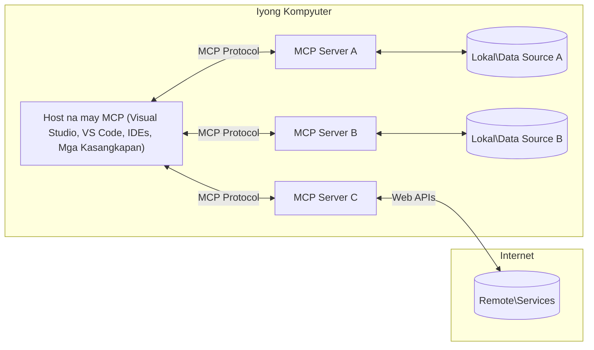

# Mga Pangunahing Konsepto ng MCP Core: Pagsasanay sa Model Context Protocol para sa Integrasyon ng AI

[](https://youtu.be/earDzWGtE84)

_(I-click ang larawan sa itaas upang panoorin ang video ng araling ito)_

Ang [Model Context Protocol (MCP)](https://github.com/modelcontextprotocol) ay isang makapangyarihan, standardized na framework na nag-o-optimize ng komunikasyon sa pagitan ng Malalaking Language Model (LLMs) at mga panlabas na kasangkapan, aplikasyon, at mga pinagkukunan ng datos.  
Ang gabay na ito ay magbibigay-daan sa iyo upang maunawaan ang mga pangunahing konsepto ng MCP. Matututuhan mo ang tungkol sa client-server architecture nito, mahahalagang bahagi, mekanismo ng komunikasyon, at mga pinakamahusay na kasanayan sa pagpapatupad.

- **Tahasang Pahintulot ng Gumagamit**: Ang lahat ng pag-access sa datos at mga operasyon ay nangangailangan ng tahasang pahintulot ng gumagamit bago isagawa. Dapat malinaw na maunawaan ng mga gumagamit kung anong datos ang aaksesin at anong mga aksyon ang gagawin, na may detalyadong kontrol sa mga permiso at awtorisasyon.

- **Proteksyon sa Privacy ng Datos**: Ang datos ng gumagamit ay ipinapakita lamang sa tahasang pahintulot at dapat protektahan ng matibay na mga kontrol sa pag-access sa buong lifecycle ng interaksyon. Dapat pigilan ng mga implementasyon ang hindi awtorisadong pagpapadala ng datos at panatilihin ang mahigpit na mga hangganan sa privacy.

- **Kaligtasan sa Pagpapatakbo ng Mga Kasangkapan**: Bawat pagtawag sa kasangkapan ay nangangailangan ng tahasang pahintulot ng gumagamit na may malinaw na pag-unawa sa functionality ng kasangkapan, mga parameter, at posibleng epekto. Dapat tiyakin ng matibay na mga hangganan sa seguridad na mapipigilan ang di-sinasadyang, hindi ligtas, o malisyosong pagpapatakbo ng mga kasangkapan.

- **Seguridad ng Transport Layer**: Lahat ng channel ng komunikasyon ay dapat gumamit ng angkop na encryption at mekanismo ng pag-authenticate. Ang mga remote na koneksyon ay dapat mag-implementa ng ligtas na transport protocols at wastong pamamahala ng kredensyal.

#### Mga Patnubay sa Pagpapatupad:

- **Pamamahala ng Pahintulot**: Magpatupad ng mas pinong sistema ng pahintulot na nagpapahintulot sa mga gumagamit na kontrolin kung aling mga server, kasangkapan, at mga mapagkukunan ang maa-access  
- **Pag-authenticate at Awtorisasyon**: Gamitin ang ligtas na mga paraan ng pag-authenticate (OAuth, API key) na may wastong pamamahala ng token at expiration  
- **Pag-validate ng Input**: I-validate ang lahat ng parameter at input ng datos ayon sa itinakdang mga schema upang maiwasan ang injection attacks  
- **Audit Logging**: Panatilihin ang komprehensibong mga talaan ng lahat ng operasyon para sa seguridad at pagsunod

## Pangkalahatang-ideya

Sa araling ito, susuriin natin ang pundamental na arkitektura at mga bahagi na bumubuo sa Model Context Protocol (MCP) ecosystem. Malalaman mo ang tungkol sa client-server architecture, mga pangunahing bahagi, at mga mekanismo ng komunikasyon na nagpapaandar sa mga interaksyon ng MCP.

## Mga Pangunahing Layunin ng Pag-aaral

Sa pagtatapos ng araling ito, ikaw ay:

- Maiintindihan ang MCP client-server architecture.  
- Makikilala ang mga papel at responsibilidad ng Hosts, Clients, at Servers.  
- Masusuri ang mga pangunahing katangian na nagpapaluwag sa MCP bilang isang layer ng integrasyon.  
- Malalaman kung paano dumadaloy ang impormasyon sa loob ng MCP ecosystem.  
- Makakakuha ng praktikal na kaalaman sa pamamagitan ng mga halimbawa ng code sa .NET, Java, Python, at JavaScript.

## MCP Architecture: Mas Malalim na Pagsilip

Ang MCP ecosystem ay nakabase sa client-server model. Ang modular na istrukturang ito ay nagpapahintulot sa mga AI application na makipag-ugnayan sa mga kasangkapan, database, API, at mga kontekstwal na mapagkukunan ng datos nang epektibo. Hatiin natin ang arkitekturang ito sa mga pangunahing bahagi nito.

Sa pinakapuso nito, sumusunod ang MCP sa isang client-server architecture kung saan ang isang host application ay maaaring kumonekta sa maraming server:


- **MCP Hosts**: Mga program tulad ng VSCode, Claude Desktop, IDEs, o mga AI tools na nais ma-access ang datos sa pamamagitan ng MCP  
- **MCP Clients**: Mga protocol client na nagpapanatili ng 1:1 na koneksyon sa mga server  
- **MCP Servers**: Mga magagaan na programa na bawat isa ay naglalantad ng tiyak na kakayahan sa pamamagitan ng standardized na Model Context Protocol  
- **Local Data Sources**: Mga file, database, at serbisyo sa iyong computer na maaaring ma-access nang ligtas ng mga MCP server  
- **Remote Services**: Mga panlabas na sistema na available sa internet na maaaring konektahan ng mga MCP server sa pamamagitan ng mga API.

Ang MCP Protocol ay isang umuunlad na pamantayan na gumagamit ng date-based versioning (format na YYYY-MM-DD). Ang kasalukuyang bersyon ng protocol ay **2025-11-25**. Maaari mong makita ang pinakabagong mga update sa [protocol specification](https://modelcontextprotocol.io/specification/2025-11-25/)  

### 1. Hosts

Sa Model Context Protocol (MCP), ang **Hosts** ay mga AI application na nagsisilbing pangunahing interface kung saan nakikipag-ugnayan ang mga gumagamit sa protocol. Ang mga Hosts ay namamahala at nagko-coordinate ng mga koneksyon sa maraming MCP server sa pamamagitan ng paglikha ng mga dedikadong MCP client para sa bawat koneksyon ng server. Halimbawa ng mga Hosts ay:

- **AI Applications**: Claude Desktop, Visual Studio Code, Claude Code  
- **Development Environments**: IDEs at mga code editor na may integrasyon ng MCP  
- **Custom Applications**: Mga espesyal na AI agent at kasangkapan na ginawa para sa partikular na layunin  

Ang **Hosts** ay mga aplikasyong nagko-coordinate ng interaksyon ng AI model. Sila ay:

- **Nag-o-orchestrate ng AI Models**: Nagpapagana o nakikipag-ugnayan sa mga LLM upang bumuo ng mga tugon at mag-coordinate ng mga AI workflow  
- **Namamahala ng Client Connections**: Lumilikha at nagpapanatili ng isang MCP client para sa bawat MCP server connection  
- **Kinokontrol ang User Interface**: Pinangangasiwaan ang daloy ng usapan, interaksyon ng gumagamit, at presentasyon ng tugon  
- **Nagpapatupad ng Seguridad**: Kinokontrol ang mga permiso, mga security constraint, at pag-authenticate  
- **Pinangangasiwaan ang Pahintulot ng Gumagamit**: Namamahala ng pag-apruba ng gumagamit para sa pagbabahagi ng datos at pagpapatakbo ng mga kasangkapan

### 2. Clients

Ang **Clients** ay mahahalagang bahagi na nagpapanatili ng dedikadong one-to-one na koneksyon sa pagitan ng Hosts at MCP server. Bawat MCP client ay inilulunsad ng Host para kumonekta sa isang partikular na MCP server, na nagsisiguro ng organisado at ligtas na mga channel ng komunikasyon. Maraming client ang nagpapahintulot sa mga Host na kumonekta sa maraming server nang sabay-sabay.

Ang **Clients** ay mga connector na bahagi sa loob ng host application. Sila ay:

- **Protocol Communication**: Nagsusumite ng JSON-RPC 2.0 requests sa mga server kasama ang mga prompt at mga instruksyon  
- **Capability Negotiation**: Nakikipag-negosasyon ng mga suportadong feature at bersyon ng protocol sa mga server sa panahon ng inisyal na pagsisimula  
- **Tool Execution**: Pinamamahalaan ang mga kahilingan sa pagpapatakbo ng mga kasangkapan mula sa mga modelo at pinoproseso ang mga tugon  
- **Real-time Updates**: Pinangangasiwaan ang mga abiso at real-time updates mula sa mga server  
- **Response Processing**: Pinoproseso at inaayos ang mga tugon ng server para ipakita sa mga gumagamit  

### 3. Servers

Ang **Servers** ay mga programa na nagbibigay ng konteksto, mga kasangkapan, at mga kakayahan sa mga MCP client. Maaari silang patakbuhin nang lokal (sa parehong makina ng Host) o remote (sa panlabas na mga platform), at sila ang responsable sa paghawak ng mga kahilingan ng client at pagbibigay ng nakaayos na mga tugon. Naglalantad ang mga server ng tiyak na functionality sa pamamagitan ng standardized na Model Context Protocol.

Ang **Servers** ay mga serbisyo na nagbibigay ng konteksto at mga kakayahan. Sila ay:

- **Feature Registration**: Nagre-register at naglalantad ng mga available na primitives (resources, prompts, kasangkapan) sa mga client  
- **Request Processing**: Tumatanggap at nagpapatupad ng mga tawag sa kasangkapan, kahilingan sa resources, at prompt mula sa mga client  
- **Context Provision**: Nagbibigay ng kontekstwal na impormasyon at datos upang mapabuti ang tugon ng modelo  
- **State Management**: Pinangangasiwaan ang estado ng session at mga stateful na interaksyon kung kinakailangan  
- **Real-time Notifications**: Nagpapadala ng mga abiso tungkol sa mga pagbabago sa kakayahan at update sa mga nakakonektang client  

Maaaring buuin ang mga server ng kahit sino upang palawakin ang kakayahan ng modelo gamit ang espesyal na functionality, at sinusuportahan nila ang parehong lokal at remote na mga deployment scenario.

### 4. Server Primitives

Nagbibigay ang mga server sa Model Context Protocol (MCP) ng tatlong pangunahing **primitives** na naglalarawan sa mga pundamental na bloke para sa masaganang interaksyon sa pagitan ng mga client, host, at mga language model. Itong mga primitives ay tumutukoy sa mga uri ng kontekstwal na impormasyon at aksyon na available sa pamamagitan ng protocol.

Maaaring ilantad ng mga MCP server ang kahit anong kumbinasyon ng sumusunod na tatlong pangunahing primitives:

#### Mga Resources

Ang **Resources** ay mga pinagkukunan ng datos na nagbibigay ng kontekstwal na impormasyon sa mga AI application. Kinakatawan nila ang static o dynamic na nilalaman na makatutulong sa pag-unawa at paggawa ng desisyon ng modelo:

- **Contextual Data**: Nakaayos na impormasyon at konteksto para sa pagkonsumo ng AI model  
- **Knowledge Bases**: Mga repositoryo ng dokumento, artikulo, manwal, at mga pananaliksik  
- **Local Data Sources**: Mga file, database, at lokal na impormasyon ng sistema  
- **External Data**: Mga tugon mula sa API, web services, at remote na datos ng sistema  
- **Dynamic Content**: Real-time na datos na nagbabago batay sa panlabas na kalagayan  

Nakikilala ang mga resources gamit ang mga URI at sinusuportahan ang discovery sa pamamagitan ng `resources/list` at retrieval gamit ang `resources/read` na mga metodo:

```text
file://documents/project-spec.md
database://production/users/schema
api://weather/current
```
  
#### Mga Prompts

Ang **Prompts** ay mga reusable na template na tumutulong sa pag-istruktura ng interaksyon sa mga language model. Nagbibigay sila ng standardized na pattern ng interaksyon at microsoft na workflows:

- **Template-based Interactions**: Mga paunang naka-istrukturang mensahe at panimula ng pag-uusap  
- **Workflow Templates**: Standardized na sekwensiya para sa mga karaniwang gawain at interaksyon  
- **Few-shot Examples**: Template na batay sa mga halimbawa para sa pagtuturo sa modelo  
- **System Prompts**: Pundamental na mga prompt na nagtatakda ng ugali at konteksto ng modelo  
- **Dynamic Templates**: Mga parameterized na prompt na umaangkop sa partikular na mga konteksto  

Sinusuportahan ng prompts ang variable substitution at maaaring madiskubre sa `prompts/list` at makuha gamit ang `prompts/get`:

```markdown
Generate a {{task_type}} for {{product}} targeting {{audience}} with the following requirements: {{requirements}}
```
  
#### Mga Tools

Ang **Tools** ay mga executable na function na pwedeng tawagin ng mga AI model upang magsagawa ng partikular na aksyon. Kinakatawan nila ang mga "pandiwa" ng MCP ecosystem, na nagpapahintulot sa mga modelo na makipag-ugnayan sa mga panlabas na sistema:

- **Executable Functions**: Mga diskitong operasyon na maaaring tawagin ng mga modelo gamit ang tiyak na mga parameter  
- **External System Integration**: Tawag sa API, mga query sa database, operasyon sa file, kalkulasyon  
- **Natanging Identidad**: Bawat kasangkapan ay may natatanging pangalan, deskripsyon, at schema ng parametro  
- **Structured I/O**: Tumatanggap ang mga tool ng validated na parameter at nagbabalik ng nakaayos at naka-type na tugon  
- **Action Capabilities**: Nagpapahintulot sa mga modelo na magsagawa ng mga real-world na aksyon at kumuha ng live na datos  

Ang mga tool ay dine-define gamit ang JSON Schema para sa pag-validate ng parametro at madidiskubre sa pamamagitan ng `tools/list` at mapapatakbo gamit ang `tools/call`. Maari ding maglaman ng **icons** ang mga tool bilang dagdag na metadata para sa mas magandang presentasyon sa UI.

**Annotations ng Tool**: Sinusuportahan ng mga tool ang mga behavioral annotation (hal., `readOnlyHint`, `destructiveHint`) na naglalarawan kung ang kasangkapan ay pangbasa lamang o mapanira, na tumutulong sa mga client na gumawa ng matalinong desisyon tungkol sa pagpapatakbo ng kasangkapan.

Halimbawa ng depinisyon ng tool:

```typescript
server.tool(
  "search_products", 
  {
    query: z.string().describe("Search query for products"),
    category: z.string().optional().describe("Product category filter"),
    max_results: z.number().default(10).describe("Maximum results to return")
  }, 
  async (params) => {
    // Isagawa ang paghahanap at ibalik ang nakaayos na mga resulta
    return await productService.search(params);
  }
);
```
  
## Client Primitives

Sa Model Context Protocol (MCP), ang mga **client** ay maaaring maglantad ng primitives na nagpapahintulot sa mga server na humiling ng dagdag na kakayahan mula sa host application. Ang mga client-side na primitives na ito ay nagpapayaman ng mga implementation ng server na mas interactive at maaaring ma-access ang mga kakayahan ng AI model at interaksyon ng gumagamit.

### Sampling

Pinapahintulutan ng **Sampling** ang mga server na humiling ng mga completion mula sa language model ng AI application ng client. Ang primitive na ito ay nagpapahintulot sa mga server na ma-access ang kakayahan ng LLM nang hindi kinakailangang ipaloob ang sarili nilang model dependencies:

- **Model-Independent Access**: Maaari humiling ang mga server ng completion nang hindi kailangan ng LLM SDK o pamamahala ng pag-access sa modelo  
- **Server-Initiated AI**: Pinapahintulutan ang mga server na autonomously gumawa ng nilalaman gamit ang AI model ng client  
- **Recursive LLM Interactions**: Sinusuportahan ang kumplikadong mga senaryo kung saan kailangan ng server ang tulong ng AI para sa pagproseso  
- **Dynamic Content Generation**: Pinapahintulutan ang mga server na gumawa ng kontekstwal na tugon gamit ang modelo ng host  
- **Tool Calling Support**: Maaaring isama ng mga server ang `tools` at `toolChoice` na mga parametro upang pahintulutan ang modelo ng client na tumawag sa mga kasangkapan habang nagsasampling  

Sisimulan ang sampling sa pamamagitan ng metodo ng `sampling/complete`, kung saan nagpapadala ang mga server ng completion requests sa mga client.

### Mga Ugat (Roots)

Nagbibigay ang **Roots** ng standardized na paraan para ang mga client ay maipakita ang mga hangganan ng filesystem sa mga server, na tumutulong sa mga server na maunawaan kung aling mga directory at file ang may access sila:

- **Filesystem Boundaries**: Itinakda ang mga hangganan kung saan maaaring kumilos ang mga server sa filesystem  
- **Control ng Access**: Tumutulong sa mga server na maunawaan kung aling mga direktoryo at file ang may pahintulot silang ma-access  
- **Dynamic Updates**: Maaaring ipaalam ng mga client sa mga server kapag nagbago ang listahan ng roots  
- **URI-Based Identification**: Gumagamit ng mga URI na `file://` para tukuyin ang mga naa-access na direktoryo at file  

Madiskubre ang mga roots sa pamamagitan ng metodo ng `roots/list`, at nagpapadala ang client ng `notifications/roots/list_changed` kapag nagbago ang mga roots.

### Elicitation

Pinapahintulutan ng **Elicitation** ang mga server na humiling ng dagdag na impormasyon o kumpirmasyon mula sa mga gumagamit sa pamamagitan ng interface ng client:

- **User Input Requests**: Pwedeng humiling ang mga server ng dagdag na impormasyon kung kinakailangan para sa pagpapatakbo ng tool  
- **Confirmation Dialogs**: Humihingi ng pahintulot ng gumagamit para sa sensitibo o may malaking epekto na operasyon  
- **Interactive Workflows**: Pinapahintulutan ang mga server na lumikha ng sunod-sunod na interaksyon sa gumagamit  
- **Dynamic Parameter Collection**: Nangongolekta ng nawawala o opsyonal na mga parametro habang nagpapatakbo ng tool  

Ginagawa ang mga elicitation request gamit ang metodo ng `elicitation/request` upang makalikom ng input ng gumagamit sa interface ng client.

**URL Mode Elicitation**: Maaari ring humiling ang mga server ng user interaction gamit ang URL, na nagpapahintulot sa mga server na idirekta ang mga gumagamit sa panlabas na web page para sa authentication, kumpirmasyon, o pagpasok ng datos.

### Logging

Pinapahintulutan ng **Logging** ang mga server na magpadala ng nakaayos na mga log message sa mga client para sa debugging, monitoring, at operational visibility:

- **Debugging Support**: Pinapahintulutan ang mga server na magbigay ng detalyadong mga log ng pagpapatupad para sa troubleshooting  
- **Operational Monitoring**: Nagpapadala ng mga update sa status at metric sa performance sa mga client  
- **Error Reporting**: Nagbibigay ng detalyadong konteksto ng error at diagnostic na impormasyon  
- **Audit Trails**: Lumilikha ng komprehensibong tala ng mga operasyon at desisyon ng server  

Ang mga logging message ay ipinapadala sa mga client upang magbigay ng transparency sa operasyon ng server at makatulong sa debugging.

## Daloy ng Impormasyon sa MCP

Itinatakda ng Model Context Protocol (MCP) ang isang nakaayos na daloy ng impormasyon sa pagitan ng mga host, client, server, at mga modelo. Ang pag-unawa sa daloy na ito ay tumutulong upang linawin kung paano pinoproseso ang mga kahilingan ng gumagamit at kung paano pinagsasama ang mga panlabas na kasangkapan at datos sa mga tugon ng modelo.
- **Nagsisimula ang Host ng Koneksyon**  
  Ang host application (tulad ng isang IDE o chat interface) ay nagtatatag ng koneksyon sa isang MCP server, karaniwang sa pamamagitan ng STDIO, WebSocket, o ibang suportadong transport.

- **Pagsasaayos ng Kakayahan**  
  Nagpapalitan ng impormasyon ang kliyente (nakapaloob sa host) at ang server tungkol sa kanilang mga sinusuportahang tampok, tools, resources, at mga bersyon ng protocol. Tinitiyak nito na parehong naintindihan ng dalawang panig kung anong mga kakayahan ang magagamit para sa session.

- **Request ng User**  
  Nakikipag-ugnayan ang user sa host (hal., naglalagay ng prompt o command). Kinokolekta ng host ang input na ito at ipinapasa ito sa kliyente para sa pagproseso.

- **Paggamit ng Resource o Tool**  
  - Maaaring humiling ang kliyente ng karagdagang konteksto o resources mula sa server (tulad ng mga file, database entries, o knowledge base articles) upang mapayaman ang pag-unawa ng modelo.
  - Kung natukoy ng modelo na kailangan ang isang tool (hal., para kumuha ng data, magsagawa ng kalkulasyon, o tumawag ng API), nagpapadala ang kliyente ng tool invocation request sa server, na tinutukoy ang pangalan at mga parametro ng tool.

- **Pagpapatupad ng Server**  
  Tinatanggap ng server ang kahilingan para sa resource o tool, isinasagawa ang kinakailangang operasyon (tulad ng pagpapatakbo ng function, pagtatanong sa database, o pagkuha ng file), at ibinabalik ang mga resulta sa kliyente sa isang strukturadong porma.

- **Pagbuo ng Tugon**  
  Pinagsasama ng kliyente ang mga tugon mula sa server (data ng resource, output ng tool, atbp.) sa patuloy na pakikipag-ugnayan ng modelo. Ginagamit ng modelo ang impormasyong ito upang makabuo ng komprehensibo at kontekstwal na tugon.

- **Pagpapakita ng Resulta**  
  Natatanggap ng host ang panghuling output mula sa kliyente at ipinapakita ito sa user, kadalasan ay kabilang ang parehong teksto na nilikha ng modelo at anumang resulta mula sa pagpapatupad ng tool o pagkuha ng resource.

Pinapagana ng daloy na ito ang MCP upang suportahan ang mga advanced, interaktibo, at kontekstwal na AI application sa pamamagitan ng walang patid na pagkonekta ng mga modelo sa mga panlabas na tools at pinanggagalingan ng data.

## Arkitektura ng Protocol at Mga Layer

Binubuo ang MCP ng dalawang natatanging arkitektural na layer na nagtutulungan upang magbigay ng kumpletong framework para sa komunikasyon:

### Data Layer

Ang **Data Layer** ay nagpapatupad sa pangunahing MCP protocol gamit ang **JSON-RPC 2.0** bilang pundasyon nito. Tinukoy ng layer na ito ang istruktura ng mensahe, semantika, at mga pattern ng pakikipag-ugnayan:

#### Pangunahing Komponent:

- **JSON-RPC 2.0 Protocol**: Lahat ng komunikasyon ay gumagamit ng standardized JSON-RPC 2.0 message format para sa mga tawag na method, mga tugon, at mga notification
- **Pamamahala ng Lifecycle**: Humahawak sa pagsisimula ng koneksyon, pagsasaayos ng kakayahan, at pagtatapos ng session sa pagitan ng mga kliyente at server
- **Server Primitives**: Nagbibigay-daan sa mga server na maghatid ng pangunahing functionality sa pamamagitan ng mga tools, resources, at prompts
- **Client Primitives**: Nagbibigay-daan sa mga server na humiling ng sampling mula sa LLMs, magtanong ng input mula sa user, at magpadala ng mga mensahe ng log
- **Real-time Notifications**: Sumusuporta sa mga asynchronous na notification para sa mga dynamic update nang walang polling

#### Pangunahing Tampok:

- **Pakikipag-ayos ng Bersyon ng Protocol**: Gumagamit ng date-based na versioning (YYYY-MM-DD) para matiyak ang compatibility
- **Pagdiskubre ng Kakayahan**: Nagpapalitan ng impormasyon ang mga kliyente at server tungkol sa mga sinusuportahang tampok sa panahon ng pagsisimula
- **Stateful Sessions**: Pinananatili ang estado ng koneksyon sa maraming pakikipag-ugnayan para sa patuloy na konteksto

### Transport Layer

Ang **Transport Layer** ang naghahandle ng mga communication channel, pag-frame ng mensahe, at authentication sa pagitan ng mga kalahok sa MCP:

#### Mga Suportadong Mekanismo ng Transport:

1. **STDIO Transport**:
   - Gumagamit ng standard input/output streams para sa direktang komunikasyon ng proseso
   - Pinakamainam para sa mga lokal na proseso sa parehong makina na walang overhead ng network
   - Karaniwang ginagamit para sa mga lokal na implementasyon ng MCP server

2. **Streamable HTTP Transport**:
   - Gumagamit ng HTTP POST para sa mga mensahe mula kliyente papuntang server  
   - Opsyonal na Server-Sent Events (SSE) para sa pag-stream mula server papuntang kliyente
   - Nagpapagana ng komunikasyon sa malalayong server sa iba't ibang network
   - Sumusuporta sa standard HTTP authentication (bearer tokens, API keys, custom headers)
   - Inirerekomenda ng MCP ang OAuth para sa secure na token-based authentication

#### Abstraksyon ng Transport:

Inaalis ng transport layer ang detalye ng komunikasyon mula sa data layer, kaya parehong JSON-RPC 2.0 message format ang ginagamit sa lahat ng mekanismo ng transport. Pinapayagan ng abstraksyong ito ang mga aplikasyon na madaling magpalit sa pagitan ng lokal at remote na server.

### Mga Pagsasaalang-alang sa Seguridad

Dapat sumunod ang mga implementasyon ng MCP sa ilang kritikal na prinsipyo ng seguridad upang matiyak ang ligtas, mapagkakatiwalaan, at secure na interaksyon sa lahat ng operasyon ng protocol:

- **Pahintulot at Kontrol ng User**: Dapat magbigay ng tahasang pahintulot ang mga user bago ma-access ang anumang data o maisagawa ang anumang operasyon. Dapat may malinaw na kontrol ang user kung ano ang ibabahagi nilang data at kung aling mga aksyon ang pinapayagan, na sinusuportahan ng mga madaling gamitin na interface para sa pagsusuri at pag-apruba ng mga aktibidad.

- **Pribasiya ng Data**: Ang data ng user ay dapat ilantad lamang sa pahintulot ng user at dapat protektahan gamit ang angkop na access control. Dapat panatilihin ng mga implementasyon ng MCP ang seguridad laban sa hindi awtorisadong paglipat ng data at matiyak ang pagkapribado sa lahat ng interaksyon.

- **Kaligtasan ng Tool**: Bago tumawag ng anumang tool, kinakailangan ang tahasang pahintulot ng user. Dapat malinaw sa mga user ang functionality ng bawat tool, at kailangang ipatupad ang mahigpit na hangganan ng seguridad upang maiwasan ang hindi inaasahan o delikadong paggamit ng tool.

Sa pagsunod sa mga prinsipyo ng seguridad na ito, pinananatili ng MCP ang tiwala ng user, pribasiya, at kaligtasan sa lahat ng pakikipag-ugnayan ng protocol habang pinapagana ang makapangyarihang integrasyon ng AI.

## Mga Halimbawang Code: Pangunahing Komponent

Narito ang mga halimbawa ng code sa ilang kilalang programming languages na nagpapakita kung paano ipatupad ang pangunahing MCP server components at mga tools.

### Halimbawa sa .NET: Paglikha ng Simpleng MCP Server gamit ang Mga Tools

Narito ang praktikal na halimbawa ng .NET code na nagpapakita kung paano gumawa ng simpleng MCP server na may custom tools. Ipinapakita ng halimbawang ito kung paano magdefine at magrehistro ng mga tools, humawak ng mga request, at ikonekta ang server gamit ang Model Context Protocol.

```csharp
using System;
using System.Threading.Tasks;
using ModelContextProtocol.Server;
using ModelContextProtocol.Server.Transport;
using ModelContextProtocol.Server.Tools;

public class WeatherServer
{
    public static async Task Main(string[] args)
    {
        // Create an MCP server
        var server = new McpServer(
            name: "Weather MCP Server",
            version: "1.0.0"
        );
        
        // Register our custom weather tool
        server.AddTool<string, WeatherData>("weatherTool", 
            description: "Gets current weather for a location",
            execute: async (location) => {
                // Call weather API (simplified)
                var weatherData = await GetWeatherDataAsync(location);
                return weatherData;
            });
        
        // Connect the server using stdio transport
        var transport = new StdioServerTransport();
        await server.ConnectAsync(transport);
        
        Console.WriteLine("Weather MCP Server started");
        
        // Keep the server running until process is terminated
        await Task.Delay(-1);
    }
    
    private static async Task<WeatherData> GetWeatherDataAsync(string location)
    {
        // This would normally call a weather API
        // Simplified for demonstration
        await Task.Delay(100); // Simulate API call
        return new WeatherData { 
            Temperature = 72.5,
            Conditions = "Sunny",
            Location = location
        };
    }
}

public class WeatherData
{
    public double Temperature { get; set; }
    public string Conditions { get; set; }
    public string Location { get; set; }
}
```

### Halimbawa sa Java: MCP Server Components

Ipinapakita ng halimbawang ito ang parehong MCP server at pagpaparehistro ng mga tool tulad ng halimbawa sa .NET, ngunit ipinatupad sa Java.

```java
import io.modelcontextprotocol.server.McpServer;
import io.modelcontextprotocol.server.McpToolDefinition;
import io.modelcontextprotocol.server.transport.StdioServerTransport;
import io.modelcontextprotocol.server.tool.ToolExecutionContext;
import io.modelcontextprotocol.server.tool.ToolResponse;

public class WeatherMcpServer {
    public static void main(String[] args) throws Exception {
        // Gumawa ng isang MCP server
        McpServer server = McpServer.builder()
            .name("Weather MCP Server")
            .version("1.0.0")
            .build();
            
        // Magrehistro ng isang kasangkapan sa panahon
        server.registerTool(McpToolDefinition.builder("weatherTool")
            .description("Gets current weather for a location")
            .parameter("location", String.class)
            .execute((ToolExecutionContext ctx) -> {
                String location = ctx.getParameter("location", String.class);
                
                // Kumuha ng datos ng panahon (pinadali)
                WeatherData data = getWeatherData(location);
                
                // Ibalik ang naka-format na tugon
                return ToolResponse.content(
                    String.format("Temperature: %.1f°F, Conditions: %s, Location: %s", 
                    data.getTemperature(), 
                    data.getConditions(), 
                    data.getLocation())
                );
            })
            .build());
        
        // Ikonekta ang server gamit ang stdio transport
        try (StdioServerTransport transport = new StdioServerTransport()) {
            server.connect(transport);
            System.out.println("Weather MCP Server started");
            // Panatilihing tumatakbo ang server hanggang matigil ang proseso
            Thread.currentThread().join();
        }
    }
    
    private static WeatherData getWeatherData(String location) {
        // Ang pagpapatupad ay tatawag sa isang weather API
        // Pinadali para sa layunin ng halimbawa
        return new WeatherData(72.5, "Sunny", location);
    }
}

class WeatherData {
    private double temperature;
    private String conditions;
    private String location;
    
    public WeatherData(double temperature, String conditions, String location) {
        this.temperature = temperature;
        this.conditions = conditions;
        this.location = location;
    }
    
    public double getTemperature() {
        return temperature;
    }
    
    public String getConditions() {
        return conditions;
    }
    
    public String getLocation() {
        return location;
    }
}
```

### Halimbawa sa Python: Paggawa ng MCP Server

Gumagamit ang halimbawang ito ng fastmcp, kaya siguraduhing mai-install mo muna ito:

```python
pip install fastmcp
```
Code Sample:

```python
#!/usr/bin/env python3
import asyncio
from fastmcp import FastMCP
from fastmcp.transports.stdio import serve_stdio

# Gumawa ng FastMCP server
mcp = FastMCP(
    name="Weather MCP Server",
    version="1.0.0"
)

@mcp.tool()
def get_weather(location: str) -> dict:
    """Gets current weather for a location."""
    return {
        "temperature": 72.5,
        "conditions": "Sunny",
        "location": location
    }

# Alternatibong paraan gamit ang isang klase
class WeatherTools:
    @mcp.tool()
    def forecast(self, location: str, days: int = 1) -> dict:
        """Gets weather forecast for a location for the specified number of days."""
        return {
            "location": location,
            "forecast": [
                {"day": i+1, "temperature": 70 + i, "conditions": "Partly Cloudy"}
                for i in range(days)
            ]
        }

# Irehistro ang mga tool ng klase
weather_tools = WeatherTools()

# Simulan ang server
if __name__ == "__main__":
    asyncio.run(serve_stdio(mcp))
```

### Halimbawa sa JavaScript: Paglikha ng MCP Server

Ipinapakita ng halimbawang ito ang paggawa ng MCP server sa JavaScript at kung paano magrehistro ng dalawang tool na may kaugnayan sa panahon.

```javascript
// Paggamit ng opisyal na Model Context Protocol SDK
import { McpServer } from "@modelcontextprotocol/sdk/server/mcp.js";
import { StdioServerTransport } from "@modelcontextprotocol/sdk/server/stdio.js";
import { z } from "zod"; // Para sa pagpapatunay ng parameter

// Gumawa ng isang MCP server
const server = new McpServer({
  name: "Weather MCP Server",
  version: "1.0.0"
});

// Tukuyin ang isang tool sa panahon
server.tool(
  "weatherTool",
  {
    location: z.string().describe("The location to get weather for")
  },
  async ({ location }) => {
    // Karaniwang tatawag ito ng isang weather API
    // Pinapasimple para sa demonstrasyon
    const weatherData = await getWeatherData(location);
    
    return {
      content: [
        { 
          type: "text", 
          text: `Temperature: ${weatherData.temperature}°F, Conditions: ${weatherData.conditions}, Location: ${weatherData.location}` 
        }
      ]
    };
  }
);

// Tukuyin ang isang tool sa forecast
server.tool(
  "forecastTool",
  {
    location: z.string(),
    days: z.number().default(3).describe("Number of days for forecast")
  },
  async ({ location, days }) => {
    // Karaniwang tatawag ito ng isang weather API
    // Pinapasimple para sa demonstrasyon
    const forecast = await getForecastData(location, days);
    
    return {
      content: [
        { 
          type: "text", 
          text: `${days}-day forecast for ${location}: ${JSON.stringify(forecast)}` 
        }
      ]
    };
  }
);

// Mga katulong na function
async function getWeatherData(location) {
  // Imitasyon ng tawag sa API
  return {
    temperature: 72.5,
    conditions: "Sunny",
    location: location
  };
}

async function getForecastData(location, days) {
  // Imitasyon ng tawag sa API
  return Array.from({ length: days }, (_, i) => ({
    day: i + 1,
    temperature: 70 + Math.floor(Math.random() * 10),
    conditions: i % 2 === 0 ? "Sunny" : "Partly Cloudy"
  }));
}

// Ikonekta ang server gamit ang stdio transport
const transport = new StdioServerTransport();
server.connect(transport).catch(console.error);

console.log("Weather MCP Server started");
```

Ipinapakita ng JavaScript example kung paano gumawa ng MCP server gamit ang Model Context Protocol SDK. Ipinapakita nito kung paano magrehistro ng dalawang tool na may pangalang `weatherTool` at `forecastTool` at gawing available ang mga ito sa MCP clients sa pamamagitan ng `StdioServerTransport`.

## Seguridad at Awtorisasyon

Naglalaman ang MCP ng ilang built-in na konsepto at mekanismo para sa pamamahala ng seguridad at awtorisasyon sa buong protocol:

1. **Kontrol sa Pahintulot ng Tool**:  
  Maaaring tukuyin ng mga kliyente kung aling mga tools ang pinapayagan ng modelo gamitin sa isang session. Tinitiyak nito na ang mga tool na pinahihintulutan lang ang maa-access, na nagpapababa ng panganib ng hindi inaasahang o delikadong operasyon. Maaaring i-configure nang dinamiko ang mga pahintulot base sa kagustuhan ng user, polisiya ng organisasyon, o konteksto ng pakikipag-ugnayan.

2. **Authentication**:  
  Maaaring mangailangan ng authentication ang mga server bago bigyan ng access sa mga tool, resource, o sensitibong operasyon. Maaaring gumamit ng API keys, OAuth tokens, o iba pang authentication scheme. Tinitiyak ng wastong authentication na tanging mga pinagkakatiwalaang kliyente at user ang maaaring tumawag sa mga kakayahan ng server.

3. **Berdeadisyon**:  
  Ipinapatupad ang beripikasyon ng mga parametro sa lahat ng pagtawag ng tool. Nilalagay ng bawat tool ang inaasahang uri, format, at limitasyon para sa mga parametro nito, at sinusuri ng server ang mga papasok na request nang naaayon. Pinipigilan nito ang maling format o mapanirang input na makarating sa mga implementasyon ng tool at tumutulong mapanatili ang integridad ng operasyon.

4. **Rate Limiting**:  
  Upang maiwasan ang pang-aabuso at matiyak ang patas na paggamit ng mga resource ng server, maaaring magpatupad ang mga MCP server ng rate limiting para sa pagtawag ng mga tool at pag-access sa mga resource. Maaaring ipatupad ang rate limits kada user, kada session, o pangkalahatan, at tumutulong ito na protektahan laban sa denial-of-service attacks o labis na paggamit ng resource.

Sa pamamagitan ng pagsasama ng mga mekanismong ito, nagbibigay ang MCP ng ligtas na pundasyon para sa integrasyon ng mga language model sa panlabas na mga tool at pinanggagalingan ng data, habang binibigyan ang mga user at developer ng detalyadong kontrol sa access at paggamit.

## Mga Mensahe sa Protocol at Daloy ng Komunikasyon

Gumagamit ang komunikasyon ng MCP ng strukturadong **JSON-RPC 2.0** na mga mensahe upang mapadali ang malinaw at maaasahang interaksyon sa pagitan ng hosts, clients, at servers. Tinukoy ng protocol ang mga partikular na pattern ng mensahe para sa iba't ibang uri ng operasyon:

### Pangunahing Uri ng Mensahe:

#### **Mga Mensahe sa Pagpapaandar**
- **`initialize` Request**: Nagpapasimula ng koneksyon at nakikipag-ayos para sa bersyon at kakayahan ng protocol
- **`initialize` Response**: Nagkukumpirma ng mga sinusuportahang tampok at impormasyon ng server  
- **`notifications/initialized`**: Nagpapahiwatig na tapos na ang initialization at handa na ang session

#### **Mga Mensahe para sa Pagdiskubre**
- **`tools/list` Request**: Nakikilala ang mga magagamit na tools mula sa server
- **`resources/list` Request**: Nagtatala ng mga magagamit na resources (pinanggagalingan ng data)
- **`prompts/list` Request**: Kinukuha ang magagamit na mga prompt template

#### **Mga Mensahe sa Pagpapatupad**  
- **`tools/call` Request**: Nagpapatupad ng isang partikular na tool gamit ang ibinigay na mga parametro
- **`resources/read` Request**: Kinukuha ang nilalaman mula sa isang partikular na resource
- **`prompts/get` Request**: Kinukuha ang isang prompt template na may opsyonal na mga parametro

#### **Mga Mensahe Sa Panig ng Kliyente**
- **`sampling/complete` Request**: Naghihiling ang server ng LLM completion mula sa kliyente
- **`elicitation/request`**: Naghihiling ang server ng input mula sa user sa pamamagitan ng interface ng kliyente
- **Mga Mensahe sa Pag-log**: Nagpapadala ang server ng strukturadong log messages sa kliyente

#### **Mga Mensahe ng Notification**
- **`notifications/tools/list_changed`**: Ipinapaalam ng server sa kliyente ang pagbabago sa mga tool
- **`notifications/resources/list_changed`**: Ipinapaalam ng server sa kliyente ang pagbabago sa mga resource  
- **`notifications/prompts/list_changed`**: Ipinapaalam ng server sa kliyente ang pagbabago sa mga prompt

### Istruktura ng Mensahe:

Lahat ng mga mensahe ng MCP ay sumusunod sa JSON-RPC 2.0 format na may:
- **Request Messages**: May kasamang `id`, `method`, at opsyonal na `params`
- **Response Messages**: May kasamang `id` at alinman sa `result` o `error`  
- **Notification Messages**: May kasamang `method` at opsyonal na `params` (walang `id` o inaasahang tugon)

Tinitiyak ng strukturadong komunikasyon na ito ang maaasahan, nasusubaybayan, at napapalawak na mga interaksyon na sumusuporta sa mga advanced na senaryo tulad ng real-time update, tool chaining, at matatag na paghawak ng error.

### Mga Tasks (Pagsubok)

**Mga Tasks** ay isang eksperimentong tampok na nagbibigay ng matibay na execution wrappers na nagpapahintulot ng deferred result retrieval at pagsubaybay ng status para sa mga kahilingan sa MCP:

- **Mga Long-Running na Operasyon**: Sinusubaybayan ang mga mahal na computation, automation ng workflow, at batch processing
- **Deferred na Resulta**: Maaari mag-poll para sa status ng task at kunin ang mga resulta kapag natapos ang operasyon
- **Pagsubaybay sa Status**: Binabantayan ang progreso ng task sa pamamagitan ng mga itinakdang lifecycle states
- **Maramihang Hakbang na Operasyon**: Sumusuporta sa mga komplikadong workflows na saklaw ang maraming pakikipag-ugnayan

Binalot ng mga tasks ang standard na MCP requests upang payagan ang asynchronous na execution para sa mga operasyong hindi agad matatapos.

## Mahahalagang Punto

- **Arkitektura**: Gumagamit ang MCP ng client-server architecture kung saan pinamamahalaan ng mga host ang maramihang koneksyon ng client papunta sa mga server
- **Mga Kalahok**: Kabilang sa ecosystem ang mga host (AI application), mga client (protocol connector), at mga server (provider ng kakayahan)
- **Mga Mekanismo ng Transport**: Sinusuportahan ang komunikasyon gamit ang STDIO (lokal) at Streamable HTTP na may opsyonal na SSE (malayo)
- **Pangunahing Primitives**: Nag-eexpose ang mga server ng mga tool (executable functions), resources (pinanggagalingan ng data), at mga prompt (template)
- **Client Primitives**: Maaaring humiling ang mga server ng sampling (LLM completions kasama ang suporta sa pagtawag ng tool), elicitation (input ng user kabilang ang URL mode), roots (mga hangganan ng filesystem), at pag-log mula sa mga client
- **Mga Eksperimentong Tampok**: Nagbibigay ang mga tasks ng matibay na execution wrappers para sa mga long-running operations
- **Pundasyon ng Protocol**: Nakabatay sa JSON-RPC 2.0 na may date-based na versioning (kasalukuyang: 2025-11-25)
- **Real-time na Kakayahan**: Sumusuporta sa mga notification para sa dynamic update at real-time na pagsi-sync
- **Seguridad Bilang Pangunahing Prayoridad**: Tahasang pahintulot ng user, proteksyon sa pribasiya ng data, at secure na transport ang mga pangunahing kinakailangan

## Pagsasanay

Disenyuhin ang isang simpleng MCP tool na magiging kapaki-pakinabang sa iyong larangan. Tukuyin:
1. Ano ang pangalan ng tool
2. Ano ang tatanggap nitong mga parametro
3. Ano ang ibabalik nitong output
4. Paano maaaring gamitin ng isang modelo ang tool na ito para lutasin ang mga problema ng user


---

## Ano ang susunod

Susunod: [Kabanata 2: Seguridad](../02-Security/README.md)

---

<!-- CO-OP TRANSLATOR DISCLAIMER START -->
**Paunawa**:  
Ang dokumentong ito ay isinalin gamit ang AI translation service na [Co-op Translator](https://github.com/Azure/co-op-translator). Bagamat nagsusumikap kaming maging tumpak, pakitandaan na ang mga awtomatikong pagsasalin ay maaaring maglaman ng mga mali o hindi pagkakatugma. Ang orihinal na dokumento sa kanyang sariling wika ang dapat ituring na pangunahing sanggunian. Para sa mga kritikal na impormasyon, inirerekomenda ang propesyonal na pagsasalin ng tao. Hindi kami mananagot sa anumang hindi pagkakaunawaan o maling interpretasyon na maaaring magmula sa paggamit ng pagsasaling ito.
<!-- CO-OP TRANSLATOR DISCLAIMER END -->