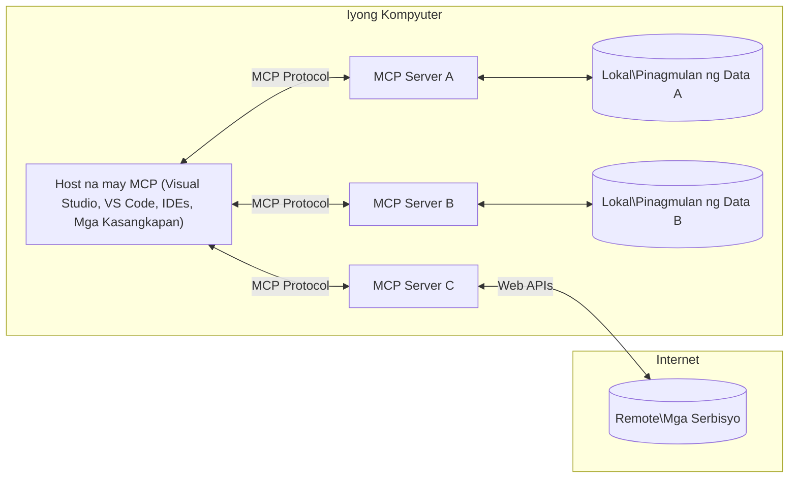

# MCP Core Concepts: Pag-master ng Model Context Protocol para sa AI Integration

[](https://youtu.be/earDzWGtE84)

_(I-click ang larawan sa itaas upang panoorin ang video ng leksyong ito)_

Ang [Model Context Protocol (MCP)](https://github.com/modelcontextprotocol) ay isang makapangyarihang, standardized na balangkas na nag-ooptimize ng komunikasyon sa pagitan ng Large Language Models (LLMs) at mga panlabas na tools, aplikasyon, at mga pinagkukunan ng data.  
Ang gabay na ito ay maghahatid sa iyo sa mga pangunahing konsepto ng MCP. Matututuhan mo ang tungkol sa client-server arkitektura nito, mahahalagang bahagi, mekaniks ng komunikasyon, at mga pinakamahusay na praktis sa pagpapatupad.

- **Explicit User Consent**: Lahat ng pag-access sa data at mga operasyon ay nangangailangan ng malinaw na pahintulot mula sa gumagamit bago isagawa. Dapat malinaw na maunawaan ng mga gumagamit kung anong data ang aaksesin at anong mga aksyon ang gagawin, na may masusing kontrol sa mga pahintulot at otorisasyon.

- **Proteksyon sa Privacy ng Data**: Ang data ng gumagamit ay ipinapakita lamang sa may malinaw na pahintulot at dapat protektahan ng matibay na access controls sa buong lifecycle ng interaksyon. Ang mga implementasyon ay dapat pumigil sa hindi awtorisadong pagpapadala ng data at panatilihin ang mahigpit na hangganan ng privacy.

- **Kaligtasan sa Pagpapatakbo ng Tools**: Bawat pagtawag ng tool ay nangangailangan ng malinaw na pahintulot ng gumagamit na may malinaw na pagkaunawa sa functionality ng tool, mga parametro nito, at potensyal na epekto. Ang matibay na hangganan sa seguridad ay dapat pumigil sa hindi sinasadyang, hindi ligtas, o malisyosong pagpapatakbo ng tool.

- **Transport Layer Security**: Lahat ng daluyan ng komunikasyon ay dapat gumamit ng angkop na encryption at mga mekanismo ng awtentikasyon. Ang mga remote na koneksyon ay dapat magpatupad ng secure na transport protocols at tamang pamamahala ng kredensyal.

#### Mga Panuntunan sa Pagpapatupad:

- **Pamamahala sa Pahintulot**: Magpatupad ng masusing sistema ng pahintulot na nagpapahintulot sa mga gumagamit na kontrolin kung anong mga server, tool, at resources ang maaakses  
- **Authentication & Authorization**: Gumamit ng ligtas na paraan ng awtentikasyon (OAuth, API keys) na may tamang pamamahala ng token at pag-expire  
- **Pag-validate ng Input**: I-validate ang lahat ng parametro at input ng data ayon sa mga tinukoy na schema upang maiwasan ang injection attacks  
- **Audit Logging**: Panatilihin ang komprehensibong logs ng lahat ng operasyon para sa pagsubaybay sa seguridad at pagsunod

## Pangkalahatang Pagsilip

Tinutuklas ng leksyong ito ang pundamental na arkitektura at mga bahagi na bumubuo sa Model Context Protocol (MCP) ecosystem. Matututuhan mo ang tungkol sa client-server arkitektura, mga pangunahing bahagi, at mga mekanismo ng komunikasyon na nagpapatakbo sa mga interaksyon ng MCP.

## Pangunahing Mga Layunin sa Pagkatuto

Pagkatapos ng leksyong ito, magagawa mo:

- Maunawaan ang MCP client-server arkitektura.  
- Tukuyin ang mga papel at responsibilidad ng Hosts, Clients, at Servers.  
- Suriin ang mga pangunahing katangian na nagpapatalino sa MCP bilang isang flexible na integration layer.  
- Matutunan kung paano dumadaloy ang impormasyon sa loob ng MCP ecosystem.  
- Magkaroon ng praktikal na kaalaman sa pamamagitan ng mga halimbawa ng code sa .NET, Java, Python, at JavaScript.

## MCP Arkitektura: Mas Malalim na Pagsilip

Ang MCP ecosystem ay itinayo sa client-server na modelo. Ang modular na estrukturang ito ay nagpapahintulot sa mga AI application na makipag-ugnayan sa mga tool, databases, APIs, at mga contextual na resources nang epektibo. Himayin natin ang arkitekturang ito sa mga pangunahing bahagi nito.

Sa pinakapuso nito, sumusunod ang MCP sa client-server na arkitektura kung saan ang isang host application ay maaaring kumonekta sa maramihang mga server:


- **MCP Hosts**: Mga programa gaya ng VSCode, Claude Desktop, IDEs, o mga AI tool na nais mag-access ng data sa pamamagitan ng MCP  
- **MCP Clients**: Mga protocol client na nagpapanatili ng 1:1 na koneksyon sa mga server  
- **MCP Servers**: Magaan na mga programa na bawat isa ay naglalantad ng mga partikular na kakayahan gamit ang standardized na Model Context Protocol  
- **Local Data Sources**: Mga file, database, at serbisyo sa iyong kompyuter na maaring ma-access nang ligtas ng mga MCP server  
- **Remote Services**: Mga panlabas na sistema na available sa internet na maaaring ikonekta ng MCP servers sa pamamagitan ng APIs.

Ang MCP Protocol ay isang umuusbong na standard na gumagamit ng date-based versioning (YYYY-MM-DD format). Ang kasalukuyang bersyon ng protocol ay **2025-11-25**. Makikita mo ang pinakabagong mga update sa [protocol specification](https://modelcontextprotocol.io/specification/2025-11-25/)

### 1. Mga Hosts

Sa Model Context Protocol (MCP), ang **Hosts** ay mga AI application na nagsisilbing pangunahing interface kung saan nakikipag-ugnayan ang mga gumagamit sa protocol. Ang mga Hosts ay nagkokoordinate at nagmamanage ng mga koneksyon sa maramihang MCP server sa pamamagitan ng paglikha ng dedikadong MCP clients para sa bawat server connection. Halimbawa ng mga Hosts ay:

- **AI Applications**: Claude Desktop, Visual Studio Code, Claude Code  
- **Mga Development Environments**: IDEs at mga code editor na may integrasyon sa MCP  
- **Custom Applications**: Mga purpose-built AI agent at mga tool

Ang **Hosts** ay mga aplikasyon na nagkokoordinate ng pakikipag-ugnayan sa mga AI model. Sila ay:

- **Nangunguna sa AI Models**: Nagsasagawa o nakikipag-ugnayan sa LLMs upang bumuo ng mga sagot at magkoordina ng mga workflow ng AI  
- **Nagmamanage ng Client Connections**: Lumilikha at nagpapanatili ng isang MCP client para sa bawat koneksyon ng MCP server  
- **Nagkokontrol ng User Interface**: Namamahala sa daloy ng usapan, pakikipag-ugnayan ng gumagamit, at presentasyon ng tugon  
- **Nagpapatupad ng Seguridad**: Kinokontrol ang mga pahintulot, security constraints, at awtentikasyon  
- **Nangangalaga ng Pahintulot ng User**: Nammamanage ang pag-apruba ng user para sa pagbabahagi ng data at pagpapatakbo ng tool

### 2. Mga Clients

Ang **Clients** ay mga mahalagang bahagi na nagpapanatili ng dedikadong one-to-one na koneksyon sa pagitan ng Hosts at MCP servers. Ang bawat MCP client ay ini-instatiate ng Host upang kumonekta sa isang partikular na MCP server, na nagsisiguro ng maayos at ligtas na mga channel ng komunikasyon. Pinapayagan ng maramihang clients ang Hosts na kumonekta sa maramihang server nang sabay-sabay.

Ang **Clients** ay mga connector na bahagi sa loob ng host application. Sila ay:

- **Nangangalaga ng Protocol Communication**: Nagpapadala ng JSON-RPC 2.0 na mga kahilingan sa mga server na may mga prompt at mga tagubilin  
- **Nagkokontrata ng Kakayahan**: Nakikipagnegosasyon sa mga suportadong feature at mga bersyon ng protocol kasama ang mga server sa panahon ng inisyal na pagsisimula  
- **Nagmamanage ng Pagpapatakbo ng Tool**: Namamahala sa mga kahilingan sa pagpapatakbo ng tool mula sa mga modelo at pinoproseso ang mga tugon  
- **Nagha-handle ng Real-time Updates**: Pinamamahalaan ang mga notification at real-time na update mula sa mga server  
- **Nagpoproseso ng Tugon**: Pinoproseso at inaayos ang mga tugon mula sa server para ipakita sa mga gumagamit

### 3. Mga Servers

Ang **Servers** ay mga programa na nagbibigay ng konteksto, mga tool, at mga kakayahan sa MCP clients. Maaari silang tumakbo nang lokal (sa parehong makina ng Host) o remote (sa mga panlabas na platform), at responsable sa paghawak ng mga kahilingan ng client at pagbibigay ng mga nakabalangkas na tugon. Ang mga Servers ay naglalantad ng partikular na functionality sa pamamagitan ng standardized na Model Context Protocol.

Ang mga **Servers** ay mga serbisyo na nagbibigay ng konteksto at mga kakayahan. Sila ay:

- **Nagre-register ng Feature**: Nagpaparehistro at naglalantad ng mga available na primitives (resources, prompts, tools) sa mga client  
- **Nagpoproseso ng Kahilingan**: Tumatanggap at nagsasagawa ng mga tawag sa tools, kahilingan sa resources, at prompt mula sa mga client  
- **Nagbibigay ng Konteksto**: Nagbibigay ng upang pagandahin ang mga tugon mula sa modelo gamit ang contextual na impormasyon at datos  
- **Nagmamantine ng State**: Pinananatili ang estado ng session at humahawak ng mga stateful na interaksyon kung kinakailangan  
- **Nagpapadala ng Real-time Notifications**: Nagpapadala ng mga abiso tungkol sa pagbabago sa kakayahan at mga update sa mga nakakonektang client

Maaaring paunlarin ng sinumang tao ang mga server upang palawakin ang kakayahan ng modelo gamit ang espesyal na functionality, at sinusuportahan nila ang lokal at remote deployment scenarios.

### 4. Mga Primitive ng Server

Ang mga server sa Model Context Protocol (MCP) ay nagbibigay ng tatlong pangunahing **primitive** na naglalarawan ng pundamental na mga bloke ng mga interaksyon sa pagitan ng mga client, host, at mga language model. Ang mga primitive na ito ay tumutukoy sa mga uri ng contextual na impormasyon at mga aksyon na available sa protocol.

Maaaring maglantad ang mga MCP server ng anumang kombinasyon ng mga sumusunod na tatlong pangunahing primitive:

#### Mga Resources

Ang **Mga Resources** ay mga pinagkukunan ng data na nagbibigay ng contextual na impormasyon sa mga AI application. Kinakatawan nila ang static o dynamic na nilalaman na maaaring magpapahusay sa pag-unawa at paggawa ng desisyon ng modelo:

- **Contextual Data**: Nakabalangkas na impormasyon at konteksto para sa paggamit ng AI model  
- **Knowledge Bases**: Mga repositoryo ng dokumento, artikulo, mga manwal, at mga papel sa pananaliksik  
- **Local Data Sources**: Mga file, database, at lokal na impormasyon ng sistema  
- **External Data**: Tugon ng API, mga web service, at remote na impormasyon ng sistema  
- **Dynamic Content**: Real-time na data na nagbabago base sa panlabas na mga kondisyon

Ang mga resources ay tinutukoy ng mga URI at sumusuporta sa discovery sa pamamagitan ng `resources/list` at pagkuha gamit ang `resources/read` na mga method:

```text
file://documents/project-spec.md
database://production/users/schema
api://weather/current
```

#### Mga Prompts

Ang **Mga Prompts** ay mga reusable na template na tumutulong sa pagsasaayos ng mga interaksyon sa mga language model. Nagbibigay sila ng standardized na pattern ng interaksyon at mga template na workflow:

- **Template-based Interactions**: Paunang naistrukturang mga mensahe at panimulang usapan  
- **Workflow Templates**: Standardized na mga sunud-sunod para sa mga karaniwang gawain at interaksyon  
- **Few-shot Examples**: Mga template base sa halimbawa para sa instruksiyon ng modelo  
- **System Prompts**: Pundamental na mga prompt na nagtatakda ng ugali at konteksto ng modelo  
- **Dynamic Templates**: Parameterized na mga prompt na umaangkop sa partikular na konteksto

Sinusuportahan ng prompts ang variable substitution at maaaring makita gamit ang `prompts/list` at makuha gamit ang `prompts/get`:

```markdown
Generate a {{task_type}} for {{product}} targeting {{audience}} with the following requirements: {{requirements}}
```

#### Mga Tools

Ang **Mga Tools** ay executable na mga function na maaaring tawagin ng mga AI model upang magsagawa ng partikular na aksyon. Kinakatawan nila ang mga "pandiwa" ng MCP ecosystem, na nagpapahintulot sa mga modelo na makipag-ugnayan sa mga panlabas na sistema:

- **Executable Functions**: Mga discrete na operasyon na maaaring tawagin ng mga modelo gamit ang partikular na mga parametro  
- **Integrasyon ng Panlabas na Sistema**: Mga tawag sa API, mga query sa database, mga operasyon sa file, mga kalkulasyon  
- **Natanging Identidad**: Ang bawat tool ay may natatanging pangalan, deskripsyon, at parameter schema  
- **Structured I/O**: Tumatanggap ang mga tool ng validated parameters at nagbabalik ng istrakturadong, typed na mga tugon  
- **Mga Kakayahan sa Aksyon**: Pinapahintulutan ang mga modelo na magsagawa ng totoong aksyon at kumuha ng live na data

Ang mga tool ay tinutukoy gamit ang JSON Schema para sa validation ng parameter at matutuklasan sa pamamagitan ng `tools/list` at pinapatakbo gamit ang `tools/call`. Maaari ring kasama sa mga tool ang mga **icon** bilang karagdagang metadata para sa mas magandang presentasyon sa UI.

**Mga Anotasyon ng Tool**: Sinusuportahan ng mga tool ang mga behavioral annotation (hal., `readOnlyHint`, `destructiveHint`) na naglalarawan kung ang tool ay read-only o mapanira, na tumutulong sa mga client na gumawa ng may kaalamang desisyon tungkol sa pagpapatakbo ng tool.

Halimbawang depinisyon ng tool:

```typescript
server.tool(
  "search_products", 
  {
    query: z.string().describe("Search query for products"),
    category: z.string().optional().describe("Product category filter"),
    max_results: z.number().default(10).describe("Maximum results to return")
  }, 
  async (params) => {
    // Isagawa ang paghahanap at ibalik ang nakaayos na mga resulta
    return await productService.search(params);
  }
);
```

## Mga Primitive ng Client

Sa Model Context Protocol (MCP), ang mga **client** ay maaaring maglantad ng mga primitive na nagpapahintulot sa mga server na humiling ng karagdagang kakayahan mula sa host application. Ang mga primitive na ito sa client-side ay nagbibigay daan para sa mas mayaman, mas interaktibong implementasyon ng server na maaaring ma-access ang kakayahan ng AI model at mga interaksyon ng gumagamit.

### Sampling

Pinapayagan ng **Sampling** ang mga server na humiling ng language model completions mula sa AI application ng client. Pinapayagan ng primitive na ito ang mga server na ma-access ang LLM capabilities nang hindi kinakailangang isama ang kanilang sariling dependencies:

- **Model-Independent Access**: Maaaring humiling ang mga server ng completions nang hindi kasama ang LLM SDKs o pamamahala sa access ng modelo  
- **Server-Initiated AI**: Pinapahintulutan ang mga server na autonomously lumikha ng nilalaman gamit ang AI model ng client  
- **Recursive LLM Interactions**: Sinusuportahan ang komplikadong mga senaryo kung saan kailangan ng mga server ang AI para sa pagproseso  
- **Dynamic Content Generation**: Pinapayagan ang mga server na lumikha ng contextual na tugon gamit ang modelo ng host  
- **Suporta sa Pagtawag ng Tool**: Maaaring isama ng mga server ang `tools` at `toolChoice` na mga parametro upang payagan ang modelo ng client na tumawag ng mga tool habang nagsa-sampling

Ang sampling ay sinimulan sa pamamagitan ng `sampling/complete` na pamamaraan, kung saan nagpapadala ang mga server ng kahilingan para sa completion sa mga client.

### Mga Roots

Nagbibigay ang **Roots** ng standardized na paraan para sa mga client na ilantad ang mga hangganan ng filesystem sa mga server, na tumutulong sa mga server na maunawaan kung anong mga direktoryo at file ang maa-access nila:

- **Filesystem Boundaries**: Itinatakda ang hangganan kung saan maaaring mag-operate ang mga server sa loob ng filesystem  
- **Access Control**: Tinutulungan ang mga server na maunawaan kung anong mga direktoryo at file ang may pahintulot silang ma-access  
- **Dynamic Updates**: Maaaring i-notify ng client ang mga server kapag nagbago ang listahan ng mga roots  
- **URI-Based Identification**: Gumagamit ang roots ng `file://` URI upang tukuyin ang mga direktoryo at file na maa-access

Ang roots ay matutuklasan gamit ang `roots/list` method, at nagpapadala ang client ng `notifications/roots/list_changed` kapag nagbago ang mga roots.

### Elicitation  

Pinapayagan ng **Elicitation** ang mga server na humiling ng karagdagang impormasyon o kumpirmasyon mula sa mga gumagamit sa pamamagitan ng interface ng client:

- **Mga Kahilingan sa Input ng User**: Maaaring humingi ang mga server ng dagdag na impormasyon kapag kailangan para sa pagpapatakbo ng tool  
- **Mga Dialogong Pang-kumpirmasyon**: Humihiling ng pag-apruba mula sa user para sa sensitibo o may epekto na mga operasyon  
- **Interactive Workflows**: Pinapayagan ang mga server na lumikha ng hakbang-hakbang na interaksyon ng gumagamit  
- **Dynamic Parameter Collection**: Kinokolekta ang nawawala o opsyonal na mga parametro habang nagpapatakbo ng tool

Ang mga kahilingan sa elicitation ay ginagawa gamit ang `elicitation/request` na pamamaraan upang kolektahin ang input ng gumagamit sa interface ng client.

**URL Mode Elicitation**: Maaari ring humiling ang mga server ng user interaction gamit ang URL mode, na nagpapahintulot sa mga server na idirekta ang mga gumagamit sa panlabas na mga web page para sa awtentikasyon, kumpirmasyon, o pagpasok ng data.

### Logging

Pinapayagan ng **Logging** ang mga server na magpadala ng mga istrakturadong log message sa mga client para sa debugging, pagsubaybay, at operational visibility:

- **Suporta sa Debugging**: Pinapayagan ang mga server na magbigay ng detalyadong log ng pagpapatakbo para sa troubleshooting  
- **Operational Monitoring**: Nagpapadala ng mga update sa katayuan at mga sukatan ng performance sa mga client  
- **Pag-uulat ng Error**: Nagbibigay ng detalyadong konteksto ng error at diagnostic na impormasyon  
- **Audit Trails**: Lumilikha ng komprehensibong log ng mga operasyon at desisyon ng server

Ang mga logging message ay ipinapadala sa mga client upang magbigay ng transparency sa mga operasyon ng server at magpadali ng debugging.

## Daloy ng Impormasyon sa MCP

Itinatakda ng Model Context Protocol (MCP) ang nakabalangkas na daloy ng impormasyon sa pagitan ng mga host, client, server, at mga modelo. Ang pag-unawa sa daloy na ito ay nakatutulong upang linawin kung paano pinoproseso ang mga kahilingan ng user at kung paano isinasama ang mga panlabas na tool at data sa mga tugon ng modelo.
- **Simula ng Host ang Koneksyon**  
  Ang host na aplikasyon (tulad ng isang IDE o chat interface) ay nagtatatag ng koneksyon sa isang MCP server, karaniwang sa pamamagitan ng STDIO, WebSocket, o isang suportadong transport.

- **Negosasyon ng Kakayahan**  
  Nagpapalitan ng impormasyon ang kliyente (nakalakip sa host) at ang server tungkol sa kanilang sinusuportahang mga tampok, kasangkapan, pinagkukunan, at mga bersyon ng protokol. Tinitiyak nito na nauunawaan ng parehong panig kung anong mga kakayahan ang magagamit para sa session.

- **Hiling ng Gumagamit**  
  Nakikipag-ugnayan ang gumagamit sa host (hal. naglalagay ng prompt o utos). Kinokolekta ng host ang input na ito at ipinapasa ito sa kliyente para sa pagproseso.

- **Paggamit ng Pinagkukunan o Kasangkapan**  
  - Maaaring humiling ang kliyente ng karagdagang konteksto o mga pinagkukunan mula sa server (tulad ng mga file, talaan sa database, o mga artikulo sa knowledge base) upang payamanin ang pag-unawa ng modelo.  
  - Kung matukoy ng modelo na kailangan ng kasangkapan (hal. para kumuha ng data, magsagawa ng kalkulasyon, o tumawag ng API), nagpapadala ang kliyente ng kahilingan para sa pagtawag ng kasangkapan sa server, na tinutukoy ang pangalan ng kasangkapan at mga parametro.

- **Pagpapatupad ng Server**  
  Tinatanggap ng server ang kahilingan para sa pinagkukunan o kasangkapan, isinasagawa ang kinakailangang operasyon (tulad ng pagpapatakbo ng isang function, pagtatanong sa database, o pagkuha ng file), at ibinabalik ang mga resulta sa kliyente sa isang nakaayos na format.

- **Pagbuo ng Tugon**  
  Isinasama ng kliyente ang mga tugon ng server (data ng pinagkukunan, output ng kasangkapan, atbp.) sa kasalukuyang interaksyon ng modelo. Ginagamit ng modelo ang impormasyong ito upang bumuo ng komprehensibo at may kaugnayang tugon batay sa konteksto.

- **Pagpapakita ng Resulta**  
  Tinatanggap ng host ang panghuling output mula sa kliyente at ipinapakita ito sa gumagamit, kadalasan ay kabilang ang parehong text na nilikha ng modelo at anumang mga resulta mula sa pagpapatupad ng mga kasangkapan o pagsilip sa mga pinagkukunan.

Pinapagana ng daloy na ito ang MCP na suportahan ang mga advanced, interactive, at kontekstuwal na AI na aplikasyon sa pamamagitan ng tuloy-tuloy na pagkonekta ng mga modelo sa mga panlabas na kasangkapan at pinagkukunan ng data.

## Arkitektura ng Protokol at mga Layer

Binubuo ang MCP ng dalawang hiwalay na arkitektural na layer na nagtutulungan upang magbigay ng kumpletong balangkas ng komunikasyon:

### Data Layer

Ipinatutupad ng **Data Layer** ang pangunahing protokol ng MCP gamit ang **JSON-RPC 2.0** bilang pundasyon. Tinukoy ng layer na ito ang istruktura ng mensahe, semantika, at mga pattern ng interaksyon:

#### Pangunahing Mga Bahagi:

- **JSON-RPC 2.0 Protocol**: Lahat ng komunikasyon ay gumagamit ng standard na format ng mensahe ng JSON-RPC 2.0 para sa mga method call, tugon, at mga notification  
- **Pamamahala ng Lifecycle**: Humahawak ng inisyal na koneksyon, negosasyon ng kakayahan, at pagtatapos ng session sa pagitan ng mga kliyente at server  
- **Primitibo ng Server**: Pinapahintulutan ang mga server na magbigay ng pangunahing functionality sa pamamagitan ng mga kasangkapan, pinagkukunan, at mga prompt  
- **Primitibo ng Kliyente**: Pinapahintulutan ang mga server na humiling ng sampling mula sa LLMs, humikayat ng input ng gumagamit, at magpadala ng log messages  
- **Real-time Notifications**: Sumusuporta sa asynchronous na mga notification para sa dynamic na mga update nang hindi nangangailangan ng polling

#### Pangunahing Mga Tampok:

- **Negosasyon ng Bersyon ng Protokol**: Gumagamit ng bersyong nakabase sa petsa (YYYY-MM-DD) upang matiyak ang pagiging compatible  
- **Pagtuklas ng Kakayahan**: Nagpapalitan ng impormasyon ang mga kliyente at server tungkol sa sinusuportahang mga tampok sa panahon ng inisyal na koneksyon  
- **Stateful Sessions**: Pinananatili ang estado ng koneksyon sa maraming interaksyon para sa pagpapatuloy ng konteksto

### Transport Layer

Pinangangasiwaan ng **Transport Layer** ang mga channel ng komunikasyon, framing ng mga mensahe, at pagpapatunay sa pagitan ng mga kalahok ng MCP:

#### Mga Sinusuportahang Mekanismo ng Transport:

1. **STDIO Transport**:  
   - Gumagamit ng standard input/output streams para sa direktang komunikasyon ng proseso  
   - Pinakamainam para sa mga lokal na proseso sa iisang makina nang walang overhead ng network  
   - Karaniwang ginagamit para sa mga lokal na implementasyon ng MCP server

2. **Streamable HTTP Transport**:  
   - Gumagamit ng HTTP POST para sa mga mensahe mula kliyente papuntang server  
   - Opsyonal na Server-Sent Events (SSE) para sa streaming mula server papuntang kliyente  
   - Pinapagana ang komunikasyon ng remote server sa mga network  
   - Sumusuporta sa karaniwang HTTP authentication (bearer tokens, API keys, custom headers)  
   - Inirerekomenda ng MCP ang OAuth para sa ligtas na token-based authentication

#### Abstraksyon ng Transport:

Iniaalis ng transport layer ang mga detalye ng komunikasyon mula sa data layer, na nagpapahintulot sa parehong format ng mensahe na JSON-RPC 2.0 na magamit sa lahat ng mekanismo ng transport. Pinapahintulutan nito ang mga aplikasyon na madaling lumipat mula lokal hanggang remote na mga server.

### Mga Pagsasaalang-alang sa Seguridad

Dapat sumunod ang mga implementasyon ng MCP sa ilang mahahalagang prinsipyo sa seguridad upang matiyak ang ligtas, mapagkakatiwalaan, at seguradong pakikipag-ugnayan sa lahat ng operasyon ng protokol:

- **Pahintulot at Kontrol ng Gumagamit**: Dapat magbigay ng malinaw na pahintulot ang mga gumagamit bago ma-access ang anumang data o maisagawa ang anumang operasyon. Dapat may malinaw na kontrol sila sa kung anong data ang ibabahagi at kung aling mga aksyon ang pinapayagan, suportado ng mga madaling gamitin na interface para suriin at aprubahan ang mga aktibidad.

- **Pribasiya ng Data**: Ang data ng gumagamit ay dapat ilantad lamang sa malinaw na pahintulot at dapat protektahan ng angkop na mga kontrol sa access. Dapat siguruhing hindi makakalusot ang hindi awtorisadong transmisyon ng data at panatilihin ang pribasiya sa lahat ng interaksyon.

- **Kaligtasan ng Kasangkapan**: Bago gamitin ang anumang kasangkapan, kinakailangan ang malinaw na pahintulot ng gumagamit. Dapat maliwanagan ang mga gumagamit patungkol sa bawat gamit ng kasangkapan, at dapat ipatupad ang matitibay na hangganan sa seguridad upang maiwasan ang hindi inaasahan o hindi ligtas na paggamit.

Sa pagsunod sa mga prinsipyo ng seguridad na ito, tiniyak ng MCP ang tiwala, pribasiya, at kaligtasan ng gumagamit sa lahat ng interaksyon ng protokol habang pinapagana ang makapangyarihang integrasyon ng AI.

## Mga Halimbawang Kodigo: Pangunahing Mga Bahagi

Narito ang mga halimbawa ng kodigo sa ilang sikat na programming na wika na nagpapakita kung paano ipatupad ang mga pangunahing bahagi ng MCP server at mga kasangkapan.

### Halimbawa sa .NET: Paglikha ng Simpleng MCP Server na may mga Kasangkapan

Narito ang praktikal na halimbawa ng .NET na naglalarawan kung paano gumawa ng isang simpleng MCP server na may custom na mga kasangkapan. Ipinapakita ng halimbawang ito kung paano magdeklara at magrehistro ng mga kasangkapan, humawak ng mga kahilingan, at ikonekta ang server gamit ang Model Context Protocol.

```csharp
using System;
using System.Threading.Tasks;
using ModelContextProtocol.Server;
using ModelContextProtocol.Server.Transport;
using ModelContextProtocol.Server.Tools;

public class WeatherServer
{
    public static async Task Main(string[] args)
    {
        // Create an MCP server
        var server = new McpServer(
            name: "Weather MCP Server",
            version: "1.0.0"
        );
        
        // Register our custom weather tool
        server.AddTool<string, WeatherData>("weatherTool", 
            description: "Gets current weather for a location",
            execute: async (location) => {
                // Call weather API (simplified)
                var weatherData = await GetWeatherDataAsync(location);
                return weatherData;
            });
        
        // Connect the server using stdio transport
        var transport = new StdioServerTransport();
        await server.ConnectAsync(transport);
        
        Console.WriteLine("Weather MCP Server started");
        
        // Keep the server running until process is terminated
        await Task.Delay(-1);
    }
    
    private static async Task<WeatherData> GetWeatherDataAsync(string location)
    {
        // This would normally call a weather API
        // Simplified for demonstration
        await Task.Delay(100); // Simulate API call
        return new WeatherData { 
            Temperature = 72.5,
            Conditions = "Sunny",
            Location = location
        };
    }
}

public class WeatherData
{
    public double Temperature { get; set; }
    public string Conditions { get; set; }
    public string Location { get; set; }
}
```

### Halimbawa sa Java: Mga Bahagi ng MCP Server

Ipinapakita ng halimbawa na ito ang katulad na MCP server at pagrerehistro ng kasangkapan tulad ng .NET na halimbawa sa itaas, ngunit ipinatupad sa Java.

```java
import io.modelcontextprotocol.server.McpServer;
import io.modelcontextprotocol.server.McpToolDefinition;
import io.modelcontextprotocol.server.transport.StdioServerTransport;
import io.modelcontextprotocol.server.tool.ToolExecutionContext;
import io.modelcontextprotocol.server.tool.ToolResponse;

public class WeatherMcpServer {
    public static void main(String[] args) throws Exception {
        // Gumawa ng MCP server
        McpServer server = McpServer.builder()
            .name("Weather MCP Server")
            .version("1.0.0")
            .build();
            
        // Magrehistro ng tool para sa panahon
        server.registerTool(McpToolDefinition.builder("weatherTool")
            .description("Gets current weather for a location")
            .parameter("location", String.class)
            .execute((ToolExecutionContext ctx) -> {
                String location = ctx.getParameter("location", String.class);
                
                // Kumuha ng datos ng panahon (pinadali)
                WeatherData data = getWeatherData(location);
                
                // Ibalik ang naayos na tugon
                return ToolResponse.content(
                    String.format("Temperature: %.1f°F, Conditions: %s, Location: %s", 
                    data.getTemperature(), 
                    data.getConditions(), 
                    data.getLocation())
                );
            })
            .build());
        
        // Ikonekta ang server gamit ang stdio transport
        try (StdioServerTransport transport = new StdioServerTransport()) {
            server.connect(transport);
            System.out.println("Weather MCP Server started");
            // Panatilihing tumatakbo ang server hanggang sa itigil ang proseso
            Thread.currentThread().join();
        }
    }
    
    private static WeatherData getWeatherData(String location) {
        // Ang implementasyon ay tatawag sa isang weather API
        // Pinadali para sa layunin ng halimbawa
        return new WeatherData(72.5, "Sunny", location);
    }
}

class WeatherData {
    private double temperature;
    private String conditions;
    private String location;
    
    public WeatherData(double temperature, String conditions, String location) {
        this.temperature = temperature;
        this.conditions = conditions;
        this.location = location;
    }
    
    public double getTemperature() {
        return temperature;
    }
    
    public String getConditions() {
        return conditions;
    }
    
    public String getLocation() {
        return location;
    }
}
```

### Halimbawa sa Python: Pagbuo ng MCP Server

Gumagamit ang halimbawang ito ng fastmcp, kaya siguraduhing mai-install muna ito:

```python
pip install fastmcp
```
Code Sample:

```python
#!/usr/bin/env python3
import asyncio
from fastmcp import FastMCP
from fastmcp.transports.stdio import serve_stdio

# Gumawa ng FastMCP server
mcp = FastMCP(
    name="Weather MCP Server",
    version="1.0.0"
)

@mcp.tool()
def get_weather(location: str) -> dict:
    """Gets current weather for a location."""
    return {
        "temperature": 72.5,
        "conditions": "Sunny",
        "location": location
    }

# Alternatibong paraan gamit ang isang klase
class WeatherTools:
    @mcp.tool()
    def forecast(self, location: str, days: int = 1) -> dict:
        """Gets weather forecast for a location for the specified number of days."""
        return {
            "location": location,
            "forecast": [
                {"day": i+1, "temperature": 70 + i, "conditions": "Partly Cloudy"}
                for i in range(days)
            ]
        }

# Irehistro ang mga kagamitang klase
weather_tools = WeatherTools()

# Simulan ang server
if __name__ == "__main__":
    asyncio.run(serve_stdio(mcp))
```

### Halimbawa sa JavaScript: Paglikha ng MCP Server

Ipinapakita ng halimbawang ito kung paano gumawa ng MCP server sa JavaScript at paano magrehistro ng dalawang kasangkapan tungkol sa panahon.

```javascript
// Paggamit ng opisyal na Model Context Protocol SDK
import { McpServer } from "@modelcontextprotocol/sdk/server/mcp.js";
import { StdioServerTransport } from "@modelcontextprotocol/sdk/server/stdio.js";
import { z } from "zod"; // Para sa pag-validate ng parameter

// Gumawa ng isang MCP server
const server = new McpServer({
  name: "Weather MCP Server",
  version: "1.0.0"
});

// Tukuyin ang isang weather tool
server.tool(
  "weatherTool",
  {
    location: z.string().describe("The location to get weather for")
  },
  async ({ location }) => {
    // Karaniwang tatawag ito ng isang weather API
    // Pinasimple para sa demonstrasyon
    const weatherData = await getWeatherData(location);
    
    return {
      content: [
        { 
          type: "text", 
          text: `Temperature: ${weatherData.temperature}°F, Conditions: ${weatherData.conditions}, Location: ${weatherData.location}` 
        }
      ]
    };
  }
);

// Tukuyin ang isang forecast tool
server.tool(
  "forecastTool",
  {
    location: z.string(),
    days: z.number().default(3).describe("Number of days for forecast")
  },
  async ({ location, days }) => {
    // Karaniwang tatawag ito ng isang weather API
    // Pinasimple para sa demonstrasyon
    const forecast = await getForecastData(location, days);
    
    return {
      content: [
        { 
          type: "text", 
          text: `${days}-day forecast for ${location}: ${JSON.stringify(forecast)}` 
        }
      ]
    };
  }
);

// Mga helper na function
async function getWeatherData(location) {
  // Gawing kahalintulad ang tawag sa API
  return {
    temperature: 72.5,
    conditions: "Sunny",
    location: location
  };
}

async function getForecastData(location, days) {
  // Gawing kahalintulad ang tawag sa API
  return Array.from({ length: days }, (_, i) => ({
    day: i + 1,
    temperature: 70 + Math.floor(Math.random() * 10),
    conditions: i % 2 === 0 ? "Sunny" : "Partly Cloudy"
  }));
}

// Ikonekta ang server gamit ang stdio transport
const transport = new StdioServerTransport();
server.connect(transport).catch(console.error);

console.log("Weather MCP Server started");
```

Ipinapakita ng halimbawang JavaScript kung paano lumikha ng MCP server na nagrerehistro ng mga kasangkapan na may kaugnayan sa panahon at kumokonekta gamit ang stdio transport upang tumanggap ng mga papasok na kahilingan ng kliyente.

## Seguridad at Awtorisasyon

Kasama sa MCP ang ilang nakapaloob na mga konsepto at mekanismo para sa pamamahala ng seguridad at awtorisasyon sa buong protokol:

1. **Kontrol ng Pahintulot sa Kasangkapan**:  
  Maaaring tukuyin ng mga kliyente kung aling mga kasangkapan ang pinapayagang gamitin ng modelo sa panahon ng session. Tinitiyak nito na ang mga kasangkapan na pormal na pinahintulutan lamang ang maa-access, na nagpapababa ng panganib ng hindi inaasahan o hindi ligtas na operasyon. Maaaring i-configure ang mga pahintulot nang dinamiko batay sa mga preference ng gumagamit, patakaran ng organisasyon, o konteksto ng interaksyon.

2. **Pagpapatunay (Authentication)**:  
  Maaaring mangailangan ang mga server ng pagpapatunay bago payagan ang access sa mga kasangkapan, pinagkukunan, o sensitibong operasyon. Maaaring kabilang dito ang mga API key, mga OAuth token, o iba pang mga scheme sa pagpapatunay. Tinitiyak ng wastong pagpapatunay na tanging mga pinagkakatiwalaang kliyente at gumagamit lamang ang maaaring gumamit ng kakayahan ng server.

3. **Pag-validate**:  
  Pinatutupad ang pagpapatunay ng parametro para sa lahat ng pagtawag sa kasangkapan. Bawat kasangkapan ay nagtatakda ng inaasahang mga uri, format, at mga limitasyon para sa mga parametro nito, at pinapatunayan ng server ang mga papasok na kahilingan ayon dito. Pinipigilan nito ang maling o mapanirang input mula sa pag-abot sa implementasyon ng kasangkapan at tumutulong mapanatili ang integridad ng mga operasyon.

4. **Paghihigpit ng Rate**:  
  Upang maiwasan ang pang-aabuso at matiyak ang patas na paggamit ng mga yaman ng server, maaaring magpatupad ang mga MCP server ng rate limiting para sa mga pagtawag ng kasangkapan at pag-access ng pinagkukunan. Maaaring ipatupad ang mga rate limit kada gumagamit, kada session, o sa kabuuan, at tumutulong ito na protektahan laban sa denial-of-service attack o sobrang paggamit ng mga yaman.

Sa pagsasama-sama ng mga mekanismong ito, naglalaan ang MCP ng ligtas na pundasyon para sa integrasyon ng mga language model sa panlabas na kasangkapan at pinagkukunan ng data, habang nagbibigay sa mga gumagamit at developer ng masusukat na kontrol sa pag-access at paggamit.

## Mga Mensahe ng Protokol at Daloy ng Komunikasyon

Gumagamit ang komunikasyon ng MCP ng istrukturadong mga mensahe na **JSON-RPC 2.0** upang mapadali ang malinaw at maaasahang mga interaksyon sa pagitan ng mga host, kliyente, at server. Itinakda ng protokol ang mga partikular na pattern ng mensahe para sa iba't ibang uri ng operasyon:

### Pangunahing Uri ng Mensahe:

#### **Mga Mensahe para sa Inisialisasyon**
- **Request na `initialize`**: Itinatag ang koneksyon at pinag-uusapan ang bersyon ng protokol at mga kakayahan  
- **Response na `initialize`**: Kinukumpirma ang sinusuportahang mga tampok at impormasyon ng server  
- **`notifications/initialized`**: Nagpapaalam na tapos na ang inisialisasyon at handa na ang session

#### **Mga Mensahe ng Pagtuklas**
- **Request na `tools/list`**: Nagtutuklas ng mga available na kasangkapan mula sa server  
- **Request na `resources/list`**: Naglilista ng mga available na pinagkukunan (mga pinagmumulan ng data)  
- **Request na `prompts/list`**: Kumukuha ng mga template ng prompt na magagamit

#### **Mga Mensahe ng Pagpapatupad**  
- **Request na `tools/call`**: Nagpapatupad ng isang partikular na kasangkapan gamit ang mga ibinigay na parametro  
- **Request na `resources/read`**: Kumukuha ng nilalaman mula sa isang partikular na pinagkukunan  
- **Request na `prompts/get`**: Kumukuha ng isang template ng prompt na may opsyonal na mga parametro

#### **Mga Mensahe mula sa Kliyente**
- **Request na `sampling/complete`**: Humihiling ang server ng kumpletong output mula sa LLM sa kliyente  
- **`elicitation/request`**: Humihiling ang server ng input ng gumagamit sa pamamagitan ng interface ng kliyente  
- **Mga Logging Messages**: Nagpapadala ang server ng mga nakaayos na log message sa kliyente

#### **Mga Mensahe ng Notification**
- **`notifications/tools/list_changed`**: Nagbibigay-alam ang server sa kliyente tungkol sa mga pagbabago sa listahan ng kasangkapan  
- **`notifications/resources/list_changed`**: Nagbibigay-alam ang server sa kliyente tungkol sa mga pagbabago sa listahan ng pinagkukunan  
- **`notifications/prompts/list_changed`**: Nagbibigay-alam ang server sa kliyente tungkol sa mga pagbabago sa listahan ng mga prompt

### Istruktura ng Mensahe:

Lahat ng mga mensahe ng MCP ay sumusunod sa format ng JSON-RPC 2.0 na may:  
- **Request Messages**: May kasamang `id`, `method`, at opsyonal na `params`  
- **Response Messages**: May kasamang `id` at alinman sa `result` o `error`  
- **Notification Messages**: May kasamang `method` at opsyonal na `params` (walang `id` o inaasahang tugon)

Tinitiyak ng istrukturadong komunikasyon na ito ang maaasahan, madaling subaybayan, at maaaring palawigin na mga interaksyon na sumusuporta sa mga advanced na senaryo tulad ng real-time updates, pag-chain ng mga tool, at matibay na paghawak ng error.

### Mga Task (Eksperimento)

Ang **Mga Task** ay isang eksperimentong feature na nagbibigay ng matibay na wrapper para sa pagpapatupad na nagpapahintulot sa deferred na pagkuha ng resulta at pagsubaybay ng status para sa mga kahilingan ng MCP:

- **Mahahabang Operasyon**: Pagsubaybay sa mamahaling computation, workflow automation, at batch processing  
- **Deferred na Resulta**: Polling para sa estado ng task at pagkuha ng resulta kapag tapos na ang operasyon  
- **Pagsubaybay ng Status**: Pagmamanman sa progreso ng task sa pamamagitan ng tinukoy na mga estado ng lifecycle  
- **Multi-Step na Operasyon**: Sumusuporta sa mga komplikadong workflow na sumasaklaw sa maraming interaksyon

Pinapalibutan ng mga task ang karaniwang mga kahilingan ng MCP upang paganahin ang asynchronous na mga pattern ng pagpapatupad para sa mga operasyong hindi agad natatapos.

## Mahahalagang Punto

- **Arkitektura**: Gumagamit ang MCP ng client-server na arkitektura kung saan pinamamahalaan ng mga host ang maraming koneksyon ng kliyente sa mga server  
- **Mga Kalahok**: Kasama sa ecosystem ang mga host (AI na aplikasyon), mga kliyente (mga connector ng protokol), at mga server (mga tagapagbigay ng kakayahan)  
- **Mga Mekanismo ng Transport**: Sinusuportahan ang komunikasyon gamit ang STDIO (lokal) at Streamable HTTP na may opsyonal na SSE (remote)  
- **Pangunahing Primitibo**: Nagpapakita ang mga server ng mga kasangkapan (mga executable function), mga pinagkukunan (pinagmumulan ng data), at mga prompt (template)  
- **Primitibo ng Kliyente**: Maaaring humiling ang mga server ng sampling (LLM completions na may suporta sa pagtawag kasangkapan), elicitation (input ng gumagamit kabilang ang URL mode), roots (mga hangganan ng filesystem), at pag-log mula sa mga kliyente  
- **Eksperimentong Mga Tampok**: Nagbibigay ang mga Task ng matibay na execution wrappers para sa mahahabang operasyon  
- **Pundasyon ng Protokol**: Itinatag sa JSON-RPC 2.0 na may bersyong nakabase sa petsa (kasalukuyan: 2025-11-25)  
- **Mga Real-time na Kakayahan**: Sumusuporta sa mga notification para sa dynamic na update at real-time na pagsi-synchronize  
- **Seguridad Bilang Prayoridad**: Malinaw na pahintulot ng gumagamit, proteksyon ng pribasiya ng data, at ligtas na transport ang mga pangunahing pangangailangan

## Ehersisyo

Disenyuhin ang isang simpleng MCP tool na magiging kapaki-pakinabang sa iyong larangan. Tukuyin ang:  
1. Ano ang magiging pangalan ng kasangkapan  
2. Anong mga parametro ang tatanggapin nito  
3. Anong output ang ibabalik nito  
4. Kung paano maaaring gamitin ng modelo ang kasangkapan na ito upang lutasin ang mga problema ng gumagamit

---

## Ano ang Susunod

Susunod: [Chapter 2: Security](../02-Security/README.md)

---

<!-- CO-OP TRANSLATOR DISCLAIMER START -->
**Pahayag ng Pagsuway**:
Ang dokumentong ito ay isinalin gamit ang AI na serbisyo sa pagsasalin na [Co-op Translator](https://github.com/Azure/co-op-translator). Bagamat aming pinagsisikapang maging tumpak ang pagsasalin, pakitandaan na ang awtomatikong pagsasalin ay maaaring maglaman ng mga pagkakamali o hindi pagkakatugma. Ang orihinal na dokumento sa orihinal nitong wika ang dapat ituring na pinakapinagkakatiwalaang sanggunian. Para sa mahahalagang impormasyon, inirerekomenda ang propesyonal na pagsasalin ng tao. Hindi kami mananagot sa anumang maling pagkakaunawa o maling interpretasyon na nagmula sa paggamit ng pagsasaling ito.
<!-- CO-OP TRANSLATOR DISCLAIMER END -->