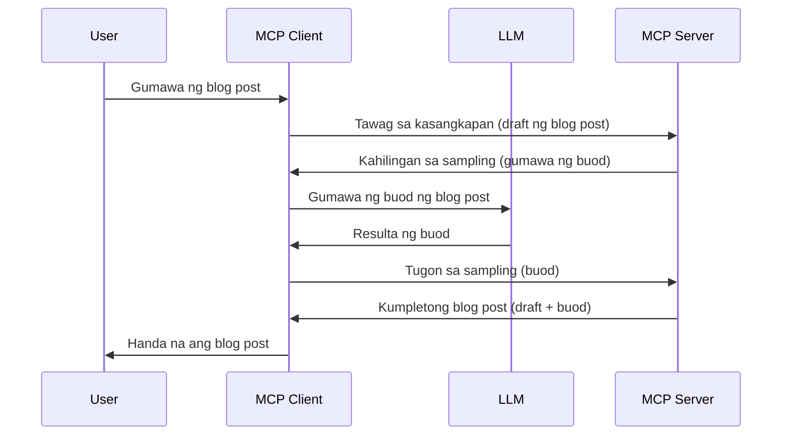

# Sampling - ipagkatiwala ang mga tampok sa Kliyente

Minsan, kailangan ng MCP Client at MCP Server na magtulungan upang makamit ang isang karaniwang layunin. Maaaring magkaroon ka ng kaso kung saan nangangailangan ang Server ng tulong mula sa isang LLM na nasa kliyente. Para sa sitwasyong ito, sampling ang dapat mong gamitin.

Tuklasin natin ang ilang mga kaso ng paggamit at kung paano bumuo ng isang solusyon na may kinalaman sa sampling.

## Pangkalahatang-ideya

Sa araling ito, tututok tayo sa pagpapaliwanag kung kailan at saan gagamitin ang Sampling at kung paano ito i-configure.

## Mga Layunin sa Pagkatuto

Sa kabanatang ito, ating:

- Ipaliwanag kung ano ang Sampling at kailan ito gagamitin.
- Ipakita kung paano i-configure ang Sampling sa MCP.
- Magbigay ng mga halimbawa ng paggamit ng Sampling.

## Ano ang Sampling at bakit ito gagamitin?

Ang Sampling ay isang advanced na tampok na gumagana sa sumusunod na paraan:



### Request para sa Sampling

Ok, ngayon ay may malawak tayong pagtingin sa isang kapanipaniwalang senaryo, pag-usapan natin ang request para sa sampling na ipinapadala ng server pabalik sa kliyente. Ganito ang hitsura ng ganitong request sa format na JSON-RPC:

```json
{
  "jsonrpc": "2.0",
  "id": 1,
  "method": "sampling/createMessage",
  "params": {
    "messages": [
      {
        "role": "user",
        "content": {
          "type": "text",
          "text": "Create a blog post summary of the following blog post: <BLOG POST>"
        }
      }
    ],
    "modelPreferences": {
      "hints": [
        {
          "name": "claude-3-sonnet"
        }
      ],
      "intelligencePriority": 0.8,
      "speedPriority": 0.5
    },
    "systemPrompt": "You are a helpful assistant.",
    "maxTokens": 100
  }
}
```

May ilang bagay dito na mahalagang banggitin:

- Prompt, sa ilalim ng content -> text, ay ang ating prompt na isang instruksiyon para sa LLM upang ibuod ang nilalaman ng blog post.

- **modelPreferences**. Ang seksyong ito ay isang preference lamang, isang rekomendasyon kung anong configuration ang gagamitin sa LLM. Maaaring piliin ng gumagamit kung susundin ang mga rekomendasyong ito o babaguhin ang mga ito. Sa kasong ito, may mga rekomendasyon tungkol sa model na gagamitin at priyoridad sa bilis at katalinuhan.
- **systemPrompt**, ito ang iyong normal na system prompt na nagbibigay personalidad sa iyong LLM at naglalaman ng mga gabay na instruksiyon.
- **maxTokens**, ito ay isa pang property na nagsasabi kung ilang tokens ang inirerekomenda para sa gawaing ito.

### Tugon sa Sampling

Ang tugong ito ay ang ipinapadala ng MCP Client pabalik sa MCP Server bilang resulta ng pagtawag ng kliyente sa LLM, paghihintay sa tugon, at pagbuo ng mensaheng ito. Ganito ang hitsura nito sa JSON-RPC:

```json
{
  "jsonrpc": "2.0",
  "id": 1,
  "result": {
    "role": "assistant",
    "content": {
      "type": "text",
      "text": "Here's your abstract <ABSTRACT>"
    },
    "model": "gpt-5",
    "stopReason": "endTurn"
  }
}
```

Pansinin kung paano ang tugon ay isang abstrak ng blog post tulad ng hinihiling natin. Pansinin din kung paano ang ginamit na `model` ay hindi ang inirequest natin kundi "gpt-5" kaysa sa "claude-3-sonnet". Ito ay nagpapakita na maaaring magbago ang isip ng gumagamit kung ano ang gagamitin at ang iyong sampling request ay isang rekomendasyon lamang.

Ok, ngayong naiintindihan na natin ang pangunahing daloy, at isang kapaki-pakinabang na gawain para dito ay "paglikha ng blog post + abstrak", tingnan natin kung ano ang kailangan nating gawin upang mapagana ito.

### Uri ng Mensahe

Ang mga mensahe ng Sampling ay hindi lang limitado sa teksto kundi maaari ka ring magpadala ng mga larawan at audio. Ganito ang pagkakaiba ng JSON-RPC:

**Teksto**

```json
{
  "type": "text",
  "text": "The message content"
}
```

**Nilalaman ng Larawan**

```json
{
  "type": "image",
  "data": "base64-encoded-image-data",
  "mimeType": "image/jpeg"
}
```

**Nilalaman ng Audio**

```json
{
  "type": "audio",
  "data": "base64-encoded-audio-data",
  "mimeType": "audio/wav"
}
```

> NOTE: para sa mas detalyadong impormasyon tungkol sa Sampling, tingnan ang [opisyal na dokumentasyon](https://modelcontextprotocol.io/specification/2025-11-25/client/sampling)

## Paano Mag-configure ng Sampling sa Kliyente

> Tandaan: kung ikaw ay gumagawa lamang ng server, hindi kailangan gawin ng marami rito.

Sa isang kliyente, kailangan mong tukuyin ang sumusunod na tampok tulad nito:

```json
{
  "capabilities": {
    "sampling": {}
  }
}
```

Ito ay kukunin kapag nag-initialize ang napiling kliyente kasama ang server.

## Halimbawa ng Sampling sa Aksyon - Gumawa ng Blog Post

Gumawa tayo ng sampling server nang magkasama, kailangan nating gawin ang mga sumusunod:

1. Gumawa ng tool sa Server.
1. Ang tool na ito ay dapat gumawa ng sampling request.
1. Maghintay ang tool para sa tugon mula sa client's sampling request.
1. Pagkatapos, dapat gawin ang resulta ng tool.

Tingnan natin ang code nang hakbang-hakbang:

### -1- Gumawa ng tool

**python**

```python
@mcp.tool()
async def create_blog(title: str, content: str, ctx: Context[ServerSession, None]) -> str:
    """Create a blog post and generate a summary"""

```

### -2- Gumawa ng sampling request

Palawakin ang iyong tool gamit ang sumusunod na code:

**python**

```python
post = BlogPost(
        id=len(posts) + 1,
        title=title,
        content=content,
        abstract=""
    )

prompt = f"Create an abstract of the following blog post: title: {title} and draft: {content} "

result = await ctx.session.create_message(
        messages=[
            SamplingMessage(
                role="user",
                content=TextContent(type="text", text=prompt),
            )
        ],
        max_tokens=100,
)

```

### -3- Maghintay ng tugon at ibalik ang tugon

**python**

```python
post.abstract = result.content.text

posts.append(post)

# ibalik ang kumpletong produkto
return json.dumps({
    "id": post.title,
    "abstract": post.abstract
})
```

### -4- Buong code

**python**

```python
from starlette.applications import Starlette
from starlette.routing import Mount, Host

from mcp.server.fastmcp import Context, FastMCP

from mcp.server.session import ServerSession
from mcp.types import SamplingMessage, TextContent

import json


from uuid import uuid4
from typing import List
from pydantic import BaseModel


mcp = FastMCP("Blog post generator")

# app = FastAPI()

posts = []

class BlogPost(BaseModel):
    id: int
    title: str
    content: str
    abstract: str

posts: List[BlogPost] = []

@mcp.tool()
async def create_blog(title: str, content: str, ctx: Context[ServerSession, None]) -> str:
    """Create a blog post and generate a summary"""

    post = BlogPost(
        id=len(posts) + 1,
        title=title,
        content=content,
        abstract=""
    )

    prompt = f"Create an abstract of the following blog post: title: {title} and draft: {content} "

    result = await ctx.session.create_message(
        messages=[
            SamplingMessage(
                role="user",
                content=TextContent(type="text", text=prompt),
            )
        ],
        max_tokens=100,
    )

    post.abstract = result.content.text

    posts.append(post)

    # ibalik ang buong post ng blog
    return json.dumps({
        "id": post.title,
        "abstract": post.abstract
    })

if __name__ == "__main__":
    print("Starting server...")
    # mcp.run()
    mcp.run(transport="streamable-http")

# patakbuhin ang app gamit ang: python server.py
```

### -5- Pagsubok nito sa Visual Studio Code

Para subukan ito sa Visual Studio Code, gawin ang mga sumusunod:

1. Simulan ang server sa terminal
1. Idagdag ito sa *mcp.json* (at siguraduhing ito ay naka-start) halimbawa ganito:

   ```json
   "servers": {
      "blog-server": {
        "type": "http",
        "url": "http://localhost:8000/mcp"
      }
   }
   ```

1. Mag-type ng prompt:

   ```text
   create a blog post named "Where Python comes from", the content is "Python is actually named after Monty Python Flying Circus"
   ```

1. Payagan ang sampling na mangyari. Sa unang subok ay ipapakita sa iyo ang karagdagang dialog na dapat tanggapin, pagkatapos ay makikita mo ang normal na dialog na humihiling na patakbuhin ang tool

1. Suriin ang mga resulta. Makikita mo ang mga resulta na maganda ang pagkakapakita sa GitHub Copilot Chat ngunit maaari mo ring suriin ang raw na JSON response.

**Bonus**. Ang Visual Studio Code tooling ay may mahusay na suporta para sa sampling. Maaari mong i-configure ang access ng Sampling sa iyong naka-install na server sa pamamagitan ng pag-navigate dito ganito:

1. Pumunta sa seksyon ng extension.
1. Piliin ang icon ng cog para sa iyong naka-install na server sa seksyon na "MCP SERVERS - INSTALLED".
1 Piliin ang "Configure Model Access", dito maaari mong piliin kung aling mga Modelo ang pinapayagan ng GitHub Copilot na gamitin kapag ginagawa ang sampling. Makikita mo rin lahat ng mga kahilingang sampling na nangyari kamakailan sa pagpili ng "Show Sampling requests".

## Takdang-aralin

Sa takdang-araling ito, gagawa ka ng bahagyang ibang Sampling, partikular isang sampling integration na sumusuporta sa paggawa ng paglalarawan ng produkto. Narito ang iyong senaryo:

**Senaryo**: Ang trabahador sa back office sa isang e-commerce ay nangangailangan ng tulong, sobra ang tagal sa paggawa ng mga paglalarawan ng produkto. Kaya, gagawa ka ng solusyon kung saan maaari kang tumawag ng isang tool na "create_product" na may mga argumentong "title" at "keywords" at dapat itong gumawa ng kompletong produkto kabilang ang isang "description" na field na dapat punuin ng LLM ng kliyente.

TIP: gamitin ang mga natutunan mo kanina para buuin ang server na ito at ang tool gamit ang sampling request.

## Solusyon

[Solution](./solution/README.md)

## Pangunahing Mga Natutunan

Ang Sampling ay isang makapangyarihang tampok na nagpapahintulot sa server na ipagkatiwala ang mga gawain sa kliyente kapag kailangan nito ang tulong ng isang LLM.

## Ano ang Susunod

- [Kabanata 4 - Praktikal na pagpapatupad](../../04-PracticalImplementation/README.md)

---

<!-- CO-OP TRANSLATOR DISCLAIMER START -->
**Pagtatanggi**:
Ang dokumentong ito ay isinalin gamit ang serbisyo ng AI translation na [Co-op Translator](https://github.com/Azure/co-op-translator). Bagama't nagsusumikap kami para sa katumpakan, pakatandaan na ang awtomatikong pagsasalin ay maaaring maglaman ng mga pagkakamali o hindi pagkakatugma. Ang orihinal na dokumento sa orihinal nitong wika ang dapat ituring na pangunahing sanggunian. Para sa mahahalagang impormasyon, inirerekomenda ang propesyonal na pagsasalin ng tao. Hindi kami mananagot sa anumang maling pagkakaintindi o maling interpretasyon na nagmula sa paggamit ng pagsasaling ito.
<!-- CO-OP TRANSLATOR DISCLAIMER END -->