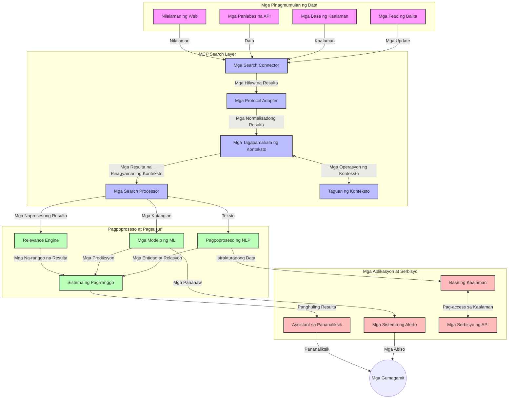
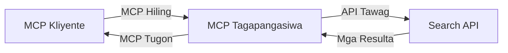
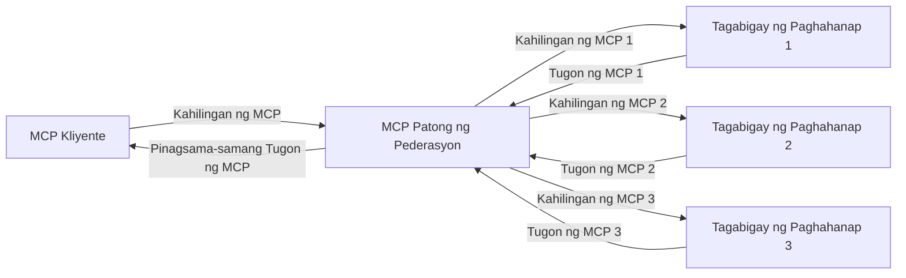
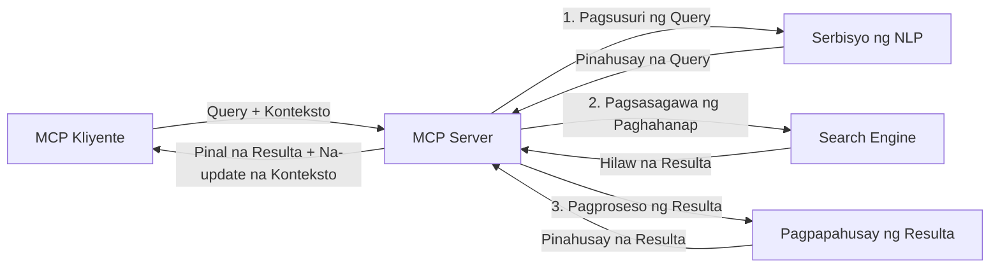

# Model Context Protocol para sa Real-Time Web Search

## Pangkalahatang-ideya

Ang real-time web search ay naging mahalaga sa kasalukuyang kapaligiran na pinapalakas ng impormasyon, kung saan ang mga aplikasyon ay nangangailangan ng agarang access sa pinakabagong impormasyon mula sa internet upang makapagbigay ng nauugnay at napapanahong mga tugon. Ang Model Context Protocol (MCP) ay kumakatawan sa isang makabuluhang pag-unlad sa pag-optimize ng mga prosesong real-time search na ito, pinagpapahusay ang kahusayan sa paghahanap, pinapanatili ang integridad ng konteksto, at pinapahusay ang pangkalahatang pagganap ng sistema.

Sinusuri ng modyul na ito kung paano binabago ng MCP ang real-time web search sa pamamagitan ng pagbibigay ng isang standardisadong paraan sa pamamahala ng konteksto sa pagitan ng mga AI modelo, search engine, at mga aplikasyon.

### Ano ang Matututuhan Mo

Sa komprehensibong gabay na ito, matutuklasan mo:

- Paano nililikha ng MCP ang tulay na tuloy-tuloy sa pagitan ng mga AI modelo at mga kakayahan ng real-time web search
- Mga pattern ng arkitektura para sa pagpapatupad ng mga episyente at scalable na solusyon sa paghahanap gamit ang MCP
- Mga teknik para sa pagpapanatili ng konteksto ng paghahanap sa maraming query at interaksyon
- Praktikal na implementasyon ng code sa Python at JavaScript para sa iba't ibang senaryo ng paghahanap
- Mga paraan upang mapanatili ang balanse sa pagitan ng relevance, recency, at performance sa mga search system na pinapatakbo ng MCP

## Panimula sa Real-Time Web Search

Ang real-time web search ay isang teknolohikal na pamamaraan na nagpapahintulot ng tuloy-tuloy na pagtatanong, pagproseso, at pagsusuri ng impormasyon mula sa web habang ito ay nai-publish o nae-update, na nagpapahintulot sa mga sistema na magbigay ng sariwa at nauugnay na impormasyon na may minimal na pagkaantala. Hindi tulad ng mga tradisyunal na search system na nagtatrabaho sa indexed data na maaaring ilang oras o araw na ang tanda, ang real-time search ay nagpoproseso ng live na data mula sa web, nagbibigay ng mga insight at impormasyon na sumasalamin sa kasalukuyang estado ng nilalaman online.

### Mga Pangunahing Konsepto ng Real-Time Web Search:

- **Tuloy-tuloy na Pagproseso ng Query**: Ang mga query ay pinoproseso laban sa mga patuloy na ina-update na pinagkukunan ng data
- **Pagsasauna sa Bagong Impormasyon**: Ang mga sistema ay dinisenyo upang unahin ang bagong impormasyon
- **Balanseng Relevance**: Pinapanatili ang balanse sa pagitan ng relevance at recency
- **Scalable na Arkitektura**: Dapat kayanin ng mga sistema ang pabago-bagong dami ng query at data
- **Pag-unawa sa Konteksto**: Ang pagpapanatili ng konteksto ng gumagamit sa maraming iterasyon ng paghahanap ay mahalaga para sa makahulugang resulta
- **Dynamikong Pagbabago ng Query**: Nag-aangkop ng query base sa konteksto at mga naunang resulta
- **Pag-integrate ng Maramihang Pinagkukunan**: Pinagsasama ang mga resulta mula sa iba't ibang search provider at mga web source
- **Semantikong Pag-unawa**: Pinoproseso ang mga query at nilalaman base sa kahulugan, hindi lang keywords
- **Real-Time na Pagraranggo**: Patuloy na inaayos ang ranggo ng resulta habang may bagong dami ng impormasyon

### Ang Model Context Protocol at Real-Time Web Search

Nilulutas ng Model Context Protocol (MCP) ang ilang mahahalagang hamon sa mga real-time web search environment:

1. **Pagpapanatili ng Konteksto ng Paghahanap**: Standardisado ng MCP kung paano pinananatili ang konteksto sa pagitan ng mga distributed na bahagi ng paghahanap, tinitiyak na ang mga AI modelo at processing nodes ay may access sa mahalagang history ng query at mga kagustuhan ng gumagamit.

2. **Episyenteng Pamamahala ng Query**: Sa pamamagitan ng pagbibigay ng istrukturadong mekanismo para sa pag-transmit ng konteksto, binabawasan ng MCP ang sobra-sobrang pagpapadala ng konteksto sa bawat iterasyon ng paghahanap.

3. **Interoperability**: Lumilikha ang MCP ng karaniwang wika para sa pagpapalitan ng konteksto sa pagitan ng iba't ibang teknolohiya sa paghahanap at mga AI modelo, na nagpapahintulot ng mas flexible at malawak na mga arkitektura.

4. **Search-Optimized na Konteksto**: Maaaring unahin ng mga implementasyon ng MCP kung aling mga elemento ng konteksto ang pinaka-nauugnay para sa epektibong paghahanap, na na-o-optimize para sa parehong performance at katumpakan.

5. **Adaptive na Proseso ng Paghahanap**: Sa tamang pamamahala ng konteksto gamit ang MCP, maaaring ayusin nang dinamiko ng mga search system ang proseso batay sa nagbabagong pangangailangan ng gumagamit at hitsura ng impormasyon.

Sa mga modernong aplikasyon mula sa news aggregation hanggang sa research assistants, ang integrasyon ng MCP sa teknolohiya ng web search ay nagbibigay-daan sa mas inteligenteng, kontekstwal na pagkakaroon ng kamalayan sa paghahanap na maaaring maghatid ng lalong nauugnay na mga resulta habang nagpapatuloy ang interaksyon ng gumagamit.

## Mga Layunin ng Pagkatuto

Sa pagtatapos ng araling ito, magagawa mong:

- Maunawaan ang mga pundasyon ng real-time web search at ang mga hamon nito sa mga modernong aplikasyon
- Ipaliwanag kung paano pinapahusay ng Model Context Protocol (MCP) ang mga kakayahan ng real-time web search
- Ipatupad ang mga solusyon sa paghahanap na nakabase sa MCP gamit ang mga kilalang framework at API
- Magdisenyo at mag-deploy ng scalable, mataas na performance na mga arkitektura ng paghahanap gamit ang MCP
- Ilapat ang mga konsepto ng MCP sa iba't ibang use case kabilang ang semantic search, research assistance, at AI-augmented browsing
- Suriin ang mga umuusbong na trend at mga hinaharap na inobasyon sa teknolohiya ng paghahanap batay sa MCP
- Bumuo ng mga sistema ng paghahanap na may kaalaman sa konteksto na natututo mula sa mga pakikipag-ugnayan ng gumagamit
- Isama ang kakayahan sa web search sa mga AI assistant gamit ang standardisadong protocol ng MCP
- Lumikha ng multi-stage na pipeline ng paghahanap na progresibong pinong ang mga resulta base sa konteksto
- I-optimize ang performance ng paghahanap habang pinananatili ang malawak na kamalayan sa konteksto

### Kahulugan at Kahalagahan

Ang real-time web search ay kinasasangkutan ng tuloy-tuloy na pagtatanong, pagkuha, at paghahatid ng impormasyon mula sa web na may napakababang pagkaantala. Hindi tulad ng mga tradisyunal na search engine na pana-panahong nag-crawl at nag-iindex ng web, ang real-time search ay naglalayong ipakita ang impormasyon habang ito ay nagiging available, pinapahintulutan ang agarang access sa pinaka-kasalukuyang nilalaman.

Mga pangunahing katangian ng real-time web search:

- **Kabaguhan**: Inuuna ang mga pinakabagong nilalaman at update
- **Tuloy-tuloy na Pagproseso**: Palaging nagmamasid para sa bagong impormasyon
- **Pag-aangkop ng Query**: Pinipino ang mga query batay sa konteksto at feedback
- **Agarang Paghahatid**: Nagbibigay ng resulta ng paghahanap sa pinakamababang pagkaantala
- **Pagpapanatili ng Konteksto**: Nagtatayo sa mga nakaraang query para sa pinabuting relevance

### Mga Hamon sa Tradisyunal na Web Search

Ang mga tradisyunal na pamamaraan ng web search ay humaharap sa maraming limitasyon kapag inilalapat sa real-time na senaryo:

1. **Fragmentasyon ng Konteksto**: Hirap sa pagpapanatili ng konteksto ng paghahanap sa maraming query
2. **Kabaguhan ng Impormasyon**: Mga hamon sa pag-access at pagsasauna ng pinakabagong impormasyon
3. **Kumplikadong Integrasyon**: Mga problema sa interoperability sa pagitan ng mga sistema ng paghahanap at aplikasyon
4. **Isyu sa Latency**: Pagbabalanse sa komprehensibong paghahanap at mga kinakailangan sa oras ng tugon
5. **Pag-tune ng Relevance**: Pagtitiyak ng katumpakan at relevance habang inuuna ang baguhan

## Pag-unawa sa Model Context Protocol (MCP) para sa Paghahanap

### Ano ang MCP sa mga Konteksto ng Paghahanap?

Ang Model Context Protocol (MCP) ay isang standardisadong komunikasyon na protocol na disenyo upang mapadali ang episyenteng interaksyon sa pagitan ng mga AI modelo at mga aplikasyon. Sa konteksto ng real-time web search, nagbibigay ang MCP ng balangkas para sa:

- Pagpapanatili ng konteksto ng paghahanap sa buong serye ng mga query
- Standardisadong format ng mga search query at resulta
- Pag-optimize ng transmisyon ng mga parameter at resulta ng paghahanap
- Pagpapahusay ng komunikasyon mula modelo papuntang search engine

### Pangunahing Komponent at Arkitektura

Ang arkitektura ng MCP para sa real-time web search ay binubuo ng ilang importanteng bahagi:

1. **Query Context Handlers**: Nangangasiwa at nagpapanatili ng konteksto sa maraming mga query
2. **Search Processors**: Nagpoproseso ng mga papasok na kahilingan sa paghahanap gamit ang mga teknik na may kaalaman sa konteksto
3. **Protocol Adapters**: Nagko-convert sa pagitan ng iba't ibang search API habang pinapanatili ang konteksto
4. **Context Store**: Epesyenteng nag-iimbak at kumukuha ng history ng paghahanap at mga kagustuhan
5. **Search Connectors**: Kumokonekta sa iba't ibang search engine at web API



### Paano Pinapahusay ng MCP ang Real-Time Web Search

Nilulutas ng MCP ang mga hamon ng tradisyunal na web search sa pamamagitan ng:

- **Pagpapanatili ng Kontekstwal na Pagkakaugnay**: Pinananatili ang mga relasyon sa pagitan ng mga query sa buong session ng paghahanap
- **Optimized na Transmisyon**: Binabawasan ang dobleng pagpapadala ng search parameter sa pamamagitan ng matalinong pamamahala ng konteksto
- **Standardisadong Interface**: Nagbibigay ng konsistent na API para sa mga bahagi ng paghahanap
- **Pinababang Latency**: Miniminimize ang overhead ng pagproseso gamit ang episyenteng pamamahala ng konteksto
- **Pinahusay na Relevance**: Pinagbubuti ang relevance sa paghahanap sa pamamagitan ng pagpapanatili ng intensyon ng gumagamit sa maraming query

## Integrasyon at Implementasyon

Ang mga systema ng real-time web search ay nangangailangan ng maingat na disenyo at implementasyon ng arkitektura upang mapanatili ang parehas na pagganap at integridad ng konteksto. Nag-aalok ang Model Context Protocol ng standardisadong paraan sa pagsasama ng mga AI modelo at teknolohiya ng paghahanap, na nagpapahintulot sa mas sopistikadong mga pipeline ng paghahanap na may kaalaman sa konteksto.

### Pangkalahatang-ideya ng MCP Integration sa Mga Arkitektura ng Paghahanap

Ang pagpapatupad ng MCP sa mga environment ng real-time web search ay may ilang mahahalagang konsiderasyon:

1. **Serialization ng Search Context**: Nagbibigay ang MCP ng episyenteng mekanismo para sa pag-encode ng impormasyon ng konteksto sa loob ng mga kahilingan ng paghahanap, tinitiyak na ang mahalagang konteksto ay sumusunod sa query sa buong pipeline ng pagproseso. Kabilang dito ang mga standardisadong format ng serialization na na-optimize para sa mga metadato na may kaugnayan sa paghahanap.

2. **Stateful na Proseso ng Paghahanap**: Pinapayagan ng MCP ang mas intelihenteng stateful na pagproseso sa pamamagitan ng pagpapanatili ng konsistent na representasyon ng konteksto sa maraming iterasyon ng paghahanap. Napakahalaga ito lalo na sa mga multi-stage na pipeline ng paghahanap kung saan ang pagpapino ng konteksto ay nagpapabuti ng mga resulta.

3. **Pagpapalawak at Pagpino ng Query**: Ang mga implementasyon ng MCP sa mga sistema ng paghahanap ay maaaring mag-facilitate ng sopistikadong pagpapalawak at pagpino ng query batay sa naipong konteksto, na nagpapahintulot ng mas nauugnay na mga resulta habang umuusad ang session ng paghahanap.

4. **Caching at Prioritization ng Resulta**: Sa pamamagitan ng standardisadong pamamahala ng konteksto, tinutulungan ng MCP ang paghawak ng caching at prioritization ng mga resulta, na nagpapahintulot sa mga bahagi na mag-angkop batay sa nagbabagong konteksto ng paghahanap.

5. **Federasyon at Pagsasama-sama ng Paghahanap**: Pinadadali ng MCP ang mas sopistikadong federasyon ng paghahanap sa iba't ibang mga backend sa pamamagitan ng pagbibigay ng istrukturadong representasyon ng konteksto ng paghahanap, na nagpapahintulot ng mas makahulugang pagsasama ng mga resulta mula sa iba't ibang pinagmulan.

Ang implementasyon ng MCP sa iba't ibang teknolohiya ng paghahanap ay lumilikha ng pinag-isang pamamaraan sa pamamahala ng konteksto, binabawasan ang pangangailangan para sa pasadyang code ng integrasyon habang pinapalakas ang kakayahan ng sistema na panatilihin ang makahulugang konteksto habang umuunlad ang mga query sa paghahanap.

### MCP sa Iba't-Ibang Implementasyon ng Web Search

Ang mga halimbawang ito ay sumusunod sa kasalukuyang spesipikasyon ng MCP na nakatuon sa protocol na base sa JSON-RPC na may mga natatanging mekanismo ng transportasyon. Ipinapakita ng code kung paano ka maaaring magpatupad ng mga pasadyang integrasyon ng paghahanap habang pinananatili ang buong pagkakatugma sa protocol ng MCP.

<details>
<summary>Implementasyon sa Python gamit ang Generic Search API</summary>

```python
import asyncio
import json
import aiohttp
from typing import Dict, Any, Optional, List
from contextlib import asynccontextmanager
from collections.abc import AsyncIterator

# Mag-import ng mga karaniwang MCP na mga library
from mcp.client.session import ClientSession
from mcp.client.streamable_http import streamablehttp_client
from mcp.types import TextContent, CreateMessageRequestParams, CreateMessageResult
from mcp.server.fastmcp import FastMCP

# Gumawa ng FastMCP na server para sa paghahanap sa web
search_server = FastMCP("WebSearch")

# Klase para hawakan ang mga operasyon ng paghahanap sa web
class WebSearchHandler:
    def __init__(self, api_endpoint: str, api_key: str):
        self.api_endpoint = api_endpoint
        self.api_key = api_key
        self.session = None
        
    async def initialize(self):
        """Initialize the HTTP session"""
        self.session = aiohttp.ClientSession(
            headers={"Authorization": f"Bearer {self.api_key}"}
        )
    
    async def close(self):
        """Close the HTTP session"""
        if self.session:
            await self.session.close()
            
    async def perform_search(self, query: str, max_results: int = 5, 
                           include_domains: List[str] = None, 
                           exclude_domains: List[str] = None,
                           time_period: str = "any") -> Dict[str, Any]:
        """Perform web search using the search API"""
        # Bumuo ng mga parameter para sa paghahanap
        search_params = {
            "q": query,
            "limit": max_results,
            "time": time_period
        }
        
        if include_domains:
            search_params["site"] = ",".join(include_domains)
            
        if exclude_domains:
            search_params["exclude_site"] = ",".join(exclude_domains)
        
        # Isagawa ang kahilingan sa paghahanap
        try:
            async with self.session.get(
                self.api_endpoint,
                params=search_params
            ) as response:
                if response.status != 200:
                    error_text = await response.text()
                    raise Exception(f"Search API error: {response.status} - {error_text}")
                
                search_data = await response.json()
                
                # I-transform ang tugon ng API sa isang karaniwang format
                results = []
                for item in search_data.get("results", []):
                    results.append({
                        "title": item.get("title", ""),
                        "url": item.get("url", ""),
                        "snippet": item.get("snippet", ""),
                        "date": item.get("published_date", ""),
                        "source": item.get("source", "")
                    })
                
                return {
                    "query": query,
                    "totalResults": len(results),
                    "results": results
                }
        except Exception as e:
            print(f"Search API request error: {e}")
            raise

# I-initialize ang tagapamahala ng paghahanap
search_handler = WebSearchHandler(
    api_endpoint="https://api.search-service.example/search",
    api_key="your-api-key-here"
)

# I-setup ang lifespan para pamahalaan ang tagapamahala ng paghahanap
@asyncio.asynccontextmanager
async def app_lifespan(server: FastMCP):
    """Manage application lifecycle"""
    await search_handler.initialize()
    try:
        yield {"search_handler": search_handler}
    finally:
        await search_handler.close()

# Itakda ang lifespan para sa server
search_server = FastMCP("WebSearch", lifespan=app_lifespan)

# Magrehistro ng tool para sa paghahanap sa web
@search_server.tool()
async def web_search(query: str, max_results: int = 5, 
                   include_domains: List[str] = None,
                   exclude_domains: List[str] = None,
                   time_period: str = "any") -> Dict[str, Any]:
    """
    Search the web for information
    
    Args:
        query: The search query
        max_results: Maximum number of results to return (default: 5)
        include_domains: List of domains to include in search results
        exclude_domains: List of domains to exclude from search results
        time_period: Time period for results ("day", "week", "month", "any")
        
    Returns:
        Dictionary containing search results
    """
    ctx = search_server.get_context()
    search_handler = ctx.request_context.lifespan_context["search_handler"]
    
    results = await search_handler.perform_search(
        query=query,
        max_results=max_results,
        include_domains=include_domains,
        exclude_domains=exclude_domains,
        time_period=time_period
    )
    
    return results

# Halimbawa ng paggamit ng kliyente
async def client_example():
    # Kumonekta sa search server gamit ang Streamable HTTP transport
    async with streamablehttp_client("http://localhost:8000/mcp") as (read, write, _):
        async with ClientSession(read, write) as session:
            # I-initialize ang koneksyon
            await session.initialize()
            
            # Tawagin ang tool na web_search
            search_results = await session.call_tool(
                "web_search", 
                {
                    "query": "latest developments in AI and Model Context Protocol",
                    "max_results": 5,
                    "time_period": "day",
                    "include_domains": ["github.com", "microsoft.com"]
                }
            )
            
            print(f"Search results: {search_results}")

# Halimbawa ng pagpapatakbo ng server
if __name__ == "__main__":
    # Patakbuhin ang server gamit ang Streamable HTTP transport
    search_server.run(transport="streamable-http")
```
</details> 

<details>
<summary>Implementasyon sa JavaScript gamit ang Browser-Based Search</summary>

```javascript
// Implementasyon ng MCP server para sa paghahanap sa web
import { McpServer, ResourceTemplate } from '@modelcontextprotocol/sdk/server/mcp.js';
import { StreamableHTTPServerTransport } from '@modelcontextprotocol/sdk/server/streamableHttp.js';
import { z } from 'zod';

// Lumikha ng MCP server para sa paghahanap sa web
const searchServer = new McpServer({
    name: "BrowserSearch",
    description: "A server that provides web search capabilities"
});

// Klase ng serbisyo sa paghahanap
class SearchService {
    constructor(searchApiUrl, apiKey) {
        this.searchApiUrl = searchApiUrl;
        this.apiKey = apiKey;
    }

    async performSearch(parameters) {
        const {
            query = '',
            maxResults = 5,
            includeDomains = [],
            excludeDomains = [],
            timePeriod = 'any'
        } = parameters;
        
        // Bumuo ng URL ng paghahanap na may mga parameter
        const url = new URL(this.searchApiUrl);
        url.searchParams.append('q', query);
        url.searchParams.append('limit', maxResults);
        url.searchParams.append('time', timePeriod);
        
        if (includeDomains.length > 0) {
            url.searchParams.append('site', includeDomains.join(','));
        }
        
        if (excludeDomains.length > 0) {
            url.searchParams.append('exclude_site', excludeDomains.join(','));
        }
        
        try {
            const response = await fetch(url.toString(), {
                method: 'GET',
                headers: {
                    'Authorization': `Bearer ${this.apiKey}`,
                    'Content-Type': 'application/json'
                }
            });
            
            if (!response.ok) {
                const errorText = await response.text();
                throw new Error(`Search API error: ${response.status} - ${errorText}`);
            }
            
            const searchData = await response.json();
            
            // I-transform ang tugon na espesipiko sa API sa isang karaniwang format
            const results = searchData.results?.map(item => ({
                title: item.title || '',
                url: item.url || '',
                snippet: item.snippet || '',
                date: item.published_date || '',
                source: item.source || ''
            })) || [];
            
            return {
                query,
                totalResults: results.length,
                results
            };
        } catch (error) {
            console.error('Search API request error:', error);
            throw error;
        }
    }
}

// I-initialize ang serbisyo sa paghahanap
const searchService = new SearchService(
    'https://api.search-service.example/search',
    'your-api-key-here'
);

// I-set up ang tagapagbigay ng konteksto para sa server
searchServer.setContextProvider(() => {
    return {
        searchService
    };
});

// Irehistro ang kasangkapang paghahanap sa web
searchServer.tool({
    name: 'web_search',
    description: 'Search the web for information',
    parameters: {
        type: 'object',
        properties: {
            query: {
                type: 'string',
                description: 'The search query'
            },
            maxResults: {
                type: 'integer',
                description: 'Maximum number of results to return',
                default: 5
            },
            includeDomains: {
                type: 'array',
                items: { type: 'string' },
                description: 'List of domains to include in search results'
            },
            excludeDomains: {
                type: 'array',
                items: { type: 'string' },
                description: 'List of domains to exclude from search results'
            },
            timePeriod: {
                type: 'string',
                description: 'Time period for results',
                enum: ['day', 'week', 'month', 'any'],
                default: 'any'
            }
        },
        required: ['query']
    },
    handler: async (params, context) => {
        const { searchService } = context;
        return await searchService.performSearch(params);
    }
});

// Halimbawang kodigo ng kliyente para kumonekta sa search server
import { Client } from '@modelcontextprotocol/sdk/client/index.js';
import { StreamableHTTPClientTransport } from '@modelcontextprotocol/sdk/client/streamableHttp.js';

async function connectToSearchServer() {
    // Kumonekta sa search server
    const transport = new StreamableHTTPClientTransport(
        new URL('http://localhost:8000/mcp')
    );
    
    const client = new Client({
        name: 'search-client',
        version: '1.0.0'
    });
    
    await client.connect(transport);
    
    // Isagawa ang kasangkapang paghahanap
    const searchResults = await client.callTool({
        name: 'web_search',
        arguments: {
            query: 'Model Context Protocol implementation examples',
            maxResults: 10,
            timePeriod: 'week',
            includeDomains: ['github.com', 'docs.microsoft.com']
        }
    });
    
    console.log('Search results:', searchResults);
    
    // Linisin
    await client.disconnect();
}

// Simulan ang server
const transport = new StreamableHTTPServerTransport();
await searchServer.connect(transport);
console.log('Search server running at http://localhost:8000/mcp');

// Sa hiwalay na proseso o pagkatapos masimulan ang server
// connectToSearchServer().catch(console.error);
```
</details> 

## Paunawa sa Mga Halimbawa ng Code

> **Mahalagang Tala**: Ipinapakita ng mga halimbawa ng code sa ibaba ang integrasyon ng Model Context Protocol (MCP) sa functionality ng web search. Habang sinusunod nila ang mga pattern at istruktura ng opisyal na MCP SDK, ito ay pinasimple para sa mga layuning pang-edukasyon.
> 
> Ipinapakita ng mga halimbawang ito:
> 
> 1. **Implementasyon sa Python**: Isang FastMCP server implementation na nagbibigay ng web search tool at kumokonekta sa panlabas na search API. Ipinapakita nito ang wastong pamamahala ng lifespan, paghawak ng konteksto, at implementasyon ng tool ayon sa mga pattern ng [opisyal na MCP Python SDK](https://github.com/modelcontextprotocol/python-sdk). Ginagamit ng server ang inirerekomendang Streamable HTTP transport na pumalit sa mas luma at SSE transport para sa produksyon.
> 
> 2. **Implementasyon sa JavaScript**: Isang TypeScript/JavaScript implementation gamit ang FastMCP pattern mula sa [opisyal na MCP TypeScript SDK](https://github.com/modelcontextprotocol/typescript-sdk) upang lumikha ng search server na may tamang definisyon ng tool at mga client connection. Sinusunod nito ang pinakabagong inirerekomendang mga pattern para sa pamamahala ng session at pagpapanatili ng konteksto.
> 
> Ang mga halimbawang ito ay mangangailangan pa ng karagdagang error handling, authentication, at espesipikong code para sa integrasyon ng API sa produksyon. Ang mga search API endpoint na ipinakita (`https://api.search-service.example/search`) ay mga placeholder lamang at kailangang palitan ng mga totoong endpoint ng search service.
> 
> Para sa kompletong detalye ng implementasyon at mga pinaka-updated na pamamaraan, pakitingnan ang [opisyal na spesipikasyon ng MCP](https://spec.modelcontextprotocol.io/) at dokumentasyon ng SDK.

## Pangunahing Konsepto

### Ang Model Context Protocol (MCP) Framework

Sa pinaka-pundasyon nito, nagbibigay ang Model Context Protocol ng standardisadong paraan para sa palitan ng konteksto sa pagitan ng mga AI modelo, aplikasyon, at serbisyo. Sa real-time web search, mahalaga ang balangkas na ito para sa paglikha ng magkakaugnay, multi-turn na karanasan sa paghahanap. Kabilang ang mga pangunahing bahagi:

1. **Client-Server Architecture**: Itinataguyod ng MCP ang malinaw na paghihiwalay sa pagitan ng mga search client (nagpapadala ng kahilingan) at mga search server (nagbibigay), na nagpapahintulot ng flexible na mga modelo ng deployment.

2. **Comunicación JSON-RPC**: Ginagamit ng protocol ang JSON-RPC para sa pagpapalitan ng mensahe, ginagawa itong compatible sa teknolohiya ng web at madaling ipatupad sa iba't ibang plataporma.

3. **Pamamahala ng Konteksto**: Tinatalaga ng MCP ang mga istrukturadong pamamaraan para mapanatili, ma-update, at mapakinabangan ang konteksto ng paghahanap sa maraming interaksyon.

4. **Pagdefina ng Mga Tool**: Ang mga kakayahan sa paghahanap ay inilalantad bilang mga standardisadong tools na may malinaw na tinukoy na mga parametro at mga ibinabalik na halaga.

5. **Suporta sa Streaming**: Sinusuportahan ng protocol ang streaming ng mga resulta, mahalaga para sa real-time search kung saan maaaring unti-unting dumating ang mga resulta.

### Mga Pattern ng Integrasyon sa Web Search

Kapag iniintegrate ang MCP sa web search, lumilitaw ang ilang mga pattern:

#### 1. Direktang Integrasyon sa Search Provider



Sa pattern na ito, ang MCP server ay direktang nakiki-interface sa isa o higit pang search API, isinasalin ang mga request ng MCP sa mga tawag na espesipiko sa API at ini-format ang mga resulta bilang mga tugon ng MCP.

#### 2. Federated Search na may Pagpapanatili ng Konteksto



Ipinapamahagi ng pattern na ito ang mga query sa paghahanap sa maraming MCP-compatible na search provider, na maaaring espesyalisado sa iba't ibang uri ng nilalaman o mga kakayahan sa paghahanap, habang pinananatili ang isang pinag-isang konteksto.

#### 3. Chain ng Search na Pinalakas ng Konteksto



Hinahati sa maraming yugto ang proseso ng paghahanap sa pattern na ito, kung saan pinalalawak sa bawat hakbang ang konteksto, na nagreresulta sa progresibong mas nauugnay na mga resulta.

### Mga Komponent ng Konteksto sa Paghahanap

Kadalasang kasama sa konteksto sa MCP-based web search ang:

- **History ng Query**: Mga naunang query sa session
- **Mga Kagustuhan ng Gumagamit**: Wika, rehiyon, mga setting ng safe search
- **History ng Interaksyon**: Mga nareklamong resulta, oras na ginugol sa mga resulta
- **Mga Parameter ng Paghahanap**: Mga filter, pagkakasunud-sunod at iba pang modifier ng paghahanap
- **Domain Knowledge**: Espesipikong konteksto ng paksa na may kaugnayan sa paghahanap
- **Temporal na Konteksto**: Mga salik ng relevance na batay sa oras
- **Mga Kagustuhan sa Pinagmulan**: Mga pinagkakatiwalaan o nais na pinagmumulan ng impormasyon

## Mga Use Case at Aplikasyon

### Pananaliksik at Pangangalap ng Impormasyon

Pinapalakas ng MCP ang workflow ng pananaliksik sa pamamagitan ng:

- Pagpapanatili ng konteksto ng pananaliksik sa mga session ng paghahanap
- Pagbibigay-daan sa mas sopistikado at kontekstwal na mga query
- Pagsuporta sa multi-source na federasyon ng paghahanap
- Pagpapadali ng pagkuha ng kaalaman mula sa mga resulta ng paghahanap

### Real-Time na Pagmamanman ng Balita at Trend

Nag-aalok ang search na pinapatakbo ng MCP ng mga benepisyo para sa pagmamanman ng balita:

- Halos real-time na pagtuklas ng lumalabas na mga kwento ng balita
- Kontekstwal na pagsasala ng nauugnay na impormasyon
- Pagsubaybay sa paksa at mga entity mula sa maraming pinagmulan
- Personalized na mga alerto sa balita base sa konteksto ng gumagamit

### AI-Augmented Browsing at Pananaliksik

Naglilikha ang MCP ng mga bagong posibilidad para sa AI-augmented na pagba-browse:

- Mga kontekstwal na mungkahi sa paghahanap batay sa kasalukuyang aktibidad sa browser
- Seamless na integrasyon ng web search sa mga LLM-powered na assistant
- Multi-turn na pagpipino ng paghahanap na may pinananatili na konteksto
- Pinahusay na fact-checking at beripikasyon ng impormasyon

## Mga Hinaharap na Trend at Inobasyon

### Ebolusyon ng MCP sa Web Search

Sa hinaharap, inaasahan naming umunlad ang MCP upang tugunan ang:
- **Multimodal na Paghahanap**: Pagsasama ng paghahanap gamit ang teksto, larawan, audio, at video na may napanatiling konteksto
- **Desentralisadong Paghahanap**: Pagsuporta sa mga distribyut at pinagsamang ecosystem ng paghahanap
- **Pribasiya sa Paghahanap**: Mga mekanismo ng paghahanap na nagpoprotekta sa pribasiya batay sa konteksto
- **Pag-unawa sa Query**: Malalim na semantikong pag-aanalisa ng natural na wikang mga query sa paghahanap

### Mga Posibleng Pag-unlad sa Teknolohiya

Mga umuusbong na teknolohiya na maghuhubog sa hinaharap ng MCP search:

1. **Neural Search Architectures**: Mga sistema ng paghahanap na nakabase sa embedding na inoptimize para sa MCP  
2. **Personalized Search Context**: Pag-aaral ng mga indibidwal na pattern ng paghahanap ng gumagamit sa pagdaan ng panahon  
3. **Pagsasama ng Knowledge Graph**: Pinalakas na pang-kontekstong paghahanap gamit ang mga domain-specific knowledge graphs  
4. **Cross-Modal Context**: Pagpapanatili ng konteksto sa iba’t ibang mga modality ng paghahanap  

## Mga Hands-On na Ehersisyo

### Ehersisyo 1: Pagsasaayos ng Isang Basic MCP Search Pipeline

Sa ehersisyong ito, matututunan mo kung paano:  
- I-configure ang isang basic na kapaligiran sa MCP search  
- Magpatupad ng mga context handler para sa web search  
- Subukan at i-validate ang pagpapanatili ng konteksto sa iba't ibang mga pag-ikot ng paghahanap  

### Ehersisyo 2: Paggawa ng Research Assistant gamit ang MCP Search

Gumawa ng kumpletong aplikasyon na:  
- Nagpoproseso ng mga tanong sa pananaliksik gamit ang natural na wika  
- Nagsasagawa ng konteksto-aware na paghahanap sa web  
- Nagsasintesis ng impormasyon mula sa maraming pinagkukunan  
- Nagpapakita ng organisadong resulta ng pananaliksik  

### Ehersisyo 3: Pagpapatupad ng Multi-Source Search Federation gamit ang MCP

Advanced na ehersisyo na sumasaklaw sa:  
- Konteksto-aware na pagdedeliver ng query sa maraming search engines  
- Pagraranggo at pagsasama ng mga resulta  
- Contextual na deduplikasyon ng mga resulta ng paghahanap  
- Pamamahala ng source-specific metadata  

## Karagdagang Mga Mapagkukunan

- [Model Context Protocol Specification](https://spec.modelcontextprotocol.io/) - Opisyal na MCP specification at detalyadong dokumentasyon ng protocol  
- [Model Context Protocol Documentation](https://modelcontextprotocol.io/) - Detalyadong mga tutorial at mga gabay sa pagpapatupad  
- [MCP Python SDK](https://github.com/modelcontextprotocol/python-sdk) - Opisyal na Python na implementasyon ng MCP protocol  
- [MCP TypeScript SDK](https://github.com/modelcontextprotocol/typescript-sdk) - Opisyal na TypeScript na implementasyon ng MCP protocol  
- [MCP Reference Servers](https://github.com/modelcontextprotocol/servers) - Mga reference implementation ng MCP servers  
- [Bing Web Search API Documentation](https://learn.microsoft.com/en-us/bing/search-apis/bing-web-search/overview) - Microsoft na web search API  
- [Google Custom Search JSON API](https://developers.google.com/custom-search/v1/overview) - Programmable search engine ng Google  
- [SerpAPI Documentation](https://serpapi.com/search-api) - Search engine results page API  
- [Meilisearch Documentation](https://www.meilisearch.com/docs) - Open-source na search engine  
- [Elasticsearch Documentation](https://www.elastic.co/guide/index.html) - Distributed search at analytics engine  
- [LangChain Documentation](https://python.langchain.com/docs/get_started/introduction) - Paggawa ng mga aplikasyon gamit ang LLMs  

## Mga Resulta ng Pagkatuto

Sa pamamagitan ng pagsasakatuparan ng module na ito, magagawa mong:

- Maunawaan ang mga pundasyon ng real-time na paghahanap sa web at ang mga hamon nito  
- Ipaliwanag kung paano pinapalakas ng Model Context Protocol (MCP) ang mga kakayahan ng real-time na paghahanap sa web  
- Ipatupad ang mga solusyon sa paghahanap gamit ang MCP batay sa mga popular na framework at API  
- Magdisenyo at mag-deploy ng scalable, high-performance na mga architecture sa paghahanap gamit ang MCP  
- I-apply ang mga konsepto ng MCP sa iba’t ibang mga kaso ng paggamit kabilang ang semantic search, research assistance, at AI-augmented browsing  
- Suriin ang mga umuusbong na trend at mga hinaharap na inobasyon sa teknolohiya ng MCP-based search  

### Mga Pagsasaalang-alang sa Tiwala at Kaligtasan

Kapag nagpapatupad ng mga solusyon sa web search gamit ang MCP, tandaan ang mga mahalagang prinsipyo mula sa MCP specification na ito:

1. **Pahintulot at Kontrol ng Gumagamit**: Dapat malinaw na pumayag ang mga gumagamit at nauunawaan nila ang lahat ng pag-access at operasyon ng data. Mahalaga ito lalo na sa mga implementasyon ng web search na maaaring mag-access ng mga panlabas na pinagmumulan ng data.

2. **Pribasiya ng Data**: Siguraduhing angkop ang paghawak sa mga query at resulta ng paghahanap, lalo na kung maaari itong maglaman ng sensitibong impormasyon. Magpatupad ng mga angkop na access control upang protektahan ang data ng gumagamit.

3. **Kaligtasan ng Tool**: Magpatupad ng wastong awtorisasyon at beripikasyon para sa mga search tool, dahil maaari silang magdulot ng mga panganib sa seguridad sa pamamagitan ng arbitraryong pag-execute ng code. Ang mga paglalarawan ng kilos ng tool ay dapat ituring na hindi mapagkakatiwalaan maliban kung nagmumula sa isang pinagkakatiwalaang server.

4. **Malinaw na Dokumentasyon**: Magbigay ng malinaw na dokumentasyon tungkol sa mga kakayahan, limitasyon, at mga pagsasaalang-alang sa seguridad ng iyong MCP-based na implementasyon ng paghahanap, alinsunod sa mga panuntunan mula sa MCP specification.

5. **Matibay na Consent Flows**: Bumuo ng matibay na proseso ng pahintulot at awtorisasyon na malinaw na nagpapaliwanag kung ano ang ginagawa ng bawat tool bago payagan ang paggamit nito, lalo na para sa mga tool na nakikipag-ugnayan sa mga panlabas na web resource.

Para sa kumpletong detalye tungkol sa seguridad at mga pagsasaalang-alang sa tiwala ng MCP, sumangguni sa [opisyal na dokumentasyon](https://modelcontextprotocol.io/specification/2025-11-25/basic/security_best_practices).

## Ano ang susunod

- [5.12 Entra ID Authentication para sa Model Context Protocol Servers](../mcp-security-entra/README.md)

---

<!-- CO-OP TRANSLATOR DISCLAIMER START -->
**Pagtatanggi**:
Ang dokumentong ito ay isinalin gamit ang serbisyo ng AI translation na [Co-op Translator](https://github.com/Azure/co-op-translator). Bagama't nagsusumikap kami para sa katumpakan, pakatandaan na ang awtomatikong pagsasalin ay maaaring maglaman ng mga pagkakamali o hindi pagkakatugma. Ang orihinal na dokumento sa orihinal nitong wika ang dapat ituring na pangunahing sanggunian. Para sa mahahalagang impormasyon, inirerekomenda ang propesyonal na pagsasalin ng tao. Hindi kami mananagot sa anumang maling pagkakaintindi o maling interpretasyon na nagmula sa paggamit ng pagsasaling ito.
<!-- CO-OP TRANSLATOR DISCLAIMER END -->