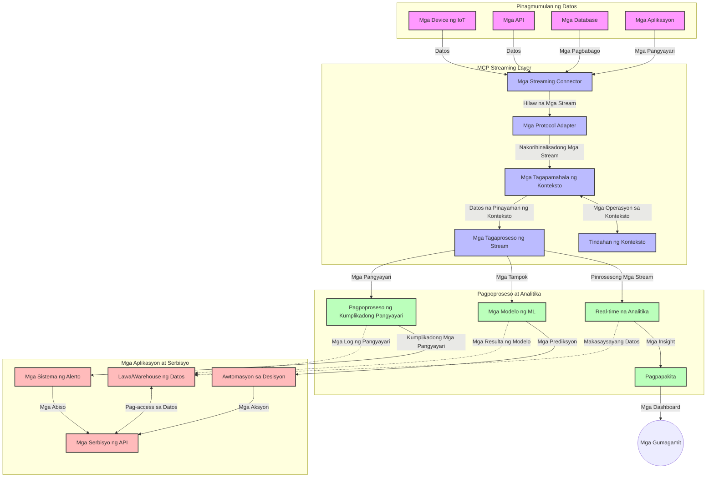

# Model Context Protocol para sa Real-Time Data Streaming

## Pangkalahatang-ideya

Ang real-time data streaming ay naging mahalaga sa mundo ngayon na pinapatakbo ng datos, kung saan kailangan ng mga negosyo at aplikasyon ang agarang access sa impormasyon upang makagawa ng napapanahong mga desisyon. Ang Model Context Protocol (MCP) ay kumakatawan sa isang mahalagang pag-unlad sa pag-optimize ng mga prosesong ito ng real-time streaming, pagpapahusay ng kahusayan sa pagproseso ng datos, pagpapanatili ng integridad ng konteksto, at pagpapabuti ng kabuuang pagganap ng sistema.

Tinutuklas ng module na ito kung paano binabago ng MCP ang real-time data streaming sa pamamagitan ng pagbibigay ng isang standardisadong pamamaraan sa pamamahala ng konteksto sa iba't ibang AI models, streaming platforms, at mga aplikasyon.

## Panimula sa Real-Time Data Streaming

Ang real-time data streaming ay isang teknolohikal na paradigma na nagbibigay-daan sa tuloy-tuloy na paglilipat, pagproseso, at pagsusuri ng datos habang ito ay nabubuo, na nagpapahintulot sa mga sistema na agad tumugon sa bagong impormasyon. Hindi tulad ng tradisyunal na batch processing na gumagana sa mga static na dataset, ang streaming ay nagpoproseso ng datos habang ito ay umaagos, naghahatid ng mga pananaw at aksyon na may minimal na delay.

### Pangunahing Konsepto ng Real-Time Data Streaming:

- **Tuloy-tuloy na Daloy ng Datos**: Ang datos ay pinoproseso bilang isang tuloy-tuloy at walang tigil na stream ng mga pangyayari o tala.
- **Mababang Latency sa Pagproseso**: Dinisenyo ang mga sistema upang mabawasan ang oras mula sa pagbuo hanggang sa pagproseso ng datos.
- **Scalability**: Kailangang kayanin ng mga streaming architecture ang nagbabagong dami at bilis ng datos.
- **Fault Tolerance**: Kailangang maging matatag ang mga sistema laban sa mga pagkakamali upang matiyak ang tuloy-tuloy na daloy ng datos.
- **Stateful Processing**: Mahalagang mapanatili ang konteksto sa buong mga pangyayari para sa makabuluhang pagsusuri.

### Ang Model Context Protocol at Real-Time Streaming

Tinutugunan ng Model Context Protocol (MCP) ang ilang mahahalagang hamon sa mga real-time streaming environment:

1. **Pagpapatuloy ng Konteksto**: Istandardisa ng MCP kung paano pinananatili ang konteksto sa mga distributed streaming components, na tinitiyak na ang AI models at processing nodes ay may access sa kaugnay na makasaysayan at pangkapaligirang konteksto.

2. **Mahusay na Pamamahala ng Estado**: Sa pamamagitan ng pagbibigay ng istrakturadong mekanismo para sa transmisyon ng konteksto, binabawasan ng MCP ang overhead ng pamamahala ng estado sa mga streaming pipeline.

3. **Interoperability**: Lumilikha ang MCP ng isang karaniwang wika para sa pagbabahagi ng konteksto sa pagitan ng iba't ibang teknolohiya ng streaming at AI models, na nagpapahintulot ng mas flexible at extensible na mga architecture.

4. **Streaming-Optimized na Konteksto**: Maaaring bigyan ng prayoridad ng mga implementasyon ng MCP kung alin sa mga elementong konteksto ang pinaka-mahalaga para sa realtime na paggawa ng desisyon, upang ma-optimize ang pagganap at katumpakan.

5. **Adaptive na Pagproseso**: Sa wastong pamamahala ng konteksto gamit ang MCP, maaaring dynamically na i-adjust ng mga streaming system ang pagproseso batay sa nagbabagong mga kondisyon at pattern sa datos.

Sa mga modernong aplikasyon mula sa mga IoT sensor network hanggang sa mga financial trading platform, ang pagsasama ng MCP sa mga teknolohiya ng streaming ay nagpapagana ng mas matalino, konteksto-may kamalayan na pagproseso na makakatugon nang angkop sa mga kumplikado at nagbabagong sitwasyon sa real time.

## Mga Layunin sa Pagkatuto

Pagkatapos ng araling ito, magagawa mong:

- Maunawaan ang mga pangunahing kaalaman sa real-time data streaming at ang mga hamon nito
- Ipaliwanag kung paano pinapalakas ng Model Context Protocol (MCP) ang real-time data streaming
- Magpatupad ng mga solusyong streaming na batay sa MCP gamit ang mga kilalang framework tulad ng Kafka at Pulsar
- Magdisenyo at mag-deploy ng fault-tolerant, mataas na pagganap na streaming architectures gamit ang MCP
- Ilapat ang mga konsepto ng MCP sa IoT, kalakalan sa pananalapi, at mga AI-driven analytics na mga kaso ng paggamit
- Suriin ang mga umuusbong na trend at hinaharap na inobasyon sa mga teknolohiyang batay sa MCP para sa streaming


### Depinisyon at Kahalagahan

Ang real-time data streaming ay kinabibilangan ng tuloy-tuloy na pagbuo, pagproseso, at paghahatid ng datos na may minimal na latency. Hindi tulad ng batch processing, kung saan ang datos ay nakokolekta at pinoproseso nang sabay-sabay, ang streaming data ay pinoproseso nang paunti-unti habang ito ay dumarating, na nagpapahintulot ng agarang mga insight at aksyon.

Mga pangunahing katangian ng real-time data streaming ay kinabibilangan ng:

- **Mababang Latency**: Pinoproseso at sinusuri ang datos sa loob ng mga millisecond hanggang segundo
- **Tuloy-tuloy na Daloy**: Walang patid na daloy ng datos mula sa iba't ibang mga pinagmulan
- **Agarang Pagproseso**: Sinusuri ang datos habang dumarating, hindi gumagamit ng batch
- **Event-Driven Architecture**: Tumugon sa mga pangyayari habang nangyayari

### Mga Hamon sa Tradisyunal na Data Streaming

Ang mga tradisyunal na pamamaraan ng data streaming ay nahaharap sa ilang limitasyon:

1. **Pagkawala ng Konteksto**: Mahirap mapanatili ang konteksto sa buong mga distributed na sistema
2. **Mga Isyu sa Scalability**: Problema sa pagpapalawak upang mapamahalaan ang mataas na volume at bilis ng datos
3. **Kumplikadong Integrasyon**: Problema sa interoperability sa pagitan ng iba't ibang sistema
4. **Pamamahala ng Latency**: Pagbabalanse ng throughput at oras ng pagproseso
5. **Konsistensya ng Datos**: Pagtitiyak ng katumpakan at kumpletong datos sa buong stream

## Pag-unawa sa Model Context Protocol (MCP)

### Ano ang MCP?

Ang Model Context Protocol (MCP) ay isang standardisadong protocol sa komunikasyon na idinisenyo upang mapadali ang mahusay na interaksyon sa pagitan ng mga AI model at aplikasyon. Sa konteksto ng real-time data streaming, nagbibigay ang MCP ng balangkas para sa:

- Pagpapanatili ng konteksto sa buong pipeline ng datos
- Standardisadong mga format ng palitan ng datos
- Pag-optimize ng transmisyon ng malalaking dataset
- Pagpapahusay ng komunikasyon ng model-to-model at model-to-application

### Pangunahing Mga Komponent at Arkitektura

Binubuo ang MCP architecture para sa real-time streaming ng ilang mahahalagang bahagi:

1. **Context Handlers**: Nangangasiwa at nagpapanatili ng impormasyong kontekstwal sa buong streaming pipeline
2. **Stream Processors**: Nagpoproseso ng papasok na data stream gamit ang mga teknik na may kamalayang konteksto
3. **Protocol Adapters**: Nagko-convert sa pagitan ng iba't ibang streaming protocol habang pinapanatili ang konteksto
4. **Context Store**: Mahusay na pag-iimbak at pagkuha ng kontekstwal na impormasyon
5. **Streaming Connectors**: Kumokonekta sa iba't ibang streaming platform (Kafka, Pulsar, Kinesis, atbp.)



### Paano Pinapabuti ng MCP ang Pag-handle ng Real-Time Data

Tinutugunan ng MCP ang mga tradisyunal na hamon sa streaming sa pamamagitan ng:

- **Integridad ng Konteksto**: Pinapanatili ang mga relasyon sa pagitan ng mga datos sa buong pipeline
- **Optimized Transmission**: Binabawasan ang redundancy sa palitan ng datos gamit ang intelihenteng pamamahala ng konteksto
- **Standardized Interfaces**: Nagbibigay ng consistent na API para sa mga streaming component
- **Pinababang Latency**: Minimize ang overhead sa pagproseso sa pamamagitan ng mahusay na paghawak ng konteksto
- **Pinahusay na Scalability**: Sinusuportahan ang horizontal scaling habang pinapanatili ang konteksto

## Integrasyon at Implementasyon

Ang mga sistema ng real-time data streaming ay nangangailangan ng maingat na disenyo ng arkitektura at implementasyon upang mapanatili ang parehong pagganap at integridad ng konteksto. Nagbibigay ang Model Context Protocol ng standardisadong paraan upang pagsamahin ang AI models at mga teknolohiya ng streaming, na nagpapahintulot sa mas sopistikadong, konteksto-may kamalayang mga processing pipeline.

### Pangkalahatang-ideya ng MCP Integration sa Streaming Architectures

Ang pagpapatupad ng MCP sa mga real-time streaming environment ay may ilang mahahalagang konsiderasyon:

1. **Context Serialization at Transport**: Nagbibigay ang MCP ng mahusay na mekanismo para sa encoding ng impormasyon ng konteksto sa loob ng mga streaming data packet, tinitiyak na ang mahalagang konteksto ay sumusunod sa datos sa buong pipeline ng pagproseso. Kasama rito ang standardisadong mga serialization format na optimized para sa streaming transport.

2. **Stateful Stream Processing**: Pinapahintulutan ng MCP ang mas intelihenteng stateful processing sa pamamagitan ng pagpapanatili ng consistent na representasyon ng konteksto sa mga processing node. Lalo na itong mahalaga sa distributed streaming architecture kung saan magiging hamon ang pamamahala ng estado.

3. **Event-Time kumpara sa Processing-Time**: Kailangang tugunan ng mga implementasyon ng MCP sa streaming systems ang karaniwang hamon ng pag-diferensiya kung kailan naganap ang mga pangyayari at kung kailan ito pinoproseso. Maaaring isama ng protocol ang temporal na konteksto na nagpapanatili ng event time semantics.

4. **Pamamahala ng Backpressure**: Sa pamamagitan ng standardisadong paghawak ng konteksto, tinutulungan ng MCP na pamahalaan ang backpressure sa streaming system, na nagpapahintulot sa mga component na iparating ang kanilang kapasidad sa pagproseso at i-adjust ang daloy ng datos nang naaayon.

5. **Context Windowing at Aggregation**: Pinapayagan ng MCP ang mas sopistikadong mga operasyon ng windowing sa pamamagitan ng pagbibigay ng istrakturadong representasyon ng temporal at relational na mga konteksto, na nagpapahintulot ng mas makabuluhang aggregation sa mga event stream.

6. **Exactly-Once Processing**: Sa mga streaming system na nangangailangan ng exactly-once semantics, maaaring isama ng MCP ang processing metadata upang makatulong sa pagsubaybay at pagpapatunay ng status ng pagproseso sa mga distributed component.

Ang implementasyon ng MCP sa iba't ibang teknolohiya ng streaming ay lumilikha ng pinag-isang pamamaraan sa pamamahala ng konteksto, na nagpapababa ng pangangailangan para sa custom integration code habang pinapalakas ang kakayahan ng sistema na mapanatili ang makabuluhang konteksto habang dumadaloy ang datos sa pipeline.

### MCP sa Iba't Ibang Framework ng Data Streaming

Ang mga halimbawang ito ay sumusunod sa kasalukuyang MCP specification na nakatuon sa JSON-RPC based na protocol na may iba't ibang mekanismo ng transport. Ipinapakita ng code kung paano mo maipapatupad ang custom transports na nag-iintegrate ng streaming platform tulad ng Kafka at Pulsar habang pinananatili ang buong compatibility sa MCP protocol.

Dinisenyo ang mga halimbawa upang ipakita kung paano maaring isama ang mga streaming platform gamit ang MCP upang magbigay ng real-time data processing habang pinapanatili ang kamalayan sa konteksto na sentro sa MCP. Pinatitiyak ng pamamaraang ito na ang mga code sample ay tumpak na sumasalamin sa kasalukuyang estado ng MCP specification noong Hunyo 2025.

Maaaring isama ang MCP sa mga popular na streaming framework tulad ng:

#### Apache Kafka Integration

```python
import asyncio
import json
from typing import Dict, Any, Optional
from confluent_kafka import Consumer, Producer, KafkaError
from mcp.client import Client, ClientCapabilities
from mcp.core.message import JsonRpcMessage
from mcp.core.transports import Transport

# Pasadyang klase ng transport upang pag-ugnayin ang MCP sa Kafka
class KafkaMCPTransport(Transport):
    def __init__(self, bootstrap_servers: str, input_topic: str, output_topic: str):
        self.bootstrap_servers = bootstrap_servers
        self.input_topic = input_topic
        self.output_topic = output_topic
        self.producer = Producer({'bootstrap.servers': bootstrap_servers})
        self.consumer = Consumer({
            'bootstrap.servers': bootstrap_servers,
            'group.id': 'mcp-client-group',
            'auto.offset.reset': 'earliest'
        })
        self.message_queue = asyncio.Queue()
        self.running = False
        self.consumer_task = None
        
    async def connect(self):
        """Connect to Kafka and start consuming messages"""
        self.consumer.subscribe([self.input_topic])
        self.running = True
        self.consumer_task = asyncio.create_task(self._consume_messages())
        return self
        
    async def _consume_messages(self):
        """Background task to consume messages from Kafka and queue them for processing"""
        while self.running:
            try:
                msg = self.consumer.poll(1.0)
                if msg is None:
                    await asyncio.sleep(0.1)
                    continue
                
                if msg.error():
                    if msg.error().code() == KafkaError._PARTITION_EOF:
                        continue
                    print(f"Consumer error: {msg.error()}")
                    continue
                
                # I-parse ang halaga ng mensahe bilang JSON-RPC
                try:
                    message_str = msg.value().decode('utf-8')
                    message_data = json.loads(message_str)
                    mcp_message = JsonRpcMessage.from_dict(message_data)
                    await self.message_queue.put(mcp_message)
                except Exception as e:
                    print(f"Error parsing message: {e}")
            except Exception as e:
                print(f"Error in consumer loop: {e}")
                await asyncio.sleep(1)
    
    async def read(self) -> Optional[JsonRpcMessage]:
        """Read the next message from the queue"""
        try:
            message = await self.message_queue.get()
            return message
        except Exception as e:
            print(f"Error reading message: {e}")
            return None
    
    async def write(self, message: JsonRpcMessage) -> None:
        """Write a message to the Kafka output topic"""
        try:
            message_json = json.dumps(message.to_dict())
            self.producer.produce(
                self.output_topic,
                message_json.encode('utf-8'),
                callback=self._delivery_report
            )
            self.producer.poll(0)  # I-trigger ang mga callback
        except Exception as e:
            print(f"Error writing message: {e}")
    
    def _delivery_report(self, err, msg):
        """Kafka producer delivery callback"""
        if err is not None:
            print(f'Message delivery failed: {err}')
        else:
            print(f'Message delivered to {msg.topic()} [{msg.partition()}]')
    
    async def close(self) -> None:
        """Close the transport"""
        self.running = False
        if self.consumer_task:
            self.consumer_task.cancel()
            try:
                await self.consumer_task
            except asyncio.CancelledError:
                pass
        self.consumer.close()
        self.producer.flush()

# Halimbawa ng paggamit ng Kafka MCP transport
async def kafka_mcp_example():
    # Gumawa ng MCP client na may Kafka transport
    client = Client(
        {"name": "kafka-mcp-client", "version": "1.0.0"},
        ClientCapabilities({})
    )
    
    # Gumawa at ikonekta ang Kafka transport
    transport = KafkaMCPTransport(
        bootstrap_servers="localhost:9092",
        input_topic="mcp-responses",
        output_topic="mcp-requests"
    )
    
    await client.connect(transport)
    
    try:
        # Simulan ang sesyon ng MCP
        await client.initialize()
        
        # Halimbawa ng pagpapatupad ng tool sa pamamagitan ng MCP
        response = await client.execute_tool(
            "process_data",
            {
                "data": "sample data",
                "metadata": {
                    "source": "sensor-1",
                    "timestamp": "2025-06-12T10:30:00Z"
                }
            }
        )
        
        print(f"Tool execution response: {response}")
        
        # Malinis na pagsasara
        await client.shutdown()
    finally:
        await transport.close()

# Patakbuhin ang halimbawa
if __name__ == "__main__":
    asyncio.run(kafka_mcp_example())
```

#### Apache Pulsar Implementation

```python
import asyncio
import json
import pulsar
from typing import Dict, Any, Optional
from mcp.core.message import JsonRpcMessage
from mcp.core.transports import Transport
from mcp.server import Server, ServerOptions
from mcp.server.tools import Tool, ToolExecutionContext, ToolMetadata

# Lumikha ng pasadyang MCP transport na gumagamit ng Pulsar
class PulsarMCPTransport(Transport):
    def __init__(self, service_url: str, request_topic: str, response_topic: str):
        self.service_url = service_url
        self.request_topic = request_topic
        self.response_topic = response_topic
        self.client = pulsar.Client(service_url)
        self.producer = self.client.create_producer(response_topic)
        self.consumer = self.client.subscribe(
            request_topic,
            "mcp-server-subscription",
            consumer_type=pulsar.ConsumerType.Shared
        )
        self.message_queue = asyncio.Queue()
        self.running = False
        self.consumer_task = None
    
    async def connect(self):
        """Connect to Pulsar and start consuming messages"""
        self.running = True
        self.consumer_task = asyncio.create_task(self._consume_messages())
        return self
    
    async def _consume_messages(self):
        """Background task to consume messages from Pulsar and queue them for processing"""
        while self.running:
            try:
                # Hindi nagba-block na pagtanggap na may timeout
                msg = self.consumer.receive(timeout_millis=500)
                
                # Iproseso ang mensahe
                try:
                    message_str = msg.data().decode('utf-8')
                    message_data = json.loads(message_str)
                    mcp_message = JsonRpcMessage.from_dict(message_data)
                    await self.message_queue.put(mcp_message)
                    
                    # Kumpirmahin ang pagtanggap ng mensahe
                    self.consumer.acknowledge(msg)
                except Exception as e:
                    print(f"Error processing message: {e}")
                    # Hindi pagkumpirma kung nagkaroon ng error
                    self.consumer.negative_acknowledge(msg)
            except Exception as e:
                # Pangasiwaan ang timeout o iba pang mga eksepsyon
                await asyncio.sleep(0.1)
    
    async def read(self) -> Optional[JsonRpcMessage]:
        """Read the next message from the queue"""
        try:
            message = await self.message_queue.get()
            return message
        except Exception as e:
            print(f"Error reading message: {e}")
            return None
    
    async def write(self, message: JsonRpcMessage) -> None:
        """Write a message to the Pulsar output topic"""
        try:
            message_json = json.dumps(message.to_dict())
            self.producer.send(message_json.encode('utf-8'))
        except Exception as e:
            print(f"Error writing message: {e}")
    
    async def close(self) -> None:
        """Close the transport"""
        self.running = False
        if self.consumer_task:
            self.consumer_task.cancel()
            try:
                await self.consumer_task
            except asyncio.CancelledError:
                pass
        self.consumer.close()
        self.producer.close()
        self.client.close()

# Tukuyin ang isang sample na MCP tool na nagpoproseso ng streaming data
@Tool(
    name="process_streaming_data",
    description="Process streaming data with context preservation",
    metadata=ToolMetadata(
        required_capabilities=["streaming"]
    )
)
async def process_streaming_data(
    ctx: ToolExecutionContext,
    data: str,
    source: str,
    priority: str = "medium"
) -> Dict[str, Any]:
    """
    Process streaming data while preserving context
    
    Args:
        ctx: Tool execution context
        data: The data to process
        source: The source of the data
        priority: Priority level (low, medium, high)
        
    Returns:
        Dict containing processed results and context information
    """
    # Halimbawang pagproseso na gumagamit ng MCP context
    print(f"Processing data from {source} with priority {priority}")
    
    # I-access ang context ng pag-uusap mula sa MCP
    conversation_id = ctx.conversation_id if hasattr(ctx, 'conversation_id') else "unknown"
    
    # Ibalik ang mga resulta na may pinahusay na context
    return {
        "processed_data": f"Processed: {data}",
        "context": {
            "conversation_id": conversation_id,
            "source": source,
            "priority": priority,
            "processing_timestamp": ctx.get_current_time_iso()
        }
    }

# Halimbawa ng implementasyon ng MCP server gamit ang Pulsar transport
async def run_mcp_server_with_pulsar():
    # Lumikha ng MCP server
    server = Server(
        {"name": "pulsar-mcp-server", "version": "1.0.0"},
        ServerOptions(
            capabilities={"streaming": True}
        )
    )
    
    # Irehistro ang aming tool
    server.register_tool(process_streaming_data)
    
    # Lumikha at kumonekta ng Pulsar transport
    transport = PulsarMCPTransport(
        service_url="pulsar://localhost:6650",
        request_topic="mcp-requests",
        response_topic="mcp-responses"
    )
    
    try:
        # Simulan ang server gamit ang Pulsar transport
        await server.run(transport)
    finally:
        await transport.close()

# Patakbuhin ang server
if __name__ == "__main__":
    asyncio.run(run_mcp_server_with_pulsar())
```

### Mga Pinakamahusay na Praktis sa Deployment

Kapag nagpapatupad ng MCP para sa real-time streaming:

1. **Disenyo para sa Fault Tolerance**:
   - Magpatupad ng tamang error handling
   - Gumamit ng dead-letter queues para sa mga nabigong mensahe
   - Magdisenyo ng idempotent processors

2. **I-optimize para sa Pagganap**:
   - I-configure ang angkop na laki ng buffer
   - Gumamit ng batching kung naaangkop
   - Magpatupad ng mekanismo para sa backpressure

3. **Mag-monitor at Mag-obserba**:
   - Subaybayan ang mga metrics sa stream processing
   - I-monitor ang propagation ng konteksto
   - Mag-set up ng mga alerto para sa anomalies

4. **Seguraduhin ang Iyong Mga Stream**:
   - Magpatupad ng encryption para sa sensitibong datos
   - Gumamit ng authentication at authorization
   - Mag-apply ng angkop na access controls


### MCP sa IoT at Edge Computing

Pinapahusay ng MCP ang IoT streaming sa pamamagitan ng:

- Pagpapanatili ng konteksto ng device sa buong processing pipeline
- Pagpapahintulot ng mahusay na edge-to-cloud na streaming ng datos
- Pagsuporta sa real-time analytics sa mga IoT data stream
- Pagpapadali ng device-to-device na komunikasyon na kasama ang konteksto

Halimbawa: Smart City Sensor Networks
```
Sensors → Edge Gateways → MCP Stream Processors → Real-time Analytics → Automated Responses
```

### Papel sa Mga Transaksyong Pinansiyal at High-Frequency Trading

Nagbibigay ang MCP ng mahahalagang benepisyo para sa financial data streaming:

- Ultra-mababang latency sa pagproseso para sa desisyon sa trading
- Pagpapanatili ng transaction context sa buong proseso
- Pagsuporta sa complex event processing na may kamalayang konteksto
- Pagtitiyak ng konsistensya ng datos sa mga distributed trading system

### Pagpapahusay ng AI-Driven Data Analytics

Lumilikha ang MCP ng mga bagong posibilidad para sa streaming analytics:

- Real-time na pagsasanay at inference ng modelo
- Tuloy-tuloy na pagkatuto mula sa streaming data
- Pagkuha ng feature na may kamalayang konteksto
- Multi-model inference pipelines na may pinanatiling konteksto

## Mga Hinaharap na Trend at Inobasyon

### Ebolusyon ng MCP sa Real-Time Environment

Sa hinaharap, inaasahan nating paunlarin pa ang MCP upang matugunan ang:

- **Quantum Computing Integration**: Paghahanda para sa mga quantum-based streaming system
- **Edge-Native Processing**: Ilipat ang mas maraming konteksto-may kamalayang pagproseso sa mga edge device
- **Autonomous Stream Management**: Mga streaming pipeline na nag-o-optimize ng sarili
- **Federated Streaming**: Distributed na pagproseso habang pinapanatili ang privacy

### Mga Posibleng Paunlarin sa Teknolohiya

Mga sumusulpot na teknolohiya na huhubog sa hinaharap ng MCP streaming:

1. **AI-Optimized Streaming Protocols**: Mga custom na protocol na idinisenyo para sa AI workloads
2. **Neuromorphic Computing Integration**: Brain-inspired computing para sa stream processing
3. **Serverless Streaming**: Event-driven, scalable streaming nang walang pangangasiwa ng imprastruktura
4. **Distributed Context Stores**: Global na distributed ngunit mataas ang consistency sa pamamahala ng konteksto

## Mga Hands-On na Ehersisyo

### Ehersisyo 1: Pagsasaayos ng Basic MCP Streaming Pipeline

Sa ehersisyong ito, matututunan mong:
- I-configure ang basic na MCP streaming environment
- Magpatupad ng mga context handler para sa stream processing
- Subukan at patunayan ang pagpapanatili ng konteksto

### Ehersisyo 2: Pagbuo ng Real-Time Analytics Dashboard

Gumawa ng buong aplikasyon na:
- Nagsasala ng streaming data gamit ang MCP
- Nagpoproseso ng stream habang pinananatili ang konteksto
- Nagpapakita ng mga resulta nang real-time

### Ehersisyo 3: Pagpapatupad ng Complex Event Processing gamit ang MCP

Advanced na ehersisyo na sumasaklaw sa:
- Pagtuklas ng pattern sa mga stream
- Pagkakaugnay-ugnay ng konteksto sa iba't ibang stream
- Pagbuo ng mga complex event na may pinanatiling konteksto

## Karagdagang mga Sanggunian

- [Model Context Protocol Specification](https://modelcontextprotocol.io) - Opisyal na MCP specification at dokumentasyon
- [Apache Kafka Documentation](https://kafka.apache.org/documentation/) - Matuto tungkol sa Kafka para sa stream processing
- [Apache Pulsar](https://pulsar.apache.org/) - Unified messaging at streaming platform
- [Streaming Systems: The What, Where, When, and How of Large-Scale Data Processing](https://www.oreilly.com/library/view/streaming-systems/9781491983867/) - Komprehensibong libro tungkol sa streaming architecture
- [Microsoft Azure Event Hubs](https://learn.microsoft.com/azure/event-hubs/event-hubs-about) - Managed event streaming service
- [MLflow Documentation](https://mlflow.org/docs/latest/index.html) - Para sa ML model tracking at deployment
- [Real-Time Analytics with Apache Storm](https://storm.apache.org/releases/current/index.html) - Processing framework para sa real-time computation
- [Flink ML](https://nightlies.apache.org/flink/flink-ml-docs-master/) - Machine learning library para sa Apache Flink
- [LangChain Documentation](https://python.langchain.com/docs/get_started/introduction) - Pagbuo ng aplikasyon gamit ang LLMs


## Mga Kinalabasan sa Pagkatuto

Sa pagtapos ng module na ito, magagawa mong:

- Maunawaan ang mga pangunahing kaalaman sa real-time data streaming at ang mga hamon nito
- Ipaliwanag kung paano pinapalakas ng Model Context Protocol (MCP) ang real-time data streaming
- Magpatupad ng mga solusyong streaming na batay sa MCP gamit ang mga kilalang framework tulad ng Kafka at Pulsar
- Magdisenyo at mag-deploy ng fault-tolerant, mataas na pagganap na streaming architectures gamit ang MCP
- Ilapat ang mga konsepto ng MCP sa IoT, kalakalan sa pananalapi, at mga AI-driven analytics na mga kaso ng paggamit
- Suriin ang mga umuusbong na trend at hinaharap na inobasyon sa mga teknolohiyang batay sa MCP para sa streaming

## Ano ang susunod

- [5.11 Realtime Search](../mcp-realtimesearch/README.md)

---

<!-- CO-OP TRANSLATOR DISCLAIMER START -->
**Pagtatanggi**:
Ang dokumentong ito ay isinalin gamit ang serbisyo ng AI translation na [Co-op Translator](https://github.com/Azure/co-op-translator). Bagama't nagsusumikap kami para sa katumpakan, pakatandaan na ang awtomatikong pagsasalin ay maaaring maglaman ng mga pagkakamali o hindi pagkakatugma. Ang orihinal na dokumento sa orihinal nitong wika ang dapat ituring na pangunahing sanggunian. Para sa mahahalagang impormasyon, inirerekomenda ang propesyonal na pagsasalin ng tao. Hindi kami mananagot sa anumang maling pagkakaintindi o maling interpretasyon na nagmula sa paggamit ng pagsasaling ito.
<!-- CO-OP TRANSLATOR DISCLAIMER END -->