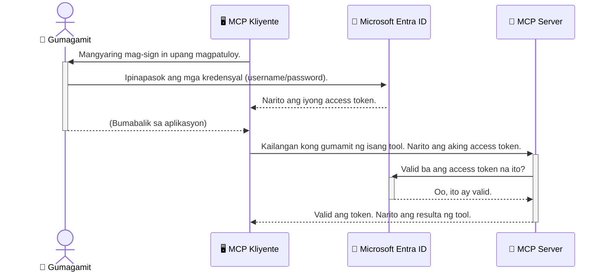

# Pagpapatibay sa mga AI Workflow: Entra ID Authentication para sa Model Context Protocol Servers

## Panimula
Ang pagpapatibay sa iyong Model Context Protocol (MCP) server ay kasinghalaga ng pagtakip ng pinto ng iyong bahay. Kapag iniwan mong bukas ang iyong MCP server, inilalantad mo ang iyong mga kasangkapan at datos sa hindi awtorisadong pag-access, na maaaring magdulot ng mga paglabag sa seguridad. Nagbibigay ang Microsoft Entra ID ng matatag na cloud-based na solusyon para sa identity at access management, na tumutulong upang matiyak na tanging mga awtorisadong gumagamit at aplikasyon lamang ang maaaring makipag-ugnayan sa iyong MCP server. Sa seksyong ito, matututuhan mo kung paano protektahan ang iyong mga AI workflow gamit ang Entra ID authentication.

## Mga Layunin sa Pagkatuto
Sa pagtatapos ng seksyong ito, magagawa mong:

- Maunawaan ang kahalagahan ng pagpapatibay sa MCP servers.
- Ipaliwanag ang mga batayan ng Microsoft Entra ID at OAuth 2.0 authentication.
- Makilala ang pagkakaiba ng mga public at confidential clients.
- Ipatupad ang Entra ID authentication sa lokal (public client) at remote (confidential client) na mga senaryo ng MCP server.
- Ilapat ang mga pinakamahusay na kasanayan sa seguridad habang nagde-develop ng mga AI workflow.

## Seguridad at MCP

Tulad ng hindi mo ipag-iiwanang bukas ang pinto ng iyong bahay, hindi mo rin dapat iwanang bukas ang iyong MCP server para sa sinumang makaka-access. Mahalaga ang pagpapatibay sa iyong mga AI workflow para makabuo ng matatag, mapagkakatiwalaan, at ligtas na mga aplikasyon. Ipapakilala sa kabanatang ito ang paggamit ng Microsoft Entra ID upang patibayin ang iyong MCP servers, na tinitiyak na tanging mga awtorisadong gumagamit at aplikasyon ang makaka-interact sa iyong mga kasangkapan at datos.

## Bakit Mahalaga ang Seguridad para sa MCP Servers

Isipin na ang iyong MCP server ay may kagamitan na maaaring magpadala ng mga email o makakuha ng access sa isang customer database. Ang isang hindi pinatibay na server ay nangangahulugang kahit sino ay maaaring gamitin ang kagamitang iyon, na maaaring magresulta sa hindi awtorisadong pag-access sa datos, spam, o iba pang malisyosong gawain.

Sa pagpapatupad ng authentication, sinisiguro mong bawat kahilingan sa iyong server ay beripikado, kinukumpirma ang pagkakakilanlan ng gumagamit o aplikasyon na gumagawa ng kahilingan. Ito ang pinakauna at pinakamahalagang hakbang sa pagpapatibay ng iyong mga AI workflow.

## Panimula sa Microsoft Entra ID

[**Microsoft Entra ID**](https://adoption.microsoft.com/microsoft-security/entra/) ay isang cloud-based na serbisyo para sa identity at access management. Isipin ito bilang isang unibersal na guwardiya para sa iyong mga aplikasyon. Hinahandle nito ang komplikadong proseso ng pagpapatunay ng pagkakakilanlan ng gumagamit (authentication) at pagtukoy kung ano ang pinahihintulutan nilang gawin (authorization).

Sa paggamit ng Entra ID, maaari kang:

- Paganahin ang secure na pag-sign-in para sa mga gumagamit.
- Protektahan ang mga API at serbisyo.
- Pangasiwaan ang mga polisiya sa access mula sa isang sentralisadong lugar.

Para sa mga MCP server, nagbibigay ang Entra ID ng matatag at malawak na pinagkakatiwalaang solusyon para pamahalaan kung sino ang maaaring makagamit ng mga kakayahan ng iyong server.

---

## Pag-unawa sa Mahika: Paano Gumagana ang Entra ID Authentication

Gumagamit ang Entra ID ng mga open standard tulad ng **OAuth 2.0** para pangasiwaan ang authentication. Bagaman maaaring maging kumplikado ang mga detalye, simple lamang ang pangunahing konsepto na maaaring ipaliwanag gamit ang isang halimbawa.

### Isang Banayad na Panimula sa OAuth 2.0: Ang Valet Key

Isipin ang OAuth 2.0 bilang isang valet service para sa iyong sasakyan. Kapag dumating ka sa isang restawran, hindi mo ibibigay sa valet ang iyong master key. Sa halip, bibigyan mo siya ng **valet key** na may limitadong mga pahintulot—maaari nitong paandarin ang kotse at isara ang mga pinto, ngunit hindi nito mabubuksan ang trunk o glove compartment.

Sa ganitong halimbawa:

- **Ikaw** ang **User**.
- **Ang iyong kotse** ang **MCP Server** na may mahahalagang kasangkapan at datos.
- Ang **Valet** ay ang **Microsoft Entra ID**.
- Ang **Parking Attendant** ay ang **MCP Client** (ang aplikasyon na sumusubok na ma-access ang server).
- Ang **Valet Key** ay ang **Access Token**.

Ang access token ay isang ligtas na string ng teksto na natatanggap ng MCP client mula sa Entra ID pagkatapos mong mag-sign in. Ipinapakita ng kliyente ang token na ito sa MCP server sa bawat kahilingan. Maaari ng server na beripikahin ang token upang matiyak na ang kahilingan ay lehitimo at na ang kliyente ay may kinakailangang pahintulot, lahat nang hindi kailangang hawakan ang iyong tunay na kredensyal (tulad ng password).

### Ang Daloy ng Authentication

Ganito gumagana ang proseso sa aktwal na aplikasyon:



### Pagpapakilala sa Microsoft Authentication Library (MSAL)

Bago tayo lumalim sa code, mahalagang ipakilala ang isang pangunahing sangkap na makikita mo sa mga halimbawa: ang **Microsoft Authentication Library (MSAL)**.

Ang MSAL ay isang library na binuo ng Microsoft na nagpapadali sa mga developer na pamahalaan ang authentication. Sa halip na ikaw ang magsulat ng lahat ng kumplikadong code para pangasiwaan ang mga security token, pamahalaan ang pag-sign-in, at i-refresh ang mga sesyon, ang MSAL na ang nag-aasikaso ng mga ito.

Inirerekomenda na gamitin ang library tulad ng MSAL dahil:

- **Ligtas ito:** Nakapaloob dito ang mga industry-standard na protocol at pinakamahusay na kasanayan sa seguridad, na nagpapababa ng panganib ng mga kahinaan sa iyong code.
- **Pinapadali ang Pag-unlad:** Nilalayo nito ang kumplikadong proseso ng OAuth 2.0 at OpenID Connect upang makapagdagdag ka ng matatag na authentication sa iyong aplikasyon gamit lamang ang ilang linya ng code.
- **Pinananatili ito:** Aktibong inaalagaan at ina-update ng Microsoft ang MSAL upang tugunan ang mga bagong banta sa seguridad at pagbabago sa platform.

Sinusuportahan ng MSAL ang malawak na hanay ng mga wika at framework ng aplikasyon, kabilang ang .NET, JavaScript/TypeScript, Python, Java, Go, at mga mobile platform tulad ng iOS at Android. Nangangahulugan ito na maaari mong gamitin ang pare-parehong mga pattern ng authentication sa buong stack ng iyong teknolohiya.

Para matuto pa tungkol sa MSAL, maaari mong bisitahin ang opisyal na [MSAL overview documentation](https://learn.microsoft.com/entra/identity-platform/msal-overview).

---

## Pagpapatibay ng Iyong MCP Server gamit ang Entra ID: Isang Hakbang-hakbang na Gabay

Ngayon, tingnan natin kung paano patibayin ang isang lokal na MCP server (isang server na nakikipag-usap gamit ang `stdio`) gamit ang Entra ID. Ang halimbawang ito ay gumagamit ng **public client**, na angkop para sa mga aplikasyon na tumatakbo sa makina ng gumagamit, tulad ng isang desktop app o lokal na development server.

### Senaryo 1: Pagpapatibay ng Lokal na MCP Server (gamit ang Public Client)

Sa senaryong ito, titingnan natin ang isang MCP server na tumatakbo nang lokal, nakikipag-ugnayan gamit ang `stdio`, at ginagamit ang Entra ID para i-authenticate ang gumagamit bago payagan itong ma-access ang mga kasangkapan nito. Magkakaroon ang server ng isang tool na kumukuha ng impormasyon ng profile ng gumagamit mula sa Microsoft Graph API.

#### 1. Pag-setup ng Aplikasyon sa Entra ID

Bago sumulat ng anumang code, kailangan mong irehistro ang iyong aplikasyon sa Microsoft Entra ID. Sinasabi nito sa Entra ID tungkol sa iyong aplikasyon at nagbibigay ito ng pahintulot na gamitin ang authentication service.

1. Pumunta sa **[Microsoft Entra portal](https://entra.microsoft.com/)**.
2. Pumunta sa **App registrations** at i-click ang **New registration**.
3. Bigyan ng pangalan ang iyong aplikasyon (halimbawa, "My Local MCP Server").
4. Para sa **Supported account types**, piliin ang **Accounts in this organizational directory only**.
5. Maaari mong iwanang blangko ang **Redirect URI** para sa halimbawang ito.
6. I-click ang **Register**.

Kapag nairehistro na, tandaan ang **Application (client) ID** at **Directory (tenant) ID**. Kakailanganin mo ito sa iyong code.

#### 2. Ang Code: Isang Pagsusuri

Tingnan natin ang mahahalagang bahagi ng code na humahawak sa authentication. Ang buong code ng halimbawang ito ay matatagpuan sa folder na [Entra ID - Local - WAM](https://github.com/Azure-Samples/mcp-auth-servers/tree/main/src/entra-id-local-wam) ng [mcp-auth-servers GitHub repository](https://github.com/Azure-Samples/mcp-auth-servers).

**`AuthenticationService.cs`**

Ang klase na ito ang responsable sa pakikipag-ugnayan sa Entra ID.

- **`CreateAsync`**: Inilulunsad nito ang `PublicClientApplication` mula sa MSAL (Microsoft Authentication Library). Nakakonfigura ito gamit ang `clientId` at `tenantId` ng iyong aplikasyon.
- **`WithBroker`**: Pinapagana nito ang paggamit ng broker (tulad ng Windows Web Account Manager), na nagbibigay ng mas ligtas at mahirap palitang single sign-on experience.
- **`AcquireTokenAsync`**: Ito ang pangunahing pamamaraan. Pinipilit nitong kumuha muna ng token nang tahimik (silent), kung saan hindi na kailangang mag-sign in ang user kung may valid na session. Kung hindi makakuha ng silent token, ipapa-interactive nito ang user upang mag-sign in.

```csharp
// Simplified for clarity
public static async Task<AuthenticationService> CreateAsync(ILogger<AuthenticationService> logger)
{
    var msalClient = PublicClientApplicationBuilder
        .Create(_clientId) // Your Application (client) ID
        .WithAuthority(AadAuthorityAudience.AzureAdMyOrg)
        .WithTenantId(_tenantId) // Your Directory (tenant) ID
        .WithBroker(new BrokerOptions(BrokerOptions.OperatingSystems.Windows))
        .Build();

    // ... cache registration ...

    return new AuthenticationService(logger, msalClient);
}

public async Task<string> AcquireTokenAsync()
{
    try
    {
        // Try silent authentication first
        var accounts = await _msalClient.GetAccountsAsync();
        var account = accounts.FirstOrDefault();

        AuthenticationResult? result = null;

        if (account != null)
        {
            result = await _msalClient.AcquireTokenSilent(_scopes, account).ExecuteAsync();
        }
        else
        {
            // If no account, or silent fails, go interactive
            result = await _msalClient.AcquireTokenInteractive(_scopes).ExecuteAsync();
        }

        return result.AccessToken;
    }
    catch (Exception ex)
    {
        _logger.LogError(ex, "An error occurred while acquiring the token.");
        throw; // Optionally rethrow the exception for higher-level handling
    }
}
```

**`Program.cs`**

Dito isinasaayos ang MCP server at isinama ang authentication service.

- **`AddSingleton<AuthenticationService>`**: Ibinibigay nito ang `AuthenticationService` sa dependency injection container upang magamit ito ng ibang bahagi ng aplikasyon (tulad ng ating tool).
- **Tool na `GetUserDetailsFromGraph`**: Nangangailangan ito ng instance ng `AuthenticationService`. Bago ito gumawa ng anumang aksyon, tinatawag nito ang `authService.AcquireTokenAsync()` upang makakuha ng valid na access token. Kapag matagumpay ang authentication, ginagamit nito ang token para tumawag sa Microsoft Graph API at kunin ang mga detalye ng user.

```csharp
// Simplified for clarity
[McpServerTool(Name = "GetUserDetailsFromGraph")]
public static async Task<string> GetUserDetailsFromGraph(
    AuthenticationService authService)
{
    try
    {
        // This will trigger the authentication flow
        var accessToken = await authService.AcquireTokenAsync();

        // Use the token to create a GraphServiceClient
        var graphClient = new GraphServiceClient(
            new BaseBearerTokenAuthenticationProvider(new TokenProvider(authService)));

        var user = await graphClient.Me.GetAsync();

        return System.Text.Json.JsonSerializer.Serialize(user);
    }
    catch (Exception ex)
    {
        return $"Error: {ex.Message}";
    }
}
```

#### 3. Paano Lahat ay Nagtutulungan

1. Kapag sinubukan ng MCP client gamitin ang tool na `GetUserDetailsFromGraph`, tinatawag muna ng tool ang `AcquireTokenAsync`.
2. Sinusubukan ng `AcquireTokenAsync` na hanapin sa MSAL library ang isang valid na token.
3. Kung walang token, hihilingin ng MSAL, sa pamamagitan ng broker, ang user na mag-sign in gamit ang kanilang Entra ID account.
4. Kapag nakapag-sign in ang user, magbibigay ang Entra ID ng access token.
5. Tatanggapin ng tool ang token at gagamitin ito para tumawag nang ligtas sa Microsoft Graph API.
6. Ibinabalik ang mga detalye ng user sa MCP client.

Pinapangalagaan nito na tanging mga na-authenticate na gumagamit lamang ang makakagamit ng tool, epektibong pinatitibay ang iyong lokal na MCP server.

### Senaryo 2: Pagpapatibay ng Remote MCP Server (gamit ang Confidential Client)

Kapag ang iyong MCP server ay tumatakbo sa isang remote machine (tulad ng cloud server) at nakikipag-ugnayan gamit ang protocol na tulad ng HTTP Streaming, magkaiba ang mga pangangailangan sa seguridad. Sa kasong ito, dapat kang gumamit ng **confidential client** at ang **Authorization Code Flow**. Ito ay mas ligtas na paraan dahil ang mga sikreto ng aplikasyon ay hindi naipapakita sa browser.

Gumagamit ang halimbawang ito ng TypeScript-based MCP server na tumatakbo gamit ang Express.js para humawak ng mga HTTP request.

#### 1. Pag-setup ng Aplikasyon sa Entra ID

Katulad ng setup sa public client, ngunit may isang mahalagang pagkakaiba: kailangan mong gumawa ng **client secret**.

1. Pumunta sa **[Microsoft Entra portal](https://entra.microsoft.com/)**.
2. Sa iyong app registration, pumunta sa tab na **Certificates & secrets**.
3. I-click ang **New client secret**, bigyan ng paglalarawan, at i-click ang **Add**.
4. **Mahalaga:** Kopyahin agad ang value ng secret. Hindi mo na ito muling makikita.
5. Kailangan mo ring mag-configure ng **Redirect URI**. Pumunta sa tab na **Authentication**, i-click ang **Add a platform**, piliin ang **Web**, at ilagay ang redirect URI para sa iyong aplikasyon (halimbawa, `http://localhost:3001/auth/callback`).

> **⚠️ Mahalagang Paalala sa Seguridad:** Para sa mga produksyon na aplikasyon, mariing inirerekomenda ng Microsoft ang paggamit ng **secretless authentication** na mga pamamaraan tulad ng **Managed Identity** o **Workload Identity Federation** sa halip na client secrets. Ang client secrets ay nagdudulot ng panganib sa seguridad dahil maaari silang malantad o makompromiso. Nagbibigay ang managed identities ng mas ligtas na pamamaraan sa pamamagitan ng pag-aalis ng pangangailangan na itago ang mga kredensyal sa iyong code o configuration.
>
> Para sa karagdagang impormasyon tungkol sa managed identities at paano ito ipinatutupad, tingnan ang [Managed identities for Azure resources overview](https://learn.microsoft.com/entra/identity/managed-identities-azure-resources/overview).

#### 2. Ang Code: Isang Pagsusuri

Gumagamit ang halimbawang ito ng session-based na paraan. Kapag nag-authenticate ang user, iniimbak ng server ang access token at refresh token sa isang session at binibigyan ang user ng session token. Ang token na ito ang gagamitin sa mga susunod na kahilingan. Ang buong code ng halimbawang ito ay makikita sa folder na [Entra ID - Confidential client](https://github.com/Azure-Samples/mcp-auth-servers/tree/main/src/entra-id-cca-session) ng [mcp-auth-servers GitHub repository](https://github.com/Azure-Samples/mcp-auth-servers).

**`Server.ts`**

Dito inaayos ang Express server at ang MCP transport layer.

- **`requireBearerAuth`**: Ito ay middleware na nagpoprotekta sa endpoints na `/sse` at `/message`. Sinusuri nito kung may valid na bearer token sa `Authorization` header ng kahilingan.
- **`EntraIdServerAuthProvider`**: Isang custom na klase na nagpapatupad ng `McpServerAuthorizationProvider` interface. Responsable ito sa paghawak ng OAuth 2.0 flow.
- **`/auth/callback`**: Endpoint na humahawak sa redirect mula sa Entra ID pagkatapos mag-authenticate ang user. Pinapalitan nito ang authorization code ng access token at refresh token.

```typescript
// Pinadali para sa kalinawan
const app = express();
const { server } = createServer();
const provider = new EntraIdServerAuthProvider();

// Protektahan ang SSE endpoint
app.get("/sse", requireBearerAuth({
  provider,
  requiredScopes: ["User.Read"]
}), async (req, res) => {
  // ... kumonekta sa transportasyon ...
});

// Protektahan ang endpoint ng mensahe
app.post("/message", requireBearerAuth({
  provider,
  requiredScopes: ["User.Read"]
}), async (req, res) => {
  // ... hawakan ang mensahe ...
});

// Pangalagaan ang callback ng OAuth 2.0
app.get("/auth/callback", (req, res) => {
  provider.handleCallback(req.query.code, req.query.state)
    .then(result => {
      // ... hawakan ang tagumpay o kabiguan ...
    });
});
```

**`Tools.ts`**

Dito tinutukoy ang mga tool na ibinibigay ng MCP server. Ang tool na `getUserDetails` ay kahalintulad ng nasa nakaraang halimbawa ngunit kinukuha ang access token mula sa session.

```typescript
// Pinadali para sa kalinawan
server.setRequestHandler(CallToolRequestSchema, async (request) => {
  const { name } = request.params;
  const context = request.params?.context as { token?: string } | undefined;
  const sessionToken = context?.token;

  if (name === ToolName.GET_USER_DETAILS) {
    if (!sessionToken) {
      throw new AuthenticationError("Authentication token is missing or invalid. Ensure the token is provided in the request context.");
    }

    // Kunin ang Entra ID token mula sa session store
    const tokenData = tokenStore.getToken(sessionToken);
    const entraIdToken = tokenData.accessToken;

    const graphClient = Client.init({
      authProvider: (done) => {
        done(null, entraIdToken);
      }
    });

    const user = await graphClient.api('/me').get();

    // ... ibalik ang mga detalye ng gumagamit ...
  }
});
```

**`auth/EntraIdServerAuthProvider.ts`**

Ang klase na ito ang humahawak sa logic para sa:

- Pag-redirect ng user sa Entra ID sign-in page.
- Pagpapalit ng authorization code ng access token.
- Pag-iimbak ng mga token sa `tokenStore`.
- Pagre-refresh ng access token kapag ito ay nag-expire.

#### 3. Paano Lahat ay Nagtutulungan

1. Kapag unang sinubukang kumonekta ang user sa MCP server, mapapansin ng `requireBearerAuth` middleware na wala silang valid na session at i-reredirect sila sa Entra ID sign-in page.
2. Mag-sign in ang user gamit ang kanilang Entra ID account.
3. Ire-redirect ng Entra ID ang user pabalik sa `/auth/callback` endpoint kasama ang authorization code.
4. Ipagpapalit ng server ang code para sa access token at refresh token, itatago ang mga ito, at lilikha ng session token na ipapadala sa client.
5. Maaari nang gamitin ng client ang session token na ito sa `Authorization` header para sa lahat ng mga susunod na kahilingan sa MCP server.
6. Kapag tinawag ang `getUserDetails` tool, gagamitin nito ang session token upang hanapin ang Entra ID access token at gagamitin iyon upang tawagan ang Microsoft Graph API.

Mas kumplikado ang flow na ito kaysa sa public client flow, ngunit kailangan ito para sa mga internet-facing na endpoints. Dahil naa-access ang mga remote MCP servers sa pamamagitan ng public internet, kailangan nila ng mas matibay na mga hakbang sa seguridad upang maprotektahan laban sa hindi awtorisadong pag-access at posibleng mga pag-atake.


## Mga Pinakamahusay na Praktis sa Seguridad

- **Palaging gumamit ng HTTPS**: I-encrypt ang komunikasyon sa pagitan ng client at server upang maprotektahan ang mga token mula sa interception.
- **Ipapatupad ang Role-Based Access Control (RBAC)**: Huwag lang suriin *kung* ang isang user ay authenticated; suriin *ano* ang pinapayagan nilang gawin. Maaari kang magdeklara ng mga role sa Entra ID at suriin ang mga ito sa iyong MCP server.
- **Magmonitor at magsagawa ng audit**: I-log ang lahat ng mga authentication event upang matukoy at makatugon sa mga kahina-hinalang aktibidad.
- **Pangasiwaan ang rate limiting at throttling**: Nagpapatupad ang Microsoft Graph at iba pang mga API ng rate limiting upang maiwasan ang pang-aabuso. Ipatupad ang exponential backoff at retry logic sa iyong MCP server upang maayos na harapin ang HTTP 429 (Too Many Requests) na mga tugon. Isaalang-alang ang pag-cache ng madalas na ina-access na data upang mabawasan ang mga API call.
- **Ligtas na pag-iimbak ng token**: Itago nang ligtas ang access tokens at refresh tokens. Para sa mga lokal na aplikasyon, gamitin ang mga secure storage mechanism ng system. Para sa mga server application, isaalang-alang ang paggamit ng encrypted storage o secure key management services tulad ng Azure Key Vault.
- **Pagharap sa expiration ng token**: May limitadong buhay ang access tokens. Ipatupad ang awtomatikong token refresh gamit ang refresh tokens upang mapanatili ang walang patid na karanasan ng user nang hindi nangangailangan ng muling pag-authenticate.
- **Isaalang-alang ang paggamit ng Azure API Management**: Habang ang pag-implementa ng seguridad nang direkta sa iyong MCP server ay nagbibigay sa iyo ng mas detalyadong kontrol, maaaring awtomatikong harapin ng mga API Gateway tulad ng Azure API Management ang maraming mga suliranin sa seguridad na ito, kabilang ang authentication, authorization, rate limiting, at monitoring. Nagbibigay sila ng sentralisadong layer ng seguridad na nasa pagitan ng iyong mga client at MCP servers. Para sa karagdagang detalye sa paggamit ng API Gateway kasama ang MCP, tingnan ang aming [Azure API Management Your Auth Gateway For MCP Servers](https://techcommunity.microsoft.com/blog/integrationsonazureblog/azure-api-management-your-auth-gateway-for-mcp-servers/4402690).


## Mga Pangunahing Punto

- Mahalaga ang pag-secure ng iyong MCP server upang maprotektahan ang iyong data at mga tool.
- Nagbibigay ang Microsoft Entra ID ng matatag at scalable na solusyon para sa authentication at authorization.
- Gumamit ng **public client** para sa mga lokal na aplikasyon at isang **confidential client** para sa mga remote server.
- Ang **Authorization Code Flow** ang pinaka-secure na opsyon para sa mga web application.


## Ehersisyo

1. Isipin ang MCP server na maaari mong gawin. Ito ba ay isang lokal na server o remote server?
2. Base sa iyong sagot, gagamit ka ba ng public o confidential client?
3. Anong permiso ang hihingin ng iyong MCP server para magsagawa ng mga aksyon laban sa Microsoft Graph?


## Hands-on na Mga Ehersisyo

### Ehersisyo 1: Magrehistro ng Application sa Entra ID
Pumunta sa Microsoft Entra portal.
Magrehistro ng bagong application para sa iyong MCP server.
Itala ang Application (client) ID at Directory (tenant) ID.

### Ehersisyo 2: I-secure ang Lokal na MCP Server (Public Client)
- Sundin ang halimbawa ng code para isama ang MSAL (Microsoft Authentication Library) para sa user authentication.
- Subukan ang authentication flow sa pamamagitan ng pagtawag sa MCP tool na kumukuha ng user details mula sa Microsoft Graph.

### Ehersisyo 3: I-secure ang Remote MCP Server (Confidential Client)
- Magrehistro ng confidential client sa Entra ID at gumawa ng client secret.
- I-configure ang Express.js MCP server mo upang gamitin ang Authorization Code Flow.
- Subukan ang mga protected endpoints at kumpirmahin ang token-based na access.

### Ehersisyo 4: Ipatupad ang Mga Pinakamahusay na Praktis sa Seguridad
- Paganahin ang HTTPS para sa iyong lokal o remote server.
- Ipatupad ang role-based access control (RBAC) sa lohika ng iyong server.
- Magdagdag ng token expiration handling at secure token storage.

## Mga Resources

1. **MSAL Overview Documentation**  
   Alamin kung paano pinapagana ng Microsoft Authentication Library (MSAL) ang secure token acquisition sa iba't ibang platform:  
   [MSAL Overview on Microsoft Learn](https://learn.microsoft.com/en-gb/entra/msal/overview)

2. **Azure-Samples/mcp-auth-servers GitHub Repository**  
   Mga reference implementation ng MCP server na nagpapakita ng authentication flows:  
   [Azure-Samples/mcp-auth-servers on GitHub](https://github.com/Azure-Samples/mcp-auth-servers)

3. **Managed Identities for Azure Resources Overview**  
   Unawain kung paano alisin ang mga secret sa pamamagitan ng paggamit ng system- o user-assigned managed identities:  
   [Managed Identities Overview on Microsoft Learn](https://learn.microsoft.com/en-us/entra/identity/managed-identities-azure-resources/)

4. **Azure API Management: Your Auth Gateway for MCP Servers**  
   Isang malalim na pagtalakay sa paggamit ng APIM bilang secure OAuth2 gateway para sa MCP servers:  
   [Azure API Management Your Auth Gateway For MCP Servers](https://techcommunity.microsoft.com/blog/integrationsonazureblog/azure-api-management-your-auth-gateway-for-mcp-servers/4402690)

5. **Microsoft Graph Permissions Reference**  
   Komprehensibong listahan ng delegated at application permissions para sa Microsoft Graph:  
   [Microsoft Graph Permissions Reference](https://learn.microsoft.com/zh-tw/graph/permissions-reference)


## Mga Natutunan 
Pagkatapos makumpleto ang seksyong ito, magagawa mo na:

- Ipaliwanag kung bakit mahalaga ang authentication para sa MCP servers at AI workflows.
- I-set up at i-configure ang Entra ID authentication para sa parehong lokal at remote MCP server scenarios.
- Pumili ng angkop na client type (public o confidential) base sa deployment ng iyong server.
- Magpatupad ng secure coding practices, kabilang ang token storage at role-based authorization.
- May kumpiyansang maprotektahan ang iyong MCP server at mga tool mula sa hindi awtorisadong pag-access.

## Ano ang susunod 

- [5.13 Model Context Protocol (MCP) Integration with Microsoft Foundry](../mcp-foundry-agent-integration/README.md)

---

<!-- CO-OP TRANSLATOR DISCLAIMER START -->
**Pagtatanggi**:
Ang dokumentong ito ay isinalin gamit ang serbisyo ng AI translation na [Co-op Translator](https://github.com/Azure/co-op-translator). Bagama't nagsusumikap kami para sa katumpakan, pakatandaan na ang awtomatikong pagsasalin ay maaaring maglaman ng mga pagkakamali o hindi pagkakatugma. Ang orihinal na dokumento sa orihinal nitong wika ang dapat ituring na pangunahing sanggunian. Para sa mahahalagang impormasyon, inirerekomenda ang propesyonal na pagsasalin ng tao. Hindi kami mananagot sa anumang maling pagkakaintindi o maling interpretasyon na nagmula sa paggamit ng pagsasaling ito.
<!-- CO-OP TRANSLATOR DISCLAIMER END -->