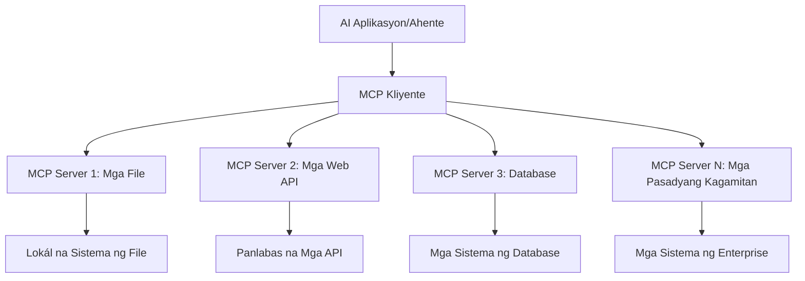

# 🌐 Module 2: MCP gamit ang Microsoft Foundry Toolkit Fundamentals

[]()
[]()
[]()

## 📋 Mga Layunin sa Pagkatuto

Sa pagtatapos ng module na ito, magagawa mong:
- ✅ Maunawaan ang Model Context Protocol (MCP) arkitektura at mga benepisyo
- ✅ Tuklasin ang Microsoft MCP server ecosystem
- ✅ Isama ang MCP servers gamit ang Microsoft Foundry Toolkit Agent Builder
- ✅ Gumawa ng functional browser automation agent gamit ang Playwright MCP
- ✅ I-configure at subukan ang mga MCP tools sa loob ng iyong mga agent
- ✅ I-export at i-deploy ang mga MCP-powered agents para sa paggamit sa produksyon

## 🎯 Pagpapatuloy mula sa Module 1

Sa Module 1, na-master natin ang mga pangunahing kaalaman ng Microsoft Foundry Toolkit at gumawa ng unang Python Agent. Ngayo'y **papalalakasin** natin ang iyong mga agent sa pamamagitan ng pag-connect sa mga external na tools at serbisyo gamit ang rebolusyonaryong **Model Context Protocol (MCP)**.

Isipin ito bilang pag-upgrade mula sa isang simpleng calculator patungo sa isang buong computer – magkakaroon ang iyong mga AI agent ng kakayahang:
- 🌐 Mag-browse at makipag-interact sa mga website
- 📁 Mag-access at manipulahin ang mga file
- 🔧 Makipag-integrate sa mga enterprise system
- 📊 Magproseso ng real-time na data mula sa mga API

## 🧠 Pag-unawa sa Model Context Protocol (MCP)

### 🔍 Ano ang MCP?

Ang Model Context Protocol (MCP) ay ang **"USB-C para sa mga AI application"** - isang rebolusyonaryong bukas na standard na nag-uugnay sa Large Language Models (LLMs) sa mga external na tool, pinanggagalingan ng datos, at mga serbisyo. Kagaya ng USB-C na nagtanggal ng kalituhan sa mga cable sa pamamagitan ng iisang unibersal na konektor, ang MCP ay nag-aalis ng kumplikadong AI integration gamit ang isang standardized na protocol.

### 🎯 Ang Problema na Nilulutas ng MCP

**Bago ang MCP:**
- 🔧 Custom integrations para sa bawat tool
- 🔄 Vendor lock-in gamit ang proprietary solutions  
- 🔒 Security vulnerabilities mula sa mga ad-hoc na koneksyon
- ⏱️ Buwan ng development para sa mga simpleng integration

**Sa MCP:**
- ⚡ Plug-and-play na integrasyon ng mga tool
- 🔄 Architecture na vendor-agnostic
- 🛡️ Built-in na pinakamahuhusay na security practices
- 🚀 Ilang minuto lang para magdagdag ng bagong kakayahan

### 🏗️ Malalim na Pagtingin sa Arkitektura ng MCP

Sinasalamin ng MCP ang **client-server architecture** na lumilikha ng isang ligtas at scalable na ecosystem:



**🔧 Pangunahing Mga Komponent:**

| Component | Papel | Mga Halimbawa |
|-----------|------|--------------|
| **MCP Hosts** | Mga aplikasyon na kumokonsumo ng MCP services | Claude Desktop, VS Code, Microsoft Foundry Toolkit |
| **MCP Clients** | Protocol handlers (1:1 sa mga server) | Built-in sa mga host na aplikasyon |
| **MCP Servers** | Nagpapakita ng kakayahan gamit ang standard protocol | Playwright, Files, Azure, GitHub |
| **Transport Layer** | Mga pamamaraan ng komunikasyon | stdio, HTTP, WebSockets |


## 🏢 Ecosystem ng Microsoft MCP Servers

Pinangunahan ng Microsoft ang MCP ecosystem gamit ang komprehensibong suite ng enterprise-grade servers na tumutugon sa tunay na pangangailangan sa negosyo.

### 🌟 Tampok na Microsoft MCP Servers

#### 1. ☁️ Azure MCP Server
**🔗 Repository**: [azure/azure-mcp](https://github.com/azure/azure-mcp)
**🎯 Layunin**: Komprehensibong pamamahala ng Azure resources na may AI integration

**✨ Pangunahing Mga Tampok:**
- Declarative infrastructure provisioning
- Real-time na pagmamanman ng mga resources
- Mga rekomendasyon para sa optimization ng gastos
- Pag-check ng security compliance

**🚀 Mga Gamit:**
- Infrastructure-as-Code gamit ang AI assistance
- Automated resource scaling
- Cloud cost optimization
- DevOps workflow automation

#### 2. 📊 Microsoft Dataverse MCP
**📚 Dokumentasyon**: [Microsoft Dataverse Integration](https://go.microsoft.com/fwlink/?linkid=2320176)
**🎯 Layunin**: Natural language interface para sa business data

**✨ Pangunahing Mga Tampok:**
- Natural language database queries
- Pag-unawa sa business context
- Custom prompt templates
- Enterprise data governance

**🚀 Mga Gamit:**
- Business intelligence reporting
- Pagsusuri ng customer data
- Insights sa sales pipeline
- Compliance data queries

#### 3. 🌐 Playwright MCP Server
**🔗 Repository**: [microsoft/playwright-mcp](https://github.com/microsoft/playwright-mcp)
**🎯 Layunin**: Browser automation at kakayahan sa web interaction

**✨ Pangunahing Mga Tampok:**
- Cross-browser automation (Chrome, Firefox, Safari)
- Intelligent element detection
- Screenshot at PDF generation
- Network traffic monitoring

**🚀 Mga Gamit:**
- Automated testing workflows
- Web scraping at data extraction
- UI/UX monitoring
- Competitive analysis automation

#### 4. 📁 Files MCP Server
**🔗 Repository**: [microsoft/files-mcp-server](https://github.com/microsoft/files-mcp-server)
**🎯 Layunin**: Intelligent na operasyon sa file system

**✨ Pangunahing Mga Tampok:**
- Declarative file management
- Content synchronization
- Version control integration
- Metadata extraction

**🚀 Mga Gamit:**
- Pamamahala sa dokumentasyon
- Organisasyon ng code repository
- Mga workflow para sa content publishing
- Pag-handle ng file sa data pipeline

#### 5. 📝 MarkItDown MCP Server
**🔗 Repository**: [microsoft/markitdown](https://github.com/microsoft/markitdown)
**🎯 Layunin**: Advanced Markdown processing at manipulasyon

**✨ Pangunahing Mga Tampok:**
- Masusing Markdown parsing
- Format conversion (MD ↔ HTML ↔ PDF)
- Content structure analysis
- Template processing

**🚀 Mga Gamit:**
- Mga workflow para sa technical documentation
- Content management systems
- Pagbuo ng ulat
- Automation ng knowledge base

#### 6. 📈 Clarity MCP Server
**📦 Package**: [@microsoft/clarity-mcp-server](https://www.npmjs.com/package/@microsoft/clarity-mcp-server)
**🎯 Layunin**: Web analytics at mga insight sa user behavior

**✨ Pangunahing Mga Tampok:**
- Heatmap data analysis
- User session recordings
- Performance metrics
- Conversion funnel analysis

**🚀 Mga Gamit:**
- Optimization ng website
- Pananaliksik sa user experience
- A/B testing analysis
- Business intelligence dashboards

### 🌍 Community Ecosystem

Bukod sa mga server ng Microsoft, kabilang sa MCP ecosystem ang:
- **🐙 GitHub MCP**: Pamamahala ng repository at pagsusuri ng code
- **🗄️ Database MCPs**: Integrasyon sa PostgreSQL, MySQL, MongoDB
- **☁️ Cloud Provider MCPs**: Mga tools para sa AWS, GCP, Digital Ocean
- **📧 Communication MCPs**: Mga integrasyon para sa Slack, Teams, Email

## 🛠️ Hands-On Lab: Paggawa ng Browser Automation Agent

**🎯 Layunin ng Proyekto**: Gumawa ng intelligent browser automation agent gamit ang Playwright MCP server na kayang mag-navigate sa mga website, kumuha ng impormasyon, at magsagawa ng kumplikadong web interaction.

### 🚀 Phase 1: Pagsisimula ng Agent

#### Hakbang 1: I-Initialize ang Iyong Agent
1. **Buksan ang Microsoft Foundry Toolkit Agent Builder**
2. **Gumawa ng Bagong Agent** gamit ang sumusunod na configuration:
   - **Pangalan**: `BrowserAgent`
   - **Model**: Piliin ang GPT-4o 


### 🔧 Phase 2: MCP Integration Workflow

#### Hakbang 3: Magdagdag ng MCP Server Integration
1. **Pumunta sa Tools Section** sa Agent Builder
2. **I-click ang "Add Tool"** para buksan ang integration menu
3. **Piliin ang "MCP Server"** mula sa mga opsyon


**🔍 Pag-unawa sa Uri ng Tool:**
- **Built-in Tools**: Pre-configured na mga function ng Microsoft Foundry Toolkit
- **MCP Servers**: Mga integrasyon ng external na serbisyo
- **Custom APIs**: Sariling mga service endpoints
- **Function Calling**: Direktang pag-access sa mga function ng model

#### Hakbang 4: MCP Server Selection
1. **Piliin ang "MCP Server"** upang magpatuloy


2. **I-browse ang MCP Catalog** upang tuklasin ang mga available na integrasyon


### 🎮 Phase 3: Pag-configure ng Playwright MCP

#### Hakbang 5: Piliin at I-configure ang Playwright
1. **I-click ang "Use Featured MCP Servers"** para ma-access ang mga na-verify na server ng Microsoft
2. **Piliin ang "Playwright"** mula sa listahan ng mga featured server
3. **Tanggapin ang Default MCP ID** o i-customize para sa iyong kapaligiran


#### Hakbang 6: I-enable ang Mga Kakayahan ng Playwright
**🔑 Mahalagang Hakbang**: Piliin ang **LAHAT** ng mga available na Playwright method para sa pinakamataas na functionality


**🛠️ Mahahalagang Playwright Tools:**
- **Navigation**: `goto`, `goBack`, `goForward`, `reload`
- **Interaction**: `click`, `fill`, `press`, `hover`, `drag`
- **Extraction**: `textContent`, `innerHTML`, `getAttribute`
- **Validation**: `isVisible`, `isEnabled`, `waitForSelector`
- **Capture**: `screenshot`, `pdf`, `video`
- **Network**: `setExtraHTTPHeaders`, `route`, `waitForResponse`

#### Hakbang 7: Suriin ang Tagumpay ng Integrasyon
**✅ Mga Palatandaan ng Tagumpay:**
- Lahat ng tools ay lumalabas sa interface ng Agent Builder
- Walang error message sa integration panel
- Ang status ng Playwright server ay nagpapakita ng "Connected"


**🔧 Pagsasaayos ng Karaniwang Mga Isyu:**
- **Connection Failed**: Suriin ang internet connection at firewall settings
- **Missing Tools**: Siguraduhing lahat ng kakayahan ay napili sa setup
- **Permission Errors**: Tiyakin na may sapat na system permissions ang VS Code

### 🎯 Phase 4: Advanced Prompt Engineering

#### Hakbang 8: Disenyuhin ang Intelligent System Prompts
Gumawa ng sopistikadong mga prompt na nagpapakita ng buong kakayahan ng Playwright:

```markdown
# Web Automation Expert System Prompt

## Core Identity
You are an advanced web automation specialist with deep expertise in browser automation, web scraping, and user experience analysis. You have access to Playwright tools for comprehensive browser control.

## Capabilities & Approach
### Navigation Strategy
- Always start with screenshots to understand page layout
- Use semantic selectors (text content, labels) when possible
- Implement wait strategies for dynamic content
- Handle single-page applications (SPAs) effectively

### Error Handling
- Retry failed operations with exponential backoff
- Provide clear error descriptions and solutions
- Suggest alternative approaches when primary methods fail
- Always capture diagnostic screenshots on errors

### Data Extraction
- Extract structured data in JSON format when possible
- Provide confidence scores for extracted information
- Validate data completeness and accuracy
- Handle pagination and infinite scroll scenarios

### Reporting
- Include step-by-step execution logs
- Provide before/after screenshots for verification
- Suggest optimizations and alternative approaches
- Document any limitations or edge cases encountered

## Ethical Guidelines
- Respect robots.txt and rate limiting
- Avoid overloading target servers
- Only extract publicly available information
- Follow website terms of service
```

#### Hakbang 9: Gumawa ng Dynamic User Prompts
Disenyuhin ang mga prompt na nagpapakita ng iba't ibang kakayahan:

**🌐 Halimbawa ng Web Analysis:**
```markdown
Navigate to github.com/kinfey and provide a comprehensive analysis including:
1. Repository structure and organization
2. Recent activity and contribution patterns  
3. Documentation quality assessment
4. Technology stack identification
5. Community engagement metrics
6. Notable projects and their purposes

Include screenshots at key steps and provide actionable insights.
```


### 🚀 Phase 5: Pagpapatupad at Pagsubok

#### Hakbang 10: Patakbuhin ang Iyong Unang Automation
1. **I-click ang "Run"** para simulan ang automation sequence
2. **Subaybayan ang Real-time Execution**:
   - Awtomatikong ilulunsad ang Chrome browser
   - Magna-navigate ang agent sa target na website
   - Magku-kuha ng screenshot sa bawat pangunahing hakbang
   - Ang mga resulta ng pagsusuri ay mababasa nang real-time


#### Hakbang 11: Suriin ang mga Resulta at Insight
Suriin ang komprehensibong pagsusuri sa interface ng Agent Builder:


### 🌟 Phase 6: Mga Advanced na Kakayahan at Deployment

#### Hakbang 12: I-export at I-deploy sa Produksyon
Sinusuportahan ng Agent Builder ang iba't ibang deployment options:


## 🎓 Buod ng Module 2 & Mga Susunod na Hakbang

### 🏆 Natapos na: Mastery ng MCP Integration

**✅ Mga Natamong Kasanayan:**
- [ ] Pag-unawa sa MCP arkitektura at mga benepisyo
- [ ] Pag-navigate sa Microsoft MCP server ecosystem
- [ ] Pagsasama ng Playwright MCP sa Microsoft Foundry Toolkit
- [ ] Paggawa ng sopistikadong browser automation agents
- [ ] Advanced prompt engineering para sa web automation

### 📚 Karagdagang Mga Sanggunian

- **🔗 MCP Specification**: [Opisyal na Dokumentasyon ng Protocol](https://modelcontextprotocol.io/)
- **🛠️ Playwright API**: [Kumpletong Sanggunian ng Method](https://playwright.dev/docs/api/class-playwright)
- **🏢 Microsoft MCP Servers**: [Enterprise Integration Guide](https://github.com/microsoft/mcp-servers)
- **🌍 Mga Halimbawa ng Community**: [MCP Server Gallery](https://github.com/modelcontextprotocol/servers)

**🎉 Binabati kita!** Matagumpay mong na-master ang MCP integration at ngayon ay maaari ka nang gumawa ng production-ready AI agents na may kakayahan sa mga external tool!

### 🔜 Magpatuloy sa Susunod na Module

Handa ka na bang paunlarin pa ang iyong MCP skills? Pumunta sa **[Module 3: Advanced MCP Development with Microsoft Foundry Toolkit](../lab3/README.md)** kung saan matututuhan mo kung paano:
- Gumawa ng sarili mong custom MCP servers
- I-configure at gamitin ang pinakabagong MCP Python SDK
- I-setup ang MCP Inspector para sa debugging
- Masterin ang advanced MCP server development workflows
- Gumawa ng Weather MCP Server mula sa simula

---

<!-- CO-OP TRANSLATOR DISCLAIMER START -->
**Pagtatanggi**:
Ang dokumentong ito ay isinalin gamit ang serbisyo ng AI translation na [Co-op Translator](https://github.com/Azure/co-op-translator). Bagama't nagsusumikap kami para sa katumpakan, pakatandaan na ang awtomatikong pagsasalin ay maaaring maglaman ng mga pagkakamali o hindi pagkakatugma. Ang orihinal na dokumento sa orihinal nitong wika ang dapat ituring na pangunahing sanggunian. Para sa mahahalagang impormasyon, inirerekomenda ang propesyonal na pagsasalin ng tao. Hindi kami mananagot sa anumang maling pagkakaintindi o maling interpretasyon na nagmula sa paggamit ng pagsasaling ito.
<!-- CO-OP TRANSLATOR DISCLAIMER END -->