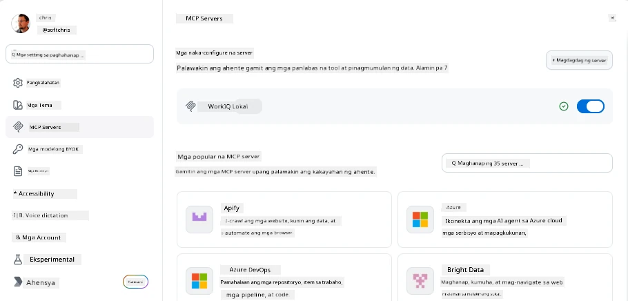
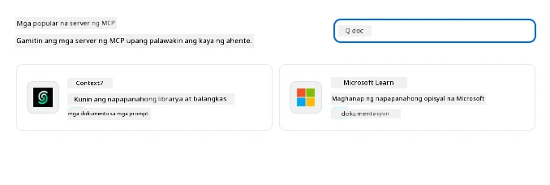
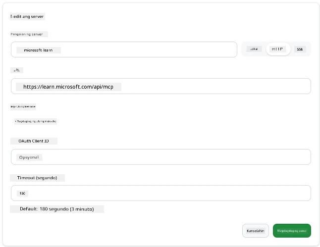
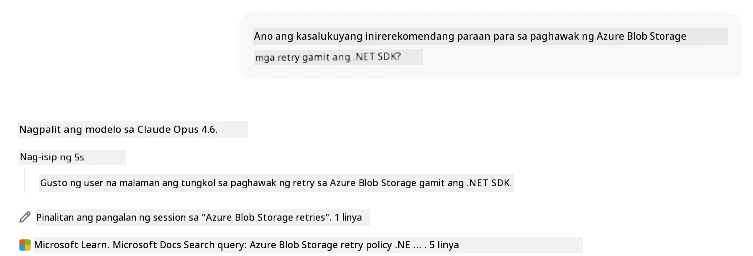
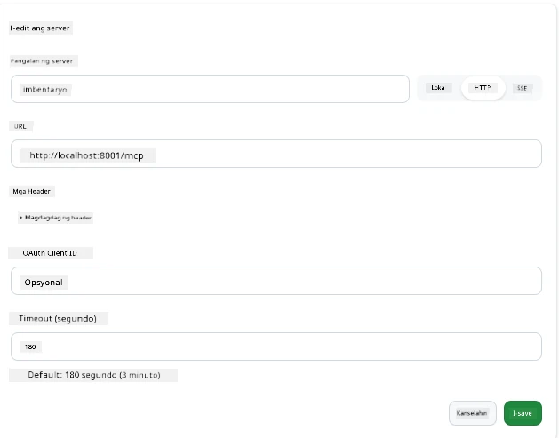
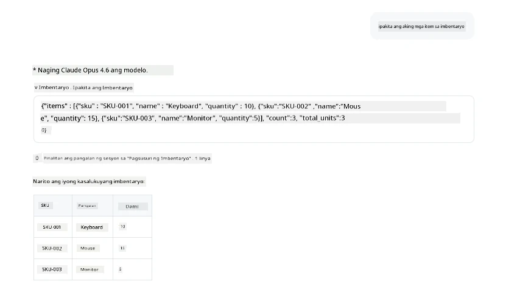
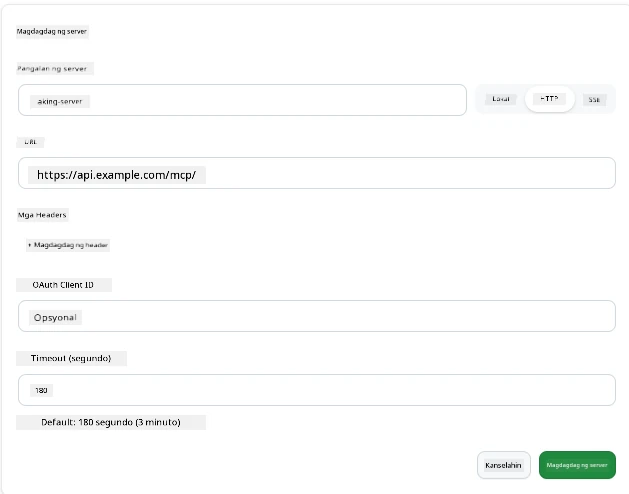
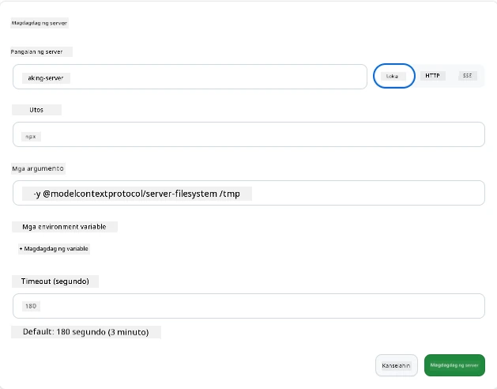

# Paggamit ng MCP Servers sa GitHub Copilot App

Ngayon ay alam mo na kung paano gumagana ang MCP. Nakabuo ka na ng mga server, nagdefine ng mga tool at resource, at nakapag-wire up ng mga kliyente. Ang hindi pa natin nagagawa ay baliktarin ang pananaw: sa halip na ikaw ang gumagawa ng server, ano ang hitsura nito kapag ikaw ay nasa *consuming* side—bilang isang gumagamit ng AI-powered app na sumusuporta sa MCP?

Ang [GitHub Copilot App](https://github.com/github/app) ay isang desktop app na maaaring gumamit ng MCP Servers. Sa pamamagitan ng pagkonekta ng MCP servers dito, nagbubukas ka ng bagong antas: maaari na ngayong ma-access ng Copilot ang iyong dokumentasyon, tawagan ang iyong internal APIs, mag-query ng iyong database, o makipag-usap sa anumang serbisyo na iyong inilagay sa isang server. Ang app ang nagiging host; ang iyong MCP servers ang nagiging mga tool nito.

Ang leksyon na ito ay gagabay sa iyo mula simula hanggang dulo—mula sa paghahanap ng MCP settings panel hanggang sa pagkonekta ng isang totoong documentation server at pagkatapos ay pag-wire up ng sarili mong custom server.

## Mga Layunin sa Pagkatuto

Sa pagtatapos ng leksyon na ito, magagawa mong:

- Hanapin at i-navigate ang MCP Servers panel sa Copilot App settings.
- Ikonekta ang isang hosted documentation server at gamitin ito sa isang session.
- Magrehistro ng custom server at tiyakin na magagamit ng Copilot ang mga tool nito.
- I-configure kung paano tatawagin ang server sa pamamagitan ng pagbibigay ng environment variables o custom headers (kung HTTP)

## Ang Copilot App bilang MCP Host

Narito ang pangunahing ideya: **Matalino ang mga agent ng Copilot, ngunit nalalaman lang nila ang sinasabi mo sa kanila.** Sa default, maaaring magbasa ng files ang agent sa iyong workspace at magpatakbo ng mga terminal command, pero hindi nito kayang mag-query ng database, tumingin sa iyong calendar, o tumawag ng custom API nang mag-isa. Doon pumapasok ang MCP servers. Gumagana silang tulay sa pagitan ng Copilot at ng iyong mga sistema—database, version control, APIs, mga design tool—na nagbibigay sa mga agent ng access sa impormasyon at mga aksyon na kailangan nila para matapos ang trabaho.

Magsimula tayo sa paghahanap ng mga setting para pamahalaan ang MCP Servers ng iyong app.

## Hakbang 1: Paghahanap ng MCP Settings Panel

Buksan ang Copilot App at hanapin ang icon ng cog sa ibabang kaliwa at i-click ito.


Siguraduhing piliin ang "MCP Servers" at makikita mo na ang mga naka-configure mo nang server sa itaas, isang marketplace ng mga popular na server sa ibaba, at isang "Add Server" button sa itaas tulad nito:



Ito ang iyong control center. Dito ka magdadagdag, magtatanggal, magpapagana, at magpapahinto ng mga server. Ang mga pagbabago ay magkakabisa para sa mga bagong session; kung may bukas kang session, kailangan mong magsimula ng bago pagkatapos baguhin ang listahang ito.

## Hakbang 2: Pagkonekta ng Documentation Server

Gawin natin ang isang kapaki-pakinabang agad. Ang Microsoft Docs MCP server ay nagbibigay ng access sa Copilot sa opisyal na dokumentasyon ng Microsoft. Kasama dito ang Azure, .NET, TypeScript, at marami pa. Sa halip na umasa ang agent sa kanyang training data (na may cutoff date), maaari nitong kunin ang kasalukuyang dokumento sa oras ng query.

Narito kung paano idagdag ito:

1. Sa grid ng mga popular na server, i-type ang **learn** at piliin ang server na tinatawag na "Microsoft Learn".

   

   Pag naklik, magpapakita ito ng form kung saan ang pangalan, uri ng transport at URL ay napunan na, ang kailangan mo lang gawin ay i-click ang "Add Server".

2. I-click ang "Add Server", aabutin ito ng ilang segundo para makakonekta sa server.

   

   Kapag naidagdag, makikita ito sa itaas bilang isang na-configure nang server. Subukan natin ito sa susunod.

3. Isara ang dialog at piliin ang Quick chat.

4. I-type ang sumusunod na prompt upang mag-trigger ng tool sa Microsoft Learn server.

   ```text
   What's the current recommended approach for handling Azure Blob Storage 
   retries using the .NET SDK?
   ```

   

Makikita mo na tinutukoy nito ang MCP Server na kakadagdag mo lang.

## Hakbang 3: Pagkonekta ng Custom stdio Server

Maginhawa ang mga preset, pero ang totoong lakas ay ang pagkonekta ng iyong sariling mga server. Sabihin nating nakabuo ka ng server (o binigyan ka ng isa) na nagpapalabas ng iyong internal API o base ng kaalaman ng kumpanya. Sa pagkakataong ito, gagamit tayo ng MCP Server na ginawa namin na humahawak sa pamamahala ng imbentaryo ng aming kumpanya.

1. I-click ang cog at piliin muli ang "MCP servers".

2. Piliin ang "Add Server" button at "+ Add Custom server", at ibigay ang mga sumusunod na halaga:

   - Pangalan: `Inventory Server`
   - Piliin ang transport (sa kanan), **http**

   Piliin ang "Add Server" at makikita ito sa listahan ng iyong mga naka-configure na server.

   

4. Para subukan ito, magpatakbo ng prompt tulad nito:

    ```
    list inventory
    ```

   

Makikita mo na ngayon ang listahan ng mga item ng imbentaryo na ibinalik mula sa iyong custom-built server.

Magaling, ngayon ay dapat ay may magandang pang-unawa ka na sa pagdaragdag ng panlabas pati na rin ng sarili mong MCP servers sa Copilot App. Susunod, pag-usapan natin ang paghawak ng mga lihim at environment variables.

## Hakbang 4: Advanced settings

Sa ngayon, nakita mo kung paano magdagdag ng MCP Servers kung saan naglalagay ka lang ng pangalan at URL. Pero paano kung kailangan ng iyong server ng API key o ibang halaga? Depende sa uri ng transport, maaari nating bigyan ito ng kailangan nito.

- **http o SSE transport**: Dito maaari tayong mag-set ng mga header kung kinakailangan.

   Para sa auth, maaari kang magtakda ng Authorization header, halimbawa. Ang halaga ay maaaring static na string. Kung gumagamit ka ng OAuth, maaari mo ring ibigay ang OAuth client ID.

   

- **stdio transport**: Maaaring mag-set ng environment variables.

   Dito maaari mong tukuyin ang anumang bilang ng environment variables na kailangan na ipapasa sa server kapag sinimulan mo ito.

   

## Buod

Tinuturing ng Copilot App ang MCP servers bilang mga unang-klaseng extension ng kakayahan ng agent. Nakita mo ang buong proseso sa leksyon na ito mula sa pagdaragdag ng MCP servers hanggang sa paggamit nila sa isang session. Maaari ka nang kumonekta sa mga pampublikong server, internal APIs, at mga custom na tool, na nagbibigay sa iyong mga agent ng kakayahang ma-access ang impormasyon at mga aksyon na kailangan nila upang awtonomatikong matapos ang mga gawain.

## 📚 Karagdagang Resources

### Opisyal na dokumentasyon

- [GitHub Copilot App](https://github.com/github/app)
- [MCP Specification](https://modelcontextprotocol.io/specification/2025-03-26) - Model Context Protocol specification

### Komunidad
- [MCP Community Discord](https://discord.com/invite/ByRwuEEgH4) - Live discussions
- [GitHub Discussions](https://github.com/microsoft/MCP-Server-and-PostgreSQL-Sample-Retail/discussions) - Q&A at pagbabahagi
- [Stack Overflow](https://stackoverflow.com/questions/tagged/model-context-protocol) - Mga teknikal na tanong

---

<!-- CO-OP TRANSLATOR DISCLAIMER START -->
**Pagtatanggi**:
Ang dokumentong ito ay isinalin gamit ang serbisyo ng AI translation na [Co-op Translator](https://github.com/Azure/co-op-translator). Bagama't nagsusumikap kami para sa katumpakan, pakatandaan na ang awtomatikong pagsasalin ay maaaring maglaman ng mga pagkakamali o hindi pagkakatugma. Ang orihinal na dokumento sa orihinal nitong wika ang dapat ituring na pangunahing sanggunian. Para sa mahahalagang impormasyon, inirerekomenda ang propesyonal na pagsasalin ng tao. Hindi kami mananagot sa anumang maling pagkakaintindi o maling interpretasyon na nagmula sa paggamit ng pagsasaling ito.
<!-- CO-OP TRANSLATOR DISCLAIMER END -->