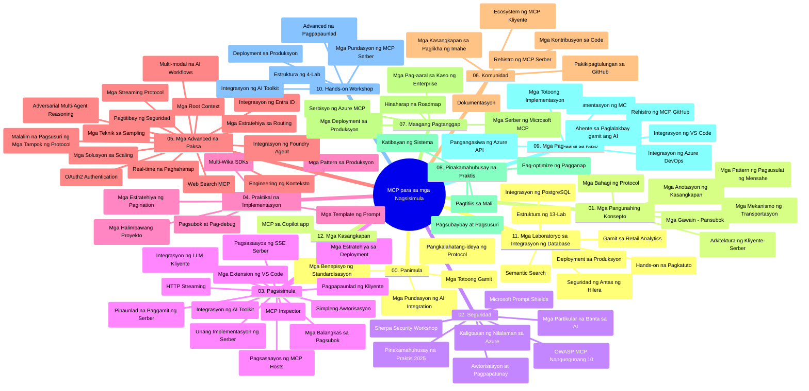

# Model Context Protocol (MCP) para sa mga Baguhan - Gabay sa Pag-aaral

Ang gabay na ito sa pag-aaral ay nagbibigay ng pangkalahatang-ideya ng istruktura ng repositoryo at nilalaman para sa kurikulum na "Model Context Protocol (MCP) para sa mga Baguhan." Gamitin ang gabay na ito upang mahusay na mag-navigate sa repositoryo at mapakinabangan nang husto ang mga magagamit na resources.

## Pangkalahatang-ideya ng Repositoryo

Ang Model Context Protocol (MCP) ay isang standardized framework para sa mga interaksyon sa pagitan ng mga AI model at client applications. Orihinal na nilikha ng Anthropic, ang MCP ay ngayon pinamamahalaan ng mas malawak na komunidad ng MCP sa pamamagitan ng opisyal na organisasyon sa GitHub. Ang repositoryo na ito ay nagbibigay ng komprehensibong kurikulum na may mga hands-on code examples sa C#, Java, JavaScript, Python, at TypeScript, na idinisenyo para sa mga AI developer, system architect, at software engineer.

## Visual Curriculum Map

## Istruktura ng Repositoryo

Ang repositoryo ay naka-organisa sa labindalawang pangunahing seksyon, bawat isa ay nakatuon sa iba't ibang aspeto ng MCP:

1. **Panimula (00-Introduction/)**
   - Pangkalahatang-ideya ng Model Context Protocol
   - Bakit mahalaga ang standardisasyon sa AI pipelines
   - Praktikal na mga kaso ng paggamit at benepisyo

2. **Pangunahing Konsepto (01-CoreConcepts/)**
   - Arkitektura ng client-server
   - Mahahalagang bahagi ng protocol
   - Mga pattern ng messaging sa MCP

3. **Seguridad (02-Security/)**
   - Mga banta sa seguridad sa mga sistemang batay sa MCP
   - Mga pinakamahusay na kasanayan para sa pag-secure ng mga implementasyon
   - Mga estratehiya sa pagpapatotoo at awtorisasyon
   - **Komprehensibong Dokumentasyon sa Seguridad**:
     - MCP Security Best Practices 2025
     - Azure Content Safety Implementation Guide
     - MCP Security Controls and Techniques
     - MCP Best Practices Quick Reference
   - **Mga Mahahalagang Paksa sa Seguridad**:
     - Prompt injection at tool poisoning attacks
     - Session hijacking at problema ng confused deputy
     - Token passthrough vulnerabilities
     - Sobra at labis na mga permiso at control sa access
     - Seguridad ng supply chain para sa mga komponent ng AI
     - Microsoft Prompt Shields integration

4. **Pagsisimula (03-GettingStarted/)**
   - Pagsasaayos at configuration ng kapaligiran
   - Paggawa ng mga basic MCP server at client
   - Integrasyon sa mga umiiral na aplikasyon
   - Kasama ang mga seksyon para sa:
     - Unang implementasyon ng server
     - Pag-develop ng client
     - LLM client integration
     - VS Code integration
     - Server-Sent Events (SSE) server
     - Advanced na paggamit ng server
     - HTTP streaming
     - AI Toolkit integration
     - Mga estratehiya sa pagsusuri
     - Mga gabay sa deployment

5. **Praktikal na Implementasyon (04-PracticalImplementation/)**
   - Paggamit ng SDK sa iba't ibang programming language
   - Debugging, testing, at mga teknik ng beripikasyon
   - Paggawa ng reusable prompt templates at workflows
   - Mga sample project na may mga halimbawa ng implementasyon

6. **Mga Advanced na Paksa (05-AdvancedTopics/)**
   - Mga teknik sa context engineering
   - Foundry agent integration
   - Multi-modal AI workflows
   - OAuth2 authentication demos
   - Real-time search capabilities
   - Real-time streaming
   - Implementasyon ng root contexts
   - Mga estratehiya sa routing
   - Sampling techniques
   - Mga diskarte sa scaling
   - Mga konsiderasyon sa seguridad
   - Entra ID security integration
   - Web search integration
   - Adversarial multi-agent reasoning (mga pattern ng debate)

7. **Mga Kontribusyon ng Komunidad (06-CommunityContributions/)**
   - Paano mag-ambag ng code at dokumentasyon
   - Pakikipagtulungan sa pamamagitan ng GitHub
   - Mga pagbuti at feedback mula sa komunidad
   - Paggamit ng iba't ibang MCP client (Claude Desktop, Cline, VSCode)
   - Paggawa gamit ang mga popular na MCP server kabilang ang image generation

8. **Mga Aral mula sa Maagang Pag-adopt (07-LessonsfromEarlyAdoption/)**
   - Mga implementasyon sa totoong mundo at mga kwento ng tagumpay
   - Pagbuo at pag-deploy ng mga solusyon na batay sa MCP
   - Mga trend at roadmap sa hinaharap
   - **Microsoft MCP Servers Guide**: Komprehensibong gabay sa 10 production-ready Microsoft MCP server kabilang ang:
     - Microsoft Learn Docs MCP Server
     - Azure MCP Server (15+ specialized connectors)
     - GitHub MCP Server
     - Azure DevOps MCP Server
     - MarkItDown MCP Server
     - SQL Server MCP Server
     - Playwright MCP Server
     - Dev Box MCP Server
     - Microsoft Foundry MCP Server
     - Microsoft 365 Agents Toolkit MCP Server

9. **Pinakamahusay na Kasanayan (08-BestPractices/)**
   - Pagsasaayos at optimization ng performance
   - Disenyo ng mga fault-tolerant MCP system
   - Testing at mga estratehiya para sa resilience

10. **Mga Case Study (09-CaseStudy/)**
    - **Pitong komprehensibong case study** na nagpapakita ng kakayahan ng MCP sa iba't ibang senaryo:
    - **Azure AI Travel Agents**: Multi-agent orchestration gamit ang Azure OpenAI at AI Search
    - **Azure DevOps Integration**: Automasyon ng mga proseso ng workflow gamit ang YouTube data updates
    - **Real-Time Documentation Retrieval**: Python console client gamit ang streaming HTTP
    - **Interactive Study Plan Generator**: Chainlit na web app gamit ang conversational AI
    - **In-Editor Documentation**: VS Code integration gamit ang GitHub Copilot workflows
    - **Azure API Management**: Enterprise API integration at paggawa ng MCP server
    - **GitHub MCP Registry**: Ecosystem development at platform para sa agentic integration
    - Mga halimbawa ng implementasyon mula sa enterprise integration, developer productivity, at development ng ecosystem

11. **Hands-on Workshop (10-StreamliningAIWorkflowsBuildingAnMCPServerWithAIToolkit/)**
    - Komprehensibong hands-on workshop na pinagsasama ang MCP sa AI Toolkit
    - Pagbuo ng mga intelligent application na nag-uugnay ng AI models sa mga totoong tool
    - Praktikal na mga module na sumasaklaw sa mga pundasyon, custom server development, at production deployment strategies
    - **Istruktura ng Lab**:
      - Lab 1: MCP Server Fundamentals
      - Lab 2: Advanced MCP Server Development
      - Lab 3: AI Toolkit Integration
      - Lab 4: Production Deployment at Scaling
    - Lab-based na paraan ng pag-aaral na may step-by-step na mga tagubilin

12. **MCP Server Database Integration Labs (11-MCPServerHandsOnLabs/)**
    - **Komprehensibong 13-lab learning path** para sa paggawa ng production-ready MCP server na may PostgreSQL integration
    - **Implementasyon ng real-world retail analytics** gamit ang Zava Retail use case
    - **Mga enterprise-grade pattern** kabilang ang Row Level Security (RLS), semantic search, at multi-tenant data access
    - **Kompletong Istruktura ng Lab**:
      - **Labs 00-03: Mga Pundasyon** - Panimula, Arkitektura, Seguridad, Environment Setup
      - **Labs 04-06: Paggawa ng MCP Server** - Disenyo ng Database, Implementasyon ng MCP Server, Pag-develop ng Tool
      - **Labs 07-09: Advanced na Mga Tampok** - Semantic Search, Testing at Debugging, VS Code Integration
      - **Labs 10-12: Production at Pinakamahusay na Kasanayan** - Deployment, Monitoring, Optimization
    - **Mga Teknolohiyang Saklaw**: FastMCP framework, PostgreSQL, Azure OpenAI, Azure Container Apps, Application Insights
    - **Mga Resulta ng Pag-aaral**: Production-ready MCP server, mga pattern ng database integration, AI-powered analytics, enterprise security

13. **Tooling (12-tooling/)**
    - Matutunan kung paano gamitin ang MCP sa Copilot app at iba pang tools

## Karagdagang Resources

Kasama sa repositoryo ang mga sumusuportang resources:

- **Images folder**: Naglalaman ng mga diagram at ilustrasyon na ginamit sa buong kurikulum
- **Translations**: Suporta sa maraming mga wika na may awtomatikong pagsasalin ng dokumentasyon
- **Opisyal na MCP Resources**:
  - [MCP Documentation](https://modelcontextprotocol.io/)
  - [MCP Specification](https://spec.modelcontextprotocol.io/)
  - [MCP GitHub Repository](https://github.com/modelcontextprotocol)

## Paano Gamitin ang Repositoryong Ito

1. **Sunod-sunod na Pag-aaral**: Sundan ang mga kabanata nang sunud-sunod (00 hanggang 11) para sa isang organisadong karanasan sa pag-aaral.
2. **Pokús sa Partikular na Wika**: Kung interesado ka sa isang partikular na programming language, tuklasin ang mga samples directory para sa mga implementasyon sa iyong nais na wika.
3. **Praktikal na Implementasyon**: Magsimula sa seksyong "Getting Started" upang iset up ang iyong environment at gumawa ng iyong unang MCP server at client.
4. **Mas Malalim na Eksplorasyon**: Kapag komportable na sa mga batayan, saliksikin ang mga advanced na paksa upang palawakin ang iyong kaalaman.
5. **Pakikilahok sa Komunidad**: Sumali sa MCP community sa pamamagitan ng mga diskusyon sa GitHub at mga channel ng Discord para makipag-ugnayan sa mga eksperto at kapwa developer.

## Mga MCP Client at Tool

Saklaw ng kurikulum ang iba't ibang MCP client at tools:

1. **Opisyal na Clients**:
   - Visual Studio Code
   - MCP sa Visual Studio Code
   - Claude Desktop
   - Claude sa VSCode
   - Claude API

2. **Mga Community Clients**:
   - Cline (terminal-based)
   - Cursor (code editor)
   - ChatMCP
   - Windsurf

3. **MCP Management Tools**:
   - MCP CLI
   - MCP Manager
   - MCP Linker
   - MCP Router

## Mga Popular na MCP Server

Ipinapakilala ng repositoryo ang iba't ibang MCP server, kabilang ang:

1. **Opisyal na Microsoft MCP Server**:
   - Microsoft Learn Docs MCP Server
   - Azure MCP Server (15+ specialized connectors)
   - GitHub MCP Server
   - Azure DevOps MCP Server
   - MarkItDown MCP Server
   - SQL Server MCP Server
   - Playwright MCP Server
   - Dev Box MCP Server
   - Microsoft Foundry MCP Server
   - Microsoft 365 Agents Toolkit MCP Server

2. **Opisyal na Reference Server**:
   - Filesystem
   - Fetch
   - Memory
   - Sequential Thinking

3. **Image Generation**:
   - Azure OpenAI DALL-E 3
   - Stable Diffusion WebUI
   - Replicate

4. **Mga Development Tool**:
   - Git MCP
   - Terminal Control
   - Code Assistant

5. **Mga Espesyal na Server**:
   - Salesforce
   - Microsoft Teams
   - Jira & Confluence

## Pag-aambag

Malugod na tinatanggap ng repositoryong ito ang mga kontribusyon mula sa komunidad. Tingnan ang seksyon ng Community Contributions para sa gabay kung paano epektibong makapag-ambag sa MCP ecosystem.

----

*Ang gabay na ito sa pag-aaral ay huling na-update noong Pebrero 5, 2026, na sumasalamin sa pinakabagong MCP Specification 2025-11-25 at nagbibigay ng pangkalahatang-ideya ng repositoryo hanggang sa petsang iyon. Maaring ma-update ang nilalaman ng repositoryo pagkatapos ng petsang ito.*

---

<!-- CO-OP TRANSLATOR DISCLAIMER START -->
**Pagtatanggi**:
Ang dokumentong ito ay isinalin gamit ang serbisyo ng AI translation na [Co-op Translator](https://github.com/Azure/co-op-translator). Bagama't nagsusumikap kami para sa katumpakan, pakatandaan na ang awtomatikong pagsasalin ay maaaring maglaman ng mga pagkakamali o hindi pagkakatugma. Ang orihinal na dokumento sa orihinal nitong wika ang dapat ituring na pangunahing sanggunian. Para sa mahahalagang impormasyon, inirerekomenda ang propesyonal na pagsasalin ng tao. Hindi kami mananagot sa anumang maling pagkakaintindi o maling interpretasyon na nagmula sa paggamit ng pagsasaling ito.
<!-- CO-OP TRANSLATOR DISCLAIMER END -->