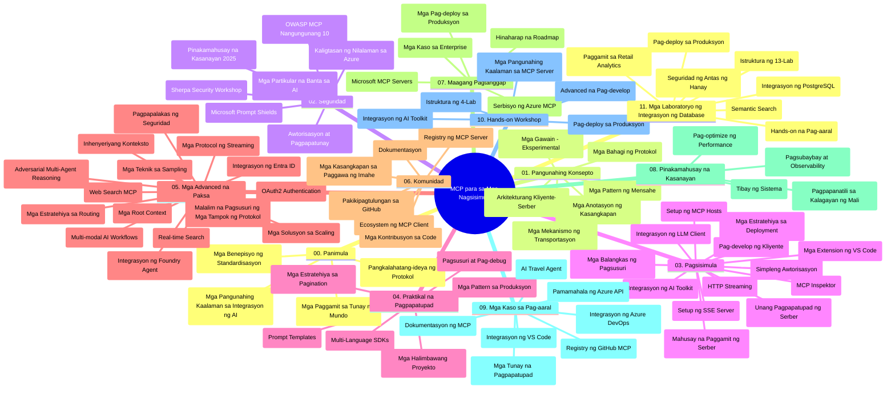

# Model Context Protocol (MCP) para sa mga Nagsisimula - Gabay sa Pag-aaral

Ang gabay na ito sa pag-aaral ay nagbibigay ng pangkalahatang-ideya ng istruktura at nilalaman ng repositoryo para sa kurikulum na "Model Context Protocol (MCP) para sa mga Nagsisimula". Gamitin ang gabay na ito upang mas mahusay na mag-navigate sa repositoryo at masulit ang mga magagamit na mapagkukunan.

## Pangkalahatang-ideya ng Repositoryo

Ang Model Context Protocol (MCP) ay isang standard na balangkas para sa interaksyon sa pagitan ng mga AI na modelo at client applications. Unang nilikha ng Anthropic, ang MCP ay ngayon pinamamahalaan ng mas malawak na komunidad ng MCP sa pamamagitan ng opisyal na organisasyon sa GitHub. Ang repositoryong ito ay naglalaman ng komprehensibong kurikulum na may mga praktikal na halimbawa ng code sa C#, Java, JavaScript, Python, at TypeScript, na dinisenyo para sa mga developer ng AI, mga arkitekto ng sistema, at mga inhinyero ng software.

## Visual Curriculum Map

## Istruktura ng Repositoryo

Ang repositoryo ay nakaayos sa labing-isang pangunahing seksyon, bawat isa ay nakatuon sa iba't ibang aspeto ng MCP:

1. **Introduksyon (00-Introduction/)**
   - Pangkalahatang-ideya ng Model Context Protocol
   - Bakit mahalaga ang standardisasyon sa mga AI pipeline
   - Mga praktikal na kaso at benepisyo

2. **Pangunahing Konsepto (01-CoreConcepts/)**
   - Arkitektura ng client-server
   - Pangunahing bahagi ng protocol
   - Mga pattern ng messaging sa MCP

3. **Seguridad (02-Security/)**
   - Mga banta sa seguridad sa mga sistemang batay sa MCP
   - Mga pinakamahusay na kasanayan para sa seguradong pagpapatupad
   - Mga estratehiya sa authentication at authorization
   - **Komprehensibong Dokumentasyon sa Seguridad**:
     - MCP Security Best Practices 2025
     - Azure Content Safety Implementation Guide
     - MCP Security Controls and Techniques
     - MCP Best Practices Quick Reference
   - **Pangunahing Paksa sa Seguridad**:
     - Prompt injection at tool poisoning attacks
     - Session hijacking at confused deputy problems
     - Token passthrough vulnerabilities
     - Sobrang mga pahintulot at kontrol sa access
     - Seguridad ng supply chain para sa mga sangkap ng AI
     - Pagsasama ng Microsoft Prompt Shields

4. **Pagpapasimula (03-GettingStarted/)**
   - Pagsasaayos ng kapaligiran at konfigurasyon
   - Paglikha ng mga pangunahing server at client ng MCP
   - Integrasyon sa mga umiiral nang aplikasyon
   - Kasama ang mga seksyon para sa:
     - Unang implementasyon ng server
     - Pagde-develop ng client
     - Integrasyon ng LLM client
     - Integrasyon ng VS Code
     - Server-Sent Events (SSE) server
     - Advanced na paggamit ng server
     - HTTP streaming
     - Integrasyon ng AI Toolkit
     - Mga estratehiya sa pagsubok
     - Mga patnubay sa deployment

5. **Praktikal na Implementasyon (04-PracticalImplementation/)**
   - Paggamit ng SDKs sa iba't ibang programming languages
   - Mga teknik sa debugging, testing, at validation
   - Paggawa ng reusable prompt templates at workflows
   - Mga halimbawa ng proyekto na may implementasyon

6. **Mga Advanced na Paksa (05-AdvancedTopics/)**
   - Mga teknik sa context engineering
   - Integrasyon ng foundry agent
   - Multi-modal AI workflows 
   - Mga demo ng OAuth2 authentication
   - Kakayahan sa real-time na paghahanap
   - Real-time streaming
   - Implementasyon ng root contexts
   - Mga estratehiya sa routing
   - Mga teknik sa sampling
   - Mga pamamaraan sa scaling
   - Mga pagsasaalang-alang sa seguridad
   - Integrasyon ng Entra ID security
   - Integrasyon ng web search
   - Adversarial multi-agent reasoning (mga pattern ng debate)

7. **Kontribusyon ng Komunidad (06-CommunityContributions/)**
   - Paano mag-ambag ng code at dokumentasyon
   - Pakikipagtulungan sa pamamagitan ng GitHub
   - Mga pagbuti at feedback na pinasimunuan ng komunidad
   - Paggamit ng iba't ibang MCP clients (Claude Desktop, Cline, VSCode)
   - Paggawa sa mga tanyag na MCP servers kabilang ang image generation

8. **Mga Aral mula sa Maagang Paggamit (07-LessonsfromEarlyAdoption/)**
   - Mga implementasyong totoong mundo at mga kwento ng tagumpay
   - Pagtatayo at pag-deploy ng mga solusyon na batay sa MCP
   - Mga uso at hinaharap na roadmap
   - **Microsoft MCP Servers Guide**: Komprehensibong gabay sa 10 production-ready na Microsoft MCP servers kabilang ang:
     - Microsoft Learn Docs MCP Server
     - Azure MCP Server (15+ na espesyal na connector)
     - GitHub MCP Server
     - Azure DevOps MCP Server
     - MarkItDown MCP Server
     - SQL Server MCP Server
     - Playwright MCP Server
     - Dev Box MCP Server
     - Microsoft Foundry MCP Server
     - Microsoft 365 Agents Toolkit MCP Server

9. **Mga Pinakamahusay na Kasanayan (08-BestPractices/)**
   - Pag-tune at pag-optimize ng performance
   - Pagdidisenyo ng fault-tolerant na MCP systems
   - Mga estratehiya sa testing at resiliency

10. **Mga Case Study (09-CaseStudy/)**
    - **Pito na komprehensibong case studies** na nagpapakita ng kakayahan ng MCP sa iba't ibang senaryo:
    - **Azure AI Travel Agents**: Multi-agent orchestration gamit ang Azure OpenAI at AI Search
    - **Integrasyon ng Azure DevOps**: Pag-automate ng mga workflow gamit ang YouTube data updates
    - **Real-Time Documentation Retrieval**: Python console client gamit ang streaming HTTP
    - **Interactive Study Plan Generator**: Chainlit web app na may conversational AI
    - **In-Editor Documentation**: VS Code integration gamit ang GitHub Copilot workflows
    - **Azure API Management**: Enterprise API integration na may paggawa ng MCP server
    - **GitHub MCP Registry**: Ecosystem development at platform ng agentic integration
    - Mga halimbawa ng implementasyon na sumasaklaw sa enterprise integration, developer productivity, at ecosystem development

11. **Hands-on Workshop (10-StreamliningAIWorkflowsBuildingAnMCPServerWithAIToolkit/)**
    - Komprehensibong hands-on workshop na pinagsasama ang MCP at AI Toolkit
    - Pagtatayo ng mga intelligent application na nag-uugnay ng AI models sa mga totoong mundo na tool
    - Mga praktikal na module na sumasaklaw sa mga pundasyon, custom server development, at estratehiya sa production deployment
    - **Istruktura ng Lab**:
      - Lab 1: MCP Server Fundamentals
      - Lab 2: Advanced MCP Server Development
      - Lab 3: AI Toolkit Integration
      - Lab 4: Production Deployment at Scaling
    - Pamamaraan ng pagkatuto batay sa lab na may hakbang-hakbang na mga tagubilin

12. **Mga MCP Server Database Integration Labs (11-MCPServerHandsOnLabs/)**
    - **Komprehensibong 13-lab na landas ng pagkatuto** para sa paggawa ng production-ready na MCP servers na may PostgreSQL integrasyon
    - **Implementasyon ng retail analytics sa totoong mundo** gamit ang Zava Retail use case
    - **Enterprise-grade na mga pattern** kabilang ang Row Level Security (RLS), semantic search, at multi-tenant data access
    - **Kumpletong Istruktura ng Lab**:
      - **Labs 00-03: Mga Pundasyon** - Introduksyon, Arkitektura, Seguridad, Pagsasaayos ng Kapaligiran
      - **Labs 04-06: Pagtatayo ng MCP Server** - Disenyo ng Database, Implementasyon ng MCP Server, Pagbuo ng Tool
      - **Labs 07-09: Mga Advanced na Katangian** - Semantic Search, Testing at Debugging, Integrasyon ng VS Code
      - **Labs 10-12: Produksyon at Pinakamahusay na Kasanayan** - Deployment, Monitoring, Optimisasyon
    - **Mga Teknolohiyang Saklaw**: FastMCP framework, PostgreSQL, Azure OpenAI, Azure Container Apps, Application Insights
    - **Mga Resulta ng Pagkatuto**: Production-ready MCP servers, database integration patterns, AI-powered analytics, enterprise security

## Karagdagang Mga Mapagkukunan

Kasama sa repositoryo ang mga sumusuportang mapagkukunan:

- **Folder ng Mga Larawan**: Naglalaman ng mga diagram at ilustrasyon na ginamit sa buong kurikulum
- **Mga Pagsasalin**: Suporta sa maraming wika na may awtomatikong pagsasalin ng dokumentasyon
- **Opisyal na MCP Resources**:
  - [MCP Documentation](https://modelcontextprotocol.io/)
  - [MCP Specification](https://spec.modelcontextprotocol.io/)
  - [MCP GitHub Repository](https://github.com/modelcontextprotocol)

## Paano Gamitin ang Repositoryong Ito

1. **Sunod-sunod na Pagkatuto**: Sundin ang mga kabanata nang sunod-sunod (00 hanggang 11) para sa istrukturadong karanasan sa pagkatuto.
2. **Pokús sa Partikular na Wika**: Kung interesado ka sa isang partikular na programming language, tuklasin ang mga sample directories para sa mga implementasyon sa iyong gustong wika.
3. **Praktikal na Implementasyon**: Magsimula sa seksyong "Getting Started" upang isaayos ang iyong kapaligiran at likhain ang iyong unang MCP server at client.
4. **Advanced na Pagsisid**: Kapag pamilyar ka na sa mga batayan, pasukin ang mga advanced na paksa upang palawakin ang iyong kaalaman.
5. **Pakikilahok sa Komunidad**: Sumali sa komunidad ng MCP sa pamamagitan ng mga diskusyon sa GitHub at mga Discord channel para kumonekta sa mga eksperto at kapwa developer.

## Mga MCP Clients at Tool

Tinutugunan ng kurikulum ang iba't ibang MCP clients at tool:

1. **Opisyal na Clients**:
   - Visual Studio Code 
   - MCP sa Visual Studio Code
   - Claude Desktop
   - Claude sa VSCode 
   - Claude API

2. **Mga Client ng Komunidad**:
   - Cline (terminal-based)
   - Cursor (code editor)
   - ChatMCP
   - Windsurf

3. **Mga MCP Management Tools**:
   - MCP CLI
   - MCP Manager
   - MCP Linker
   - MCP Router

## Mga Popular na MCP Servers

Ipinapakilala ng repositoryo ang iba't ibang MCP servers, kabilang ang:

1. **Opisyal na Microsoft MCP Servers**:
   - Microsoft Learn Docs MCP Server
   - Azure MCP Server (15+ na espesyal na connector)
   - GitHub MCP Server
   - Azure DevOps MCP Server
   - MarkItDown MCP Server
   - SQL Server MCP Server
   - Playwright MCP Server
   - Dev Box MCP Server
   - Microsoft Foundry MCP Server
   - Microsoft 365 Agents Toolkit MCP Server

2. **Opisyal na Reference Servers**:
   - Filesystem
   - Fetch
   - Memory
   - Sequential Thinking

3. **Pagbuo ng Imahe**:
   - Azure OpenAI DALL-E 3
   - Stable Diffusion WebUI
   - Replicate

4. **Mga Tool sa Pag-unlad**:
   - Git MCP
   - Terminal Control
   - Code Assistant

5. **Espesyal na mga Server**:
   - Salesforce
   - Microsoft Teams
   - Jira & Confluence

## Pag-aambag

Malugod na tinatanggap ng repositoryong ito ang mga kontribusyon mula sa komunidad. Tingnan ang seksyon na Kontribusyon ng Komunidad para sa gabay kung paano epektibong makapag-ambag sa ecosystem ng MCP.

----

*Ang gabay sa pag-aaral na ito ay huling na-update noong Pebrero 5, 2026, na sumasalamin sa pinakabagong MCP Specification 2025-11-25 at nagbibigay ng pangkalahatang-ideya ng repositoryo hanggang sa petsang iyon. Maaaring ma-update ang nilalaman ng repositoryo pagkatapos ng petsang ito.*

---

<!-- CO-OP TRANSLATOR DISCLAIMER START -->
**Pagtatanggi**:
Ang dokumentong ito ay isinalin gamit ang serbisyo ng AI translation na [Co-op Translator](https://github.com/Azure/co-op-translator). Bagama't nagsusumikap kami para sa katumpakan, pakatandaan na ang awtomatikong pagsasalin ay maaaring maglaman ng mga pagkakamali o hindi pagkakatugma. Ang orihinal na dokumento sa orihinal nitong wika ang dapat ituring na pangunahing sanggunian. Para sa mahahalagang impormasyon, inirerekomenda ang propesyonal na pagsasalin ng tao. Hindi kami mananagot sa anumang maling pagkakaintindi o maling interpretasyon na nagmula sa paggamit ng pagsasaling ito.
<!-- CO-OP TRANSLATOR DISCLAIMER END -->