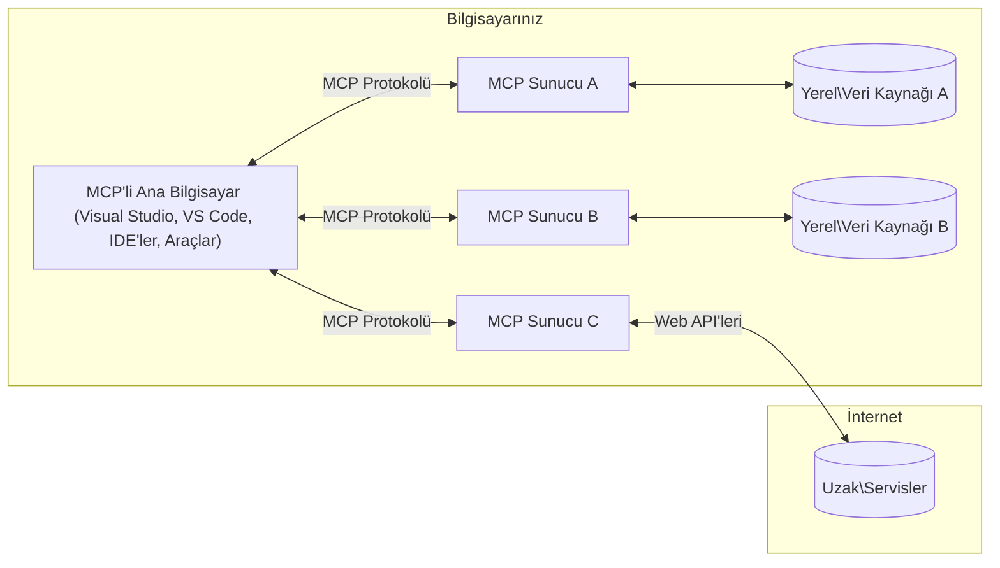

# MCP Temel Kavramları: Yapay Zeka Entegrasyonu için Model Context Protokolünde Uzmanlaşma

[](https://youtu.be/earDzWGtE84)

_(Bu dersin videosunu izlemek için yukarıdaki resme tıklayın)_

[Model Context Protocol (MCP)](https://github.com/modelcontextprotocol), Büyük Dil Modelleri (LLM'ler) ile dış araçlar, uygulamalar ve veri kaynakları arasındaki iletişimi optimize eden güçlü ve standartlaştırılmış bir çerçevedir.  
Bu kılavuz, sizi MCP'nin temel kavramlarıyla tanıştıracak. İstemci-sunucu mimarisini, temel bileşenlerini, iletişim mekaniklerini ve uygulama en iyi uygulamalarını öğreneceksiniz.

- **Açık Kullanıcı Onayı**: Tüm veri erişimi ve işlemler yürütülmeden önce açık kullanıcı onayı gerektirir. Kullanıcılar hangi verilere erişileceğini ve hangi işlemlerin yapılacağını net bir şekilde anlamalı, izinler ve yetkilendirmeler üzerinde ayrıntılı kontrol sahibi olmalıdır.
- **Veri Gizliliği Koruması**: Kullanıcı verileri yalnızca açık onayla paylaşılır ve tüm etkileşim sürecinde sağlam erişim kontrolleriyle korunmalıdır. Uygulamalar yetkisiz veri aktarımını engellemeli ve sıkı gizlilik sınırlarını korumalıdır.
- **Araç Çalıştırma Güvenliği**: Her araç çağrısı, aracın işlevselliği, parametreleri ve olası etkileri hakkında açık kullanıcı onayı gerektirir. Sağlam güvenlik sınırları istenmeyen, güvensiz veya kötü amaçlı araç çalıştırmasını engellemeli.
- **Taşıma Katmanı Güvenliği**: Tüm iletişim kanalları uygun şifreleme ve kimlik doğrulama mekanizmaları kullanmalıdır. Uzak bağlantılar güvenli taşıma protokolleri ve uygun kimlik bilgisi yönetimiyle gerçekleştirilmelidir.

#### Uygulama Kılavuzları:

- **İzin Yönetimi**: Kullanıcıların hangi sunucu, araç ve kaynaklara erişebileceğini kontrol etmelerine olanak tanıyan ayrıntılı izin sistemleri uygulayın
- **Kimlik Doğrulama & Yetkilendirme**: Güvenli kimlik doğrulama yöntemleri kullanın (OAuth, API anahtarları) ve uygun token yönetimi ile geçerlilik süresi belirleyin  
- **Girdi Doğrulama**: Enjeksiyon saldırılarını önlemek için tüm parametreleri ve veri girişlerini tanımlanmış şemalara göre doğrulayın
- **Denetim Kayıtları**: Güvenlik izleme ve uyumluluk için tüm işlemlerin kapsamlı kayıtlarını tutun

## Genel Bakış

Bu ders, Model Context Protocol (MCP) ekosistemini oluşturan temel mimariyi ve bileşenleri inceler. MCP etkileşimlerini sağlayan istemci-sunucu mimarisini, temel bileşenleri ve iletişim mekanizmalarını öğreneceksiniz.

## Temel Öğrenme Hedefleri

Bu dersin sonunda:

- MCP istemci-sunucu mimarisini anlayacaksınız.
- Hostlar, İstemciler ve Sunucuların rollerini ve sorumluluklarını tanımlayacaksınız.
- MCP'yi esnek bir entegrasyon katmanı yapan temel özellikleri analiz edeceksiniz.
- MCP ekosisteminde bilgi akışının nasıl işlediğini öğreneceksiniz.
- .NET, Java, Python ve JavaScript kod örnekleri üzerinden pratik bilgiler edineceksiniz.

## MCP Mimarisi: Derinlemesine Bakış

MCP ekosistemi, istemci-sunucu modeli üzerine kuruludur. Bu modüler yapı, yapay zeka uygulamalarının araçlar, veritabanları, API'lar ve bağlamsal kaynaklarla verimli şekilde etkileşmesini sağlar. Bu mimariyi temel bileşenlerine ayıralım.

MCP’nin temelinde, bir host uygulamanın birden fazla sunucuya bağlanabildiği istemci-sunucu mimarisi vardır:


- **MCP Hostları**: VSCode, Claude Desktop, IDE’ler veya MCP üzerinden verilere erişmek isteyen yapay zeka araçları gibi programlar
- **MCP İstemcileri**: Sunucularla bire bir bağlantı kuran protokol istemcileri
- **MCP Sunucuları**: Standartlaştırılmış Model Context Protocol üzerinden belirli yetenekleri sunan hafif programlar
- **Yerel Veri Kaynakları**: MCP sunucularının güvenli şekilde erişebildiği bilgisayarınızdaki dosyalar, veritabanları ve servisler
- **Uzak Servisler**: MCP sunucularının API’ler aracılığıyla bağlanabildiği internet üzerinden erişilebilir dış sistemler.

MCP Protokolü, tarih bazlı sürümlemeyi (YYYY-AA-GG formatında) kullanan gelişen bir standarttır. Mevcut protokol sürümü **2025-11-25**’tir. [Protokol spesifikasyonundaki](https://modelcontextprotocol.io/specification/2025-11-25/) en güncel yenilikleri görebilirsiniz.

### 1. Hostlar

Model Context Protocol (MCP) içinde, **Hostlar** kullanıcıların protokolle etkileşime geçtiği birincil arayüz olarak hizmet veren yapay zeka uygulamalarıdır. Hostlar, her sunucu bağlantısı için özel MCP istemcileri oluşturarak birden fazla MCP sunucusuyla bağlantıları koordine ve yönetir. Hostlara örnekler:

- **Yapay Zeka Uygulamaları**: Claude Desktop, Visual Studio Code, Claude Code
- **Geliştirme Ortamları**: MCP entegrasyonlu IDE’ler ve kod editörleri  
- **Özel Uygulamalar**: Amaç odaklı yapay zeka ajanları ve araçlar

**Hostlar**, yapay zeka model etkileşimlerini koordine eden uygulamalardır. Onların görevleri:

- **Yapay Zeka Modellerini Yönetmek**: Yanıt üretmek ve yapay zeka iş akışlarını koordine etmek için LLM’lerle etkileşmek veya çalıştırmak
- **İstemci Bağlantılarını Yönetmek**: Her MCP sunucu bağlantısı için bir MCP istemcisi oluşturmak ve sürdürmek
- **Kullanıcı Arayüzünü Kontrol Etmek**: Konuşma akışını, kullanıcı etkileşimlerini ve yanıt sunumunu yönetmek  
- **Güvenliği Uygulamak**: İzinler, güvenlik kısıtlamaları ve kimlik doğrulamayı kontrol etmek
- **Kullanıcı Onayını Yönetmek**: Veri paylaşımı ve araç çalıştırma için kullanıcı onaylarını sağlamak

### 2. İstemciler

**İstemciler**, Hostlar ve MCP sunucuları arasında özel bire bir bağlantılar sürdüren temel bileşenlerdir. Her MCP istemcisi, spesifik bir MCP sunucusuna bağlanmak için Host tarafından oluşturulur ve organize, güvenli iletişim yolları sağlar. Birden fazla istemci aynı anda birden fazla sunucuya bağlanmaya olanak verir.

**İstemciler**, host uygulaması içindeki bağlayıcı bileşenlerdir. Görevleri:

- **Protokol İletişimi**: İstemciler, komutları ve istemleri sunuculara JSON-RPC 2.0 isteği olarak gönderir
- **Yetkinlik Müzakeresi**: Başlangıçta sunucularla desteklenen özellikleri ve protokol sürümlerini müzakere eder
- **Araç Çalıştırma**: Modellerden gelen araç çalıştırma taleplerini yönetir ve yanıtları işler
- **Gerçek Zamanlı Güncellemeler**: Sunuculardan gelen bildirimleri ve güncellemeleri alır
- **Yanıt İşleme**: Sunucu yanıtlarını kullanıcıya gösterilecek şekilde işler ve formatlar

### 3. Sunucular

**Sunucular**, MCP istemcilerine bağlam, araçlar ve yetenekler sağlayan programlardır. Yerel (Host ile aynı makinede) veya uzak (dış platformlarda) çalışabilirler; istemci taleplerini işlemek ve yapılandırılmış yanıtlar sunmakla sorumludurlar. Standart Model Context Protocol üzerinden belirli işlevsellikleri sunarlar.

**Sunucular**, bağlam ve yetenek sağlayan hizmetlerdir. Görevleri:

- **Özellik Kaydı**: İstemcilere sunulacak kullanılabilir kaynakları (kaynaklar, istemler, araçlar) kaydeder ve yayınlar
- **Talep İşleme**: İstemcilerden gelen araç çağrılarını, kaynak isteklerini ve istem taleplerini alır ve çalıştırır
- **Bağlam Sağlama**: Model yanıtlarını geliştirmek için bağlamsal bilgi ve veri sunar
- **Durum Yönetimi**: Oturum durumunu korur ve durumlu etkileşimleri yönetir
- **Gerçek Zamanlı Bildirimler**: Bağlantılı istemcilere yetenek değişiklikleri ve güncellemeler hakkında bildirim gönderir

Sunucular, model yeteneklerini uzatmak için uzmanlaşmış işlevlerle herkes tarafından geliştirilebilir ve hem yerel hem uzak dağıtım senaryolarını destekler.

### 4. Sunucu Primitifleri

Model Context Protocol (MCP) sunucuları, istemciler, hostlar ve dil modelleri arasında zengin etkileşimleri belirleyen üç temel **primitive (özil)** sağlar. Bu primitifler, protokol üzerinden sunulan bağlamsal bilgi türleri ve işlemleri tanımlar.

MCP sunucuları aşağıdaki üç temel primitifin herhangi bir kombinasyonunu sunabilir:

#### Kaynaklar

**Kaynaklar**, yapay zeka uygulamalarına bağlamsal bilgi sağlayan veri kaynaklarıdır. Statik veya dinamik içerik olarak model anlayışını ve karar mekanizmasını güçlendirir:

- **Bağlamsal Veri**: Yapay zeka modeli için yapılandırılmış bilgi ve bağlam
- **Bilgi Tabanları**: Doküman depoları, makaleler, kılavuzlar ve araştırma yazıları
- **Yerel Veri Kaynakları**: Dosyalar, veritabanları ve yerel sistem bilgileri  
- **Dış Veri**: API yanıtları, web servisleri ve uzak sistem verileri
- **Dinamik İçerik**: Dış koşullara bağlı olarak güncellenen gerçek zamanlı veriler

Kaynaklar URI ile tanımlanır ve `resources/list` yöntemi ile keşfedilir, `resources/read` ile okunabilir:

```text
file://documents/project-spec.md
database://production/users/schema
api://weather/current
```

#### İstemler

**İstemler**, dil modelleriyle etkileşimleri yapılandırmaya yardımcı olan yeniden kullanılabilir şablonlardır. Standartlaştırılmış etkileşim desenleri ve şablonlanmış iş akışları sağlar:

- **Şablon Bazlı Etkileşimler**: Önceden yapılandırılmış mesajlar ve sohbet başlatıcıları
- **İş Akışı Şablonları**: Yaygın görevler ve etkileşimler için standart diziler
- **Azörnek Örnekleri**: Model talimatları için örnek bazlı şablonlar
- **Sistem İstemleri**: Model davranışı ve bağlamını tanımlayan temel istemler
- **Dinamik Şablonlar**: Belirli bağlamlara uyarlanabilen parametreli istemler

İstemlerde değişken yer değiştirme desteklenir; `prompts/list` ile keşfedilir, `prompts/get` ile alınabilir:

```markdown
Generate a {{task_type}} for {{product}} targeting {{audience}} with the following requirements: {{requirements}}
```

#### Araçlar

**Araçlar**, yapay modellerin belirli eylemleri gerçekleştirmek için çağırabileceği çalıştırılabilir fonksiyonlardır. MCP ekosisteminin “fiilleri” olarak, modellerin dış sistemlerle etkileşimini sağlar:

- **Çalıştırılabilir Fonksiyonlar**: Modeller tarafından belirli parametrelerle çağrılabilen ayrık işlemler
- **Dış Sistem Entegrasyonu**: API çağrıları, veritabanı sorguları, dosya işlemleri, hesaplamalar
- **Benzersiz Kimlik**: Her aracın kendine özgü adı, açıklaması ve parametre şeması vardır
- **Yapılandırılmış Girdi/Çıktı**: Araçlar doğrulanmış parametreleri alır ve yapılandırılmış, tiplenmiş yanıtlar döner
- **Eylem Yetkinlikleri**: Modellerin gerçek dünyada işlemler yapmasını ve canlı veri çekmesini sağlar

Araçlar, parametre doğrulaması için JSON Şema ile tanımlanır, `tools/list` ile keşfedilir ve `tools/call` ile çalıştırılır. Araçlar, daha iyi kullanıcı arayüzü sunumu için **ikonlar** gibi ek meta veriler de içerebilir.

**Araç Açıklamaları**: Araçlar, `readOnlyHint`, `destructiveHint` gibi davranışsal açıklamalar destekler; bunlar aracın salt-okunur veya yıkıcı olup olmadığını belirtir ve istemcilerin araç çalıştırma kararlarını bilinçli vermesine yardımcı olur.

Araç tanımına örnek:

```typescript
server.tool(
  "search_products", 
  {
    query: z.string().describe("Search query for products"),
    category: z.string().optional().describe("Product category filter"),
    max_results: z.number().default(10).describe("Maximum results to return")
  }, 
  async (params) => {
    // Arama yapın ve yapılandırılmış sonuçları döndürün
    return await productService.search(params);
  }
);
```

## İstemci Primitifleri

Model Context Protocol (MCP) içinde, **istemciler**, sunucuların host uygulamadan ek yetkinlikler talep etmesini mümkün kılan primitifler sunabilir. Bu istemci tarafı primitifler, yapay zeka model yeteneklerine ve kullanıcı etkileşimlerine erişebilen daha zengin, etkileşimli sunucu uygulamalarını destekler.

### Örnekleme

**Örnekleme**, sunucuların istemci yapay zeka uygulamasından dil modeli tamamlama istekleri yapmasına olanak tanır. Bu primitif, sunucuların kendi model bağımlılıklarını gömmeden LLM yeteneklerine erişmesini sağlar:

- **Model Bağımsız Erişim**: Sunucular, LLM SDK’larını dahil etmeden veya model erişimini yönetmeden tamamlamalar talep edebilir
- **Sunucu Başlatımlı AI**: Sunucuların istemcinin yapay zeka modeliyle otonom içerik üretmesini sağlar
- **Özyinelemeli LLM Etkileşimleri**: Sunucuların işleme için yapay zekadan yardım alması gereken karmaşık senaryoları destekler
- **Dinamik İçerik Üretimi**: Sunucuların hostun modeliyle bağlamsal yanıtları oluşturmasına olanak verir
- **Araç Çağırma Desteği**: Sunucular, istemcinin modelinin araçları örnekleme sırasında çağırmasını etkinleştirmek için `tools` ve `toolChoice` parametrelerini içerebilir

Örnekleme `sampling/complete` yöntemiyle başlatılır; sunucular tamamlamaları istemcilere gönderir.

### Kökler

**Kökler**, istemcilerin sunuculara dosya sistemi sınırlarını standart bir şekilde sunmasını sağlar; böylece sunucular hangi dizin ve dosyalara erişimlerinin olduğunu anlar:

- **Dosya Sistemi Sınırları**: Sunucuların dosya sistemi içinde çalışabileceği sınırları tanımlar
- **Erişim Kontrolü**: Sunucuların hangi dizin ve dosyalara erişim izni olduğunu anlamalarına yardımcı olur
- **Dinamik Güncellemeler**: İstemciler kök listesi değiştiğinde sunucuları bilgilendirir
- **URI Bazlı Tanımlama**: Kökler, erişilebilir dizin ve dosyaları `file://` URI'larıyla belirtir

Kökler `roots/list` ile keşfedilir, kökler değiştiğinde istemciler `notifications/roots/list_changed` bildirimi gönderir.

### Bilgi Toplama (Elicitation)

**Bilgi Toplama**, sunucuların istemci arayüzü üzerinden kullanıcılardan ek bilgi veya onay istemesine olanak tanır:

- **Kullanıcı Girdi Talepleri**: Sunucular, araç çalıştırma için gereken ek bilgileri talep edebilir
- **Onay Diyalogları**: Hassas veya etkili işlemler için kullanıcı onayı istenmesi
- **Etkileşimli İş Akışları**: Sunucuların adım adım kullanıcı etkileşimleri oluşturmasını sağlar
- **Dinamik Parametre Toplama**: Araç çalıştırma sırasında eksik veya isteğe bağlı parametreleri toplar

Bilgi toplama istekleri, istemci arayüzü üzerinden kullanıcı girdisi toplamak için `elicitation/request` yöntemiyle yapılır.

**URL Modu Bilgi Toplama**: Sunucular, kullanıcıları kimlik doğrulama, onay veya veri girişi için harici web sayfalarına yönlendirebilmek adına URL tabanlı kullanıcı etkileşimlerini de talep edebilir.

### Kayıt Tutma (Logging)

**Kayıt Tutma**, sunucuların hata ayıklama, izleme ve operasyonel görünürlük için istemcilere yapılandırılmış log mesajları göndermesine olanak sağlar:

- **Hata Ayıklama Desteği**: Sunucuların sorun çözümü için ayrıntılı yürütme günlükleri sağlamasını sağlar
- **Operasyonel İzleme**: Durum güncellemeleri ve performans metriklerini istemcilere gönderir
- **Hata Raporlama**: Ayrıntılı hata bağlamı ve tanısal bilgi sağlar
- **Denetim İzleri**: Sunucu işlemleri ve kararlarının kapsamlı kayıtlarını oluşturur

Kayıt mesajları, sunucu işlemlerini şeffaf hale getirmek ve hata ayıklamayı kolaylaştırmak amacıyla istemcilere gönderilir.

## MCP'de Bilgi Akışı

Model Context Protocol (MCP), hostlar, istemciler, sunucular ve modeller arasında yapılandırılmış bilgi akışını tanımlar. Bu akışı anlamak, kullanıcı taleplerinin nasıl işlendiğini ve dış araçlar ile verilerin model yanıtlarına nasıl entegre edildiğini açıklığa kavuşturur.
- **Ana Bilgisayar Bağlantıyı Başlatır**  
  Ana bilgisayar uygulaması (bir IDE veya sohbet arayüzü gibi) tipik olarak STDIO, WebSocket veya başka desteklenen bir taşıma yoluyla bir MCP sunucusuna bağlantı kurar.

- **Yetenek Müzakeresi**  
  İstemci (ana bilgisayara gömülü) ve sunucu destekledikleri özellikler, araçlar, kaynaklar ve protokol sürümleri hakkında bilgi alışverişinde bulunur. Bu, her iki tarafın oturum için hangi yeteneklerin mevcut olduğunu anlamasını sağlar.

- **Kullanıcı İsteği**  
  Kullanıcı ana bilgisayar ile etkileşime girer (örneğin, bir komut veya istem girer). Ana bilgisayar bu girdiyi toplar ve işlenmesi için istemciye iletir.

- **Kaynak veya Araç Kullanımı**  
  - İstemci, modelin anlayışını zenginleştirmek için sunucudan ek bağlam veya kaynaklar (örneğin dosyalar, veritabanı girdileri veya bilgi tabanı makaleleri) talep edebilir.  
  - Model bir aracın gerekli olduğunu belirlerse (örneğin veri almak, hesaplama yapmak veya bir API çağrısı yapmak için), istemci sunucuya araç çağrısı isteği gönderir ve araç adı ile parametreleri belirtir.

- **Sunucu Yürütmesi**  
  Sunucu kaynak veya araç isteğini alır, gerekli işlemleri gerçekleştirir (örneğin bir fonksiyonu çalıştırmak, veritabanı sorgulamak veya dosya almak) ve sonuçları yapılandırılmış biçimde istemciye döner.

- **Yanıt Oluşturma**  
  İstemci sunucudan gelen yanıtları (kaynak verileri, araç çıktıları vb.) devam eden model etkileşimine entegre eder. Model bu bilgileri kullanarak kapsamlı ve bağlama uygun bir yanıt oluşturur.

- **Sonuç Sunumu**  
  Ana bilgisayar istemciden son çıktıyı alır ve kullanıcıya sunar; genellikle modelin oluşturduğu metni ve araç yürütme veya kaynak sorgulama sonuçlarını içerir.

Bu akış, modeli dış araçlar ve veri kaynaklarıyla kesintisiz bağlayarak MCP'nin gelişmiş, etkileşimli ve bağlama duyarlı yapay zeka uygulamalarını desteklemesini sağlar.

## Protokol Mimarisi ve Katmanları

MCP, eksiksiz bir iletişim çerçevesi sağlamak için birlikte çalışan iki ayrı mimari katmandan oluşur:

### Veri Katmanı

**Veri Katmanı**, temel MCP protokolünü **JSON-RPC 2.0** kullanarak uygular. Bu katman mesaj yapısını, anlambilimi ve etkileşim kalıplarını tanımlar:

#### Temel Bileşenler:

- **JSON-RPC 2.0 Protokolü**: Tüm iletişim, metot çağrıları, yanıtlar ve bildirimler için standart JSON-RPC 2.0 mesaj formatını kullanır  
- **Yaşam Döngüsü Yönetimi**: İstemciler ve sunucular arasında bağlantı başlatma, yetenek müzakeresi ve oturum sonlandırmayı yönetir  
- **Sunucu Primitifleri**: Sunucuların araçlar, kaynaklar ve istemler aracılığıyla temel işlevsellik sağlamasını mümkün kılar  
- **İstemci Primitifleri**: Sunucuların LLM'den örnekleme istemesini, kullanıcı girdisi talep etmesini ve günlük iletileri göndermesini sağlar  
- **Gerçek Zamanlı Bildirimler**: Anlık güncellemeler için anlık bildirimleri destekler, sorgulama yapmadan dinamik güncellemeler sağlar

#### Ana Özellikler:

- **Protokol Sürüm Müzakeresi**: Uyumluluğu sağlamak için tarih tabanlı sürümleme (YYYY-AA-GG) kullanılır  
- **Yetenek Keşfi**: İstemciler ve sunucular başlatma aşamasında desteklenen özellikleri değiş tokuş eder  
- **Durumlu Oturumlar**: Bağlantı durumunu çoklu etkileşim boyunca koruyarak bağlam devamlılığını sağlar

### Taşıma Katmanı

**Taşıma Katmanı**, MCP katılımcıları arasında iletişim kanallarını, mesaj çerçevelemeyi ve kimlik doğrulamayı yönetir:

#### Desteklenen Taşıma Mekanizmaları:

1. **STDIO Taşımacılığı**:  
   - Doğrudan işlem iletişimi için standart giriş/çıkış akışlarını kullanır  
   - Aynı makinedeki yerel işlemler için ağ yükü olmadan optimize edilmiştir  
   - Yerel MCP sunucu uygulamaları için yaygın olarak kullanılır  

2. **Streamable HTTP Taşımacılığı**:  
   - İstemciden sunucuya mesajlar için HTTP POST kullanır  
   - Sunucudan istemciye akış için isteğe bağlı Sunucu Gönderimli Olaylar (SSE) kullanır  
   - Ağlar üzerinden uzak sunucu iletişimini sağlar  
   - Standart HTTP kimlik doğrulamasını destekler (taşıyıcı tokenlar, API anahtarları, özel başlıklar)  
   - MCP, güvenli token tabanlı kimlik doğrulama için OAuth’u önerir

#### Taşıma Soyutlaması:

Taşıma katmanı, veri katmanından iletişim detaylarını soyutlar; böylece tüm taşıma mekanizmaları boyunca aynı JSON-RPC 2.0 mesaj formatı kullanılabilir. Bu soyutlama, uygulamaların yerel ve uzak sunucular arasında kesintisiz geçiş yapmasını sağlar.

### Güvenlik Hususları

MCP uygulamaları, tüm protokol işlemlerinde güvenli, güvenilir ve emniyetli etkileşimler sağlamak için birkaç kritik güvenlik ilkesine uymak zorundadır:

- **Kullanıcı Onayı ve Kontrolü**: Herhangi bir veri erişimi veya işlem gerçekleştirilmeden önce kullanıcı açıkça onay vermelidir. Kullanıcılar paylaşılan veriler ve yetkilendirilen işlemler üzerinde net kontrole sahip olmalı; etkinlikleri incelemek ve onaylamak için sezgisel kullanıcı arayüzleri bulunmalıdır.

- **Veri Gizliliği**: Kullanıcı verileri yalnızca açık onay ile paylaşılmalı ve uygun erişim kontrolleri ile korunmalıdır. MCP uygulamaları, yetkisiz veri iletiminin önüne geçmeli ve tüm etkileşimlerde gizliliği sağlamalıdır.

- **Araç Güvenliği**: Herhangi bir araç çağrılmadan önce açık kullanıcı onayı alınmalıdır. Kullanıcılar her aracın işlevselliğini net anlamalı ve beklenmeyen veya güvensiz araç yürütmelerini önlemek için sağlam güvenlik sınırları uygulanmalıdır.

Bu güvenlik ilkelerine uyarak, MCP protokolü tüm etkileşimler boyunca kullanıcı güveni, gizliliği ve emniyetini sağlarken güçlü AI bütünleşmelerine olanak tanır.

## Kod Örnekleri: Temel Bileşenler

Aşağıda, ana MCP sunucu bileşenlerinin ve araçlarının nasıl uygulanacağını örnekleyen popüler programlama dillerinde kod örnekleri verilmiştir.

### .NET Örneği: Araçlarla Basit MCP Sunucu Oluşturma

İşte özel araçlar ile basit bir MCP sunucusu uygulamasını gösteren pratik bir .NET kod örneği. Bu örnek araçların tanımlanması, kaydedilmesi, isteklerin işlenmesi ve Model Bağlam Protokolü ile sunucunun bağlanmasını göstermektedir.

```csharp
using System;
using System.Threading.Tasks;
using ModelContextProtocol.Server;
using ModelContextProtocol.Server.Transport;
using ModelContextProtocol.Server.Tools;

public class WeatherServer
{
    public static async Task Main(string[] args)
    {
        // Create an MCP server
        var server = new McpServer(
            name: "Weather MCP Server",
            version: "1.0.0"
        );
        
        // Register our custom weather tool
        server.AddTool<string, WeatherData>("weatherTool", 
            description: "Gets current weather for a location",
            execute: async (location) => {
                // Call weather API (simplified)
                var weatherData = await GetWeatherDataAsync(location);
                return weatherData;
            });
        
        // Connect the server using stdio transport
        var transport = new StdioServerTransport();
        await server.ConnectAsync(transport);
        
        Console.WriteLine("Weather MCP Server started");
        
        // Keep the server running until process is terminated
        await Task.Delay(-1);
    }
    
    private static async Task<WeatherData> GetWeatherDataAsync(string location)
    {
        // This would normally call a weather API
        // Simplified for demonstration
        await Task.Delay(100); // Simulate API call
        return new WeatherData { 
            Temperature = 72.5,
            Conditions = "Sunny",
            Location = location
        };
    }
}

public class WeatherData
{
    public double Temperature { get; set; }
    public string Conditions { get; set; }
    public string Location { get; set; }
}
```

### Java Örneği: MCP Sunucu Bileşenleri

Bu örnek, yukarıdaki .NET örneği ile aynı MCP sunucu ve araç kaydını gösterir ancak Java ile uygulanmıştır.

```java
import io.modelcontextprotocol.server.McpServer;
import io.modelcontextprotocol.server.McpToolDefinition;
import io.modelcontextprotocol.server.transport.StdioServerTransport;
import io.modelcontextprotocol.server.tool.ToolExecutionContext;
import io.modelcontextprotocol.server.tool.ToolResponse;

public class WeatherMcpServer {
    public static void main(String[] args) throws Exception {
        // Bir MCP sunucusu oluştur
        McpServer server = McpServer.builder()
            .name("Weather MCP Server")
            .version("1.0.0")
            .build();
            
        // Bir hava durumu aracı kaydet
        server.registerTool(McpToolDefinition.builder("weatherTool")
            .description("Gets current weather for a location")
            .parameter("location", String.class)
            .execute((ToolExecutionContext ctx) -> {
                String location = ctx.getParameter("location", String.class);
                
                // Hava durumu verilerini al (basitleştirilmiş)
                WeatherData data = getWeatherData(location);
                
                // Biçimlendirilmiş yanıtı döndür
                return ToolResponse.content(
                    String.format("Temperature: %.1f°F, Conditions: %s, Location: %s", 
                    data.getTemperature(), 
                    data.getConditions(), 
                    data.getLocation())
                );
            })
            .build());
        
        // stdio taşıma kullanarak sunucuya bağlan
        try (StdioServerTransport transport = new StdioServerTransport()) {
            server.connect(transport);
            System.out.println("Weather MCP Server started");
            // İşlem sonlandırılana kadar sunucunun çalışmasını sürdür
            Thread.currentThread().join();
        }
    }
    
    private static WeatherData getWeatherData(String location) {
        // Uygulama bir hava durumu API'sini çağırırdı
        // Örnek amaçlı basitleştirilmiştir
        return new WeatherData(72.5, "Sunny", location);
    }
}

class WeatherData {
    private double temperature;
    private String conditions;
    private String location;
    
    public WeatherData(double temperature, String conditions, String location) {
        this.temperature = temperature;
        this.conditions = conditions;
        this.location = location;
    }
    
    public double getTemperature() {
        return temperature;
    }
    
    public String getConditions() {
        return conditions;
    }
    
    public String getLocation() {
        return location;
    }
}
```

### Python Örneği: MCP Sunucu Kurulumu

Bu örnek fastmcp kullanmaktadır, lütfen önce kurduğunuzdan emin olun:

```python
pip install fastmcp
```
Kod Örneği:

```python
#!/usr/bin/env python3
import asyncio
from fastmcp import FastMCP
from fastmcp.transports.stdio import serve_stdio

# Bir FastMCP sunucusu oluştur
mcp = FastMCP(
    name="Weather MCP Server",
    version="1.0.0"
)

@mcp.tool()
def get_weather(location: str) -> dict:
    """Gets current weather for a location."""
    return {
        "temperature": 72.5,
        "conditions": "Sunny",
        "location": location
    }

# Sınıf kullanarak alternatif yöntem
class WeatherTools:
    @mcp.tool()
    def forecast(self, location: str, days: int = 1) -> dict:
        """Gets weather forecast for a location for the specified number of days."""
        return {
            "location": location,
            "forecast": [
                {"day": i+1, "temperature": 70 + i, "conditions": "Partly Cloudy"}
                for i in range(days)
            ]
        }

# Sınıf araçlarını kaydet
weather_tools = WeatherTools()

# Sunucuyu başlat
if __name__ == "__main__":
    asyncio.run(serve_stdio(mcp))
```

### JavaScript Örneği: MCP Sunucu Oluşturma

Bu örnek JavaScript'te MCP sunucusu oluşturmayı ve hava durumu ile ilgili iki aracı kaydetmeyi gösterir.

```javascript
// Resmi Model Context Protocol SDK'sı kullanılarak
import { McpServer } from "@modelcontextprotocol/sdk/server/mcp.js";
import { StdioServerTransport } from "@modelcontextprotocol/sdk/server/stdio.js";
import { z } from "zod"; // Parametre doğrulama için

// Bir MCP sunucusu oluştur
const server = new McpServer({
  name: "Weather MCP Server",
  version: "1.0.0"
});

// Bir hava durumu aracı tanımla
server.tool(
  "weatherTool",
  {
    location: z.string().describe("The location to get weather for")
  },
  async ({ location }) => {
    // Normalde bu bir hava durumu API'sini çağırırdı
    // Gösterim amaçlı basitleştirildi
    const weatherData = await getWeatherData(location);
    
    return {
      content: [
        { 
          type: "text", 
          text: `Temperature: ${weatherData.temperature}°F, Conditions: ${weatherData.conditions}, Location: ${weatherData.location}` 
        }
      ]
    };
  }
);

// Bir tahmin aracı tanımla
server.tool(
  "forecastTool",
  {
    location: z.string(),
    days: z.number().default(3).describe("Number of days for forecast")
  },
  async ({ location, days }) => {
    // Normalde bu bir hava durumu API'sini çağırırdı
    // Gösterim amaçlı basitleştirildi
    const forecast = await getForecastData(location, days);
    
    return {
      content: [
        { 
          type: "text", 
          text: `${days}-day forecast for ${location}: ${JSON.stringify(forecast)}` 
        }
      ]
    };
  }
);

// Yardımcı fonksiyonlar
async function getWeatherData(location) {
  // API çağrısını simüle et
  return {
    temperature: 72.5,
    conditions: "Sunny",
    location: location
  };
}

async function getForecastData(location, days) {
  // API çağrısını simüle et
  return Array.from({ length: days }, (_, i) => ({
    day: i + 1,
    temperature: 70 + Math.floor(Math.random() * 10),
    conditions: i % 2 === 0 ? "Sunny" : "Partly Cloudy"
  }));
}

// Sunucuyu stdio taşıma ile bağla
const transport = new StdioServerTransport();
server.connect(transport).catch(console.error);

console.log("Weather MCP Server started");
```

Bu JavaScript örneği, hava durumu ile ilgili araçları kaydeden ve stdio taşıma yöntemiyle gelen istemci isteklerini işlemek için bağlanan bir MCP sunucusu oluşturmayı göstermektedir.

## Güvenlik ve Yetkilendirme

MCP, protokol boyunca güvenlik ve yetkilendirmeyi yönetmek için birçok yerleşik kavram ve mekanizma içerir:

1. **Araç İzin Kontrolü**:  
  Modellerin bir oturum sırasında hangi araçları kullanabileceğini istemciler belirtebilir. Bu, yalnızca açıkça yetkilendirilmiş araçların erişilebilir olmasını sağlar ve istenmeyen veya güvensiz işlemlerin riskini azaltır. İzinler kullanıcı tercihleri, organizasyon politikaları veya etkileşim bağlamına göre dinamik olarak yapılandırılabilir.

2. **Kimlik Doğrulama**:  
  Sunucular, araçlara, kaynaklara veya hassas işlemlere erişim öncesinde kimlik doğrulama isteyebilir. Bu API anahtarları, OAuth tokenları veya diğer kimlik doğrulama şemalarını içerebilir. Doğru kimlik doğrulama, yalnızca güvenilir istemci ve kullanıcıların sunucu özelliklerini çağırmasını garanti eder.

3. **Doğrulama**:  
  Tüm araç çağrılarında parametre doğrulaması uygulanır. Her araç beklenen türleri, formatları ve kısıtlamaları parametreleri için tanımlar ve sunucu gelen istekleri buna göre doğrular. Bu, bozuk veya kötü niyetli girişlerin araç uygulamalarına ulaşmasını önler ve işlem bütünlüğünü korur.

4. **Oran Sınırlandırma**:  
  Kötüye kullanımı önlemek ve sunucu kaynaklarının adil kullanımını sağlamak için MCP sunucuları araç çağrıları ve kaynak erişimi için oran sınırlandırma uygulayabilir. Oran sınırları kullanıcı bazında, oturum bazında veya genel olarak uygulanabilir ve hizmet engelleme saldırılarına veya aşırı kaynak tüketimine karşı koruma sağlar.

Bu mekanizmaların birleşimiyle MCP, dil modellerini dış araçlar ve veri kaynaklarıyla güvenli şekilde bütünleştiren; kullanıcılar ve geliştiricilere erişim ve kullanım üzerinde ayrıntılı kontrol sağlayan sağlam bir temel kurar.

## Protokol Mesajları ve İletişim Akışı

MCP iletişimi, ana bilgisayarlar, istemciler ve sunucular arasında açık ve güvenilir etkileşimler sağlamak için yapılandırılmış **JSON-RPC 2.0** mesajları kullanır. Protokol, farklı işlem türleri için belirli mesaj kalıpları tanımlar:

### Temel Mesaj Türleri:

#### **Başlatma Mesajları**
- **`initialize` İsteği**: Bağlantıyı kurar ve protokol sürümü ile yetenekleri müzakere eder  
- **`initialize` Yanıtı**: Desteklenen özellikleri ve sunucu bilgilerini onaylar  
- **`notifications/initialized`**: Başlatmanın tamamlandığını ve oturumun hazır olduğunu bildirir

#### **Keşif Mesajları**
- **`tools/list` İsteği**: Sunucudan mevcut araçları keşfeder  
- **`resources/list` İsteği**: Mevcut kaynakları (veri kaynakları) listeler  
- **`prompts/list` İsteği**: Mevcut istem şablonlarını alır

#### **Yürütme Mesajları**  
- **`tools/call` İsteği**: Belirtilen parametrelerle belirli bir aracı çalıştırır  
- **`resources/read` İsteği**: Belirli bir kaynaktan içerik alır  
- **`prompts/get` İsteği**: İsteğe bağlı parametrelerle bir istem şablonu getirir

#### **İstemci Tarafı Mesajlar**
- **`sampling/complete` İsteği**: Sunucu, istemciden LLM tamamlaması ister  
- **`elicitation/request`**: Sunucu, istemci arayüzü aracılığıyla kullanıcı girişi talep eder  
- **Günlük Mesajları**: Sunucu, istemciye yapılandırılmış günlük iletileri gönderir

#### **Bildirim Mesajları**
- **`notifications/tools/list_changed`**: Sunucu istemciyi araç değişiklikleri hakkında bilgilendirir  
- **`notifications/resources/list_changed`**: Sunucu istemciyi kaynak değişiklikleri hakkında bilgilendirir  
- **`notifications/prompts/list_changed`**: Sunucu istemciyi istem değişiklikleri hakkında bilgilendirir

### Mesaj Yapısı:

Tüm MCP mesajları JSON-RPC 2.0 formatını takip eder:
- **İstek Mesajları**: `id`, `method` ve isteğe bağlı `params` içerir  
- **Yanıt Mesajları**: `id` ve ya `result` ya da `error` içerir  
- **Bildirim Mesajları**: `method` ve isteğe bağlı `params` içerir, `id` veya yanıt beklenmez

Bu yapılandırılmış iletişim, gerçek zamanlı güncellemeler, araç zincirlemesi ve sağlam hata yönetimi gibi gelişmiş senaryoları destekleyen güvenilir, izlenebilir ve genişletilebilir etkileşimleri temin eder.

### Görevler (Deneysel)

**Görevler**, MCP istekleri için ertelenmiş sonuç alımı ve durum takibi sağlayan kalıcı yürütme sarmalayıcıları olan deneysel bir özelliktir:

- **Uzun Süreli İşlemler**: Maliyetli hesaplamaları, iş akışı otomasyonunu ve toplu işlemleri takip eder  
- **Ertelenmiş Sonuçlar**: Görev durumunu yoklar ve işlemler tamamlandığında sonuçları alır  
- **Durum İzleme**: Görev ilerlemesini tanımlı yaşam döngüsü durumları ile izler  
- **Çok Adımlı İşlemler**: Birden fazla etkileşimi kapsayan karmaşık iş akışlarını destekler

Görevler, derhal tamamlanamayan işlemler için asenkron yürütme kalıplarına olanak tanımak için standart MCP isteklerini sarar.

## Önemli Noktalar

- **Mimari**: MCP, ana bilgisayarların sunuculara birden çok istemci bağlantısını yönettiği istemci-sunucu mimarisi kullanır  
- **Katılımcılar**: Ekosistemde ana bilgisayarlar (AI uygulamaları), istemciler (protokol bağlayıcıları) ve sunucular (yetenek sağlayıcıları) bulunur  
- **Taşıma Mekanizmaları**: İletişim STDIO (yerel) ve isteğe bağlı SSE desteği ile akışlı HTTP (uzak) destekler  
- **Temel Primitifler**: Sunucular araçlar (çalıştırılabilir fonksiyonlar), kaynaklar (veri kaynakları) ve istemler (şablonlar) sunar  
- **İstemci Primitifleri**: Sunucular istemciden örnekleme (araç çağrısı destekli LLM tamamlamaları), kullanıcı girdisi (URL modu dahil), kökler (dosya sistemi sınırları) ve günlük alma isteyebilir  
- **Deneysel Özellikler**: Görevler uzun süreli işlemler için kalıcı yürütme sarmalayıcıları sağlar  
- **Protokol Temeli**: JSON-RPC 2.0 ve tarih tabanlı sürümlenmeye (güncel: 2025-11-25) dayalıdır  
- **Gerçek Zamanlı Yetkinlikler**: Dinamik güncellemeler ve gerçek zamanlı senkronizasyon için bildirimleri destekler  
- **Öncelikli Güvenlik**: Açık kullanıcı onayı, veri gizliliği koruması ve güvenli taşıma temel gereksinimlerdir

## Alıştırma

Alanınızda faydalı olacak basit bir MCP aracı tasarlayın. Tanımlayın:  
1. Aracın adı ne olur  
2. Hangi parametreleri kabul eder  
3. Ne tür çıktı döner  
4. Model bu aracı kullanıcı problemlerini çözmek için nasıl kullanabilir

---

## Sonraki Adım

Sonraki: [Bölüm 2: Güvenlik](../02-Security/README.md)

---

<!-- CO-OP TRANSLATOR DISCLAIMER START -->
**Feragatname**:
Bu belge, [Co-op Translator](https://github.com/Azure/co-op-translator) adlı yapay zeka çeviri hizmeti kullanılarak çevrilmiştir. Doğruluk için çaba göstersek de, otomatik çevirilerin hata veya yanlışlıklar içerebileceğini unutmayınız. Orijinal belge, kendi dilinde yetkili kaynak olarak kabul edilmelidir. Kritik bilgiler için profesyonel insan çevirisi önerilmektedir. Bu çevirinin kullanımı sonucunda ortaya çıkabilecek herhangi bir yanlış anlama veya yanlış yorumdan sorumlu değiliz.
<!-- CO-OP TRANSLATOR DISCLAIMER END -->