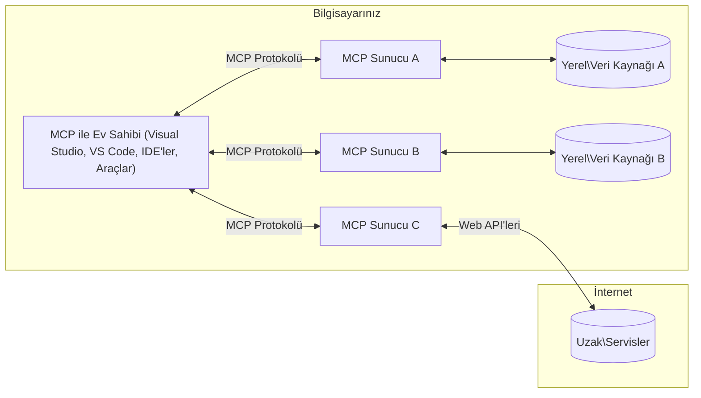

# MCP Temel Kavramları: Yapay Zeka Entegrasyonu için Model Bağlam Protokolünü Ustalaşma

[](https://youtu.be/earDzWGtE84)

_(Bu dersin videosunu izlemek için yukarıdaki resme tıklayın)_

[Model Bağlam Protokolü (MCP)](https://github.com/modelcontextprotocol), Büyük Dil Modelleri (LLM'ler) ile dış araçlar, uygulamalar ve veri kaynakları arasındaki iletişimi optimize eden güçlü ve standartlaştırılmış bir çerçevedir.  
Bu rehber size MCP'nin temel kavramlarını anlatacak. İstemci-sunucu mimarisi, temel bileşenler, iletişim mekanizmaları ve uygulama en iyi uygulamaları hakkında bilgi edineceksiniz.

- **Açık Kullanıcı Onayı**: Tüm veri erişimleri ve işlemler, yürütülmeden önce açık kullanıcı onayı gerektirir. Kullanıcılar hangi verilere erişileceğini ve hangi işlemlerin yapılacağını net bir şekilde anlamalı, izinler ve yetkilendirme üzerinde ayrıntılı kontrol sahibi olmalıdır.

- **Veri Gizliliği Koruması**: Kullanıcı verileri yalnızca açık onay ile paylaşılır ve tüm etkileşim sürecinde güçlü erişim kontrolleriyle korunmalıdır. Uygulamalar yetkisiz veri iletimini engellemeli ve sıkı gizlilik sınırları korumalıdır.

- **Araç Çalıştırma Güvenliği**: Her araç çağrısı açık kullanıcı onayı ile yapılmalıdır; aracın işlevi, parametreleri ve olası etkileri açıkça anlaşılmalıdır. Sağlam güvenlik sınırları, istenmeyen, güvensiz veya kötü niyetli araç çalıştırmayı önlemelidir.

- **Taşıma Katmanı Güvenliği**: Tüm iletişim kanalları uygun şifreleme ve kimlik doğrulama mekanizmaları kullanmalıdır. Uzaktan bağlantılar güvenli taşıma protokolleri ve uygun kimlik bilgisi yönetimi uygulamalıdır.

#### Uygulama Yönergeleri:

- **İzin Yönetimi**: Kullanıcıların hangi sunuculara, araçlara ve kaynaklara erişeceğini kontrol etmelerini sağlayan hassas izin sistemleri uygulayın  
- **Kimlik Doğrulama & Yetkilendirme**: Güvenli kimlik doğrulama yöntemleri (OAuth, API anahtarları) ve uygun token yönetimi ile birlikte süre sınırı kullanın  
- **Girdi Doğrulama**: Enjeksiyon saldırılarını önlemek için tanımlı şemalara göre tüm parametreleri ve veri girişlerini doğrulayın  
- **Denetim Kaydı**: Güvenlik izleme ve uyumluluk için tüm işlemlerin kapsamlı kayıtlarını tutun

## Genel Bakış

Bu ders, Model Bağlam Protokolü (MCP) ekosisteminin temel mimarisi ve bileşenlerini keşfeder. MCP etkileşimlerini güçlendiren istemci-sunucu mimarisi, ana bileşenler ve iletişim mekanizmaları hakkında bilgi sahibi olacaksınız.

## Temel Öğrenme Hedefleri

Bu dersin sonunda:

- MCP istemci-sunucu mimarisini anlayacaksınız.  
- Hostların, İstemcilerin ve Sunucuların rollerini ve sorumluluklarını tanımlayacaksınız.  
- MCP'yi esnek bir entegrasyon katmanı yapan temel özellikleri analiz edeceksiniz.  
- MCP ekosisteminde bilgi akışını öğreneceksiniz.  
- .NET, Java, Python ve JavaScript dillerinde kod örnekleriyle pratik bilgiler kazanacaksınız.

## MCP Mimarisi: Derinlemesine Bakış

MCP ekosistemi istemci-sunucu modeli üzerine kuruludur. Bu modüler yapı, yapay zeka uygulamalarının araçlar, veritabanları, API'ler ve bağlamsal kaynaklarla verimli şekilde etkileşmesini sağlar. Bu mimariyi temel bileşenlerine ayıralım.

Temelde MCP, bir ev sahibi uygulamanın birden fazla sunucuya bağlanabildiği bir istemci-sunucu mimarisini takip eder:


- **MCP Hostları**: VSCode, Claude Desktop, IDE’ler veya MCP üzerinden verilere erişmek isteyen yapay zeka araçları gibi programlar  
- **MCP İstemcileri**: Sunucularla bire bir bağlantı kuran protokol istemcileri  
- **MCP Sunucuları**: Standart Model Bağlam Protokolü aracılığıyla belirli yetenekleri sunan hafif programlar  
- **Yerel Veri Kaynakları**: MCP sunucularının güvenli şekilde erişebileceği bilgisayarınızdaki dosyalar, veritabanları ve servisler  
- **Uzak Servisler**: İnternet üzerinden erişilebilen ve MCP sunucularının API'ler aracılığıyla bağlanabildiği dış sistemler.

MCP Protokolü, tarih bazlı versiyonlama (YYYY-AA-GG formatı) kullanan gelişmekte olan bir standarttır. Mevcut protokol sürümü **2025-11-25**’tir. En son güncellemeleri [protokol spesifikasyonunda](https://modelcontextprotocol.io/specification/2025-11-25/) görebilirsiniz.

### 1. Hostlar

Model Bağlam Protokolü’nde (MCP) **Hostlar**, kullanıcıların protokolle etkileşime geçtiği birincil arayüz olarak görev yapan yapay zeka uygulamalarıdır. Hostlar, her sunucu bağlantısı için özel MCP istemcileri oluşturarak çoklu MCP sunucularına bağlanmayı koordine eder ve yönetir. Hostlara örnek olarak:

- **Yapay Zeka Uygulamaları**: Claude Desktop, Visual Studio Code, Claude Code  
- **Geliştirme Ortamları**: MCP entegrasyonlu IDE’ler ve kod editörleri  
- **Özel Uygulamalar**: Amaca yönelik geliştirilmiş yapay zeka ajanları ve araçları

**Hostlar**, yapay zeka model etkileşimlerini koordine eden uygulamalardır.  
Onlar:

- **Yapay Zeka Modellerini Yürütür**: Yanıt üretmek ve AI iş akışlarını koordine etmek için LLM’lerle etkileşimde bulunur  
- **İstemci Bağlantılarını Yöneti**: Her MCP sunucusuna bir MCP istemcisi oluşturur ve sürdürür  
- **Kullanıcı Arayüzünü Denetler**: Konuşma akışını, kullanıcı etkileşimlerini ve yanıt sunumunu yönetir  
- **Güvenliği Uygular**: İzinleri, güvenlik kısıtlamalarını ve kimlik doğrulamayı kontrol eder  
- **Kullanıcı Onayını Yönetir**: Veri paylaşımı ve araç çalıştırma için kullanıcı onayını sağlar

### 2. İstemciler

**İstemciler**, Host ile MCP sunucuları arasında özel bire bir bağlantılar kuran temel bileşenlerdir. Her MCP istemcisi, Host tarafından belirli bir MCP sunucusuna bağlanmak için oluşturulur ve düzenli, güvenli iletişim kanalları sunar. Birden fazla istemci, Hostların aynı anda birden fazla sunucuya bağlanabilmesini sağlar.

**İstemciler**, host uygulaması içinde bağlantı bileşenleridir.  
Görevleri:

- **Protokol İletişimi**: İstek ve talimatları JSON-RPC 2.0 formatında sunuculara gönderir  
- **Yetenek Müzakeresi**: Başlangıçta sunucuyla desteklenen özellikler ve protokol sürümlerini görüşür  
- **Araç Çalıştırma Yönetimi**: Modellerden gelen araç çalıştırma taleplerini yönetir ve yanıtları işler  
- **Gerçek Zamanlı Güncellemeler**: Sunucudan gelen bildirimleri ve güncellemeleri yönetir  
- **Yanıt İşleme**: Sunucu yanıtlarını kullanıcıya gösterilmek üzere işler ve biçimlendirir

### 3. Sunucular

**Sunucular**, MCP istemcilerine bağlam, araçlar ve yetenekler sunan programlardır. Yerel (Host ile aynı makinede) veya uzak (dış platformlarda) çalışabilirler ve istemci taleplerini işlemek ile yapılandırılmış yanıtlar sunmakla sorumludur. Sunucular, standart Model Bağlam Protokolü aracılığıyla belirli işlevsellikler sunar.

**Sunucular**, bağlam ve yetenek sağlayan servislerdir.  
Görevleri:

- **Özellik Kaydı**: Mevcut yapıtaşlarını (kaynaklar, istemler, araçlar) kaydeder ve istemcilere sunar  
- **Talep İşleme**: İstemcilerden gelen araç çağrıları, kaynak istekleri ve istem taleplerini alır ve uygular  
- **Bağlam Sağlama**: Model yanıtlarını geliştirmek için bağlamsal bilgi ve veri sağlar  
- **Durum Yönetimi**: Oturum durumunu saklar ve gerektiğinde durumlu etkileşimleri yönetir  
- **Gerçek Zamanlı Bildirimler**: Yetkinlik değişiklikleri ve güncellemeler hakkında bağlı istemcilere bildirim gönderir

Sunucular, model yeteneklerini özel işlevsellikle genişletebilir ve hem yerel hem de uzak dağıtım senaryolarını destekler.

### 4. Sunucu Primitifleri

Model Bağlam Protokolü (MCP) sunucuları, istemciler, hostlar ve dil modelleri arasında zengin etkileşimlerin temel yapı taşları olarak üç çekirdek **primitif** sağlar. Bu primitifler, protokol aracılığıyla kullanılabilen bağlamsal bilgi ve eylem türlerini tanımlar.

MCP sunucuları aşağıdaki üç temel primitifin herhangi bir bileşimini sunabilir:

#### Kaynaklar

**Kaynaklar**, yapay zeka uygulamalarına bağlamsal bilgi sağlayan veri kaynaklarıdır. Model anlayışını ve karar verme süreçlerini geliştiren statik veya dinamik içerikleri temsil eder:

- **Bağlamsal Veri**: AI modeli kullanımı için yapılandırılmış bilgi ve bağlam  
- **Bilgi Tabanları**: Doküman depoları, makaleler, kılavuzlar ve araştırma belgeleri  
- **Yerel Veri Kaynakları**: Dosyalar, veritabanları ve yerel sistem bilgileri  
- **Dış Veri**: API yanıtları, web servisleri ve uzak sistem verileri  
- **Dinamik İçerik**: Dış koşullara bağlı olarak gerçek zamanlı güncellenen veriler

Kaynaklar URI’lerle tanımlanır; `resources/list` ile keşfedilir ve `resources/read` ile elde edilir:

```text
file://documents/project-spec.md
database://production/users/schema
api://weather/current
```

#### İstemler

**İstemler**, dil modelleriyle etkileşimleri yapılandırmaya yardımcı olan yeniden kullanılabilir şablonlardır. Standartlaştırılmış etkileşim örüntüleri ve şablonlanmış iş akışları sağlarlar:

- **Şablon Temelli Etkileşimler**: Önceden yapılandırılmış mesajlar ve konuşma başlatıcıları  
- **İş Akış Şablonları**: Yaygın görev ve etkileşimler için standart diziler  
- **Few-shot Örnekleri**: Model eğitimi için örnek tabanlı şablonlar  
- **Sistem İstemleri**: Model davranışı ve bağlamını tanımlayan temel istemler  
- **Dinamik Şablonlar**: Belirli bağlamlara uyum sağlayan parametreli istemler

İstemler değişken ikamelerini destekler ve `prompts/list` ile keşfedilip `prompts/get` ile alınabilir:

```markdown
Generate a {{task_type}} for {{product}} targeting {{audience}} with the following requirements: {{requirements}}
```

#### Araçlar

**Araçlar**, AI modellerinin belirli eylemleri gerçekleştirmek için çağırabileceği yürütülebilir fonksiyonlardır. MCP ekosisteminin "fiilleri" olarak modellerin dış sistemlerle etkileşime girmesini sağlarlar:

- **Yürütülebilir Fonksiyonlar**: Modellerin belirli parametrelerle çağırabileceği ayrık işlemler  
- **Dış Sistem Entegrasyonu**: API çağrıları, veritabanı sorguları, dosya işlemleri, hesaplamalar  
- **Benzersiz Kimlik**: Her aracın ayrı isim, tanım ve parametre şeması bulunur  
- **Yapılandırılmış Girdi/Çıktı**: Araçlar doğrulanmış parametreler alır ve yapılandırılmış, tiplenmiş yanıt döner  
- **Eylem Yetkinlikleri**: Modellerin gerçek dünya eylemleri yapmasını ve canlı veri almasını sağlar

Araçlar parametre doğrulaması için JSON Şeması ile tanımlanır; `tools/list` ile keşfedilir ve `tools/call` ile çalıştırılır. Araç tanımlarında kullanıcı arayüzü sunumu için **ikonlar** ek metadata olarak bulunabilir.

**Araç Açıklamaları**: Araçlar, istemcilerin araç çalıştırma kararlarını desteklemek için okunur-yalnızca (`readOnlyHint`) veya yıkıcı (`destructiveHint`) gibi davranışsal açıklamaları destekler.

Araç tanımı örneği:

```typescript
server.tool(
  "search_products", 
  {
    query: z.string().describe("Search query for products"),
    category: z.string().optional().describe("Product category filter"),
    max_results: z.number().default(10).describe("Maximum results to return")
  }, 
  async (params) => {
    // Aramayı yürütün ve yapılandırılmış sonuçları döndürün
    return await productService.search(params);
  }
);
```

## İstemci Primitifleri

Model Bağlam Protokolü’nde (MCP) **istemciler**, sunucuların host uygulamasından ek yetenekler talep etmesine olanak sağlayan primitifler sunabilir. Bu istemci tarafı primitifler, AI model yeteneklerine ve kullanıcı etkileşimlerine erişebilen daha zengin, etkileşimli sunucu uygulamalarına imkan verir.

### Örnekleme (Sampling)

**Örnekleme**, sunucuların istemcinin AI uygulaması üzerinden dil modeli tamamlama istekleri göndermesine olanak tanır. Bu primitif, sunucuların kendi model bağımlılıklarını gömme gereksinimi olmadan LLM yeteneklerine erişmesini sağlar:

- **Model Bağımsız Erişim**: Sunucular, LLM SDK'ları eklemeden veya model erişimi yönetmeden tamamlama isteyebilir  
- **Sunucu Başlatımlı Yapay Zeka**: Sunucular, istemcinin yapay zeka modeli ile içerik oluşturabilir  
- **Özyinelemeli LLM Etkileşimleri**: Sunucuların AI desteği gerektiren karmaşık senaryolarını destekler  
- **Dinamik İçerik Oluşturma**: Sunucular, hostun modeli kullanarak bağlamsal yanıtlar üretebilir  
- **Araç Çağrı Desteği**: Sunucular, sampling isteğinde `tools` ve `toolChoice` parametreleriyle istemci modelinin araç çağırmasına izin verebilir

Sampling, sunucuların istemcilere tamamlama istekleri gönderdiği `sampling/complete` yöntemiyle başlatılır.

### Kökler (Roots)

**Kökler**, istemcilerin sunuculara dosya sistemi sınırlarını standartlaştırılmış şekilde açmasına olanak tanır; böylece sunucular hangi dizin ve dosyalara erişebileceğini anlar:

- **Dosya Sistemi Sınırları**: Sunucuların dosya sistemi üzerinde hangi alanlarda işlem yapabileceğini tanımlar  
- **Erişim Kontrolü**: Sunucuların erişim izni olan dizinler ve dosyalar hakkında bilgi verir  
- **Dinamik Güncellemeler**: İstemciler, kök listesinde değişiklik olduğunda sunucuları bilgilendirir  
- **URI Tabanlı Tanımlama**: Kökler `file://` URI’leri ile erişilebilir dizin ve dosyalar olarak tanımlanır

Kökler `roots/list` yöntemiyle keşfedilir; kökler değiştiğinde istemciler `notifications/roots/list_changed` bildirimi gönderir.

### Bilgi Toplama (Elicitation)

**Bilgi Toplama**, sunucuların istemci arayüzü üzerinden kullanıcılardan ek bilgi veya onay istemesine olanak tanır:

- **Kullanıcı Girdi Talepleri**: Araç çalıştırma için gereken ek bilgi sunucular tarafından istenebilir  
- **Onay Diyalogları**: Hassas veya etkili işlemler için kullanıcı onayı istenir  
- **Etkileşimli İş Akışları**: Sunucular adım adım kullanıcı etkileşimleri oluşturabilir  
- **Dinamik Parametre Toplama**: Araç çalıştırırken eksik veya opsiyonel parametreler toplanır

Bilgi toplama istekleri `elicitation/request` yöntemiyle istemci arayüzünden kullanıcı girdisi toplamak için yapılır.

**URL Modu Bilgi Toplama**: Sunucular, kullanıcıları kimlik doğrulama, onay veya veri girişi için dış web sayfalarına yönlendirmek amacıyla URL tabanlı etkileşimler de talep edebilir.

### Günlükleme (Logging)

**Günlükleme**, sunucuların hata ayıklama, izleme ve operasyon görünürlüğü için istemcilere yapılandırılmış günlük mesajları göndermesini sağlar:

- **Hata Ayıklama Desteği**: Sunuculara detaylı yürütme günlüğü sağlama imkanı  
- **Operasyonel İzleme**: İstemcilere durum güncellemeleri ve performans metrikleri gönderme  
- **Hata Bildirimi**: Detaylı hata bağlamı ve tanı bilgisi sunma  
- **Denetim İzleri**: Sunucu işlemleri ve kararları için kapsamlı günlükler oluşturma

Günlük mesajları, sunucu işlemleri hakkında şeffaflık sağlar ve hata ayıklamayı kolaylaştırır.

## MCP’de Bilgi Akışı

Model Bağlam Protokolü (MCP), hostlar, istemciler, sunucular ve modeller arasında yapılandırılmış bilgi akışını tanımlar. Bu akışı anlamak, kullanıcı isteklerinin nasıl işlendiğini ve dış araçların ve verilerin model yanıtlarına nasıl entegre edildiğini netleştirir.
- **Host Bağlantıyı Başlatır**  
  Host uygulaması (örneğin bir IDE veya sohbet arayüzü), genellikle STDIO, WebSocket veya başka bir desteklenen taşıma yöntemiyle bir MCP sunucusuna bağlantı kurar.

- **Yetenek Müzakeresi**  
  İstemci (host içinde gömülü) ve sunucu, destekledikleri özellikler, araçlar, kaynaklar ve protokol sürümleri hakkında bilgi alışverişi yapar. Bu, her iki tarafın da oturum için hangi yeteneklerin mevcut olduğunu anlamasını sağlar.

- **Kullanıcı Talebi**  
  Kullanıcı host ile etkileşime girer (örneğin bir komut veya istem girer). Host bu girdiyi toplar ve işlenmesi için istemciye iletir.

- **Kaynak veya Araç Kullanımı**  
  - İstemci, modelin anlayışını zenginleştirmek için sunucudan ek bağlam veya kaynaklar (örneğin dosyalar, veri tabanı girdileri veya bilgi tabanı makaleleri) talep edebilir.  
  - Model bir aracın gerektiğine karar verirse (örneğin veri almak, hesaplama yapmak veya bir API çağırmak için), istemci aracın adını ve parametrelerini belirterek sunucuya bir araç çağrısı isteği gönderir.

- **Sunucu İşlemi**  
  Sunucu kaynak veya araç isteğini alır, gerekli işlemleri gerçekleştirir (örneğin bir fonksiyonu çalıştırmak, veri tabanını sorgulamak veya dosya almak) ve sonuçları yapılandırılmış formatta istemciye geri gönderir.

- **Yanıt Oluşturma**  
  İstemci sunucudan gelen yanıtları (kaynak verisi, araç çıktıları vb.) devam eden model etkileşimine entegre eder. Model, kapsamlı ve bağlama uygun bir yanıt üretmek için bu bilgileri kullanır.

- **Sonuç Sunumu**  
  Host istemciden son çıktıyı alır ve kullanıcıya sunar; genellikle model tarafından oluşturulan metin ile araç işlemleri veya kaynak aramalarından elde edilen sonuçları birlikte gösterir.

Bu akış, MCP’nin modelleri harici araçlar ve veri kaynaklarıyla sorunsuzca bağlayarak ileri düzey, etkileşimli ve bağlam farkındalığı yüksek yapay zeka uygulamalarını desteklemesini sağlar.

## Protokol Mimarisi ve Katmanlar

MCP, tam bir iletişim çerçevesi sağlamak için birlikte çalışan iki ayrı mimari katmandan oluşur:

### Veri Katmanı

**Veri Katmanı**, temel MCP protokolünü **JSON-RPC 2.0** kullanarak uygular. Bu katman mesaj yapısını, anlambilimini ve etkileşim modellerini tanımlar:

#### Temel Bileşenler:

- **JSON-RPC 2.0 Protokolü**: Tüm iletişim, metod çağrıları, yanıtlar ve bildirimler için standart JSON-RPC 2.0 mesaj formatını kullanır  
- **Yaşam Döngüsü Yönetimi**: İstemci ve sunucular arasında bağlantı başlatma, yetenek müzakeresi ve oturum sonlandırmayı yönetir  
- **Sunucu Primitifleri**: Sunucuların araçlar, kaynaklar ve istemler aracılığıyla temel işlevsellik sağlamasına olanak tanır  
- **İstemci Primitifleri**: Sunucuların LLM’lerden örnekleme istemesine, kullanıcı girdisi almaya ve günlük mesajları göndermeye olanak tanır  
- **Gerçek Zamanlı Bildirimler**: Yoklama olmadan dinamik güncellemeler için eşzamansız bildirimleri destekler

#### Ana Özellikler:

- **Protokol Sürüm Müzakeresi**: Uyumluluğu sağlamak için tarih tabanlı sürümleme (YYYY-AA-GG) kullanır  
- **Yetenek Keşfi**: Başlangıçta istemci ve sunucular desteklenen özellik bilgisini değiş tokuş eder  
- **Durumlu Oturumlar**: Bağlantı durumunu birden fazla etkileşim boyunca koruyarak bağlam sürekliliği sağlar

### Taşıma Katmanı

**Taşıma Katmanı**, MCP katılımcıları arasında iletişim kanallarını, mesaj çerçevelemeyi ve kimlik doğrulamayı yönetir:

#### Desteklenen Taşıma Mekanizmaları:

1. **STDIO Taşımacılığı**:  
   - Doğrudan süreç iletişimi için standart giriş/çıkış akışlarını kullanır  
   - Aynı makinedeki yerel süreçler için ağ yükü olmadan optimaldir  
   - Yerel MCP sunucu uygulamaları için yaygın olarak kullanılır

2. **Akış Destekli HTTP Taşımacılığı**:  
   - İstemciden sunucuya mesajlar için HTTP POST kullanır  
   - Opsiyonel olarak sunucudan istemciye akış için Server-Sent Events (SSE) destekler  
   - Ağlar üzerinden uzak sunucu iletişimini mümkün kılar  
   - Standart HTTP kimlik doğrulamasını (bearer token, API anahtarları, özel başlıklar) destekler  
   - MCP, güvenli token tabanlı kimlik doğrulama için OAuth’u önerir

#### Taşıma Soyutlaması:

Taşıma katmanı, iletişim detaylarını veri katmanından soyutlar, böylece tüm taşıma mekanizmalarında aynı JSON-RPC 2.0 mesaj formatının kullanılması sağlanır. Bu soyutlama, uygulamaların yerel ve uzak sunucular arasında sorunsuz geçiş yapmasına olanak tanır.

### Güvenlik Hususları

MCP uygulamaları, tüm protokol işlemlerinde güvenli, güvenilir ve emniyetli etkileşimleri sağlamak için birkaç kritik güvenlik ilkesine uymalıdır:

- **Kullanıcı Onayı ve Kontrolü**: Kullanıcılar, herhangi bir veri erişimi veya işlem yapılmadan önce açık rıza vermelidir. Paylaşılan veriler ve yetkilendirilen işlemler üzerinde net kontrol sağlanmalı, faaliyetlerin gözden geçirilip onaylanması için sezgisel kullanıcı arayüzleri desteklenmelidir.

- **Veri Gizliliği**: Kullanıcı verileri sadece açık izinle paylaşılmalı ve uygun erişim kontrolleri ile korunmalıdır. MCP uygulamaları, yetkisiz veri iletimine karşı önlem almalı ve gizliliğin tüm etkileşimler boyunca korunmasını sağlamalıdır.

- **Araç Güvenliği**: Herhangi bir aracı çalıştırmadan önce açık kullanıcı onayı gereklidir. Kullanıcılar her aracın işlevselliğini net biçimde anlamalı ve beklenmedik veya güvensiz araç çalıştırmalarını önlemek için güçlü güvenlik sınırları uygulanmalıdır.

Bu güvenlik ilkeleri takip edilerek, MCP protokol etkileşimlerinde kullanıcı güveni, gizliliği ve emniyeti sağlanırken güçlü yapay zeka entegrasyonları mümkün kılınır.

## Kod Örnekleri: Temel Bileşenler

Aşağıda bazı popüler programlama dillerinde MCP sunucu bileşenleri ve araçların nasıl uygulanacağını gösteren kod örnekleri bulunmaktadır.

### .NET Örneği: Araçlarla Basit MCP Sunucusu Oluşturma

Aşağıda, özel araçlar içeren basit bir MCP sunucusunun nasıl uygulanacağına dair pratik .NET kod örneği yer almaktadır. Bu örnek, araçların nasıl tanımlanıp kaydedileceği, isteklerin nasıl işleneceği ve Model Context Protocol kullanılarak sunucunun nasıl bağlanacağı gösterilmektedir.

```csharp
using System;
using System.Threading.Tasks;
using ModelContextProtocol.Server;
using ModelContextProtocol.Server.Transport;
using ModelContextProtocol.Server.Tools;

public class WeatherServer
{
    public static async Task Main(string[] args)
    {
        // Create an MCP server
        var server = new McpServer(
            name: "Weather MCP Server",
            version: "1.0.0"
        );
        
        // Register our custom weather tool
        server.AddTool<string, WeatherData>("weatherTool", 
            description: "Gets current weather for a location",
            execute: async (location) => {
                // Call weather API (simplified)
                var weatherData = await GetWeatherDataAsync(location);
                return weatherData;
            });
        
        // Connect the server using stdio transport
        var transport = new StdioServerTransport();
        await server.ConnectAsync(transport);
        
        Console.WriteLine("Weather MCP Server started");
        
        // Keep the server running until process is terminated
        await Task.Delay(-1);
    }
    
    private static async Task<WeatherData> GetWeatherDataAsync(string location)
    {
        // This would normally call a weather API
        // Simplified for demonstration
        await Task.Delay(100); // Simulate API call
        return new WeatherData { 
            Temperature = 72.5,
            Conditions = "Sunny",
            Location = location
        };
    }
}

public class WeatherData
{
    public double Temperature { get; set; }
    public string Conditions { get; set; }
    public string Location { get; set; }
}
```

### Java Örneği: MCP Sunucu Bileşenleri

Bu örnek, yukarıdaki .NET örneğindeki MCP sunucusu ve araç kayıt işleminin Java ile nasıl yapıldığını gösterir.

```java
import io.modelcontextprotocol.server.McpServer;
import io.modelcontextprotocol.server.McpToolDefinition;
import io.modelcontextprotocol.server.transport.StdioServerTransport;
import io.modelcontextprotocol.server.tool.ToolExecutionContext;
import io.modelcontextprotocol.server.tool.ToolResponse;

public class WeatherMcpServer {
    public static void main(String[] args) throws Exception {
        // Bir MCP sunucusu oluştur
        McpServer server = McpServer.builder()
            .name("Weather MCP Server")
            .version("1.0.0")
            .build();
            
        // Bir hava durumu aracı kaydet
        server.registerTool(McpToolDefinition.builder("weatherTool")
            .description("Gets current weather for a location")
            .parameter("location", String.class)
            .execute((ToolExecutionContext ctx) -> {
                String location = ctx.getParameter("location", String.class);
                
                // Hava durumu verilerini al (basitleştirilmiş)
                WeatherData data = getWeatherData(location);
                
                // Formatlanmış yanıtı döndür
                return ToolResponse.content(
                    String.format("Temperature: %.1f°F, Conditions: %s, Location: %s", 
                    data.getTemperature(), 
                    data.getConditions(), 
                    data.getLocation())
                );
            })
            .build());
        
        // Sunucuyu stdio taşıma ile bağla
        try (StdioServerTransport transport = new StdioServerTransport()) {
            server.connect(transport);
            System.out.println("Weather MCP Server started");
            // İşlem sonlandırılana kadar sunucuyu çalışır tut
            Thread.currentThread().join();
        }
    }
    
    private static WeatherData getWeatherData(String location) {
        // Uygulama bir hava durumu API'sini çağırırdı
        // Örnek amaçlı basitleştirilmiştir
        return new WeatherData(72.5, "Sunny", location);
    }
}

class WeatherData {
    private double temperature;
    private String conditions;
    private String location;
    
    public WeatherData(double temperature, String conditions, String location) {
        this.temperature = temperature;
        this.conditions = conditions;
        this.location = location;
    }
    
    public double getTemperature() {
        return temperature;
    }
    
    public String getConditions() {
        return conditions;
    }
    
    public String getLocation() {
        return location;
    }
}
```

### Python Örneği: MCP Sunucusu Kurma

Bu örnek fastmcp kullanmaktadır, lütfen önce kurulumunu yapınız:

```python
pip install fastmcp
```
Kod Örneği:

```python
#!/usr/bin/env python3
import asyncio
from fastmcp import FastMCP
from fastmcp.transports.stdio import serve_stdio

# Bir FastMCP sunucusu oluştur
mcp = FastMCP(
    name="Weather MCP Server",
    version="1.0.0"
)

@mcp.tool()
def get_weather(location: str) -> dict:
    """Gets current weather for a location."""
    return {
        "temperature": 72.5,
        "conditions": "Sunny",
        "location": location
    }

# Bir sınıf kullanarak alternatif yaklaşım
class WeatherTools:
    @mcp.tool()
    def forecast(self, location: str, days: int = 1) -> dict:
        """Gets weather forecast for a location for the specified number of days."""
        return {
            "location": location,
            "forecast": [
                {"day": i+1, "temperature": 70 + i, "conditions": "Partly Cloudy"}
                for i in range(days)
            ]
        }

# Sınıf araçlarını kaydet
weather_tools = WeatherTools()

# Sunucuyu başlat
if __name__ == "__main__":
    asyncio.run(serve_stdio(mcp))
```

### JavaScript Örneği: MCP Sunucusu Oluşturma

Bu örnek, JavaScript ile MCP sunucusu oluşturmayı ve iki hava durumu ile ilgili aracın kaydını göstermektedir.

```javascript
// Resmi Model Context Protocol SDK'sını kullanma
import { McpServer } from "@modelcontextprotocol/sdk/server/mcp.js";
import { StdioServerTransport } from "@modelcontextprotocol/sdk/server/stdio.js";
import { z } from "zod"; // Parametre doğrulaması için

// Bir MCP sunucusu oluştur
const server = new McpServer({
  name: "Weather MCP Server",
  version: "1.0.0"
});

// Bir hava durumu aracı tanımla
server.tool(
  "weatherTool",
  {
    location: z.string().describe("The location to get weather for")
  },
  async ({ location }) => {
    // Bu genellikle bir hava durumu API'sini çağırır
    // Gösterim için basitleştirilmiştir
    const weatherData = await getWeatherData(location);
    
    return {
      content: [
        { 
          type: "text", 
          text: `Temperature: ${weatherData.temperature}°F, Conditions: ${weatherData.conditions}, Location: ${weatherData.location}` 
        }
      ]
    };
  }
);

// Bir tahmin aracı tanımla
server.tool(
  "forecastTool",
  {
    location: z.string(),
    days: z.number().default(3).describe("Number of days for forecast")
  },
  async ({ location, days }) => {
    // Bu genellikle bir hava durumu API'sini çağırır
    // Gösterim için basitleştirilmiştir
    const forecast = await getForecastData(location, days);
    
    return {
      content: [
        { 
          type: "text", 
          text: `${days}-day forecast for ${location}: ${JSON.stringify(forecast)}` 
        }
      ]
    };
  }
);

// Yardımcı fonksiyonlar
async function getWeatherData(location) {
  // API çağrısını simüle et
  return {
    temperature: 72.5,
    conditions: "Sunny",
    location: location
  };
}

async function getForecastData(location, days) {
  // API çağrısını simüle et
  return Array.from({ length: days }, (_, i) => ({
    day: i + 1,
    temperature: 70 + Math.floor(Math.random() * 10),
    conditions: i % 2 === 0 ? "Sunny" : "Partly Cloudy"
  }));
}

// stdio taşıma kullanarak sunucuya bağlan
const transport = new StdioServerTransport();
server.connect(transport).catch(console.error);

console.log("Weather MCP Server started");
```

Bu JavaScript örneği, Model Context Protocol SDK kullanarak bir MCP sunucusu nasıl oluşturulur gösterir. `weatherTool` ve `forecastTool` adında iki aracın nasıl kaydedilip `StdioServerTransport` aracılığıyla MCP istemcilerine sunulduğunu gösterir.

## Güvenlik ve Yetkilendirme

MCP, protokol boyunca güvenlik ve yetkilendirmeyi yönetmek için birkaç yerleşik konsept ve mekanizma içerir:

1. **Araç İzin Kontrolü**:  
  İstemciler, bir modelin oturum sırasında hangi araçları kullanabileceğini belirtebilir. Bu, yalnızca açıkça yetkilendirilmiş araçların erişilebilir olmasını sağlar ve istenmeyen veya güvensiz işlemlerin riskini azaltır. İzinler, kullanıcı tercihlerine, organizasyon politikalarına veya etkileşim bağlamına bağlı olarak dinamik biçimde yapılandırılabilir.

2. **Kimlik Doğrulama**:  
  Sunucular, araçlara, kaynaklara veya hassas işlemlere erişim öncesinde kimlik doğrulama isteyebilir. Bu API anahtarları, OAuth tokenları veya diğer doğrulama şemalarını içerebilir. Doğru kimlik doğrulama, yalnızca güvenilir istemci ve kullanıcıların sunucu tarafı yeteneklerini çağırmasını sağlar.

3. **Doğrulama**:  
  Tüm araç çağrılarında parametre doğrulaması uygulanır. Her araç, parametreler için beklenen türleri, formatları ve kısıtlamaları tanımlar ve sunucu gelen istekleri buna göre doğrular. Bu, hatalı veya kötü niyetli girdilerin araç uygulamalarına ulaşmasını engeller ve işlemlerin bütünlüğünü korumaya yardımcı olur.

4. **Oran Sınırlaması**:  
  Kötüye kullanımı önlemek ve sunucu kaynaklarının adil kullanımını sağlamak için MCP sunucuları, araç çağrıları ve kaynak erişimleri için oran sınırlaması uygulayabilir. Oran limitleri kullanıcı başına, oturum başına veya genel olarak uygulanabilir ve hizmet engelleme saldırılarına veya aşırı kaynak tüketimine karşı koruma sağlar.

Bu mekanizmaların birleşimiyle, MCP, dil modellerini harici araçlar ve veri kaynaklarıyla güvenli bir şekilde entegre etmek için sağlam bir temel sunarken, kullanıcılar ve geliştiricilere erişim ve kullanım üzerinde ayrıntılı kontrol imkanı verir.

## Protokol Mesajları ve İletişim Akışı

MCP iletişimi, host, istemci ve sunucular arasında açık ve güvenilir etkileşimleri kolaylaştırmak için yapılandırılmış **JSON-RPC 2.0** mesajları kullanır. Protokol, farklı işlem türleri için belirli mesaj desenleri tanımlar:

### Temel Mesaj Türleri:

#### **Başlatma Mesajları**  
- **`initialize` Talebi**: Bağlantıyı kurar ve protokol sürümü ile yetenekleri müzakere eder  
- **`initialize` Yanıtı**: Desteklenen özellikleri ve sunucu bilgilerini doğrular  
- **`notifications/initialized`**: Başlatmanın tamamlandığını ve oturumun hazır olduğunu bildirir

#### **Keşif Mesajları**  
- **`tools/list` Talebi**: Sunucudan mevcut araçları keşfeder  
- **`resources/list` Talebi**: Mevcut kaynakları (veri kaynakları) listeler  
- **`prompts/list` Talebi**: Mevcut istem şablonlarını alır

#### **İşlem Mesajları**  
- **`tools/call` Talebi**: Belirli bir aracı verilen parametrelerle çalıştırır  
- **`resources/read` Talebi**: Belirli bir kaynaktan içerik alır  
- **`prompts/get` Talebi**: İsteğe bağlı parametrelerle bir istem şablonu getirir

#### **İstemci Tarafı Mesajları**  
- **`sampling/complete` Talebi**: Sunucu, istemciden LLM tamamlanmasını ister  
- **`elicitation/request`**: Sunucu, istemci arayüzü üzerinden kullanıcı girdisi ister  
- **Günlük Mesajları**: Sunucu, istemciye yapılandırılmış günlük mesajları gönderir

#### **Bildirim Mesajları**  
- **`notifications/tools/list_changed`**: Sunucu, araç değişiklikleri hakkında istemciyi bilgilendirir  
- **`notifications/resources/list_changed`**: Sunucu, kaynak değişiklikleri hakkında istemciyi bilgilendirir  
- **`notifications/prompts/list_changed`**: Sunucu, istem şablonu değişiklikleri hakkında istemciyi bilgilendirir

### Mesaj Yapısı:

Tüm MCP mesajları JSON-RPC 2.0 formatını takip eder:  
- **Talep Mesajları**: `id`, `method` ve opsiyonel `params` içerir  
- **Yanıt Mesajları**: `id` ve ya `result` ya da `error` içerir  
- **Bildirim Mesajları**: `method` ve opsiyonel `params` içerir (id yok, yanıt beklenmez)

Bu yapılandırılmış iletişim, gerçek zamanlı güncellemeler, araç zincirleme ve sağlam hata yönetimi gibi gelişmiş senaryoları destekleyerek güvenilir, izlenebilir ve genişletilebilir etkileşimler sağlar.

### Görevler (Deneysel)

**Görevler**, MCP istekleri için ertelenmiş sonuç alınmasına ve durum takibine olanak veren dayanıklı yürütme sarıcıları sağlayan deneysel bir özelliktir:

- **Uzun Süreli Operasyonlar**: Maliyetli hesaplamalar, iş akışı otomasyonu ve toplu işlemeyi takip eder  
- **Ertelenmiş Sonuçlar**: İşlemler tamamlandığında görev durumunu sorgulama ve sonuçları alma imkanı sağlar  
- **Durum Takibi**: Tanımlı yaşam döngüsü aşamaları boyunca görev ilerlemesini izler  
- **Çok Adımlı İşlemler**: Birden fazla etkileşimi kapsayan karmaşık iş akışlarını destekler

Görevler, standart MCP isteklerini sarar ve anında tamamlanamayan işlemler için eşzamansız yürütme desenlerini mümkün kılar.

## Anahtar Noktalar

- **Mimari**: MCP, hostların birden fazla istemci bağlantısını sunuculara yönettiği istemci-sunucu mimarisine sahiptir  
- **Katılımcılar**: Ekosistem; hostlar (Yapay Zeka uygulamaları), istemciler (protokol bağlayıcılar) ve sunucular (yetenek sağlayıcılar) içerir  
- **Taşıma Mekanizmaları**: İletişim STDIO (yerel) ve isteğe bağlı SSE destekli Streamable HTTP (uzak) taşımasını destekler  
- **Temel Primitifler**: Sunucular, araçlar (çalıştırılabilir fonksiyonlar), kaynaklar (veri kaynakları) ve istemler (şablonlar) sağlar  
- **İstemci Primitifleri**: Sunucular, istemcilerden örnekleme (LLM tamamlamaları ve araç çağrısı destekli), bilgi alma (kullanıcı girişi ve URL modu dahil), kökleri (dosya sistemi sınırları) ve günlüklendirme talep edebilir  
- **Deneysel Özellikler**: Görevler, uzun süren işlemler için dayanıklı yürütme sarıcıları sunar  
- **Protokol Temeli**: JSON-RPC 2.0 üzerine kurulu, tarih tabanlı sürümleme kullanır (güncel: 2025-11-25)  
- **Gerçek Zamanlı Yetenekler**: Dinamik güncellemeler ve eşzamanlılık için bildirimleri destekler  
- **Güvenlik Önceliği**: Açık kullanıcı onayı, veri gizliliği koruması ve güvenli taşıma temel gereksinimlerdendir

## Alıştırma

Alanınızda faydalı olacak basit bir MCP aracı tasarlayın. Tanımlayın:  
1. Araç ne adla anılacak  
2. Hangi parametreleri kabul edecek  
3. Hangi çıktıyı döndürecek  
4. Bir model bu aracı kullanıcı problemlerini çözmek için nasıl kullanabilir

---

## Sonraki

Sonraki: [Bölüm 2: Güvenlik](../02-Security/README.md)

---

<!-- CO-OP TRANSLATOR DISCLAIMER START -->
**Feragatname**:  
Bu belge, AI çeviri hizmeti [Co-op Translator](https://github.com/Azure/co-op-translator) kullanılarak çevrilmiştir. Doğruluk için çaba göstersek de, otomatik çevirilerin hatalar veya yanlışlıklar içerebileceğini lütfen unutmayın. Orijinal belge, kendi dilinde yetkili kaynak olarak kabul edilmelidir. Kritik bilgiler için profesyonel insan çevirisi önerilir. Bu çevirinin kullanımıyla oluşabilecek yanlış anlama veya yorumlamalardan sorumlu değiliz.
<!-- CO-OP TRANSLATOR DISCLAIMER END -->