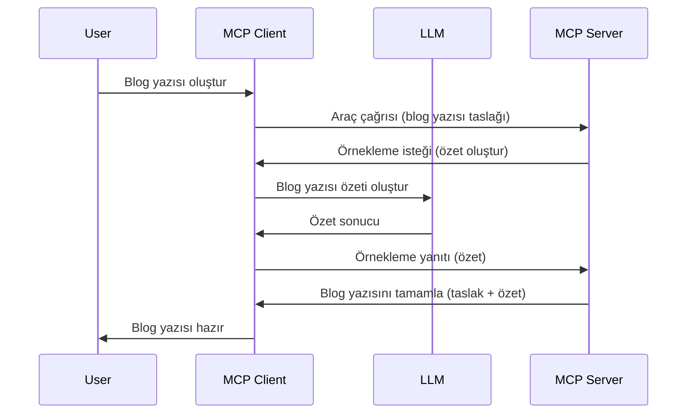

# Örnekleme - Özellikleri İstemciye Devretme

Bazen, ortak bir hedefe ulaşmak için MCP İstemcisi ve MCP Sunucusunun birlikte çalışması gerekir. Sunucunun, istemci üzerinde bulunan bir LLM'in yardımına ihtiyaç duyduğu bir durum olabilir. Bu durum için, kullanmanız gereken şey örneklemedir.

Bazı kullanım durumlarını ve örnekleme içeren bir çözümün nasıl kurulacağını inceleyelim.

## Genel Bakış

Bu derste, Örneklemenin ne zaman ve nerede kullanılacağını ve nasıl yapılandırılacağını açıklamaya odaklanacağız.

## Öğrenme Hedefleri

Bu bölümde:

- Örneklemenin ne olduğunu ve ne zaman kullanılacağını açıklayacağız.
- MCP'de Örneklemenin nasıl yapılandırılacağını göstereceğiz.
- Örneklemenin uygulamadaki örneklerini sunacağız.

## Örnekleme Nedir ve Neden Kullanılır?

Örnekleme, şu şekilde çalışan ileri bir özelliktir:



### Örnekleme isteği

Tamam, şimdi güvenilir bir senaryoya genel bir bakışımız var, sunucunun istemciye gönderdiği örnekleme isteğinden bahsedelim. Böyle bir istek JSON-RPC formatında şöyle görünebilir:

```json
{
  "jsonrpc": "2.0",
  "id": 1,
  "method": "sampling/createMessage",
  "params": {
    "messages": [
      {
        "role": "user",
        "content": {
          "type": "text",
          "text": "Create a blog post summary of the following blog post: <BLOG POST>"
        }
      }
    ],
    "modelPreferences": {
      "hints": [
        {
          "name": "claude-3-sonnet"
        }
      ],
      "intelligencePriority": 0.8,
      "speedPriority": 0.5
    },
    "systemPrompt": "You are a helpful assistant.",
    "maxTokens": 100
  }
}
```

Burada belirtmeye değer birkaç şey var:

- İçerik -> metin altında bulunan İstek, LLM'e blog yazısı içeriğini özetlemesi için verilen talimattır.

- **modelPreferences**. Bu bölüm tam olarak budur, bir tercih, LLM ile hangi yapılandırmanın kullanılacağına dair bir öneridir. Kullanıcı, bu önerilere uyabilir veya değiştirebilir. Bu durumda kullanılacak model, hız ve zeka önceliği hakkında öneriler vardır.
- **systemPrompt**, bu sizin normal sistem isteminizdir, LLM'e bir kişilik verir ve rehberlik talimatları içerir.
- **maxTokens**, bu, bu görev için kaç token kullanılmasının önerildiğini belirtmek için kullanılan başka bir özelliktir.

### Örnekleme yanıtı

Bu yanıt, MCP İstemcisinin MCP Sunucusuna gönderdiği cevaptır ve istemcinin LLM'i çağırması, yanıtı beklemesi ve sonra bu mesajı oluşturmasının sonucudur. JSON-RPC formatında böyle görünebilir:

```json
{
  "jsonrpc": "2.0",
  "id": 1,
  "result": {
    "role": "assistant",
    "content": {
      "type": "text",
      "text": "Here's your abstract <ABSTRACT>"
    },
    "model": "gpt-5",
    "stopReason": "endTurn"
  }
}
```

Yanıtın blog yazısının özetinden oluştuğuna dikkat edin, tam da talep ettiğimiz gibi. Ayrıca kullanılan `model`'in bizim istediğimiz değil "gpt-5" olduğunu, "claude-3-sonnet" yerine tercih edildiğini görebilirsiniz. Bu, kullanıcının ne kullanacağına kararını değiştirebileceğini ve örnekleme isteğinizin bir öneri olduğunu göstermek içindir.

Tamam, ana akışı ve işe yarar görevi anladığımıza göre "blog yazısı oluşturma + özet" için, bunu çalıştırmak için neler yapmamız gerektiğine bakalım.

### Mesaj türleri

Örnekleme mesajları sadece metinle sınırlı değildir; ayrıca resim ve ses de gönderebilirsiniz. İşte JSON-RPC'nin nasıl farklı göründüğü:

**Metin**

```json
{
  "type": "text",
  "text": "The message content"
}
```

**Resim içeriği**

```json
{
  "type": "image",
  "data": "base64-encoded-image-data",
  "mimeType": "image/jpeg"
}
```

**Ses içeriği**

```json
{
  "type": "audio",
  "data": "base64-encoded-audio-data",
  "mimeType": "audio/wav"
}
```

> NOT: Örnekleme hakkında daha detaylı bilgi için, [resmi dokümanları](https://modelcontextprotocol.io/specification/2025-11-25/client/sampling) inceleyin.

## İstemcide Örneklemenin Yapılandırılması

> Not: Sadece bir sunucu oluşturuyorsanız, burada çok bir şey yapmanıza gerek yoktur.

Bir istemcide, aşağıdaki özelliği şu şekilde belirtmeniz gerekir:

```json
{
  "capabilities": {
    "sampling": {}
  }
}
```

Bu, seçtiğiniz istemci sunucu ile başlatıldığında alınacaktır.

## Örnekleme Eyleminde Örnek - Bir Blog Yazısı Oluşturma

Bir örnekleme sunucusu kodlayalım, şunları yapmamız gerekecek:

1. Sunucuda bir araç oluşturun.
1. Bu araç bir örnekleme isteği oluşturmalı.
1. Araç, istemcinin örnekleme isteğine yanıt vermesini beklemeli.
1. Ardından araç sonucu üretilmeli.

Adım adım kodu görelim:

### -1- Aracı oluşturun

**python**

```python
@mcp.tool()
async def create_blog(title: str, content: str, ctx: Context[ServerSession, None]) -> str:
    """Create a blog post and generate a summary"""

```

### -2- Bir örnekleme isteği oluşturun

Aracınızı aşağıdaki kodla genişletin:

**python**

```python
post = BlogPost(
        id=len(posts) + 1,
        title=title,
        content=content,
        abstract=""
    )

prompt = f"Create an abstract of the following blog post: title: {title} and draft: {content} "

result = await ctx.session.create_message(
        messages=[
            SamplingMessage(
                role="user",
                content=TextContent(type="text", text=prompt),
            )
        ],
        max_tokens=100,
)

```

### -3- Yanıtı bekleyin ve yanıtı döndürün

**python**

```python
post.abstract = result.content.text

posts.append(post)

# tam ürünü geri döndür
return json.dumps({
    "id": post.title,
    "abstract": post.abstract
})
```

### -4- Tam kod

**python**

```python
from starlette.applications import Starlette
from starlette.routing import Mount, Host

from mcp.server.fastmcp import Context, FastMCP

from mcp.server.session import ServerSession
from mcp.types import SamplingMessage, TextContent

import json


from uuid import uuid4
from typing import List
from pydantic import BaseModel


mcp = FastMCP("Blog post generator")

# app = FastAPI()

posts = []

class BlogPost(BaseModel):
    id: int
    title: str
    content: str
    abstract: str

posts: List[BlogPost] = []

@mcp.tool()
async def create_blog(title: str, content: str, ctx: Context[ServerSession, None]) -> str:
    """Create a blog post and generate a summary"""

    post = BlogPost(
        id=len(posts) + 1,
        title=title,
        content=content,
        abstract=""
    )

    prompt = f"Create an abstract of the following blog post: title: {title} and draft: {content} "

    result = await ctx.session.create_message(
        messages=[
            SamplingMessage(
                role="user",
                content=TextContent(type="text", text=prompt),
            )
        ],
        max_tokens=100,
    )

    post.abstract = result.content.text

    posts.append(post)

    # tamamlanmış blog yazısını döndür
    return json.dumps({
        "id": post.title,
        "abstract": post.abstract
    })

if __name__ == "__main__":
    print("Starting server...")
    # mcp.run()
    mcp.run(transport="streamable-http")

# uygulamayı çalıştır: python server.py
```

### -5- Visual Studio Code'da test etmek

Bunu Visual Studio Code'da test etmek için şunları yapın:

1. Terminalde sunucuyu başlatın
1. *mcp.json* dosyasına ekleyin (ve başlatıldığından emin olun); şöyle bir şey olabilir:

   ```json
   "servers": {
      "blog-server": {
        "type": "http",
        "url": "http://localhost:8000/mcp"
      }
   }
   ```

1. Bir istek yazın:

   ```text
   create a blog post named "Where Python comes from", the content is "Python is actually named after Monty Python Flying Circus"
   ```

1. Örneklemenin gerçekleşmesine izin verin. Bunu ilk kez test ettiğinizde, kabul etmeniz gereken ek bir iletişim kutusu çıkacak, ardından normal araç çalıştırma iletişim kutusu görünecektir.

1. Sonuçları inceleyin. Sonuçları GitHub Copilot Sohbet'te güzelce render edilmiş olarak görebilirsiniz, ayrıca ham JSON yanıtını da inceleyebilirsiniz.

**Bonus**. Visual Studio Code araçları örnekleme için harika destek sunar. Kurulu sunucunuza örnekleme erişimini şu şekilde yapılandırabilirsiniz:

1. Uzantılar bölümüne gidin.
1. "MCP SUNUCULARI - KURULU" bölümündeki kurulu sunucunuzun dişli simgesini seçin.
1. "Model Erişimini Yapılandır" öğesini seçin, burada GitHub Copilot'un örnekleme yaparken kullanmasına izin verilen modelleri seçebilirsiniz. Ayrıca "Örnekleme İsteklerini Göster"i seçerek yakın zamanda gerçekleşen tüm örnekleme isteklerini görebilirsiniz.

## Ödev

Bu ödevde, biraz farklı bir Örnekleme oluşturacaksınız, yani ürün açıklaması üretmeyi destekleyen bir örnekleme entegrasyonu. İşte senaryonuz:

**Senaryo**: Bir e-ticarette arka ofis çalışanı, ürün açıklamaları oluşturmanın çok fazla zaman aldığını düşünüyor. Bu nedenle, "create_product" adlı bir aracı "başlık" ve "anahtar kelimeler" argümanları ile çağırabileceğiniz ve tam bir ürünü, istemcinin LLM'i tarafından doldurulacak "açıklama" alanı dahil olmak üzere üretecek bir çözüm inşa edeceksiniz.

İPUCU: Daha önce öğrendiklerinizi kullanarak bu sunucuyu ve aracını örnekleme isteği kullanarak oluşturun.

## Çözüm

[Çözüm](./solution/README.md)

## Temel Noktalar

Örnekleme, sunucunun bir LLM'in yardımına ihtiyaç duyduğunda görevleri istemciye devretmesini sağlayan güçlü bir özelliktir.

## Sonraki Adımlar

- [Bölüm 4 - Pratik uygulama](../../04-PracticalImplementation/README.md)

---

<!-- CO-OP TRANSLATOR DISCLAIMER START -->
**Feragatname**:
Bu belge, AI çeviri hizmeti [Co-op Translator](https://github.com/Azure/co-op-translator) kullanılarak çevrilmiştir. Doğruluk için çaba sarf etsek de, otomatik çevirilerin hata veya yanlışlık içerebileceğini lütfen unutmayınız. Orijinal belge, kendi dilinde yetkili kaynak olarak kabul edilmelidir. Kritik bilgiler için profesyonel insan çevirisi önerilir. Bu çevirinin kullanımı sonucu ortaya çıkabilecek yanlış anlamalardan veya yanlış yorumlamalardan sorumlu değiliz.
<!-- CO-OP TRANSLATOR DISCLAIMER END -->