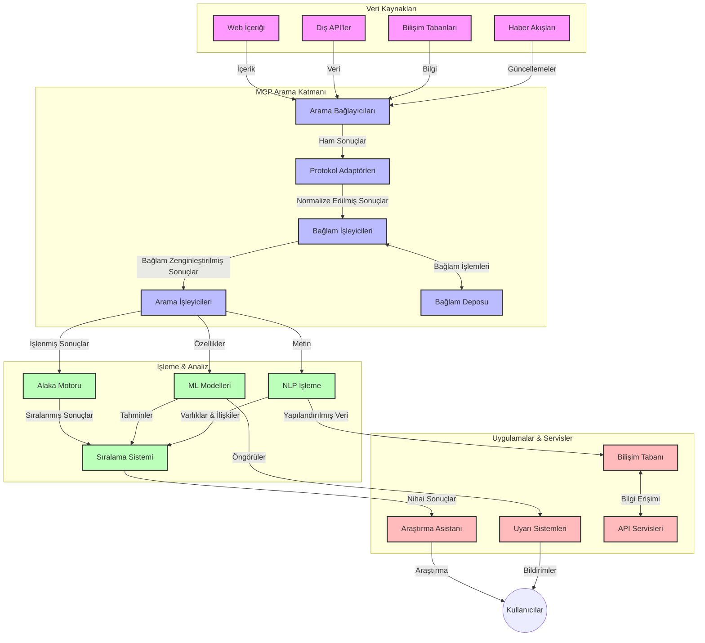
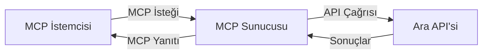
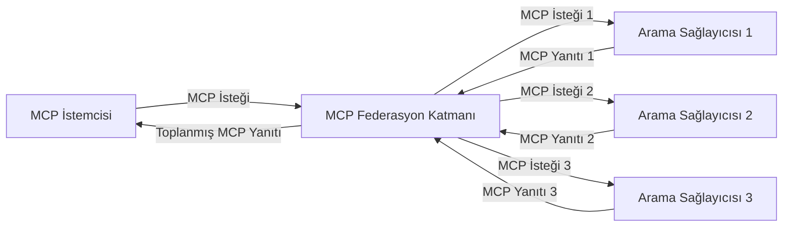
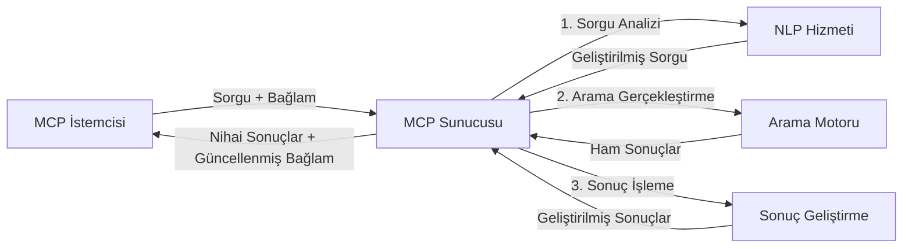

# Gerçek Zamanlı Web Araması için Model Bağlam Protokolü

## Genel Bakış

Gerçek zamanlı web araması, uygulamaların ilgili ve zamanında yanıtlar sunabilmek için internetteki güncel bilgilere anında erişmesi gereken günümüzün bilgi odaklı ortamında vazgeçilmez hale gelmiştir. Model Bağlam Protokolü (MCP), bu gerçek zamanlı arama süreçlerini optimize etmede önemli bir ilerlemeyi temsil eder; arama verimliliğini artırır, bağlamsal bütünlüğü korur ve genel sistem performansını geliştirir.

Bu modül, MCP'nin AI modelleri, arama motorları ve uygulamalar arasında bağlam yönetimine standart bir yaklaşım sunarak gerçek zamanlı web aramasını nasıl dönüştürdüğünü keşfetmektedir.

### Öğrenecekleriniz

Bu kapsamlı rehberde şunları keşfedeceksiniz:

- MCP'nin AI modelleri ile gerçek zamanlı web arama yetenekleri arasında nasıl kesintisiz bir köprü kurduğunu
- MCP ile verimli ve ölçeklenebilir arama çözümleri uygulamak için mimari kalıpları
- Birden fazla sorgu ve etkileşim boyunca arama bağlamını koruma tekniklerini
- Çeşitli arama senaryoları için Python ve JavaScript'te pratik kod uygulamalarını
- MCP destekli arama sistemlerinde alaka, yenilik ve performans arasında denge kurma yöntemlerini

## Gerçek Zamanlı Web Aramasına Giriş

Gerçek zamanlı web araması, web tabanlı bilgilerin yayınlanır veya güncellenir güncellenmez sürekli sorgulanmasını, işlenmesini ve analiz edilmesini sağlayan teknolojik bir yaklaşımdır; böylece sistemler taze ve alakalı bilgileri minimal gecikmeyle sunabilir. Saatler veya günler önce indekslenmiş verilerle çalışan geleneksel arama sistemlerinden farklı olarak, gerçek zamanlı arama webdeki canlı verileri işleyerek çevrimiçi içeriğin mevcut durumunu yansıtan bilgiler sağlar.

### Gerçek Zamanlı Web Aramasının Temel Kavramları:

- **Sürekli Sorgu İşleme**: Arama sorguları sürekli güncellenen veri kaynaklarına karşı işlenir
- **Yeniliği Önceliklendirme**: Sistemler taze bilgiyi öne çıkaracak şekilde tasarlanır
- **Alaka Dengesi**: Alaka ve yenilik arasında denge kurmak
- **Ölçeklenebilir Mimari**: Sistemler değişken sorgu yükleri ve veri hacimlerini yönetmelidir
- **Bağlamsal Anlayış**: Anlamlı sonuçlar için arama yinelemeleri boyunca kullanıcı bağlamının korunması önemlidir
- **Dinamik Sorgu Yeniden Biçimlendirme**: Bağlama ve önceki sonuçlara göre sorguların uyarlanması
- **Çok Kaynaklı Entegrasyon**: Sonuçların birden fazla arama sağlayıcısı ve web kaynağından birleştirilmesi
- **Anlamsal Anlayış**: Sorguların ve içeriğin sadece anahtar kelimeler değil, anlam bazında işlenmesi
- **Gerçek Zamanlı Sıralama**: Yeni bilgiler geldikçe sonuç sıralamalarının sürekli ayarlanması

### Model Bağlam Protokolü ve Gerçek Zamanlı Web Araması

Model Bağlam Protokolü (MCP), gerçek zamanlı web arama ortamlarında kritik bazı zorluklara çözüm getirir:

1. **Arama Bağlamının Korunması**: MCP, bağlamın dağıtılmış arama bileşenlerinde nasıl korunduğunu standartlaştırır ve böylece AI modelleri ile işleme düğümlerinin ilgili sorgu geçmişi ve kullanıcı tercihlerine erişimini sağlar.

2. **Verimli Sorgu Yönetimi**: Bağlamın iletiminde yapılandırılmış mekanizmalar sağlayarak, her arama yinelemesinde bağlamın tekrar edilme yükünü azaltır.

3. **Birlikte Çalışabilirlik**: MCP, farklı arama teknolojileri ve AI modelleri arasında bağlam paylaşımı için ortak bir dil yaratarak daha esnek ve genişletilebilir mimariler mümkün kılar.

4. **Arama Optimizasyonlu Bağlam**: MCP uygulamaları, daha etkili arama için hangi bağlam öğelerinin en alakalı olduğunu önceliklendirebilir, performans ve doğruluk için optimizasyon sağlar.

5. **Uyarlanabilir Arama İşleme**: MCP aracılığıyla doğru bağlam yönetimi sayesinde, arama sistemleri kullanıcı ihtiyaçları ve bilgi ortamındaki değişimlere dinamik olarak uyum sağlayabilir.

Haber toplama uygulamalarından araştırma asistanlarına kadar modern uygulamalarda, MCP’nin web arama teknolojileriyle entegrasyonu daha akıllı, bağlam farkında aramalar sunar ve kullanıcı etkileşimleri devam ettikçe artan alaka düzeyi sağlar.

## Öğrenme Hedefleri

Bu dersin sonunda:

- Gerçek zamanlı web aramasının temellerini ve modern uygulamalardaki zorluklarını anlayabileceksiniz
- Model Bağlam Protokolü (MCP)’nün gerçek zamanlı web arama yeteneklerini nasıl geliştirdiğini açıklayabileceksiniz
- Popüler çerçeveler ve API'lar kullanarak MCP tabanlı arama çözümleri uygulayabileceksiniz
- MCP ile ölçeklenebilir, yüksek performanslı arama mimarileri tasarlayıp kurabileceksiniz
- MCP kavramlarını anlamsal arama, araştırma yardımı ve AI destekli gezinme gibi çeşitli kullanım durumlarına uygulayabileceksiniz
- MCP tabanlı arama teknolojilerinde ortaya çıkan trendleri ve gelecek yenilikleri değerlendirebileceksiniz
- Kullanıcı etkileşimlerinden öğrenen bağlam farkında arama sistemleri geliştirebileceksiniz
- Standart MCP protokolleri kullanarak AI asistanlarına web arama özellikleri entegre edebileceksiniz
- Bağlama dayalı olarak sonuçları adım adım iyileştiren çok aşamalı arama süreçleri oluşturabileceksiniz
- Kapsamlı bağlam farkındalığını korurken arama performansını optimize edebileceksiniz

### Tanım ve Önemi

Gerçek zamanlı web araması, web tabanlı bilgilerin minimal gecikmeyle sürekli sorgulanması, alınması ve sunulmasını kapsar. Düzenli olarak webi tarayıp indeksleyen geleneksel arama motorlarının aksine, gerçek zamanlı arama bilgileri ortaya çıktıkça görünür hale getirerek en güncel içeriğe anında erişim sağlar.

Gerçek zamanlı web aramasının temel özellikleri şunlardır:

- **Tazelik**: Son içerik ve güncellemelerin önceliklendirilmesi
- **Sürekli İşleme**: Yeni bilgiler için sürekli izleme
- **Sorgu Uyarlaması**: Bağlam ve geri bildirimlere dayanarak arama sorgularını iyileştirme
- **Anında Teslimat**: Arama sonuçlarını minimal gecikmeyle sağlama
- **Bağlam Tutma**: Önceki sorguları baz alarak alaka düzeyini artırma

### Geleneksel Web Arama Zorlukları

Geleneksel web arama yöntemleri gerçek zamanlı senaryolarda aşağıdaki sınırlamalarla karşılaşır:

1. **Bağlam Parçalanması**: Birden çok sorgu arasında arama bağlamını korumakta zorluk
2. **Bilgi Tazeliği**: En güncel bilgilere erişim ve önceliklendirme sorunları
3. **Entegrasyon Karmaşıklığı**: Arama sistemleri ve uygulamalar arasında birlikte çalışabilirlik problemleri
4. **Gecikme Sorunları**: Kapsamlı arama ile yanıt süresi gereksinimleri arasında denge kuramama
5. **Alaka Ayarı**: Yeniliği önceliklendirirken doğruluk ve alakayı sağlama zorlukları

## Model Bağlam Protokolü (MCP) Arama İçin Anlama

### MCP Nedir Arama Bağlamlarında?

Model Bağlam Protokolü (MCP), AI modelleri ile uygulamalar arasında verimli etkileşimi kolaylaştırmak için tasarlanmış standart bir iletişim protokolüdür. Gerçek zamanlı web arama bağlamında MCP, şu çerçeveyi sağlar:

- Sorgu dizileri boyunca arama bağlamını koruma
- Arama sorgusu ve sonuç formatlarını standartlaştırma
- Arama parametreleri ve sonuçlarının aktarımını optimize etme
- Model ile arama motoru arasında iletişimi iyileştirme

### Temel Bileşenler ve Mimari

Gerçek zamanlı web araması için MCP mimarisi şu ana bileşenlerden oluşur:

1. **Sorgu Bağlam Yöneticileri**: Birden fazla sorgu boyunca arama bağlamını yönetir ve korur
2. **Arama İşleyicileri**: Bağlam farkında tekniklerle gelen arama isteklerini işler
3. **Protokol Adaptörleri**: Farklı arama API’leri arasında bağlamı koruyarak dönüştürme yapar
4. **Bağlam Deposu**: Arama geçmişi ve tercihleri verimli şekilde depolar ve geri getirir
5. **Arama Bağlayıcıları**: Çeşitli arama motorları ve web API’lerine bağlantı sağlar



### MCP Gerçek Zamanlı Web Aramasını Nasıl İyileştirir?

MCP, geleneksel web arama zorluklarını şu yollarla aşar:

- **Bağlamsal Süreklilik**: Arama oturumu boyunca sorgular arasındaki ilişkileri korur
- **Optimizasyonlu Aktarım**: Akıllı bağlam yönetimiyle arama parametrelerinde tekrarları azaltır
- **Standartlaştırılmış Arayüzler**: Arama bileşenleri için tutarlı API'lar sunar
- **Azaltılmış Gecikme**: Verimli bağlam işleme ile işlem yükünü minimuma indirir
- **Gelişmiş Alaka**: Birden çok sorguda kullanıcı niyetini koruyarak arama alakasını artırır

## Entegrasyon ve Uygulama

Gerçek zamanlı web arama sistemleri, hem performansı hem de bağlamsal bütünlüğü korumak için dikkatli mimari tasarım ve uygulama gerektirir. Model Bağlam Protokolü, AI modelleri ve arama teknolojilerinin entegrasyonuna standart bir yaklaşım sunarak daha sofistike, bağlam farkında arama süreçleri oluşturulmasını sağlar.

### MCP Entegrasyonunun Arama Mimarilerindeki Genel Görünümü

Gerçek zamanlı web arama ortamlarında MCP uygulaması birkaç temel hususu içerir:

1. **Arama Bağlamının Serileştirilmesi**: MCP, arama isteklerinde bağlamsal bilgiyi kodlamak için verimli mekanizmalar sunar; temel bağlam, işleme hattı boyunca sorguyu takip eder. Bu, arama ile ilgili meta veriler için optimize edilmiş standart serileştirme formatlarını içerir.

2. **Durum Bilinçli Arama İşleme**: MCP, arama yinelemeleri boyunca tutarlı bağlam temsili sağlayarak daha akıllı durumlu işlemi mümkün kılar. Bu, bağlam iyileştirmesinin sonuçları geliştirdiği çok aşamalı arama süreçlerinde özellikle değerlidir.

3. **Sorgu Genişletme ve İyileştirme**: MCP uygulamaları, birikmiş bağlama dayalı gelişmiş sorgu genişletme ve iyileştirme sağlar; böylece arama oturumu ilerledikçe sonuçlar daha alakalı olur.

4. **Sonuç Önbellekleme ve Önceliklendirme**: MCP bağlam işleme standardıyla, bileşenlerin gelişen arama bağlamına göre sonuç önbellekleme ve önceliklendirmeyi yönetmesi kolaylaşır.

5. **Arama Federasyonu ve Birleştirme**: MCP, çoklu arka uçlar arasında yapılandırılmış arama bağlamı temsilleri sağlayarak daha anlamlı kaynaklar arası sonuç birleşimini destekler.

MCP’nin çeşitli arama teknolojilerinde uygulanması, bağlam yönetimi için tek birleştirilmiş yaklaşım yaratarak özel entegrasyon kodu ihtiyacını azaltırken, arama sorguları geliştikçe anlamlı bağlam korumasını artırır.

### MCP’nin Çeşitli Web Arama Uygulamaları

Aşağıdaki örnekler, JSON-RPC tabanlı ve farklı taşıma mekanizmalarına sahip mevcut MCP spesifikasyonunu takip eder. Kod, özel arama entegrasyonlarının MCP protokolleriyle tam uyumluluk içinde nasıl yapılabileceğini göstermektedir.

<details>
<summary>Genel Arama API’si ile Python Uygulaması</summary>

```python
import asyncio
import json
import aiohttp
from typing import Dict, Any, Optional, List
from contextlib import asynccontextmanager
from collections.abc import AsyncIterator

# Standart MCP kütüphanelerini içe aktar
from mcp.client.session import ClientSession
from mcp.client.streamable_http import streamablehttp_client
from mcp.types import TextContent, CreateMessageRequestParams, CreateMessageResult
from mcp.server.fastmcp import FastMCP

# Web araması için bir FastMCP sunucusu oluştur
search_server = FastMCP("WebSearch")

# Web arama işlemlerini yönetmek için sınıf
class WebSearchHandler:
    def __init__(self, api_endpoint: str, api_key: str):
        self.api_endpoint = api_endpoint
        self.api_key = api_key
        self.session = None
        
    async def initialize(self):
        """Initialize the HTTP session"""
        self.session = aiohttp.ClientSession(
            headers={"Authorization": f"Bearer {self.api_key}"}
        )
    
    async def close(self):
        """Close the HTTP session"""
        if self.session:
            await self.session.close()
            
    async def perform_search(self, query: str, max_results: int = 5, 
                           include_domains: List[str] = None, 
                           exclude_domains: List[str] = None,
                           time_period: str = "any") -> Dict[str, Any]:
        """Perform web search using the search API"""
        # Arama parametrelerini oluştur
        search_params = {
            "q": query,
            "limit": max_results,
            "time": time_period
        }
        
        if include_domains:
            search_params["site"] = ",".join(include_domains)
            
        if exclude_domains:
            search_params["exclude_site"] = ",".join(exclude_domains)
        
        # Arama isteğini gerçekleştir
        try:
            async with self.session.get(
                self.api_endpoint,
                params=search_params
            ) as response:
                if response.status != 200:
                    error_text = await response.text()
                    raise Exception(f"Search API error: {response.status} - {error_text}")
                
                search_data = await response.json()
                
                # API'ye özgü yanıtı standart bir formata dönüştür
                results = []
                for item in search_data.get("results", []):
                    results.append({
                        "title": item.get("title", ""),
                        "url": item.get("url", ""),
                        "snippet": item.get("snippet", ""),
                        "date": item.get("published_date", ""),
                        "source": item.get("source", "")
                    })
                
                return {
                    "query": query,
                    "totalResults": len(results),
                    "results": results
                }
        except Exception as e:
            print(f"Search API request error: {e}")
            raise

# Arama yöneticisini başlat
search_handler = WebSearchHandler(
    api_endpoint="https://api.search-service.example/search",
    api_key="your-api-key-here"
)

# Arama yöneticisini yönetmek için yaşam döngüsü ayarla
@asyncio.asynccontextmanager
async def app_lifespan(server: FastMCP):
    """Manage application lifecycle"""
    await search_handler.initialize()
    try:
        yield {"search_handler": search_handler}
    finally:
        await search_handler.close()

# Sunucu için yaşam döngüsünü belirle
search_server = FastMCP("WebSearch", lifespan=app_lifespan)

# Bir web arama aracı kaydet
@search_server.tool()
async def web_search(query: str, max_results: int = 5, 
                   include_domains: List[str] = None,
                   exclude_domains: List[str] = None,
                   time_period: str = "any") -> Dict[str, Any]:
    """
    Search the web for information
    
    Args:
        query: The search query
        max_results: Maximum number of results to return (default: 5)
        include_domains: List of domains to include in search results
        exclude_domains: List of domains to exclude from search results
        time_period: Time period for results ("day", "week", "month", "any")
        
    Returns:
        Dictionary containing search results
    """
    ctx = search_server.get_context()
    search_handler = ctx.request_context.lifespan_context["search_handler"]
    
    results = await search_handler.perform_search(
        query=query,
        max_results=max_results,
        include_domains=include_domains,
        exclude_domains=exclude_domains,
        time_period=time_period
    )
    
    return results

# Örnek istemci kullanımı
async def client_example():
    # Streamable HTTP taşıma kullanarak arama sunucusuna bağlan
    async with streamablehttp_client("http://localhost:8000/mcp") as (read, write, _):
        async with ClientSession(read, write) as session:
            # Bağlantıyı başlat
            await session.initialize()
            
            # web_search aracını çağır
            search_results = await session.call_tool(
                "web_search", 
                {
                    "query": "latest developments in AI and Model Context Protocol",
                    "max_results": 5,
                    "time_period": "day",
                    "include_domains": ["github.com", "microsoft.com"]
                }
            )
            
            print(f"Search results: {search_results}")

# Sunucu çalışma örneği
if __name__ == "__main__":
    # Streamable HTTP taşıma ile sunucuyu çalıştır
    search_server.run(transport="streamable-http")
```
</details> 

<details>
<summary>Tarayıcı Tabanlı Arama ile JavaScript Uygulaması</summary>

```javascript
// Web araması için MCP sunucu uygulaması
import { McpServer, ResourceTemplate } from '@modelcontextprotocol/sdk/server/mcp.js';
import { StreamableHTTPServerTransport } from '@modelcontextprotocol/sdk/server/streamableHttp.js';
import { z } from 'zod';

// Web araması için bir MCP sunucu oluştur
const searchServer = new McpServer({
    name: "BrowserSearch",
    description: "A server that provides web search capabilities"
});

// Arama servisi sınıfı
class SearchService {
    constructor(searchApiUrl, apiKey) {
        this.searchApiUrl = searchApiUrl;
        this.apiKey = apiKey;
    }

    async performSearch(parameters) {
        const {
            query = '',
            maxResults = 5,
            includeDomains = [],
            excludeDomains = [],
            timePeriod = 'any'
        } = parameters;
        
        // Parametrelerle arama URL'si oluştur
        const url = new URL(this.searchApiUrl);
        url.searchParams.append('q', query);
        url.searchParams.append('limit', maxResults);
        url.searchParams.append('time', timePeriod);
        
        if (includeDomains.length > 0) {
            url.searchParams.append('site', includeDomains.join(','));
        }
        
        if (excludeDomains.length > 0) {
            url.searchParams.append('exclude_site', excludeDomains.join(','));
        }
        
        try {
            const response = await fetch(url.toString(), {
                method: 'GET',
                headers: {
                    'Authorization': `Bearer ${this.apiKey}`,
                    'Content-Type': 'application/json'
                }
            });
            
            if (!response.ok) {
                const errorText = await response.text();
                throw new Error(`Search API error: ${response.status} - ${errorText}`);
            }
            
            const searchData = await response.json();
            
            // API'ye özgü yanıtı standart bir formata dönüştür
            const results = searchData.results?.map(item => ({
                title: item.title || '',
                url: item.url || '',
                snippet: item.snippet || '',
                date: item.published_date || '',
                source: item.source || ''
            })) || [];
            
            return {
                query,
                totalResults: results.length,
                results
            };
        } catch (error) {
            console.error('Search API request error:', error);
            throw error;
        }
    }
}

// Arama servisini başlat
const searchService = new SearchService(
    'https://api.search-service.example/search',
    'your-api-key-here'
);

// Sunucu için bağlam sağlayıcıyı ayarla
searchServer.setContextProvider(() => {
    return {
        searchService
    };
});

// Web arama aracını kaydet
searchServer.tool({
    name: 'web_search',
    description: 'Search the web for information',
    parameters: {
        type: 'object',
        properties: {
            query: {
                type: 'string',
                description: 'The search query'
            },
            maxResults: {
                type: 'integer',
                description: 'Maximum number of results to return',
                default: 5
            },
            includeDomains: {
                type: 'array',
                items: { type: 'string' },
                description: 'List of domains to include in search results'
            },
            excludeDomains: {
                type: 'array',
                items: { type: 'string' },
                description: 'List of domains to exclude from search results'
            },
            timePeriod: {
                type: 'string',
                description: 'Time period for results',
                enum: ['day', 'week', 'month', 'any'],
                default: 'any'
            }
        },
        required: ['query']
    },
    handler: async (params, context) => {
        const { searchService } = context;
        return await searchService.performSearch(params);
    }
});

// Arama sunucusuna bağlanmak için örnek istemci kodu
import { Client } from '@modelcontextprotocol/sdk/client/index.js';
import { StreamableHTTPClientTransport } from '@modelcontextprotocol/sdk/client/streamableHttp.js';

async function connectToSearchServer() {
    // Arama sunucusuna bağlan
    const transport = new StreamableHTTPClientTransport(
        new URL('http://localhost:8000/mcp')
    );
    
    const client = new Client({
        name: 'search-client',
        version: '1.0.0'
    });
    
    await client.connect(transport);
    
    // Arama aracını çalıştır
    const searchResults = await client.callTool({
        name: 'web_search',
        arguments: {
            query: 'Model Context Protocol implementation examples',
            maxResults: 10,
            timePeriod: 'week',
            includeDomains: ['github.com', 'docs.microsoft.com']
        }
    });
    
    console.log('Search results:', searchResults);
    
    // Temizleme
    await client.disconnect();
}

// Sunucuyu başlat
const transport = new StreamableHTTPServerTransport();
await searchServer.connect(transport);
console.log('Search server running at http://localhost:8000/mcp');

// Ayrı bir süreçte veya sunucu başlatıldıktan sonra
// connectToSearchServer().catch(console.error);
```
</details> 

## Kod Örnekleri Uyarısı

> **Önemli Not**: Aşağıdaki kod örnekleri Model Bağlam Protokolü (MCP) ile web arama işlevselliğinin entegrasyonunu göstermektedir. Resmi MCP SDK’larının kalıplarını ve yapısını takip etseler de, eğitim amacıyla basitleştirilmişlerdir.
> 
> Bu örnekler şunları göstermektedir:
> 
> 1. **Python Uygulaması**: Harici bir arama API’sine bağlanan ve web arama aracı sunan FastMCP sunucu uygulaması. Resmi MCP Python SDK ([github.com/modelcontextprotocol/python-sdk](https://github.com/modelcontextprotocol/python-sdk)) kalıplarına uygun olarak yaşam döngüsü yönetimi, bağlam işleme ve araç uygulaması içerir. Sunucu, daha eski SSE taşımasını geride bırakan önerilen Streamable HTTP taşımasını kullanmaktadır.
> 
> 2. **JavaScript Uygulaması**: Resmi MCP TypeScript SDK’dan ([github.com/modelcontextprotocol/typescript-sdk](https://github.com/modelcontextprotocol/typescript-sdk)) FastMCP kalıbı kullanılarak yazılmış, uygun araç tanımları ve istemci bağlantıları içeren TypeScript/JavaScript uygulaması. Oturum yönetimi ve bağlam koruma için en güncel önerilen kalıpları takip eder.
> 
> Bu örnekler, üretim kullanımı için ek hata yönetimi, kimlik doğrulaması ve özel API entegrasyonu gerektirir. Gösterilen arama API uç noktaları (`https://api.search-service.example/search`) yer tutucudur ve gerçek arama servis uç noktaları ile değiştirilmelidir.
> 
> Tam uygulama detayları ve en güncel yaklaşımlar için lütfen [resmi MCP spesifikasyonu](https://spec.modelcontextprotocol.io/) ve SDK dökümantasyonuna bakınız.

## Temel Kavramlar

### Model Bağlam Protokolü (MCP) Çerçevesi

Temelinde, Model Bağlam Protokolü AI modelleri, uygulamalar ve servislerin bağlam alışverişi yapması için standartlaştırılmış bir yol sağlar. Gerçek zamanlı web aramada bu çerçeve, tutarlı ve çok aşamalı arama deneyimleri oluşturmak için gereklidir. Temel bileşenler şunlardır:

1. **İstemci-Sunucu Mimarisi**: MCP, arama istemcileri (istekte bulunanlar) ile arama sunucuları (sağlayıcılar) arasında net bir ayrım yapar ve esnek dağıtım modellerine imkan tanır.

2. **JSON-RPC İletişimi**: Protokol, mesaj alışverişinde JSON-RPC kullanır; bu da web teknolojileriyle uyumludur ve farklı platformlarda kolay uygulama sağlar.

3. **Bağlam Yönetimi**: MCP, çoklu etkileşimler boyunca arama bağlamının korunması, güncellenmesi ve kullanılması için yapılandırılmış yöntemler tanımlar.

4. **Araç Tanımları**: Arama yetenekleri iyi tanımlanmış parametreler ve dönüş değerleriyle standart araçlar olarak sunulur.

5. **Akış Desteği**: Protokol akış halinde sonuçlar sunmayı destekler; gerçek zamanlı aramalarda sonuçların ilerleyerek gelmesi için önemlidir.

### Web Arama Entegrasyon Kalıpları

MCP’yi web arama ile entegre ederken birkaç kalıp ortaya çıkar:

#### 1. Doğrudan Arama Sağlayıcı Entegrasyonu



Bu kalıpta MCP sunucusu doğrudan bir veya daha fazla arama API’si ile arayüz kurar, MCP isteklerini API özgü çağrılara çevirir ve sonuçları MCP yanıtları olarak biçimlendirir.

#### 2. Bağlam Koruma ile Federatif Arama



Bu kalıp, MCP uyumlu birden fazla arama sağlayıcısına sorguları dağıtarak, her birinin farklı içerik türleri veya arama yeteneklerinde uzmanlaşabileceği şekilde birleşik bir bağlam koruma sağlar.

#### 3. Bağlam Geliştirilmiş Arama Zinciri



Bu kalıpta arama süreci birden çok aşamaya bölünür, her adımda bağlam zenginleştirilir ve giderek daha alakalı sonuçlar elde edilir.

### Arama Bağlamı Bileşenleri

MCP tabanlı web aramada bağlam genellikle şunları içerir:

- **Sorgu Geçmişi**: Oturumdaki önceki arama sorguları
- **Kullanıcı Tercihleri**: Dil, bölge, güvenli arama ayarları
- **Etkileşim Geçmişi**: Tıklanan sonuçlar, sonuçlarda geçirilen zaman
- **Arama Parametreleri**: Filtreler, sıralama ve diğer arama değiştiricileri
- **Alan Bilgisi**: Aramayla ilgili konu özgü bağlam
- **Zamansal Bağlam**: Zaman bazlı alaka faktörleri
- **Kaynak Tercihleri**: Güvenilen veya tercih edilen bilgi kaynakları

## Kullanım Durumları ve Uygulamalar

### Araştırma ve Bilgi Toplama

MCP, araştırma iş akışlarını şu şekillerde geliştirir:

- Araştırma bağlamını arama oturumları boyunca koruma
- Daha sofistike ve bağlamsal olarak alakalı sorgular yapılmasını sağlama
- Çok kaynaklı arama federasyonunu destekleme
- Arama sonuçlarından bilgi çıkarımı kolaylaştırma

### Gerçek Zamanlı Haber ve Trend Takibi

MCP destekli arama haber takibinde avantajlar sunar:

- Ortaya çıkan haber hikayelerinin neredeyse gerçek zamanlı keşfi
- İlgili bilgilerin bağlamsal filtrelenmesi
- Çoklu kaynaklar arasında konu ve varlık takibi
- Kullanıcı bağlamına dayalı kişiselleştirilmiş haber uyarıları

### AI Destekli Gezinme ve Araştırma

MCP, AI destekli gezinme için yeni imkanlar yaratır:

- Mevcut tarayıcı etkinliğine dayanarak bağlamsal arama önerileri
- Web aramanın LLM destekli asistanlarla kesintisiz entegrasyonu
- Korumalı bağlamla çok aşamalı arama iyileştirmesi
- Geliştirilmiş doğruluk kontrolü ve bilgi doğrulama

## Gelecek Trendler ve Yenilikler

### Web Aramada MCP’nin Evrimi

İleriye dönük olarak, MCP’nin şu alanlarda gelişmesini bekliyoruz:
- **Multimodal Arama**: Metin, resim, ses ve video aramalarını bağlam korunarak entegre etme
- **Merkezi Olmayan Arama**: Dağıtık ve federatif arama ekosistemlerini destekleme
- **Arama Gizliliği**: Bağlam farkında gizliliği koruyan arama mekanizmaları
- **Sorgu Anlama**: Doğal dil arama sorgularının derin anlam çözümlemesi

### Teknolojide Olası Gelişmeler

MCP aramasının geleceğini şekillendirecek gelişmekte olan teknolojiler:

1. **Sinirsel Arama Mimarileri**: MCP için optimize edilmiş gömülü tabanlı arama sistemleri
2. **Kişiselleştirilmiş Arama Bağlamı**: Kullanıcıların bireysel arama kalıplarını zamanla öğrenme
3. **Bilgi Grafiği Entegrasyonu**: Alan bazlı bilgi grafikleri ile bağlam zenginleştirilmiş arama
4. **Çapraz Modlu Bağlam**: Farklı arama modları arasında bağlamı koruma

## Uygulamalı Egzersizler

### Egzersiz 1: Temel Bir MCP Arama İşlem Hattı Kurma

Bu egzersizde öğrenecekleriniz:
- Temel bir MCP arama ortamı yapılandırmak
- Web araması için bağlam işleyicileri uygulamak
- Arama yinelemeleri arasında bağlam korumanın test edilmesi ve doğrulanması

### Egzersiz 2: MCP ile Araştırma Asistanı Oluşturma

Tam bir uygulama oluşturun:
- Doğal dilde araştırma sorularını işleme
- Bağlam farkında web aramaları gerçekleştirme
- Birden çok kaynaktan bilgi sentezleme
- Düzenlenmiş araştırma bulgularını sunma

### Egzersiz 3: MCP ile Çok Kaynaklı Arama Federasyonu Uygulama

İleri seviye egzersiz:
- Bağlam farkında sorgu yönlendirmeyi birden çok arama motoruna yapmak
- Sonuçları sıralama ve toplama
- Arama sonuçlarının bağlamsal tekrarsızlaştırılması
- Kaynak spesifik meta verilerin yönetimi

## Ek Kaynaklar

- [Model Context Protocol Specification](https://spec.modelcontextprotocol.io/) - Resmi MCP spesifikasyonu ve detaylı protokol dokümantasyonu
- [Model Context Protocol Documentation](https://modelcontextprotocol.io/) - Detaylı eğitimler ve uygulama rehberleri
- [MCP Python SDK](https://github.com/modelcontextprotocol/python-sdk) - MCP protokolünün resmi Python implementasyonu
- [MCP TypeScript SDK](https://github.com/modelcontextprotocol/typescript-sdk) - MCP protokolünün resmi TypeScript implementasyonu
- [MCP Reference Servers](https://github.com/modelcontextprotocol/servers) - MCP sunucularının referans implementasyonları
- [Bing Web Search API Documentation](https://learn.microsoft.com/en-us/bing/search-apis/bing-web-search/overview) - Microsoft'un web arama API'si
- [Google Custom Search JSON API](https://developers.google.com/custom-search/v1/overview) - Google'ın programlanabilir arama motoru
- [SerpAPI Documentation](https://serpapi.com/search-api) - Arama motoru sonuç sayfası API'si
- [Meilisearch Documentation](https://www.meilisearch.com/docs) - Açık kaynak arama motoru
- [Elasticsearch Documentation](https://www.elastic.co/guide/index.html) - Dağıtık arama ve analiz motoru
- [LangChain Documentation](https://python.langchain.com/docs/get_started/introduction) - LLM ile uygulama geliştirmek

## Öğrenme Çıktıları

Bu modülü tamamlayarak şunları yapabileceksiniz:

- Gerçek zamanlı web aramasının temellerini ve zorluklarını anlamak
- Model Context Protocol (MCP)’ün gerçek zamanlı web arama yeteneklerini nasıl geliştirdiğini açıklamak
- Popüler çerçeveler ve API'ler kullanarak MCP tabanlı arama çözümleri uygulamak
- MCP ile ölçeklenebilir, yüksek performanslı arama mimarileri tasarlamak ve dağıtmak
- Semantik arama, araştırma asistanlığı ve AI destekli gezinme gibi çeşitli kullanım senaryolarında MCP kavramlarını uygulamak
- MCP tabanlı arama teknolojilerindeki gelişen trendleri ve gelecekteki yenilikleri değerlendirmek

### Güven ve Emniyet Hususları

MCP tabanlı web arama çözümleri uygularken MCP spesifikasyonundan önemli şu prensipleri unutmayın:

1. **Kullanıcı Onayı ve Kontrolü**: Kullanıcılar tüm veri erişimine ve işlemlere açıkça onay vermeli ve bunları anlamalıdır. Bu, dış kaynaklara erişebilen web arama uygulamaları için özellikle önemlidir.

2. **Veri Gizliliği**: Arama sorguları ve sonuçlarının özellikle hassas bilgiler içerebileceği durumlarda uygun şekilde yönetilmesini sağlayın. Kullanıcı verilerini korumak için uygun erişim kontrolleri uygulayın.

3. **Araç Güvenliği**: Arama araçları keyfi kod çalıştırma yoluyla potansiyel güvenlik riskleri taşır; bunlar için uygun yetkilendirme ve doğrulama uygulayın. Araç davranışı tanımları sadece güvenilir bir sunucudan alınmadığı sürece güvenilir sayılmamalıdır.

4. **Açık Dokümantasyon**: MCP spesifikasyonundaki uygulama rehberlerine uyarak MCP tabanlı arama uygulamanızın yetenekleri, sınırlamaları ve güvenlik hususları hakkında açık dokümantasyon sağlayın.

5. **Güçlü Onay Akışları**: Özellikle dış web kaynaklarıyla etkileşen araçlar için kullanımı yetkilendirmeden önce her aracın ne yaptığını net açıklayan güçlü onay ve yetkilendirme akışları oluşturun.

MCP güvenlik ve güvenle ilgili tüm ayrıntılar için [resmi dokümantasyona](https://modelcontextprotocol.io/specification/2025-11-25/basic/security_best_practices) bakınız.

## Sonraki Adımlar

- [5.12 Model Context Protocol Sunucuları için Entra ID Kimlik Doğrulaması](../mcp-security-entra/README.md)

---

<!-- CO-OP TRANSLATOR DISCLAIMER START -->
**Feragatname**:
Bu belge, AI çeviri hizmeti [Co-op Translator](https://github.com/Azure/co-op-translator) kullanılarak çevrilmiştir. Doğruluk için çaba sarf etsek de, otomatik çevirilerin hata veya yanlışlık içerebileceğini lütfen unutmayınız. Orijinal belge, kendi dilinde yetkili kaynak olarak kabul edilmelidir. Kritik bilgiler için profesyonel insan çevirisi önerilir. Bu çevirinin kullanımı sonucu ortaya çıkabilecek yanlış anlamalardan veya yanlış yorumlamalardan sorumlu değiliz.
<!-- CO-OP TRANSLATOR DISCLAIMER END -->