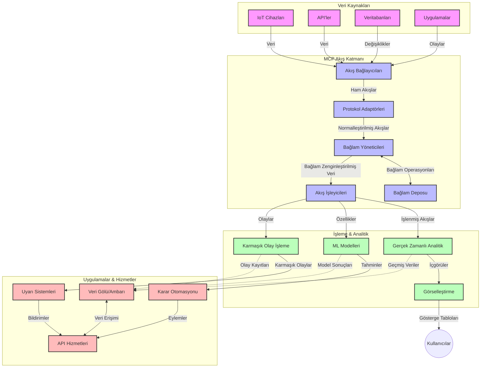

# Gerçek Zamanlı Veri Akışı için Model Bağlam Protokolü

## Genel Bakış

Gerçek zamanlı veri akışı, işletmelerin ve uygulamaların hızlı kararlar alabilmek için anında bilgiye ihtiyaç duyduğu, günümüzün veri odaklı dünyasında vazgeçilmez hale gelmiştir. Model Bağlam Protokolü (MCP), bu gerçek zamanlı akış süreçlerini optimize etmede önemli bir ilerlemeyi temsil eder; veri işleme verimliliğini artırır, bağlamsal bütünlüğü korur ve genel sistem performansını geliştirir.

Bu modül, MCP’nin AI modelleri, akış platformları ve uygulamalar arasında bağlam yönetimi için standart bir yaklaşım sunarak gerçek zamanlı veri akışını nasıl dönüştürdüğünü inceler.

## Gerçek Zamanlı Veri Akışına Giriş

Gerçek zamanlı veri akışı, verilerin üretildiği anda sürekli olarak aktarımı, işlenmesi ve analiz edilmesini sağlayan teknolojik bir paradigmadır; sistemlerin yeni bilgilere anında tepki vermesine olanak tanır. Statik veri kümeleri üzerinde çalışan geleneksel toplu işleme yöntemlerinin aksine, akış işlemleri hareket halindeki verileri işler ve minimal gecikmeyle içgörüler ve eylemler sunar.

### Gerçek Zamanlı Veri Akışının Temel Kavramları:

- **Sürekli Veri Akışı**: Veri, kesintisiz ve sonu olmayan bir olay veya kayıt akışı olarak işlenir.
- **Düşük Gecikmeli İşleme**: Sistemler, veri üretimi ile işleme arasındaki zamanı en aza indirecek şekilde tasarlanır.
- **Ölçeklenebilirlik**: Akış mimarileri değişken veri hacimlerini ve hızlarını yönetmelidir.
- **Hata Toleransı**: Sistemler kesintisiz veri akışını sağlamak için hatalara karşı dayanıklı olmalıdır.
- **Durumlu İşleme**: Anlamlı analiz için olaylar arasında bağlamın korunması kritiktir.

### Model Bağlam Protokolü ve Gerçek Zamanlı Akış

Model Bağlam Protokolü (MCP), gerçek zamanlı akış ortamlarındaki birkaç kritik zorluğu ele alır:

1. **Bağlamsal Süreklilik**: MCP, dağıtık akış bileşenleri arasında bağlamın nasıl korunacağını standartlaştırarak AI modelleri ve işlem düğümlerinin ilgili geçmiş ve çevresel bağlama erişimini sağlar.

2. **Verimli Durum Yönetimi**: MCP, bağlam iletimi için yapılandırılmış mekanizmalar sunarak akış boru hatlarındaki durum yönetimi yükünü azaltır.

3. **Birlikte Çalışabilirlik**: MCP, farklı akış teknolojileri ve AI modelleri arasında bağlam paylaşımı için ortak bir dil oluşturarak daha esnek ve genişletilebilir mimariler sağlar.

4. **Akışa Optimize Edilmiş Bağlam**: MCP uygulamaları, gerçek zamanlı karar verme için en alakalı bağlam öğelerine öncelik verebilir; performans ve doğruluk arasında optimizasyon sağlar.

5. **Uyarlanabilir İşleme**: MCP aracılığıyla uygun bağlam yönetimi sayesinde, akış sistemleri veri içindeki değişen koşullar ve kalıplara göre dinamik olarak işlem ayarlayabilir.

Nesnelerin İnterneti (IoT) sensör ağlarından finansal ticaret platformlarına kadar modern uygulamalarda, MCP’nin akış teknolojileri ile entegrasyonu, karmaşık ve değişen durumlara gerçek zamanlı olarak uygun yanıt verebilen daha akıllı, bağlam farkındalıklı işlem sağlar.

## Öğrenme Hedefleri

Bu dersin sonunda şunları yapabileceksiniz:

- Gerçek zamanlı veri akışının temellerini ve zorluklarını anlamak
- Model Bağlam Protokolü (MCP)’nün gerçek zamanlı veri akışını nasıl geliştirdiğini açıklamak
- Kafka ve Pulsar gibi popüler çerçeveler kullanarak MCP tabanlı akış çözümleri uygulamak
- MCP ile hata toleranslı, yüksek performanslı akış mimarileri tasarlamak ve dağıtmak
- MCP kavramlarını IoT, finansal ticaret ve AI destekli analiz kullanım senaryolarına uygulamak
- MCP tabanlı akış teknolojilerindeki yeni trendleri ve gelecekteki yenilikleri değerlendirmek


### Tanım ve Önemi

Gerçek zamanlı veri akışı, minimal gecikmeyle verilerin sürekli olarak üretilmesini, işlenmesini ve teslim edilmesini içeren bir süreçtir. Verilerin gruplar halinde toplandığı ve işlendiği toplu işlemeye kıyasla, akış verisi ulaştıkça artımlı olarak işlenir; bu da hemen içgörüler ve eylemler sağlar.

Gerçek zamanlı veri akışının temel özellikleri:

- **Düşük Gecikme**: Verinin milisaniyeler ila saniyeler içinde işlenip analiz edilmesi
- **Sürekli Akış**: Çeşitli kaynaklardan kesintisiz veri akışları
- **Anında İşleme**: Verilerin gruplar halinde değil, ulaştıkça analiz edilmesi
- **Olay Odaklı Mimari**: Olaylara gerçekleştiği anda yanıt verilmesi

### Geleneksel Veri Akışındaki Zorluklar

Geleneksel veri akışı yaklaşımları şu sınırlamalarla karşı karşıyadır:

1. **Bağlam Kaybı**: Dağıtık sistemlerde bağlamın korunmasının güç olması
2. **Ölçeklenebilirlik Sorunları**: Yüksek hacimli ve hızlı verilerin yönetiminde zorluklar
3. **Entegrasyon Karmaşıklığı**: Farklı sistemlerin birlikte çalışmasında problemler
4. **Gecikme Yönetimi**: İşleme süresiyle verim arasında denge kurma
5. **Veri Tutarlılığı**: Akış boyunca veri doğruluğu ve bütünlüğünün sağlanması

## Model Bağlam Protokolü (MCP) Anlama

### MCP Nedir?

Model Bağlam Protokolü (MCP), AI modelleri ve uygulamalar arasında verimli etkileşim sağlamak üzere tasarlanmış standart bir iletişim protokolüdür. Gerçek zamanlı veri akışı bağlamında, MCP:

- Veri boru hattı boyunca bağlamın korunmasını sağlar
- Veri değişim formatlarını standartlaştırır
- Büyük veri setlerinin iletimini optimize eder
- Model-model ve model-uygulama iletişimini geliştirir

### Temel Bileşenler ve Mimari

Gerçek zamanlı akış için MCP mimarisi şu ana bileşenlerden oluşur:

1. **Bağlam Yöneticileri**: Akış boru hattı boyunca bağlamsal bilgiyi yönetir ve korur
2. **Akış İşleyiciler**: Bağlam farkındalığı teknikleri kullanarak gelen veri akışlarını işler
3. **Protokol Adaptörleri**: Farklı akış protokolleri arasında bağlamı koruyarak dönüşüm yapar
4. **Bağlam Deposu**: Bağlamsal bilgileri verimli şekilde depolar ve geri alır
5. **Akış Bağlayıcıları**: Kafka, Pulsar, Kinesis gibi çeşitli akış platformlarına bağlantı sağlar



### MCP Gerçek Zamanlı Veri İşlemeyi Nasıl Geliştirir

MCP, geleneksel akış zorluklarına şunlarla yanıt verir:

- **Bağlamsal Bütünlük**: Tüm boru hattı boyunca veri noktaları arasındaki ilişkilerin korunması
- **Optimum İletim**: Akıllı bağlam yönetimiyle veri değişiminde fazlalıkların azaltılması
- **Standardize Arayüzler**: Akış bileşenleri için tutarlı API’ler sağlanması
- **Azaltılmış Gecikme**: Verimli bağlam işleme ile işlem yükünün minimuma indirilmesi
- **Geliştirilmiş Ölçeklenebilirlik**: Bağlam korunurken yatay ölçeklendirmeyi destekleme

## Entegrasyon ve Uygulama

Gerçek zamanlı veri akışı sistemleri, hem performansı hem de bağlamsal bütünlüğü koruyabilmek için dikkatli mimari tasarım ve uygulama gerektirir. Model Bağlam Protokolü, AI modelleri ile akış teknolojilerinin entegrasyonu için standart bir yaklaşım sunarak daha gelişmiş, bağlam farkındalıklı işleme boru hatları oluşturmayı sağlar.

### Streaming Mimarilerinde MCP Entegrasyonu Genel Bakış

Gerçek zamanlı akış ortamlarında MCP uygulaması şu önemli noktalara dikkat edilmelidir:

1. **Bağlam Serileştirme ve Taşıma**: MCP, bağlamsal bilgiyi akış veri paketlerine verimli şekilde kodlamak için mekanizmalar sunar; böylece kritik bağlam, işlem boru hattı boyunca veri ile birlikte taşınır. Bu kapsamda, akış iletimi için optimize edilmiş standart serileştirme formatları bulunur.

2. **Durumlu Akış İşleme**: MCP, işleme düğümleri arasında tutarlı bağlam temsili koruyarak daha akıllı durumlu işleme olanak verir. Bu, özellikle durum yönetiminin geleneksel olarak zor olduğu dağıtık akış mimarilerinde değerlidir.

3. **Olay Zamanı ve İşlem Zamanı**: MCP uygulamalarının, olayların gerçekleştiği zaman ile işlendikleri zamanı ayırt etme sorununu çözmesi gerekir. Protokol, olay zamanı anlamını koruyan zamansal bağlamı içerebilir.

4. **Geri Basınç Yönetimi**: Bağlam yönetimini standartlaştırarak, MCP akış sistemlerinde geri basıncı yönetmeye yardımcı olur; bileşenlerin işlem kapasitesini iletip akış hızını ayarlamalarına olanak tanır.

5. **Bağlam Penceresi ve Toplama**: MCP, geçici ve ilişkisel bağlamların yapılandırılmış temsillerini sağlayarak daha anlamlı toplama işlemlerini mümkün kılar.

6. **Tam Bir Kez İşleme**: Tam bir kez işlemeyi gerektiren sistemlerde MCP, dağıtık bileşenlerde işleme durumunu takip ve doğrulamada yardımcı olacak işleme meta verilerini içerebilir.

MCP’nin çeşitli akış teknolojilerinde uygulanması, bağlam yönetimi için birleşik bir yaklaşım yaratır; özel entegrasyon kodu ihtiyacını azaltırken sistemin veri boru hattı boyunca anlamlı bağlamı koruma yeteneğini geliştirir.

### MCP’nin Çeşitli Veri Akış Çerçevelerindeki Yeri

Aşağıdaki örnekler, JSON-RPC tabanlı ve farklı taşıma mekanizmalarına sahip mevcut MCP spesifikasyonunu temel alır. Bu kodlar, Kafka ve Pulsar gibi akış platformlarını MCP protokolü ile tam uyumlu halde entegre eden özel taşıyıcıların nasıl uygulanacağını gösterir.

Örnekler, MCP’nin merkezi olan bağlamsal farkındalığı koruyarak gerçek zamanlı veri işleme sağlamak için akış platformlarının MCP ile nasıl entegre edilebileceğini göstermeyi amaçlamaktadır. Bu yaklaşım, Haziran 2025 itibarıyla MCP spesifikasyonunun güncel durumunu doğru yansıtır.

MCP, popüler akış çerçeveleriyle entegre edilebilir:

#### Apache Kafka Entegrasyonu

```python
import asyncio
import json
from typing import Dict, Any, Optional
from confluent_kafka import Consumer, Producer, KafkaError
from mcp.client import Client, ClientCapabilities
from mcp.core.message import JsonRpcMessage
from mcp.core.transports import Transport

# MCP ile Kafka arasında köprü kurmak için özel taşıma sınıfı
class KafkaMCPTransport(Transport):
    def __init__(self, bootstrap_servers: str, input_topic: str, output_topic: str):
        self.bootstrap_servers = bootstrap_servers
        self.input_topic = input_topic
        self.output_topic = output_topic
        self.producer = Producer({'bootstrap.servers': bootstrap_servers})
        self.consumer = Consumer({
            'bootstrap.servers': bootstrap_servers,
            'group.id': 'mcp-client-group',
            'auto.offset.reset': 'earliest'
        })
        self.message_queue = asyncio.Queue()
        self.running = False
        self.consumer_task = None
        
    async def connect(self):
        """Connect to Kafka and start consuming messages"""
        self.consumer.subscribe([self.input_topic])
        self.running = True
        self.consumer_task = asyncio.create_task(self._consume_messages())
        return self
        
    async def _consume_messages(self):
        """Background task to consume messages from Kafka and queue them for processing"""
        while self.running:
            try:
                msg = self.consumer.poll(1.0)
                if msg is None:
                    await asyncio.sleep(0.1)
                    continue
                
                if msg.error():
                    if msg.error().code() == KafkaError._PARTITION_EOF:
                        continue
                    print(f"Consumer error: {msg.error()}")
                    continue
                
                # Mesaj değerini JSON-RPC olarak ayrıştır
                try:
                    message_str = msg.value().decode('utf-8')
                    message_data = json.loads(message_str)
                    mcp_message = JsonRpcMessage.from_dict(message_data)
                    await self.message_queue.put(mcp_message)
                except Exception as e:
                    print(f"Error parsing message: {e}")
            except Exception as e:
                print(f"Error in consumer loop: {e}")
                await asyncio.sleep(1)
    
    async def read(self) -> Optional[JsonRpcMessage]:
        """Read the next message from the queue"""
        try:
            message = await self.message_queue.get()
            return message
        except Exception as e:
            print(f"Error reading message: {e}")
            return None
    
    async def write(self, message: JsonRpcMessage) -> None:
        """Write a message to the Kafka output topic"""
        try:
            message_json = json.dumps(message.to_dict())
            self.producer.produce(
                self.output_topic,
                message_json.encode('utf-8'),
                callback=self._delivery_report
            )
            self.producer.poll(0)  # Geri çağrıları tetikle
        except Exception as e:
            print(f"Error writing message: {e}")
    
    def _delivery_report(self, err, msg):
        """Kafka producer delivery callback"""
        if err is not None:
            print(f'Message delivery failed: {err}')
        else:
            print(f'Message delivered to {msg.topic()} [{msg.partition()}]')
    
    async def close(self) -> None:
        """Close the transport"""
        self.running = False
        if self.consumer_task:
            self.consumer_task.cancel()
            try:
                await self.consumer_task
            except asyncio.CancelledError:
                pass
        self.consumer.close()
        self.producer.flush()

# Kafka MCP taşıma örnek kullanımı
async def kafka_mcp_example():
    # Kafka taşıma ile MCP istemcisi oluştur
    client = Client(
        {"name": "kafka-mcp-client", "version": "1.0.0"},
        ClientCapabilities({})
    )
    
    # Kafka taşıyıcısını oluştur ve bağlan
    transport = KafkaMCPTransport(
        bootstrap_servers="localhost:9092",
        input_topic="mcp-responses",
        output_topic="mcp-requests"
    )
    
    await client.connect(transport)
    
    try:
        # MCP oturumunu başlat
        await client.initialize()
        
        # MCP aracılığıyla araç çalıştırma örneği
        response = await client.execute_tool(
            "process_data",
            {
                "data": "sample data",
                "metadata": {
                    "source": "sensor-1",
                    "timestamp": "2025-06-12T10:30:00Z"
                }
            }
        )
        
        print(f"Tool execution response: {response}")
        
        # Temiz kapatma
        await client.shutdown()
    finally:
        await transport.close()

# Örneği çalıştır
if __name__ == "__main__":
    asyncio.run(kafka_mcp_example())
```

#### Apache Pulsar Uygulaması

```python
import asyncio
import json
import pulsar
from typing import Dict, Any, Optional
from mcp.core.message import JsonRpcMessage
from mcp.core.transports import Transport
from mcp.server import Server, ServerOptions
from mcp.server.tools import Tool, ToolExecutionContext, ToolMetadata

# Pulsar kullanan özel bir MCP taşıyıcısı oluşturun
class PulsarMCPTransport(Transport):
    def __init__(self, service_url: str, request_topic: str, response_topic: str):
        self.service_url = service_url
        self.request_topic = request_topic
        self.response_topic = response_topic
        self.client = pulsar.Client(service_url)
        self.producer = self.client.create_producer(response_topic)
        self.consumer = self.client.subscribe(
            request_topic,
            "mcp-server-subscription",
            consumer_type=pulsar.ConsumerType.Shared
        )
        self.message_queue = asyncio.Queue()
        self.running = False
        self.consumer_task = None
    
    async def connect(self):
        """Connect to Pulsar and start consuming messages"""
        self.running = True
        self.consumer_task = asyncio.create_task(self._consume_messages())
        return self
    
    async def _consume_messages(self):
        """Background task to consume messages from Pulsar and queue them for processing"""
        while self.running:
            try:
                # Zaman aşımı ile engellemeyen alma
                msg = self.consumer.receive(timeout_millis=500)
                
                # Mesajı işleyin
                try:
                    message_str = msg.data().decode('utf-8')
                    message_data = json.loads(message_str)
                    mcp_message = JsonRpcMessage.from_dict(message_data)
                    await self.message_queue.put(mcp_message)
                    
                    # Mesajı onaylayın
                    self.consumer.acknowledge(msg)
                except Exception as e:
                    print(f"Error processing message: {e}")
                    # Hata varsa negatif onaylayın
                    self.consumer.negative_acknowledge(msg)
            except Exception as e:
                # Zaman aşımını veya diğer istisnaları yönetin
                await asyncio.sleep(0.1)
    
    async def read(self) -> Optional[JsonRpcMessage]:
        """Read the next message from the queue"""
        try:
            message = await self.message_queue.get()
            return message
        except Exception as e:
            print(f"Error reading message: {e}")
            return None
    
    async def write(self, message: JsonRpcMessage) -> None:
        """Write a message to the Pulsar output topic"""
        try:
            message_json = json.dumps(message.to_dict())
            self.producer.send(message_json.encode('utf-8'))
        except Exception as e:
            print(f"Error writing message: {e}")
    
    async def close(self) -> None:
        """Close the transport"""
        self.running = False
        if self.consumer_task:
            self.consumer_task.cancel()
            try:
                await self.consumer_task
            except asyncio.CancelledError:
                pass
        self.consumer.close()
        self.producer.close()
        self.client.close()

# Akış verilerini işleyen örnek bir MCP aracı tanımlayın
@Tool(
    name="process_streaming_data",
    description="Process streaming data with context preservation",
    metadata=ToolMetadata(
        required_capabilities=["streaming"]
    )
)
async def process_streaming_data(
    ctx: ToolExecutionContext,
    data: str,
    source: str,
    priority: str = "medium"
) -> Dict[str, Any]:
    """
    Process streaming data while preserving context
    
    Args:
        ctx: Tool execution context
        data: The data to process
        source: The source of the data
        priority: Priority level (low, medium, high)
        
    Returns:
        Dict containing processed results and context information
    """
    # MCP bağlamından yararlanan örnek işlem
    print(f"Processing data from {source} with priority {priority}")
    
    # MCP'den konuşma bağlamına erişin
    conversation_id = ctx.conversation_id if hasattr(ctx, 'conversation_id') else "unknown"
    
    # Geliştirilmiş bağlam ile sonuçları döndürün
    return {
        "processed_data": f"Processed: {data}",
        "context": {
            "conversation_id": conversation_id,
            "source": source,
            "priority": priority,
            "processing_timestamp": ctx.get_current_time_iso()
        }
    }

# Pulsar taşıyıcısı kullanan örnek MCP sunucu uygulaması
async def run_mcp_server_with_pulsar():
    # MCP sunucusu oluşturun
    server = Server(
        {"name": "pulsar-mcp-server", "version": "1.0.0"},
        ServerOptions(
            capabilities={"streaming": True}
        )
    )
    
    # Araçımızı kaydedin
    server.register_tool(process_streaming_data)
    
    # Pulsar taşıyıcısı oluşturun ve bağlanın
    transport = PulsarMCPTransport(
        service_url="pulsar://localhost:6650",
        request_topic="mcp-requests",
        response_topic="mcp-responses"
    )
    
    try:
        # Sunucuyu Pulsar taşıyıcısı ile başlatın
        await server.run(transport)
    finally:
        await transport.close()

# Sunucuyu çalıştırın
if __name__ == "__main__":
    asyncio.run(run_mcp_server_with_pulsar())
```

### Dağıtım İçin En İyi Uygulamalar

Gerçek zamanlı akış için MCP uygulanırken:

1. **Hata Toleransı İçin Tasarım Yapın**:
   - Uygun hata yönetimi uygulayın
   - Hatalı mesajlar için ölü harf kuyrukları kullanın
   - İdempotent işlemciler tasarlayın

2. **Performans İçin Optimize Edin**:
   - Uygun tampon boyutları yapılandırın
   - Gerekli yerlerde toplu işleme uygulayın
   - Geri basınç mekanizmalarını kurun

3. **İzleme ve Gözlemleyin**:
   - Akış işleme metriklerini takip edin
   - Bağlam yayılımını izleyin
   - Anomaliler için uyarılar kurun

4. **Streamlerinizi Güvenceye Alın**:
   - Hassas veriler için şifreleme uygulayın
   - Kimlik doğrulama ve yetkilendirme kullanın
   - Uygun erişim kontrolleri uygulayın


### MCP’nin IoT ve Edge Bilişimdeki Rolü

MCP, IoT akışını şu yollarla geliştirir:

- İşlem boru hattı boyunca cihaz bağlamını korur
- Uçtan buluta etkin veri akışını mümkün kılar
- IoT veri akışlarında gerçek zamanlı analitiği destekler
- Cihazlar arası bağlamla iletişimi kolaylaştırır

Örnek: Akıllı Şehir Sensör Ağları
```
Sensors → Edge Gateways → MCP Stream Processors → Real-time Analytics → Automated Responses
```

### Finansal İşlemler ve Yüksek Frekanslı Ticaretteki Rolü

MCP, finansal veri akışında önemli avantajlar sağlar:

- Ticaret kararları için ultra düşük gecikmeli işleme
- İşlem bağlamının işleme boyunca korunması
- Bağlam farkındalıklı karmaşık olay işleminin desteklenmesi
- Dağıtık ticaret sistemlerinde veri tutarlılığının sağlanması

### AI Destekli Veri Analitiğini Güçlendirme

MCP, akış analitiğinde yeni olanaklar sunar:

- Gerçek zamanlı model eğitimi ve çıkarım
- Akış verilerinden sürekli öğrenme
- Bağlam farkındalıklı özellik çıkarımı
- Bağlam korunmuş çoklu model çıkarım boru hatları

## Gelecek Trendler ve Yenilikler

### Gerçek Zamanlı Ortamlarda MCP’nin Evrimi

İleriye bakıldığında, MCP’nin şu alanlarda gelişmesini bekliyoruz:

- **Kuantum Bilişim Entegrasyonu**: Kuantuma dayalı akış sistemlerine hazırlık
- **Uç-Native İşleme**: Daha fazla bağlam farkındalıklı işlemin uç cihazlara taşınması
- **Otonom Akış Yönetimi**: Kendi kendini optimize eden akış boru hatları
- **Federatif Akış**: Gizliliği koruyarak dağıtık işleme

### Teknolojide Potansiyel İlerlemeler

MCP akışının geleceğini şekillendirecek ortaya çıkan teknolojiler:

1. **AI-Optimizasyonlu Akış Protokolleri**: AI iş yüklerine özel tasarlanmış protokoller
2. **Nöromorfik Bilişim Entegrasyonu**: Akış işlemede beyin esinli bilişim
3. **Sunucusuz Akış**: Altyapı yönetimi olmadan olay odaklı, ölçeklenebilir akışlar
4. **Dağıtık Bağlam Depoları**: Küresel dağıtımlı ancak yüksek tutarlılıkta bağlam yönetimi

## Uygulamalı Alıştırmalar

### Alıştırma 1: Temel Bir MCP Akış Boru Hattı Kurma

Bu alıştırmada şunları öğreneceksiniz:
- Temel bir MCP akış ortamı yapılandırma
- Akış işleme için bağlam yöneticileri uygulama
- Bağlam korunmasını test etme ve doğrulama

### Alıştırma 2: Gerçek Zamanlı Analitik Gösterge Tablosu Oluşturma

Tam bir uygulama geliştirin:
- MCP kullanarak akış verisi alımı
- Akışı bağlam koruyarak işleme
- Sonuçları gerçek zamanlı görselleştirme

### Alıştırma 3: MCP ile Karmaşık Olay İşleme Uygulaması

İleri seviye alıştırma:
- Akışlarda desen tespiti
- Birden fazla akışta bağlamsal korelasyon
- Korunmuş bağlam ile karmaşık olaylar oluşturma

## Ek Kaynaklar

- [Model Context Protocol Specification](https://modelcontextprotocol.io) - Resmi MCP spesifikasyonu ve belgeler
- [Apache Kafka Documentation](https://kafka.apache.org/documentation/) - Kafka hakkında akış işleme öğrenin
- [Apache Pulsar](https://pulsar.apache.org/) - Birleşik mesajlaşma ve akış platformu
- [Streaming Systems: The What, Where, When, and How of Large-Scale Data Processing](https://www.oreilly.com/library/view/streaming-systems/9781491983867/) - Akış mimarileri üzerine kapsamlı kitap
- [Microsoft Azure Event Hubs](https://learn.microsoft.com/azure/event-hubs/event-hubs-about) - Yönetilen olay akışı servisi
- [MLflow Documentation](https://mlflow.org/docs/latest/index.html) - ML model takibi ve dağıtımı için
- [Real-Time Analytics with Apache Storm](https://storm.apache.org/releases/current/index.html) - Gerçek zamanlı hesaplama çerçevesi
- [Flink ML](https://nightlies.apache.org/flink/flink-ml-docs-master/) - Apache Flink için makine öğrenimi kütüphanesi
- [LangChain Documentation](https://python.langchain.com/docs/get_started/introduction) - LLM’lerle uygulama geliştirme


## Öğrenme Çıktıları

Bu modülü tamamladıktan sonra şunları yapabileceksiniz:

- Gerçek zamanlı veri akışının temellerini ve zorluklarını anlamak
- Model Bağlam Protokolü (MCP)’nün gerçek zamanlı veri akışını geliştirmesini açıklamak
- Kafka ve Pulsar gibi popüler çerçeveler kullanarak MCP tabanlı akış çözümleri uygulamak
- MCP ile hata toleranslı, yüksek performanslı akış mimarileri tasarlamak ve dağıtmak
- MCP kavramlarını IoT, finansal ticaret ve AI destekli analiz kullanım senaryolarına uygulamak
- MCP tabanlı akış teknolojilerindeki yeni trendleri ve gelecekteki yenilikleri değerlendirmek

## Sonraki Adım

- [5.11 Gerçek Zamanlı Arama](../mcp-realtimesearch/README.md)

---

<!-- CO-OP TRANSLATOR DISCLAIMER START -->
**Feragatname**:
Bu belge, AI çeviri hizmeti [Co-op Translator](https://github.com/Azure/co-op-translator) kullanılarak çevrilmiştir. Doğruluk için çaba sarf etsek de, otomatik çevirilerin hata veya yanlışlık içerebileceğini lütfen unutmayınız. Orijinal belge, kendi dilinde yetkili kaynak olarak kabul edilmelidir. Kritik bilgiler için profesyonel insan çevirisi önerilir. Bu çevirinin kullanımı sonucu ortaya çıkabilecek yanlış anlamalardan veya yanlış yorumlamalardan sorumlu değiliz.
<!-- CO-OP TRANSLATOR DISCLAIMER END -->