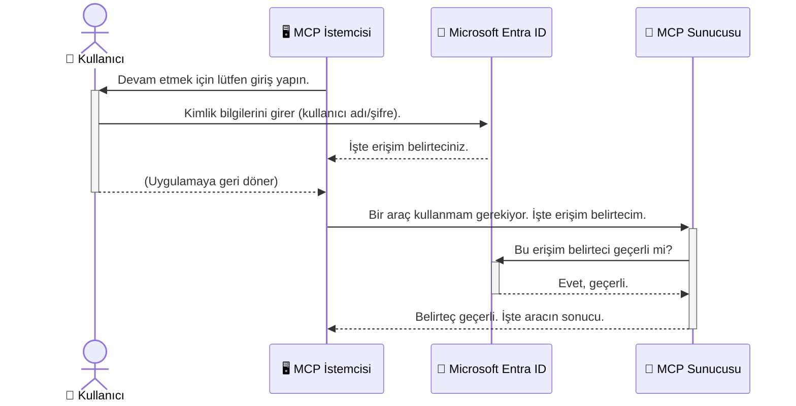

# Yapay Zeka İş Akışlarını Güvence Altına Alma: Model Context Protocol Sunucuları için Entra ID Doğrulaması

## Giriş
Model Context Protocol (MCP) sunucunuzu güvence altına almak, evinizin ön kapısını kilitlemek kadar önemlidir. MCP sunucunuzu açık bırakmak, araçlarınızı ve verilerinizi yetkisiz erişime maruz bırakır ve bu da güvenlik ihlallerine yol açabilir. Microsoft Entra ID, sadece yetkili kullanıcıların ve uygulamaların MCP sunucunuzla etkileşime geçebilmesini sağlamak için güçlü bulut tabanlı kimlik ve erişim yönetimi çözümü sunar. Bu bölümde, Entra ID doğrulamasını kullanarak yapay zeka iş akışlarınızı nasıl koruyacağınızı öğreneceksiniz.

## Öğrenme Hedefleri
Bu bölümü tamamladıktan sonra:

- MCP sunucularını güvence altına almanın önemini anlayabileceksiniz.
- Microsoft Entra ID ve OAuth 2.0 doğrulamasının temellerini açıklayabileceksiniz.
- Genel (public) ve gizli (confidential) istemciler arasındaki farkı ayırt edebileceksiniz.
- Hem yerel (public client) hem de uzak (confidential client) MCP sunucu senaryolarında Entra ID doğrulamasını uygulayabileceksiniz.
- Yapay zeka iş akışları geliştirirken güvenlik en iyi uygulamalarını uygulayabileceksiniz.

## Güvenlik ve MCP

Nasıl evinizin ön kapısını kilitlemeden bırakmak istemiyorsanız, MCP sunucunuzu da herkesin erişimine açık bırakmamalısınız. Yapay zeka iş akışlarınızı güvence altına almak, sağlam, güvenilir ve güvenli uygulamalar oluşturmak için elzemdir. Bu bölümde, Microsoft Entra ID kullanarak MCP sunucularınızı nasıl güvence altına alacağınızı öğreneceksiniz; böylece yalnızca yetkili kullanıcılar ve uygulamalar araçlarınıza ve verilerinize erişebilecektir.

## MCP Sunucuları için Güvenliğin Önemi

MCP sunucunuzda e-posta gönderme veya müşteri veritabanına erişme gibi bir aracın olduğunu hayal edin. Güvenliği sağlanmamış bir sunucu, bu aracın herkes tarafından kullanılabilmesi anlamına gelir; bu da yetkisiz veri erişimi, spam veya diğer kötü niyetli faaliyetlere yol açabilir.

Doğrulama uygulayarak, sunucunuza yapılan her isteğin doğrulandığından emin olursunuz; bu da isteği yapan kullanıcı veya uygulamanın kimliğinin onaylanması demektir. Bu, yapay zeka iş akışlarınızı güvence altına almak için en önemli ve ilk adımdır.

## Microsoft Entra ID Tanıtımı

[**Microsoft Entra ID**](https://adoption.microsoft.com/microsoft-security/entra/) bulut tabanlı bir kimlik ve erişim yönetimi hizmetidir. Uygulamalarınız için evrensel bir güvenlik görevlisi gibi düşünebilirsiniz. Kullanıcı kimliklerini doğrulama (doğrulama) ve ne yapabileceklerini belirleme (yetkilendirme) karmaşık süreçlerini yönetir.

Entra ID kullanarak:

- Kullanıcılar için güvenli oturum açmayı etkinleştirebilirsiniz.
- API ve hizmetlerinizi koruyabilirsiniz.
- Erişim politikalarını merkezi bir yerden yönetebilirsiniz.

MCP sunucuları için Entra ID, sunucunuzun kabiliyetlerine kimin erişebileceğini yönetmek adına sağlam ve yaygın olarak güvenilen bir çözüm sağlar.

---

## Bu İşin Büyüsü: Entra ID Doğrulaması Nasıl Çalışır?

Entra ID, doğrulamayı yönetmek için **OAuth 2.0** gibi açık standartları kullanır. Detaylar karmaşık olsa da, temel kavram basittir ve bir benzetme ile anlaşılabilir.

### OAuth 2.0’a Nazik Bir Giriş: Vale Anahtarı

OAuth 2.0’ı, arabanız için bir vale hizmeti olarak düşünebilirsiniz. Bir restorana geldiğinizde, vale'ye anahtarınızı (master key) vermezsiniz. Bunun yerine, sınırlı izinlere sahip bir **vale anahtarı** verirsiniz — örneğin arabayı çalıştırabilir ve kapıları kilitleyebilir ama bagajı veya torpido gözünü açamaz.

Bu benzetmede:

- **Siz**, **Kullanıcı**'sınız.
- **Arabanız**, değerli araçlara ve verilere sahip olan **MCP Sunucu**'dur.
- **Vale**, **Microsoft Entra ID**’dir.
- **Otopark Görevlisi**, MCP sunucuya erişmeye çalışan **MCP İstemcisi** (uygulama)'dir.
- **Vale Anahtarı**, **Erişim Token’ı**dır.

Erişim token’ı, MCP istemcisinin Entra ID’den oturum açtıktan sonra aldığı güvenli bir metin dizisidir. İstemci, her istekte bu token’ı MCP sunucusuna sunar. Sunucu, token’ın geçerliliğini doğrulayarak isteğin meşru olduğunu ve istemcinin gerekli izinlere sahip olduğunu doğrular; üstelik gerçek kimlik bilgilerinizi (şifreniz gibi) asla işlemelerine gerek kalmaz.

### Doğrulama Akışı

İşleyiş pratikte şu şekildedir:



### Microsoft Authentication Library (MSAL) Tanıtımı

Koda girmeden önce, örneklerde göreceğiniz önemli bir bileşeni tanıtmak faydalı: **Microsoft Authentication Library (MSAL)**.

MSAL, Microsoft tarafından geliştirilen ve geliştiricilerin doğrulama işlemlerini çok daha kolay yönetmesini sağlayan bir kütüphanedir. Güvenlik token’larını yönetmek, oturum açma işlemlerini ve oturum yenilemeyi sizin için kolaylaştırır.

MSAL kullanılmasının önerilme sebepleri:

- **Güvenlidir:** Endüstri standart protokoller ve güvenlik en iyi uygulamalarını uygular, böylece kodunuzdaki açık risklerini azaltır.
- **Geliştirmeyi Basitleştirir:** OAuth 2.0 ve OpenID Connect gibi karmaşık protokolleri soyutlayarak, birkaç satır kodla güçlü doğrulama eklemenizi sağlar.
- **Bakımı Yapılır:** Microsoft, MSAL’i aktif olarak günceller, yeni güvenlik tehditleri ve platform değişikliklerine uyum sağlar.

MSAL, .NET, JavaScript/TypeScript, Python, Java, Go ve iOS ile Android gibi mobil platformları içeren birçok dil ve uygulama çatısını destekler. Böylece tüm teknoloji altyapınızda aynı tutarlı doğrulama desenlerini kullanabilirsiniz.

MSAL hakkında daha fazla bilgi için resmi [MSAL genel bakış dökümantasyonunu](https://learn.microsoft.com/entra/identity-platform/msal-overview) inceleyebilirsiniz.

---

## Entra ID ile MCP Sunucunuzu Güvence Altına Alma: Adım Adım Kılavuz

Şimdi, Entra ID kullanarak yerel bir MCP sunucusunu (`stdio` üzerinden iletişim kuran) nasıl güvence altına alacağımızı inceleyelim. Bu örnekte, kullanıcının bilgisayarında çalışan masaüstü uygulaması veya yerel geliştirme sunucusu gibi uygulamalar için uygun olan **genel istemci (public client)** kullanılmıştır.

### Senaryo 1: Yerel MCP Sunucusu Güvence Altına Alma (Genel İstemci ile)

Bu senaryoda, yerel olarak çalışan, `stdio` üzerinden iletişim kuran ve kullanıcı doğrulamak için Entra ID kullanan bir MCP sunucusunu ele alacağız. Sunucu, Microsoft Graph API’den kullanıcının profil bilgilerini alan tek araç içerecektir.

#### 1. Entra ID’de Uygulama Kaydı Yapmak

Kod yazmadan önce uygulamanızı Microsoft Entra ID’de kaydetmeniz gerekir. Bu, Entra ID’ye uygulamanızı bildirir ve doğrulama servisini kullanması için izin verir.

1. **[Microsoft Entra portalına](https://entra.microsoft.com/)** gidin.
2. **App registrations** bölümüne geçin ve **New registration**'a tıklayın.
3. Uygulamanıza bir isim verin (örneğin: "My Local MCP Server").
4. **Supported account types** için **Accounts in this organizational directory only** seçeneğini seçin.
5. Bu örnek için **Redirect URI** boş bırakılabilir.
6. **Register** butonuna tıklayın.

Kaydınızı yaptıktan sonra, **Application (client) ID** ile **Directory (tenant) ID** değerlerini not alın. Bunlara kodunuzda ihtiyacınız olacak.

#### 2. Kod İncelemesi

Doğrulamayı yöneten temel kod kısımlarına bakalım. Bu örneğin tam kodu, [mcp-auth-servers GitHub deposunda](https://github.com/Azure-Samples/mcp-auth-servers) bulunan [Entra ID - Local - WAM](https://github.com/Azure-Samples/mcp-auth-servers/tree/main/src/entra-id-local-wam) klasöründedir.

**`AuthenticationService.cs`**

Bu sınıf, Entra ID ile etkileşimi yönetir.

- **`CreateAsync`**: MSAL (Microsoft Authentication Library) içindeki `PublicClientApplication` nesnesini başlatır. Uygulamanızın `clientId` ve `tenantId` değerleri ile yapılandırılır.
- **`WithBroker`**: Windows Web Account Manager gibi bir broker kullanımını etkinleştirir; bu da daha güvenli ve kesintisiz tek oturum açma deneyimi sağlar.
- **`AcquireTokenAsync`**: Temel yöntemdir. Önce sessizce (kullanıcıya tekrar oturum açma sormadan) token almaya çalışır. Eğer sessizce token alınamazsa, kullanıcıdan etkileşimli olarak oturum açması istenir.

```csharp
// Simplified for clarity
public static async Task<AuthenticationService> CreateAsync(ILogger<AuthenticationService> logger)
{
    var msalClient = PublicClientApplicationBuilder
        .Create(_clientId) // Your Application (client) ID
        .WithAuthority(AadAuthorityAudience.AzureAdMyOrg)
        .WithTenantId(_tenantId) // Your Directory (tenant) ID
        .WithBroker(new BrokerOptions(BrokerOptions.OperatingSystems.Windows))
        .Build();

    // ... cache registration ...

    return new AuthenticationService(logger, msalClient);
}

public async Task<string> AcquireTokenAsync()
{
    try
    {
        // Try silent authentication first
        var accounts = await _msalClient.GetAccountsAsync();
        var account = accounts.FirstOrDefault();

        AuthenticationResult? result = null;

        if (account != null)
        {
            result = await _msalClient.AcquireTokenSilent(_scopes, account).ExecuteAsync();
        }
        else
        {
            // If no account, or silent fails, go interactive
            result = await _msalClient.AcquireTokenInteractive(_scopes).ExecuteAsync();
        }

        return result.AccessToken;
    }
    catch (Exception ex)
    {
        _logger.LogError(ex, "An error occurred while acquiring the token.");
        throw; // Optionally rethrow the exception for higher-level handling
    }
}
```

**`Program.cs`**

Burası MCP sunucusunun kurulduğu ve doğrulama servisinin entegre edildiği yerdir.

- **`AddSingleton<AuthenticationService>`**: `AuthenticationService`'i bağımlılık enjeksiyonu konteynerine kaydeder; böylece uygulamanın diğer bölümleri (örneğin araçlar) kullanabilir.
- **`GetUserDetailsFromGraph` aracı**: Bu araç `AuthenticationService` örneğine ihtiyaç duyar. Herhangi bir işlem yapmadan önce `authService.AcquireTokenAsync()` metodunu çağırarak geçerli bir erişim token'ı alır. Doğrulama başarılı olursa, token ile Microsoft Graph API'ye çağrı yapar ve kullanıcının bilgilerini getirir.

```csharp
// Simplified for clarity
[McpServerTool(Name = "GetUserDetailsFromGraph")]
public static async Task<string> GetUserDetailsFromGraph(
    AuthenticationService authService)
{
    try
    {
        // This will trigger the authentication flow
        var accessToken = await authService.AcquireTokenAsync();

        // Use the token to create a GraphServiceClient
        var graphClient = new GraphServiceClient(
            new BaseBearerTokenAuthenticationProvider(new TokenProvider(authService)));

        var user = await graphClient.Me.GetAsync();

        return System.Text.Json.JsonSerializer.Serialize(user);
    }
    catch (Exception ex)
    {
        return $"Error: {ex.Message}";
    }
}
```

#### 3. Bütünlükte İşleyişi

1. MCP istemcisi `GetUserDetailsFromGraph` aracını kullanmaya çalıştığında, araç önce `AcquireTokenAsync` metodunu çağırır.
2. `AcquireTokenAsync`, MSAL kütüphanesinin geçerli bir token aramasını tetikler.
3. Token bulunamazsa, MSAL broker aracılığıyla kullanıcıdan Entra ID ile oturum açmasını ister.
4. Kullanıcı oturum açtıktan sonra, Entra ID bir erişim token’ı verir.
5. Araç bu token’ı alır ve Microsoft Graph API’ye güvenli çağrı yapar.
6. Kullanıcının bilgileri MCP istemcisine döner.

Bu işlem, yalnızca doğrulanmış kullanıcıların aracı kullanabilmesini sağlayarak yerel MCP sunucunuzu etkin biçimde güvence altına alır.

### Senaryo 2: Uzak MCP Sunucusu Güvence Altına Alma (Gizli İstemci ile)

MCP sunucunuz uzak bir makinede (örneğin bulut sunucusu) çalışıyor ve HTTP Streaming gibi bir protokol üzerinden iletişim kuruyorsa, güvenlik gereksinimleri farklıdır. Bu durumda, **gizli istemci (confidential client)** ve **Authorization Code Flow** kullanmalısınız. Bu yöntem, uygulamanın gizli bilgileri (secret) asla tarayıcıya ifşa edilmediği için daha güvenlidir.

Bu örnek, HTTP isteklerini yönetmek için Express.js kullanan TypeScript tabanlı bir MCP sunucusunu içerir.

#### 1. Entra ID’de Uygulama Kaydı Yapmak

Entra ID’de kayıt genel istemciye benzer ancak önemli bir fark vardır: **client secret** oluşturmanız gerekir.

1. **[Microsoft Entra portalına](https://entra.microsoft.com/)** gidin.
2. Uygulama kaydınızda **Certificates & secrets** sekmesine geçin.
3. **New client secret** butonuna tıklayın, açıklama girin ve **Add**’e tıklayın.
4. **Önemli:** Gizli anahtar değerini hemen kopyalayın. Daha sonra tekrar göremezsiniz.
5. Ayrıca **Redirect URI** yapılandırmanız gerekir. **Authentication** sekmesine gidin, **Add a platform**a tıklayın, **Web**’i seçin ve uygulamanızın yönlendirme URI’sini (örn. `http://localhost:3001/auth/callback`) girin.

> **⚠️ Önemli Güvenlik Notu:** Üretim uygulamaları için Microsoft, client secret kullanmak yerine **Managed Identity** veya **Workload Identity Federation** gibi **secretless authentication** yöntemlerini güçlü şekilde önerir. Client secretler açığa çıkma veya ele geçme riski taşır. Yönetilen kimlikler ise, kimlik bilgilerini kod veya yapılandırmada tutma ihtiyacını ortadan kaldırarak daha güvenli bir yaklaşım sağlar.
>
> Yönetilen kimlikler hakkında ve bunların uygulamalarınıza nasıl entegre edileceği hakkında daha fazla bilgi için [Azure kaynakları için yönetilen kimliklere genel bakış](https://learn.microsoft.com/entra/identity/managed-identities-azure-resources/overview) sayfasına bakınız.

#### 2. Kod İncelemesi

Bu örnek oturum (session)-temelli bir yaklaşıma sahiptir. Kullanıcı doğrulandığında, sunucu erişim token’ı ve yenileme token’ını oturumda saklar ve kullanıcıya bir oturum token’ı verir. Bu oturum token’ı sonraki isteklerde kullanılır. Örneğin tam kodu [mcp-auth-servers GitHub deposunda](https://github.com/Azure-Samples/mcp-auth-servers) bulunan [Entra ID - Confidential client](https://github.com/Azure-Samples/mcp-auth-servers/tree/main/src/entra-id-cca-session) klasöründedir.

**`Server.ts`**

Bu dosya Express sunucusunu ve MCP taşıma katmanını kurar.

- **`requireBearerAuth`**: `/sse` ve `/message` uç noktalarını koruyan middleware’dır. İstek başlığında (header) geçerli bir bearer token olup olmadığını kontrol eder.
- **`EntraIdServerAuthProvider`**: `McpServerAuthorizationProvider` arayüzünü implement eden özel bir sınıftır. OAuth 2.0 akışını yönetir.
- **`/auth/callback`**: Kullanıcı doğrulandıktan sonra Entra ID’den dönen yönlendirmeyi (redirect) ele alır. Yetkilendirme kodunu erişim token’ı ve yenileme token’ı ile değiştirir.

```typescript
// Anlaşılırlık için basitleştirildi
const app = express();
const { server } = createServer();
const provider = new EntraIdServerAuthProvider();

// SSE uç noktasını koruyun
app.get("/sse", requireBearerAuth({
  provider,
  requiredScopes: ["User.Read"]
}), async (req, res) => {
  // ... taşıyıcıya bağlan ...
});

// Mesaj uç noktasını koruyun
app.post("/message", requireBearerAuth({
  provider,
  requiredScopes: ["User.Read"]
}), async (req, res) => {
  // ... mesajı işleyin ...
});

// OAuth 2.0 geri çağrısını işleyin
app.get("/auth/callback", (req, res) => {
  provider.handleCallback(req.query.code, req.query.state)
    .then(result => {
      // ... başarı veya hatayı işleyin ...
    });
});
```

**`Tools.ts`**

Bu dosya MCP sunucusunun sağladığı araçları tanımlar. `getUserDetails` aracı önceki örneğe benzer, ancak erişim token’ını oturumdan alır.

```typescript
// Anlaşılırlık için basitleştirildi
server.setRequestHandler(CallToolRequestSchema, async (request) => {
  const { name } = request.params;
  const context = request.params?.context as { token?: string } | undefined;
  const sessionToken = context?.token;

  if (name === ToolName.GET_USER_DETAILS) {
    if (!sessionToken) {
      throw new AuthenticationError("Authentication token is missing or invalid. Ensure the token is provided in the request context.");
    }

    // Oturum deposundan Entra ID jetonunu alın
    const tokenData = tokenStore.getToken(sessionToken);
    const entraIdToken = tokenData.accessToken;

    const graphClient = Client.init({
      authProvider: (done) => {
        done(null, entraIdToken);
      }
    });

    const user = await graphClient.api('/me').get();

    // ... kullanıcı detaylarını döndür ...
  }
});
```

**`auth/EntraIdServerAuthProvider.ts`**

Bu sınıfın sorumluluğunda:

- Kullanıcıyı Entra ID oturum açma sayfasına yönlendirmek.
- Yetkilendirme kodunu erişim token’ına dönüştürmek.
- Token’ları `tokenStore`'da saklamak.
- Erişim token’ının süresi dolduğunda yenilemek.

#### 3. Bütünlükte İşleyişi

1. Kullanıcı MCP sunucusuna ilk bağlanmaya çalıştığında, `requireBearerAuth` middleware geçerli bir oturum olmadığını görür ve kullanıcıyı Entra ID oturum açma sayfasına yönlendirir.
2. Kullanıcı Entra ID hesabıyla oturum açar.
3. Entra ID, kullanıcıyı bir yetkilendirme koduyla `/auth/callback` uç noktasına geri yönlendirir.  
4. Sunucu, kodu erişim belirteci ve yenileme belirteci ile değiştirir, bunları depolar ve istemciye gönderilen bir oturum belirteci oluşturur.  
5. İstemci artık MCP sunucusu için tüm gelecekteki isteklerde `Authorization` başlığında bu oturum belirtecini kullanabilir.  
6. `getUserDetails` aracı çağrıldığında, oturum belirtecini kullanarak Entra ID erişim belirtecini bulur ve ardından Microsoft Graph API’yi çağırmak için bunu kullanır.

Bu akış, genel istemci akışından daha karmaşıktır, ancak internet ortamındaki uç noktalar için gereklidir. Uzak MCP sunucuları genel internet üzerinden erişilebilir olduğundan, yetkisiz erişime ve potansiyel saldırılara karşı koruma için daha güçlü güvenlik önlemleri gerektirir.


## Güvenlik En İyi Uygulamaları

- **Her zaman HTTPS kullanın**: İstemci ve sunucu arasındaki iletişimi şifreleyerek belirteçlerin ele geçirilmesini engelleyin.  
- **Rol Tabanlı Erişim Kontrolü (RBAC) uygulayın**: Bir kullanıcının *kimlik doğrulaması yapılıp yapılmadığını* değil, *ne yapmaya yetkili olduğunu* kontrol edin. Entra ID’de roller tanımlayabilir ve MCP sunucunuzda bunları kontrol edebilirsiniz.  
- **İzleme ve denetim yapın**: Şüpheli etkinlikleri tespit edip yanıt verebilmek için tüm kimlik doğrulama olaylarını kaydedin.  
- **Hız sınırlandırma ve throttling uygulayın**: Microsoft Graph ve diğer API’ler kötüye kullanımı önlemek için hız sınırlandırma uygular. MCP sunucunuzda HTTP 429 (Çok Fazla İstek) yanıtlarını zarifçe yönetmek için üssel geri çekilme ve yeniden deneme mantığı uygulayın. API çağrılarını azaltmak için sık erişilen verileri önbelleğe almayı düşünün.  
- **Belirteçlerin güvenli depolanması**: Erişim belirteçlerini ve yenileme belirteçlerini güvenle saklayın. Yerel uygulamalar için sistemin güvenli depolama mekanizmalarını kullanın. Sunucu uygulamaları için şifrelenmiş depolama veya Azure Key Vault gibi güvenli anahtar yönetim servislerini değerlendirin.  
- **Belirteç süresi dolma yönetimi**: Erişim belirteçlerinin sınırlı bir ömrü vardır. Yenileme belirteçlerini kullanarak otomatik belirteç yenileme uygulayarak yeniden kimlik doğrulamaya gerek kalmadan kesintisiz kullanıcı deneyimi sağlayın.  
- **Azure API Management kullanmayı değerlendirin**: Güvenliği doğrudan MCP sunucunuzda uygulamak ince kontrollere sahip olmanızı sağlasa da, Azure API Management gibi API Geçitleri kimlik doğrulama, yetkilendirme, hız sınırlandırma ve izleme gibi birçok güvenlik endişesini otomatik olarak karşılar. Bunlar, istemcileriniz ile MCP sunucularınız arasında merkezi bir güvenlik katmanı sağlar. MCP ile API Geçitleri kullanımı hakkında daha fazla detay için [Azure API Management Your Auth Gateway For MCP Servers](https://techcommunity.microsoft.com/blog/integrationsonazureblog/azure-api-management-your-auth-gateway-for-mcp-servers/4402690) sayfasına bakabilirsiniz.


## Önemli Noktalar

- MCP sunucunuzu güvenceye almak, verilerinizi ve araçlarınızı korumak için çok önemlidir.  
- Microsoft Entra ID, kimlik doğrulama ve yetkilendirme için güçlü ve ölçeklenebilir bir çözüm sunar.  
- Yerel uygulamalar için **genel istemci**, uzak sunucular için **gizli istemci** kullanın.  
- **Yetkilendirme Kodu Akışı**, web uygulamaları için en güvenli seçenektir.


## Alıştırma

1. Oluşturabileceğiniz bir MCP sunucusunu düşünün. Yerel bir sunucu mu yoksa uzak bir sunucu mu olurdu?  
2. Cevabınıza göre genel mi yoksa gizli istemci mi kullanırdınız?  
3. MCP sunucunuz Microsoft Graph üzerinde işlem yapmak için hangi izinleri isterdi?


## Uygulamalı Alıştırmalar

### Alıştırma 1: Entra ID’de Bir Uygulama Kaydedin  
Microsoft Entra portalına gidin.  
MCP sunucunuz için yeni bir uygulama kaydedin.  
Uygulama (istemci) Kimliği ve Dizin (kiracı) Kimliğini not edin.

### Alıştırma 2: Yerel Bir MCP Sunucusunu Güvenceye Alın (Genel İstemci)  
- Kullanıcı kimlik doğrulaması için MSAL (Microsoft Authentication Library) entegrasyon örneğini takip edin.  
- Microsoft Graph’dan kullanıcı ayrıntılarını getiren MCP aracını çağırarak kimlik doğrulama akışını test edin.

### Alıştırma 3: Uzak Bir MCP Sunucusunu Güvenceye Alın (Gizli İstemci)  
- Entra ID’de bir gizli istemci kaydedin ve istemci sırrı oluşturun.  
- Express.js MCP sunucunuzda Yetkilendirme Kodu Akışı’nı yapılandırın.  
- Korunan uç noktaları test edin ve belirteç tabanlı erişimi doğrulayın.

### Alıştırma 4: Güvenlik En İyi Uygulamalarını Uygulayın  
- Yerel veya uzak sunucunuz için HTTPS’yi etkinleştirin.  
- Sunucu mantığınızda rol tabanlı erişim kontrolü (RBAC) uygulayın.  
- Belirteç süresi dolma yönetimi ve güvenli belirteç depolama ekleyin.

## Kaynaklar

1. **MSAL Genel Bakış Belgelendirmesi**  
Microsoft Authentication Library (MSAL)’in platformlar arası güvenli belirteç edinimini nasıl sağladığını öğrenin:  
[MSAL Overview on Microsoft Learn](https://learn.microsoft.com/en-gb/entra/msal/overview)

2. **Azure-Samples/mcp-auth-servers GitHub Deposu**  
Kimlik doğrulama akışlarını gösteren MCP sunucu referans uygulamaları:  
[Azure-Samples/mcp-auth-servers on GitHub](https://github.com/Azure-Samples/mcp-auth-servers)

3. **Azure Kaynakları için Yönetilen Kimlikler Genel Bakış**  
Sistem veya kullanıcı tarafından atanmış yönetilen kimlikler kullanarak gizli anahtarları ortadan kaldırmayı öğrenin:  
[Managed Identities Overview on Microsoft Learn](https://learn.microsoft.com/en-us/entra/identity/managed-identities-azure-resources/)

4. **Azure API Management: MCP Sunucuları için Yetkilendirme Geçidiniz**  
MCP sunucuları için güvenli OAuth2 geçidi olarak APIM kullanımı hakkında derinlemesine inceleme:  
[Azure API Management Your Auth Gateway For MCP Servers](https://techcommunity.microsoft.com/blog/integrationsonazureblog/azure-api-management-your-auth-gateway-for-mcp-servers/4402690)

5. **Microsoft Graph İzinleri Referansı**  
Microsoft Graph için devredilen ve uygulama izinlerinin kapsamlı listesi:  
[Microsoft Graph Permissions Reference](https://learn.microsoft.com/zh-tw/graph/permissions-reference)


## Öğrenme Çıktıları  
Bu bölümü tamamladıktan sonra:

- MCP sunucuları ve AI iş akışları için kimlik doğrulamanın neden kritik olduğunu açıklayabileceksiniz.  
- Hem yerel hem uzak MCP sunucu senaryoları için Entra ID kimlik doğrulamasını kurup yapılandırabileceksiniz.  
- Sunucunuzun dağıtımına göre uygun istemci türünü (genel veya gizli) seçebileceksiniz.  
- Güvenli kodlama uygulamalarını, belirteç depolama ve rol tabanlı yetkilendirmeyi uygulayabileceksiniz.  
- MCP sunucunuzu ve araçlarını yetkisiz erişime karşı güvenle koruyabileceksiniz.

## Sonraki Adım  

- [5.13 Model Context Protocol (MCP) Microsoft Foundry ile Entegrasyon](../mcp-foundry-agent-integration/README.md)

---

<!-- CO-OP TRANSLATOR DISCLAIMER START -->
**Feragatname**:
Bu belge, AI çeviri hizmeti [Co-op Translator](https://github.com/Azure/co-op-translator) kullanılarak çevrilmiştir. Doğruluk için çaba sarf etsek de, otomatik çevirilerin hata veya yanlışlık içerebileceğini lütfen unutmayınız. Orijinal belge, kendi dilinde yetkili kaynak olarak kabul edilmelidir. Kritik bilgiler için profesyonel insan çevirisi önerilir. Bu çevirinin kullanımı sonucu ortaya çıkabilecek yanlış anlamalardan veya yanlış yorumlamalardan sorumlu değiliz.
<!-- CO-OP TRANSLATOR DISCLAIMER END -->