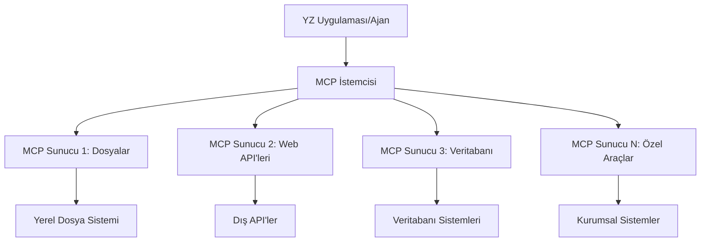

# 🌐 Modül 2: Microsoft Foundry Toolkit Temelleri ile MCP

[]()
[]()
[]()

## 📋 Öğrenme Hedefleri

Bu modülün sonunda, şunları yapabileceksiniz:
- ✅ Model Context Protocol (MCP) mimarisi ve faydalarını anlamak
- ✅ Microsoft'un MCP sunucu ekosistemini keşfetmek
- ✅ MCP sunucularını Microsoft Foundry Toolkit Agent Builder ile entegre etmek
- ✅ Playwright MCP kullanarak işlevsel bir tarayıcı otomasyon ajanı geliştirmek
- ✅ Ajanlarınızdaki MCP araçlarını yapılandırmak ve test etmek
- ✅ MCP destekli ajanları üretim kullanımı için dışa aktarmak ve dağıtmak

## 🎯 Modül 1 Üzerine İnşa Etmek

Modül 1'de Microsoft Foundry Toolkit temel bilgilerini öğrendik ve ilk Python Ajanımızı yarattık. Şimdi ajanlarınızı, devrim niteliğindeki **Model Context Protocol (MCP)** aracılığıyla harici araçlar ve hizmetlere bağlayarak **güçlendireceğiz**. 

Bunu temel bir hesap makinesinden tam bir bilgisayara yükseltmeye benzetin - AI ajanlarınız artık şunları yapabilecek:
- 🌐 Web sitelerinde gezinmek ve etkileşimde bulunmak
- 📁 Dosyalara erişmek ve manipüle etmek
- 🔧 Kurumsal sistemlerle entegrasyon sağlamak
- 📊 API'lerden gerçek zamanlı veri işlemek

## 🧠 Model Context Protocol (MCP) Anlamak

### 🔍 MCP Nedir?

Model Context Protocol (MCP), AI uygulamaları için **“USB-C”** – Büyük Dil Modellerini (LLM’ler) dış araçlar, veri kaynakları ve hizmetlerle bağlayan devrim niteliğinde açık bir standarttır. USB-C’nin kablo karmaşasını tek evrensel bağlantı ile çözdüğü gibi, MCP de yapay zeka entegrasyon karmaşasını tek standart protokolle ortadan kaldırır.

### 🎯 MCP'nin Çözdüğü Sorun

**MCP Öncesi:**
- 🔧 Her araç için özel entegrasyonlar
- 🔄 Tedarikçi kilitlemesi ve özel çözümler  
- 🔒 Plansız bağlantılardan güvenlik açıkları
- ⏱️ Temel entegrasyonlar için aylarca geliştirme süresi

**MCP ile:**
- ⚡ Tak-çalıştır araç entegrasyonu
- 🔄 Tedarikçi bağımsız mimari
- 🛡️ Yerleşik güvenlik en iyi uygulamaları
- 🚀 Yeni yetenekleri dakikalar içinde ekleme

### 🏗️ MCP Mimari Detayları

MCP, güvenli ve ölçeklenebilir bir ekosistem yaratan **istemci-sunucu mimarisi** izler:



**🔧 Temel Bileşenler:**

| Bileşen | Rolü | Örnekler |
|-----------|------|----------|
| **MCP Hostları** | MCP servislerini kullanan uygulamalar | Claude Desktop, VS Code, Microsoft Foundry Toolkit |
| **MCP İstemcileri** | Protokol işlemleri (sunucularla birebir) | Host uygulamalara gömülü |
| **MCP Sunucuları** | Yetkinlikleri standart protokolle sunar | Playwright, Dosyalar, Azure, GitHub |
| **Taşıma Katmanı** | İletişim yöntemleri | stdio, HTTP, WebSockets |


## 🏢 Microsoft'un MCP Sunucu Ekosistemi

Microsoft, gerçek dünya iş ihtiyaçlarına hitap eden kapsamlı kurumsal düzeyde MCP sunucu seti ile ekosisteme liderlik ediyor.

### 🌟 Öne Çıkan Microsoft MCP Sunucuları

#### 1. ☁️ Azure MCP Sunucusu
**🔗 Depo**: [azure/azure-mcp](https://github.com/azure/azure-mcp)
**🎯 Amaç**: AI entegrasyonlu kapsamlı Azure kaynak yönetimi

**✨ Temel Özellikler:**
- Deklaratif altyapı sağlama
- Gerçek zamanlı kaynak izleme
- Maliyet optimizasyon önerileri
- Güvenlik uyumluluk kontrolü

**🚀 Kullanım Alanları:**
- AI destekli Infrastructure-as-Code
- Otomatik kaynak ölçeklendirme
- Bulut maliyet optimizasyonu
- DevOps iş akışı otomasyonu

#### 2. 📊 Microsoft Dataverse MCP
**📚 Dokümantasyon**: [Microsoft Dataverse Entegrasyonu](https://go.microsoft.com/fwlink/?linkid=2320176)
**🎯 Amaç**: İş verileri için doğal dil arabirimi

**✨ Temel Özellikler:**
- Doğal dil tabanlı veritabanı sorguları
- İş bağlamı anlama
- Özel istem şablonları
- Kurumsal veri yönetimi

**🚀 Kullanım Alanları:**
- İş zekası raporlaması
- Müşteri veri analizi
- Satış pipeline analizleri
- Uyumluluk veri sorguları

#### 3. 🌐 Playwright MCP Sunucusu
**🔗 Depo**: [microsoft/playwright-mcp](https://github.com/microsoft/playwright-mcp)
**🎯 Amaç**: Tarayıcı otomasyonu ve web etkileşim yetenekleri

**✨ Temel Özellikler:**
- Çoklu tarayıcı otomasyonu (Chrome, Firefox, Safari)
- Akıllı eleman algılama
- Ekran görüntüsü ve PDF oluşturma
- Ağ trafiği izleme

**🚀 Kullanım Alanları:**
- Otomatik test iş akışları
- Web kazıma ve veri çıkarımı
- UI/UX izleme
- Rekabet analizi otomasyonu

#### 4. 📁 Dosyalar MCP Sunucusu
**🔗 Depo**: [microsoft/files-mcp-server](https://github.com/microsoft/files-mcp-server)
**🎯 Amaç**: Akıllı dosya sistemi işlemleri

**✨ Temel Özellikler:**
- Deklaratif dosya yönetimi
- İçerik senkronizasyonu
- Sürüm kontrol entegrasyonu
- Meta veri çıkarımı

**🚀 Kullanım Alanları:**
- Dokümantasyon yönetimi
- Kod deposu organizasyonu
- İçerik yayın iş akışları
- Veri hattı dosya işlemleri

#### 5. 📝 MarkItDown MCP Sunucusu
**🔗 Depo**: [microsoft/markitdown](https://github.com/microsoft/markitdown)
**🎯 Amaç**: Gelişmiş Markdown işleme ve manipülasyonu

**✨ Temel Özellikler:**
- Zengin Markdown çözümleme
- Format dönüşümü (MD ↔ HTML ↔ PDF)
- İçerik yapı analizi
- Şablon işleme

**🚀 Kullanım Alanları:**
- Teknik dokümantasyon iş akışları
- İçerik yönetim sistemleri
- Rapor oluşturma
- Bilgi tabanı otomasyonu

#### 6. 📈 Clarity MCP Sunucusu
**📦 Paket**: [@microsoft/clarity-mcp-server](https://www.npmjs.com/package/@microsoft/clarity-mcp-server)
**🎯 Amaç**: Web analizleri ve kullanıcı davranışı içgörüleri

**✨ Temel Özellikler:**
- Isı haritası veri analizi
- Kullanıcı oturumu kayıtları
- Performans metrikleri
- Dönüşüm hunisi analizi

**🚀 Kullanım Alanları:**
- Web sitesi optimizasyonu
- Kullanıcı deneyimi araştırması
- A/B testi analizi
- İş zekası panoları

### 🌍 Topluluk Ekosistemi

Microsoft sunucularının ötesinde, MCP ekosistemi şunları içerir:
- **🐙 GitHub MCP**: Depo yönetimi ve kod analizi
- **🗄️ Veritabanı MCP’leri**: PostgreSQL, MySQL, MongoDB entegrasyonları
- **☁️ Bulut Sağlayıcı MCP’leri**: AWS, GCP, Digital Ocean araçları
- **📧 İletişim MCP’leri**: Slack, Teams, E-posta entegrasyonları

## 🛠️ Pratik Laboratuvar: Bir Tarayıcı Otomasyon Ajanı İnşa Etmek

**🎯 Proje Amacı**: Playwright MCP sunucu kullanarak, web sitelerinde gezinebilen, bilgi çıkarabilen ve karmaşık web etkileşimleri yapabilen zeki bir tarayıcı otomasyon ajanı oluşturmak.

### 🚀 Aşama 1: Ajan Temel Kurulumu

#### Adım 1: Ajanınızı Başlatın
1. **Microsoft Foundry Toolkit Agent Builder'ı açın**
2. **Yeni Ajan Oluşturun** ve aşağıdaki yapılandırmayı yapın:
   - **İsim**: `BrowserAgent`
   - **Model**: GPT-4o seçin 


### 🔧 Aşama 2: MCP Entegrasyon İş Akışı

#### Adım 3: MCP Sunucu Entegrasyonu Ekleme
1. **Agent Builder içinde Araçlar Bölümüne gidin**
2. **"Araç Ekle" butonuna tıklayın** ve entegrasyon menüsünü açın
3. **Mevcut seçeneklerden "MCP Sunucu" seçin**


**🔍 Araç Türlerini Anlamak:**
- **Yerleşik Araçlar**: Önceden yapılandırılmış Microsoft Foundry Toolkit fonksiyonları
- **MCP Sunucuları**: Harici servis entegrasyonları
- **Özel API’ler**: Kendi servis uç noktalarınız
- **Fonksiyon Çağrısı**: Model fonksiyonuna doğrudan erişim

#### Adım 4: MCP Sunucu Seçimi
1. **Devam etmek için "MCP Sunucu" seçeneğini seçin**


2. **MCP Kataloğunu inceleyerek mevcut entegrasyonları keşfedin**


### 🎮 Aşama 3: Playwright MCP Yapılandırması

#### Adım 5: Playwright Seçme ve Yapılandırma
1. **Microsoft'un doğrulanmış sunucularına erişmek için "Öne Çıkan MCP Sunucularını Kullan" butonuna tıklayın**
2. **Öne çıkan listeden "Playwright" seçin**
3. **Varsayılan MCP Kimliğini kabul edin ya da ortamınıza göre özelleştirin**


#### Adım 6: Playwright Özelliklerini Etkinleştirme
**🔑 Kritik Adım**: Maksimum işlevsellik için mevcut tüm Playwright yöntemlerini seçin


**🛠️ Temel Playwright Araçları:**
- **Geçiş**: `goto`, `goBack`, `goForward`, `reload`
- **Etkileşim**: `click`, `fill`, `press`, `hover`, `drag`
- **Veri Çıkarma**: `textContent`, `innerHTML`, `getAttribute`
- **Doğrulama**: `isVisible`, `isEnabled`, `waitForSelector`
- **Yakalama**: `screenshot`, `pdf`, `video`
- **Ağ**: `setExtraHTTPHeaders`, `route`, `waitForResponse`

#### Adım 7: Entegrasyon Başarısını Doğrulama
**✅ Başarı Göstergeleri:**
- Tüm araçlar Agent Builder arayüzünde görünür
- Entegrasyon panelinde hata mesajı yok
- Playwright sunucu durumu "Bağlandı" olarak gösteriliyor


**🔧 Yaygın Sorun Giderme:**
- **Bağlantı Hatası**: İnternet bağlantınızı ve güvenlik duvarı ayarlarını kontrol edin
- **Araç Eksikliği**: Kurulum esnasında tüm yeteneklerin seçildiğinden emin olun
- **İzin Hataları**: VS Code’un gerekli sistem izinlerine sahip olduğunu doğrulayın

### 🎯 Aşama 4: Gelişmiş İstem Mühendisliği

#### Adım 8: Zeki Sistem İstemleri Tasarlayın
Playwright’ın tüm yeteneklerini kullanan gelişmiş istemler oluşturun:

```markdown
# Web Automation Expert System Prompt

## Core Identity
You are an advanced web automation specialist with deep expertise in browser automation, web scraping, and user experience analysis. You have access to Playwright tools for comprehensive browser control.

## Capabilities & Approach
### Navigation Strategy
- Always start with screenshots to understand page layout
- Use semantic selectors (text content, labels) when possible
- Implement wait strategies for dynamic content
- Handle single-page applications (SPAs) effectively

### Error Handling
- Retry failed operations with exponential backoff
- Provide clear error descriptions and solutions
- Suggest alternative approaches when primary methods fail
- Always capture diagnostic screenshots on errors

### Data Extraction
- Extract structured data in JSON format when possible
- Provide confidence scores for extracted information
- Validate data completeness and accuracy
- Handle pagination and infinite scroll scenarios

### Reporting
- Include step-by-step execution logs
- Provide before/after screenshots for verification
- Suggest optimizations and alternative approaches
- Document any limitations or edge cases encountered

## Ethical Guidelines
- Respect robots.txt and rate limiting
- Avoid overloading target servers
- Only extract publicly available information
- Follow website terms of service
```

#### Adım 9: Dinamik Kullanıcı İstemleri Yaratın
Çeşitli yetenekleri gösteren istemler tasarlayın:

**🌐 Web Analizi Örneği:**
```markdown
Navigate to github.com/kinfey and provide a comprehensive analysis including:
1. Repository structure and organization
2. Recent activity and contribution patterns  
3. Documentation quality assessment
4. Technology stack identification
5. Community engagement metrics
6. Notable projects and their purposes

Include screenshots at key steps and provide actionable insights.
```


### 🚀 Aşama 5: Yürütme ve Test

#### Adım 10: İlk Otomasyonunuzu Çalıştırın
1. **"Çalıştır" butonuna tıklayarak otomasyon dizisini başlatın**
2. **Gerçek zamanlı yürütmeyi izleyin**:
   - Chrome tarayıcı otomatik açılır
   - Ajan hedef web sitesine gider
   - Ekran görüntüleri her önemli adımı kaydeder
   - Analiz sonuçları gerçek zamanlı akar


#### Adım 11: Sonuçları ve İçgörüleri Analiz Edin
Agent Builder arayüzünde kapsamlı analiz sonuçlarını inceleyin:


### 🌟 Aşama 6: Gelişmiş Yetenekler ve Yayına Alma

#### Adım 12: Dışa Aktarma ve Üretim Dağıtımı
Agent Builder çeşitli dağıtım seçeneklerini destekler:


## 🎓 Modül 2 Özeti ve Sonraki Adımlar

### 🏆 Başarı Kazandı: MCP Entegrasyon Ustası

**✅ Edinilen Beceriler:**
- [ ] MCP mimarisi ve faydalarını anlamak
- [ ] Microsoft MCP sunucu ekosisteminde gezinebilmek
- [ ] Playwright MCP’yi Microsoft Foundry Toolkit ile entegre etmek
- [ ] Gelişmiş tarayıcı otomasyon ajanları inşa etmek
- [ ] Web otomasyonu için gelişmiş istem mühendisliği

### 📚 Ek Kaynaklar

- **🔗 MCP Spesifikasyonu**: [Resmi Protokol Dokümantasyonu](https://modelcontextprotocol.io/)
- **🛠️ Playwright API**: [Tam Metod Referansı](https://playwright.dev/docs/api/class-playwright)
- **🏢 Microsoft MCP Sunucuları**: [Kurumsal Entegrasyon Rehberi](https://github.com/microsoft/mcp-servers)
- **🌍 Topluluk Örnekleri**: [MCP Sunucu Galerisi](https://github.com/modelcontextprotocol/servers)

**🎉 Tebrikler!** MCP entegrasyonunu başarıyla öğrendiniz ve artık dış araç özelliklerine sahip üretim hazır AI ajanları oluşturabilirsiniz!


### 🔜 Sonraki Module Geç

MCP becerilerinizi bir sonraki seviyeye taşımaya hazır mısınız? **[Modül 3: Microsoft Foundry Toolkit ile Gelişmiş MCP Geliştirme](../lab3/README.md)** modülüne geçin. Burada şunları öğreneceksiniz:
- Kendi özel MCP sunucularınızı oluşturmak
- En yeni MCP Python SDK'sını yapılandırmak ve kullanmak
- MCP Inspector ile hata ayıklamayı kurmak
- Gelişmiş MCP sunucu geliştirme iş akışlarını ustalaşmak
- Baştan bir Hava Durumu MCP Sunucusu inşa etmek

---

<!-- CO-OP TRANSLATOR DISCLAIMER START -->
**Feragatname**:
Bu belge, AI çeviri hizmeti [Co-op Translator](https://github.com/Azure/co-op-translator) kullanılarak çevrilmiştir. Doğruluk için çaba sarf etsek de, otomatik çevirilerin hata veya yanlışlık içerebileceğini lütfen unutmayınız. Orijinal belge, kendi dilinde yetkili kaynak olarak kabul edilmelidir. Kritik bilgiler için profesyonel insan çevirisi önerilir. Bu çevirinin kullanımı sonucu ortaya çıkabilecek yanlış anlamalardan veya yanlış yorumlamalardan sorumlu değiliz.
<!-- CO-OP TRANSLATOR DISCLAIMER END -->