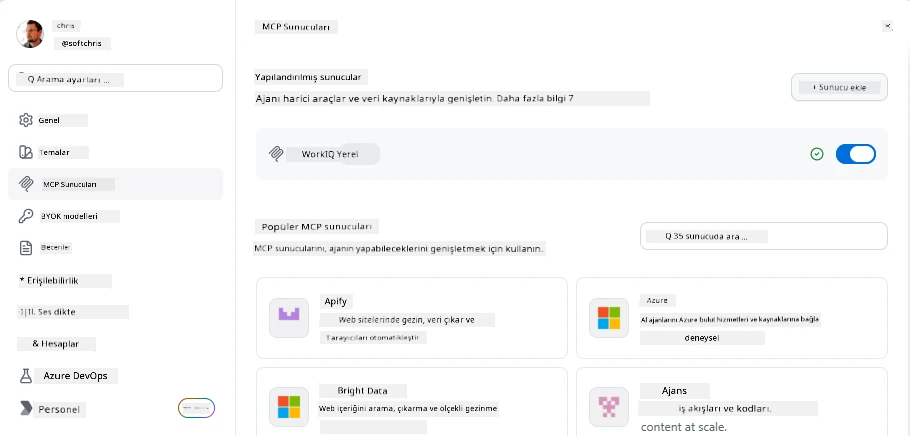
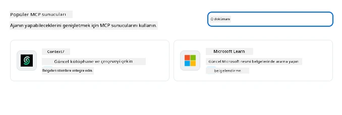
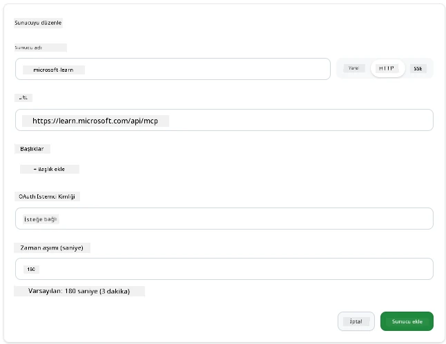
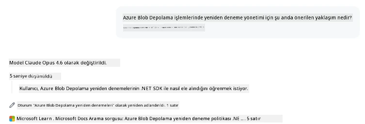
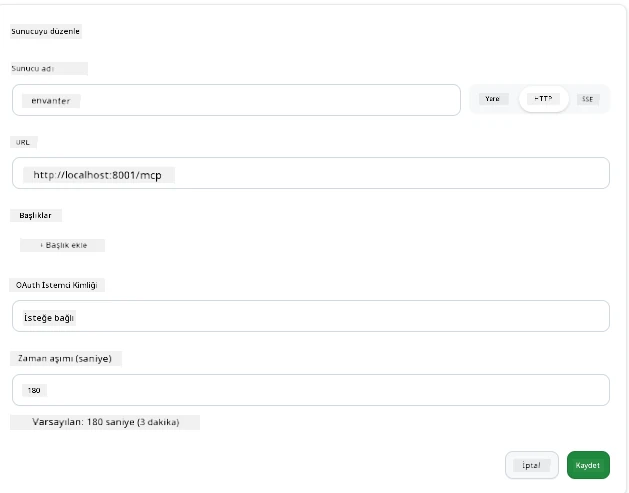
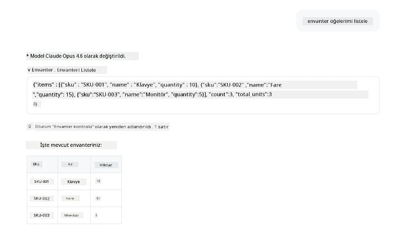
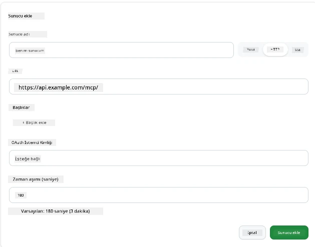
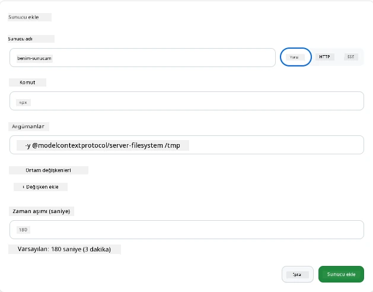

# GitHub Copilot Uygulamasında MCP Sunucularını Kullanma

Şimdiye kadar MCP'nin nasıl çalıştığını biliyorsunuz. Sunucular kurdunuz, araçları ve kaynakları tanımladınız ve istemcileri bağladınız. Ancak henüz bakış açısını değiştirmedik: sunucu kuran kişi olmak yerine, MCP destekleyen yapay zeka destekli bir uygulamanın *tüketici* tarafında olmak nasıl görünüyor?

[GitHub Copilot Uygulaması](https://github.com/github/app) MCP Sunucularını kullanabilen bir masaüstü uygulamasıdır. MCP sunucularını ona bağlayarak yeni bir seviyeyi açarsınız: Copilot artık belgelerinize erişebilir, dahili API'lerinizi çağırabilir, veritabanınızı sorgulayabilir veya bir sunucuya sarmaladığınız herhangi bir hizmetle konuşabilir. Uygulama ev sahibi olur; MCP sunucularınız ise onun araçları olur.

Bu ders, MCP ayar panelini bulmaktan gerçek bir dokümantasyon sunucusunu bağlamaya ve ardından kendi özel sunucunuzu kurmaya kadar bu deneyimi baştan sona size adım adım anlatır.

## Öğrenme Hedefleri

Bu dersin sonunda şunları yapabileceksiniz:

- Copilot Uygulaması ayarlarında MCP Sunucular panelini bulmak ve içinde gezinmek.
- Barındırılan bir dokümantasyon sunucusuna bağlanmak ve bir oturumda kullanmak.
- Özel bir sunucu kaydetmek ve Copilot’un araçlarını çağırabildiğini doğrulamak.
- Bir sunucunun çağrılma şeklini çevre değişkenleri veya özel başlıklar (HTTP ise) sağlayarak yapılandırmak.

## Copilot Uygulaması Bir MCP Ev Sahibi Olarak

Temel fikir şudur: **Copilot'ın ajanları akıllıdır, ancak sadece onlara söylediğiniz şeyi bilirler.** Varsayılan olarak bir ajan çalışma alanınızdaki dosyaları okuyabilir ve terminal komutları çalıştırabilir, ancak veritabanınızı sorgulayamaz, takviminize bakamaz veya özel bir API'yi yardım almadan çağırmaz. İşte MCP sunucuları devreye girer. Bunlar Copilot ile sistemleriniz arasında köprü görevi görür — veritabanları, sürüm kontrol, API'lar, tasarım araçları — ajanlara işleri tamamlamak için ihtiyaç duydukları bilgi ve eylemlere erişim sağlar.

Hadi uygulamanızın MCP Sunucularını yönetmek için bu ayarları bulalım.

## Adım 1: MCP Ayar Panelini Bulmak

Copilot Uygulamasını açın ve sol alt köşede bir dişli simgesi bulun ve tıklayın.


"MCP Sunucuları" seçili olduğundan emin olun, şimdi üstte zaten yapılandırdığınız sunucuları, altta popüler sunuculardan oluşan bir pazarı ve üstte şöyle bir "Sunucu Ekle" düğmesini görmelisiniz:



Burası kontrol merkeziniz. Sunucuları burada ekler, kaldırır, etkinleştirir ve devre dışı bırakırsınız. Değişiklikler yeni oturumlar için geçerlidir; açık bir oturumunuz varsa, bu listeyi değiştirdikten sonra yeni bir oturum başlatmanız gerekir.

## Adım 2: Bir Dokümantasyon Sunucusuna Bağlanmak

Hemen faydalı bir şey yapalım. Microsoft Docs MCP sunucusu Copilot’a resmi Microsoft dokümantasyonuna erişim sağlar. Buna Azure, .NET, TypeScript ve daha fazlası dahildir. Ajan artık eğitim verisine (ki bunun bir kesme tarihi vardır) güvenmek yerine sorgu zamanında güncel dokümanları çekebilir.

Bunu nasıl eklersiniz:

1. Popüler sunucular ızgarasında **learn** yazın ve "Microsoft Learn" adlı sunucuyu seçin.

   

   Tıkladığınızda isim, taşıma türü ve URL önceden doldurulmuş bir form çıkar; yapmanız gereken tek şey "Sunucu Ekle"ye tıklamak.

2. "Sunucu Ekle"ye tıklayın, sunucuya bağlanmak birkaç saniye sürecektir.

   

   Eklendikten sonra üst bölümde yapılandırılmış bir sunucu olarak görünmelidir. Şimdi bir deneyelim.

3. Diyaloğu kapatın ve Hızlı sohbeti seçin.

4. Aşağıdaki istemi yazın ve Microsoft Learn sunucusunda bir aracı tetikleyin.

   ```text
   What's the current recommended approach for handling Azure Blob Storage 
   retries using the .NET SDK?
   ```

   

Az önce eklediğimiz MCP Sunucusuna nasıl başvurduğunu görmelisiniz.

## Adım 3: Özel stdio Sunucusunu Bağlamak

Ön ayarlar kullanışlıdır, ancak gerçek güç kendi sunucularınızı bağlamaktır. Diyelim ki iç API'nizi veya şirket bilgi tabanınızı açığa çıkaran bir sunucu kurdunuz (veya size verildi). Bu durumda şirketimizin stok yönetimini ele alan kendi MCP Sunucumuzu kullanacağız.

1. Dişli simgesine tıklayın ve tekrar "MCP sunucuları"nı seçin.

2. "Sunucu Ekle" düğmesine ve ardından "+ Özel sunucu ekle"ye tıklayın, şu değerleri girin:

   - İsim: `Envanter Sunucusu`
   - Sağ taraftan taşıma türü olarak **http** seçin.

   "Sunucu Ekle"yi seçin, yapılandırılmış sunucu listenizde görünmelidir.

   

4. Denemek için şöyle bir istem çalıştırın:

    ```
    list inventory
    ```

   

   Artık özel olarak oluşturulan sunucunuzdan dönen envanter öğeleri listesini görmelisiniz.

Harika, artık harici ve kendi MCP sunucularınızı Copilot Uygulamasına ekleme konusunda iyi bir anlayışa sahipsiniz. Şimdi sırada gizli bilgiler ve ortam değişkenlerini ele almak var.

## Adım 4: Gelişmiş Ayarlar

Şimdiye kadar sadece bir isim ve URL verdiğiniz MCP Sunucuları nasıl ekleneceğini gördünüz. Peki ya sunucunuz bir API anahtarı veya başka bir değere ihtiyaç duyuyorsa? Taşıma türüne bağlı olarak gereken bilgileri sağlayabiliriz.

- **http veya SSE taşıma**: Burada gerektiği gibi başlıklar ayarlanabilir.

   Yetkilendirme için örneğin bir Authorization başlığı belirtebilirsiniz. Değer statik bir dize olabilir. OAuth kullanıyorsanız, bunun yerine bir OAuth istemci kimliği verebilirsiniz.

   

- **stdio taşıma**: Ortam değişkenleri ayarlanabilir.

   Burada sunucu başlatılırken içine geçirilmesi gereken herhangi bir sayıda ortam değişkeni belirtebilirsiniz.

   

## Özet

Copilot Uygulaması MCP sunucularını ajanın yeteneklerinin birinci sınıf uzantıları olarak ele alır. Bu derste MCP sunucuları ekleyip bir oturumda kullanmaya kadar tam bir süreci gördünüz. Artık genel sunuculara, dahili API’lara ve özel araçlara bağlanabilir, ajanlarınıza görevleri otonom olarak tamamlamak için ihtiyaç duydukları bilgi ve eylem erişimini verebilirsiniz.

## 📚 Ek Kaynaklar

### Resmi dökümantasyon

- [GitHub Copilot Uygulaması](https://github.com/github/app)
- [MCP Spesifikasyonu](https://modelcontextprotocol.io/specification/2025-03-26) - Model Context Protocol spesifikasyonu

### Topluluk
- [MCP Topluluk Discord](https://discord.com/invite/ByRwuEEgH4) - Canlı tartışmalar
- [GitHub Tartışmalar](https://github.com/microsoft/MCP-Server-and-PostgreSQL-Sample-Retail/discussions) - Soru & Cevap ve paylaşım
- [Stack Overflow](https://stackoverflow.com/questions/tagged/model-context-protocol) - Teknik sorular

---

<!-- CO-OP TRANSLATOR DISCLAIMER START -->
**Feragatname**:
Bu belge, AI çeviri hizmeti [Co-op Translator](https://github.com/Azure/co-op-translator) kullanılarak çevrilmiştir. Doğruluk için çaba sarf etsek de, otomatik çevirilerin hata veya yanlışlık içerebileceğini lütfen unutmayınız. Orijinal belge, kendi dilinde yetkili kaynak olarak kabul edilmelidir. Kritik bilgiler için profesyonel insan çevirisi önerilir. Bu çevirinin kullanımı sonucu ortaya çıkabilecek yanlış anlamalardan veya yanlış yorumlamalardan sorumlu değiliz.
<!-- CO-OP TRANSLATOR DISCLAIMER END -->