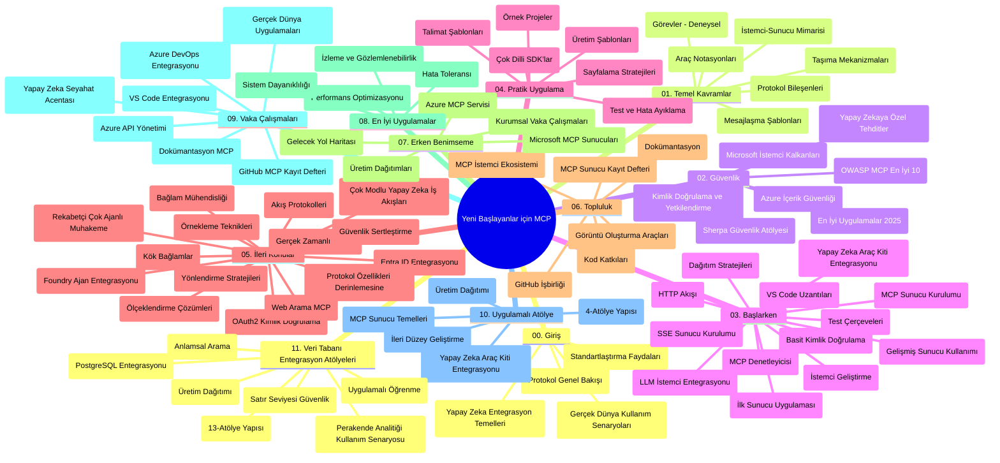

# Model Context Protocol (MCP) Yeni Başlayanlar için - Çalışma Rehberi

Bu çalışma rehberi, "Model Context Protocol (MCP) Yeni Başlayanlar için" müfredatının depo yapısı ve içeriği hakkında genel bir bakış sunar. Depoyu verimli bir şekilde gezmek ve mevcut kaynaklardan en iyi şekilde faydalanmak için bu rehberi kullanın.

## Depo Genel Bakış

Model Context Protocol (MCP), AI modelleri ile istemci uygulamalar arasındaki etkileşimler için standartlaştırılmış bir çerçevedir. İlk olarak Anthropic tarafından oluşturulan MCP, artık resmi GitHub organizasyonu aracılığıyla geniş MCP topluluğu tarafından sürdürülmektedir. Bu depo, AI geliştiricileri, sistem mimarları ve yazılım mühendisleri için tasarlanmış C#, Java, JavaScript, Python ve TypeScript dillerinde uygulamalı kod örnekleri içeren kapsamlı bir müfredat sağlar.

## Görsel Müfredat Haritası

## Depo Yapısı

Depo, MCP'nin farklı yönlerine odaklanan on bir ana bölüme ayrılmıştır:

1. **Giriş (00-Introduction/)**
   - Model Context Protocol genel bakışı
   - AI hattı içinde standardizasyonun önemi
   - Pratik kullanım örnekleri ve faydalar

2. **Temel Kavramlar (01-CoreConcepts/)**
   - İstemci-sunucu mimarisi
   - Ana protokol bileşenleri
   - MCP'deki mesajlaşma kalıpları

3. **Güvenlik (02-Security/)**
   - MCP tabanlı sistemlerde güvenlik tehditleri
   - Güvenli uygulamalar için en iyi uygulamalar
   - Kimlik doğrulama ve yetkilendirme stratejileri
   - **Kapsamlı Güvenlik Dokümantasyonu**:
     - MCP Güvenlik En İyi Uygulamaları 2025
     - Azure İçerik Güvenliği Uygulama Kılavuzu
     - MCP Güvenlik Kontrolleri ve Teknikleri
     - MCP En İyi Uygulamalar Hızlı Referans
   - **Ana Güvenlik Konuları**:
     - Prompt enjeksiyonu ve araç zehirleme saldırıları
     - Oturum kaçırma ve karışık temsilci sorunları
     - Token geçiş açıklıkları
     - Aşırı izinler ve erişim kontrolü
     - AI bileşenleri için tedarik zinciri güvenliği
     - Microsoft Prompt Shields entegrasyonu

4. **Başlarken (03-GettingStarted/)**
   - Ortam kurulumu ve yapılandırma
   - Temel MCP sunucuları ve istemcileri oluşturma
   - Mevcut uygulamalarla entegrasyon
   - İçerdiği bölümler:
     - İlk sunucu uygulaması
     - İstemci geliştirme
     - LLM istemci entegrasyonu
     - VS Code entegrasyonu
     - Server-Sent Events (SSE) sunucusu
     - İleri düzey sunucu kullanımı
     - HTTP akışı
     - AI Toolkit entegrasyonu
     - Test stratejileri
     - Dağıtım rehberi

5. **Pratik Uygulama (04-PracticalImplementation/)**
   - Farklı programlama dillerinde SDK kullanımı
   - Hata ayıklama, test ve doğrulama yöntemleri
   - Yeniden kullanılabilir prompt şablonları ve iş akışları hazırlama
   - Uygulama örnekleri içeren örnek projeler

6. **İleri Konular (05-AdvancedTopics/)**
   - Bağlam mühendisliği teknikleri
   - Foundry ajan entegrasyonu
   - Çok modlu AI iş akışları
   - OAuth2 kimlik doğrulama demoları
   - Gerçek zamanlı arama özellikleri
   - Gerçek zamanlı akış
   - Kök bağlamlar uygulaması
   - Yönlendirme stratejileri
   - Örnekleme teknikleri
   - Ölçeklendirme yöntemleri
   - Güvenlik hususları
   - Entra ID güvenlik entegrasyonu
   - Web arama entegrasyonu
   - Karşıt çok ajanlı akıl yürütme (tartışma kalıpları)

7. **Topluluk Katkıları (06-CommunityContributions/)**
   - Kod ve dokümantasyon katkısı nasıl yapılır
   - GitHub üzerinden iş birliği
   - Topluluk destekli geliştirmeler ve geri bildirimler
   - Farklı MCP istemcileri kullanımı (Claude Desktop, Cline, VSCode)
   - Popüler MCP sunucuları ile çalışma, görüntü üretimi dahil

8. **Erken Benimsemeden Dersler (07-LessonsfromEarlyAdoption/)**
   - Gerçek dünya uygulamaları ve başarı hikayeleri
   - MCP tabanlı çözümler oluşturma ve dağıtma
   - Trendler ve gelecek yol haritası
   - **Microsoft MCP Sunucuları Rehberi**: 10 üretime hazır Microsoft MCP sunucusunun kapsamlı rehberi:
     - Microsoft Learn Docs MCP Sunucusu
     - Azure MCP Sunucusu (15+ özel bağlayıcı)
     - GitHub MCP Sunucusu
     - Azure DevOps MCP Sunucusu
     - MarkItDown MCP Sunucusu
     - SQL Server MCP Sunucusu
     - Playwright MCP Sunucusu
     - Dev Box MCP Sunucusu
     - Microsoft Foundry MCP Sunucusu
     - Microsoft 365 Agents Toolkit MCP Sunucusu

9. **En İyi Uygulamalar (08-BestPractices/)**
   - Performans ayarlama ve optimizasyon
   - Hata toleranslı MCP sistemleri tasarımı
   - Test ve dayanıklılık stratejileri

10. **Vaka Çalışmaları (09-CaseStudy/)**
    - **Yedi kapsamlı vaka çalışması** ile MCP'nin çeşitli senaryolardaki çok yönlülüğü:
    - **Azure AI Seyahat Acenteleri**: Azure OpenAI ve AI Search ile çok ajanlı orkestrasyon
    - **Azure DevOps Entegrasyonu**: YouTube veri güncellemeleri ile iş akışı otomasyonu
    - **Gerçek Zamanlı Dokümantasyon Alma**: Python konsol istemcisi ile HTTP akışı
    - **Etkileşimli Çalışma Planı Oluşturucu**: Chainlit web uygulaması ile konuşmalı AI
    - **Düzenleyici İçi Dokümantasyon**: VS Code entegrasyonu ve GitHub Copilot iş akışları
    - **Azure API Yönetimi**: Kurumsal API entegrasyonu ile MCP sunucu oluşturma
    - **GitHub MCP Kayıt Defteri**: Ekosistem geliştirme ve ajan tabanlı entegrasyon platformu
    - Kurumsal entegrasyon, geliştirici üretkenliği ve ekosistem geliştirmeye yönelik uygulama örnekleri

11. **Uygulamalı Atölye (10-StreamliningAIWorkflowsBuildingAnMCPServerWithAIToolkit/)**
    - MCP ile AI Toolkit’i birleştiren kapsamlı uygulamalı atölye
    - AI modelleri ile gerçek dünya araçlarını köprüleyen akıllı uygulamalar inşa etme
    - Temel bilgiler, özel sunucu geliştirme ve üretim dağıtım stratejilerini kapsayan pratik modüller
    - **Atölye Yapısı**:
      - Lab 1: MCP Sunucu Temelleri
      - Lab 2: İleri MCP Sunucu Geliştirme
      - Lab 3: AI Toolkit Entegrasyonu
      - Lab 4: Üretim Dağıtımı ve Ölçeklendirme
    - Adım adım talimatlar içeren laboratuvar temelli öğrenme yöntemi

12. **MCP Sunucu Veri Tabanı Entegrasyon Laboratuvarları (11-MCPServerHandsOnLabs/)**
    - **PostgreSQL entegrasyonlu üretime hazır MCP sunucular oluşturma için kapsamlı 13 laboratuvarlı öğrenme yolu**
    - **Gerçek dünya perakende analitiği uygulaması**: Zava Retail kullanım senaryosu
    - **Kurumsal düzey desenler**: Satır Düzeyi Güvenlik (RLS), anlamsal arama, çok kiracılı veri erişimi
    - **Tam Laboratuvar Yapısı**:
      - **Lab 00-03: Temeller** - Giriş, Mimari, Güvenlik, Ortam Kurulumu
      - **Lab 04-06: MCP Sunucu Oluşturma** - Veri Tabanı Tasarımı, MCP Sunucu Uygulaması, Araç Geliştirme
      - **Lab 07-09: İleri Özellikler** - Anlamsal Arama, Test & Hata Ayıklama, VS Code Entegrasyonu
      - **Lab 10-12: Üretim & En İyi Uygulamalar** - Dağıtım, İzleme, Optimizasyon
    - **Kapsanan Teknolojiler**: FastMCP çerçevesi, PostgreSQL, Azure OpenAI, Azure Container Apps, Application Insights
    - **Öğrenme Çıktıları**: Üretime hazır MCP sunucular, veri tabanı entegrasyon desenleri, AI destekli analitik, kurumsal güvenlik

## Ek Kaynaklar

Depo destekleyici kaynaklar içerir:

- **Görseller klasörü**: Müfredat boyunca kullanılan diyagramlar ve görseller
- **Çeviriler**: Dokümantasyonun çoklu dil desteği ve otomatik çevirileri
- **Resmi MCP Kaynakları**:
  - [MCP Dokümantasyonu](https://modelcontextprotocol.io/)
  - [MCP Spesifikasyonu](https://spec.modelcontextprotocol.io/)
  - [MCP GitHub Deposu](https://github.com/modelcontextprotocol)

## Bu Depo Nasıl Kullanılır

1. **Sıralı Öğrenme**: Yapılandırılmış öğrenme için bölümleri sırayla (00'dan 11'e kadar) takip edin.
2. **Dil Bazlı Odaklanma**: Belirli bir programlama dili ilginizi çekiyorsa, tercihinize göre uygulamalar için örnek dizinlerini inceleyin.
3. **Pratik Uygulama**: Ortam kurulumunu yapmak ve ilk MCP sunucu ve istemcinizi oluşturmak için "Başlarken" bölümüne başlayın.
4. **İleri Düzey Keşif**: Temel bilgilere hakim olduktan sonra, bilginizi genişletmek için ileri konulara dalın.
5. **Topluluk Katılımı**: Uzmanlar ve diğer geliştiricilerle bağlantı kurmak için GitHub tartışmaları ve Discord kanalları aracılığıyla MCP topluluğuna katılın.

## MCP İstemcileri ve Araçları

Müfredat çeşitli MCP istemcileri ve araçlarını kapsar:

1. **Resmi İstemciler**:
   - Visual Studio Code
   - Visual Studio Code içindeki MCP
   - Claude Desktop
   - VSCode içindeki Claude
   - Claude API

2. **Topluluk İstemcileri**:
   - Cline (terminal tabanlı)
   - Cursor (kod editörü)
   - ChatMCP
   - Windsurf

3. **MCP Yönetim Araçları**:
   - MCP CLI
   - MCP Manager
   - MCP Linker
   - MCP Router

## Popüler MCP Sunucuları

Depo çeşitli MCP sunucularını tanıtır, bunlar arasında:

1. **Resmi Microsoft MCP Sunucuları**:
   - Microsoft Learn Docs MCP Sunucusu
   - Azure MCP Sunucusu (15+ özel bağlayıcı)
   - GitHub MCP Sunucusu
   - Azure DevOps MCP Sunucusu
   - MarkItDown MCP Sunucusu
   - SQL Server MCP Sunucusu
   - Playwright MCP Sunucusu
   - Dev Box MCP Sunucusu
   - Microsoft Foundry MCP Sunucusu
   - Microsoft 365 Agents Toolkit MCP Sunucusu

2. **Resmi Referans Sunucuları**:
   - Dosya Sistemi
   - Fetch
   - Bellek
   - Sıralı Düşünme

3. **Görüntü Üretimi**:
   - Azure OpenAI DALL-E 3
   - Stable Diffusion WebUI
   - Replicate

4. **Geliştirme Araçları**:
   - Git MCP
   - Terminal Kontrol
   - Kod Asistanı

5. **Özel Sunucular**:
   - Salesforce
   - Microsoft Teams
   - Jira & Confluence

## Katılım

Bu depo topluluktan gelen katkılara açıktır. MCP ekosistemine etkili katkı sağlama hakkında rehberlik için Topluluk Katkıları bölümüne bakınız.

----

*Bu çalışma rehberi son olarak 5 Şubat 2026'da güncellenmiş olup, en güncel MCP Spesifikasyonu 2025-11-25'i yansıtmakta ve o tarihteki depo genel görünümünü sunmaktadır. Depo içeriği bu tarihten sonra güncellenmiş olabilir.*

---

<!-- CO-OP TRANSLATOR DISCLAIMER START -->
**Feragatname**:
Bu belge, AI çeviri hizmeti [Co-op Translator](https://github.com/Azure/co-op-translator) kullanılarak çevrilmiştir. Doğruluk için çaba sarf etsek de, otomatik çevirilerin hata veya yanlışlık içerebileceğini lütfen unutmayınız. Orijinal belge, kendi dilinde yetkili kaynak olarak kabul edilmelidir. Kritik bilgiler için profesyonel insan çevirisi önerilir. Bu çevirinin kullanımı sonucu ortaya çıkabilecek yanlış anlamalardan veya yanlış yorumlamalardan sorumlu değiliz.
<!-- CO-OP TRANSLATOR DISCLAIMER END -->