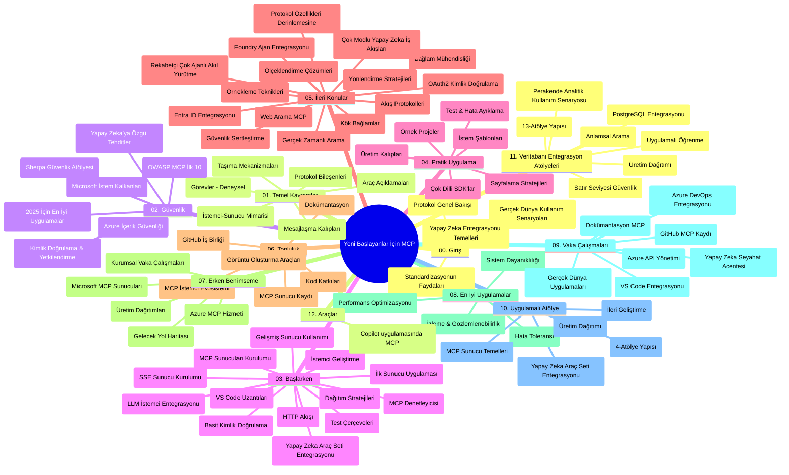

# Yeni Başlayanlar için Model Context Protocol (MCP) - Çalışma Rehberi

Bu çalışma rehberi, "Yeni Başlayanlar için Model Context Protocol (MCP)" müfredatının depo yapısı ve içeriğine genel bir bakış sunar. Depoyu verimli bir şekilde gezmek ve mevcut kaynaklardan en iyi şekilde yararlanmak için bu rehberi kullanın.

## Depo Genel Bakışı

Model Context Protocol (MCP), yapay zeka modelleri ile istemci uygulamaları arasındaki etkileşimler için standartlaştırılmış bir çerçevedir. Başlangıçta Anthropic tarafından oluşturulan MCP, şimdi resmi GitHub organizasyonu aracılığıyla daha geniş MCP topluluğu tarafından sürdürülmektedir. Bu depo, yapay zeka geliştiricileri, sistem mimarları ve yazılım mühendisleri için C#, Java, JavaScript, Python ve TypeScript dillerinde pratik kod örnekleriyle kapsamlı bir müfredat sağlar.

## Görsel Müfredat Haritası

## Depo Yapısı

Depo, MCP’nin farklı yönlerine odaklanan on iki ana bölüme ayrılmıştır:

1. **Giriş (00-Introduction/)**
   - Model Context Protocol'e genel bakış
   - Yapay zeka süreçlerinde standartlaşmanın önemi
   - Pratik kullanım senaryoları ve faydalar

2. **Temel Kavramlar (01-CoreConcepts/)**
   - İstemci-sunucu mimarisi
   - Temel protokol bileşenleri
   - MCP’de mesajlaşma kalıpları

3. **Güvenlik (02-Security/)**
   - MCP tabanlı sistemlerde güvenlik tehditleri
   - Uygulamaları güvence altına alma en iyi uygulamaları
   - Kimlik doğrulama ve yetkilendirme stratejileri
   - **Kapsamlı Güvenlik Belgeleri**:
     - MCP Güvenlik En İyi Uygulamaları 2025
     - Azure İçerik Güvenliği Uygulama Kılavuzu
     - MCP Güvenlik Kontrolleri ve Teknikleri
     - MCP En İyi Uygulamalar Hızlı Referans
   - **Ana Güvenlik Konuları**:
     - Prompt enjeksiyonu ve araç zehirleme saldırıları
     - Oturum kaçırma ve kafa karıştıran vekil sorunları
     - Token geçiş açıklıkları
     - Aşırı izinler ve erişim kontrolü
     - Yapay zeka bileşenleri için tedarik zinciri güvenliği
     - Microsoft Prompt Shields entegrasyonu

4. **Başlarken (03-GettingStarted/)**
   - Ortam kurulum ve yapılandırması
   - Temel MCP sunucu ve istemcilerinin oluşturulması
   - Mevcut uygulamalarla entegrasyon
   - İçerdiği bölümler:
     - İlk sunucu uygulaması
     - İstemci geliştirme
     - LLM istemci entegrasyonu
     - VS Code entegrasyonu
     - Server-Sent Events (SSE) sunucusu
     - İleri düzey sunucu kullanımı
     - HTTP akışı
     - AI Toolkit entegrasyonu
     - Test stratejileri
     - Dağıtım rehberi

5. **Pratik Uygulama (04-PracticalImplementation/)**
   - Farklı programlama dillerinde SDK kullanımı
   - Hata ayıklama, test etme ve doğrulama teknikleri
   - Yeniden kullanılabilir prompt şablonları ve iş akışları oluşturma
   - Uygulama örnekleri ile örnek projeler

6. **İleri Konular (05-AdvancedTopics/)**
   - Bağlam mühendisliği teknikleri
   - Foundry ajan entegrasyonu
   - Çok modlu yapay zeka iş akışları
   - OAuth2 kimlik doğrulama örnekleri
   - Gerçek zamanlı arama yetenekleri
   - Gerçek zamanlı akış
   - Kök bağlam uygulamaları
   - Yönlendirme stratejileri
   - Örnekleme teknikleri
   - Ölçeklendirme yaklaşımları
   - Güvenlik hususları
   - Entra ID güvenlik entegrasyonu
   - Web araması entegrasyonu
   - Karşıt çoklu ajan akıl yürütme (tartışma kalıpları)

7. **Topluluk Katkıları (06-CommunityContributions/)**
   - Kod ve dokümantasyon katkıları nasıl yapılır
   - GitHub üzerinden işbirliği yapma
   - Topluluk odaklı geliştirmeler ve geri bildirimler
   - Çeşitli MCP istemcilerini kullanma (Claude Desktop, Cline, VSCode)
   - Popüler MCP sunucularla çalışma, görüntü oluşturma dahil

8. **Erken Benimsemeden Dersler (07-LessonsfromEarlyAdoption/)**
   - Gerçek dünya uygulamaları ve başarı hikayeleri
   - MCP tabanlı çözümler oluşturma ve dağıtma
   - Trendler ve gelecek yol haritası
   - **Microsoft MCP Sunucuları Rehberi**: 10 üretime hazır Microsoft MCP sunucusunun kapsamlı rehberi:
     - Microsoft Learn Docs MCP Sunucusu
     - Azure MCP Sunucusu (15+ özel bağlayıcı)
     - GitHub MCP Sunucusu
     - Azure DevOps MCP Sunucusu
     - MarkItDown MCP Sunucusu
     - SQL Server MCP Sunucusu
     - Playwright MCP Sunucusu
     - Dev Box MCP Sunucusu
     - Microsoft Foundry MCP Sunucusu
     - Microsoft 365 Agents Toolkit MCP Sunucusu

9. **En İyi Uygulamalar (08-BestPractices/)**
   - Performans ayarlama ve optimizasyon
   - Hata toleranslı MCP sistemleri tasarlama
   - Test ve dayanıklılık stratejileri

10. **Vaka Çalışmaları (09-CaseStudy/)**
    - MCP’nin çok çeşitli senaryolardaki uyarlanabilirliğini gösteren **yedi kapsamlı vaka çalışması**:
    - **Azure AI Seyahat Acenteleri**: Azure OpenAI ve AI Search ile çoklu ajan orkestrasyonu
    - **Azure DevOps Entegrasyonu**: YouTube veri güncellemeleri ile iş akışı otomasyonu
    - **Gerçek Zamanlı Dokümantasyon Erişimi**: Streaming HTTP ile Python konsol istemcisi
    - **Etkileşimli Çalışma Planı Oluşturucu**: Chainlit web uygulaması ve konuşmalı yapay zeka
    - **Düzenleyici İçi Dokümantasyon**: GitHub Copilot iş akışlarıyla VS Code entegrasyonu
    - **Azure API Yönetimi**: Kurumsal API entegrasyonu ve MCP sunucusu oluşturma
    - **GitHub MCP Kayıt Defteri**: Ekosistem geliştirme ve ajan entegrasyon platformu
    - Kurumsal entegrasyon, geliştirici üretkenliği ve ekosistem geliştirme alanlarında uygulama örnekleri

11. **Uygulamalı Atölye (10-StreamliningAIWorkflowsBuildingAnMCPServerWithAIToolkit/)**
    - MCP ile AI Toolkit’i birleştiren kapsamlı uygulamalı atölye
    - Yapay zeka modelleri ile gerçek dünya araçları arasında akıllı uygulamalar oluşturma
    - Temellerden özel sunucu geliştirme ve üretim dağıtım stratejilerine kadar pratik modüller
    - **Atölye Yapısı**:
      - Atölye 1: MCP Sunucu Temelleri
      - Atölye 2: İleri MCP Sunucu Geliştirme
      - Atölye 3: AI Toolkit Entegrasyonu
      - Atölye 4: Üretim Dağıtımı ve Ölçeklendirme
    - Adım adım talimatlarla laboratuvar tabanlı öğrenme yaklaşımı

12. **MCP Sunucu Veritabanı Entegrasyon Atölyeleri (11-MCPServerHandsOnLabs/)**
    - PostgreSQL entegrasyonlu üretime hazır MCP sunucuları oluşturmak için **kapsamlı 13 atölye öğrenme yolu**
    - Zava Retail kullanım örneği ile gerçek dünya perakende analiz uygulaması
    - Satır Düzeyi Güvenlik (RLS), anlamsal arama ve çok kiracılı veri erişimi dahil kurumsal sınıf desenler
    - **Tam Atölye Yapısı**:
      - **Atölyeler 00-03: Temeller** - Giriş, Mimari, Güvenlik, Ortam Kurulumu
      - **Atölyeler 04-06: MCP Sunucu İnşası** - Veritabanı Tasarımı, MCP Sunucu Uygulaması, Araç Geliştirme
      - **Atölyeler 07-09: İleri Özellikler** - Anlamsal Arama, Test & Hata Ayıklama, VS Code Entegrasyonu
      - **Atölyeler 10-12: Üretim & En İyi Uygulamalar** - Dağıtım, İzleme, Optimizasyon
    - **Kapsanan Teknolojiler**: FastMCP framework, PostgreSQL, Azure OpenAI, Azure Container Apps, Application Insights
    - **Öğrenim Kazanımları**: Üretime hazır MCP sunucuları, veritabanı entegrasyon desenleri, yapay zeka destekli analizler, kurumsal güvenlik

13. **Araçlar (12-tooling/)**
    - MCP’yi Copilot uygulaması ve diğer araçlarda nasıl kullanacağınızı öğrenin

## Ek Kaynaklar

Depo destekleyici kaynaklar içerir:

- **Images klasörü**: Müfredat boyunca kullanılan diyagramlar ve çizimler
- **Çeviriler**: Dokümantasyonun otomatik çok dilli çevirileri
- **Resmi MCP Kaynakları**:
  - [MCP Documentation](https://modelcontextprotocol.io/)
  - [MCP Specification](https://spec.modelcontextprotocol.io/)
  - [MCP GitHub Repository](https://github.com/modelcontextprotocol)

## Bu Depoyu Nasıl Kullanmalı

1. **Sıralı Öğrenme**: Yapılandırılmış bir öğrenme deneyimi için bölümleri sırasıyla (00’dan 11’e kadar) takip edin.
2. **Dil Bazlı Odaklanma**: Belirli bir programlama diliyle ilgileniyorsanız, tercih ettiğiniz dili içeren örnek dizinlere göz atın.
3. **Pratik Uygulama**: Ortamınızı kurmak ve ilk MCP sunucu ile istemcinizi oluşturmak için “Başlarken” bölümüne başlayın.
4. **İleri Düzey Keşif**: Temeller rahat hale geldikten sonra, bilgilerinizi genişletmek için ileri konulara dalın.
5. **Topluluk Katılımı**: MCP topluluğuna GitHub tartışmaları ve Discord kanalları aracılığıyla katılarak uzmanlar ve diğer geliştiricilerle bağlanın.

## MCP İstemcileri ve Araçları

Müfredat çeşitli MCP istemcileri ve araçlarını kapsar:

1. **Resmi İstemciler**:
   - Visual Studio Code
   - Visual Studio Code içindeki MCP
   - Claude Desktop
   - VSCode’daki Claude
   - Claude API

2. **Topluluk İstemcileri**:
   - Cline (terminal tabanlı)
   - Cursor (kod editörü)
   - ChatMCP
   - Windsurf

3. **MCP Yönetim Araçları**:
   - MCP CLI
   - MCP Manager
   - MCP Linker
   - MCP Router

## Popüler MCP Sunucuları

Depoda çeşitli MCP sunucuları tanıtılmaktadır:

1. **Resmi Microsoft MCP Sunucuları**:
   - Microsoft Learn Docs MCP Sunucusu
   - Azure MCP Sunucusu (15+ özel bağlayıcı)
   - GitHub MCP Sunucusu
   - Azure DevOps MCP Sunucusu
   - MarkItDown MCP Sunucusu
   - SQL Server MCP Sunucusu
   - Playwright MCP Sunucusu
   - Dev Box MCP Sunucusu
   - Microsoft Foundry MCP Sunucusu
   - Microsoft 365 Agents Toolkit MCP Sunucusu

2. **Resmi Referans Sunucuları**:
   - Filesystem
   - Fetch
   - Memory
   - Sequential Thinking

3. **Görüntü Üretimi**:
   - Azure OpenAI DALL-E 3
   - Stable Diffusion WebUI
   - Replicate

4. **Geliştirme Araçları**:
   - Git MCP
   - Terminal Control
   - Code Assistant

5. **Özel Sunucular**:
   - Salesforce
   - Microsoft Teams
   - Jira & Confluence

## Katkıda Bulunma

Bu depo, topluluktan katkıları memnuniyetle karşılar. MCP ekosistemine etkili katkı sağlama rehberi için Topluluk Katkıları bölümüne bakınız.

----

*Bu çalışma rehberi en son 5 Şubat 2026 tarihinde güncellenmiş olup, MCP Specification 2025-11-25 en son sürümünü yansıtmakta ve depo içeriğine o tarihte genel bir bakış sağlamaktadır. Depo içeriği bu tarihten sonra güncellenebilir.*

---

<!-- CO-OP TRANSLATOR DISCLAIMER START -->
**Feragatname**:
Bu belge, AI çeviri hizmeti [Co-op Translator](https://github.com/Azure/co-op-translator) kullanılarak çevrilmiştir. Doğruluk için çaba sarf etsek de, otomatik çevirilerin hata veya yanlışlık içerebileceğini lütfen unutmayınız. Orijinal belge, kendi dilinde yetkili kaynak olarak kabul edilmelidir. Kritik bilgiler için profesyonel insan çevirisi önerilir. Bu çevirinin kullanımı sonucu ortaya çıkabilecek yanlış anlamalardan veya yanlış yorumlamalardan sorumlu değiliz.
<!-- CO-OP TRANSLATOR DISCLAIMER END -->