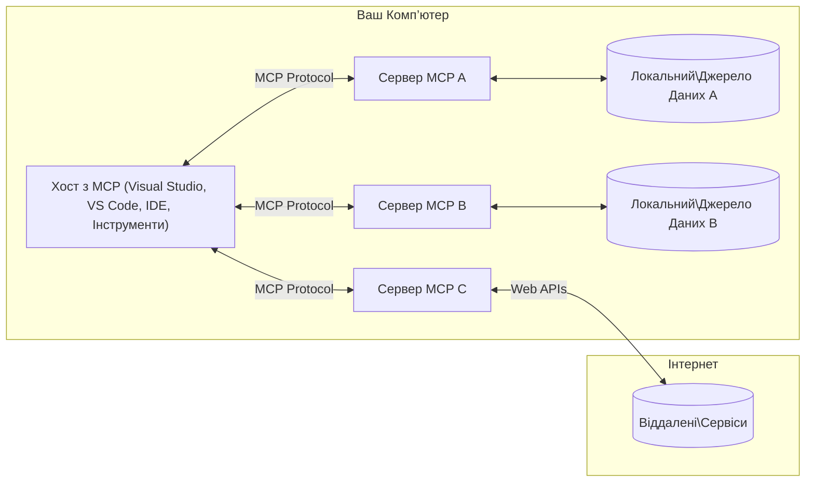

# Основні концепції MCP: Майстерність протоколу контексту моделі для інтеграції ШІ

[](https://youtu.be/earDzWGtE84)

_(Натисніть на зображення вище, щоб переглянути відео цього уроку)_

[Протокол контексту моделі (MCP)](https://github.com/modelcontextprotocol) — це потужна, стандартизована структура, яка оптимізує комунікацію між великими мовними моделями (LLM) та зовнішніми інструментами, додатками і джерелами даних. 
Цей посібник проведе вас через основні концепції MCP. Ви дізнаєтесь про його архітектуру клієнт-сервер, основні компоненти, механіку комунікації та кращі практики впровадження.

- **Явна згода користувача**: Увесь доступ до даних та операцій потребує явного схвалення користувача перед виконанням. Користувачі повинні чітко розуміти, які дані будуть доступні та які дії будуть виконані, із детальним контролем над правами доступу та авторизаціями.

- **Захист конфіденційності даних**: Дані користувача відкриваються лише за явної згоди і мають захищатися надійними механізмами контролю доступу протягом усього життєвого циклу взаємодії. Впровадження повинні запобігати несанкціонованій передачі даних і підтримувати суворі межі конфіденційності.

- **Безпека виконання інструментів**: Кожен виклик інструменту потребує явної згоди користувача з чітким розумінням функціоналу інструменту, параметрів та можливого впливу. Надійні межі безпеки повинні запобігати небажаному, небезпечному або шкідливому виконанню інструментів.

- **Безпека транспортного рівня**: Усі канали комунікації повинні використовувати відповідне шифрування та механізми автентифікації. Віддалені з’єднання повинні впроваджувати безпечні протоколи транспорту та належне керування обліковими даними.

#### Рекомендації з впровадження:

- **Управління правами доступу**: Впроваджуйте тонкі системи контролю доступу, які дозволяють користувачам контролювати, які сервери, інструменти та ресурси доступні
- **Аутентифікація та авторизація**: Використовуйте безпечні методи аутентифікації (OAuth, API ключі) із належним управлінням токенами та термінами їх дії  
- **Перевірка вхідних даних**: Перевіряйте всі параметри та вхідні дані згідно з визначеними схемами для запобігання ін’єкційних атак
- **Аудит журналів**: Підтримуйте повні логи усіх операцій для моніторингу безпеки та відповідності вимогам

## Огляд

Цей урок розглядає фундаментальну архітектуру та компоненти екосистеми Протоколу контексту моделі (MCP). Ви дізнаєтесь про клієнт-серверну архітектуру, ключові компоненти та механізми комунікації, які забезпечують взаємодії MCP.

## Основні навчальні цілі

До кінця цього уроку ви:

- Зрозумієте клієнт-серверну архітектуру MCP.
- Визначите ролі та обов’язки хостів, клієнтів і серверів.
- Проаналізуєте основні функції, які роблять MCP гнучким рівнем інтеграції.
- Дізнаєтесь, як здійснюється потік інформації в екосистемі MCP.
- Отримаєте практичний досвід через приклади коду на .NET, Java, Python і JavaScript.

## Архітектура MCP: детальніший погляд

Екосистема MCP побудована на моделі клієнт-сервер. Ця модульна структура дозволяє AI-додаткам ефективно взаємодіяти з інструментами, базами даних, API та контекстуальними ресурсами. Розглянемо цю архітектуру з точки зору її основних компонентів.

В основі MCP лежить клієнт-серверна архітектура, де хост-додаток може підключатися до кількох серверів:


- **MCP Hosts**: Програми на кшталт VSCode, Claude Desktop, IDE або AI-інструменти, що прагнуть отримати доступ до даних через MCP
- **MCP Clients**: Клієнти протоколу, які підтримують 1:1 з'єднання з серверами
- **MCP Servers**: Легковагові програми, які пропонують конкретні можливості через стандартизований Протокол контексту моделі
- **Локальні джерела даних**: Файли, бази даних та сервіси вашого комп’ютера, до яких MCP-сервери можуть безпечно отримувати доступ
- **Віддалені сервіси**: Зовнішні системи, доступні через інтернет, з якими MCP-сервери можуть підключатися через API.

Протокол MCP – це стандарт, що розвивається, з версіонуванням за датою (формат РРРР-ММ-ДД). Поточна версія протоколу — **2025-11-25**. Ви можете переглянути останні оновлення у [специфікації протоколу](https://modelcontextprotocol.io/specification/2025-11-25/).

### 1. Хости

У Протоколі контексту моделі (MCP) **хости** — це AI-додатки, які служать основним інтерфейсом, через який користувачі взаємодіють із протоколом. Хости координують і керують з’єднаннями з кількома MCP-серверами, створюючи спеціальні клієнти MCP для кожного серверного з’єднання. Прикладами хостів є:

- **AI-додатки**: Claude Desktop, Visual Studio Code, Claude Code
- **Середовища розробки**: IDE та редактори коду з інтеграцією MCP  
- **Кастомні додатки**: Спеціалізовані AI-агенти та інструменти

**Хости** — це додатки, що координують взаємодію з AI-моделями. Вони:

- **Оркеструють AI-моделі**: Виконують або взаємодіють з LLM для генерації відповідей та координації AI-процесів
- **Керують клієнтськими з’єднаннями**: Створюють і підтримують одного клієнта MCP на кожне серверне з’єднання MCP
- **Контролюють користувацький інтерфейс**: Обробляють потік розмов, взаємодію з користувачем та подання відповідей  
- **Забезпечують безпеку**: Контролюють права, безпекові обмеження та автентифікацію
- **Обробляють згоду користувача**: Керують затвердженням користувача для спільного використання даних та виконання інструментів


### 2. Клієнти

**Клієнти** — це ключові компоненти, які підтримують спеціалізовані з’єднання один-до-одного між хостами та MCP-серверами. Кожен клієнт MCP створюється хостом для підключення до конкретного MCP-сервера, забезпечуючи організовані та безпечні канали комунікації. Кілька клієнтів дозволяють хостам підключатись до кількох серверів одночасно.

**Клієнти** — це компоненти-з’єднувачі в межах хост-додатка. Вони:

- **Комунікація протоколом**: Надсилають запити JSON-RPC 2.0 до серверів із підказками та інструкціями
- **Узгодження можливостей**: Узгоджують підтримувані функції та версії протоколу з серверами під час ініціалізації
- **Виконання інструментів**: Керують запитами на виконання інструментів від моделей та обробляють відповіді
- **Оновлення в реальному часі**: Обробляють повідомлення та оновлення в реальному часі від серверів
- **Обробка відповідей**: Обробляють і форматують відповіді серверів для відображення користувачам

### 3. Сервери

**Сервери** — це програми, що надають контекст, інструменти та можливості клієнтам MCP. Вони можуть виконуватися локально (на тій же машині, що й хост) або віддалено (на зовнішніх платформах) та відповідають за обробку запитів клієнтів і надання структурованих відповідей. Сервери відкривають конкретну функціональність через стандартизований Протокол контексту моделі.

**Сервери** — це сервіси, що надають контекст і можливості. Вони:

- **Реєстрація функцій**: Реєструють і відкривають доступні примітиви (ресурси, підказки, інструменти) для клієнтів
- **Обробка запитів**: Отримують і виконують виклики інструментів, запити ресурсів і підказок від клієнтів
- **Надання контексту**: Забезпечують контекстну інформацію та дані для покращення відповідей моделей
- **Управління станом**: Підтримують стан сесії та обробляють станозалежні взаємодії за потреби
- **Сповіщення в реальному часі**: Надсилають повідомлення про зміни можливостей та оновлення підключеним клієнтам

Сервери можуть розроблятися будь-ким для розширення можливостей моделей спеціалізованою функціональністю і підтримують як локальне, так і віддалене розгортання.

### 4. Серверні примітиви

Сервери в Протоколі контексту моделі (MCP) надають три основні **примітиви**, які визначають базові будівельні блоки для насиченої взаємодії між клієнтами, хостами та мовними моделями. Ці примітиви визначають типи контекстної інформації та дій, які доступні через протокол.

MCP-сервери можуть відкривати будь-яку комбінацію з трьох основних примітивів:

#### Ресурси

**Ресурси** — це джерела даних, які надають контекстну інформацію AI-додаткам. Вони представляють статичний або динамічний контент, який може покращувати розуміння моделі та прийняття рішень:

- **Контекстні дані**: Структурована інформація та контекст для споживання AI-моделлю
- **Бази знань**: Репозиторії документів, статті, посібники та наукові роботи
- **Локальні джерела даних**: Файли, бази даних і інформація локальної системи  
- **Зовнішні дані**: Відповіді API, вебсервіси та дані віддалених систем
- **Динамічний контент**: Дані в реальному часі, що оновлюються залежно від зовнішніх умов

Ресурси ідентифікуються URI та підтримують пошук через методи `resources/list` і отримання через `resources/read`:

```text
file://documents/project-spec.md
database://production/users/schema
api://weather/current
```

#### Підказки

**Підказки** — це шаблони, які допомагають структурувати взаємодію з мовними моделями. Вони надають стандартизовані шаблони взаємодії та шаблонні робочі процеси:

- **Взаємодії на основі шаблонів**: Попередньо структуровані повідомлення та вступні фрази для розмов
- **Шаблони робочих процесів**: Стандартизовані послідовності для типових завдань та взаємодій
- **Приклади з невеликою кількістю кроків**: Прикладні шаблони для інструкцій моделі
- **Системні підказки**: Базові підказки, які визначають поведінку та контекст моделі
- **Динамічні шаблони**: Параметризовані підказки, що адаптуються до конкретного контексту

Підказки підтримують заміну змінних і можуть бути знайдені через `prompts/list` та отримані через `prompts/get`:

```markdown
Generate a {{task_type}} for {{product}} targeting {{audience}} with the following requirements: {{requirements}}
```

#### Інструменти

**Інструменти** — це виконувані функції, які модель ШІ може викликати для виконання конкретних дій. Вони є «дієсловами» екосистеми MCP, що дозволяють моделям взаємодіяти із зовнішніми системами:

- **Виконувані функції**: Окремі операції, які моделі можуть викликати із конкретними параметрами
- **Інтеграція із зовнішніми системами**: Виклики API, запити до баз даних, операції з файлами, обчислення
- **Унікальна ідентичність**: Кожен інструмент має унікальну назву, опис та схему параметрів
- **Структурований ввід/вивід**: Інструменти приймають перевірені параметри і повертають структуровані, типізовані відповіді
- **Можливості дій**: Дозволяють моделям виконувати реальні дії та отримувати актуальні дані

Інструменти визначаються за допомогою JSON Schema для валідації параметрів, знаходяться через `tools/list` і виконуються через `tools/call`. Інструменти можуть також містити **іконки** як додаткові метадані для кращої презентації у UI.

**Анотації інструментів**: Інструменти підтримують анотації поведінки (наприклад, `readOnlyHint`, `destructiveHint`), які описують, чи є інструмент лише для читання або руйнівним, допомагаючи клієнтам приймати обґрунтовані рішення щодо виконання.

Приклад визначення інструменту:

```typescript
server.tool(
  "search_products", 
  {
    query: z.string().describe("Search query for products"),
    category: z.string().optional().describe("Product category filter"),
    max_results: z.number().default(10).describe("Maximum results to return")
  }, 
  async (params) => {
    // Виконати пошук і повернути структуровані результати
    return await productService.search(params);
  }
);
```

## Клієнтські примітиви

У Протоколі контексту моделі (MCP) **клієнти** можуть відкривати примітиви, які дозволяють серверам робити додаткові запити до хост-додатка. Ці клієнтські примітиви дають змогу створювати багатші, інтерактивніші серверні реалізації, які можуть отримувати доступ до можливостей AI-моделі і взаємодій користувача.

### Семплінг

**Семплінг** дозволяє серверам запитувати доповнення мовної моделі з AI-додатку клієнта. Цей примітив дає змогу серверам отримувати можливості LLM без вбудовування їх власних залежностей моделей:

- **Незалежний від моделі доступ**: Сервери можуть запитувати доповнення без включення SDK LLM або управління доступом до моделі
- **Ініційована сервером AI**: Дозволяє серверам автономно генерувати контент, використовуючи модель клієнта
- **Рекурсивна взаємодія з LLM**: Підтримка складних сценаріїв, де серверам потрібна допомога AI для обробки
- **Динамічне створення контенту**: Дозволяє серверам створювати контекстуальні відповіді, використовуючи модель хоста
- **Підтримка виклику інструментів**: Сервери можуть включати параметри `tools` та `toolChoice`, щоб дозволити моделі клієнта викликати інструменти під час семплінгу

Семплінг ініціюється через метод `sampling/complete`, де сервери надсилають клієнтам запити на доповнення.

### Корені

**Корені** забезпечують стандартизований спосіб для клієнтів відкривати межі файлової системи для серверів, допомагаючи серверам розуміти, до яких директорій і файлів вони мають доступ:

- **Межі файлової системи**: Визначають, де сервери можуть працювати в межах файлової системи
- **Контроль доступу**: Допомагають серверам зрозуміти, до яких директорій і файлів вони мають дозвіл на доступ
- **Динамічні оновлення**: Клієнти можуть сповіщати сервери, коли список коренів змінюється
- **Ідентифікація на основі URI**: Корені використовують URI типу `file://` для позначення доступних директорій і файлів

Корені знаходяться за допомогою методу `roots/list`, при цьому клієнти надсилають `notifications/roots/list_changed`, коли корені змінюються.

### Витягування даних (Elicitation)

**Витягування даних** дозволяє серверам запитувати у користувачів додаткову інформацію або підтвердження через інтерфейс клієнта:

- **Запити введення користувача**: Сервери можуть просити додаткову інформацію, необхідну для виконання інструментів
- **Діалоги підтвердження**: Запитуть схвалення користувача для чутливих або важливих операцій
- **Інтерактивні робочі процеси**: Дозволяють створювати поетапні взаємодії з користувачем
- **Динамічний збір параметрів**: Збір відсутніх або необов’язкових параметрів під час виконання інструменту

Запити на витягування здійснюються за методом `elicitation/request` для збору введення користувача через інтерфейс клієнта.

**Витягування в режимі URL**: Сервери також можуть запитувати взаємодію користувача через URL, направляючи користувачів на зовнішні веб-сторінки для автентифікації, підтвердження або введення даних.

### Логування

**Логування** дозволяє серверам надсилати структуровані повідомлення журналу клієнтам для відлагодження, моніторингу та операційної прозорості:

- **Підтримка відлагодження**: Дозволяє серверам надавати детальні журнали виконання для усунення неполадок
- **Оперативний моніторинг**: Надсилання оновлень стану та метрик продуктивності клієнтам
- **Звітність про помилки**: Надає детальний контекст помилок і діагностичну інформацію
- **Аудиторські сліди**: Створення повних журналів операцій та рішень серверів

Повідомлення логів надсилаються клієнтам для прозорості операцій серверів та полегшення відлагодження.

## Потік інформації в MCP

Протокол контексту моделі (MCP) визначає структурований потік інформації між хостами, клієнтами, серверами та моделями. Розуміння цього потоку допомагає прояснити, як обробляються запити користувачів і як зовнішні інструменти та дані інтегруються у відповіді моделей.
- **Хост ініціює підключення**  
  Хост-додаток (наприклад, IDE або чат-інтерфейс) встановлює з’єднання з MCP-сервером, зазвичай через STDIO, WebSocket або інший підтримуваний транспорт.

- **Обмін можливостями**  
  Клієнт (вбудований у хост) і сервер обмінюються інформацією про підтримувані функції, інструменти, ресурси та версії протоколу. Це гарантує, що обидві сторони розуміють, які можливості доступні під час сесії.

- **Запит користувача**  
  Користувач взаємодіє з хостом (наприклад, вводить запит або команду). Хост збирає цей ввід і передає його клієнту для обробки.

- **Використання ресурсів або інструментів**  
  - Клієнт може запросити додатковий контекст або ресурси від сервера (наприклад, файли, записи бази даних або статті з бази знань) для збагачення розуміння моделі.
  - Якщо модель вважає, що потрібен інструмент (наприклад, для отримання даних, виконання обчислення або виклику API), клієнт надсилає серверу запит на виклик інструменту, вказуючи назву інструменту та параметри.

- **Виконання на сервері**  
  Сервер отримує запит на ресурс або інструмент, виконує необхідні операції (наприклад, викликає функцію, робить запит до бази даних або отримує файл) і повертає результати клієнту у структурованому форматі.

- **Генерація відповіді**  
  Клієнт інтегрує відповіді сервера (дані ресурсів, результати інструментів тощо) у поточну взаємодію з моделлю. Модель використовує цю інформацію для створення повної та контекстно релевантної відповіді.

- **Представлення результату**  
  Хост отримує фінальний результат від клієнта і відображає його користувачу, часто включаючи як текст, створений моделлю, так і результати виконання інструментів або отримання ресурсів.

Цей потік дозволяє MCP підтримувати розвинені, інтерактивні та контекстно-залежні AI-додатки шляхом безшовного підключення моделей до зовнішніх інструментів і джерел даних.

## Архітектура протоколу та шари

MCP складається з двох окремих архітектурних шарів, які працюють разом для забезпечення повного комунікаційного каркасу:

### Шар даних

**Шар даних** реалізує основний протокол MCP, використовуючи як основу **JSON-RPC 2.0**. Цей шар визначає структуру повідомлень, семантику та патерни взаємодії:

#### Основні компоненти:

- **Протокол JSON-RPC 2.0**: Всі комунікації використовують стандартизований формат повідомлень JSON-RPC 2.0 для викликів методів, відповідей і сповіщень
- **Управління життєвим циклом**: Обробляє ініціалізацію з’єднання, обмін можливостями та завершення сесії між клієнтами і серверами
- **Примітиви сервера**: Дозволяють серверам надавати основний функціонал через інструменти, ресурси та запити (prompt)
- **Примітиви клієнта**: Дозволяють серверам запитувати семплування від LLM, отримувати ввід від користувача і надсилати лог-повідомлення
- **Сповіщення в реальному часі**: Підтримка асинхронних сповіщень для динамічних оновлень без опитування

#### Ключові особливості:

- **Обмін версіями протоколу**: Використовує версіонування на основі дати (ФРРР-ММ-ДД) для забезпечення сумісності
- **Виявлення функціональності**: Клієнти і сервери обмінюються інформацією про підтримувані функції під час ініціалізації
- **Сесії збереження стану**: Підтримує стан з’єднання між багатьма взаємодіями для забезпечення безперервності контексту

### Транспортний шар

**Транспортний шар** управляє комунікаційними каналами, кадруванням повідомлень і автентифікацією між учасниками MCP:

#### Підтримувані механізми транспорту:

1. **STDIO Транспорт**:
   - Використовує стандартні потоки вводу/виводу для прямої комунікації процесів
   - Оптимальний для локальних процесів на одній машині без мережевого навантаження
   - Часто використовується для локальних реалізацій MCP серверів

2. **Потоковий HTTP транспорт**:
   - Використовує HTTP POST для повідомлень клієнт-сервер  
   - Опційні Server-Sent Events (SSE) для потокової передачі від сервера до клієнта
   - Дозволяє віддалену комунікацію між серверами через мережі
   - Підтримує стандартну HTTP автентифікацію (токени доступу, API ключі, користувацькі заголовки)
   - MCP рекомендує OAuth для безпечної автентифікації на основі токенів

#### Абстракція транспорту:

Транспортний шар абстрагує деталі комунікації від шару даних, дозволяючи використовувати однаковий формат повідомлень JSON-RPC 2.0 для всіх транспортних механізмів. Ця абстракція дозволяє застосункам безшовно переключатися між локальними та віддаленими серверами.

### Розгляд безпеки

Реалізації MCP повинні дотримуватися кількох критичних принципів безпеки для забезпечення безпечної, надійної та захищеної взаємодії у всіх операціях протоколу:

- **Згода і контроль користувача**: Користувачі повинні надавати явну згоду перед отриманням доступу до даних або виконанням операцій. Вони мають чітко контролювати, які дані спільні і які дії авторизовані, підтримувані інтуїтивними інтерфейсами для перегляду і схвалення активностей.

- **Конфіденційність даних**: Дані користувача повинні розкриватися лише за явною згодою і захищатися відповідними механізмами контролю доступу. Реалізації MCP повинні запобігати несанкціонованій передачі даних і гарантувати конфіденційність у всіх взаємодіях.

- **Безпека інструментів**: Перед викликом будь-якого інструменту потрібна явна згода користувача. Користувачам має бути зрозуміло функціонування кожного інструменту, а також повинні застосовуватися надійні межі безпеки для запобігання небажаному або небезпечному виконанню.

Дотримуючись цих принципів безпеки, MCP забезпечує довіру, конфіденційність і безпеку користувачів у всіх взаємодіях протоколу, одночасно дозволяючи потужні інтеграції штучного інтелекту.

## Приклади коду: ключові компоненти

Нижче наведено приклади коду на кількох популярних мовах програмування, які ілюструють, як реалізувати основні компоненти MCP серверів та інструменти.

### Приклад .NET: Створення простого MCP сервера з інструментами

Ось практичний приклад коду .NET, який демонструє, як реалізувати простий MCP сервер з власними інструментами. Цей приклад показує, як визначати і реєструвати інструменти, обробляти запити і підключати сервер за допомогою Model Context Protocol.

```csharp
using System;
using System.Threading.Tasks;
using ModelContextProtocol.Server;
using ModelContextProtocol.Server.Transport;
using ModelContextProtocol.Server.Tools;

public class WeatherServer
{
    public static async Task Main(string[] args)
    {
        // Create an MCP server
        var server = new McpServer(
            name: "Weather MCP Server",
            version: "1.0.0"
        );
        
        // Register our custom weather tool
        server.AddTool<string, WeatherData>("weatherTool", 
            description: "Gets current weather for a location",
            execute: async (location) => {
                // Call weather API (simplified)
                var weatherData = await GetWeatherDataAsync(location);
                return weatherData;
            });
        
        // Connect the server using stdio transport
        var transport = new StdioServerTransport();
        await server.ConnectAsync(transport);
        
        Console.WriteLine("Weather MCP Server started");
        
        // Keep the server running until process is terminated
        await Task.Delay(-1);
    }
    
    private static async Task<WeatherData> GetWeatherDataAsync(string location)
    {
        // This would normally call a weather API
        // Simplified for demonstration
        await Task.Delay(100); // Simulate API call
        return new WeatherData { 
            Temperature = 72.5,
            Conditions = "Sunny",
            Location = location
        };
    }
}

public class WeatherData
{
    public double Temperature { get; set; }
    public string Conditions { get; set; }
    public string Location { get; set; }
}
```

### Приклад Java: Компоненти MCP сервера

Цей приклад демонструє той же MCP сервер і реєстрацію інструментів, що й приклад вище на .NET, але реалізований на Java.

```java
import io.modelcontextprotocol.server.McpServer;
import io.modelcontextprotocol.server.McpToolDefinition;
import io.modelcontextprotocol.server.transport.StdioServerTransport;
import io.modelcontextprotocol.server.tool.ToolExecutionContext;
import io.modelcontextprotocol.server.tool.ToolResponse;

public class WeatherMcpServer {
    public static void main(String[] args) throws Exception {
        // Створити MCP сервер
        McpServer server = McpServer.builder()
            .name("Weather MCP Server")
            .version("1.0.0")
            .build();
            
        // Зареєструвати інструмент для погоди
        server.registerTool(McpToolDefinition.builder("weatherTool")
            .description("Gets current weather for a location")
            .parameter("location", String.class)
            .execute((ToolExecutionContext ctx) -> {
                String location = ctx.getParameter("location", String.class);
                
                // Отримати дані про погоду (спрощено)
                WeatherData data = getWeatherData(location);
                
                // Повернути відформатовану відповідь
                return ToolResponse.content(
                    String.format("Temperature: %.1f°F, Conditions: %s, Location: %s", 
                    data.getTemperature(), 
                    data.getConditions(), 
                    data.getLocation())
                );
            })
            .build());
        
        // Підключити сервер, використовуючи stdio транспорт
        try (StdioServerTransport transport = new StdioServerTransport()) {
            server.connect(transport);
            System.out.println("Weather MCP Server started");
            // Підтримувати роботу сервера, доки процес не буде завершено
            Thread.currentThread().join();
        }
    }
    
    private static WeatherData getWeatherData(String location) {
        // Реалізація викликала б погодний API
        // Спрощено для прикладу
        return new WeatherData(72.5, "Sunny", location);
    }
}

class WeatherData {
    private double temperature;
    private String conditions;
    private String location;
    
    public WeatherData(double temperature, String conditions, String location) {
        this.temperature = temperature;
        this.conditions = conditions;
        this.location = location;
    }
    
    public double getTemperature() {
        return temperature;
    }
    
    public String getConditions() {
        return conditions;
    }
    
    public String getLocation() {
        return location;
    }
}
```

### Приклад Python: Створення MCP сервера

Цей приклад використовує fastmcp, тому будь ласка, переконайтеся, що встановили його спочатку:

```python
pip install fastmcp
```
Code Sample:

```python
#!/usr/bin/env python3
import asyncio
from fastmcp import FastMCP
from fastmcp.transports.stdio import serve_stdio

# Створити сервер FastMCP
mcp = FastMCP(
    name="Weather MCP Server",
    version="1.0.0"
)

@mcp.tool()
def get_weather(location: str) -> dict:
    """Gets current weather for a location."""
    return {
        "temperature": 72.5,
        "conditions": "Sunny",
        "location": location
    }

# Альтернативний підхід із використанням класу
class WeatherTools:
    @mcp.tool()
    def forecast(self, location: str, days: int = 1) -> dict:
        """Gets weather forecast for a location for the specified number of days."""
        return {
            "location": location,
            "forecast": [
                {"day": i+1, "temperature": 70 + i, "conditions": "Partly Cloudy"}
                for i in range(days)
            ]
        }

# Зареєструвати інструменти класу
weather_tools = WeatherTools()

# Запустити сервер
if __name__ == "__main__":
    asyncio.run(serve_stdio(mcp))
```

### Приклад JavaScript: Створення MCP сервера

Цей приклад показує створення MCP сервера на JavaScript і як зареєструвати два інструменти, пов’язані з погодою.

```javascript
// Використання офіційного SDK протоколу Model Context
import { McpServer } from "@modelcontextprotocol/sdk/server/mcp.js";
import { StdioServerTransport } from "@modelcontextprotocol/sdk/server/stdio.js";
import { z } from "zod"; // Для перевірки параметрів

// Створити сервер MCP
const server = new McpServer({
  name: "Weather MCP Server",
  version: "1.0.0"
});

// Визначити інструмент погоди
server.tool(
  "weatherTool",
  {
    location: z.string().describe("The location to get weather for")
  },
  async ({ location }) => {
    // Зазвичай це виклик API погоди
    // Спрощено для демонстрації
    const weatherData = await getWeatherData(location);
    
    return {
      content: [
        { 
          type: "text", 
          text: `Temperature: ${weatherData.temperature}°F, Conditions: ${weatherData.conditions}, Location: ${weatherData.location}` 
        }
      ]
    };
  }
);

// Визначити інструмент прогнозу
server.tool(
  "forecastTool",
  {
    location: z.string(),
    days: z.number().default(3).describe("Number of days for forecast")
  },
  async ({ location, days }) => {
    // Зазвичай це виклик API погоди
    // Спрощено для демонстрації
    const forecast = await getForecastData(location, days);
    
    return {
      content: [
        { 
          type: "text", 
          text: `${days}-day forecast for ${location}: ${JSON.stringify(forecast)}` 
        }
      ]
    };
  }
);

// Допоміжні функції
async function getWeatherData(location) {
  // Імітація виклику API
  return {
    temperature: 72.5,
    conditions: "Sunny",
    location: location
  };
}

async function getForecastData(location, days) {
  // Імітація виклику API
  return Array.from({ length: days }, (_, i) => ({
    day: i + 1,
    temperature: 70 + Math.floor(Math.random() * 10),
    conditions: i % 2 === 0 ? "Sunny" : "Partly Cloudy"
  }));
}

// Підключити сервер за допомогою stdio транспорту
const transport = new StdioServerTransport();
server.connect(transport).catch(console.error);

console.log("Weather MCP Server started");
```

Цей приклад на JavaScript демонструє, як створити MCP сервер за допомогою Model Context Protocol SDK. Показано, як зареєструвати два інструменти з іменами `weatherTool` і `forecastTool` та зробити їх доступними для MCP клієнтів через `StdioServerTransport`.

## Безпека та авторизація

MCP містить кілька вбудованих концепцій і механізмів для управління безпекою та авторизацією протягом усього протоколу:

1. **Контроль доступу до інструментів**:  
  Клієнти можуть вказувати, якими інструментами модель може користуватися під час сесії. Це гарантує, що доступні лише явно авторизовані інструменти, знижуючи ризик небажаних або небезпечних операцій. Права доступу можуть налаштовуватися динамічно залежно від вподобань користувача, політик організації або контексту взаємодії.

2. **Аутентифікація**:  
  Сервери можуть вимагати автентифікації перед наданням доступу до інструментів, ресурсів або чутливих операцій. Це може бути ключ API, токени OAuth або інші схеми автентифікації. Правильна аутентифікація гарантує, що викликати функціонал сервера можуть лише довірені клієнти і користувачі.

3. **Валідація**:  
  Для всіх викликів інструментів застосовується перевірка параметрів. Кожен інструмент визначає очікувані типи, формати та обмеження для своїх параметрів, а сервер відповідно перевіряє вхідні запити. Це запобігає надходженню пошкоджених або шкідливих даних до реалізацій інструментів і допомагає підтримувати цілісність операцій.

4. **Обмеження частоти (Rate Limiting)**:  
  Щоб запобігти зловживанням і гарантувати справедливе використання ресурсів сервера, MCP сервери можуть реалізовувати обмеження частоти викликів інструментів та доступу до ресурсів. Ліміти можуть застосовуватися для конкретного користувача, сесії або глобально, що допомагає захиститися від атак типу відмови в обслуговуванні та надмірного використання ресурсів.

Комбінуючи ці механізми, MCP забезпечує безпечну основу для інтеграції мовних моделей із зовнішніми інструментами та джерелами даних, одночасно надаючи користувачам і розробникам докладний контроль доступу та використання.

## Повідомлення протоколу та потік комунікації

Комунікація MCP використовує структуровані повідомлення **JSON-RPC 2.0** для забезпечення чітких і надійних взаємодій між хостами, клієнтами та серверами. Протокол визначає специфічні шаблони повідомлень для різних типів операцій:

### Основні типи повідомлень:

#### **Повідомлення ініціалізації**
- Запит **`initialize`**: Встановлює з’єднання і веде обмін версіями протоколу та можливостями
- Відповідь **`initialize`**: Підтверджує підтримувані функції та інформацію про сервер  
- **`notifications/initialized`**: Сигналізує, що ініціалізація завершена і сесія готова

#### **Повідомлення відкриття**
- Запит **`tools/list`**: Отримання списку доступних інструментів від сервера
- Запит **`resources/list`**: Перелік доступних ресурсів (джерел даних)
- Запит **`prompts/list`**: Отримання доступних шаблонів prompt

#### **Повідомлення виконання**  
- Запит **`tools/call`**: Виконання конкретного інструменту з наданими параметрами
- Запит **`resources/read`**: Отримання вмісту конкретного ресурсу
- Запит **`prompts/get`**: Отримання шаблону prompt з опційними параметрами

#### **Повідомлення клієнта**
- Запит **`sampling/complete`**: Сервер запитує завершення LLM у клієнта
- **`elicitation/request`**: Сервер запитує введення користувача через інтерфейс клієнта
- Логування: Сервер надсилає структуровані лог-повідомлення клієнту

#### **Повідомлення сповіщень**
- **`notifications/tools/list_changed`**: Сервер сповіщає клієнта про зміни в інструментах
- **`notifications/resources/list_changed`**: Сервер сповіщає клієнта про зміни в ресурсах  
- **`notifications/prompts/list_changed`**: Сервер сповіщає клієнта про зміни у шаблонах prompt

### Структура повідомлень:

Всі повідомлення MCP відповідають формату JSON-RPC 2.0 з:
- **Запити**: Мають `id`, `method` і необов’язкові `params`
- **Відповіді**: Містять `id` і або `result`, або `error`  
- **Сповіщення**: Містять `method` і необов’язкові `params` (без `id` і відповіді)

Ця структурована комунікація забезпечує надійні, відстежувані та розширювані взаємодії, які підтримують розвинені сценарії, такі як оновлення в реальному часі, ланцюжок інструментів і надійна обробка помилок.

### Завдання (експериментальні)

**Завдання** — це експериментальна функція, що забезпечує міцні обгортки для виконання операцій із можливістю відкладеного отримання результатів і відстеження статусу для запитів MCP:

- **Довготривалі операції**: Відстежують ресурсоємні обчислення, автоматизацію робочих процесів і пакетну обробку
- **Відкладені результати**: Опитування статусу завдання і отримання результатів після завершення операцій
- **Відстеження стану**: Моніторинг прогресу завдання через визначені етапи життєвого циклу
- **Багатокрокові операції**: Підтримують складні робочі процеси, що охоплюють декілька взаємодій

Завдання обгортають стандартні запити MCP, щоб дозволити асинхронний режим виконання для операцій, які не можуть завершитися миттєво.

## Основні висновки

- **Архітектура**: MCP використовує клієнт-серверну архітектуру, де хости керують кількома клієнтськими підключеннями до серверів
- **Учасники**: Екосистема включає хости (AI-додатки), клієнтів (з’єднувачі протоколу) та сервери (постачальники можливостей)
- **Механізми транспорту**: Підтримуються STDIO (локально) та потоковий HTTP з опційним SSE (віддалено)
- **Основні примітиви**: Сервери надають інструменти (виконувані функції), ресурси (джерела даних) та prompt (шаблони)
- **Примітиви клієнта**: Сервери можуть запитувати семплування (LLM-відповіді з підтримкою виклику інструментів), отримання вводу (включно з режимом URL), roots (кордони файлової системи) та логування від клієнтів
- **Експериментальні функції**: Завдання надають міцні обгортки для довготривалих операцій
- **Основи протоколу**: Побудований на JSON-RPC 2.0 з версіонуванням за датою (поточна: 2025-11-25)
- **Можливості в реальному часі**: Підтримка сповіщень для динамічних оновлень та синхронізації в реальному часі
- **Безпека на першому місці**: Явна згода користувача, захист конфіденційності даних і безпечний транспорт є базовими вимогами

## Вправа

Спробуйте спроєктувати простий MCP інструмент, який був би корисним у вашій сфері. Визначте:
1. Як би називався цей інструмент
2. Які параметри він би приймав
3. Який результат він би повертав
4. Як модель могла б використати цей інструмент для розв’язання проблем користувачів


---

## Що далі

Далі: [Розділ 2: Безпека](../02-Security/README.md)

---

<!-- CO-OP TRANSLATOR DISCLAIMER START -->
**Відмова від відповідальності**:
Цей документ було перекладено за допомогою сервісу автоматичного перекладу [Co-op Translator](https://github.com/Azure/co-op-translator). Хоча ми прагнемо до точності, будь ласка, враховуйте, що автоматичні переклади можуть містити помилки або неточності. Оригінальний документ рідною мовою слід вважати авторитетним джерелом. Для критично важливої інформації рекомендується звертатися до професійного людського перекладу. Ми не несемо відповідальності за будь-які непорозуміння чи хибні тлумачення, що виникли внаслідок використання цього перекладу.
<!-- CO-OP TRANSLATOR DISCLAIMER END -->