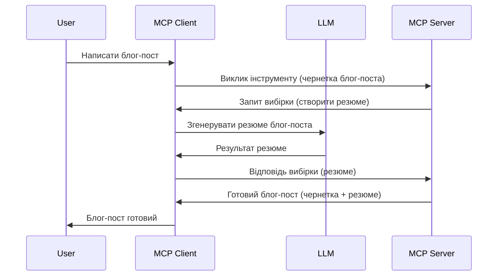

# Sampling - делегування функцій клієнту

Іноді потрібно, щоб MCP Client та MCP Server співпрацювали для досягнення спільної мети. Може виникнути випадок, коли серверу потрібна допомога LLM, який розташований на клієнті. Для такої ситуації варто використовувати sampling.

Давайте розглянемо кілька прикладів використання та як побудувати рішення із залученням sampling.

## Огляд

У цьому уроці ми зосередимося на поясненні, коли і де слід використовувати Sampling, а також як його налаштувати.

## Цілі навчання

У цьому розділі ми:

- Пояснимо, що таке Sampling і коли його використовувати.
- Покажемо, як налаштувати Sampling у MCP.
- Наведемо приклади використання Sampling.

## Що таке Sampling і чому його варто використовувати?

Sampling - це розширена функція, що працює наступним чином:



### Запит Sampling

Отже, тепер, коли ми маємо загальний огляд правдоподібного сценарію, поговоримо про запит sampling, який сервер відсилає назад клієнту. Ось як такий запит може виглядати у форматі JSON-RPC:

```json
{
  "jsonrpc": "2.0",
  "id": 1,
  "method": "sampling/createMessage",
  "params": {
    "messages": [
      {
        "role": "user",
        "content": {
          "type": "text",
          "text": "Create a blog post summary of the following blog post: <BLOG POST>"
        }
      }
    ],
    "modelPreferences": {
      "hints": [
        {
          "name": "claude-3-sonnet"
        }
      ],
      "intelligencePriority": 0.8,
      "speedPriority": 0.5
    },
    "systemPrompt": "You are a helpful assistant.",
    "maxTokens": 100
  }
}
```

Тут варто звернути увагу на кілька моментів:

- Prompt, в полі content -> text, це наш підказка, інструкція для LLM, щоб підсумувати вміст блогу.

- **modelPreferences**. Цей розділ саме так і є — це уподобання, рекомендація, яку конфігурацію варто використовувати з LLM. Користувач може вибрати, слідувати цим рекомендаціям або змінити їх. У цьому випадку є рекомендації щодо моделі для використання та пріоритету між швидкістю і інтелектом.
- **systemPrompt**, це звичайний системний prompt, який задає особистість вашому LLM та містить інструкції.
- **maxTokens**, ще одна властивість, що вказує, скільки токенів рекомендується використовувати для цього завдання.

### Відповідь Sampling

Ця відповідь — це те, що MCP Client повертає MCP Server, і є результатом виклику LLM клієнтом, очікування відповіді і подальшого формування цього повідомлення. Ось як це може виглядати у форматі JSON-RPC:

```json
{
  "jsonrpc": "2.0",
  "id": 1,
  "result": {
    "role": "assistant",
    "content": {
      "type": "text",
      "text": "Here's your abstract <ABSTRACT>"
    },
    "model": "gpt-5",
    "stopReason": "endTurn"
  }
}
```

Зверніть увагу, що відповідь є абстрактом блогу, саме так, як ми й просили. Також зверніть увагу, що використана модель — "gpt-5", а не "claude-3-sonnet", як ми просили. Це ілюструє, що користувач може змінити вибір, а ваш запит sampling є лише рекомендацією.

Отже, тепер, коли ми розуміємо основний потік та корисність використання для завдання “створення блогу + абстракт”, давайте подивимось, що треба зробити, щоб це запрацювало.

### Типи повідомлень

Повідомлення sampling не обмежуються лише текстом — також можна надсилати зображення та аудіо. Ось як JSON-RPC виглядає для різних видів:

**Текст**

```json
{
  "type": "text",
  "text": "The message content"
}
```

**Зображення**

```json
{
  "type": "image",
  "data": "base64-encoded-image-data",
  "mimeType": "image/jpeg"
}
```

**Аудіо**

```json
{
  "type": "audio",
  "data": "base64-encoded-audio-data",
  "mimeType": "audio/wav"
}
```

> NOTE: для докладнішої інформації про Sampling дивіться [офіційну документацію](https://modelcontextprotocol.io/specification/2025-11-25/client/sampling)

## Як налаштувати Sampling у клієнті

> Примітка: якщо ви створюєте лише сервер, тут нічого робити не потрібно.

У клієнті потрібно вказати таку функцію наступним чином:

```json
{
  "capabilities": {
    "sampling": {}
  }
}
```

Це буде враховано при ініціалізації вашого вибраного клієнта з сервером.

## Приклад використання Sampling - створення блогу

Давайте разом кодуємо sampling сервер, нам треба зробити таке:

1. Створити інструмент на сервері.
1. Цей інструмент повинен створювати sampling запит.
1. Інструмент має чекати відповіді на sampling запит клієнта.
1. Потім має бути створено результат інструменту.

Подивимось на код покроково:

### -1- Створення інструменту

**python**

```python
@mcp.tool()
async def create_blog(title: str, content: str, ctx: Context[ServerSession, None]) -> str:
    """Create a blog post and generate a summary"""

```

### -2- Створення sampling запиту

Розширте ваш інструмент наступним кодом:

**python**

```python
post = BlogPost(
        id=len(posts) + 1,
        title=title,
        content=content,
        abstract=""
    )

prompt = f"Create an abstract of the following blog post: title: {title} and draft: {content} "

result = await ctx.session.create_message(
        messages=[
            SamplingMessage(
                role="user",
                content=TextContent(type="text", text=prompt),
            )
        ],
        max_tokens=100,
)

```

### -3- Очікування відповіді і повернення результату

**python**

```python
post.abstract = result.content.text

posts.append(post)

# повернути повний продукт
return json.dumps({
    "id": post.title,
    "abstract": post.abstract
})
```

### -4- Повний код

**python**

```python
from starlette.applications import Starlette
from starlette.routing import Mount, Host

from mcp.server.fastmcp import Context, FastMCP

from mcp.server.session import ServerSession
from mcp.types import SamplingMessage, TextContent

import json


from uuid import uuid4
from typing import List
from pydantic import BaseModel


mcp = FastMCP("Blog post generator")

# app = FastAPI()

posts = []

class BlogPost(BaseModel):
    id: int
    title: str
    content: str
    abstract: str

posts: List[BlogPost] = []

@mcp.tool()
async def create_blog(title: str, content: str, ctx: Context[ServerSession, None]) -> str:
    """Create a blog post and generate a summary"""

    post = BlogPost(
        id=len(posts) + 1,
        title=title,
        content=content,
        abstract=""
    )

    prompt = f"Create an abstract of the following blog post: title: {title} and draft: {content} "

    result = await ctx.session.create_message(
        messages=[
            SamplingMessage(
                role="user",
                content=TextContent(type="text", text=prompt),
            )
        ],
        max_tokens=100,
    )

    post.abstract = result.content.text

    posts.append(post)

    # повернути повний блог-пост
    return json.dumps({
        "id": post.title,
        "abstract": post.abstract
    })

if __name__ == "__main__":
    print("Starting server...")
    # mcp.run()
    mcp.run(transport="streamable-http")

# запустити додаток командою: python server.py
```

### -5- Тестування у Visual Studio Code

Щоб протестувати у Visual Studio Code, зробіть таке:

1. Запустіть сервер у терміналі.
1. Додайте його у *mcp.json* (переконайтесь, що він запущений), наприклад так:

   ```json
   "servers": {
      "blog-server": {
        "type": "http",
        "url": "http://localhost:8000/mcp"
      }
   }
   ```

1. Введіть prompt:

   ```text
   create a blog post named "Where Python comes from", the content is "Python is actually named after Monty Python Flying Circus"
   ```

1. Дайте дозвіл на sampling. При першому запуску вам з’явиться додаткове діалогове вікно, яке потрібно прийняти, після чого побачите звичайне діалогове вікно з проханням запустити інструмент.

1. Перевірте результати. Ви побачите відображені у GitHub Copilot Chat результати, а також зможете подивитися сирий JSON-відповідь.

**Бонус**. Інструменти Visual Studio Code мають чудову підтримку sampling. Ви можете налаштувати доступ до Sampling на вашому встановленому сервері, виконавши такі кроки:

1. Перейдіть у розділ розширень.
1. Виберіть іконку гайкового ключа для вашого встановленого сервера у розділі "MCP SERVERS - INSTALLED".
1. Виберіть "Configure Model Access", тут ви можете обрати, які моделі може використовувати GitHub Copilot при виконанні sampling. Також можна переглянути усі нещодавні запити sampling, вибравши "Show Sampling requests".

## Завдання

У цьому завданні ви створите трошки інший Sampling — інтеграцію sampling для генерації опису продукту. Ось ваш сценарій:

**Сценарій**: Працівнику бекофісу інтернет-магазину потрібна допомога, тому що створення описів продуктів займає надто багато часу. Тож ви маєте побудувати рішення, де можна викликати інструмент "create_product" з аргументами "title" і "keywords", і він має створити повний опис продукту, включаючи поле "description", яке має бути заповнене LLM клієнта.

TIP: використайте те, що ви дізналися раніше, щоб побудувати цей сервер і його інструмент за допомогою sampling запиту.

## Рішення

[Solution](./solution/README.md)

## Основні висновки

Sampling — це потужна функція, яка дозволяє серверу делегувати завдання клієнту, коли йому потрібна допомога LLM.

## Що далі

- [Розділ 4 - Практична реалізація](../../04-PracticalImplementation/README.md)

---

<!-- CO-OP TRANSLATOR DISCLAIMER START -->
**Відмова від відповідальності**:
Цей документ було перекладено за допомогою сервісу штучного інтелекту для перекладу [Co-op Translator](https://github.com/Azure/co-op-translator). Хоча ми прагнемо до точності, будь ласка, майте на увазі, що автоматичні переклади можуть містити помилки або неточності. Оригінальний документ рідною мовою слід вважати авторитетним джерелом. Для критично важливої інформації рекомендується професійний людський переклад. Ми не несемо відповідальності за будь-які непорозуміння або неправильні тлумачення, що виникли внаслідок використання цього перекладу.
<!-- CO-OP TRANSLATOR DISCLAIMER END -->